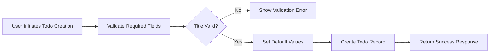
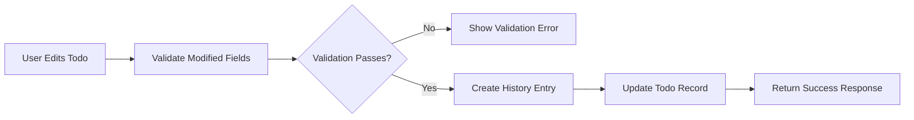
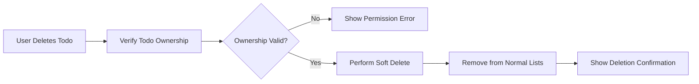
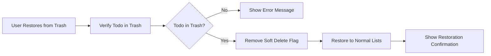
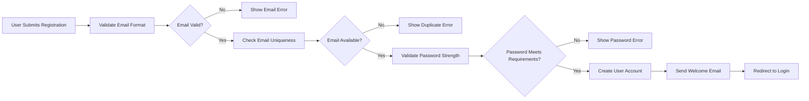
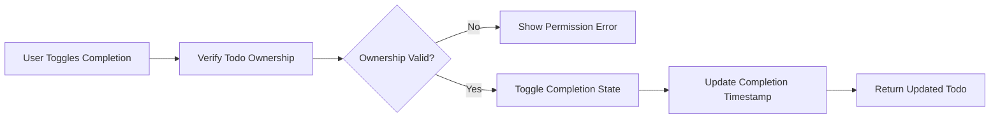

# Business Rules and Validation Requirements

## Introduction

This document defines the comprehensive business rules, validation requirements, and constraints for the multi-user Todo application. These rules govern how the system validates user input, maintains data integrity, and enforces business logic throughout all user interactions.

## Field Validation Rules

### Email Validation
- **WHEN** a user registers with an email address, **THE** system **SHALL** validate the email format using RFC 5322 compliant email validation patterns
- **WHEN** a user attempts to log in, **THE** system **SHALL** validate the email format before processing authentication
- **THE** email validation **SHALL** reject addresses that do not conform to standard email format specifications
- **THE** system **SHALL** ensure email addresses are case-insensitive for uniqueness checks

### Password Validation
- **WHEN** a user creates or changes a password, **THE** system **SHALL** enforce minimum password requirements
- **THE** password **SHALL** be at least 8 characters in length
- **THE** password **SHALL** contain at least one uppercase letter, one lowercase letter, and one number
- **THE** system **SHALL** reject passwords that do not meet these complexity requirements
- **THE** system **SHALL** prevent the use of common passwords or dictionary words

### Display Name Validation
- **WHEN** a user sets or updates their display name, **THE** system **SHALL** validate the name format
- **THE** display name **SHALL** be between 1 and 50 characters in length
- **THE** display name **SHALL** allow alphanumeric characters, spaces, hyphens, and apostrophes
- **THE** system **SHALL** reject display names containing prohibited characters or patterns
- **THE** system **SHALL** trim leading and trailing whitespace from display names

### Todo Title Validation
- **WHEN** a user creates or edits a todo, **THE** system **SHALL** validate the title field
- **THE** title **SHALL** be required and cannot be empty
- **THE** title **SHALL** be between 1 and 200 characters in length
- **THE** system **SHALL** reject titles that exceed the maximum length
- **THE** system **SHALL** trim leading and trailing whitespace from titles
- **THE** system **SHALL** reject titles consisting only of whitespace characters

### Todo Description Validation
- **WHEN** a user creates or edits a todo description, **THE** system **SHALL** validate the description field
- **THE** description **SHALL** be optional and can be left empty
- **THE** description **SHALL** have a maximum length of 2000 characters
- **THE** system **SHALL** reject descriptions that exceed the maximum length
- **THE** system **SHALL** allow line breaks and basic formatting in descriptions

### Date Validation
- **WHEN** a user sets a start date or due date, **THE** system **SHALL** validate the date format
- **THE** dates **SHALL** be stored in ISO 8601 format (YYYY-MM-DD)
- **THE** system **SHALL** reject dates that are not valid calendar dates
- **THE** system **SHALL** validate that due dates are not before start dates when both are provided
- **THE** system **SHALL** handle timezone considerations consistently using UTC
- **THE** system **SHALL** reject dates in the past for start dates (optional validation)

## Business Logic Constraints

### User Account Constraints
- **THE** system **SHALL** ensure that each email address can only be associated with one user account
- **WHEN** a user attempts to register with an existing email, **THE** system **SHALL** prevent account creation
- **THE** system **SHALL** maintain referential integrity between users and their todos
- **WHEN** a user account is deleted, **THE** system **SHALL** permanently delete all associated data

### Todo Ownership Constraints
- **THE** system **SHALL** enforce that todos can only be accessed by their owning user
- **WHEN** a user attempts to access another user's todo, **THE** system **SHALL** deny access
- **THE** system **SHALL** ensure that todo edit history is only accessible to the todo owner
- **THE** system **SHALL** validate ownership on every todo operation (CRUD operations)

### Completion State Constraints
- **THE** system **SHALL** maintain that todos have exactly two states: incomplete or complete
- **WHEN** a todo is created, **THE** system **SHALL** set it to incomplete by default
- **THE** completion state toggle **SHALL** be atomic and consistent
- **THE** system **SHALL** prevent concurrent modification of completion state

### Edit History Constraints
- **WHEN** a todo is edited, **THE** system **SHALL** create a history entry for each field that changes
- **THE** history entry **SHALL** record only the fields that were actually modified
- **THE** system **SHALL** maintain the chronological order of edit history
- **WHEN** a todo is permanently deleted, **THE** system **SHALL** delete all associated history entries
- **THE** history entries **SHALL** be immutable once created

### Soft Delete Constraints
- **WHEN** a user deletes a todo, **THE** system **SHALL** perform a soft delete
- **THE** soft-deleted todo **SHALL** not appear in normal todo lists
- **THE** system **SHALL** maintain the soft delete state until permanent deletion or restoration
- **THE** system **SHALL** prevent access to soft-deleted todos through normal list operations

## Data Integrity Requirements

### User-Todo Relationship Integrity
- **THE** system **SHALL** ensure that every todo has exactly one owning user
- **THE** system **SHALL** prevent orphaned todos (todos without a valid owner)
- **WHEN** a user account is deleted, **THE** system **SHALL** delete all associated todos and their history
- **THE** system **SHALL** enforce foreign key constraints between users and todos

### Edit History Integrity
- **THE** system **SHALL** maintain a complete audit trail of todo modifications
- **EACH** history entry **SHALL** be immutable once created
- **THE** system **SHALL** prevent modification or deletion of historical records
- **THE** system **SHALL** ensure history entries accurately reflect the state change

### Date Consistency
- **THE** system **SHALL** ensure that start dates and due dates maintain temporal consistency
- **WHEN** both start and due dates are set, **THE** system **SHALL** validate that the due date is not before the start date
- **THE** system **SHALL** handle timezone considerations consistently
- **THE** system **SHALL** prevent setting invalid date combinations

## Workflow Constraints

### Todo Creation Workflow

### Todo Editing Workflow

### Todo Deletion Workflow

### Todo Restoration Workflow

### User Registration Workflow

### Todo Completion Workflow

## System Limitations

### Pagination Limits
- **THE** system **SHALL** implement pagination for todo lists with a maximum of 50 items per page
- **THE** system **SHALL** provide consistent pagination behavior across all list views
- **THE** pagination **SHALL** maintain sort order and filter consistency between pages
- **THE** system **SHALL** support pagination metadata including total count and page numbers

### Storage Limitations
- **THE** system **SHALL** support a maximum of 10,000 todos per user
- **THE** system **SHALL** enforce storage quotas to prevent resource exhaustion
- **WHEN** storage limits are approached, **THE** system **SHALL** provide appropriate notifications
- **THE** system **SHALL** prevent creation of new todos when storage limits are reached

### Performance Constraints
- **THE** system **SHALL** load todo lists within 2 seconds under normal load
- **THE** system **SHALL** handle concurrent user operations without data corruption
- **THE** edit history **SHALL** not significantly impact todo operation performance
- **THE** system **SHALL** implement efficient indexing for common query patterns

### Concurrent Access Constraints
- **THE** system **SHALL** prevent race conditions during todo state changes
- **WHEN** multiple users attempt to modify the same todo simultaneously, **THE** system **SHALL** handle conflicts appropriately
- **THE** system **SHALL** maintain data consistency during concurrent operations
- **THE** system **SHALL** implement optimistic locking for edit operations

## Error Handling Requirements

### Validation Error Handling
- **WHEN** field validation fails, **THE** system **SHALL** return specific error messages indicating which field failed and why
- **THE** error messages **SHALL** be user-friendly and actionable
- **THE** system **SHALL** return all validation errors in a single response

### Permission Error Handling
- **WHEN** a user attempts to access unauthorized resources, **THE** system **SHALL** return appropriate permission denied errors
- **THE** permission errors **SHALL** not reveal sensitive information about the existence of resources
- **THE** system **SHALL** log permission violations for security monitoring

### System Error Handling
- **WHEN** system errors occur, **THE** system **SHALL** return generic error messages to users
- **THE** system **SHALL** log detailed error information for debugging purposes
- **THE** system **SHALL** implement graceful degradation when non-critical components fail

## Cross-Document References

For detailed information on specific areas, please refer to the following documents:

- [User Actors and Authentication Documentation](./02-user-actors-authentication.md) - For user account management rules
- [Todo Creation and Management Documentation](./03-todo-creation-management.md) - For todo creation workflows
- [Todo Completion and Editing Documentation](./04-todo-completion-editing.md) - For completion and editing logic
- [Deletion and Trash Management Documentation](./05-deletion-trash-management.md) - For deletion and restoration rules
- [Filtering and Sorting Capabilities Documentation](./06-filtering-sorting-capabilities.md) - For display logic constraints
- [Privacy and Data Isolation Documentation](./07-privacy-data-isolation.md) - For privacy enforcement rules

## Summary of Critical Business Rules

| Rule Category | Key Constraints | Validation Requirements |
|---------------|-----------------|-------------------------|
| **User Accounts** | Unique emails, password complexity | Email format, password strength, display name format |
| **Todo Creation** | Required title, optional fields | Title length, description limits, date validation |
| **Data Integrity** | Ownership enforcement, no orphans | User-todo relationship validation, foreign key constraints |
| **Edit History** | Immutable records, field-level tracking | Change detection, chronological order, audit trail integrity |
| **Privacy** | Strict data isolation | Ownership verification on every access, permission enforcement |
| **Performance** | Response time guarantees | Pagination limits, storage quotas, concurrent access handling |
| **Error Handling** | Specific error messages | Validation feedback, permission errors, system error management |

These business rules and validation requirements ensure the Todo application maintains data integrity, provides consistent user experience, and enforces the privacy and security requirements specified throughout the system documentation.

## Implementation Guidelines

### Validation Layer Implementation
- **THE** validation layer **SHALL** be implemented at the API boundary
- **THE** system **SHALL** validate all incoming requests before processing
- **THE** validation rules **SHALL** be consistent across all API endpoints

### Business Logic Implementation
- **THE** business logic **SHALL** be centralized in service layers
- **THE** system **SHALL** enforce business rules consistently across all operations
- **THE** business logic **SHALL** be testable and maintainable

### Data Integrity Implementation
- **THE** system **SHALL** implement database constraints where appropriate
- **THE** application layer **SHALL** enforce business rules beyond database constraints
- **THE** system **SHALL** implement transaction management for multi-step operations

### Performance Optimization
- **THE** system **SHALL** implement appropriate indexing strategies
- **THE** pagination implementation **SHALL** be efficient for large datasets
- **THE** system **SHALL** cache frequently accessed data where appropriate

These implementation guidelines ensure that the business rules and validation requirements are consistently enforced throughout the application architecture, providing a robust and reliable user experience while maintaining data integrity and system performance.