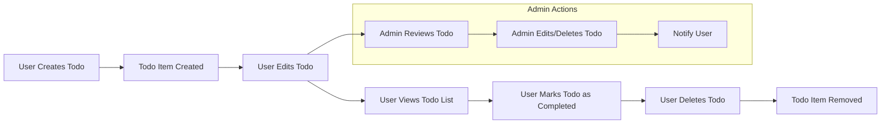
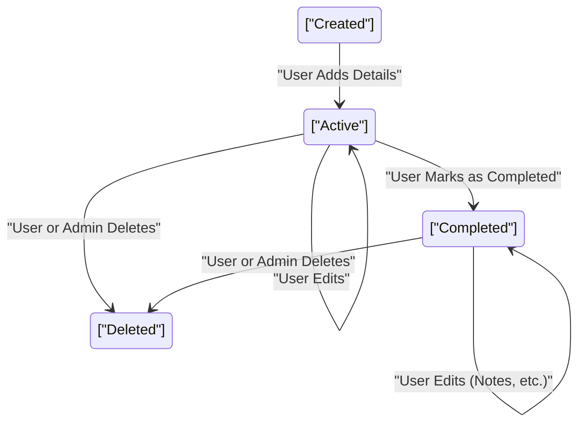

# Todo List Minimum Requirements

## Introduction
Track personal tasks efficiently via a simple web service. Designed for users needing a bare-bones yet reliable way to manage, complete, and remove to-dos with administrative oversight for compliance or moderation. All requirements expressed for minimum-viable functionality: just enough for a robust personal Todo list with basic admin support.

**Stakeholders:**
- **User:** An individual creating, viewing, updating, and managing their personal todo list.
- **Admin:** A system role responsible solely for policy enforcement or moderation purposes, never for regular todo management.

## Scope
The Todo List system includes only the most essential features:
- Users manage (create, inspect, update, complete, and delete) their own todo items
- Strict data separation per user; no data-sharing between users
- Admins intervene only for moderation, compliance audit, or exceptional customer support

Features NOT in scope:
- Collaboration between users
- File/image attachments
- Task assignment or delegation
- Reminders/notifications beyond admin policy actions
- Any features beyond CRUD for todo items + admin moderation

## Business Requirements

### User Processes
- WHEN a user creates a todo, THE system SHALL store it solely under that user's ownership and make it visible only to that user, unless an admin review event occurs per business policy.
- WHEN a user views their todo list, THE system SHALL display all their todos in order (e.g., by creation date, unless preferences exist), ensuring no other user's data is included or viewable.
- WHEN a user edits one of their todos, THE system SHALL update only the relevant item while maintaining an audit trail for change tracking.
- WHEN a user marks a todo as completed, THE system SHALL record the completion status, timestamp, and enable clear representation in the user's view.
- WHEN a user deletes one of their todos, THE system SHALL irreversibly remove that item from storage unless retention is required by business rule.

### Admin Processes
- WHEN an admin accesses a user's todo for audit, moderation, or remedial action as defined by policy, THE system SHALL always log the intervention and notify the affected user with business-appropriate detail.
- WHEN an admin edits or deletes a user's todo for compliance reasons, THE system SHALL carry out the change, maintain a log, and send a notification to that user per business rule.
- IF an admin or user triggers an exceptional workflow (e.g., prohibited content), THE system SHALL document the action, outcomes, and notifications for audit.

## Conceptual Data Flow and Lifecycle

### Diagram: Main Data Movement

### Lifecycle States & Transitions
- **Created:** A task is created, based solely on user action.
- **Active:** A user-monitorable task, awaiting completion or update.
- **Completed:** User marks as done; item still visible but flagged.
- **Deleted:** Task erased permanently via user or admin (with retention notice if not possible).

### Key Business Events
| Event                 | Actor    | Description                                                 | System Actions                                              |
|-----------------------|----------|-------------------------------------------------------------|-------------------------------------------------------------|
| Todo Creation         | User     | User adds a todo                                            | Stores under user; displays immediately                     |
| Todo Edit             | User     | Any changes to title/description/status of their own todo   | Updates tracked attribute(s); logs with timestamp           |
| Todo Completion       | User     | Task flagged finished by user                               | Status changed; timestamp added; shown as completed         |
| Todo Deletion         | User/Admin| Todo permanently removed (unless policy mandates retention) | Data erased (or locked under retention); user notified if admin|
| Admin Action          | Admin    | Action by admin (edit/delete for moderation/compliance)     | Action logged; user notified per business policy            |
| Invalid Operation     | Any      | Any out-of-scope or unauthorized action                     | Error returned; appropriate user-facing message             |

### Error and Exception Handling
- IF a user tries to modify or delete another user's todo, THEN THE system SHALL always deny the action and return a clear error.
- IF a user or admin attempts to modify a non-existent task, THEN THE system SHALL return an error and log the attempt for audit trail.
- WHEN admin removes tasks for policy violation, THE user SHALL receive an actionable notification stating reason (not technical details).

## Performance, Notifications & Responsiveness
- WHEN any action is performed (create, edit, complete, delete), THE system SHALL update user views within 1 second of event completion wherever technically feasible.
- WHEN an admin action affects a user's data, THE user SHALL receive a notification within 1 second of the event.
- THE system SHALL not provide any notifications for regular tasks unless triggered by admin moderation

## Business Rules & Constraints
- Todo items SHALL only be accessible, editable, and deletable by their owner, except for admin policy interventions.
- Admins SHALL only perform interventions with full audit logging and user notification per policy rules.
- Permanent deletion SHALL mean data is completely removed, unless a business-justified retention rule suspends erasure; in such cases, the system clearly informs the user of the exception.
- Editing or completing todos SHALL never affect any item not owned by the acting user.
- Admins SHALL be restricted from creating personal todos, and can only moderate or audit as business policy dictates.
- Any attempt to view, modify, or delete beyond user’s own scope SHALL result in actionable, clear errors without technical jargon.

## Summary
A minimum Todo List service consists of user-specific CRUD operations on todos, enforced by strong ownership and business rule boundaries, and administratively auditable for policy-driven intervention only. All business logic is articulated in plain language with user-facing outcomes and admin auditability for every key workflow. No unnecessary features or technical details included.