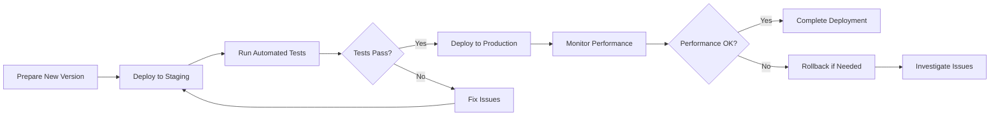

# Todo Application Implementation Guidelines

## 1. Implementation Approach

### 1.1 Core Implementation Strategy
The Todo application implementation shall follow a phased approach focused on delivering minimum viable functionality first, then iteratively enhancing based on user feedback and performance metrics.

### 1.2 Development Methodology
**WHEN** implementing the Todo application, **THE** development team **SHALL** employ an agile methodology with two-week sprint cycles.

**THE** implementation **SHALL** prioritize core functionality in the following order:
1. User authentication and session management
2. Basic todo CRUD operations (Create, Read, Update, Delete)
3. Todo status management (active/completed)
4. Data persistence and synchronization
5. Error handling and recovery mechanisms

### 1.3 Technical Architecture Principles
**THE** system architecture **SHALL** adhere to the following principles:
- **Simplicity First**: Minimize complexity by avoiding unnecessary abstractions
- **Scalability Ready**: Design for potential growth while maintaining current simplicity
- **Security by Design**: Implement security measures from the beginning
- **Maintainability Focus**: Ensure code is readable and well-documented

### 1.4 Quality Assurance Integration
**WHILE** developing the application, **THE** team **SHALL** integrate continuous testing and quality assurance:
- Automated unit tests for all core functionality
- Integration tests for user workflows
- Performance testing under expected load conditions
- Security testing for authentication and data protection

## 2. Deployment Considerations

### 2.1 Environment Strategy
**THE** deployment **SHALL** utilize a three-environment approach:
- **Development Environment**: For ongoing feature development and testing
- **Staging Environment**: For pre-production testing and validation
- **Production Environment**: For live user access

### 2.2 Deployment Process
**WHEN** deploying new versions, **THE** system **SHALL** follow a zero-downtime deployment strategy:

### 2.3 Infrastructure Requirements
**THE** deployment infrastructure **SHALL** meet the following specifications:
- **Server Capacity**: Support for up to 1,000 concurrent users
- **Database Performance**: Handle up to 10,000 registered users with 1,000 todos each
- **Network Requirements**: Minimum 100Mbps bandwidth for data transmission
- **Storage Capacity**: Adequate storage for user data and application logs

### 2.4 Configuration Management
**WHEN** managing application configuration, **THE** system **SHALL**:
- Store configuration separately from code
- Use environment-specific configuration files
- Implement secure handling of sensitive configuration data
- Provide configuration validation during application startup

## 3. Operational Requirements

### 3.1 System Monitoring
**THE** operational team **SHALL** implement comprehensive monitoring covering:
- **Application Performance**: Response times, error rates, throughput
- **System Resources**: CPU usage, memory consumption, disk space
- **User Activity**: Active users, todo operations, session duration
- **Business Metrics**: User registration, todo completion rates

### 3.2 Alerting and Notification
**WHEN** system issues occur, **THE** monitoring system **SHALL**:
- Generate alerts for critical errors and performance degradation
- Notify appropriate team members through multiple channels
- Provide detailed context for troubleshooting
- Escalate unresolved issues according to defined procedures

### 3.3 Backup and Recovery
**THE** system **SHALL** implement robust backup procedures:
- **Daily Backups**: Complete system backups including user data
- **Incremental Backups**: Hourly incremental backups for recent changes
- **Backup Verification**: Regular verification of backup integrity
- **Recovery Testing**: Quarterly testing of disaster recovery procedures

### 3.4 Security Operations
**WHILE** operating the application, **THE** team **SHALL**:
- Monitor for security threats and vulnerabilities
- Apply security patches promptly
- Conduct regular security audits
- Maintain incident response procedures

## 4. Monitoring and Maintenance

### 4.1 Performance Monitoring
**THE** system **SHALL** continuously monitor performance metrics:
- **Response Times**: Ensure todo operations complete within 1 second
- **Uptime**: Maintain 99.9% availability target
- **Resource Usage**: Monitor CPU, memory, and storage utilization
- **User Experience**: Track page load times and interface responsiveness

### 4.2 Maintenance Procedures
**WHEN** performing system maintenance, **THE** team **SHALL**:
- Schedule maintenance during low-usage periods
- Provide advance notice to users
- Implement rolling updates to minimize disruption
- Maintain rollback capabilities for failed updates

### 4.3 Capacity Planning
**THE** operations team **SHALL** conduct regular capacity planning:
- Monitor user growth trends and resource consumption
- Forecast future capacity requirements
- Plan infrastructure upgrades based on growth projections
- Implement auto-scaling where appropriate

### 4.4 Incident Management
**IF** system incidents occur, **THEN THE** team **SHALL**:
- Follow defined incident response procedures
- Communicate status updates to stakeholders
- Document root cause analysis
- Implement preventive measures for future incidents

## 5. Future Enhancement Roadmap

### 5.1 Phase 1: Core Functionality (Months 1-3)
**THE** initial implementation **SHALL** focus on delivering:
- User registration and authentication
- Basic todo creation, viewing, and management
- Todo status tracking (active/completed)
- Data persistence and session management

### 5.2 Phase 2: Enhanced Features (Months 4-6)
**WHERE** user feedback indicates need, **THE** system **SHALL** add:
- Todo categorization and organization
- Search and filtering capabilities
- Due dates and reminder functionality
- Mobile-responsive design improvements

### 5.3 Phase 3: Advanced Capabilities (Months 7-12)
**BASED ON** user adoption and feature requests, **THE** roadmap **SHALL** consider:
- Mobile application development
- Team collaboration features
- Integration with calendar systems
- Advanced reporting and analytics

### 5.4 Enhancement Prioritization
**WHEN** evaluating enhancement requests, **THE** team **SHALL** consider:
- **User Value**: Impact on user experience and satisfaction
- **Implementation Complexity**: Development effort and risk
- **Alignment with Vision**: Consistency with minimal functionality philosophy
- **Technical Debt**: Opportunity to improve code quality and maintainability

## 6. Risk Assessment and Mitigation

### 6.1 Technical Risks

#### Data Loss Risk
**IF** data loss occurs, **THEN THE** system **SHALL**:
- Implement comprehensive backup procedures
- Maintain multiple backup copies in different locations
- Test recovery procedures regularly
- Provide data export functionality for users

**Mitigation Strategies**:
- Automated daily backups with verification
- Point-in-time recovery capability
- Geographic redundancy for critical data
- Regular disaster recovery testing

#### Security Vulnerabilities
**WHEN** security threats are identified, **THE** system **SHALL**:
- Implement prompt security patches
- Conduct regular vulnerability assessments
- Monitor for suspicious activity
- Maintain incident response procedures

**Mitigation Strategies**:
- Regular security updates and patches
- Web application firewall implementation
- Security monitoring and alerting
- User education on security best practices

### 6.2 Performance Risks

#### Scalability Challenges
**IF** user growth exceeds expectations, **THEN THE** system **SHALL**:
- Monitor performance metrics continuously
- Implement auto-scaling where feasible
- Optimize database queries and application code
- Plan infrastructure upgrades proactively

**Mitigation Strategies**:
- Performance testing under expected load
- Database optimization and indexing
- Caching strategies for frequently accessed data
- Load balancing across multiple servers

#### Availability Issues
**WHEN** system availability is compromised, **THE** team **SHALL**:
- Implement redundancy for critical components
- Monitor system health continuously
- Maintain backup systems for failover
- Establish service level objectives and agreements

**Mitigation Strategies**:
- Multi-region deployment for geographic redundancy
- Automated failover procedures
- Comprehensive monitoring and alerting
- Regular availability testing

### 6.3 Business Risks

#### User Adoption Challenges
**IF** user adoption is lower than expected, **THE** team **SHALL**:
- Gather user feedback through surveys and analytics
- Implement improvements based on user suggestions
- Conduct user testing to identify pain points
- Adjust marketing and onboarding strategies

**Mitigation Strategies**:
- User-centric design and continuous improvement
- A/B testing for feature enhancements
- Clear communication of value proposition
- Responsive customer support

#### Competitive Pressure
**WHEN** facing competition from established tools, **THE** application **SHALL**:
- Maintain focus on simplicity and user experience
- Differentiate through specialized functionality
- Build community around the product
- Continuously innovate based on user needs

**Mitigation Strategies**:
- Clear positioning against competitors
- Focus on specific user segments
- Regular feature updates and improvements
- Strong user community engagement

### 6.4 Operational Risks

#### Team Capability Gaps
**IF** team skills are insufficient for implementation, **THE** organization **SHALL**:
- Provide training and skill development opportunities
- Hire additional expertise where needed
- Establish mentoring and knowledge sharing
- Document processes and procedures thoroughly

**Mitigation Strategies**:
- Comprehensive documentation and knowledge base
- Cross-training among team members
- External training and certification programs
- Strategic hiring for critical skill gaps

#### Budget and Resource Constraints
**WHEN** facing resource limitations, **THE** project **SHALL**:
- Prioritize features based on user value
- Implement efficient development practices
- Leverage open-source tools and frameworks
- Plan for scalable resource allocation

**Mitigation Strategies**:
- Agile prioritization of features
- Efficient resource utilization
- Strategic technology selection
- Phased implementation approach

## 7. Success Measurement Framework

### 7.1 Key Performance Indicators
**THE** implementation success **SHALL** be measured using:
- **User Adoption**: Number of active users and registration growth
- **User Engagement**: Session duration and todo completion rates
- **System Performance**: Response times and availability metrics
- **User Satisfaction**: Feedback scores and support ticket volume

### 7.2 Continuous Improvement Process
**WHILE** operating the application, **THE** team **SHALL**:
- Regularly review performance metrics and user feedback
- Identify areas for improvement and optimization
- Implement enhancements based on data-driven decisions
- Measure impact of changes on key performance indicators

### 7.3 Quality Standards
**THE** implementation **SHALL** maintain quality through:
- Code review processes and quality gates
- Automated testing with comprehensive coverage
- Performance benchmarking and optimization
- Security testing and vulnerability assessment

## 8. Conclusion

This implementation guidelines document provides the framework for successfully deploying and operating the Todo application. By following these guidelines, the implementation team can ensure that the application meets business requirements while maintaining the principles of simplicity, reliability, and user focus that define its value proposition.

The guidelines emphasize a phased approach to implementation, comprehensive operational procedures, and continuous improvement based on user feedback and performance metrics. This ensures that the application can evolve to meet user needs while maintaining its core commitment to minimal, effective functionality.

> *Developer Note: This document defines implementation guidelines only. All technical decisions regarding architecture, technology stack, and implementation details are at the discretion of the development team.*