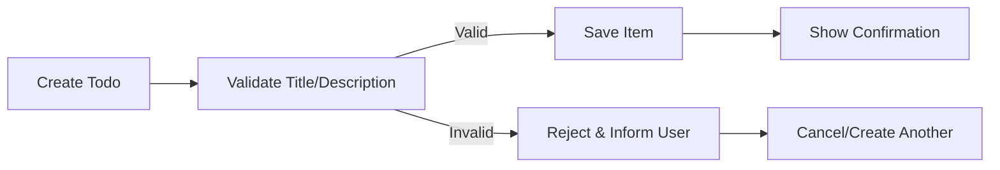
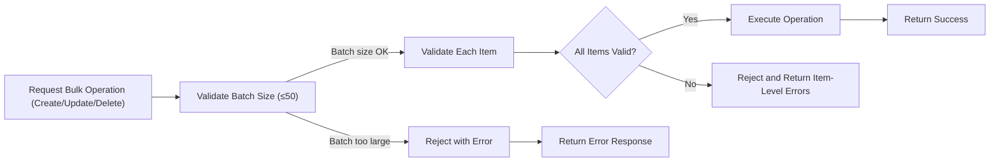
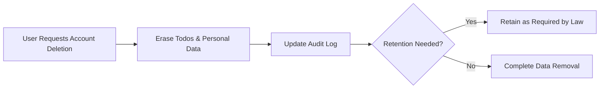

# Todo List Application - Requirements Analysis

## 1. Introduction
The Todo List backend service delivers a minimal, production-grade solution for managing task items. Its objective is to enable users to reliably create, view, update, complete, and delete personal todo items with absolute attention to robustness, operational boundaries, and compliance. The focus is to establish a solid foundation for future extensibility while preserving simplicity.

## 2. User Actors & Service Scope

### User Actors
- **End User (Member):** A person with an account who manages their own todos. Can perform all CRUD (Create, Read, Update, Delete) operations on their own data.
- **Admin:** System administrator with elevated access for regulatory, support, or operational oversight. May access all users’ todos for compliance or support purposes and can execute privileged bulk operations.

### Service Scope
The Todo List application includes only the following required features:
  - Todo item creation, viewing, updating, deletion
  - Completion/incompletion state management
  - Personal and administrative (admin) access levels
  - Bulk operation support (on owned items only; elevated for admin)
  - Data privacy, basic audit, and regulatory compliance support
No advanced/optional features (e.g., notification, collaboration, advanced search) are included in this minimal viable version.

## 3. Functional Requirements (EARS Format)

### Todo Creation (Single and Bulk)
- WHEN a user creates a single todo, THE system SHALL allow input of a title (≤100 characters) and description (≤1,000 characters), both validated. Blanks and invalid entries SHALL be rejected.
- WHEN a user submits a batch creation of todos, THE system SHALL accept up to 50 items per request and reject larger batches with a clear error. IF any item in the batch fails validation, THEN THE system SHALL reject the entire batch and return item-level feedback indicating validation failures.

### Todo Updating
- WHEN a user requests update to their own todo, THE system SHALL validate title and description limits, disallow blank/invalid content, and confirm user ownership. IF the item does not belong to the user or does not exist, THEN THE system SHALL return an access denied or not found error.
- WHEN an admin requests an update, THE system SHALL validate business logic as for a user, but apply update to any item in the system subject to audit logging.
- WHEN a batch update is requested (e.g., to mark multiple todos as done/undone), THE system SHALL allow up to 50 items per operation, apply validations to each item, and reject the whole batch if any fail (as with creation rules).

### Todo Deletion
- WHEN a user requests deletion, THE system SHALL allow deletion of their own todos only, enforcing a maximum of 50 items per batch. If more, reject the request with explanation. Empty deletion requests SHALL be rejected.
- WHEN an admin deletes todos, THE system SHALL permit deletion of any todo, requiring audit trail recording for each operation.

### Todo State Transition
- WHEN a user toggles state (complete/incomplete), THE system SHALL verify ownership and only apply transitions to their own items. Attempted transitions of deleted/archived items SHALL be rejected.
- IF an admin toggles state, THE system SHALL record the action for audit purposes and allow override as required for support.

#### Core Flows (Mermaid)

### Todo Retrieval, Listing, and Pagination
- WHEN a user lists their todos, THE system SHALL return only their own items, paginated with a default size of 20 and efficiently supporting up to 1,000 items per user. IF page requested exceeds available data, return an empty set.
- WHEN an admin lists todos, THE system SHALL support full access for compliance monitoring or support, respecting data privacy regulations.

### Error and Validation Handling
- WHEN a request violates field limits, business rule, or ownership, THE system SHALL reject the request and clearly inform the user about the error with actionable feedback.
- WHEN item IDs do not exist, belong to another user, or reference deleted/archived items, THE system SHALL return not found or unauthorized.
- WHEN concurrent actions (edit/delete) occur on the same item, THE system SHALL ensure atomic operation; only the first committed succeeds, later requests fail with error.

### Bulk Operations (General)
- WHEN a bulk operation is initiated, THE system SHALL enforce a maximum batch size of 50. Exceeding batches are rejected with a clear message. For all-or-nothing operation semantics, if any single validation fails, the process is rejected and item-wise feedback must be provided.

#### Bulk Operation Flow (Mermaid)

## 4. Non-Functional & Operational Requirements

### Performance
- WHEN the system is under normal usage, THE system SHALL keep error rates below 1%, support up to 100,000 active users, and scale to at least 1,000 todos per user without functional degradation.
- WHEN data volume or operation rate exceeds these, THE system SHALL rate-limit or block excess requests, providing users with context about the restriction and expected reset interval.

### Scalability
- THE system SHALL be designed for easy configuration of user limits, batch sizes, and other operation boundaries without code rewrites.
- WHEN faced with temporary surges (e.g., media coverage), THE system SHALL degrade gracefully by slowing operations/rate-limiting but must not lose or corrupt data.
- All system timestamps SHALL be recorded in Asia/Seoul timezone using ISO 8601 format.

### Reliability & Availability
- THE Todo List SHALL have >99.5% monthly uptime, with robust error handling for user and system failures.

### Data Retention & Auditability
- WHEN a user’s account is deleted, THE system SHALL promptly and permanently remove their todos and personal details, unless retention is legally required. Admin operations SHALL be fully audit-logged, recording actor identity, timestamp, and nature of each change.
- WHEN required by law, THE system SHALL allow users to export their data in a structured format (JSON/CSV).

### Legal/Compliance Requirements
- THE system SHALL store only minimum required personal data, provide audit trails for all admin access, and maintain operational history per current and anticipated regulatory needs, including GDPR-equivalent requirements and data localization if required.

#### Compliance Flow (Mermaid)

## 5. Special Scenarios & Edge Case Handling

### Empty States
- WHEN a user with no todos accesses the system, THE system SHALL display an empty set with no errors.

### Input Boundary Conditions
- THE system SHALL enforce maximum title (100 characters) and description (1,000 characters) limits, prohibit whitespace-only entries, and must reject any field exceeding these boundaries with specific error description.

### Pagination
- WHEN users have more than 20 items, THE system SHALL paginate results. For requests with out-of-range page numbers, return an empty set without errors.

### Orphaned and Nonexistent Items
- WHEN referencing a non-existent or deleted todo, or one not belonging to the user, THE system SHALL return not found or unauthorized.
- Deleted/archived items cannot be modified except by admin (with full audit trail).

### Concurrent Modification
- WHEN two actions target the same item at the same time, THE system SHALL allow only the first successful one; other(s) receive a conflict error with clear feedback.

### Edge Case Summary Table
| Scenario                                   | System Behavior                                     |
|--------------------------------------------|-----------------------------------------------------|
| Empty batch submission                     | Reject with error, notify user                      |
| Exceeding batch size (>50)                 | Reject with error, inform batch size limit          |
| Too long todo title                        | Reject, specify max 100 chars in error              |
| Special character/blank-only title         | Reject if validation fails                          |
| Concurrent requests on same todo           | Only one allowed, remainder error                   |
| Query with no results                      | Return empty set, no error                          |
| Referencing not found/other’s item         | Return not found/unauthorized                       |
| Exceeding pagination parameters            | Return empty list, no error                         |

## 6. Security & Authentication
- WHEN a user interacts with the system, THE system SHALL require authentication for all mutating operations.
- THE system SHALL enforce actor-based access control—non-admins can access/manipulate only their own items.
- Admins MAY perform privileged actions (bulk, cross-user access) only with full audit trail and notifications where appropriate.
- Data privacy standards SHALL apply in all operations; all access, creation, updating, and deletion SHALL be properly authorized.
- WHEN a user requests data export or deletion, THE system SHALL verify identity and intent via secure authentication prior to processing.

## 7. Conclusion
The above requirements provide backend developers with a production-grade, stable, and extensible foundation for a Todo List application, focusing on a minimal, robust set of features. Extensions (such as notifications, collaboration, or analytics) are explicitly out of scope for this version and can be considered in future enhancements.