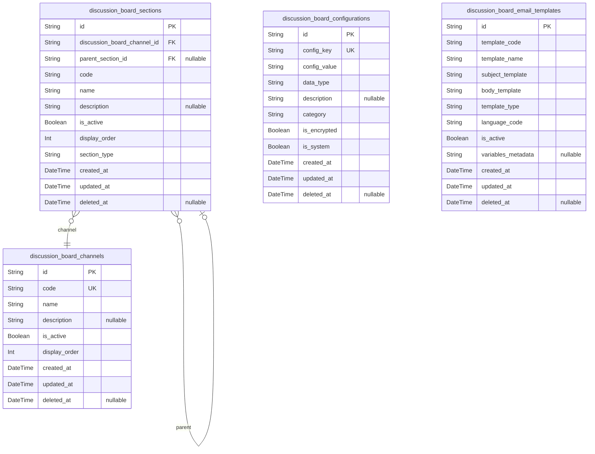
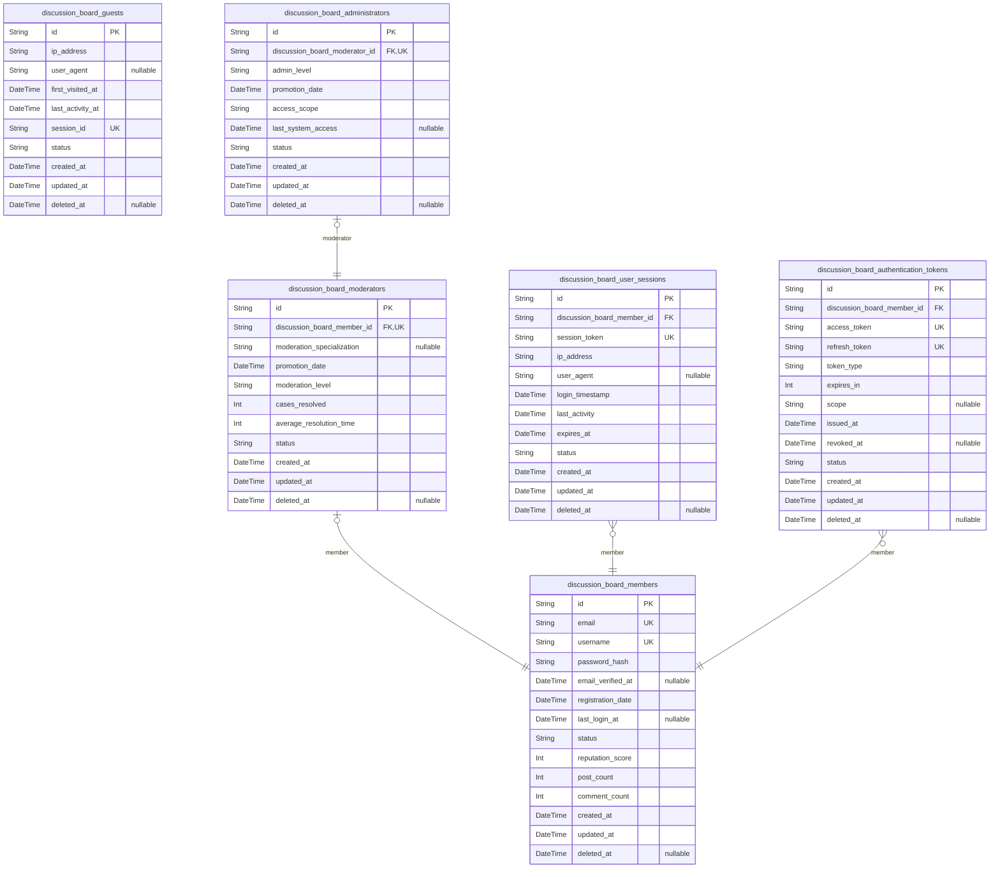
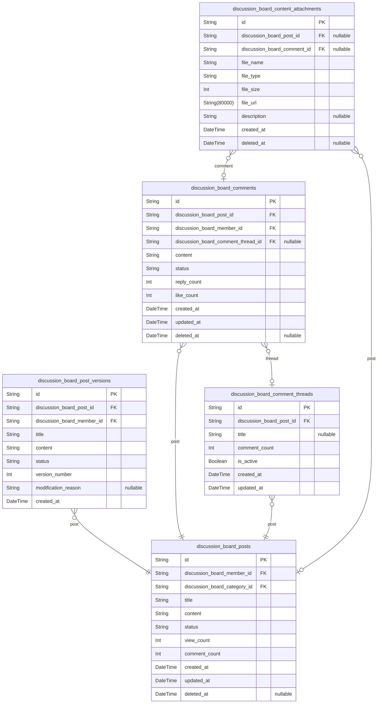
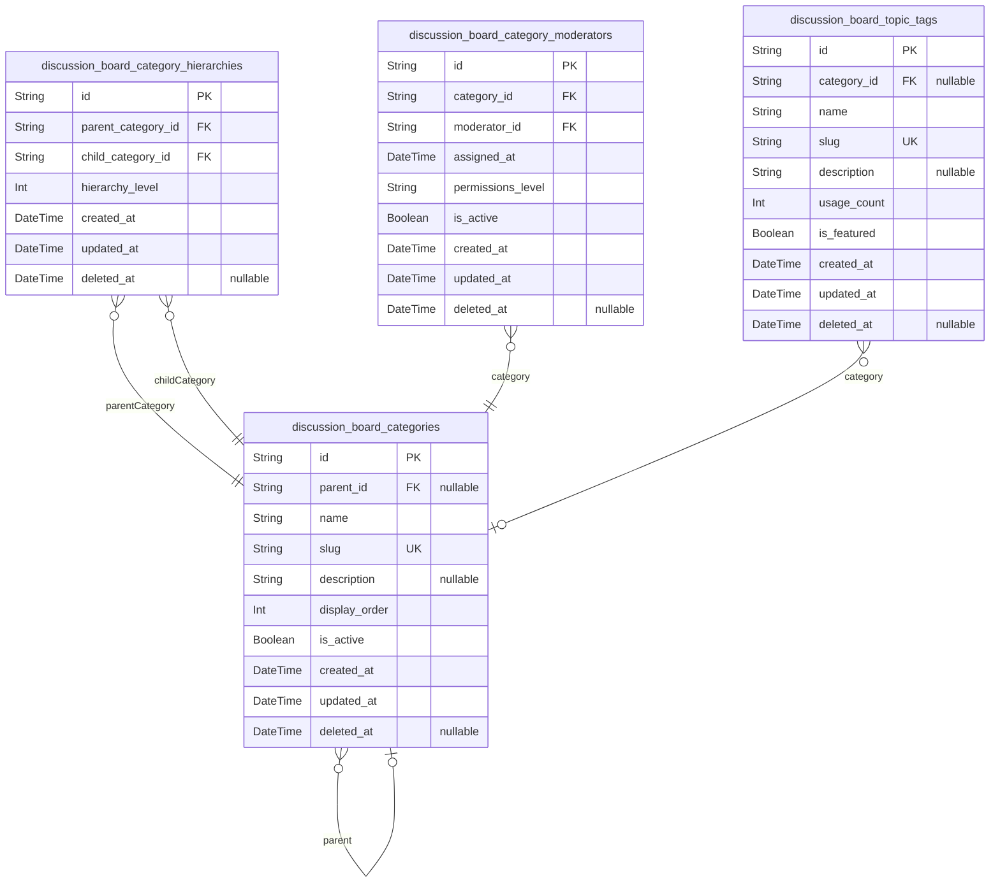
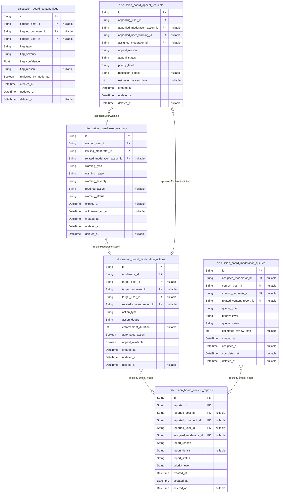
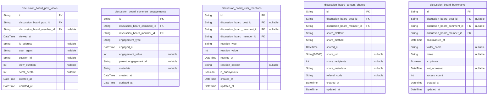
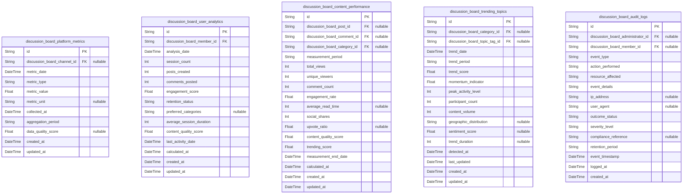
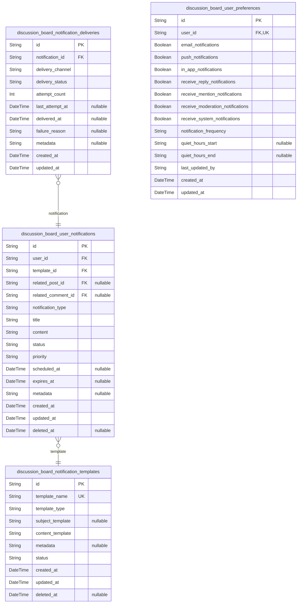
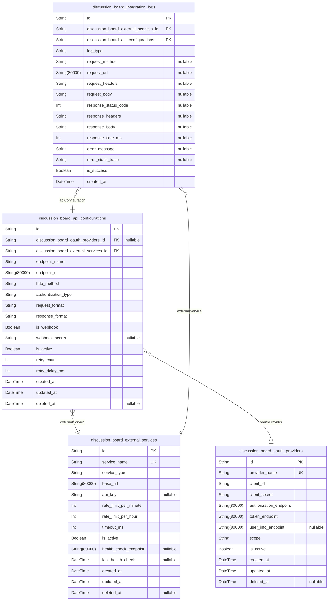

# Prisma Markdown

> Generated by [`prisma-markdown`](https://github.com/samchon/prisma-markdown)

- [Systematic](#systematic)
- [Actors](#actors)
- [Content](#content)
- [Categories](#categories)
- [Moderation](#moderation)
- [Engagement](#engagement)
- [Analytics](#analytics)
- [Notifications](#notifications)
- [Integrations](#integrations)

## Systematic

### `discussion_board_channels`

Represents distinct discussion channels for organizing economic and
political topics. Each channel serves as a container for related sections
and discussions, providing thematic organization for the platform's
content. Channels define the broad categories under which users can
engage in specific discussions.

Properties as follows:

- `id`: Primary Key.
- `code`: Unique channel code identifier for system references.
- `name`: Display name of the channel shown to users.
- `description`: Detailed description explaining the channel's purpose and scope.
- `is_active`: Indicates whether the channel is currently active and accessible.
- `display_order`: Numerical order for channel display in user interfaces.
- `created_at`: Timestamp when the channel was created.
- `updated_at`: Timestamp when the channel was last modified.
- `deleted_at`: Timestamp when the channel was soft deleted.

### `discussion_board_sections`

Organizes content within discussion channels, providing hierarchical
structure for topic organization. Sections represent subsections or
categories within channels, enabling detailed content categorization and
navigation.

Properties as follows:

- `id`: Primary Key.
- `discussion_board_channel_id`
  > Parent channel containing this section. {@link
  > discussion_board_channels.id}.
- `parent_section_id`
  > Parent section for hierarchical organization. {@link
  > discussion_board_sections.id}.
- `code`: Unique section code identifier within the channel.
- `name`: Display name of the section shown to users.
- `description`: Detailed description explaining the section's purpose and content scope.
- `is_active`: Indicates whether the section is currently active and accessible.
- `display_order`: Numerical order for section display within the channel.
- `section_type`: Type of section (e.g., 'economics', 'politics', 'policy_analysis').
- `created_at`: Timestamp when the section was created.
- `updated_at`: Timestamp when the section was last modified.
- `deleted_at`: Timestamp when the section was soft deleted.

### `discussion_board_configurations`

Stores system-wide configuration settings and parameters that control
platform behavior and features. These configurations provide centralized
management of platform settings, enabling dynamic adjustment of system
behavior without code changes.

Properties as follows:

- `id`: Primary Key.
- `config_key`: Unique key identifier for the configuration setting.
- `config_value`: Value of the configuration setting stored as string.
- `data_type`: Data type of the configuration value (string, integer, boolean, json).
- `description`: Explanation of the configuration setting's purpose and usage.
- `category`
  > Category grouping related configurations (authentication, moderation, ui,
  > etc.).
- `is_encrypted`: Indicates whether the configuration value requires encryption.
- `is_system`: Marks system-critical configurations that cannot be modified by users.
- `created_at`: Timestamp when the configuration was created.
- `updated_at`: Timestamp when the configuration was last modified.
- `deleted_at`: Timestamp when the configuration was soft deleted.

### `discussion_board_email_templates`

Manages email template content and configurations for various platform
notifications. These templates support dynamic content insertion and
localization, enabling consistent and professional communication with
users across different scenarios.

Properties as follows:

- `id`: Primary Key.
- `template_code`: Unique code identifier for the email template.
- `template_name`: Descriptive name of the email template for administrative reference.
- `subject_template`: Email subject template with placeholder variables.
- `body_template`: Email body template with HTML content and placeholders.
- `template_type`: Type of email template (notification, verification, warning, etc.).
- `language_code`: Language code for template localization (en, ko, etc.).
- `is_active`: Indicates whether the template is currently active for use.
- `variables_metadata`: JSON metadata describing available template variables and their usage.
- `created_at`: Timestamp when the template was created.
- `updated_at`: Timestamp when the template was last modified.
- `deleted_at`: Timestamp when the template was soft deleted.

## Actors

### `discussion_board_guests`

Anonymous guest users who can browse content without authentication.
Guests have limited access to read-only features and serve as the entry
point for new user acquisition. [discussion_board_members.id](#discussion_board_members) can
be promoted from guest status through registration.

Properties as follows:

- `id`: Primary Key.
- `ip_address`: IP address used for guest session tracking and security monitoring.
- `user_agent`: Browser and device information for analytics and compatibility tracking.
- `first_visited_at`: Timestamp when the guest first accessed the platform.
- `last_activity_at`: Most recent activity timestamp for session management.
- `session_id`: Unique session identifier for guest tracking.
- `status`: Current guest status (active, expired, converted).
- `created_at`: Record creation timestamp.
- `updated_at`: Last modification timestamp.
- `deleted_at`: Soft deletion timestamp for data recovery.

### `discussion_board_members`

Registered members who can create content, participate in discussions,
and engage with the community. Members form the core user base of the
platform and have full access to discussion features. {@link
discussion_board_guests.id} can upgrade to member status through
registration.

Properties as follows:

- `id`: Primary Key.
- `email`: Unique email address for authentication and communication.
- `username`: Display name used for community identification.
- `password_hash`: Securely hashed password for authentication.
- `email_verified_at`: Timestamp when email verification was completed.
- `registration_date`: Date when the member registered on the platform.
- `last_login_at`: Most recent login timestamp for security monitoring.
- `status`: Member account status (active, suspended, banned).
- `reputation_score`: Community reputation based on content quality and engagement.
- `post_count`: Number of posts created by the member.
- `comment_count`: Number of comments posted by the member.
- `created_at`: Record creation timestamp.
- `updated_at`: Last modification timestamp.
- `deleted_at`: Soft deletion timestamp for data recovery.

### `discussion_board_moderators`

Trusted users with content moderation privileges. Moderators review
reported content, enforce community guidelines, and maintain discussion
quality. [discussion_board_members.id](#discussion_board_members) can be promoted to moderator
status based on trust and activity.

Properties as follows:

- `id`: Primary Key.
- `discussion_board_member_id`: Reference to the base member account. [discussion_board_members.id](#discussion_board_members)
- `moderation_specialization`
  > Areas of expertise for targeted content review (economic, political,
  > etc.).
- `promotion_date`: Date when the member was promoted to moderator.
- `moderation_level`: Moderation authority level (junior, senior, lead).
- `cases_resolved`: Number of moderation cases successfully handled.
- `average_resolution_time`: Average time in minutes to resolve moderation cases.
- `status`: Moderator status (active, on_leave, inactive).
- `created_at`: Record creation timestamp.
- `updated_at`: Last modification timestamp.
- `deleted_at`: Soft deletion timestamp for data recovery.

### `discussion_board_administrators`

System administrators with full platform management privileges.
Administrators manage user accounts, system configuration, and oversee
all platform operations. [discussion_board_moderators.id](#discussion_board_moderators) can be
elevated to administrator status for system-wide control.

Properties as follows:

- `id`: Primary Key.
- `discussion_board_moderator_id`: Reference to the moderator account. [discussion_board_moderators.id](#discussion_board_moderators)
- `admin_level`: Administrative authority level (system, content, user).
- `promotion_date`: Date when promoted to administrator role.
- `access_scope`: Areas of administrative responsibility (users, content, system).
- `last_system_access`: Timestamp of most recent administrative access.
- `status`: Administrator status (active, suspended, retired).
- `created_at`: Record creation timestamp.
- `updated_at`: Last modification timestamp.
- `deleted_at`: Soft deletion timestamp for data recovery.

### `discussion_board_user_sessions`

Active user sessions for authentication state management. Tracks login
sessions, device information, and session security parameters. Managed
through user authentication flows.

Properties as follows:

- `id`: Primary Key.
- `discussion_board_member_id`: Reference to the authenticated member. [discussion_board_members.id](#discussion_board_members)
- `session_token`: Unique session identifier for authentication.
- `ip_address`: IP address where the session was initiated.
- `user_agent`: Browser and device information for session tracking.
- `login_timestamp`: Timestamp when the session was created.
- `last_activity`: Most recent activity timestamp for session validation.
- `expires_at`: Session expiration timestamp for automatic cleanup.
- `status`: Session status (active, expired, revoked).
- `created_at`: Record creation timestamp.
- `updated_at`: Last modification timestamp.
- `deleted_at`: Soft deletion timestamp for data recovery.

### `discussion_board_authentication_tokens`

Authentication tokens for secure API access and session management.
Stores JWT tokens, refresh tokens, and token security parameters. Managed
through authentication service operations.

Properties as follows:

- `id`: Primary Key.
- `discussion_board_member_id`: Reference to the token owner. [discussion_board_members.id](#discussion_board_members)
- `access_token`: JWT access token for API authentication.
- `refresh_token`: Refresh token for obtaining new access tokens.
- `token_type`: Type of token (bearer, etc.).
- `expires_in`: Token validity duration in seconds.
- `scope`: Access permissions granted by the token.
- `issued_at`: Timestamp when the token was issued.
- `revoked_at`: Timestamp when the token was revoked.
- `status`: Token status (active, expired, revoked).
- `created_at`: Record creation timestamp.
- `updated_at`: Last modification timestamp.
- `deleted_at`: Soft deletion timestamp for data recovery.

## Content

### `discussion_board_posts`

Core discussion posts containing economic and political content. Each
post represents a discussion topic with title, content, category
assignment, and engagement metrics. Posts follow a lifecycle from
creation through moderation to publication and archival. {@link
discussion_board_members.id} [discussion_board_categories.id](#discussion_board_categories)

Properties as follows:

- `id`: Primary Key.
- `discussion_board_member_id`: Author of the post. [discussion_board_members.id](#discussion_board_members)
- `discussion_board_category_id`: Category for post classification. [discussion_board_categories.id](#discussion_board_categories)
- `title`: Post title with 10-200 character limit for meaningful topic description.
- `content`
  > Post content with 50-10,000 character limit for substantive
  > economic/political discussions.
- `status`
  > Current lifecycle state: draft, pending_review, published, locked,
  > archived.
- `view_count`: Total number of authenticated views for engagement tracking.
- `comment_count`: Number of approved comments on the post for activity metrics.
- `created_at`: Timestamp when the post was initially created.
- `updated_at`: Timestamp when the post was last modified.
- `deleted_at`: Timestamp when the post was soft deleted for moderation recovery.

### `discussion_board_post_versions`

Historical versions of discussion posts for audit trails and content
modification tracking. Each version captures the complete state of a post
at a specific point in time, enabling content recovery and moderation
history. [discussion_board_posts.id](#discussion_board_posts) {@link
discussion_board_members.id}

Properties as follows:

- `id`: Primary Key.
- `discussion_board_post_id`: Post that this version belongs to. [discussion_board_posts.id](#discussion_board_posts)
- `discussion_board_member_id`
  > Member who created this version (author or moderator). {@link
  > discussion_board_members.id}
- `title`: Post title at the time of version creation.
- `content`: Post content at the time of version creation.
- `status`: Post status at the time of version creation.
- `version_number`: Sequential version number for ordering modifications.
- `modification_reason`: Reason for creating this version (edit, moderation, correction).
- `created_at`: Timestamp when this version was created.

### `discussion_board_comments`

User comments on discussion posts for economic/political discourse
engagement. Comments enable threaded discussions with real-time updates
and moderation capabilities. [discussion_board_posts.id](#discussion_board_posts) {@link
discussion_board_members.id} [discussion_board_comment_threads.id](#discussion_board_comment_threads)

Properties as follows:

- `id`: Primary Key.
- `discussion_board_post_id`: Post that this comment belongs to. [discussion_board_posts.id](#discussion_board_posts)
- `discussion_board_member_id`: Author of the comment. [discussion_board_members.id](#discussion_board_members)
- `discussion_board_comment_thread_id`
  > Thread that organizes this comment for discussion structure. {@link
  > discussion_board_comment_threads.id}
- `content`
  > Comment content with 5-2,000 character limit for substantive
  > contributions.
- `status`: Current moderation state: pending, approved, flagged, removed.
- `reply_count`: Number of direct replies to this comment for thread activity.
- `like_count`: Number of positive reactions to the comment.
- `created_at`: Timestamp when the comment was initially created.
- `updated_at`: Timestamp when the comment was last modified.
- `deleted_at`: Timestamp when the comment was soft deleted for moderation recovery.

### `discussion_board_comment_threads`

Thread organization structure for comment discussions. Each thread
represents a conversation branch within a post, enabling hierarchical
comment organization and focused discussions. {@link
discussion_board_posts.id}

Properties as follows:

- `id`: Primary Key.
- `discussion_board_post_id`: Post that this thread belongs to. [discussion_board_posts.id](#discussion_board_posts)
- `title`: Optional thread title for discussion topic identification.
- `comment_count`: Total number of comments in this thread for activity tracking.
- `is_active`: Indicates whether the thread is currently receiving new comments.
- `created_at`: Timestamp when the thread was initially created.
- `updated_at`: Timestamp when the thread was last modified with new comments.

### `discussion_board_content_attachments`

File attachments for posts and comments, supporting media-rich
discussions. Attachments include images, documents, and other files that
enhance economic/political content. [discussion_board_posts.id](#discussion_board_posts)
[discussion_board_comments.id](#discussion_board_comments)

Properties as follows:

- `id`: Primary Key.
- `discussion_board_post_id`
  > Post that this attachment belongs to (optional). {@link
  > discussion_board_posts.id}
- `discussion_board_comment_id`
  > Comment that this attachment belongs to (optional). {@link
  > discussion_board_comments.id}
- `file_name`: Original filename of the uploaded attachment.
- `file_type`: MIME type of the attachment for proper handling.
- `file_size`: File size in bytes for storage management.
- `file_url`: Storage location URL for the attachment file.
- `description`: Optional description of the attachment content.
- `created_at`: Timestamp when the attachment was uploaded.
- `deleted_at`: Timestamp when the attachment was soft deleted.

## Categories

### `discussion_board_categories`

Main category table for organizing economic and political discussions.
Supports hierarchical structure and content categorization. Categories
can have parent-child relationships for organizational hierarchy.

Properties as follows:

- `id`: Primary Key.
- `parent_id`
  > Parent category reference for hierarchical organization. {@link
  > discussion_board_categories.id}.
- `name`
  > Category name display for users. Must be unique within the same hierarchy
  > level.
- `slug`: URL-friendly category identifier for routing and SEO purposes.
- `description`: Detailed explanation of category purpose and content scope.
- `display_order`: Numerical ordering for category display in user interface.
- `is_active`: Category activation status for content filtering and display control.
- `created_at`: Timestamp when category was initially created.
- `updated_at`: Timestamp when category was last modified.
- `deleted_at`: Timestamp when category was soft deleted, null if active.

### `discussion_board_category_hierarchies`

Hierarchical relationships between categories for organizing content in
tree structures. Supports unlimited nesting levels with proper
parent-child relationships.

Properties as follows:

- `id`: Primary Key.
- `parent_category_id`
  > Reference to parent category in hierarchy. {@link
  > discussion_board_categories.id}.
- `child_category_id`
  > Reference to child category in hierarchy. {@link
  > discussion_board_categories.id}.
- `hierarchy_level`: Depth level in category tree for organizational purposes.
- `created_at`: Timestamp when hierarchy relationship was established.
- `updated_at`: Timestamp when hierarchy relationship was last modified.
- `deleted_at`: Timestamp when hierarchy was soft deleted, null if active.

### `discussion_board_category_moderators`

Assignment of moderators to specific categories for specialized content
management. Moderators have authority within their assigned categories
only.

Properties as follows:

- `id`: Primary Key.
- `category_id`
  > Reference to category being moderated. {@link
  > discussion_board_categories.id}.
- `moderator_id`
  > Reference to user with moderator privileges. {@link
  > discussion_board_moderators.id}.
- `assigned_at`: Timestamp when moderator was assigned to category.
- `permissions_level`: Specific moderation permissions granted for this category assignment.
- `is_active`: Assignment activation status for category moderation.
- `created_at`: Timestamp when moderator assignment was created.
- `updated_at`: Timestamp when assignment details were last modified.
- `deleted_at`: Timestamp when assignment was soft deleted, null if active.

### `discussion_board_topic_tags`

Topic tags for categorizing and organizing discussion content. Tags
provide additional classification beyond main categories for improved
content discovery.

Properties as follows:

- `id`: Primary Key.
- `category_id`
  > Primary category association for tag organization. {@link
  > discussion_board_categories.id}.
- `name`: Tag name for content classification and search optimization.
- `slug`: URL-friendly tag identifier for routing and filtering purposes.
- `description`: Brief explanation of tag purpose and typical usage context.
- `usage_count`: Number of times this tag has been applied to content.
- `is_featured`: Featured tag status for promoted content discovery.
- `created_at`: Timestamp when tag was initially created.
- `updated_at`: Timestamp when tag was last modified.
- `deleted_at`: Timestamp when tag was soft deleted, null if active.

## Moderation

### `discussion_board_content_reports`

User-submitted reports about problematic content on the discussion board.
Contains detailed information about reported posts, comments, or users,
including the reason for reporting and the current status of the report.

Properties as follows:

- `id`: Primary Key.
- `reporter_id`: Member who submitted the report. [discussion_board_members.id](#discussion_board_members)
- `reported_post_id`: Reported post content. [discussion_board_posts.id](#discussion_board_posts)
- `reported_comment_id`: Reported comment content. [discussion_board_comments.id](#discussion_board_comments)
- `reported_user_id`: Reported user account. [discussion_board_members.id](#discussion_board_members)
- `assigned_moderator_id`
  > Moderator assigned to review this report. {@link
  > discussion_board_moderators.id}
- `report_reason`
  > Category or reason for the report (spam, harassment, misinformation,
  > etc.).
- `report_details`: Detailed explanation provided by the reporter.
- `report_status`: Current status of the report (pending, under_review, resolved, dismissed).
- `priority_level`: Priority level for moderation (low, medium, high, critical).
- `created_at`: Timestamp when the report was submitted.
- `updated_at`: Timestamp when the report was last updated.
- `deleted_at`: Timestamp when the report was soft deleted.

### `discussion_board_moderation_actions`

Complete audit trail of all moderation actions taken on the platform.
Records decisions made by moderators and administrators, including
content removals, user warnings, and account suspensions.

Properties as follows:

- `id`: Primary Key.
- `moderator_id`: Moderator who performed the action. [discussion_board_moderators.id](#discussion_board_moderators)
- `target_post_id`: Post that was moderated. [discussion_board_posts.id](#discussion_board_posts)
- `target_comment_id`: Comment that was moderated. [discussion_board_comments.id](#discussion_board_comments)
- `target_user_id`: User who was moderated. [discussion_board_members.id](#discussion_board_members)
- `related_content_report_id`
  > Content report that triggered this action. {@link
  > discussion_board_content_reports.id}
- `action_type`
  > Type of moderation action (remove_content, approve_content, warn_user,
  > suspend_user, ban_user).
- `action_details`: Detailed explanation of the moderation decision.
- `enforcement_duration`: Duration of enforcement in hours (for suspensions, etc.).
- `automated_action`: Whether this action was performed automatically by system.
- `appeal_available`: Whether this action can be appealed by the user.
- `created_at`: Timestamp when the action was performed.
- `updated_at`: Timestamp when the action was last updated.
- `deleted_at`: Timestamp when the action record was soft deleted.

### `discussion_board_moderation_queues`

Queue management system for content awaiting moderation review. Organizes
moderation workload by priority, category, and assigned moderators.

Properties as follows:

- `id`: Primary Key.
- `assigned_moderator_id`
  > Moderator currently assigned to this queue item. {@link
  > discussion_board_moderators.id}
- `content_post_id`: Post content awaiting moderation. [discussion_board_posts.id](#discussion_board_posts)
- `content_comment_id`: Comment content awaiting moderation. [discussion_board_comments.id](#discussion_board_comments)
- `related_content_report_id`
  > Content report that created this queue item. {@link
  > discussion_board_content_reports.id}
- `queue_type`
  > Type of content in queue (new_post, reported_content, flagged_content,
  > appeal_review).
- `priority_level`: Priority for moderation (low, medium, high, critical).
- `queue_status`: Current status in queue (pending, assigned, in_review, completed).
- `estimated_review_time`: Estimated time in minutes for review completion.
- `created_at`: Timestamp when the item entered the queue.
- `assigned_at`: Timestamp when the item was assigned to a moderator.
- `completed_at`: Timestamp when the queue item was completed.
- `deleted_at`: Timestamp when the queue item was soft deleted.

### `discussion_board_content_flags`

Automated content flags generated by system analysis tools. Records
automated detection of potential policy violations, spam, or suspicious
content patterns.

Properties as follows:

- `id`: Primary Key.
- `flagged_post_id`: Post that was automatically flagged. [discussion_board_posts.id](#discussion_board_posts)
- `flagged_comment_id`
  > Comment that was automatically flagged. {@link
  > discussion_board_comments.id}
- `flagged_user_id`: User whose content was flagged. [discussion_board_members.id](#discussion_board_members)
- `flag_type`
  > Type of automated flag (spam_detection, toxicity_score,
  > duplicate_content, suspicious_pattern).
- `flag_severity`: Severity level of the flag (low, medium, high, critical).
- `flag_confidence`: Confidence score from automated detection (0.0 to 1.0).
- `flag_reason`: Automated analysis of why content was flagged.
- `reviewed_by_moderator`: Whether this flag has been reviewed by a human moderator.
- `created_at`: Timestamp when the flag was generated.
- `updated_at`: Timestamp when the flag was last updated.
- `deleted_at`: Timestamp when the flag was soft deleted.

### `discussion_board_user_warnings`

Formal warnings issued to users for policy violations. Records the
warning details, severity, and any follow-up actions required from the
user.

Properties as follows:

- `id`: Primary Key.
- `warned_user_id`: User who received the warning. [discussion_board_members.id](#discussion_board_members)
- `issuing_moderator_id`: Moderator who issued the warning. [discussion_board_moderators.id](#discussion_board_moderators)
- `related_moderation_action_id`
  > Moderation action that resulted in this warning. {@link
  > discussion_board_moderation_actions.id}
- `warning_type`
  > Type of warning issued (minor_violation, major_violation, final_warning,
  > suspended).
- `warning_reason`: Detailed explanation of the policy violation.
- `warning_severity`: Severity level of the warning (low, medium, high, critical).
- `required_action`: Action required from the user to resolve the warning.
- `warning_status`: Current status of the warning (active, acknowledged, resolved, expired).
- `expires_at`: Timestamp when the warning automatically expires.
- `acknowledged_at`: Timestamp when the user acknowledged the warning.
- `created_at`: Timestamp when the warning was issued.
- `updated_at`: Timestamp when the warning was last updated.
- `deleted_at`: Timestamp when the warning was soft deleted.

### `discussion_board_appeal_requests`

User appeals against moderation decisions. Manages the appeal process for
users who wish to challenge moderation actions, warnings, or account
restrictions.

Properties as follows:

- `id`: Primary Key.
- `appealing_user_id`: User submitting the appeal. [discussion_board_members.id](#discussion_board_members)
- `appealed_moderation_action_id`
  > Moderation action being appealed. {@link
  > discussion_board_moderation_actions.id}
- `appealed_user_warning_id`: User warning being appealed. [discussion_board_user_warnings.id](#discussion_board_user_warnings)
- `assigned_moderator_id`
  > Moderator assigned to review the appeal. {@link
  > discussion_board_moderators.id}
- `appeal_reason`: Detailed explanation from the user about why they are appealing.
- `appeal_status`: Current status of the appeal (pending, under_review, approved, rejected).
- `priority_level`: Priority level for appeal review (low, medium, high, critical).
- `resolution_details`: Detailed explanation of the appeal resolution decision.
- `estimated_review_time`: Estimated time in days for appeal review completion.
- `created_at`: Timestamp when the appeal was submitted.
- `updated_at`: Timestamp when the appeal was last updated.
- `deleted_at`: Timestamp when the appeal was soft deleted.

## Engagement

### `discussion_board_post_views`

Tracks user views of discussion board posts for engagement analytics and
content performance measurement. Records each view event with timestamp
and user context for detailed analysis of post popularity and user
behavior patterns. [discussion_board_posts.id](#discussion_board_posts) {@link
discussion_board_members.id}

Properties as follows:

- `id`: Primary Key.
- `discussion_board_post_id`: Viewed post's identifier. [discussion_board_posts.id](#discussion_board_posts)
- `discussion_board_member_id`: Viewing user's identifier. [discussion_board_members.id](#discussion_board_members)
- `viewed_at`: Timestamp when the post was viewed by the user.
- `ip_address`: IP address of the user for geographic and security analysis.
- `user_agent`: Browser or client information for device and platform analysis.
- `session_id`: User session identifier for tracking view patterns within sessions.
- `view_duration`: Duration in seconds that the user spent viewing the post content.
- `scroll_depth`: Percentage of post content that was viewed (0-100).
- `created_at`: Record creation timestamp.
- `updated_at`: Record last update timestamp.

### `discussion_board_comment_engagements`

Records user interactions with comments including reads, replies, and
engagement metrics. Tracks comment-level engagement for understanding
discussion participation and comment quality. {@link
discussion_board_comments.id} [discussion_board_members.id](#discussion_board_members)

Properties as follows:

- `id`: Primary Key.
- `discussion_board_comment_id`: Engaged comment's identifier. [discussion_board_comments.id](#discussion_board_comments)
- `discussion_board_member_id`: Engaging user's identifier. [discussion_board_members.id](#discussion_board_members)
- `engagement_type`: Type of engagement: read, reply, like, flag, or other interaction.
- `engaged_at`: Timestamp when the engagement occurred.
- `engagement_value`
  > Quantitative value associated with the engagement (e.g., reply depth,
  > like strength).
- `parent_engagement_id`: Reference to parent engagement for threaded interactions.
- `metadata`: JSON metadata containing additional engagement context and details.
- `created_at`: Record creation timestamp.
- `updated_at`: Record last update timestamp.

### `discussion_board_user_reactions`

Stores user reactions to posts and comments including likes, dislikes,
and custom reaction types. Captures emotional responses and sentiment
towards content for community feedback analysis. {@link
discussion_board_posts.id} [discussion_board_comments.id](#discussion_board_comments) {@link
discussion_board_members.id}

Properties as follows:

- `id`: Primary Key.
- `discussion_board_post_id`
  > Reacted post's identifier (nullable if reaction is to comment). {@link
  > discussion_board_posts.id}
- `discussion_board_comment_id`
  > Reacted comment's identifier (nullable if reaction is to post). {@link
  > discussion_board_comments.id}
- `discussion_board_member_id`: Reacting user's identifier. [discussion_board_members.id](#discussion_board_members)
- `reaction_type`
  > Type of reaction: like, dislike, helpful, agree, disagree, or custom
  > reaction.
- `reaction_value`: Intensity or weight of the reaction (e.g., 1 for like, -1 for dislike).
- `reacted_at`: Timestamp when the reaction was recorded.
- `reaction_context`: Optional context or reason for the reaction provided by the user.
- `is_anonymous`: Whether the reaction was made anonymously (if supported by platform).
- `created_at`: Record creation timestamp.
- `updated_at`: Record last update timestamp.

### `discussion_board_content_shares`

Tracks content sharing activities across different platforms and
channels. Records sharing events for viral content analysis and referral
tracking. [discussion_board_posts.id](#discussion_board_posts) {@link
discussion_board_members.id}

Properties as follows:

- `id`: Primary Key.
- `discussion_board_post_id`: Shared post's identifier. [discussion_board_posts.id](#discussion_board_posts)
- `discussion_board_member_id`: Sharing user's identifier. [discussion_board_members.id](#discussion_board_members)
- `share_platform`
  > Platform where content was shared: email, twitter, facebook, linkedin,
  > etc.
- `share_method`: Method of sharing: direct_share, embed, link, or platform_specific method.
- `shared_at`: Timestamp when the content was shared.
- `share_url`: URL generated for the shared content (if applicable).
- `share_recipients`: Number of recipients or audience size for the share.
- `share_metadata`: Additional metadata about the share event in JSON format.
- `referral_code`: Referral code or tracking parameter associated with the share.
- `created_at`: Record creation timestamp.
- `updated_at`: Record last update timestamp.

### `discussion_board_bookmarks`

Records user bookmarking activities for saving posts and comments for
later reference. Tracks content saving behavior for personalization and
content discovery. [discussion_board_posts.id](#discussion_board_posts) {@link
discussion_board_comments.id} [discussion_board_members.id](#discussion_board_members)

Properties as follows:

- `id`: Primary Key.
- `discussion_board_post_id`
  > Bookmarked post's identifier (nullable if bookmark is for comment).
  > [discussion_board_posts.id](#discussion_board_posts)
- `discussion_board_comment_id`
  > Bookmarked comment's identifier (nullable if bookmark is for post).
  > [discussion_board_comments.id](#discussion_board_comments)
- `discussion_board_member_id`: Bookmarking user's identifier. [discussion_board_members.id](#discussion_board_members)
- `bookmarked_at`: Timestamp when the content was bookmarked.
- `folder_name`: Optional folder or category name for organizing bookmarks.
- `notes`: User notes or comments about why the content was bookmarked.
- `is_private`: Whether the bookmark is private (not visible to others).
- `last_accessed`: Timestamp when the bookmarked content was last accessed.
- `access_count`: Number of times the bookmarked content has been accessed.
- `created_at`: Record creation timestamp.
- `updated_at`: Record last update timestamp.

## Analytics

### `discussion_board_platform_metrics`

Platform-wide performance metrics and system health indicators collected
for monitoring and capacity planning. Includes daily aggregation of user
counts, post volume, system uptime, and resource utilization metrics.
Used by administrators for decision-making and infrastructure planning.

Properties as follows:

- `id`: Primary Key.
- `discussion_board_channel_id`
  > Reference to the channel being monitored. {@link
  > discussion_board_channels.id}.
- `metric_date`
  > Date for which metrics are aggregated. Typically represents daily
  > collection intervals.
- `metric_type`
  > Type of platform metric being recorded (e.g., 'user_activity',
  > 'system_performance', 'content_growth').
- `metric_value`
  > Numerical value of the collected metric, stored as floating-point for
  > precision.
- `metric_unit`
  > Unit of measurement for the metric value (e.g., 'users', 'posts',
  > 'percentage', 'milliseconds').
- `collected_at`: Timestamp when this metric data point was collected by the system.
- `aggregation_period`
  > Time period over which metrics are aggregated (e.g., 'daily', 'hourly',
  > 'weekly').
- `data_quality_score`: Confidence score for the accuracy of collected metrics (0.0 to 1.0 scale).
- `created_at`: Timestamp when this metric record was created in the database.
- `updated_at`: Timestamp when this metric record was last updated.

### `discussion_board_user_analytics`

Comprehensive user behavior analytics tracking engagement patterns,
activity levels, and participation metrics. Supports user segmentation,
retention analysis, and personalized content recommendations based on
behavioral data.

Properties as follows:

- `id`: Primary Key.
- `discussion_board_member_id`: Reference to the user being analyzed. [discussion_board_members.id](#discussion_board_members).
- `analysis_date`: Date for which user analytics are calculated and stored.
- `session_count`: Number of user sessions recorded during the analysis period.
- `posts_created`: Count of posts created by the user during the period.
- `comments_posted`: Number of comments posted by the user during the period.
- `engagement_score`
  > Calculated engagement score based on activity frequency and quality
  > (0-100 scale).
- `retention_status`
  > User retention classification (e.g., 'new', 'active', 'at_risk',
  > 'churned').
- `preferred_categories`: Comma-separated list of categories where user shows highest engagement.
- `average_session_duration`: Average time spent per session in seconds.
- `content_quality_score`
  > Quality assessment score based on post/comment reception and moderator
  > feedback.
- `last_activity_date`: Date of user's most recent platform activity.
- `calculated_at`: Timestamp when these analytics were calculated and stored.
- `created_at`: Timestamp when this analytics record was created.
- `updated_at`: Timestamp when this analytics record was last updated.

### `discussion_board_content_performance`

Performance metrics tracking for individual posts and comments, including
engagement rates, view counts, and user interaction patterns. Used for
content recommendation algorithms and quality assessment.

Properties as follows:

- `id`: Primary Key.
- `discussion_board_post_id`: Reference to the post being analyzed. [discussion_board_posts.id](#discussion_board_posts).
- `discussion_board_comment_id`
  > Reference to the comment being analyzed. {@link
  > discussion_board_comments.id}.
- `discussion_board_category_id`
  > Reference to the content category for segmentation. {@link
  > discussion_board_categories.id}.
- `measurement_period`
  > Time period for performance measurement (e.g., 'first_24_hours',
  > 'weekly', 'monthly').
- `total_views`: Cumulative view count during the measurement period.
- `unique_viewers`: Count of distinct users who viewed the content.
- `comment_count`: Number of comments generated in response to the content.
- `engagement_rate`
  > Percentage of viewers who interacted with the content (comments,
  > reactions, shares).
- `average_read_time`: Average time spent reading the content in seconds.
- `social_shares`: Number of times content was shared externally.
- `upvote_ratio`: Ratio of positive to negative reactions received.
- `content_quality_score`: Algorithmic score assessing content quality and value.
- `trending_score`: Score indicating how rapidly content is gaining popularity.
- `measurement_end_date`: End date of the performance measurement period.
- `calculated_at`: Timestamp when performance metrics were calculated.
- `created_at`: Timestamp when this performance record was created.
- `updated_at`: Timestamp when this performance record was last updated.

### `discussion_board_trending_topics`

Real-time tracking of trending discussion topics and popular content
categories. Supports discovery features and content recommendation
systems by identifying emerging patterns and viral content.

Properties as follows:

- `id`: Primary Key.
- `discussion_board_category_id`
  > Reference to the trending category. {@link
  > discussion_board_categories.id}.
- `discussion_board_topic_tag_id`
  > Reference to specific trending topic tag. {@link
  > discussion_board_topic_tags.id}.
- `trend_date`: Date when the trending pattern was identified.
- `trend_period`: Time window for trend calculation (e.g., 'hourly', 'daily', 'weekly').
- `trend_score`: Numerical score representing the strength and velocity of the trend.
- `momentum_indicator`: Measure of whether trend is accelerating or decelerating.
- `peak_activity_level`: Highest level of activity recorded during the trend period.
- `participant_count`: Number of unique users participating in the trending topic.
- `content_volume`: Total number of posts and comments in the trending topic.
- `geographic_distribution`: JSON representation of geographic participation patterns.
- `sentiment_score`: Average sentiment analysis score for the trending topic.
- `trend_duration`: Estimated duration of the trend in hours.
- `detected_at`: Timestamp when the trend was first detected by the system.
- `last_updated`: Timestamp when trend metrics were last recalculated.
- `created_at`: Timestamp when this trend record was created.
- `updated_at`: Timestamp when this trend record was last updated.

### `discussion_board_audit_logs`

Comprehensive audit trail capturing all significant platform events,
administrative actions, and system changes. Supports compliance, security
monitoring, and historical analysis of platform operations.

Properties as follows:

- `id`: Primary Key.
- `discussion_board_administrator_id`
  > Reference to the administrator who performed the action. {@link
  > discussion_board_administrators.id}.
- `discussion_board_member_id`
  > Reference to the member affected by the action. {@link
  > discussion_board_members.id}.
- `event_type`
  > Category of audit event (e.g., 'user_management', 'content_moderation',
  > 'system_config').
- `action_performed`: Specific action that was taken during the event.
- `resource_affected`: Identifier of the resource that was modified or accessed.
- `event_details`: JSON-formatted details containing complete event context and changes.
- `ip_address`: IP address from which the action was performed.
- `user_agent`: Client user agent string for the action source.
- `outcome_status`: Result of the action (e.g., 'success', 'failure', 'partial').
- `severity_level`: Importance level of the audit event (e.g., 'info', 'warning', 'critical').
- `compliance_reference`: Reference to relevant compliance requirements or policies.
- `retention_period`: Designated retention period for this audit record.
- `event_timestamp`: Exact timestamp when the audited event occurred.
- `logged_at`: Timestamp when this audit record was created in the system.
- `created_at`: Timestamp when this audit record was created.

## Notifications

### `discussion_board_notification_templates`

Stores reusable notification templates for different notification types
and scenarios. Templates define the message format, content structure,
and delivery channels for various system notifications including post
replies, comment mentions, moderation actions, and system announcements.
Templates support localization and personalization tokens for dynamic
content insertion.

Properties as follows:

- `id`: Primary Key.
- `template_name`
  > Unique identifier name for the notification template (e.g.,
  > 'post_reply_notification', 'comment_mention_alert').
- `template_type`
  > Category of notification template (e.g., 'email', 'push', 'in_app',
  > 'system').
- `subject_template`: Template for notification subject line with variable placeholders.
- `content_template`: Template for notification body content with variable placeholders.
- `metadata`
  > JSON configuration for template variables, formatting rules, and delivery
  > settings.
- `status`: Template status indicating if it's active, inactive, or archived.
- `created_at`: Timestamp when the template was created.
- `updated_at`: Timestamp when the template was last updated.
- `deleted_at`: Timestamp when the template was soft deleted.

### `discussion_board_user_notifications`

Core table for managing user notifications and alerts. Stores individual
notification instances created for users based on system events, user
interactions, and content updates. Supports multiple notification
channels and tracks user engagement with notifications.

Properties as follows:

- `id`: Primary Key.
- `user_id`
  > Target user who receives the notification. {@link
  > discussion_board_members.id}.
- `template_id`
  > Reference to the notification template used. {@link
  > discussion_board_notification_templates.id}.
- `related_post_id`
  > Optional reference to related post content. {@link
  > discussion_board_posts.id}.
- `related_comment_id`
  > Optional reference to related comment content. {@link
  > discussion_board_comments.id}.
- `notification_type`: Type of notification (e.g., 'reply', 'mention', 'moderation', 'system').
- `title`: Notification title with resolved template variables.
- `content`: Notification content with resolved template variables.
- `status`: Current status of the notification (pending, sent, read, dismissed).
- `priority`: Priority level for notification delivery (low, normal, high, urgent).
- `scheduled_at`: Timestamp when the notification should be delivered.
- `expires_at`: Timestamp when the notification expires and should be auto-dismissed.
- `metadata`: Additional JSON data for notification context and processing.
- `created_at`: Timestamp when the notification was created.
- `updated_at`: Timestamp when the notification was last updated.
- `deleted_at`: Timestamp when the notification was soft deleted.

### `discussion_board_notification_deliveries`

Tracks delivery attempts and status for notifications across different
channels. Provides audit trail for notification delivery performance,
failure analysis, and delivery confirmation. Historical tracking of all
delivery attempts for compliance and debugging purposes.

Properties as follows:

- `id`: Primary Key.
- `notification_id`
  > Reference to the notification being delivered. {@link
  > discussion_board_user_notifications.id}.
- `delivery_channel`: Channel used for delivery attempt (email, push, in_app, sms).
- `delivery_status`
  > Status of the delivery attempt (pending, sent, delivered, failed,
  > bounced).
- `attempt_count`: Number of delivery attempts made for this notification.
- `last_attempt_at`: Timestamp of the most recent delivery attempt.
- `delivered_at`: Timestamp when delivery was successfully confirmed.
- `failure_reason`: Reason for delivery failure if applicable.
- `metadata`: Additional delivery metadata and performance metrics.
- `created_at`: Timestamp when the delivery record was created.
- `updated_at`: Timestamp when the delivery record was last updated.

### `discussion_board_user_preferences`

Stores user preferences for notification settings and delivery options.
Controls when and how users receive notifications based on their personal
preferences, notification frequency, and channel preferences. Supports
granular control over different notification types.

Properties as follows:

- `id`: Primary Key.
- `user_id`
  > Reference to the user whose preferences are stored. {@link
  > discussion_board_members.id}.
- `email_notifications`: Whether the user wants to receive email notifications.
- `push_notifications`: Whether the user wants to receive push notifications.
- `in_app_notifications`: Whether the user wants to receive in-app notifications.
- `receive_reply_notifications`: Whether to receive notifications for post replies.
- `receive_mention_notifications`: Whether to receive notifications for mentions in comments.
- `receive_moderation_notifications`: Whether to receive notifications for moderation actions.
- `receive_system_notifications`: Whether to receive system announcements and updates.
- `notification_frequency`
  > Preferred frequency for notifications (immediate, daily_digest,
  > weekly_summary).
- `quiet_hours_start`
  > Start time for quiet hours when notifications are suppressed (HH:MM
  > format).
- `quiet_hours_end`: End time for quiet hours when notifications are suppressed (HH:MM format).
- `last_updated_by`: Indicates who last updated the preferences (user, system, admin).
- `created_at`: Timestamp when the preferences were created.
- `updated_at`: Timestamp when the preferences were last updated.

## Integrations

### `discussion_board_oauth_providers`

Configuration and management of OAuth 2.0 provider integrations for user
authentication. Stores provider-specific settings, client credentials,
and authentication endpoints for services like Google, Facebook, and
Microsoft Azure AD. Supports JWT token management and secure credential
storage with encryption.

Properties as follows:

- `id`: Primary Key.
- `provider_name`: Name of the OAuth provider (e.g., 'google', 'facebook', 'microsoft').
- `client_id`: OAuth client ID provided by the service provider.
- `client_secret`: Encrypted OAuth client secret for secure authentication.
- `authorization_endpoint`: OAuth 2.0 authorization endpoint URL.
- `token_endpoint`: OAuth 2.0 token endpoint URL.
- `user_info_endpoint`: OAuth 2.0 user information endpoint URL.
- `scope`: Requested OAuth scopes (e.g., 'openid email profile').
- `is_active`: Whether this OAuth provider configuration is currently active.
- `created_at`: Timestamp when the OAuth provider configuration was created.
- `updated_at`: Timestamp when the OAuth provider configuration was last updated.
- `deleted_at`: Timestamp when the OAuth provider configuration was soft deleted.

### `discussion_board_external_services`

Management of external service integrations for content validation,
notifications, and analytics. Configures service endpoints, rate limits,
and health monitoring for third-party APIs like spam detection,
fact-checking, and email services.

Properties as follows:

- `id`: Primary Key.
- `service_name`
  > Name of the external service (e.g., 'akismet', 'sendgrid',
  > 'google_analytics').
- `service_type`
  > Type of external service (e.g., 'spam_detection', 'email_service',
  > 'analytics').
- `base_url`: Base URL for the external service API endpoints.
- `api_key`: Encrypted API key for authenticating with the external service.
- `rate_limit_per_minute`: Maximum number of API calls allowed per minute.
- `rate_limit_per_hour`: Maximum number of API calls allowed per hour.
- `timeout_ms`: Request timeout in milliseconds for API calls.
- `is_active`: Whether this external service configuration is currently active.
- `health_check_endpoint`: Endpoint URL for service health monitoring.
- `last_health_check`: Timestamp of the last successful health check.
- `created_at`: Timestamp when the external service configuration was created.
- `updated_at`: Timestamp when the external service configuration was last updated.
- `deleted_at`: Timestamp when the external service configuration was soft deleted.

### `discussion_board_api_configurations`

Configuration management for API endpoints and integration settings.
Defines authentication methods, request/response formats, and security
settings for external API integrations. Supports webhook configurations
and real-time data synchronization.

Properties as follows:

- `id`: Primary Key.
- `discussion_board_oauth_providers_id`
  > Reference to OAuth provider for API authentication. {@link
  > discussion_board_oauth_providers.id}.
- `discussion_board_external_services_id`
  > Reference to external service for API integration. {@link
  > discussion_board_external_services.id}.
- `endpoint_name`
  > Name of the API endpoint (e.g., 'content_validation',
  > 'user_notification').
- `endpoint_url`: Full URL of the API endpoint.
- `http_method`: HTTP method for API calls (e.g., 'GET', 'POST', 'PUT').
- `authentication_type`
  > Type of authentication required (e.g., 'api_key', 'oauth2',
  > 'bearer_token').
- `request_format`: Expected request format (e.g., 'json', 'xml', 'form_data').
- `response_format`: Expected response format (e.g., 'json', 'xml').
- `is_webhook`: Whether this endpoint is configured as a webhook receiver.
- `webhook_secret`: Encrypted webhook secret for securing incoming webhook requests.
- `is_active`: Whether this API configuration is currently active.
- `retry_count`: Number of retry attempts for failed API calls.
- `retry_delay_ms`: Delay in milliseconds between retry attempts.
- `created_at`: Timestamp when the API configuration was created.
- `updated_at`: Timestamp when the API configuration was last updated.
- `deleted_at`: Timestamp when the API configuration was soft deleted.

### `discussion_board_integration_logs`

Comprehensive audit trail of all integration activities and API
interactions. Logs request/response data, performance metrics, and error
details for monitoring, debugging, and compliance purposes. Supports
audit requirements and service health analysis.

Properties as follows:

- `id`: Primary Key.
- `discussion_board_external_services_id`
  > Reference to the external service involved in the integration activity.
  > [discussion_board_external_services.id](#discussion_board_external_services).
- `discussion_board_api_configurations_id`
  > Reference to the specific API configuration used for the integration.
  > [discussion_board_api_configurations.id](#discussion_board_api_configurations).
- `log_type`
  > Type of integration activity logged (e.g., 'api_call',
  > 'webhook_received', 'error').
- `request_method`: HTTP method used for the API request.
- `request_url`: Full URL of the API request.
- `request_headers`: Request headers in JSON format.
- `request_body`: Request body content for POST/PUT requests.
- `response_status_code`: HTTP status code received from the API response.
- `response_headers`: Response headers in JSON format.
- `response_body`: Response body content received from the API.
- `response_time_ms`: Total response time in milliseconds for the API call.
- `error_message`: Error message if the integration activity failed.
- `error_stack_trace`: Full error stack trace for debugging purposes.
- `is_success`: Whether the integration activity was successful.
- `created_at`: Timestamp when the integration activity occurred.
