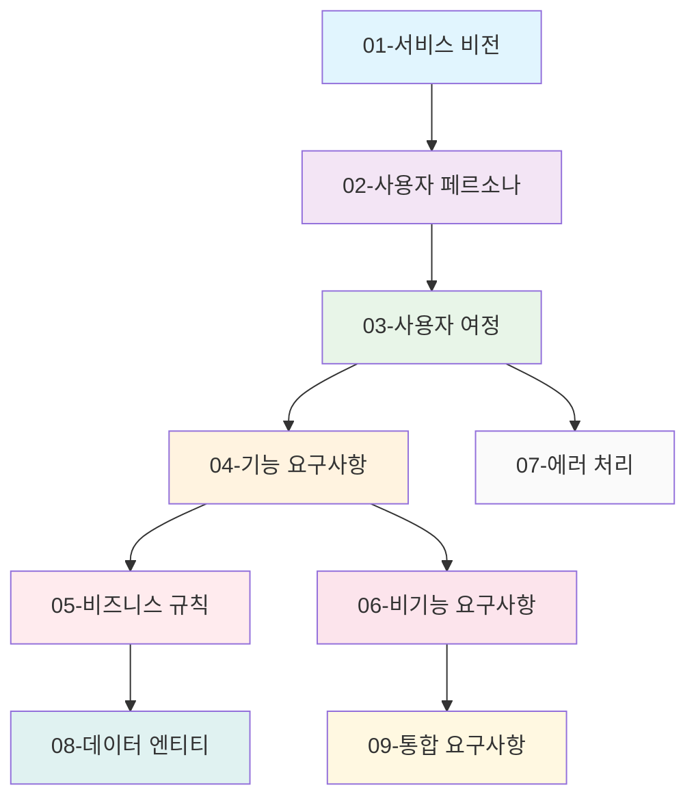

# 경제/정치 토론 게시판 프로젝트 문서 구조

## 프로젝트 개요

**discussionBoard**는 경제 및 정치 관련 주제를 전문적으로 다루는 온라인 토론 커뮤니티 플랫폼입니다. 이 플랫폼은 건전한 토론 문화를 조성하고, 사용자들이 다양한 경제/정치 이슈에 대해 의견을 교환할 수 있는 공간을 제공합니다.

### 서비스 비전
사용자들이 경제 및 정치 관련 주제에 대해 자유롭고 생산적인 토론을 할 수 있는 안전한 디지털 공간을 구축합니다. 전문성과 다양성을 바탕으로 한 건전한 토론 문화를 조성하는 것이 핵심 목표입니다.

### 주요 목표
- 경제/정치 관련 정보의 신뢰성 있는 공유 플랫폼 구축
- 다양한 의견이 존중되는 열린 토론 환경 제공
- 사용자 참여를 통한 지식 교류 활성화
- 건전한 커뮤니티 문화 조성을 통한 장기적 성장

## 문서 구조

이 프로젝트는 총 9개의 상세 문서로 구성되어 있으며, 각 문서는 특정 관점에서 서비스 요구사항을 정의합니다.

### 문서 목록 및 설명

| 문서 | 제목 | 주요 내용 | 독자 대상 | 문서 유형 |
|------|------|-----------|-----------|-----------|
| [01-service-vision.md](./01-service-vision.md) | 서비스 비전 및 비즈니스 모델 | 비즈니스 목표, 시장 기회, 가치 제안, 경쟁 분석 | 비즈니스 이해관계자, 제품 관리자 | 비즈니스 모델 |
| [02-user-personas.md](./02-user-personas.md) | 사용자 페르소나 및 인증 요구사항 | 4가지 사용자 역할, 인증 흐름, 권한 매트릭스, JWT 토큰 명세 | 제품 관리자, UX 디자이너 | 사용자 스토리 |
| [03-user-journey.md](./03-user-journey.md) | 사용자 여정 및 상호작용 흐름 | 온보딩, 콘텐츠 발견, 게시글 작성, 댓글 시스템 전체 흐름 | 개발 팀, UI/UX 디자이너 | 사용자 흐름 |
| [04-functional-requirements.md](./04-functional-requirements.md) | 기능 요구사항 상세 명세 | 인증 시스템, 게시글 관리, 댓글 시스템, 검색 기능 등 EARS 형식 명세 | 백엔드 개발자 | 요구사항 |
| [05-business-rules.md](./05-business-rules.md) | 비즈니스 규칙 및 검증 요구사항 | 콘텐츠 생성 규칙, 검증 로직, 중재 정책, 사용자 행동 제한 | 백엔드 개발자 | 요구사항 |
| [06-non-functional-requirements.md](./06-non-functional-requirements.md) | 비기능적 요구사항 | 성능, 보안, 확장성, 가용성, 데이터 개인정보 보호 요구사항 | 인프라 팀, 개발자 | 요구사항 |
| [07-error-handling.md](./07-error-handling.md) | 에러 처리 및 사용자 복구 시나리오 | 인증 실패, 콘텐츠 제출 오류, 네트워크 문제 복구 흐름 | 프론트엔드 개발자 | 사용자 흐름 |
| [08-data-entities.md](./08-data-entities.md) | 데이터 엔티티 및 관계 정의 | 사용자, 게시글, 댓글, 카테고리 비즈니스 엔티티와 관계 매핑 | 백엔드 개발자 | 비즈니스 모델 |
| [09-integration-requirements.md](./09-integration-requirements.md) | 통합 요구사항 및 외부 서비스 | OAuth 인증, 콘텐츠 검증, 알림 시스템, 분석 통합 | 풀스택 개발자 | 요구사항 |

## 사용자 역할 정의

이 시스템은 4가지 주요 사용자 역할을 정의합니다:

### 1. 게스트 (Guest)
**비인증 사용자**로서 기본적인 콘텐츠 탐색 권한을 가집니다:
- 게시글 및 토론 내용 조회 가능
- 회원 가입 없이 콘텐츠 탐색 가능
- 글 작성 및 댓글 작성 불가
- 검색 기능 제한적 사용 가능

### 2. 회원 (Member)
**등록된 사용자**로서 토론에 적극적으로 참여할 수 있습니다:
- 게시글 작성 및 수정 권한 (24시간 내 자체 수정)
- 다른 게시글에 댓글 작성 가능
- 개인 프로필 관리 및 설정 변경
- 콘텐츠 신고 및 다른 사용자 팔로우 기능

### 3. 중재자 (Moderator)
**콘텐츠 관리 권한**을 가진 신뢰할 수 있는 사용자:
- 게시글 및 댓글 검토 및 승인 권한
- 신고된 콘텐츠 처리 및 조치
- 토론 질문 유지 및 카테고리 관리
- 회원 경고 및 일시적 제재 권한

### 4. 관리자 (Admin)
**시스템 전체 관리 권한**을 가진 최고 권한 사용자:
- 사용자 계정 관리 및 역할 변경
- 시스템 설정 및 정책 관리
- 모든 콘텐츠 중재 및 삭제 권한
- 데이터 백업 및 시스템 모니터링

## 완전한 권한 매트릭스

| 작업 | 게스트 | 회원 | 중재자 | 관리자 |
|------|--------|------|--------|--------|
| 게시글 조회 | ✅ | ✅ | ✅ | ✅ |
| 게시글 검색 | ✅ | ✅ | ✅ | ✅ |
| 회원가입 | ✅ | ❌ | ❌ | ❌ |
| 게시글 작성 | ❌ | ✅ | ✅ | ✅ |
| 게시글 수정 | ❌ | ✅ (본인/24h) | ✅ | ✅ |
| 게시글 삭제 | ❌ | ✅ (본인) | ✅ | ✅ |
| 댓글 작성 | ❌ | ✅ | ✅ | ✅ |
| 댓글 수정 | ❌ | ✅ (본인/1h) | ✅ | ✅ |
| 댓글 삭제 | ❌ | ✅ (본인) | ✅ | ✅ |
| 콘텐츠 신고 | ❌ | ✅ | ✅ | ✅ |
| 신고 조회 | ❌ | ❌ | ✅ | ✅ |
| 콘텐츠 중재 | ❌ | ❌ | ✅ | ✅ |
| 사용자 제재 | ❌ | ❌ | ❌ | ✅ |
| 시스템 설정 | ❌ | ❌ | ❌ | ✅ |

## 빠른 시작 가이드

### 개발자를 위한 시작점

**백엔드 개발자**라면 다음 순서로 문서를 참조하세요:
1. **[기능 요구사항 상세 명세](./04-functional-requirements.md)** - 모든 시스템 기능을 EARS 형식으로 이해
2. **[비즈니스 규칙 및 검증 요구사항](./05-business-rules.md)** - 비즈니스 로직과 검증 규칙 파악
3. **[데이터 엔티티 및 관계 정의](./08-data-entities.md)** - 비즈니스 엔티티와 관계 매핑 이해
4. **[비기능적 요구사항](./06-non-functional-requirements.md)** - 성능, 보안, 확장성 요구사항 확인

**프론트엔드 개발자**라면 다음을 우선 참조하세요:
1. **[사용자 여정 및 상호작용 흐름](./03-user-journey.md)** - 전체 사용자 경험 흐름 이해
2. **[에러 처리 및 사용자 복구 시나리오](./07-error-handling.md)** - 오류 상황별 사용자 경험 설계
3. **[기능 요구사항 상세 명세](./04-functional-requirements.md)** - 백엔드와의 인터페이스 이해

### 기획자를 위한 시작점

**제품 기획자**라면 다음 순서로 시작하세요:
1. **[서비스 비전 및 비즈니스 모델](./01-service-vision.md)** - 비즈니스 목표와 시장 기회 이해
2. **[사용자 페르소나 및 인증 요구사항](./02-user-personas.md)** - 대상 사용자와 요구사항 파악
3. **[사용자 여정 및 상호작용 흐름](./03-user-journey.md)** - 사용자 경험 전반 설계

### 인프라 담당자를 위한 시작점

**시스템 아키텍트/인프라 담당자**는 다음을 참조하세요:
1. **[비기능적 요구사항](./06-non-functional-requirements.md)** - 성능, 보안, 가용성 요구사항
2. **[통합 요구사항 및 외부 서비스](./09-integration-requirements.md)** - 외부 시스템 연동 요구사항
3. **[데이터 엔티티 및 관계 정의](./08-data-entities.md)** - 데이터 구조와 볼륨 예측

## 문서 간 관계 및 의존성

### 문서 의존성 흐름

### 핵심 문서 설명

#### [01-service-vision.md](./01-service-vision.md)
- **핵심 내용**: 시장 기회 분석, 경쟁 분석, 성공 지표, 수익 모델
- **주요 섹션**: 문제 진술, 가치 제안, 비즈니스 목표, 성장 로드맵
- **참조 문서**: 없음 (최상위 비즈니스 문서)
- **검증 기준**: 투자 결정을 내릴 수 있을 정도의 충분한 정보 제공

#### [02-user-personas.md](./02-user-personas.md)
- **핵심 내용**: 4가지 사용자 역할 상세 정의, 인증 요구사항, 권한 체계
- **주요 섹션**: 권한 매트릭스, JWT 토큰 요구사항, 사용자 여정 기반 설계
- **참조 문서**: [01-service-vision.md](./01-service-vision.md)
- **검증 기준**: 모든 사용자 시나리오를 커버하는 완전한 권한 체계

#### [04-functional-requirements.md](./04-functional-requirements.md)
- **핵심 내용**: 모든 기능적 요구사항을 EARS 형식으로 명세
- **주요 섹션**: 인증 시스템, 게시글 관리, 검색 기능, 중재 시스템
- **참조 문서**: [03-user-journey.md](./03-user-journey.md)
- **검증 기준**: 테스트 가능하고 명확한 요구사항 명세

## 프로젝트 범위 및 제약사항

### 기술적 제약사항
- **백엔드 중심**: 프론트엔드 UI/UX 디자인은 포함되지 않음
- **비즈니스 로직 집중**: 기술 구현 세부사항보다 비즈니스 요구사항에 초점
- **확장성 고려**: 초기 버전이지만 향후 기능 확장을 고려한 설계
- **클라우드 네이티브**: 클라우드 환경 배포를 전제로 한 아키텍처

### 비즈니스 제약사항
- **경제/정치 전문성**: 일반 커뮤니티와 차별화된 전문성 유지
- **토론 문화**: 건전한 토론 환경 조성을 위한 정책 수립
- **콘텐츠 품질**: 신뢰성 있는 정보 공유를 위한 검증 메커니즘
- **규제 준수**: 개인정보보호법, 정보통신망법 등 국내 규제 준수

### 문서 작성 원칙
- **EARS 형식 준수**: 모든 요구사항은 명확하고 검증 가능하게 작성
- **자연어 중심**: 기술적 용어보다 비즈니스 관점에서 설명
- **실용성**: 실제 구현 가능한 수준의 요구사항 제시
- **일관성**: 전체 문서에 걸쳐 일관된 용어와 형식 사용

## 구현 검증 체크리스트

### 각 문서별 검증 기준

**01-service-vision.md 검증:**
- [ ] 비즈니스 목표가 명확하고 측정 가능한가?
- [ ] 시장 기회 분석이 충분한가?
- [ ] 경쟁 차별화 요소가 명확한가?
- [ ] 수익 모델이 현실적인가?

**02-user-personas.md 검증:**
- [ ] 모든 사용자 역할이 명확히 정의되었는가?
- [ ] 권한 매트릭스가 완전한가?
- [ ] 인증 요구사항이 상세한가?
- [ ] 사용자 시나리오가 실제적인가?

**04-functional-requirements.md 검증:**
- [ ] 모든 요구사항이 EARS 형식으로 작성되었는가?
- [ ] 기능 명세가 테스트 가능한가?
- [ ] 예외 상황이 모두 고려되었는가?
- [ ] 우선순위가 명시되었는가?

### 통합 검증 기준
- [ ] 모든 문서가 서로 일관성 있게 연결되는가?
- [ ] 요구사항 간 충돌이 없는가?
- [ ] 구현 가능한 수준의 명세인가?
- [ ] 검증 가능한 성공 기준이 있는가?

## 다음 단계 및 실행 계획

### 단계별 구현 접근법

**1단계: 핵심 인프라 구축 (1-2개월)**
- 사용자 인증 시스템 구현
- 기본 게시글/댓글 기능 개발
- 데이터베이스 스키마 설계

**2단계: 커뮤니티 기능 완성 (2-3개월)**
- 검색 및 탐색 기능 구현
- 카테고리 관리 시스템 개발
- 기본 중재 기능 도입

**3단계: 고급 기능 도입 (3-4개월)**
- 고급 중재 도구 구현
- 분석 및 보고 시스템 구축
- 성능 최적화 진행

### 위험 관리 및 완화 계획

**기술적 위험:**
- 확장성 문제: 클라우드 네이티브 아키텍처 채택
- 성능 문제: 조기 성능 테스트 및 모니터링 도입

**비즈니스 위험:**
- 사용자 확보: 점진적 롤아웃과 초기 사용자 관리
- 콘텐츠 품질: 강력한 중재 시스템과 커뮤니티 가이드라인

## 지원 및 유지보수

### 문서 유지보수 계획
- **버전 관리**: 모든 문서는 Git을 통한 버전 관리
- **변경 로그**: 주요 변경사항은 변경 로그에 기록
- **정기 검토**: 분기별 전체 문서 검토 및 업데이트

### 개발자 지원
- **의사결정 기록**: 주요 아키텍처 결정은 ADR로 문서화
- **API 문서**: 구현 시 상세 API 문서 작성
- **테스트 체계**: 모든 요구사항에 대한 테스트 케이스 작성

> *개발자 참고: 이 문서는 **비즈니스 요구사항만**을 정의합니다. 모든 기술적 구현(아키텍처, API 설계, 데이터베이스 설계, 프레임워크 선택 등)은 개발 팀의 재량에 맡깁니다. 이 문서는 무엇을 구현해야 하는지에 초점을 두며, 어떻게 구현할지는 기술 팀이 결정합니다.*

> *비즈니스 이해관계자 참고: 이 문서 집합은 프로젝트의 완전한 범위와 요구사항을 정의합니다. 구현 시작 전 모든 문서를 검토하고 이해관계자들의 동의를 얻는 것이 좋습니다.*