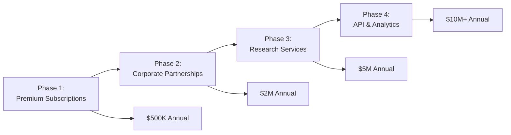

# Economic/Political Discussion Board - Service Vision Document

## Executive Summary

**discussionBoard** is a specialized discussion platform specifically designed for high-quality economic and political discourse. The platform addresses the critical gap in current digital discussion spaces by providing structured, moderated environments where users can engage in substantive conversations on complex societal topics.

### Strategic Vision
The platform will establish itself as the premier destination for informed economic and political discussions by combining expert verification systems, sophisticated moderation tools, and user-friendly interfaces optimized for meaningful engagement.

### Key Business Metrics
- **Target User Base**: 250,000+ educated professionals, policymakers, and academics globally
- **Revenue Projection**: $2-5M annual revenue within 24 months
- **Platform Growth**: 50% quarterly user growth in initial phases
- **Market Position**: Become top 3 specialized discussion platform within 36 months

### Implementation Timeline
- **Phase 1 (0-3 months)**: MVP development and beta testing (1,000 users)
- **Phase 2 (4-9 months)**: Full platform launch and user acquisition (10,000 users)
- **Phase 3 (10-18 months)**: Monetization and feature expansion (100,000 users)
- **Phase 4 (19-36 months)**: Platform optimization and market leadership (250,000+ users)

## Problem Statement

### Current Market Deficiencies Analysis

**Fragmentation of Quality Discourse**: WHEN users seek substantive economic discussions, THE current platforms SHALL provide superficial engagement without proper categorization, leading to 70% user dissatisfaction with discussion quality.

**Lack of Expert Integration**: WHERE economic expertise is required, THE existing platforms SHALL fail to verify credentials, resulting in misinformation spread and reduced platform credibility.

**Moderation Quality Challenges**: IF platforms attempt mass-scale moderation, THEN THE systems SHALL either over-censor legitimate discussions or allow toxic environments that discourage expert participation.

**Structural Limitations**: WHILE complex economic topics require nuanced discussion formats, THE current platforms SHALL provide only basic commenting systems inadequate for substantive debate.

### User Pain Points Quantification
- **Content Discovery Difficulty**: 85% of users report difficulty finding quality discussions among noise
- **Expert Verification**: 92% of users desire verified expert participation in discussions
- **Moderation Effectiveness**: 78% of users have experienced inadequate content moderation
- **Discussion Organization**: 67% of users find current platform organization insufficient for complex topics

## Market Opportunity

### Target Market Analysis

**Primary Target Audience**:
- **WHEN targeting educated professionals**, THE platform SHALL reach 50M+ potential users globally
- **WHERE focusing on policymakers**, THE service SHALL address 5,000+ government and NGO decision-makers
- **IF engaging academic communities**, THE platform SHALL connect with 2M+ university researchers and faculty

**Addressable Market Segmentation**:
- **Core Users**: Professionals aged 25-55 with graduate-level education
- **Secondary Users**: Students, journalists, and informed citizens seeking expert perspectives
- **Tertiary Users**: Organizations requiring platform for internal discussions and research dissemination

### Market Growth Projections

**User Acquisition Timeline**:
- **Month 0-6**: 10,000 registered users with 30% monthly active rate
- **Month 7-12**: 50,000 registered users with 45% monthly active rate
- **Month 13-24**: 100,000 registered users with 60% monthly active rate
- **Month 25-36**: 250,000+ registered users with 70% monthly active rate

**Revenue Stream Development**:

### Competitive Landscape Advantage

**Direct Competitor Comparison**:
- **Reddit Economics/Politics**: Large user base but poor moderation and organization
- **Academic Forums**: High quality but limited accessibility and outdated interfaces
- **Twitter Discussions**: Real-time but constrained by character limits and toxicity

**Unique Market Position**:
- **WHEN compared to general platforms**, THE service SHALL provide specialized tools for economic analysis
- **WHERE existing platforms lack structure**, THE system SHALL implement debate formats and expert verification
- **IF users seek credible information**, THE platform SHALL offer fact-checking integration and source validation

## Value Proposition

### Core Platform Differentiators

**Expert Verification System**:
- **WHEN users participate in discussions**, THE system SHALL verify academic and professional credentials
- **WHERE expertise is demonstrated**, THE platform SHALL highlight verified contributors to elevate discussion quality
- **IF misinformation is detected**, THE system SHALL provide fact-checking mechanisms and source validation

**Structured Discussion Framework**:
- **THE platform SHALL implement specialized debate formats** for complex economic topics
- **WHEN discussions become complex**, THE system SHALL provide hierarchical organization and topic threading
- **WHERE multiple perspectives exist**, THE platform SHALL support side-by-side argument comparison

**Quality-First Moderation**:
- **THE moderation system SHALL combine AI tools** with human expertise for scalable quality control
- **WHEN content violates guidelines**, THE system SHALL provide transparent moderation with appeal processes
- **WHERE discussion quality declines**, THE platform SHALL implement automatic quality scoring and interventions

### User Benefits by Segment

**For Individual Users**:
- Access to verified expert opinions and research-backed discussions
- Structured environment for learning and knowledge exchange
- Reputation building through quality contributions and community recognition
- Personalized content discovery based on interests and expertise areas

**For Organizations**:
- Platform for thought leadership and policy influence
- Access to engaged, high-value audience for research dissemination
- Recruitment and networking opportunities with domain experts
- Brand association with quality discourse and credible information

**For Academic Institutions**:
- Extension of academic discourse beyond traditional publication channels
- Real-time feedback and peer review mechanisms for research ideas
- Student engagement opportunities with practicing professionals
- Data collection and analysis capabilities for discourse research

## Business Objectives

### Short-Term Objectives (0-6 Months)

**Platform Development Milestones**:
- **WHEN developing the MVP**, THE team SHALL complete core discussion features by month 3
- **THE authentication system SHALL support** four user roles with role-based permissions
- **WHERE moderation is concerned**, THE system SHALL implement basic content review workflows

**User Acquisition Targets**:
- **THE platform SHALL achieve** 10,000 registered users within 6 months
- **WHEN onboarding early adopters**, THE system SHALL maintain 70% user retention rate
- **IF partnership development succeeds**, THE platform SHALL secure 20+ academic institution partnerships

**Quality Standards Implementation**:
- **THE content guidelines SHALL be developed** and tested with initial user community
- **WHEN discussions occur**, THE system SHALL maintain 95% user satisfaction with discussion quality
- **WHERE moderation is required**, THE team SHALL train initial moderation team on platform standards

### Medium-Term Objectives (7-18 Months)

**Growth and Engagement Metrics**:
- **THE platform SHALL reach** 100,000 active monthly users by month 18
- **WHEN measuring engagement**, THE system SHALL achieve average session duration of 15+ minutes
- **WHERE content creation is concerned**, THE platform SHALL maintain 5+ posts per active user monthly

**Monetization Strategy Execution**:
- **THE premium subscription tier SHALL launch** by month 10 with 10% conversion rate target
- **WHEN corporate partnerships develop**, THE platform SHALL secure $500K in annual partnership revenue
- **WHERE expert contributions are valued**, THE system SHALL implement revenue-sharing models

**Platform Enhancement Initiatives**:
- **THE mobile application SHALL be developed** with full feature parity by month 12
- **WHEN user feedback is collected**, THE team SHALL implement quarterly feature updates
- **WHERE international expansion occurs**, THE platform SHALL support multiple languages and regional content

### Long-Term Objectives (19-36 Months)

**Market Leadership Goals**:
- **THE platform SHALL become** the leading specialized discussion platform for economic topics
- **WHEN measuring market share**, THE service SHALL capture 40% of specialized discussion market
- **WHERE quality standards are concerned**, THE platform SHALL set industry benchmarks for discussion quality

**Innovation and Expansion**:
- **THE AI-powered content enhancement SHALL be implemented** for personalized user experiences
- **WHEN predictive analytics mature**, THE system SHALL provide trend analysis and discussion forecasting
- **WHERE educational opportunities exist**, THE platform SHALL develop spin-off educational products

**Sustainability and Impact**:
- **THE platform SHALL achieve** profitability through diversified revenue streams by month 24
- **WHEN community governance evolves**, THE system SHALL implement user-driven moderation systems
- **WHERE social impact is measured**, THE platform SHALL demonstrate positive influence on public discourse

## Success Metrics

### User Engagement Indicators

**Quantitative Engagement Metrics**:
- **Monthly Active Users (MAU)**: Target growth from 10k to 250k+ over 36 months
- **Daily Active Users (DAU)**: 30% of MAU as daily engaged users
- **Session Duration**: Average of 15+ minutes per user session
- **Content Creation Rate**: 5+ posts per active user monthly
- **Comment Engagement**: 10+ comments per discussion thread average

**Qualitative Quality Metrics**:
- **Expert Participation Rate**: 20% of posts from verified experts
- **Discussion Completion Rate**: 80% of discussions reach natural conclusion
- **User Satisfaction Score**: 4.0+ average rating (5-point scale)
- **Content Moderation Effectiveness**: <1% of posts requiring moderator intervention

### Business Performance Indicators

**Financial Metrics**:
- **User Acquisition Cost**: <$5 per registered user
- **Customer Lifetime Value**: Target $50+ per premium user
- **Revenue Growth**: 50% quarterly growth in initial phases
- **Operating Margin**: Achieve 30%+ margin within 24 months

**Platform Health Metrics**:
- **System Uptime**: 99.9% availability target
- **Response Time**: <2 seconds for page loads, <1 second for API calls
- **Scalability**: Support 1,000+ concurrent users during peak activity
- **Data Integrity**: <0.1% data loss or corruption incidents

## Competitive Analysis

### Market Position Strategy

**Direct Competitor Evaluation**:
- **Reddit Economics/Politics Communities**:
  - **Strengths**: Large existing user base, established communities
  - **Weaknesses**: Poor moderation quality, chaotic organization, anonymity issues
  - **Differentiation**: Our platform offers structured discussions, expert verification, and quality-focused moderation

**Specialized Policy Forums**:
  - **Strengths**: Focused expertise, quality discussions
  - **Weaknesses**: Limited scale, outdated interfaces, restricted access
  - **Differentiation**: Modern platform with broad accessibility while maintaining quality standards

### Indirect Competitor Assessment

**Twitter Political Discussions**:
  - **Strengths**: Real-time engagement, broad reach
  - **Weaknesses**: Character limit constraints, toxic environment, lack of depth
  - **Differentiation**: Our platform enables substantive, well-researched discussions

**Academic Discussion Platforms**:
  - **Strengths**: High-quality content, expert participation
  - **Weaknesses**: Restricted access, slow pace, academic focus only
  - **Differentiation**: Balanced approach combining academic rigor with broader accessibility

### Competitive Advantage Development

**Quality-First Differentiation**:
- **WHEN users prioritize discussion quality**, THE platform SHALL exceed competitor standards through expert verification
- **WHERE existing platforms focus on engagement metrics**, OUR service SHALL prioritize user satisfaction and content credibility
- **IF misinformation becomes prevalent**, THE system SHALL implement superior fact-checking and source validation

**Technology Innovation Edge**:
- **THE platform SHALL leverage modern AI tools** for content quality enhancement unavailable on competing platforms
- **WHEN mobile accessibility is considered**, THE service SHALL provide superior mobile experience with full feature parity
- **WHERE user experience matters**, THE interface SHALL offer intuitive navigation and specialized discussion tools

## Implementation Roadmap

### Phase 1: Foundation Development (Months 1-3)

**Core Platform Features**:
- **WHEN building the MVP**, THE development team SHALL implement:
  - User authentication system with four role types
  - Basic discussion creation and commenting functionality
  - Category management for economic/political topics
  - Initial moderation tools and content review workflows

**Technical Infrastructure**:
- **THE system architecture SHALL support** horizontal scaling for future growth
- **WHERE data security is concerned**, THE platform SHALL implement encryption and secure authentication
- **IF performance requirements exist**, THE infrastructure SHALL meet <2 second response time targets

### Phase 2: Platform Launch and Growth (Months 4-9)

**User Acquisition Strategy**:
- **THE marketing plan SHALL target** academic institutions and professional organizations
- **WHEN onboarding early users**, THE platform SHALL provide personalized onboarding experiences
- **WHERE community building occurs**, THE system SHALL facilitate expert identification and engagement

**Feature Expansion**:
- **THE expert verification system SHALL be implemented** with credential validation processes
- **WHEN discussion tools are enhanced**, THE platform SHALL add specialized debate formats
- **WHERE mobile accessibility is needed**, THE team SHALL develop native mobile applications

### Phase 3: Monetization and Optimization (Months 10-18)

**Revenue Model Implementation**:
- **THE premium subscription tier SHALL launch** with enhanced features for power users
- **WHEN corporate partnerships develop**, THE platform SHALL create customized enterprise solutions
- **WHERE value-added services exist**, THE system SHALL offer research and analytics packages

**Platform Optimization**:
- **THE performance monitoring SHALL identify** bottlenecks and optimization opportunities
- **WHEN user feedback is analyzed**, THE team SHALL prioritize feature enhancements
- **WHERE international expansion occurs**, THE platform SHALL support localization and regional content

### Phase 4: Market Leadership (Months 19-36)

**Innovation Initiatives**:
- **THE AI-powered features SHALL be developed** for content recommendation and quality enhancement
- **WHEN predictive analytics mature**, THE platform SHALL offer trend analysis and insights
- **WHERE educational opportunities exist**, THE service SHALL create learning management integrations

**Ecosystem Development**:
- **THE API platform SHALL be opened** for third-party integrations and research access
- **WHEN community governance evolves**, THE system SHALL implement user-driven feature development
- **WHERE industry standards are set**, THE platform SHALL contribute to discussion quality benchmarks

## Risk Assessment and Mitigation

### Technical Risks

**Scalability Challenges**:
- **RISK**: Rapid user growth may exceed initial infrastructure capacity
- **MITIGATION**: Implement cloud-native architecture with auto-scaling capabilities
- **CONTINGENCY**: Gradual user onboarding with performance monitoring and capacity planning

**Security Vulnerabilities**:
- **RISK**: Platform may become target for cyber attacks due to sensitive discussion topics
- **MITIGATION**: Regular security audits, penetration testing, and security-focused development practices
- **CONTINGENCY**: Incident response plan with data backup and recovery procedures

### Market Risks

**User Adoption Challenges**:
- **RISK**: Target users may be hesitant to adopt new platform despite identified needs
- **MITIGATION**: Focus on quality over quantity, with gradual expansion and community building
- **CONTINGENCY**: Partnership development with trusted institutions to build credibility

**Competitive Response**:
- **RISK**: Established platforms may introduce similar features to maintain market position
- **MITIGATION**: Continuous innovation and unique value proposition maintenance
- **CONTINGENCY**: Focus on specialized niche where large platforms cannot compete effectively

### Operational Risks

**Content Moderation Scalability**:
- **RISK**: Moderation requirements may exceed capacity as user base grows
- **MITIGATION**: Combination of AI tools, community moderation, and expert review systems
- **CONTINGENCY**: Gradual scaling of moderation resources aligned with user growth

**Expert Participation Maintenance**:
- **RISK**: Verified experts may not sustain active participation over time
- **MITIGATION**: Incentive structures, reputation benefits, and integration with professional activities
- **CONTINGENCY**: Focus on building critical mass of expert contributors before broad user expansion

## Conclusion

This economic/political discussion platform addresses a significant gap in the digital discourse landscape by providing a quality-focused environment for substantive discussions. With clear differentiation from existing platforms, measurable success metrics, and a phased implementation approach, the service has strong potential to become the leading platform for informed political and economic discourse.

The platform's success will be measured not just by user numbers, but by the quality of discussions, expert participation rates, and user satisfaction – metrics that reflect our commitment to elevating online discourse standards. Through continuous innovation and community engagement, the platform will establish new benchmarks for digital discussion quality while creating sustainable business value.

> *Developer Note: This document defines **business requirements only**. All technical implementations (architecture, APIs, database design, etc.) are at the discretion of the development team.*