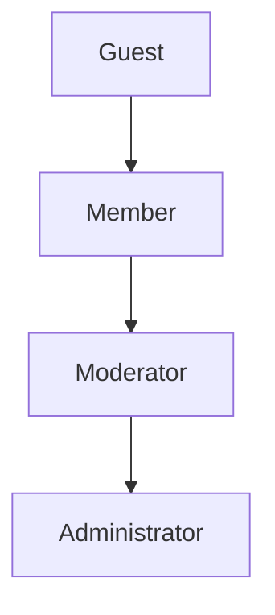
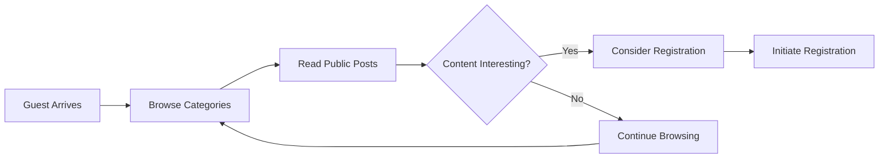
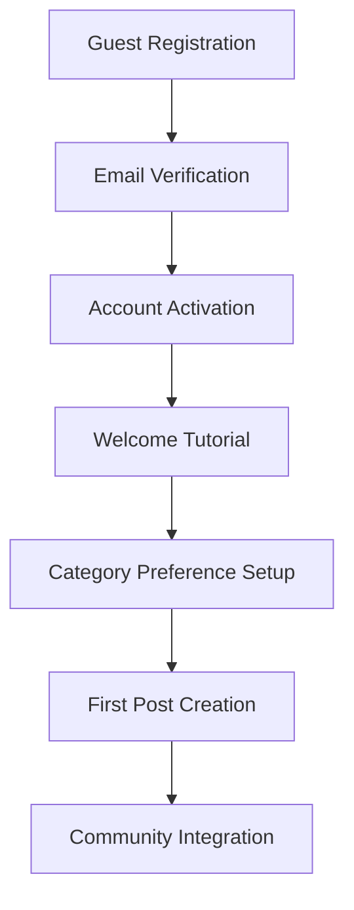
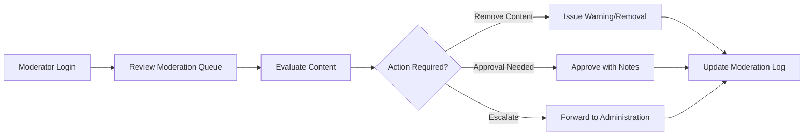
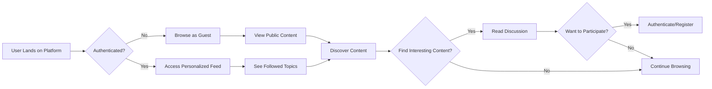
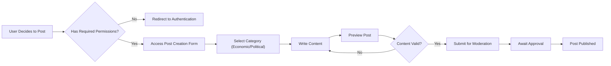

# User Personas Documentation - Economic/Political Discussion Board

## Document Overview

This document defines the complete user personas and authentication requirements for the economic/political discussion board platform. It provides detailed profiles for each user role, their interaction patterns, and the authentication system specifications required for backend implementation.

## Executive Summary

The economic/political discussion board supports four distinct user roles with progressively increasing permissions. Each role has specific capabilities and limitations designed to maintain discussion quality while ensuring platform security. The authentication system uses JWT tokens to manage user sessions and role-based access control.

## User Role Definitions and Hierarchy

### Role Hierarchy Structure

The system implements a hierarchical role structure where each role inherits all permissions from lower roles:



### Detailed User Role Specifications

#### Guest User Role

**Role Description**: Unauthenticated users who can browse discussions and read content without posting or commenting.

**Primary Objectives**:
- Discover content and understand platform value
- Read economic/political discussions
- Evaluate whether to register as a member

**Authentication Status**: No authentication required

**Core Capabilities**:
- WHEN accessing the discussion board, THE guest user SHALL view all public posts and comments
- WHEN browsing content, THE guest user SHALL filter discussions by economic/political categories
- WHEN viewing individual posts, THE guest user SHALL read complete discussion threads
- THE guest user SHALL access search functionality to find relevant content

**Limitations**:
- IF a guest user attempts to create a post, THEN THE system SHALL redirect to registration page
- IF a guest user attempts to comment, THEN THE system SHALL prompt for authentication
- WHILE in guest mode, THE user SHALL not have access to personalization features

**Guest User Interaction Workflow**:


#### Member User Role

**Role Description**: Registered users who can create posts, comment on discussions, and participate in economic/political debates.

**Primary Objectives**:
- Contribute to economic/political discussions
- Build reputation within the community
- Access personalized features

**Authentication Status**: Email/password authentication required

**Core Capabilities**:
- WHEN authenticated as a member, THE user SHALL create new discussion posts in economic/political categories
- THE member user SHALL comment on existing posts to participate in discussions
- THE member user SHALL edit their own posts within 24 hours of creation
- THE member user SHALL delete their own posts and comments
- THE member user SHALL report inappropriate content to moderators
- THE member user SHALL receive notifications for replies to their posts

**Member-Specific Features**:
- WHERE a member creates a post, THE system SHALL validate content against platform guidelines
- WHEN a member's post receives moderation action, THE system SHALL notify the member with explanation
- THE member user SHALL have a personal profile showing their discussion history

**Member Registration and Onboarding**:


#### Moderator User Role

**Role Description**: Trusted users with content management privileges to review posts, handle reports, and maintain discussion quality.

**Primary Objectives**:
- Maintain discussion quality and platform integrity
- Enforce community guidelines
- Provide content curation

**Authentication Status**: Elevated permissions granted by administrators

**Core Capabilities**:
- THE moderator SHALL review all reported content for guideline violations
- WHEN content violates guidelines, THE moderator SHALL remove posts or comments
- THE moderator SHALL temporarily suspend members for repeated violations
- THE moderator SHALL approve/reject posts flagged by automated systems
- THE moderator SHALL move posts between appropriate economic/political categories

**Moderation Tools**:
- WHERE a moderator takes action, THE system SHALL log all moderation activities
- WHEN moderating content, THE moderator SHALL provide clear reasoning for actions
- THE moderator SHALL access moderation dashboard for efficient content review

**Moderator Workflow**:


#### Administrator User Role

**Role Description**: System administrators with full access to user management, system settings, and content moderation tools.

**Primary Objectives**:
- Manage overall platform operations
- Configure system settings and policies
- Oversee user and content management

**Authentication Status**: Highest privilege level with system-wide access

**Core Capabilities**:
- THE administrator SHALL manage all user accounts and roles
- THE administrator SHALL promote/demote users between member/moderator roles
- THE administrator SHALL configure system-wide settings and policies
- THE administrator SHALL access comprehensive analytics and reporting
- THE administrator SHALL manage economic/political category structure

**Administrative Functions**:
- WHEN managing user roles, THE administrator SHALL follow platform governance policies
- WHERE system configuration changes are made, THE administrator SHALL document changes
- THE administrator SHALL have access to all moderation tools and override capabilities

## Authentication System Requirements

### Core Authentication Functions

**User Registration**:
- WHEN a guest user registers, THE system SHALL validate email format and password strength
- THE registration process SHALL require email verification before account activation
- WHERE email verification is required, THE system SHALL send verification link with 24-hour expiration

**User Login**:
- WHEN a user provides login credentials, THE system SHALL validate and respond within 2 seconds
- IF login credentials are invalid, THE system SHALL return appropriate error message
- THE system SHALL implement secure password hashing for credential storage

**Session Management**:
- THE user session SHALL expire after 30 minutes of inactivity
- WHERE session expiration occurs, THE system SHALL provide clear re-authentication flow
- THE system SHALL support "remember me" functionality with extended session duration

### JWT Token Specification

**Token Structure Requirements**:
- THE JWT token SHALL contain user ID, role, and permissions array
- THE access token SHALL expire after 30 minutes for security
- THE refresh token SHALL expire after 30 days for user convenience

**Token Payload Structure**:
```json
{
  "userId": "unique-user-identifier",
  "role": "member|moderator|admin",
  "permissions": ["create_post", "comment", "moderate", "administer"],
  "iat": 1234567890,
  "exp": 1234568910
}
```

**Token Security**:
- THE JWT secret key SHALL be securely stored and rotated periodically
- WHERE token refresh is required, THE system SHALL validate refresh token validity
- THE system SHALL implement token blacklisting for logged-out sessions

## Permission Matrix

### Complete Access Control Specification

| Action | Guest | Member | Moderator | Administrator |
|--------|-------|--------|-----------|----------------|
| Browse public posts | ✅ | ✅ | ✅ | ✅ |
| Read discussions | ✅ | ✅ | ✅ | ✅ |
| Search content | ✅ | ✅ | ✅ | ✅ |
| Create new posts | ❌ | ✅ | ✅ | ✅ |
| Comment on posts | ❌ | ✅ | ✅ | ✅ |
| Edit own content | ❌ | ✅ | ✅ | ✅ |
| Delete own content | ❌ | ✅ | ✅ | ✅ |
| Report content | ❌ | ✅ | ✅ | ✅ |
| Review reported content | ❌ | ❌ | ✅ | ✅ |
| Remove inappropriate content | ❌ | ❌ | ✅ | ✅ |
| Manage user roles | ❌ | ❌ | ❌ | ✅ |
| Configure system settings | ❌ | ❌ | ❌ | ✅ |
| Access all moderation tools | ❌ | ❌ | ❌ | ✅ |

### Category-Specific Permissions

**Economic Discussions**:
- ALL authenticated users SHALL have equal access to economic discussion categories
- WHERE content is economic-focused, THE same posting rules SHALL apply across all roles
- THE economic category SHALL support specialized content types like data analysis and market trends

**Political Discussions**:
- THE political discussion categories SHALL follow identical permission structures
- WHILE in political discussions, THE moderation guidelines SHALL be strictly enforced
- THE political category SHALL support debate formats and policy analysis discussions

## User Interaction Patterns

### Content Discovery Flow



### Post Creation Workflow



## Error Handling Scenarios

### Authentication Errors
- IF user provides invalid credentials, THEN THE system SHALL return "Invalid credentials" error
- WHEN account is suspended, THEN THE system SHALL clearly communicate suspension reason and duration
- WHERE email verification is pending, THEN THE system SHALL prevent post creation until verification

### Permission Errors
- IF user attempts unauthorized action, THEN THE system SHALL display appropriate permission message
- WHEN content access is restricted, THEN THE system SHALL explain restriction reason
- WHERE role limitations apply, THEN THE system SHALL suggest upgrade path if available

### Registration and Account Management Errors
- WHEN email verification fails, THE system SHALL provide clear instructions for resolution
- IF username is already taken, THE system SHALL suggest available alternatives
- WHERE account creation encounters technical issues, THE system SHALL preserve input data and provide support contact

### Session Management Errors
- WHEN session timeout occurs during post creation, THE system SHALL attempt to save draft content
- IF multiple login attempts are detected, THE system SHALL implement security measures
- WHERE device validation fails, THE system SHALL require additional authentication steps

## Integration with Other Documents

This user persona document integrates with:
- [Service Vision Document](./01-service-vision.md) for business context alignment
- [User Journey Documentation](./03-user-journey.md) for detailed interaction flows
- [Functional Requirements](./04-functional-requirements.md) for implementation specifications
- [Business Rules Document](./05-business-rules.md) for permission enforcement logic

Each persona definition provides the foundation for corresponding features in the functional requirements document, ensuring consistent user experience across all platform interactions.

## Success Metrics

User persona implementation success will be measured by:
- **User Registration Conversion Rate**: Target 15% conversion from guest to member
- **Member Engagement Metrics**: Target 5+ posts per active user monthly
- **Moderation Effectiveness**: Target <2% of content requiring moderator intervention
- **Administrator Efficiency**: Target <15 minutes average user management time
- **Authentication Success Rate**: Target 99.5% successful login attempts

These metrics will validate that the persona definitions accurately reflect user needs and support effective platform operation.

## Authentication System Performance Requirements

**Response Time Standards**:
- WHEN user attempts login, THE system SHALL respond within 2 seconds
- WHERE JWT token validation is required, THE system SHALL complete within 500ms
- WHEN session refresh is initiated, THE system SHALL provide new token within 1 second

**Security Requirements**:
- THE authentication system SHALL prevent brute force attacks with rate limiting
- WHERE suspicious activity is detected, THE system SHALL implement additional security checks
- THE system SHALL maintain audit logs of all authentication attempts

**Recovery Processes**:
- WHEN password reset is requested, THE system SHALL send secure reset link within 1 minute
- IF account recovery fails, THE system SHALL provide customer support escalation path
- WHERE authentication tokens are compromised, THE system SHALL support token revocation

> *Developer Note: This document defines **business requirements only**. All technical implementations (architecture, APIs, database design, etc.) are at the discretion of the development team.*