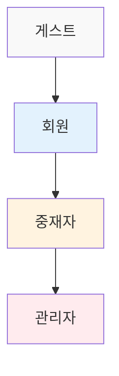
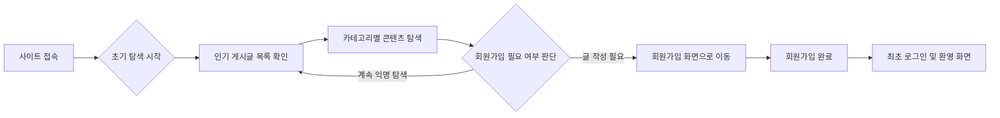
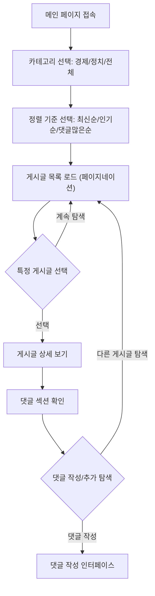
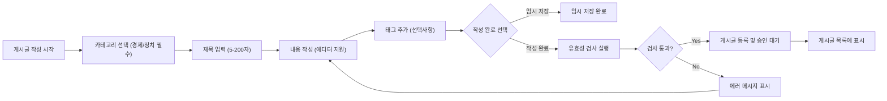
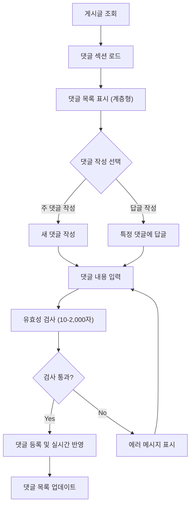
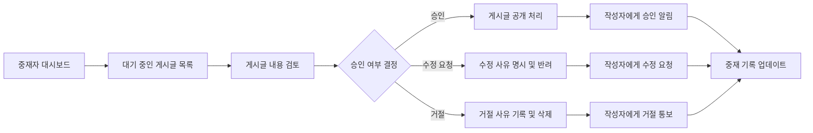
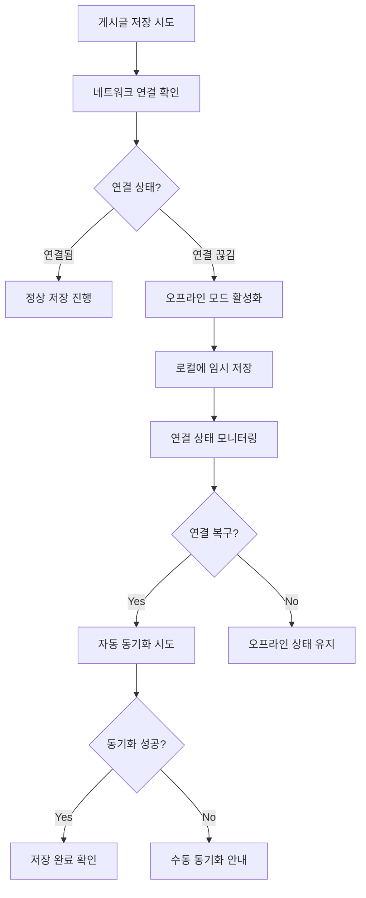

# 사용자 여정 문서 - 경제/정치 토론 게시판

## 1. 플랫폼 개요 및 비즈니스 목표

**WHEN 사용자가 경제/정치 토론 게시판에 접속하면, THE 시스템 SHALL 전문적인 토론 환경을 제공한다.**

### 1.1 플랫폼 비즈니스 목표
- **정보 공유 플랫폼**: 경제/정치 관련 신뢰성 있는 정보 공유 공간 구축
- **토론 문화 조성**: 다양한 의견이 존중되는 열린 토론 환경 제공
- **커뮤니티 활성화**: 사용자 참여를 통한 지식 교류 및 협력 장려
- **품질 관리**: 건전한 토론 문화를 위한 콘텐츠 품질 관리 시스템 구현

### 1.2 사용자 역할 체계

## 2. 온보딩 과정 상세 명세

### 2.1 게스트 탐색 경험

**WHEN 게스트 사용자가 플랫폼에 처음 접속하면, THE 시스템 SHALL 제한된 탐색 기능을 제공한다.**

**게스트 권한 요구사항:**
- WHEN 게스트가 게시글을 조회할 때, THE 시스템 SHALL 모든 공개 게시글을 표시한다
- WHERE 게스트가 댓글 작성을 시도할 때, THE 시스템 SHALL 로그인 요청 메시지를 표시한다
- IF 게스트가 게시글 작성을 시도하면, THEN THE 시스템 SHALL 회원가입 유도 인터페이스를 제공한다

### 2.2 회원가입 플로우 상세 명세

**WHEN 사용자가 회원가입을 선택하면, THE 시스템 SHALL 다음 정보 수집 및 검증을 수행한다:**

**필수 입력 정보 검증:**
- **이메일 주소**: WHEN 이메일을 입력하면, THE 시스템 SHALL RFC 5322 표준 형식 검증을 수행한다
- **비밀번호**: WHEN 비밀번호를 설정하면, THE 시스템 SHALL 최소 8자, 대소문자 및 숫자 포함 요구사항을 검증한다
- **닉네임**: WHEN 닉네임을 입력하면, THE 시스템 SHALL 중복 검사 및 3-20자 제한을 검증한다

**회원가입 완료 후 처리:**
- WHEN 회원가입이 성공하면, THE 시스템 SHALL 이메일 인증 링크를 발송한다
- WHERE 이메일 인증이 완료되면, THE 시스템 SHALL 완전한 회원 권한을 부여한다
- IF 이메일 인증이 24시간 내 완료되지 않으면, THEN THE 시스템 SHALL 재발송 옵션을 제공한다

### 2.3 최초 사용자 경험 개선

**WHEN 신규 회원이 첫 로그인을 하면, THE 시스템 SHALL 개인화된 온보딩 경험을 제공한다:**
- **튜토리얼 가이드**: THE 시스템 SHALL 게시글 작성, 댓글 달기 기본 기능을 단계별로 안내한다
- **관심사 설정**: WHEN 사용자가 관심 카테고리를 선택하면, THE 시스템 SHALL 맞춤형 콘텐츠 추천을 제공한다
- **커뮤니티 규칙**: THE 시스템 SHALL 토론 에티켓 및 이용 약관을 간결하게 설명한다

## 3. 콘텐츠 탐색 및 발견 시스템

### 3.1 메인 탐색 인터페이스 요구사항

**WHEN 사용자가 메인 페이지에 접속하면, THE 시스템 SHALL 직관적인 탐색 인터페이스를 제공한다.**

**탐색 기능 상세 요구사항:**
- **카테고리 필터링**: WHEN 사용자가 경제 카테고리를 선택하면, THE 시스템 SHALL 경제 관련 게시글만 표시한다
- **정렬 옵션**: WHERE 사용자가 인기순 정렬을 선택하면, THE 시스템 SHALL 조회수 및 댓글 수를 기준으로 정렬한다
- **페이지네이션**: THE 시스템 SHALL 한 페이지당 20개의 게시글을 표시하며 무한 스크롤을 지원한다

### 3.2 검색 및 발견 기능 명세

**WHEN 사용자가 검색 기능을 사용하면, THE 시스템 SHALL 포괄적인 검색 옵션을 제공한다.**

**검색 알고리즘 요구사항:**
- **키워드 검색**: WHEN 검색어를 입력하면, THE 시스템 SHALL 제목, 내용, 작성자명에서 관련성을 평가한다
- **유사어 처리**: WHERE 검색어에 오타가 있는 경우, THE 시스템 SHALL 유사어 검색을 시도한다
- **검색 결과 순위**: THE 시스템 SHALL 관련성, 최신성, 인기도를 조합하여 결과 순위를 매긴다

**검색 성능 요구사항:**
- WHEN 검색 요청이 발생하면, THE 시스템 SHALL 2초 이내에 결과를 반환한다
- WHERE 동시 검색 사용자가 100명을 초과하면, THE 시스템 SHALL 성능 저하 없이 처리한다
- THE 검색 시스템 SHALL 인기 검색어 트렌드를 실시간으로 분석한다

### 3.3 개인화된 콘텐츠 추천 시스템

**WHEN 사용자가 정기적으로 플랫폼을 이용하면, THE 시스템 SHALL 개인화된 추천을 제공한다:**
- **관심사 기반 추천**: WHERE 사용자가 경제 카테고리를 선호하면, THE 시스템 SHALL 경제 관련 인기 게시글을 우선 표시한다
- **활동 기반 추천**: WHEN 사용자가 특정 주제에 댓글을 작성하면, THE 시스템 SHALL 유사한 주제의 게시글을 추천한다
- **실시간 트렌드**: THE 시스템 SHALL 현재 인기 있는 토론 주제를 실시간으로 하이라이트한다

## 4. 게시글 작성 및 관리 시스템

### 4.1 게시글 생성 전체 흐름 명세

**WHEN 인증된 회원이 게시글 작성을 시작하면, THE 시스템 SHALL 체계적인 작성 프로세스를 제공한다.**

**게시글 유효성 검증 규칙:**
- **제목 검증**: WHEN 제목을 입력하면, THE 시스템 SHALL 5-200자 범위 검증을 수행한다
- **내용 검증**: WHERE 내용을 작성하면, THE 시스템 SHALL 최소 50자 이상 요구사항을 검증한다
- **중복 검사**: IF 동일한 제목의 게시글이 24시간 내 존재하면, THEN THE 시스템 SHALL 중복 경고를 표시한다
- **부적절어 필터링**: THE 시스템 SHALL 욕설 및 혐오 표현을 자동으로 검출한다

### 4.2 게시글 에디터 기능 명세

**WHEN 사용자가 게시글 작성을 시작하면, THE 시스템 SHALL 풍부한 에디터 기능을 제공한다:**
- **기본 서식 지원**: THE 시스템 SHALL 굵게, 기울임, 목록 등 기본 텍스트 서식을 제공한다
- **미디어 지원**: WHEN 이미지를 업로드하면, THE 시스템 SHALL 자동 리사이징 및 최대 5MB 제한을 적용한다
- **초안 관리**: THE 시스템 SHALL 5분 간격으로 자동 저장하며 사용자가 수동 저장할 수 있도록 한다
- **미리보기 기능**: WHERE 사용자가 미리보기를 요청하면, THE 시스템 SHALL 실제 게시될 모습을 표시한다

### 4.3 게시글 라이프사이클 관리

**게시글 상태 전이 요구사항:**

| 상태 | 설명 | 전이 조건 |
|------|------|-----------|
| **작성 중** | 임시 저장 상태 | 사용자가 작성 중인 상태 |
| **검토 대기** | 중재자 승인 대기 | 게시글 제출 후 자동 설정 |
| **게시됨** | 공개 상태 | 중재자 승인 또는 자동 승인 후 |
| **수정 대기** | 재검토 필요 | 사용자 수정 제출 후 |
| **삭제됨** | 제거 상태 | 사용자 또는 중재자 삭제 |
| **숨김** | 비공개 처리 | 규정 위반으로 중재자 조치 |

**상태 전이 규칙:**
- WHEN 게시글이 "검토 대기" 상태이면, THE 시스템 SHALL 중재자에게 알림을 발송한다
- WHERE 게시글이 "게시됨" 상태이면, THE 시스템 SHALL 모든 사용자에게 표시한다
- IF 게시글이 "숨김" 상태로 전이하면, THEN THE 시스템 SHALL 작성자에게 사유를 통지한다

## 5. 댓글 시스템 및 토론 관리

### 5.1 댓글 시스템 아키텍처 명세

**WHEN 사용자가 게시글을 조회하면, THE 시스템 SHALL 체계적인 댓글 시스템을 제공한다.**

**댓글 작성 요구사항:**
- **길이 검증**: WHEN 댓글을 작성하면, THE 시스템 SHALL 10-2,000자 범위 검증을 수행한다
- **실시간 검증**: THE 시스템 SHALL 작성 중 실시간으로 글자수와 기본 문법 검사를 제공한다
- **중복 방지**: IF 동일한 내용의 댓글을 5분 내 작성하면, THEN THE 시스템 SHALL 중복 경고를 표시한다
- **부적절어 필터링**: THE 시스템 SHALL 자동으로 부적절한 언어를 검출하고 경고한다

### 5.2 댓글 관리 기능 명세

**댓글 작성자 권한 관리:**
- **수정 권한**: WHEN 댓글 작성자가 수정을 요청하면, THE 시스템 SHALL 1시간 내 수정을 허용한다
- **삭제 권한**: WHERE 댓글 작성자가 삭제를 요청하면, THE 시스템 SHALL 즉시 삭제를 처리한다
- **답글 시스템**: THE 시스템 SHALL 최대 3단계 깊이의 계층형 답글 구조를 지원한다

**실시간 기능 요구사항:**
- WHEN 새 댓글이 작성되면, THE 시스템 SHALL 실시간으로 목록을 업데이트한다
- WHERE 사용자가 실시간 업데이트를 비활성화하면, THE 시스템 SHALL 수동 새로고침을 제공한다
- THE 시스템 SHALL 댓글 작성자에게 답글 알림을 자동으로 발송한다

### 5.3 토론 품질 관리 시스템

**토론 품질 유지 요구사항:**
- **신고 시스템**: WHEN 사용자가 부적절한 댓글을 발견하면, THE 시스템 SHALL 신고 기능을 제공한다
- **추천 기능**: WHERE 댓글이 유용한 경우, THE 시스템 SHALL 추천 기능을 통해 가시성을 높인다
- **토론 매너 가이드**: THE 시스템 SHALL 건설적인 토론을 장려하는 가이드라인을 제공한다
- **활동 제한**: IF 사용자가 과도하게 댓글을 작성하면, THEN THE 시스템 SHALL 속도 제한을 적용한다

## 6. 중재 시스템 및 콘텐츠 관리

### 6.1 콘텐츠 중재 프로세스 명세

**WHEN 중재자가 콘텐츠 검토를 시작하면, THE 시스템 SHALL 체계적인 중재 프로세스를 제공한다.**

**중재자 권한 및 책임 명세:**
- **게시글 검토**: WHEN 중재자가 게시글을 검토하면, THE 시스템 SHALL 완전한 콘텐츠 정보를 제공한다
- **승인/반려 결정**: WHERE 중재자가 결정을 내리면, THE 시스템 SHALL 표준화된 사유 목록을 제공한다
- **작성자 통지**: THE 시스템 SHALL 모든 중재 결정에 대해 작성자에게 자동 통지를 발송한다
- **중재 이력 추적**: THE 시스템 SHALL 모든 중재 활동에 대한 상세 기록을 유지한다

### 6.2 실시간 모니터링 시스템

**콘텐츠 모니터링 요구사항:**
- **신고 우선 처리**: WHEN 콘텐츠가 신고되면, THE 시스템 SHALL 중재자 대시보드에서 우선 표시한다
- **위험 콘텐츠 식별**: WHERE 사용자 신고 패턴이 발생하면, THE 시스템 SHALL 위험 콘텐츠를 자동 식별한다
- **활동 모니터링**: THE 시스템 SHALL 실시간으로 사용자 활동을 모니터링하여 이상 패턴을 감지한다
- **패턴 분석**: THE 시스템 SHALL 커뮤니티 규정 위반 패턴을 분석하여 예방 조치를 제안한다

### 6.3 중재 기준 및 정책 명세

**콘텐츠 승인 기준 요구사항:**
- **주제 관련성**: WHEN 게시글이 경제/정치 범위를 벗어나면, THE 시스템 SHALL 반려 사유를 명시한다
- **사실 기반 여부**: WHERE 허위 정보가 포함되면, THE 시스템 SHALL 사실 검증 요구를 안내한다
- **토론 매너**: IF 비방 또는 혐오 표현이 포함되면, THEN THE 시스템 SHALL 즉시 거절 처리한다
- **저작권 준수**: THE 시스템 SHALL 출처 미명시 콘텐츠에 대해 수정을 요청한다

**반려 사유 카테고리 체계:**

| 사유 카테고리 | 설명 | 처리 절차 |
|---------------|------|-----------|
| **주제 부적합** | 경제/정치 카테고리 위반 | 카테고리 변경 요청 또는 반려 |
| **사실 관계 오류** | 검증 불가 정보 포함 | 사실 확인 자료 요청 |
| **규정 위반** | 욕설, 차별적 표현 사용 | 즉시 반려 및 경고 |
| **스팸/광고성** | 상업적 목적의 콘텐츠 | 반려 및 계정 검토 |
| **저작권 침해** | 출처 미표시 또는 무단 사용 | 수정 요청 또는 반려 |

## 7. 관리자 시스템 및 운영 관리

### 7.1 시스템 관리 기능 명세

**WHEN 관리자가 시스템에 접속하면, THE 시스템 SHALL 포괄적인 관리 도구를 제공한다.**

**관리자 대시보드 요구사항:**
- **실시간 통계**: THE 시스템 SHALL 방문자 수, 게시글 수, 댓글 수 등 실시간 통계를 표시한다
- **사용자 활동 추이**: WHEN 관리자가 활동 추이를 요청하면, THE 시스템 SHALL 시계열 그래프를 제공한다
- **중재 대기 현황**: THE 시스템 SHALL 현재 대기 중인 콘텐츠 수와 평균 처리 시간을 표시한다
- **시스템 상태**: WHERE 시스템 성능 이슈가 발생하면, THE 시스템 SHALL 즉시 경고를 표시한다

**사용자 관리 기능 명세:**
- **계정 조회**: WHEN 관리자가 사용자를 검색하면, THE 시스템 SHALL 상세 프로필 정보를 제공한다
- **역할 변경**: WHERE 관리자가 사용자 역할을 변경하면, THE 시스템 SHALL 즉시 적용하고 통지한다
- **이용 제한**: IF 사용자가 규정을 위반하면, THEN THE 시스템 SHALL 일시정지 또는 영구정지 기능을 제공한다
- **활동 로그**: THE 시스템 SHALL 사용자별 상세 활동 로그를 조회할 수 있도록 한다

### 7.2 시스템 설정 관리 명세

**플랫폼 설정 관리 요구사항:**
- **카테고리 관리**: WHEN 관리자가 카테고리를 추가하면, THE 시스템 SHALL 즉시 반영하고 재구성을 지원한다
- **커뮤니티 규정**: WHERE 규정이 변경되면, THE 시스템 SHALL 모든 사용자에게 공지하고 동의를 요청한다
- **자동 필터링**: THE 시스템 SHALL 부적절어 필터링 규칙을 실시간으로 수정할 수 있도록 한다
- **이메일 템플릿**: THE 시스템 SHALL 다양한 알림 유형별 이메일 템플릿을 관리할 수 있도록 한다

## 8. 오류 처리 및 사용자 복구 시스템

### 8.1 인증 관련 오류 처리

**로그인 실패 시나리오 처리:**

**WHEN 사용자 인증에 실패하면, THE 시스템 SHALL 체계적인 오류 처리를 수행한다:**
- **자격 증명 오류**: IF 이메일 또는 비밀번호가 잘못되면, THEN THE 시스템 SHALL 일반적인 오류 메시지를 표시한다
- **계정 잠금**: WHERE 5회 연속 로그인 실패가 발생하면, THE 시스템 SHALL 15분간 계정 잠금을 적용한다
- **비밀번호 재설정**: THE 시스템 SHALL 안전한 비밀번호 재설정 프로세스를 제공한다

**세션 관리 오류 처리:**
- **토큰 만료**: WHEN JWT 토큰이 만료되면, THE 시스템 SHALL 자동 갱신을 시도한다
- **세션 충돌**: WHERE 동시 다중 접속이 발생하면, THE 시스템 SHALL 세션 우선순위를 적용한다
- **데이터 보존**: THE 시스템 SHALL 세션 만료 시 작성 중인 내용을 임시 저장한다

### 8.2 콘텐츠 제출 오류 처리

**게시글 저장 실패 복구 프로세스:**

**유효성 검사 오류 처리:**
- **실시간 검증**: WHEN 사용자가 내용을 입력하면, THE 시스템 SHALL 실시간으로 오류를 표시한다
- **구체적인 안내**: WHERE 오류가 발생하면, THE 시스템 SHALL 수정 방법을 상세히 안내한다
- **부분 저장**: THE 시스템 SHALL 검증 통과 부분은 임시 저장하여 데이터 손실을 방지한다

### 8.3 시스템 장애 대응 체계

**서비스 중단 시나리오 대응:**
- **사전 공지**: WHEN 계획된 유지보수가 예정되면, THE 시스템 SHALL 7일 전부터 공지를 표시한다
- **실시간 상태**: WHERE 서비스가 중단되면, THE 시스템 SHALL 실시간 상태 페이지를 제공한다
- **복구 통지**: THE 시스템 SHALL 서비스 복구 시 즉시 사용자에게 통지한다

**데이터 일관성 문제 처리:**
- **충돌 탐지**: WHEN 데이터 충돌이 발생하면, THE 시스템 SHALL 자동으로 탐지하고 통지한다
- **버전 관리**: THE 시스템 SHALL 내용 변경 시 버전 관리를 통해 복구를 지원한다
- **손실 최소화**: 모든 사용자 작업은 실시간으로 백업되어 데이터 손실을 최소화한다

## 9. 성능 및 사용성 요구사항

### 9.1 응답 시간 성능 목표

**WHEN 사용자가 플랫폼을 이용하면, THE 시스템 SHALL 최적의 성능을 제공한다:**

| 작업 유형 | 목표 응답 시간 | 측정 기준 |
|-----------|----------------|-----------|
| 페이지 로딩 | 2초 이내 | 첫 바이트부터 완전 로드까지 |
| 게시글 조회 | 1초 이내 | 클릭부터 내용 표시까지 |
| 댓글 작성 | 500ms 이내 | 제출부터 반영까지 |
| 검색 결과 | 1.5초 이내 | 검색어 입력부터 결과 표시까지 |
| 실시간 업데이트 | 200ms 이내 | 이벤트 발생부터 동기화까지 |

### 9.2 동시 사용자 지원 명세

**시스템 확장성 요구사항:**
- **초기 용량**: THE 시스템 SHALL 1,000명의 동시 접속 사용자를 지원한다
- **게시글 처리**: WHERE 동시 게시글이 발생하면, THE 시스템 SHALL 초당 100건을 처리한다
- **댓글 처리**: THE 시스템 SHALL 초당 50개의 댓글 작성을 지원한다
- **검색 부하**: WHEN 다수 사용자가 동시 검색하면, THE 시스템 SHALL 초당 200건을 처리한다

## 10. 보안 및 개인정보 보호 체계

### 10.1 인증 보안 요구사항

**JWT 토큰 관리 정책:**
- **토큰 만료**: THE 시스템 SHALL 액세스 토큰을 30분, 리프레시 토큰을 7일 만료로 설정한다
- **안전한 저장**: WHEN 토큰을 저장하면, THE 시스템 SHALL httpOnly 쿠키를 사용한다
- **자동 로그인**: THE 시스템 SHALL 사용자 선택에 따른 자동 로그인 기능을 제공한다

### 10.2 데이터 보호 원칙

**개인정보 처리 요구사항:**
- **수집 최소화**: THE 시스템 SHALL 서비스 운영에 필수적인 개인정보만 수집한다
- **암호화 저장**: WHERE 개인정보를 저장하면, THE 시스템 SHALL AES-256 암호화를 적용한다
- **데이터 파기**: WHEN 계정이 삭제되면, THE 시스템 SHALL 관련 개인정보를 30일 이내 파기한다
- **익명화 처리**: THE 시스템 SHALL 분석용 데이터는 익명화하여 처리한다

### 10.3 규정 준수 요구사항

**법적 준수 사항:**
- **개인정보보호법**: THE 시스템 SHALL 대한민국 개인정보보호법을 완전히 준수한다
- **정보통신망법**: WHERE 콘텐츠를 관리하면, THE 시스템 SHALL 관련 법률을 준수한다
- ** 기록 보관**: THE 시스템 SHALL 최소 6개월간의 접속 기록을 보관한다

## 11. 시스템 모니터링 및 유지보수

### 11.1 실시간 모니터링 체계

**시스템 건강도 모니터링:**
- **성능 지표**: THE 시스템 SHALL 응답 시간, 오류율, 처리량을 실시간으로 모니터링한다
- **사용자 활동**: WHEN 이상 패턴이 감지되면, THE 시스템 SHALL 즉시 경고를 생성한다
- **자원 사용량**: THE 시스템 SHALL CPU, 메모리, 저장소 사용량을 모니터링한다

### 11.2 로깅 및 감사 요구사항

**종합 로깅 시스템:**
- **감사 로그**: THE 시스템 SHALL 모든 사용자 활동에 대한 상세 로그를 유지한다
- **오류 로그**: WHEN 시스템 오류가 발생하면, THE 시스템 SHALL 완전한 스택 트레이스를 기록한다
- **보존 정책**: THE 시스템 SHALL 최소 1년간의 시스템 로그를 보관한다

### 11.3 백업 및 복구 체계

**데이터 보호 요구사항:**
- **정기 백업**: THE 시스템 SHALL 매일 데이터베이스 전체 백업을 수행한다
- **실시간 백업**: WHERE 데이터 변경이 발생하면, THE 시스템 SHALL 실시간 증분 백업을 수행한다
- **복구 테스트**: THE 시스템 SHALL 분기별 백업 복구 테스트를 수행한다

> *Developer Note: This document defines **business requirements only**. All technical implementations (architecture, APIs, database design, etc.) are at the discretion of the development team.*