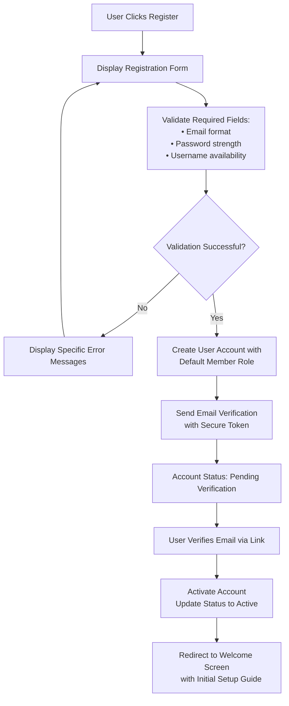
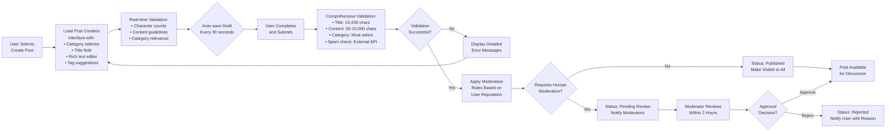
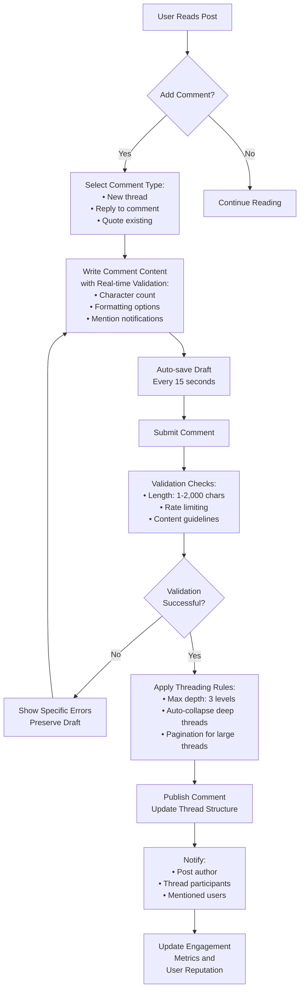
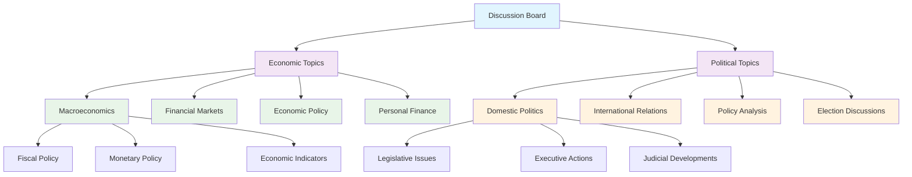

# Enhanced Functional Requirements Document - Economic/Political Discussion Board

## 1. Complete Authentication System Requirements

### 1.1 Comprehensive User Registration Workflow

**WHEN a new user attempts to register for the discussion board, THE system SHALL implement a complete registration workflow with the following steps:**

**Registration Validation Requirements:**
- **WHEN a user enters an email address, THE system SHALL validate it against RFC 5322 email format standards**
- **WHEN a user creates a password, THE system SHALL enforce minimum complexity: 8+ characters, including uppercase, lowercase, numbers, and special characters**
- **WHEN a user selects a username, THE system SHALL check for uniqueness and validate against allowed character patterns (alphanumeric, 3-30 characters)**
- **IF any validation fails, THEN THE system SHALL provide specific, actionable error messages indicating exactly what needs correction**

**Email Verification Requirements:**
- **THE email verification token SHALL expire after 24 hours for security purposes**
- **WHEN verification fails, THE system SHALL allow users to request a new verification email**
- **DURING the verification period, THE system SHALL restrict users to read-only access until email confirmation**

### 1.2 Robust Login and Session Management

**WHEN a registered user attempts to log in, THE system SHALL implement comprehensive authentication with the following security measures:**

**Login Validation Flow:**
- **WHEN credentials are submitted, THE system SHALL verify against stored hashed passwords using bcrypt algorithm**
- **IF authentication succeeds, THEN THE system SHALL generate a JWT token containing user ID, role, and permissions array**
- **THE JWT token SHALL have a 15-minute expiration time for enhanced security**
- **WHERE multiple failed login attempts occur, THE system SHALL implement progressive lockout: 5 attempts → 15-minute lock, 10 attempts → 1-hour lock**

**Session Management Specifications:**
- **THE system SHALL maintain session state across user interactions while enforcing security timeouts**
- **WHEN a session approaches expiration, THE system SHALL provide a 2-minute warning with option to extend**
- **WHERE users enable "remember me" functionality, THE system SHALL use secure refresh tokens with 30-day expiration**
- **ALL session data SHALL be encrypted and protected against session hijacking attacks**

### 1.3 Comprehensive Password Management

**WHEN users need to manage their passwords, THE system SHALL provide secure self-service options:**

**Password Reset Workflow:**
- **WHEN a user requests password reset, THE system SHALL send a secure reset link to the registered email**
- **THE reset link SHALL contain a time-limited token that expires after 1 hour**
- **DURING password reset, THE system SHALL require identity verification through security questions or email confirmation**
- **AFTER successful password change, THE system SHALL invalidate all active sessions and require re-authentication**

**Password Security Requirements:**
- **THE system SHALL prevent password reuse by maintaining a history of previous passwords (last 5 passwords)**
- **WHEN a user changes their password, THE system SHALL require confirmation of the current password for authorization**
- **ALL password-related operations SHALL be logged for security audit purposes**

## 2. Comprehensive Post Management System

### 2.1 Complete Post Creation Workflow

**WHEN an authenticated member creates a new discussion post, THE system SHALL implement a thorough creation process:**

**Post Validation Requirements:**
- **THE post title SHALL require minimum 10 characters and maximum 200 characters with meaningful content**
- **THE post content SHALL enforce minimum 50 characters to ensure substantive discussion and maximum 10,000 characters for readability**
- **WHEN a post is submitted, THE system SHALL perform duplicate detection by comparing against recent posts with similar titles and content**
- **IF potential duplicate is found, THEN THE system SHALL suggest merging with existing discussion or confirm original content**

**Content Quality Enforcement:**
- **THE system SHALL automatically flag posts containing prohibited keywords or suspicious patterns**
- **WHERE posts contain external links, THE system SHALL perform safety checks before allowing publication**
- **ALL posts SHALL undergo basic grammar and readability analysis to maintain discussion quality standards**

### 2.2 Advanced Post Viewing and Interaction

**WHEN users browse and interact with posts, THE system SHALL provide rich viewing capabilities:**

**Viewing Interface Requirements:**
- **THE post display SHALL show author information, publication timestamp, view count, and engagement metrics prominently**
- **WHERE posts have extensive content, THE system SHALL provide "read more" functionality with smooth expansion**
- **THE viewing interface SHALL support responsive design for optimal viewing on desktop, tablet, and mobile devices**

**Engagement Tracking:**
- **WHEN a user views a post, THE system SHALL increment view count while preventing duplicate counting from the same user within 1 hour**
- **THE system SHALL track reading time and scroll depth to measure content engagement**
- **WHERE users frequently engage with specific authors or topics, THE system SHALL provide personalized content recommendations**

### 2.3 Comprehensive Post Editing and Management

**WHEN post authors need to modify their content, THE system SHALL provide controlled editing capabilities:**

**Editing Permissions Matrix:**

| User Role | Edit Own Posts | Edit Others' Posts | Delete Own Posts | Delete Others' Posts |
|-----------|----------------|-------------------|------------------|----------------------|
| Member | ✅ (within 24h) | ❌ | ✅ | ❌ |
| Moderator | ✅ (no time limit) | ✅ (with reason) | ✅ | ✅ (with audit) |
| Admin | ✅ (no time limit) | ✅ | ✅ | ✅ |

**Version Control Requirements:**
- **WHEN a post is edited, THE system SHALL maintain a complete version history with timestamps and change descriptions**
- **THE version history SHALL be accessible to post authors and moderators for transparency and audit purposes**
- **WHERE significant changes are made, THE system SHALL display an "edited" indicator with option to view change history**

**Content Lifecycle Management:**
- **THE system SHALL support multiple post statuses: draft, pending, published, locked, archived, deleted**
- **WHEN a post receives multiple user reports, THE system SHALL automatically change status to "under review" and notify moderators**
- **WHERE posts violate community guidelines, moderators SHALL have ability to lock discussions while preserving content for reference**

## 3. Detailed Comment System Architecture

### 3.1 Advanced Comment Creation and Threading

**WHEN users engage with posts through comments, THE system SHALL implement sophisticated threading capabilities:**

**Comment Threading Architecture:**
- **THE system SHALL support nested comments up to 3 levels deep to maintain readability while enabling discussion depth**
- **WHERE comment threads exceed 50 comments, THE system SHALL implement pagination with seamless loading experience**
- **WHEN comment nesting becomes too deep, THE system SHALL provide visual collapse/expand controls for better navigation**

**Real-time Comment Features:**
- **THE comment interface SHALL support @mentions to notify specific users with auto-complete functionality**
- **WHERE users are mentioned, THE system SHALL send notifications through multiple channels (in-app, email, push)**
- **THE comment system SHALL provide live preview of formatting options including bold, italic, lists, and links**

### 3.2 Comprehensive Comment Moderation System

**WHEN comments require moderation, THE system SHALL implement multi-layered moderation workflows:**

**Automated Moderation Triggers:**
- **IF a comment contains prohibited keywords from the platform's exclusion list, THEN THE system SHALL automatically flag for human review**
- **WHEN a comment receives 3+ independent user reports, THE system SHALL immediately hide the content pending moderator review**
- **WHERE users have low reputation scores, THEIR comments SHALL undergo additional automated screening before publication**

**Moderator Tool Requirements:**
- **THE moderation interface SHALL provide context including user history, previous moderation actions, and comment thread context**
- **WHEN moderators take action, THE system SHALL require selection from predefined reason categories for consistency**
- **ALL moderation decisions SHALL be logged with timestamps, moderator identification, and detailed reasoning**

**User Notification System:**
- **WHEN a comment is moderated, THE author SHALL receive clear notification explaining the action and reason**
- **WHERE content is removed, THE system SHALL provide appeal process with escalation path for disputed decisions**
- **THE notification system SHALL maintain respectful communication while enforcing community standards**

## 4. Advanced Category Management System

### 4.1 Hierarchical Category Organization

**THE system SHALL implement a sophisticated category system for content organization:**

**Category Management Requirements:**
- **THE category system SHALL support unlimited nesting levels with proper breadcrumb navigation**
- **WHEN creating new categories, administrators SHALL define clear scope, description, and moderation guidelines**
- **THE system SHALL prevent category duplication and maintain consistent naming conventions across the platform**

**Category Assignment Intelligence:**
- **WHEN users create posts, THE system SHALL analyze content to suggest appropriate categories using keyword matching**
- **WHERE posts could fit multiple categories, THE system SHALL allow multi-category tagging with primary category designation**
- **THE category suggestion algorithm SHALL learn from user behavior to improve accuracy over time**

### 4.2 Category-Based Content Discovery

**THE system SHALL provide advanced discovery features based on category organization:**

**Content Discovery Mechanisms:**
- **WHEN users browse specific categories, THE system SHALL display trending discussions, expert contributors, and related topics**
- **THE category pages SHALL include subscriber counts, recent activity metrics, and recommended content for new visitors**
- **WHERE users frequently engage with certain categories, THE system SHALL personalize the homepage to prioritize relevant content**

**Category Moderation and Maintenance:**
- **EACH category SHALL have assigned moderators with specialized knowledge in the topic area**
- **THE system SHALL track category health metrics including post quality, user engagement, and moderation workload**
- **WHERE categories show declining activity, THE system SHALL flag for administrator review and potential restructuring**

## 5. Enhanced Search and Discovery System

### 5.1 Advanced Search Algorithm

**WHEN users search for content, THE system SHALL implement sophisticated search capabilities:**

**Search Algorithm Components:**
- **THE search system SHALL utilize full-text indexing with support for boolean operators, phrase matching, and wildcard searches**
- **WHERE search terms match multiple fields, THE system SHALL apply field-specific weighting (title: 3x, content: 2x, comments: 1x)**
- **THE search results SHALL incorporate relevance scoring based on content quality, recency, and user engagement metrics**

**Search Performance Requirements:**
- **WHEN users submit search queries, THE system SHALL return initial results within 500ms for typical queries**
- **THE search index SHALL update in near-real-time with maximum 30-second delay from content publication**
- **WHERE complex queries are executed, THE system SHALL provide progressive results with loading indicators**

### 5.2 Comprehensive Filtering and Sorting

**THE search interface SHALL provide extensive filtering options for precise content discovery:**

**Filtering Capabilities:**
- **WHEN filtering search results, users SHALL be able to refine by category, publication date, author reputation, and content type**
- **THE system SHALL support combined filters with clear visual indicators of active filter criteria**
- **WHERE filters produce limited results, THE system SHALL suggest alternative search terms or broader filters**

**Sorting Options:**
- **USERS SHALL be able to sort search results by relevance, publication date, update timestamp, comment count, and view count**
- **THE default sort order SHALL prioritize relevance while allowing users to customize based on their preferences**
- **WHERE sorting criteria conflict, THE system SHALL apply sensible defaults with user override capabilities**

## 6. Complete Reporting and Moderation System

### 6.1 Multi-Channel User Reporting

**WHEN users encounter problematic content, THE system SHALL provide comprehensive reporting mechanisms:**

**Reporting Interface Requirements:**
- **THE reporting interface SHALL be accessible from all content types (posts, comments, user profiles) with consistent workflow**
- **WHEN submitting a report, users SHALL select from categorized reasons: spam, harassment, misinformation, inappropriate content, etc.**
- **THE system SHALL allow anonymous reporting while maintaining ability to track repeat reporters for credibility assessment**

**Report Processing Workflow:**
- **WHEN reports are submitted, THE system SHALL prioritize based on severity, reporter credibility, and content reach**
- **WHERE multiple users report the same content, THE system SHALL consolidate reports to avoid moderator overload**
- **THE reporting system SHALL provide status tracking so reporters can see resolution progress**

### 6.2 Advanced Moderator Tools

**THE moderation system SHALL provide powerful tools for efficient content management:**

**Moderator Dashboard Features:**
- **THE moderator dashboard SHALL display real-time metrics including queue size, average resolution time, and moderator activity**
- **WHEN reviewing content, moderators SHALL have access to user history, previous moderation actions, and related content**
- **THE system SHALL support bulk moderation operations for handling similar cases efficiently**

**Moderation Decision Framework:**
- **WHEN taking moderation actions, THE system SHALL provide structured decision options with consistent enforcement criteria**
- **ALL moderation actions SHALL be logged with detailed reasoning for transparency and accountability**
- **THE moderation system SHALL include escalation paths for complex cases requiring senior moderator or administrator review**

## 7. Comprehensive User Management System

### 7.1 Advanced User Profile Management

**THE system SHALL provide rich user profile capabilities with privacy controls:**

**Profile Information Structure:**
- **USER PROFILES SHALL include basic information (username, join date), activity statistics, and optional personal details**
- **THE privacy settings SHALL allow users to control visibility of different profile elements to various user groups**
- **WHERE users provide professional information, THE system SHALL support verification processes for credibility indicators**

**Reputation and Achievement System:**
- **THE system SHALL track user reputation based on content quality, helpfulness, and community engagement**
- **WHERE users demonstrate expertise, THE system SHALL provide achievement badges and reputation level indicators**
- **THE reputation system SHALL influence content visibility, moderation priority, and community standing**

### 7.2 Sophisticated Preference Management

**THE system SHALL provide extensive customization options for user experience:**

**Notification Preferences:**
- **USERS SHALL be able to customize notification channels (in-app, email, push) for different activity types**
- **THE notification system SHALL support frequency controls (immediate, digest, weekly summary) based on user preferences**
- **WHERE users want to reduce distractions, THE system SHALL provide focused discussion modes with limited notifications**

**Content Presentation Preferences:**
- **USERS SHALL be able to choose between different content density options (compact, comfortable, spacious)**
- **THE interface SHALL support theme selection (light, dark, auto) with system integration**
- **WHERE users have accessibility needs, THE system SHALL provide enhanced contrast modes and text size adjustments**

## 8. Performance and Scalability Specifications

### 8.1 Response Time Benchmarks

**THE system SHALL meet strict performance standards across all user interactions:**

**Critical Performance Metrics:**
- **PAGE LOAD TIMES: Main discussion page shall load within 2 seconds under normal load conditions**
- **SEARCH RESPONSE: Search queries shall return initial results within 1 second for typical search terms**
- **CONTENT SUBMISSION: Post and comment submissions shall complete processing within 3 seconds including validation**
- **REAL-TIME UPDATES: Comment threads shall update within 500ms of new comments being posted**

**Scalability Targets:**
- **THE system architecture SHALL support 5,000 concurrent users during peak discussion periods**
- **DATABASE PERFORMANCE shall maintain sub-100ms query response times under normal operating conditions**
- **API RESPONSE times shall remain consistent as user base grows from 1,000 to 100,000 registered users**

### 8.2 Caching and Optimization Strategies

**THE system SHALL implement comprehensive caching to ensure optimal performance:**

**Caching Layers:**
- **CONTENT CACHING: Frequently accessed posts and comment threads shall be cached with appropriate expiration policies**
- **USER SESSION caching shall maintain performance while ensuring security through proper cache validation**
- **SEARCH RESULTS caching shall balance freshness with performance through intelligent cache invalidation**

**Database Optimization:**
- **THE database schema SHALL be optimized for read-heavy discussion board usage patterns**
- **QUERY OPTIMIZATION shall include proper indexing, query planning, and connection pooling**
- **DATA ARCHIVING strategies shall maintain performance as content volume grows over time**

## 9. Integration and Extension Requirements

### 9.1 External Service Integration

**THE system SHALL provide integration points for enhanced functionality:**

**Authentication Integration:**
- **THE platform SHALL support OAuth 2.0 integration with major identity providers (Google, Facebook, Twitter)**
- **WHERE enterprise users are involved, THE system SHALL provide SAML 2.0 integration for single sign-on**
- **ALL external authentication shall maintain security standards while providing seamless user experience**

**Content Enhancement Integration:**
- **THE system SHALL integrate with external content validation services for spam detection and quality assessment**
- **WHERE appropriate, THE platform SHALL provide API integration with fact-checking services for political discussions**
- **CONTENT RECOMMENDATION algorithms shall be extensible to incorporate external data sources and machine learning models**

### 9.2 API and Developer Ecosystem

**THE system SHALL provide comprehensive APIs for external development:**

**Public API Specifications:**
- **THE REST API SHALL provide full access to discussion content with proper authentication and rate limiting**
- **API DOCUMENTATION shall include code examples, authentication guides, and error handling specifications**
- **WEBHOOK INTEGRATION shall allow external systems to receive real-time notifications of platform activity**

**Mobile Application Support:**
- **THE API design SHALL optimize for mobile application usage with efficient data transfer and battery-friendly operations**
- **PUSH NOTIFICATION infrastructure shall support both iOS and Android platforms with unified management**
- **OFFLINE CAPABILITIES shall allow mobile users to read content and compose responses without continuous connectivity**

## 10. Comprehensive Testing and Quality Assurance

### 10.1 Test Scenario Specifications

**EACH functional requirement SHALL have corresponding test scenarios with clear acceptance criteria:**

**Authentication Test Scenarios:**
- **TEST: User registration with valid credentials → EXPECT: Account creation and email verification sent**
- **TEST: User login with incorrect password → EXPECT: Appropriate error message without revealing account existence**
- **TEST: Password reset workflow → EXPECT: Secure token generation and successful password change**

**Content Management Test Scenarios:**
- **TEST: Post creation with minimum required fields → EXPECT: Successful submission and appropriate status assignment**
- **TEST: Comment threading beyond maximum depth → EXPECT: Proper nesting enforcement and user notification**
- **TEST: Content moderation actions → EXPECT: Audit trail creation and user notification with appeal options**

### 10.2 Performance Testing Requirements

**THE system SHALL undergo rigorous performance testing to ensure scalability and reliability:**

**Load Testing Scenarios:**
- **SIMULTANEOUS USER simulation with 1,000+ virtual users performing typical discussion activities**
- **PEAK TRAFFIC testing to simulate viral content scenarios with rapid user growth and engagement**
- **STRESS TESTING to identify breaking points and establish safe operating limits**

**Security Testing Requirements:**
- **PENETRATION TESTING shall identify vulnerabilities in authentication, data protection, and user privacy**
- **INPUT VALIDATION testing shall verify protection against SQL injection, XSS attacks, and other common vulnerabilities**
- **SESSION MANAGEMENT testing shall ensure proper timeout enforcement and protection against session hijacking**

> *Developer Note: This enhanced document provides comprehensive business requirements for the economic/political discussion board. All technical implementations (architecture, APIs, database design, etc.) remain at the discretion of the development team, who should use this document as the definitive reference for business logic and user experience requirements.*