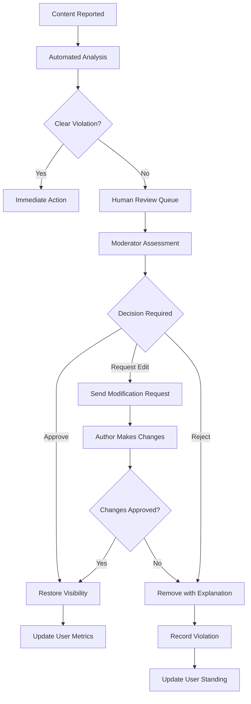

# Business Rules and Content Guidelines Documentation

## 1. Content Creation and Submission Rules

### 1.1 Post Creation Business Rules

**WHEN a member attempts to create a new discussion post, THE system SHALL enforce the following validation rules:**
- **Title Validation**: Title length SHALL be between 10 and 200 characters, containing meaningful text (not only numbers or special characters)
- **Content Validation**: Post content SHALL be between 100 and 10,000 characters, with minimum 50 words of substantive content
- **Category Assignment**: Each post SHALL be assigned to exactly one primary category (Economic or Political) with optional secondary tags
- **Duplicate Prevention**: Identical content from the same user SHALL be blocked within 24 hours with similarity threshold of 85%

**Rate Limiting Rules:**
- **New Members**: Members with less than 7 days registration SHALL be limited to 3 posts per day
- **Established Members**: Members with 30+ days activity SHALL be allowed up to 10 posts per day
- **Trusted Members**: Members with 6+ months activity and positive reputation SHALL be allowed up to 20 posts per day

### 1.2 Comment Creation Business Rules

**WHEN users engage in discussion threads, THE system SHALL apply the following comment rules:**
- **Comment Length**: Comments SHALL be between 5 and 2,000 characters with meaningful content
- **Thread Depth**: Comment nesting SHALL be limited to 3 levels maximum to maintain readability
- **Response Timing**: Users SHALL wait minimum 30 seconds between consecutive comments on the same thread
- **Quality Enforcement**: Comments consisting only of emojis or single words SHALL be rejected

**Comment Rate Limits:**
- **Per Thread Limit**: Maximum 20 comments per user per discussion thread within 24 hours
- **Daily Comment Limit**: Maximum 50 comments total per user per calendar day
- **Velocity Control**: Users attempting more than 5 comments in 10 minutes SHALL trigger temporary cooling period

## 2. User Behavior and Conduct Guidelines

### 2.1 User Registration and Authentication Rules

**WHEN new users register for the platform, THE system SHALL apply the following verification rules:**
- **Email Verification**: All new registrations SHALL require email verification within 24 hours of account creation
- **Username Validation**: Usernames SHALL be 3-30 characters, alphanumeric only, and not contain offensive terms
- **Password Requirements**: Passwords SHALL be minimum 8 characters with at least one uppercase letter, one lowercase letter, and one number
- **Account Activation**: New accounts SHALL have limited posting privileges until 3 constructive comments are approved

**Account Security Rules:**
- **Session Management**: User sessions SHALL expire after 30 minutes of inactivity with secure token refresh
- **Password Reset**: Password reset requests SHALL be limited to 3 attempts per hour from the same IP address
- **Suspicious Activity**: Accounts with 5+ failed login attempts within 15 minutes SHALL be temporarily locked

### 2.2 User Reputation and Trust System

**THE system SHALL maintain a reputation scoring system based on the following metrics:**
- **Post Quality Score**: Based on engagement metrics (comments, upvotes/downvotes, sharing)
- **Comment Quality Score**: Measured by reply engagement and moderator approvals
- **Community Standing**: Calculated from report history and moderator interventions
- **Activity Consistency**: Regular participation without spam-like behavior

**Reputation Tiers and Privileges:**
- **Tier 1 (0-100 points)**: Basic posting privileges with content moderation
- **Tier 2 (101-500 points)**: Reduced moderation, ability to create polls
- **Tier 3 (501-2000 points)**: Trusted status, content featuring priority
- **Tier 4 (2001+ points)**: Eligible for moderator consideration, advanced features

## 3. Comprehensive Moderation Policies

### 3.1 Automated Moderation Triggers

**THE system SHALL automatically flag content for moderator review based on the following triggers:**
- **Content Similarity**: Posts with 80%+ similarity to existing content within 30 days
- **User Reports**: Content receiving 3+ independent user reports within 1 hour
- **Language Analysis**: Detection of hate speech, threats, or severe profanity with 90%+ confidence
- **Spam Patterns**: Accounts posting identical content across multiple threads

**Automated Action Rules:**
- **Temporary Holding**: Flagged content SHALL be hidden from public view pending review
- **User Notification**: Content authors SHALL receive immediate notification of moderation status
- **Review Priority**: Content with 5+ reports SHALL be escalated to high-priority review queue

### 3.2 Human Moderation Workflow

**WHEN moderators review reported content, THE system SHALL provide the following decision framework:**
- **Approval Criteria**: Content that follows community guidelines, provides value, and stimulates discussion
- **Modification Requests**: Content with minor issues that can be corrected by the author
- **Rejection Criteria**: Content that violates terms of service, contains misinformation, or promotes harm

**Moderation Decision Matrix:**

### 3.3 Escalation and Appeal Process

**WHEN users disagree with moderation decisions, THE system SHALL provide the following appeal process:**
- **First Appeal**: Users may request review within 7 days of moderation action
- **Secondary Review**: Escalated to senior moderator if initial appeal is denied
- **Final Decision**: Administrative review for persistent or complex cases

**Appeal Success Criteria:**
- **Successful Appeal**: Content is restored, moderation record cleared
- **Partial Success**: Content modified and approved with restrictions
- **Appeal Denied**: Original decision upheld with detailed explanation

## 4. Category Management and Assignment Rules

### 4.1 Category Structure and Organization

**THE system SHALL maintain a hierarchical category system with the following rules:**
- **Primary Categories**: Economic Discussions and Political Discussions as top-level categories
- **Subcategory Depth**: Maximum 3 levels of subcategories for organizational clarity
- **Category Assignment**: Each post SHALL have exactly one primary category assignment
- **Cross-posting**: Posts may be tagged with up to 3 secondary category tags for discoverability

**Category-Specific Posting Rules:**
- **Economic Discussions**: Require factual basis, data citations when making quantitative claims
- **Political Discussions**: Must maintain civil discourse, avoid personal attacks or inflammatory language
- **Policy Analysis**: Should present balanced perspectives with evidence-based arguments

### 4.2 Automated Category Assignment

**WHEN users create posts, THE system SHALL apply intelligent category assignment using the following rules:**
- **Keyword Analysis**: Posts containing economic terminology (GDP, inflation, markets) SHALL be suggested for Economic category
- **Topic Detection**: Content discussing legislation, elections, governance SHALL be suggested for Political category
- **Author History**: Consider user's previous category preferences and expertise areas
- **Content Analysis**: Use NLP to determine primary subject matter and suggest appropriate categories

**Category Validation Rules:**
- **Mismatch Detection**: Flag posts where automated assignment contradicts user selection for moderator review
- **Category Expertise**: Highlight posts from users with verified expertise in specific categories
- **Trend Analysis**: Automatically adjust category suggestions based on current discussion trends

## 5. Search and Discovery Algorithm Rules

### 5.1 Search Relevance Scoring

**THE search algorithm SHALL prioritize results based on the following weighted factors:**
- **Content Relevance (40%)**: Keyword matching, semantic analysis, and topic alignment
- **Content Quality (25%)**: Author reputation, engagement metrics, and moderator approvals
- **Recency (20%)**: More recent content receives higher ranking with time decay function
- **User Preferences (15%)**: Personalized results based on user's category interests and reading history

**Search Result Filtering Rules:**
- **Quality Threshold**: Exclude content with negative engagement scores or multiple moderator interventions
- **Freshness Filter**: Prioritize content from active discussions with recent engagement
- **Expertise Boost**: Content from verified experts SHALL receive 20% ranking boost in relevant categories

### 5.2 Advanced Search Features

**THE system SHALL provide advanced search capabilities with the following business rules:**
- **Date Range Filtering**: Users SHALL be able to search within specific time periods (24 hours, 7 days, 30 days, custom range)
- **Author Search**: Search for content from specific users with reputation score filtering
- **Category-Specific Search**: Limit results to particular categories or subcategories
- **Content Type Filtering**: Separate results for posts, comments, and user profiles

**Search Performance Rules:**
- **Response Time**: Search queries SHALL return results within 2 seconds for 95% of requests
- **Result Limit**: Return maximum 100 results per query with pagination support
- **Query Caching**: Cache frequent search patterns for 15 minutes to improve performance

## 6. Comprehensive Data Validation Framework

### 6.1 Input Validation Rules

**THE system SHALL validate all user inputs against the following patterns and constraints:**
- **Email Validation**: Must match RFC 5322 standard with domain verification
- **Username Rules**: 3-30 characters, alphanumeric and underscores only, unique across platform
- **Content Sanitization**: Remove potentially malicious scripts while preserving formatting
- **File Upload Validation**: Restrict file types, scan for malware, enforce size limits

**Real-time Validation Rules:**
- **Character Counting**: Display real-time character counts for posts and comments
- **Format Previews**: Show content preview before submission
- **Duplicate Detection**: Warn users of similar existing content before posting

### 6.2 Business Logic Validation

**THE system SHALL enforce the following business logic constraints:**
- **Self-Voting Prevention**: Users cannot upvote their own content
- **Circular References**: Prevent infinite comment nesting and circular replies
- **Temporal Constraints**: Enforce time-based restrictions on editing and deletion
- **Ownership Validation**: Verify user permissions before allowing content modifications

**Validation Error Handling:**
- **Specific Error Messages**: Provide detailed explanations of validation failures
- **Correction Suggestions**: Offer specific suggestions for resolving validation issues
- **Context Preservation**: Maintain user input during validation error recovery

## 7. Content Quality and Engagement Metrics

### 7.1 Quality Scoring System

**THE system SHALL calculate content quality scores using the following formula:**
- **Base Score (50 points)**: Initial quality assessment based on content length, structure, and readability
- **Engagement Bonus (30 points)**: Points for comments, upvotes, and sharing activity
- **Author Reputation (20 points)**: Bonus based on author's historical content quality
- **Time Decay**: Score decreases by 1% per day to prioritize recent content

**Quality Thresholds:**
- **High Quality**: 80+ points - Featured in recommended content and search results
- **Medium Quality**: 50-79 points - Standard visibility in category listings
- **Low Quality**: Below 50 points - Reduced visibility, may be hidden from main feeds

### 7.2 Engagement Optimization Rules

**THE system SHALL implement the following rules to encourage quality engagement:**
- **Discussion Promotion**: Posts with high comment activity SHALL receive increased visibility
- **Expert Recognition**: Content from verified experts SHALL be highlighted in category feeds
- **New User Support**: Provide constructive feedback and guidance for new contributors
- **Toxic Behavior Detection**: Automatically limit visibility of content with negative engagement patterns

**Engagement Rate Limits:**
- **New User Protections**: Limit interaction frequency for accounts under 30 days old
- **Velocity Controls**: Prevent rapid-fire commenting without meaningful contribution
- **Quality over Quantity**: Prioritize substantive engagement over volume metrics

## 8. Permission and Access Control Matrix

### 8.1 Comprehensive Role-Based Permissions

| Action | Guest | New Member | Established Member | Moderator | Administrator |
|--------|-------|------------|-------------------|-----------|---------------|
| Browse Public Content | ✅ | ✅ | ✅ | ✅ | ✅ |
| Read Comments | ✅ | ✅ | ✅ | ✅ | ✅ |
| Basic Search | ✅ | ✅ | ✅ | ✅ | ✅ |
| Create Account | ✅ | ❌ | ❌ | ❌ | ❌ |
| Create Posts | ❌ | Limited | ✅ | ✅ | ✅ |
| Comment on Posts | ❌ | Limited | ✅ | ✅ | ✅ |
| Edit Own Content | ❌ | ✅ (1h) | ✅ (24h) | ✅ | ✅ |
| Delete Own Content | ❌ | ✅ | ✅ | ✅ | ✅ |
| Advanced Search | ❌ | ✅ | ✅ | ✅ | ✅ |
| Content Reporting | ❌ | ✅ | ✅ | ✅ | ✅ |
| Moderate Content | ❌ | ❌ | ❌ | ✅ | ✅ |
| User Management | ❌ | ❌ | ❌ | ❌ | ✅ |
| System Configuration | ❌ | ❌ | ❌ | ❌ | ✅ |

### 8.2 Permission Escalation Rules

**WHEN users demonstrate positive contribution patterns, THE system SHALL apply the following privilege escalation rules:**
- **New to Established Member**: After 30 days with 10+ approved posts and positive reputation
- **Member to Trusted Contributor**: After 90 days with 50+ constructive contributions
- **Trusted to Moderator Candidate**: After 180 days with consistent quality and community respect
- **Moderator to Administrator**: Based on demonstrated leadership and system stewardship

**Permission Revocation Rules:**
- **Temporary Suspension**: For minor violations, 1-7 day suspension based on severity
- **Extended Restrictions**: For repeated violations, 30-90 day limited privileges
- **Permanent Ban**: For severe or persistent violations after thorough review

## 9. Error Handling and Recovery Business Logic

### 9.1 User-Facing Error Management

**WHEN users encounter errors, THE system SHALL implement the following recovery procedures:**
- **Network Connectivity Issues**: Automatic retry mechanisms with exponential backoff
- **Content Submission Failures**: Draft auto-save with recovery prompts
- **Authentication Problems**: Clear guidance with password reset and support contact options
- **Permission Denials**: Explanation of restrictions with path to resolution

**Error Communication Standards:**
- **Clarity**: Error messages SHALL explain what happened and why in user-friendly language
- **Actionability**: Every error SHALL provide clear next steps for resolution
- **Consistency**: Error handling patterns SHALL be predictable across the platform
- **Support Integration**: Complex errors SHALL offer direct support escalation paths

### 9.2 System Error Recovery Rules

**THE system SHALL implement the following automated recovery procedures:**
- **Data Corruption Detection**: Regular integrity checks with automatic repair where possible
- **Performance Degradation**: Automatic scaling and resource allocation adjustments
- **Service Outages**: Graceful degradation with maintenance mode and status updates
- **Security Incidents**: Immediate containment with forensic logging and user notification

## 10. Business Rule Implementation and Monitoring

### 10.1 Rule Enforcement Framework

**THE system SHALL implement business rules through the following enforcement mechanisms:**
- **Preventive Controls**: Input validation and permission checks before actions
- **Detective Controls**: Monitoring and alerting for rule violations
- **Corrective Controls**: Automated responses and manual intervention procedures
- **Adaptive Controls**: Machine learning adjustments based on system performance

### 10.2 Rule Performance Monitoring

**THE system SHALL continuously monitor business rule effectiveness using the following metrics:**
- **Rule Compliance Rate**: Percentage of actions that comply with business rules
- **False Positive Rate**: Incorrect rule enforcement requiring manual override
- **User Satisfaction**: Impact of rules on user experience and engagement
- **System Performance**: Computational overhead of rule enforcement mechanisms

**Rule Optimization Process:**
- **Quarterly Review**: Comprehensive assessment of all business rules
- **User Feedback Integration**: Incorporate user suggestions into rule refinement
- **A/B Testing**: Test rule modifications with controlled user groups
- **Performance Benchmarking**: Compare rule effectiveness against industry standards

> *Developer Note: This document defines **business requirements only**. All technical implementations (architecture, APIs, database design, etc.) are at the discretion of the development team.*