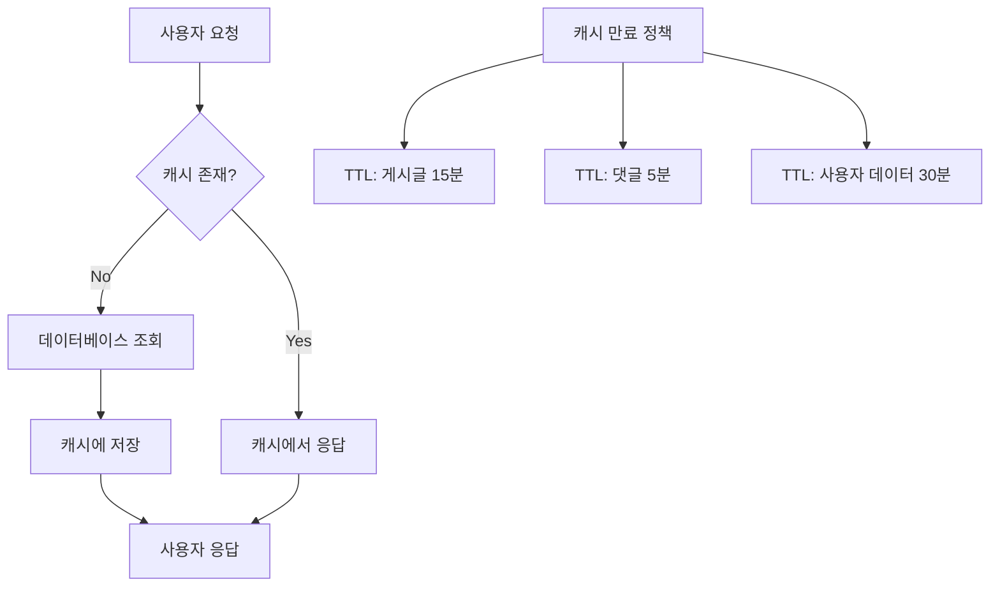
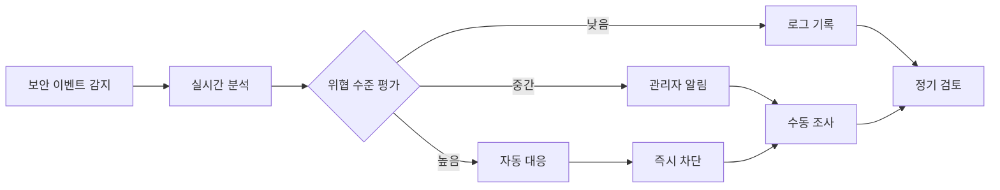
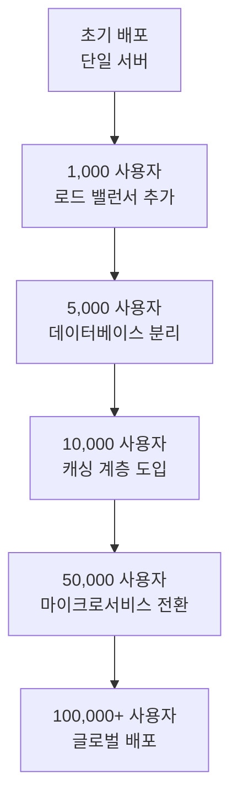
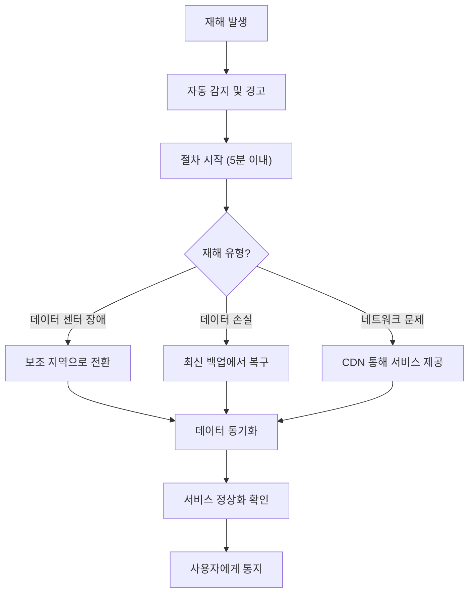

# 비기능 요구사항 상세 명세서 - 경제/정치 토론 게시판

## 1. 문서 개요

### 1.1 비기능 요구사항 범위
이 문서는 경제/정치 토론 게시판 플랫폼의 비기능적 요구사항을 상세히 정의합니다. 성능, 보안, 가용성, 확장성, 유지보수 등 기술적 특성에 초점을 맞추며, 사용자 경험과 시스템 안정성을 보장합니다.

### 1.2 비즈니스 중요성
비기능 요구사항은 플랫폼의 장기적 성공에 결정적 역할을 합니다:
- **사용자 경험**: 빠른 응답 시간과 안정적인 서비스 제공
- **신뢰성**: 정치/경제 토론의 중요한 성격 상 높은 가용성 요구
- **보안**: 사용자 데이터와 토론 내용의 기밀성 유지
- **확장성**: 사용자 증가에 따른 시스템 성능 유지

## 2. 성능 요구사항

### 2.1 응답 시간 목표
다음 응답 시간 목표는 95번째 백분위수 기준으로 측정됩니다:

**WHEN 사용자가 플랫폼과 상호작용할 때, THE 시스템 SHALL 다음 성능 목표를 달성:**
- **메인 페이지 로딩**: 2초 이내 완전 로드
- **게시글 조회**: 1초 이내 내용 및 댓글 표시
- **게시글 작성 및 제출**: 3초 이내 저장 완료
- **댓글 작성**: 1초 이내 저장 및 반영
- **검색 결과**: 1.5초 이내 결과 표시
- **사용자 인증**: 500ms 이내 로그인 처리
- **API 응답**: 1초 이내 JSON 응답 제공

### 2.2 처리량 및 동시성 요구사항
**THE 시스템 SHALL 다음 동시성 목표를 지원:**
- **동시 활성 사용자**: 1,000명 지원
- **초당 게시글 조회 요청**: 100건 처리
- **초당 댓글 작성 요청**: 50건 처리
- **초당 검색 요청**: 200건 처리
- **데이터베이스 동시 연결**: 500개 연결 지원

### 2.3 데이터베이스 성능
**WHERE 데이터베이스 작업이 수행될 때, THE 시스템 SHALL 다음 성능을 유지:**
- **게시글 조회 쿼리**: 100ms 이내 응답
- **댓글 조회 쿼리**: 50ms 이내 응답
- **사용자 인증 쿼리**: 20ms 이내 응답
- **검색 인덱싱**: 컨텐츠 변경 후 1분 이내 반영

### 2.4 캐싱 전략

## 3. 보안 사양

### 3.1 인증 및 인가 요구사항
**WHEN 사용자 인증이 요구될 때, THE 시스템 SHALL 다음 보안 기준을 충족:**

**JWT 토큰 관리:**
- **액세스 토큰 유효기간**: 30분
- **리프레시 토큰 유효기간**: 7일
- **토큰 서명 알고리즘**: HMAC SHA-256 이상
- **토큰 저장**: httpOnly 쿠키 사용
- **토큰 재발급**: 만료 5분 전 자동 재발급

**비밀번호 정책:**
- **최소 길이**: 8자 이상
- **복잡성 요구**: 대문자, 소문자, 숫자, 특수문자 조합
- **해시 알고리즘**: bcrypt (작업 인자 12)
- **비밀번호 변경 주기**: 90일 권장
- **이전 비밀번호 재사용 방지**: 최근 5개 비밀번호 기억

### 3.2 데이터 보호
**WHERE 사용자 데이터가 처리될 때, THE 시스템 SHALL 다음 암호화 기준을 적용:**
- **전송 암호화**: TLS 1.3 사용
- **저장 데이터 암호화**: AES-256 사용
- **개인정보 암호화**: 이메일, IP 주소 등 민감 정보 암호화 저장
- **백업 데이터 암호화**: 전체 백업 데이터 암호화

### 3.3 취약점 방지
**THE 시스템 SHALL 다음 공격 벡터로부터 보호:**
- **SQL 인젝션**: 준비된 문장 사용 및 입력값 검증
- **XSS 공격**: 콘텐츠 적절한 이스케이프 및 CSP 헤더 구현
- **CSRF 공격**: CSRF 토큰 구현 및 SameSite 쿠키 정책
- **Brute Force 공격**: 로그인 실패 시 지수 백오프 적용
- **DDoS 공격**: 속도 제한 및 IP 기반 차단

### 3.4 보안 모니터링

**경고 임계값:**
- **CPU 사용률**: 80% 이상 지속 시 경고
- **메모리 사용률**: 85% 이상 지속 시 경고
- **응답 시간**: 5초 이상 지속 시 경고
- **오류율**: 1% 이상 시 경고
- **가용성**: 99% 미만 시 경고

## 4. 확장성 아키텍처

### 4.1 수평 확장성
**THE 시스템 SHALL 다음 수평 확장 목표를 지원:**

**애플리케이션 서버 확장:**
- **로드 밸런싱**: Round Robin 및 Least Connections 알고리즘 지원
- **세션 관리**: 분산 세션 저장소 사용 (Redis)
- **서비스 디스커버리**: 동적 서버 등록 및 헬스 체크
- **자동 확장**: CPU 사용률 70% 이상 시 자동 확장

**데이터베이스 확장:**
- **읽기/쓰기 분리**: 마스터-슬레이브 복제 구성
- **샤딩 전략**: 사용자 ID 기반 수평 분할
- **캐싱 계층**: Redis 클러스터를 통한 성능 향상
- **연결 풀링**: 효율적인 데이터베이스 연결 관리

### 4.2 사용자 증가 대응 계획

**단계별 확장 요구사항:**
- **단계 1 (1,000 사용자)**: 단일 서버, 기본 캐싱
- **단계 2 (5,000 사용자)**: 데이터베이스 복제, CDN 도입
- **단계 3 (10,000 사용자)**: Redis 클러스터, 검색 엔진 분리
- **단계 4 (50,000 사용자)**: 마이크로서비스 아키텍처
- **단계 5 (100,000+ 사용자)**: 다중 리전 배포

## 5. 가용성 및 신뢰성

### 5.1 서비스 가용성
**THE 시스템 SHALL 다음 가용성 목표를 달성:**
- **전체 서비스 가용성**: 99.9% (연간 다운타임 8.76시간 이내)
- **핵심 기능 가용성**: 99.95% (연간 다운타임 4.38시간 이내)
- **데이터 가용성**: 99.99% (연간 데이터 손실 없음)

### 5.2 장애 복구
**WHEN 시스템 장애가 발생할 때, THE 시스템 SHALL 다음 복구 목표를 충족:**
- **RTO (Recovery Time Objective)**: 4시간 이내 전체 서비스 복구
- **RPO (Recovery Point Objective)**: 15분 이내 데이터 복구
- **평균 복구 시간**: 2시간 이내

### 5.3 백업 전략
**THE 시스템 SHALL 다음 백업 정책을 구현:**
- **전체 백업**: 매일 02:00에 실행
- **증분 백업**: 4시간 간격으로 실행
- **백업 보존**: 30일간 보관
- **백업 검증**: 주간 복구 테스트 수행

### 5.4 재해 복구 시나리오

## 6. 데이터 개인정보 보호

### 6.1 개인정보 처리 원칙
**THE 시스템 SHALL 다음 개인정보 보호 기준을 준수:**

**데이터 수집 및 처리:**
- **수집 최소화**: 서비스 운영에 필수적인 정보만 수집
- **목적 제한**: 수집 목적 외 사용 금지
- **동의 기반**: 사용자 명시적 동의 없이 처리 금지
- **데이터 정확성**: 정확한 정보 유지 및 주기적 검증

**사용자 권리 보호:**
- **접근 권리**: 30일 이내 개인정보 제공
- **수정 권리**: 요청 시 7일 이내 정보 수정
- **삭제 권리**: 계정 삭제 시 30일 이내 데이터 삭제
- **이전 권리**: 표준 형식으로 데이터 제공

### 6.2 데이터 보존 정책
**WHERE 데이터 보존이 요구될 때, THE 시스템 SHALL 다음 정책을 적용:**
- **사용자 계정 데이터**: 계정 삭제 후 90일간 보관 후 삭제
- **게시글 및 댓글**: 3년간 보관 (역사적 가치)
- **시스템 로그**: 1년간 보관
- **백업 데이터**: 30일간 보관 후 순환 삭제

### 6.3 규정 준수
**THE 시스템 SHALL 다음 규정을 준수:**
- **개인정보보호법**: 대한민국 개인정보보호법 준수
- **정보통신망법**: 정보통신망 이용촉진 및 정보보호 등에 관한 법률
- **GDPR**: 유럽연합 일반개인정보보호법 준수 (국제 사용자 대상)
- **CCPA**: 캘리포니아 소비자 개인정보 보호법 준수

## 7. 모니터링 및 유지보수

### 7.1 성능 모니터링
**THE 시스템 SHALL 다음 성능 지표를 실시간 모니터링:**

**애플리케이션 지표:**
- **응답 시간**: 페이지 로딩, API 응답 시간
- **오류율**: HTTP 오류, 예외 발생률
- **처리량**: 초당 요청 수, 동시 사용자 수
- **리소스 사용률**: CPU, 메모리, 디스크 사용량

**비즈니스 지표:**
- **사용자 참여**: DAU/MAU, 세션 시간, 페이지 뷰
- **콘텐츠 품질**: 게시글/댓글 비율, 신고 발생률
- **성장 지표**: 신규 사용자, 유지율, 이탈률

### 7.2 유지보수 계획
**THE 시스템 SHALL 다음 유지보수 일정을 준수:**

**정기 유지보수:**
- **보안 패치**: 월별 적용
- **소프트웨어 업데이트**: 분기별 적용
- **데이터베이스 최적화**: 주간 실행
- **백업 검증**: 월별 테스트

**예방적 유지보수:**
- **시스템 건강 검진**: 주간 점검
- **성능 테스트**: 월별 실행
- **보안 취약점 검사**: 분기별 수행
- **용량 계획 검토**: 반기별 검토

## 8. 통합 요구사항

### 8.1 외부 서비스 통합
**THE 시스템 SHALL 다음 외부 서비스와 통합:**

**이메일 서비스:**
- **트랜잭션 이메일**: SendGrid 또는 Amazon SES 연동
- **마케팅 이메일**: 사용자 참여 유도 이메일
- **시스템 알림**: 관리자 알림 및 경고

**모니터링 서비스:**
- **APM**: New Relic 또는 Datadog 연동
- **로그 관리**: ELK 스택 또는 Splunk 연동
- **인프라 모니터링**: Prometheus 및 Grafana 연동

### 8.2 API 성능 요구사항
**WHERE 외부 API가 사용될 때, THE 시스템 SHALL 다음 성능 기준을 충족:**
- **API 응답 시간**: 2초 이내 응답
- **API 가용성**: 99.5% 이상 가용성
- **오류 처리**: 타임아웃 및 재시도 메커니즘 구현
- **속도 제한**: API 호출 제한 및 백오프 구현

## 9. 구현 지침

### 9.1 기술 선택 기준
**THE 시스템 아키텍처 SHALL 다음 기준에 따라 기술 선택:**
- **오픈소스 우선**: 검증된 오픈소스 솔루션 사용
- **클라우드 네이티브**: 클라우드 환경 최적화
- **마이크로서비스 준비**: 모놀리식 시작, 마이크로서비스 전환 가능
- **자동화 강화**: CI/CD 및 인프라 자동화 구현

### 9.2 테스트 및 검증
**THE 시스템 SHALL 다음 테스트 계획을 수립:**

**성능 테스트:**
- **부하 테스트**: 최대 부하 상황에서 성능 확인
- **지속성 테스트**: 장시간 운영 안정성 확인
- **스트레스 테스트**: 한계점 발견 및 대비
- **스파이크 테스트**: 갑작스러운 트래픽 증가 대응

**보안 테스트:**
- **침투 테스트**: 외부 전문가를 통한 보안 검증
- **취약점 스캔**: 정기적 자동 취약점 검사
- **코드 보안 검토**: 정적 코드 분석 도구 활용

### 9.3 배포 및 롤아웃
**THE 시스템 SHALL 다음 배포 전략을 구현:**
- **블루-그린 배포**: 무중단 배포 지원
- **카나리 릴리스**: 점진적 기능 롤아웃
- **기능 플래그**: 기능 별도 관리 및 제어
- **롤백 계획**: 문제 발생 시 빠른 복구

## 10. 성공 지표

### 10.1 핵심 성과 지표
**THE 시스템의 성공은 다음 지표로 측정:**
- **성능 지표**: 평균 응답 시간 < 2초, 가용성 > 99.9%
- **보안 지표**: 보안 취약점 0건, 데이터 유출 사고 0건
- **확장성 지표**: 사용자 10,000명 지원, 트래픽 10배 증가 대응
- **사용자 만족도**: 사용자 설문조사 점수 4.0/5.0 이상

### 10.2 지속적 개선
**THE 시스템 SHALL 지속적 개선을 위해 다음 활동 수행:**
- **정기적 성능 검토**: 월별 성능 데이터 분석
- **사용자 피드백 수집**: 지속적 사용자 경험 개선
- **기술 부채 관리**: 기술적 부채 식별 및 해결
- **비용 최적화**: 인프라 비용 효율적 관리

> *개발자 참고: 이 문서는 **비즈니스 요구사항만** 정의합니다. 모든 기술적 구현(아키텍처, API, 데이터베이스 설계 등)은 개발팀의 재량에 맡깁니다.*