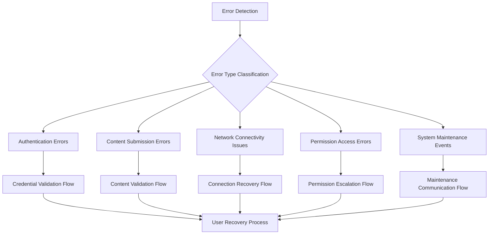
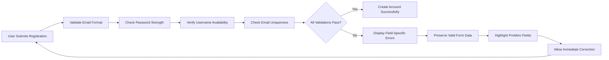
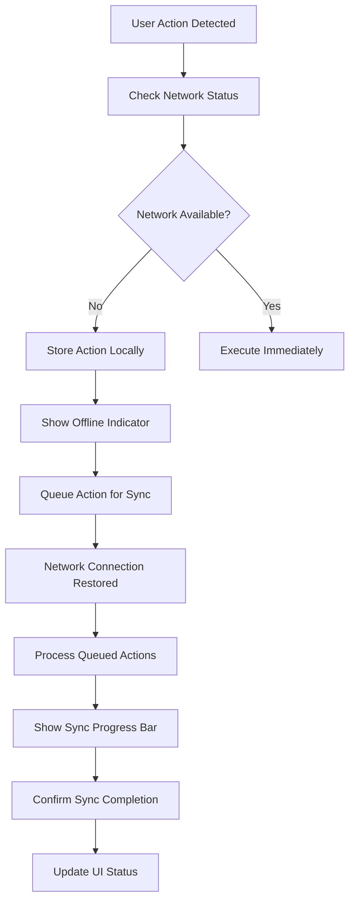
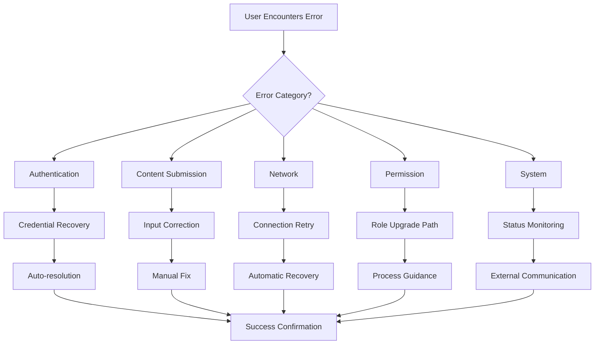

# 07-error-handling.md - Comprehensive Error Handling Requirements

## 1. Error Handling Framework Overview

This document defines the comprehensive error handling strategy for the economic/political discussion board. The platform must provide clear, helpful error messages and recovery paths that maintain user confidence even when technical issues occur.

### 1.1 Error Handling Philosophy
- **Transparency**: Users should understand what went wrong and why
- **Guidance**: Every error should provide clear next steps for resolution
- **Consistency**: Error handling patterns should be predictable across the platform
- **Graceful Degradation**: The system should remain partially functional during errors

### 1.2 Error Classification System

## 2. Authentication Error Scenarios

### 2.1 Login Failures

**WHEN a user attempts to login with invalid credentials, THE system SHALL display appropriate error messages without revealing whether the username or password is incorrect.**

**Error Scenarios and Recovery Requirements:**
- **Invalid username/email format**: 
  - WHEN email format is invalid, THE system SHALL display: "Please check your email format and try again."
  - THE system SHALL provide email format examples: "name@example.com"

- **Incorrect password**:
  - WHEN password is incorrect, THE system SHALL display: "The credentials you entered are incorrect. Please try again."
  - THE system SHALL provide "Forgot Password" link with immediate access

- **Account not found**:
  - WHEN account doesn't exist, THE system SHALL display: "No account found with this email. Would you like to create one?"
  - THE system SHALL offer registration option with pre-filled email

- **Account temporarily locked**:
  - AFTER 5 failed login attempts, THE system SHALL implement 15-minute account lockout
  - DURING lockout, THE system SHALL display: "Account temporarily locked. Please try again in 15 minutes."
  - THE system SHALL provide countdown timer showing remaining lockout time

### 2.2 Token Expiration and Session Management

**WHILE a user session is active, THE system SHALL monitor token validity and provide graceful session expiration handling.**

**Session Management Requirements:**
- **JWT token expiration**:
  - WHEN token expires after 30 minutes, THE system SHALL attempt automatic refresh using refresh token
  - IF refresh succeeds, THE system SHALL continue user session transparently
  - IF refresh fails, THE system SHALL redirect to login page with message: "Your session has expired. Please log in again."

- **Invalid or tampered token**:
  - WHEN token validation fails, THE system SHALL immediately invalidate session
  - THE system SHALL redirect to login with security message: "Security verification failed. Please log in again."

- **Concurrent session conflicts**:
  - WHEN multiple sessions detected, THE system SHALL allow user to choose active session
  - THE system SHALL provide option to log out other sessions

### 2.3 Registration and Account Validation Errors

**IF user registration data fails validation, THEN THE system SHALL provide specific feedback for each field.**

**Registration Validation Flow:**

**Specific Validation Requirements:**
- **Email format validation**:
  - WHEN email format invalid, THE system SHALL highlight email field with message: "Please enter a valid email address (example: name@domain.com)"

- **Password strength requirements**:
  - THE password SHALL require minimum 8 characters with mixed case and numbers
  - WHEN password weak, THE system SHALL show strength meter and specific requirements

- **Username availability**:
  - WHEN username taken, THE system SHALL suggest alternatives: "Username 'politicalfan' is taken. Try: politicalfan123, thepoliticalfan, politicalfan2024"

## 3. Content Submission Errors

### 3.1 Post Creation and Editing Failures

**WHEN a user submits a post with invalid content, THE system SHALL validate against business rules and provide specific error messages.**

**Content Validation Matrix:**
| Validation Rule | Error Message | Recovery Action | Character Limit |
|-----------------|---------------|-----------------|----------------|
| Title required | "Post title is required (1-200 characters)" | Focus title field, show counter | 1-200 chars |
| Content required | "Post content cannot be empty (minimum 50 characters)" | Focus content editor | 50-10,000 chars |
| Category selection | "Please select a category for your post" | Show category picker | N/A |
| Duplicate content | "Similar post already exists. Check existing discussions?" | Show similar posts, allow override | N/A |
| Character limits | "Content exceeds 10,000 character limit" | Show count, highlight excess | Enforce limits |

### 3.2 Comment System Errors

**WHILE a user is composing a comment, THE system SHALL provide real-time validation and clear error messaging.**

**Comment Error Handling:**
- **Character limit enforcement**:
  - WHEN comment exceeds 500 characters, THE system SHALL show real-time counter
  - THE counter SHALL change color when approaching limit: green → yellow → red

- **Reply restrictions**:
  - WHEN replying to deleted comment, THE system SHALL display: "The comment you're replying to has been removed."
  - THE system SHALL offer option to post as new top-level comment

- **Rate limiting**:
  - WHEN user exceeds 10 comments per hour, THE system SHALL display: "Commenting temporarily limited. Please wait 5 minutes."
  - THE system SHALL show countdown timer for rate limit expiration

### 3.3 File Upload and Media Attachment Errors

**IF file uploads fail validation, THEN THE system SHALL specify the reason for rejection.**

**Upload Validation Requirements:**
- **File type restrictions**:
  - WHEN unsupported file type, THE system SHALL display: "Supported formats: JPG, PNG, GIF (images), PDF (documents)"
  - THE system SHALL provide format conversion suggestions

- **File size limits**:
  - WHEN file exceeds 5MB (images) or 10MB (documents), THE system SHALL show: "File too large. Maximum size: 5MB for images, 10MB for documents."
  - THE system SHALL offer compression options for images

- **Malware scanning**:
  - WHEN file flagged as suspicious, THE system SHALL display: "File security check failed. Please upload a different file."
  - THE system SHALL provide alternative submission methods

## 4. Network and Connectivity Issues

### 4.1 API Communication Failures

**WHEN network connectivity is lost during user operations, THE system SHALL implement graceful offline handling.**

**Offline Capability Requirements:**

**Network Recovery Specifications:**
- **Connection monitoring**:
  - THE system SHALL check network status every 30 seconds
  - WHEN connection lost, THE system SHALL display persistent offline indicator

- **Action queuing**:
  - THE system SHALL queue posts, comments, and votes during offline periods
  - QUEUED actions SHALL include timestamp and attempt count

- **Synchronization process**:
  - WHEN connection restored, THE system SHALL sync queued actions in order
  - THE system SHALL handle conflicts with "last write wins" or user resolution

### 4.2 Timeout and Slow Response Handling

**WHILE waiting for server responses, THE system SHALL provide appropriate loading indicators and timeout management.**

**Performance Handling Requirements:**
- **API timeout configuration**:
  - STANDARD API calls SHALL timeout after 30 seconds
  - UPLOAD operations SHALL timeout after 120 seconds
  - SEARCH queries SHALL timeout after 10 seconds

- **Progressive loading indicators**:
  - INITIAL load SHALL show skeleton screens for content areas
  - AFTER 3 seconds, SHALL show "Taking longer than expected" message
  - AFTER 10 seconds, SHALL offer cancellation option

- **Automatic retry mechanism**:
  - FOR transient failures, THE system SHALL retry up to 3 times
  - RETRY intervals SHALL follow exponential backoff: 1s, 3s, 9s
  - AFTER final failure, SHALL show "Service unavailable" with retry button

## 5. Data Validation Errors

### 5.1 Input Validation Failures

**WHERE user input fails client-side validation, THE system SHALL provide immediate, specific feedback.**

**Real-time Validation Requirements:**
- **Search query validation**:
  - WHEN search syntax invalid, THE system SHALL highlight problematic terms
  - THE system SHALL provide search tips and examples

- **Date range validation**:
  - WHEN invalid date range, THE system SHALL show calendar with valid ranges
  - THE system SHALL explain constraints: "Date range cannot exceed 6 months"

- **Special character handling**:
  - WHEN restricted characters used, THE system SHALL show allowed character list
  - THE system SHALL auto-replace or encode problematic characters

### 5.2 Business Rule Violations

**IF user actions violate business rules, THEN THE system SHALL explain the restriction and suggest alternatives.**

**Business Rule Enforcement:**
- **Post editing window**:
  - WHEN editing after 24 hours, THE system SHALL display: "Editing period expired. Contact moderators for significant changes."
  - THE system SHALL offer option to post correction as new comment

- **Discussion archiving**:
  - WHEN replying to archived discussion, THE system SHALL show: "This discussion is archived. Start a new topic instead."
  - THE system SHALL provide link to similar active discussions

- **Account limitations**:
  - WHEN new user exceeds daily limits, THE system SHALL explain: "New users can post 3 times per day. This limit increases with participation."
  - THE system SHALL show progress toward limit removal

## 6. Permission and Access Control Errors

### 6.1 Role-Based Access Restrictions

**WHEN users attempt actions beyond their permission level, THE system SHALL provide clear, role-appropriate messaging.**

**Permission Error Matrix:**
| User Role | Restricted Action | Error Message | Recovery Options |
|-----------|------------------|---------------|------------------|
| Guest | Post creation | "Please sign in to create posts. [Sign Up] [Login]" | Registration flow |
| Guest | Commenting | "Join the discussion! Sign in to comment. [Sign Up] [Login]" | Authentication flow |
| Member | Moderation | "Moderation tools are available to trusted community members." | Role upgrade path |
| Moderator | System config | "System settings can only be changed by administrators." | Admin escalation |

### 6.2 Content Moderation Access Errors

**WHERE content requires moderation approval, THE system SHALL indicate status and expected wait times.**

**Moderation Status Communication:**
- "Your post is awaiting moderator approval. This usually takes 1-2 hours."
- "This comment has been removed for violating community guidelines."
- "Post under review: Currently being evaluated by our moderation team."
- "Approval delayed: Higher than usual moderation queue."

## 7. System Maintenance and Downtime

### 7.1 Scheduled Maintenance Notifications

**WHILE system maintenance is scheduled, THE system SHALL provide advanced notice and clear status updates.**

**Maintenance Communication Strategy:**
1. **7 days before**: Banner notification with date/time and expected duration
2. **24 hours before**: Persistent notification with impact details
3. **During maintenance**: Graceful maintenance page with progress indicator
4. **After maintenance**: Update confirming restoration and any changes

**Maintenance Page Content:**
- Clear explanation of maintenance purpose
- Estimated completion time with live updates
- Contact information for urgent issues
- Option to receive notification when service resumes

### 7.2 Unexpected System Outages

**IF unexpected system outages occur, THEN THE system SHALL provide honest communication and recovery expectations.**

**Outage Response Protocol:**
- Immediate detection and status page activation
- Regular updates (every 15 minutes) even if no progress
- Transparent communication about issue nature
- Realistic recovery time estimates
- Alternative communication channels (status page, social media)

## 8. User Recovery and Resolution Flows

### 8.1 Error Resolution Taxonomy

**Self-Service Resolution Paths:**

### 8.2 Progressive Assistance Strategy

**THE system SHALL provide escalating levels of assistance based on error persistence and user needs.**

**Assistance Levels:**
1. **Level 1**: Inline error messages with immediate correction options
2. **Level 2**: Contextual help tooltips and examples
3. **Level 3**: Guided workflows with step-by-step instructions
4. **Level 4**: Direct support contact with error context pre-populated

## 9. Error Message Standards

### 9.1 Message Format Guidelines

**ALL error messages SHALL follow consistent formatting and tone standards.**

**Message Structure:**
- **Problem**: Clear statement of what went wrong
- **Reason**: Brief explanation of why it happened
- **Solution**: Specific actions the user can take
- **Prevention**: Guidance to avoid recurrence

**Examples of Proper Error Messages:**

**Poor**: "Error: Invalid input"
**Good**: "We couldn't save your post. The title exceeds 200 characters. Please shorten it to continue."

**Poor**: "Access denied"
**Good**: "This action requires moderator privileges. Learn more about becoming a community moderator."

### 9.2 Localization and Accessibility

**WHERE error messages are displayed, THE system SHALL ensure accessibility and localization compliance.**

**Accessibility Requirements:**
- Screen reader compatibility with ARIA live regions
- High contrast color schemes for error indicators
- Keyboard navigation to error fields
- Support for multiple languages and cultural contexts

**Localization Considerations:**
- Error messages adaptable to different languages
- Culturally appropriate examples and references
- Localized contact information for support
- Region-specific compliance requirements

### 9.3 Error Tracking and Improvement

**THE system SHALL implement error tracking to identify patterns and improve user experience.**

**Error Analytics:**
- Track error frequency by type and user segment
- Monitor resolution success rates
- Identify common user confusion points
- Measure impact on user satisfaction and retention

**Continuous Improvement Process:**
1. Regular review of error analytics
2. User feedback collection on error messaging
3. A/B testing of alternative error message phrasings
4. Progressive simplification of recovery flows

> *Developer Note: This document defines **business requirements only**. All technical implementations (architecture, APIs, database design, etc.) are at the discretion of the development team.*