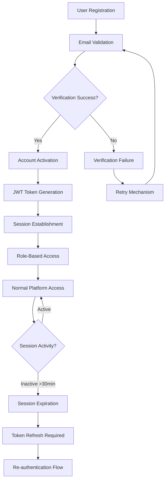
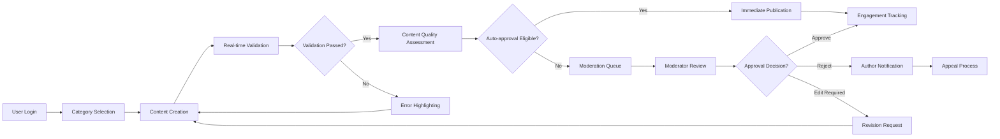
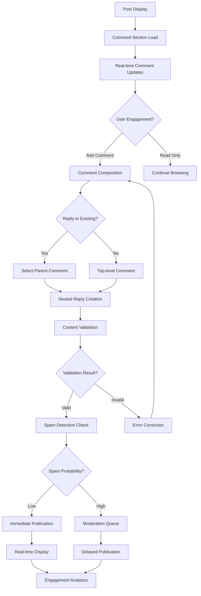
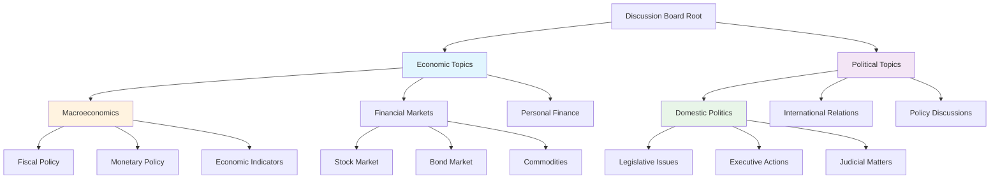
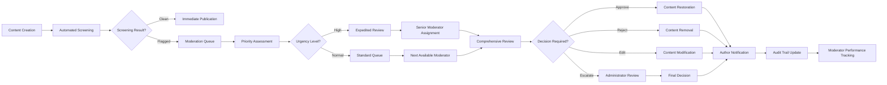

# Data Entities and Relationships Analysis Report

## Executive Summary

This document provides a comprehensive analysis of all data entities and their relationships for the Economic/Political Discussion Board platform. The system manages four core business entities: Users, Posts, Comments, and Categories, with supporting entities for moderation and analytics. All entities are designed to support robust discussion capabilities while maintaining data integrity and business rule enforcement.

## Core Business Entities Overview

### Primary Entities
1. **User Entity**: Manages user authentication, profiles, and permissions
2. **Post Entity**: Handles discussion topics and content management
3. **Comment Entity**: Supports threaded discussions and replies
4. **Category Entity**: Organizes content by economic/political topics

### Supporting Entities
5. **Moderation Entity**: Tracks content reviews and user reports
6. **Analytics Entity**: Monitors platform usage and engagement metrics

## Enhanced User Entity Analysis

### User Attributes and Business Requirements

**THE system SHALL maintain user profiles with the following attributes:**
- User ID (unique identifier, format: UUIDv4)
- Username (display name, 3-30 characters, alphanumeric only)
- Email address (valid format, used for authentication and notifications)
- Registration date and time (ISO 8601 format)
- Last login timestamp (tracked for security monitoring)
- User role (guest, member, moderator, admin with hierarchical permissions)
- Profile status (active, suspended, banned with status duration)
- Email verification status (pending, verified, expired)
- Profile completion percentage (tracked for user onboarding)

**User Lifecycle Management Business Scenarios:**

**Scenario 1: New User Registration**
- WHEN a user registers, THE system SHALL validate email format and send verification within 2 seconds
- WHERE email verification succeeds, THE system SHALL grant full member privileges immediately
- IF email verification fails, THEN THE system SHALL allow resend attempts every 5 minutes

**Scenario 2: User Role Promotion**
- WHEN a member demonstrates consistent quality contributions, THE system SHALL consider role promotion
- WHERE moderation needs increase, THE system SHALL automatically flag active members for moderator training
- IF promotion criteria are met, THEN THE system SHALL notify administrators for final approval

**Scenario 3: Account Suspension Process**
- WHEN a user violates community guidelines, THE system SHALL apply progressive suspension periods
- WHERE repeated violations occur, THE system SHALL escalate from warning to temporary suspension
- IF severe violations are detected, THEN THE system SHALL implement immediate account suspension pending review

### User Authentication Workflow

## Comprehensive Post Entity Lifecycle

### Post Attributes and Detailed Business Requirements

**THE system SHALL maintain discussion posts with the following enhanced attributes:**
- Post ID (UUIDv4, globally unique)
- Title (5-200 characters, subject to profanity filtering)
- Content (50-10,000 characters with rich text support)
- Author ID (references User entity with integrity constraints)
- Category ID (mandatory selection from available categories)
- Creation timestamp (ISO 8601 with timezone)
- Last modification timestamp (track all edits)
- Post status (draft, pending, published, locked, archived, deleted)
- View count (incremented on each authenticated view)
- Comment count (real-time synchronization)
- Engagement metrics (likes, shares, reading time)
- Content quality score (calculated based on user engagement)

**Post Creation and Management Enhanced Flow:**

**Enhanced Post Business Rules:**

**Rule 1: Content Quality Scoring**
- WHEN a post is published, THE system SHALL calculate initial quality score based on content length, structure, and keyword relevance
- WHILE a post receives engagement, THE system SHALL update quality score using machine learning algorithms
- IF quality score drops below threshold, THEN THE system SHALL flag for moderator review

**Rule 2: Automatic Categorization**
- WHEN a post is created, THE system SHALL analyze content and suggest appropriate categories with 85% accuracy
- WHERE category assignment is ambiguous, THE system SHALL prompt author for clarification
- IF category misassignment is reported, THEN THE system SHALL allow manual correction by moderators

**Rule 3: Content Archival Policy**
- WHEN a post receives no engagement for 90 days, THE system SHALL consider archival
- WHERE archived posts receive new activity, THE system SHALL automatically restore to active status
- IF storage limits are approached, THEN THE system SHALL prioritize archival of low-engagement content

## Advanced Comment Relationship Management

### Comment Attributes and Enhanced Business Requirements

**THE system SHALL maintain discussion comments with the following comprehensive attributes:**
- Comment ID (UUIDv4, unique identifier)
- Post ID (foreign key with cascade delete protection)
- Author ID (user reference with integrity validation)
- Parent Comment ID (enables nested replies up to 3 levels)
- Content (5-2,000 characters with markdown support)
- Creation timestamp (millisecond precision)
- Modification timestamp (track all edits with version history)
- Comment status (published, edited, flagged, removed, archived)
- Reply count (real-time updated for performance)
- Sentiment score (calculated based on content analysis)
- Spam probability (AI-powered detection)

**Enhanced Comment Thread Management:**

**Advanced Comment Business Rules:**

**Rule 1: Thread Depth Management**
- WHEN comment nesting exceeds 3 levels, THE system SHALL implement pagination with "Load More" functionality
- WHERE deep discussions occur, THE system SHALL provide discussion summarization tools
- IF thread becomes unwieldy, THEN moderators SHALL have authority to restructure or split threads

**Rule 2: Real-time Engagement**
- WHILE users view comments, THE system SHALL update engagement metrics in real-time
- WHEN new comments are added, THE system SHALL notify interested users within 5 seconds
- IF comment frequency exceeds threshold, THEN THE system SHALL implement rate limiting

**Rule 3: Content Moderation Integration**
- WHEN comments receive multiple reports, THE system SHALL automatically increase moderation priority
- WHERE AI detection identifies problematic content, THE system SHALL flag for human review
- IF comment patterns indicate bot activity, THEN THE system SHALL implement additional verification

## Enhanced Category Hierarchy System

### Category Attributes and Business Requirements

**THE system SHALL maintain content categories with comprehensive attributes:**
- Category ID (UUIDv4, unique identifier)
- Category Name (2-50 characters, unique within hierarchy)
- Parent Category ID (enables multi-level organization)
- Description (100-500 characters explaining category purpose)
- Display Order (numeric value for UI organization)
- Moderator Assignments (array of user IDs with specialization)
- Post Count (real-time updated for performance)
- Activity Metrics (engagement rates, growth trends)
- Archive Status (active, hidden, archived)

**Enhanced Category Organization Structure:**

**Enhanced Category Business Rules:**

**Rule 1: Dynamic Category Management**
- WHEN user interests evolve, THE system SHALL analyze discussion trends and suggest new categories
- WHERE category activity declines, THE system SHALL automatically recommend merging or archiving
- IF new economic/political topics emerge, THEN administrators SHALL have tools for rapid category creation

**Rule 2: Category Assignment Intelligence**
- WHEN posts are created, THE system SHALL use natural language processing for category suggestion
- WHERE multiple categories apply, THE system SHALL allow primary/secondary categorization
- IF misclassified content is reported, THEN THE system SHALL learn from corrections to improve accuracy

**Rule 3: Moderator Specialization**
- WHERE categories require specific expertise, THE system SHALL assign specialized moderators
- WHEN moderator performance metrics are tracked, THE system SHALL optimize category assignments
- IF category-specific issues arise, THEN THE system SHALL provide specialized moderation tools

## Comprehensive Moderation Data Tracking

### Moderation Entity Enhanced Attributes

**THE system SHALL maintain moderation records with comprehensive attributes:**
- Moderation ID (UUIDv4, unique identifier)
- Moderator ID (user reference with performance tracking)
- Content ID (post or comment reference)
- Content Type (specific entity type for workflow routing)
- Moderation Action (approve, reject, edit, lock, warn, suspend)
- Reason Code (standardized violation categories)
- Detailed Explanation (free text for transparency)
- Timestamp (millisecond precision for audit trail)
- Pre-moderation Content Snapshot (JSON format for integrity)
- Post-moderation State (resulting content state)
- User Notification Status (sent, pending, failed)
- Appeal Status (none, pending, resolved)
- Moderator Confidence Score (0-100% for decision quality)

**Enhanced Moderation Workflow:**

**Enhanced Moderation Business Rules:**

**Rule 1: Automated Content Screening**
- WHEN new content is submitted, THE system SHALL perform automated screening within 3 seconds
- WHERE AI detection identifies potential issues, THE system SHALL assign confidence scores
- IF confidence exceeds 95%, THEN THE system SHALL allow automated action with human oversight

**Rule 2: Moderator Workload Balancing**
- WHILE moderation queue grows, THE system SHALL distribute workload based on moderator expertise
- WHEN moderator performance metrics indicate fatigue, THE system SHALL automatically reduce assignment
- IF backlog exceeds threshold, THEN THE system SHALL trigger alert for additional moderator resources

**Rule 3: Transparency and Appeal Process**
- WHEN moderation actions are taken, THE system SHALL provide detailed explanations to authors
- WHERE authors disagree with decisions, THE system SHALL provide structured appeal process
- IF appeal demonstrates merit, THEN THE system SHALL involve senior moderators for review

## Advanced Analytics and Reporting Entities

### Analytics Entity Enhanced Attributes

**THE system SHALL maintain analytics data with comprehensive attributes:**
- Analytics ID (UUIDv4, unique identifier)
- Metric Type (categorical: user_behavior, content_performance, system_health)
- Timestamp (ISO 8601 with timezone for trend analysis)
- Value (numeric metric with precision appropriate for measurement)
- Dimension 1 (primary categorization: category, user_role, time_period)
- Dimension 2 (secondary categorization: geographic, device_type, content_type)
- Dimension 3 (tertiary categorization: user_segment, engagement_level)
- Source System (component generating the metric)
- Data Quality Score (0-100% indicating reliability)
- Retention Policy (governs data lifecycle management)

**Key Performance Indicators (KPIs) with Business Context:**

**User Engagement KPIs:**
- Daily Active Users (DAU): Target >70% of monthly active users
- Monthly Active Users (MAU): Growth target 15% quarter-over-quarter
- Session Duration: Average >8 minutes indicating quality content
- Return Visits: >60% of users returning within 7 days

**Content Performance KPIs:**
- Posts Created per Day: Target ratio of 1 post per 50 active users
- Comments per Post: Average >5 comments indicating discussion quality
- Content Quality Score: Maintain >75% average across all posts
- Moderation Efficiency: <2 hours average response time for flagged content

**System Health KPIs:**
- API Response Time: <500ms for 95% of requests
- System Uptime: >99.5% excluding planned maintenance
- Error Rate: <0.1% of total requests resulting in errors
- Database Performance: <100ms query response for 95% of operations

**Enhanced Analytics Business Rules:**

**Rule 1: Real-time Metric Collection**
- WHEN user interactions occur, THE system SHALL capture metrics within 100ms
- WHERE system performance is critical, THE system SHALL implement real-time alerting
- IF data collection impacts performance, THEN THE system SHALL implement asynchronous processing

**Rule 2: Privacy-Preserving Analytics**
- WHILE collecting user behavior data, THE system SHALL anonymize personal identifiers
- WHEN generating reports, THE system SHALL aggregate data to prevent individual identification
- IF regulatory requirements dictate, THEN THE system SHALL implement data minimization principles

**Rule 3: Predictive Analytics Integration**
- WHEN sufficient historical data exists, THE system SHALL implement predictive models
- WHERE content trends are analyzed, THE system SHALL provide early warning for emerging topics
- IF predictive accuracy exceeds 80%, THEN THE system SHALL automate certain content recommendations

## Comprehensive Entity Relationships and Business Rules

### Advanced Relationship Mapping

**User-Post Relationship Enhanced Rules:**
- WHEN a user is deleted, THE system SHALL implement graduated content handling strategy
- WHERE business requirements dictate, THE system SHALL allow content preservation with anonymization
- IF legal requirements apply, THEN THE system SHALL implement comprehensive data export capabilities

**Post-Comment Relationship Enhanced Rules:**
- WHEN a post is archived, THE system SHALL maintain comment accessibility for historical context
- WHERE comment volume exceeds practical limits, THE system SHALL implement intelligent pagination
- IF discussion quality declines, THEN THE system SHALL provide moderator tools for thread management

**Category-Post Relationship Enhanced Rules:**
- WHEN category structure evolves, THE system SHALL provide migration tools for existing content
- WHERE cross-category discussions occur, THE system SHALL support multiple category assignments
- IF category specialization increases, THEN THE system SHALL implement expert moderator assignments

### Data Integrity and Validation Framework

**Business Validation Rules:**

**Rule 1: Referential Integrity Enforcement**
- WHEN foreign key relationships are defined, THE system SHALL implement cascade rules appropriate to business context
- WHERE data consistency is critical, THE system SHALL implement transactional integrity checks
- IF integrity violations occur, THEN THE system SHALL trigger automated recovery procedures

**Rule 2: Business Logic Validation**
- WHEN entity state changes occur, THE system SHALL validate against all applicable business rules
- WHERE complex business rules apply, THE system SHALL implement rule engine for consistent enforcement
- IF validation failures occur, THEN THE system SHALL provide detailed error explanations for resolution

**Rule 3: Performance Optimization**
- WHILE maintaining data integrity, THE system SHALL optimize for read-heavy discussion patterns
- WHERE write operations occur, THE system SHALL implement efficient indexing strategies
- IF performance degrades, THEN THE system SHALL provide monitoring and alerting for proactive resolution

## Data Lifecycle Management Framework

### Comprehensive Lifecycle Policies

**Creation Phase Enhanced Rules:**
- WHEN new entities are created, THE system SHALL implement data quality validation at point of entry
- WHERE user-generated content is involved, THE system SHALL implement progressive quality scoring
- IF creation patterns indicate automation, THEN THE system SHALL implement additional verification

**Active Phase Enhanced Rules:**
- WHILE entities are active, THE system SHALL continuously monitor engagement and quality metrics
- WHERE performance optimization is possible, THE system SHALL implement caching strategies
- IF abnormal activity patterns are detected, THEN THE system SHALL trigger investigation procedures

**Archival Phase Enhanced Rules:**
- WHEN entities meet archival criteria, THE system SHALL implement tiered storage strategies
- WHERE historical data has research value, THE system SHALL maintain searchable archives
- IF storage costs become prohibitive, THEN THE system SHALL implement data compression techniques

**Retention Policies with Business Justification:**
- User data: Active + 90 days (supports account recovery and legal requirements)
- Content data: 3 years minimum (maintains discussion history and community knowledge)
- Moderation records: 7 years (supports audit requirements and pattern analysis)
- Analytics data: Aggregated 5 years, detailed 1 year (balances insights with storage costs)

## Integration with External Systems

### Business Context for External Integrations

**Authentication Service Integration:**
- WHEN external authentication is used, THE system SHALL maintain local user profiles for business continuity
- WHERE social logins are implemented, THE system SHALL capture minimal required information
- IF authentication services fail, THEN THE system SHALL provide graceful degradation to local authentication

**Content Moderation Service Integration:**
- WHILE using external moderation services, THE system SHALL maintain final decision authority
- WHERE AI moderation is employed, THE system SHALL implement human oversight for controversial decisions
- IF external services exhibit bias, THEN THE system SHALL have override mechanisms for fairness

**Analytics and Monitoring Integration:**
- WHEN external analytics are used, THE system SHALL ensure data privacy compliance
- WHERE performance monitoring is critical, THE system SHALL implement redundant monitoring systems
- IF external services impact performance, THEN THE system SHALL have fallback to internal analytics

> *Developer Note: This document defines **business entities and relationships only**. All technical implementations (database design, ORM mapping, API design, etc.) are at the discretion of the development team.*