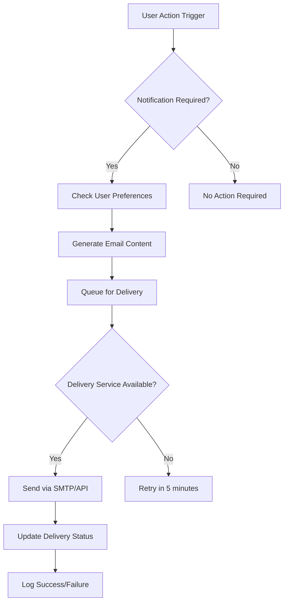
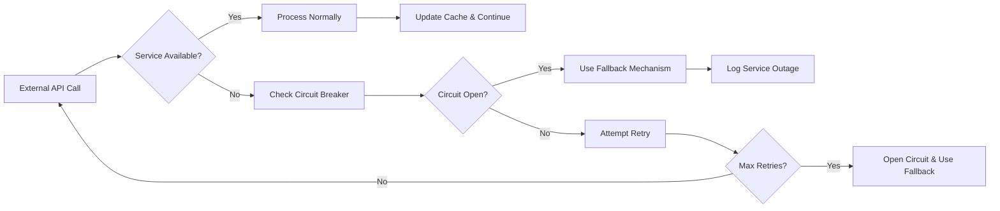

# Integration Requirements Report for Economic/Political Discussion Board

## Executive Summary

This document defines the external integration requirements for the economic/political discussion board platform. The system integrates with various third-party services to provide authentication, content moderation, notifications, and analytics capabilities while maintaining security, performance, and user privacy.

## Authentication System Integration

### External Identity Providers

**WHEN a user chooses social login, THE system SHALL support OAuth 2.0 authentication with Google, Facebook, and Microsoft Azure AD.**

**OAuth 2.0 Integration Requirements:**
- THE authentication flow SHALL complete within 5 seconds for successful logins
- IF OAuth provider is unavailable, THEN THE system SHALL provide fallback to email/password authentication
- WHEN tokens are exchanged, THE system SHALL validate JWT signatures and expiration times
- WHERE refresh tokens are used, THE system SHALL automatically renew access tokens before expiration

**Session Management Requirements:**
- THE JWT tokens SHALL expire after 30 minutes of inactivity
- WHEN session synchronization is required across devices, THE system SHALL update session states within 10 seconds
- IF concurrent session conflicts occur, THEN THE system SHALL prompt users to manage active sessions

## Content Validation Services

### Automated Moderation Integration

**WHEN a new post is submitted, THE system SHALL validate content through external spam detection APIs before publication.**

**Content Validation Requirements:**
- THE spam detection API call SHALL complete within 2 seconds
- IF external validation service returns a spam probability above 80%, THEN THE system SHALL flag the content for human review
- WHEN using Akismet or similar services, THE system SHALL respect API rate limits of 1,000 requests per hour
- WHERE political content requires fact-checking, THE system SHALL integrate with external fact-checking APIs

**Profanity Filter Integration:**
- THE system SHALL scan all user-generated content using profanity filtering services
- IF inappropriate language is detected, THEN THE system SHALL automatically replace with asterisks or require content revision
- THE filtering system SHALL maintain custom word lists for economic/political terminology to avoid false positives

## Notification Systems

### Email Service Integration

**Email Delivery Requirements:**
- WHEN a user receives a reply to their post, THE system SHALL send email notification within 1 minute
- WHERE transactional emails fail delivery, THE system SHALL implement retry mechanism with exponential backoff (5 min, 15 min, 30 min)
- THE email system SHALL maintain delivery success rate of 95% or higher
- IF email service is unavailable for more than 1 hour, THEN THE system SHALL alert administrators

### Real-time Notification Integration

**WebSocket Connection Requirements:**
- THE system SHALL establish WebSocket connections for real-time comment notifications
- WHEN new comments are posted, THE system SHALL push notifications to subscribed users within 500ms
- WHERE browser push notifications are enabled, THE system SHALL request user permission before activation
- THE notification system SHALL respect user preference settings for notification frequency and type

## Analytics and Monitoring

### User Behavior Analytics

**WHEN user interactions occur, THE system SHALL track engagement metrics through integrated analytics services.**

**Analytics Integration Requirements:**
- THE system SHALL log key metrics: post views, comment counts, user session duration, and bounce rates
- WHERE Google Analytics is used, THE system SHALL implement proper event tracking with custom dimensions
- WHEN privacy-sensitive data is collected, THE system SHALL anonymize IP addresses and user identifiers
- THE analytics data SHALL be available for reporting within 1 hour of collection

**Performance Monitoring Integration:**
- THE system SHALL integrate with APM tools to monitor response times and error rates
- WHEN API response times exceed 2 seconds, THE monitoring system SHALL trigger alerts
- WHERE system resources are constrained, THE monitoring system SHALL provide capacity planning recommendations

## Third-party API Requirements

### Economic Data Integration

**WHEN economic discussions require real-time data, THE system SHALL integrate with financial data APIs.**

**Data API Integration Requirements:**
- THE system SHALL cache economic data for 15 minutes to minimize API calls
- IF external data sources return stale information, THEN THE system SHALL display data timestamps clearly
- WHERE financial data requires attribution, THE system SHALL display source information prominently
- THE API integration SHALL handle rate limits of 100 requests per minute per user

**Political Information Integration:**
- WHEN political content is posted, THE system SHALL provide integration with news verification APIs
- THE fact-checking integration SHALL return results within 3 seconds to maintain user experience
- WHERE external sources are cited, THE system SHALL validate source credibility before displaying

## Data Export and Compliance

### Data Portability Requirements

**WHEN users request their data, THE system SHALL provide comprehensive export functionality.**

**Export Requirements:**
- THE data export SHALL include all user posts, comments, and preferences in JSON format
- WHERE large datasets exceed 10MB, THE system SHALL provide cloud storage download links
- THE export process SHALL complete within 24 hours for standard requests
- WHEN GDPR compliance is required, THE system SHALL provide data deletion within 30 days of request

**Backup Integration:**
- THE system SHALL perform automated daily backups to cloud storage services
- WHERE data retention policies apply, THE system SHALL archive older data according to business rules
- THE backup system SHALL verify data integrity after each backup operation

## Future Enhancement Points

### Machine Learning Integration

**WHERE content recommendation is implemented, THE system SHALL support ML service integration.**

**Future Integration Requirements:**
- THE recommendation engine SHALL analyze user engagement patterns to suggest relevant content
- WHEN sentiment analysis is added, THE system SHALL classify discussion tone as constructive or adversarial
- WHERE AI-powered moderation is implemented, THE system SHALL maintain human oversight for controversial decisions

### Mobile Platform Integration

**WHEN mobile applications are developed, THE system SHALL provide API integration capabilities.**

**Mobile Integration Requirements:**
- THE push notification system SHALL support both iOS and Android platforms
- WHERE offline functionality is required, THE system SHALL provide data synchronization upon reconnection
- THE mobile API SHALL maintain backward compatibility for at least 2 major versions

## Integration Constraints

### Security and Privacy Requirements

**ALL external integrations SHALL comply with security best practices and privacy regulations.**

**Security Constraints:**
- WHEN transmitting sensitive data, THE system SHALL use TLS 1.2 or higher encryption
- WHERE API keys are stored, THE system SHALL use secure credential management with rotation every 90 days
- THE integration system SHALL validate SSL certificates for all external connections
- IF security vulnerabilities are detected, THEN THE system SHALL disable affected integrations immediately

**Performance Constraints:**
- THE external API calls SHALL have timeout limits of 10 seconds to prevent system hangs
- WHERE third-party services impact performance, THE system SHALL implement circuit breaker patterns
- THE integration architecture SHALL support graceful degradation when external services are unavailable

### Cost and Licensing Constraints

**WHEN selecting third-party services, THE system SHALL consider total cost of ownership.**

**Cost Management Requirements:**
- THE system SHALL monitor API usage to prevent unexpected cost overruns
- WHERE free tier limits are approached, THE system SHALL alert administrators before upgrade decisions
- THE service selection SHALL prioritize scalability and predictable pricing models

## Error Handling and Recovery

### External Service Failure Scenarios

**Service Failure Recovery:**
- WHEN external authentication services fail, THE system SHALL allow email/password fallback with clear user messaging
- IF notification delivery fails repeatedly, THEN THE system SHALL queue messages for batch processing
- WHERE data APIs are unavailable, THE system SHALL display cached data with freshness indicators
- THE error handling system SHALL provide administrators with service health dashboards

### Data Consistency Requirements

**WHEN integration conflicts occur, THE system SHALL maintain data consistency across services.**

**Consistency Rules:**
- THE system SHALL implement optimistic locking for concurrent data updates
- WHERE eventual consistency is acceptable, THE system SHALL communicate this clearly to users
- THE data synchronization SHALL resolve conflicts using business rule priorities

## Integration Performance Metrics

| Integration Type | Target Response Time | Success Rate | Error Handling |
|-----------------|---------------------|--------------|----------------|
| Authentication | < 3 seconds | 99.5% | Fallback to email/password |
| Content Validation | < 2 seconds | 98% | Queue for later processing |
| Email Notifications | < 1 minute | 95% | Retry with backoff |
| Analytics Tracking | < 500ms | 99% | Local queue with batch upload |
| Data APIs | < 2 seconds | 97% | Cache with stale-while-revalidate |

## Compliance and Regulation

### GDPR and Privacy Compliance

**WHEN handling user data, THE system SHALL comply with international privacy regulations.**

**Privacy Requirements:**
- THE system SHALL obtain explicit user consent before sharing data with third-party services
- WHERE data is transferred internationally, THE system SHALL ensure adequate protection measures
- THE privacy policy SHALL clearly explain data sharing practices with integrated services
- WHEN users exercise their right to be forgotten, THE system SHALL propagate deletion requests to all integrated services

### Industry Compliance

**WHERE financial or political content is involved, THE system SHALL comply with relevant regulations.**

**Compliance Requirements:**
- THE platform SHALL maintain records of content moderation decisions for audit purposes
- WHERE financial advice is discussed, THE system SHALL include appropriate disclaimers
- THE moderation system SHALL comply with local content regulations in all operating regions

> *Developer Note: This document defines **business requirements only**. All technical implementations (architecture, APIs, database design, etc.) are at the discretion of the development team.*