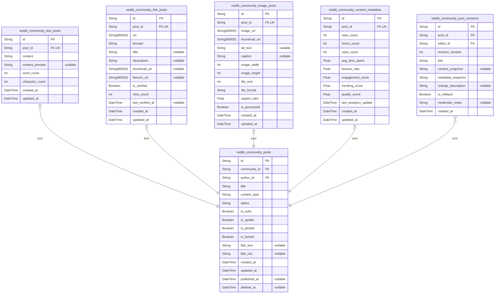
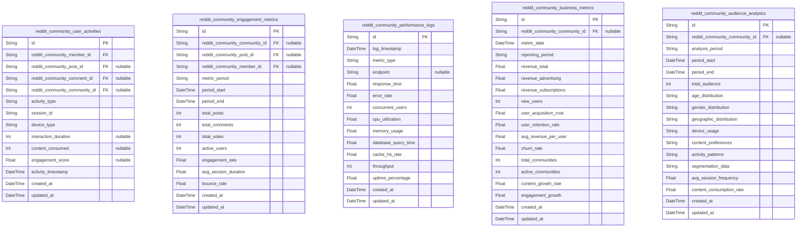

# Prisma Markdown

> Generated by [`prisma-markdown`](https://github.com/samchon/prisma-markdown)

- [Systematic](#systematic)
- [Actors](#actors)
- [Communities](#communities)
- [Content](#content)
- [Engagement](#engagement)
- [Discovery](#discovery)
- [Moderation](#moderation)
- [Analytics](#analytics)

## Systematic

### `reddit_community_configurations`

Central system configuration table storing platform-wide settings and
parameters. This table contains all configurable aspects of the
Reddit-like community platform including feature flags, limits, and
global behavior settings. The configurations are referenced by multiple
domains but maintain system-level independence.

Properties as follows:

- `id`: Primary Key.
- `config_key`: Unique configuration key identifier used for system references.
- `config_value`: Configuration value stored as string for flexibility.
- `config_type`: Data type of the configuration value (boolean, integer, string, json).
- `description`: Human-readable description explaining the configuration purpose.
- `category`
  > Configuration category grouping similar settings (authentication,
  > content, performance).
- `is_active`: Whether this configuration is currently active and being used.
- `version`: Configuration version for tracking changes and updates.
- `created_at`: Timestamp when this configuration was created.
- `updated_at`: Timestamp when this configuration was last updated.
- `deleted_at`: Timestamp when this configuration was soft deleted.

### `reddit_community_channels`

Community channel management table defining communication channels and
their configurations. Each channel represents a distinct communication
pathway within the community platform, supporting different types of
content and interaction patterns.

Properties as follows:

- `id`: Primary Key.
- `channel_name`: Unique name identifier for the communication channel.
- `display_name`: Human-readable display name for the channel.
- `channel_type`: Type of channel (discussion, announcement, support, general).
- `description`: Description explaining the channel's purpose and guidelines.
- `is_public`: Whether the channel is publicly accessible or requires permissions.
- `max_members`: Maximum number of members allowed in this channel.
- `content_rules`: JSON string containing channel-specific content rules and restrictions.
- `moderation_settings`: JSON string containing moderation configuration for this channel.
- `is_active`: Whether this channel is currently active and accepting content.
- `created_at`: Timestamp when this channel was created.
- `updated_at`: Timestamp when this channel was last updated.
- `deleted_at`: Timestamp when this channel was soft deleted.

### `reddit_community_performance_metrics`

System performance metrics tracking table capturing platform performance
indicators. This table stores historical performance data for monitoring
system health, identifying bottlenecks, and capacity planning. The
metrics support operational decision-making and performance optimization.

Properties as follows:

- `id`: Primary Key.
- `metric_name`: Name of the performance metric being tracked.
- `metric_value`: Numeric value of the performance metric.
- `metric_unit`: Unit of measurement for the metric value (ms, req/s, MB, etc.).
- `metric_category`: Category grouping related metrics (database, api, network, system).
- `component`: System component being measured (authentication, posts, comments, voting).
- `measurement_interval`: Time interval for which this metric was measured (minute, hour, day).
- `threshold_min`: Minimum acceptable value for this metric.
- `threshold_max`: Maximum acceptable value for this metric.
- `is_breached`: Whether this metric has breached defined thresholds.
- `server_instance`: Identifier for the server instance where this metric was collected.
- `collected_at`: Timestamp when this performance metric was collected.
- `created_at`: Timestamp when this metric record was created.

### `reddit_community_audit_logs`

Comprehensive audit trail table capturing all significant system
activities and changes. This table provides complete visibility into
platform operations for security monitoring, compliance reporting, and
troubleshooting. Audit logs maintain immutable records of system state
changes.

Properties as follows:

- `id`: Primary Key.
- `action_type`: Type of action performed (create, update, delete, login, access).
- `resource_type`
  > Type of resource being acted upon (user, post, comment, community,
  > config).
- `resource_id`: ID of the specific resource affected by this action.
- `user_id`: ID of the user who performed this action if applicable.
- `user_ip`: IP address from which the action was performed.
- `user_agent`: User agent string of the client used for this action.
- `previous_values`: JSON string containing previous state values before the change.
- `new_values`: JSON string containing new state values after the change.
- `description`: Human-readable description of the action performed.
- `severity`: Severity level of this audit event (info, warning, error, critical).
- `is_successful`: Whether the action was completed successfully.
- `error_message`: Error message if the action failed.
- `session_id`: ID of the session during which this action was performed.
- `occurred_at`: Timestamp when this audit event occurred.
- `created_at`: Timestamp when this audit log record was created.

## Actors

### `reddit_community_guests`

Guest user accounts for unauthenticated platform access. Guests have
limited capabilities and can browse public content without registration.
These accounts serve as temporary identities for users exploring the
platform before committing to full registration.

Properties as follows:

- `id`: Primary Key.
- `session_token`: Unique session identifier for guest tracking.
- `ip_address`: IP address for geographic and security tracking.
- `user_agent`: Browser and device information for session management.
- `last_active_at`: Timestamp of last guest activity for session cleanup.
- `created_at`: Timestamp when guest session was created.
- `updated_at`: Timestamp when guest session was last updated.
- `deleted_at`: Timestamp when guest session was soft deleted.

### `reddit_community_members`

Registered member accounts with full platform access. Members can create
content, participate in communities, vote, and engage in discussions.
This table represents the core user base of the platform with complete
authentication and profile management.

Properties as follows:

- `id`: Primary Key.
- `username`
  > Unique username for member identification. Must be 3-20 characters with
  > alphanumeric and underscores only.
- `email`: Verified email address for communication and account recovery.
- `password_hash`: Hashed password for secure authentication using bcrypt.
- `display_name`: Optional display name different from username for user preference.
- `profile_picture_url`: URL to profile picture for user identity.
- `bio`: User biography or description up to 500 characters.
- `account_status`
  > Current account status: active, suspended, pending_verification, or
  > deactivated.
- `karma`: Total karma points accumulated from post and comment interactions.
- `email_verified_at`: Timestamp when email address was verified.
- `last_login_at`: Timestamp of last successful login.
- `created_at`: Timestamp when member account was created.
- `updated_at`: Timestamp when member account was last updated.
- `deleted_at`: Timestamp when member account was soft deleted.

### `reddit_community_moderators`

Community moderator accounts with elevated permissions for content
management. Moderators are responsible for enforcing community
guidelines, managing reported content, and maintaining community quality
standards.

Properties as follows:

- `id`: Primary Key.
- `reddit_community_member_id`: Reference to the base member account. [reddit_community_members.id](#reddit_community_members).
- `moderator_level`: Moderator permission level: junior, senior, or lead moderator.
- `communities_moderated_count`: Number of communities currently moderated by this user.
- `moderation_experience`: Total days of moderation experience across all communities.
- `special_permissions`: JSON string containing special moderation permissions and capabilities.
- `last_moderation_training_at`: Timestamp of last moderation training or certification.
- `moderator_since`: Timestamp when user first became a moderator.
- `created_at`: Timestamp when moderator record was created.
- `updated_at`: Timestamp when moderator record was last updated.
- `deleted_at`: Timestamp when moderator record was soft deleted.

### `reddit_community_admins`

Platform administrator accounts with system-wide management capabilities.
Administrators have ultimate authority over platform operations, user
management, and system configuration.

Properties as follows:

- `id`: Primary Key.
- `reddit_community_member_id`: Reference to the base member account. [reddit_community_members.id](#reddit_community_members).
- `admin_level`: Administrator permission level: support, content, system, or super_admin.
- `access_scope`: JSON string defining system areas the admin can access and manage.
- `security_clearance`: Security clearance level for sensitive operations and data access.
- `two_factor_enabled`: Whether two-factor authentication is required for admin access.
- `last_security_review_at`: Timestamp of last security review and access audit.
- `admin_since`: Timestamp when user first became an administrator.
- `created_at`: Timestamp when admin record was created.
- `updated_at`: Timestamp when admin record was last updated.
- `deleted_at`: Timestamp when admin record was soft deleted.

### `reddit_community_sessions`

User authentication sessions for tracking active logins and security.
Each session represents an authenticated user connection with device
information, location data, and security context for comprehensive access
management.

Properties as follows:

- `id`: Primary Key.
- `reddit_community_member_id`
  > Reference to the member account for this session. {@link
  > reddit_community_members.id}.
- `session_token`: Unique JWT session token for authentication.
- `refresh_token`: Refresh token for session renewal without re-authentication.
- `ip_address`: IP address for geographic and security tracking.
- `user_agent`: Browser and device information for session context.
- `device_type`: Type of device: mobile, tablet, desktop, or unknown.
- `location_data`: Geographic location information derived from IP address.
- `expires_at`: Timestamp when session token expires.
- `refresh_expires_at`: Timestamp when refresh token expires.
- `last_activity_at`: Timestamp of last activity within this session.
- `is_active`: Whether the session is currently active and valid.
- `security_flags`: JSON string containing security flags and risk assessments.
- `created_at`: Timestamp when session was created.
- `updated_at`: Timestamp when session was last updated.

### `reddit_community_authentication_logs`

Comprehensive authentication event logging for security auditing and
anomaly detection. Each log entry records authentication attempts,
successes, failures, and security-related events across all user roles.

Properties as follows:

- `id`: Primary Key.
- `reddit_community_member_id`
  > Reference to the member account involved in authentication event. {@link
  > reddit_community_members.id}.
- `event_type`
  > Type of authentication event: login, logout, failed_login,
  > password_change, etc.
- `event_timestamp`: Precise timestamp when the authentication event occurred.
- `ip_address`: IP address from which the authentication attempt originated.
- `user_agent`: Browser and device information for the authentication attempt.
- `success`: Whether the authentication event was successful.
- `failure_reason`: Reason for authentication failure, if applicable.
- `security_risk_level`: Assessed security risk level: low, medium, high, or critical.
- `additional_context`: JSON string containing additional context and metadata for the event.
- `created_at`: Timestamp when log entry was created.

## Communities

### `reddit_community_communities`

Core community entity representing user-created communities on the
platform. Each community has unique name, access type
(public/restricted/private), and moderation settings. Communities serve
as containers for posts and discussions, with customizable rules and
member management capabilities. [reddit_community_memberships.id](#reddit_community_memberships)
[reddit_community_settings.id](#reddit_community_settings) {@link
reddit_community_moderator_assignments.id}

Properties as follows:

- `id`: Primary Key.
- `reddit_community_category_id`
  > Associated community category for organization and discovery. {@link
  > reddit_community_categories.id}.
- `name`
  > Unique community name used for identification and URL generation. Must be
  > 3-21 characters, alphanumeric with underscores.
- `display_title`: Human-readable community title displayed to users. Max 50 characters.
- `description`
  > Community description explaining purpose and guidelines. Optional, max
  > 500 characters.
- `access_type`
  > Community access level: public (anyone can join), restricted (approval
  > required), or private (invite only).
- `member_count`: Current number of active community members. Updated automatically.
- `post_count`
  > Total number of posts published in this community. Tracked for activity
  > metrics.
- `status`: Community status: active, suspended, archived, or deleted.
- `created_at`: Timestamp when the community was created.
- `updated_at`: Timestamp of last community information update.
- `deleted_at`: Timestamp when community was soft-deleted, null if active.

### `reddit_community_memberships`

Tracks user membership in communities, including join dates, status, and
permissions. Supports public, restricted, and private community access
models with appropriate approval workflows. {@link
reddit_community_communities.id} [reddit_community_members.id](#reddit_community_members)

Properties as follows:

- `id`: Primary Key.
- `reddit_community_community_id`
  > Community that the user is member of. {@link
  > reddit_community_communities.id}.
- `reddit_community_member_id`: User who is member of the community. [reddit_community_members.id](#reddit_community_members).
- `membership_status`: Membership status: pending, approved, suspended, or banned.
- `joined_at`: Timestamp when user joined or was approved for membership.
- `left_at`: Timestamp when user left community, null if still active member.
- `permissions`: Member-specific permissions within the community.
- `last_visited_at`: Timestamp of last community visit by this member.
- `contribution_count`: Number of posts and comments contributed to this community.
- `created_at`: Timestamp when membership record was created.
- `updated_at`: Timestamp of last membership status update.

### `reddit_community_moderator_assignments`

Tracks moderator assignments and permissions within communities. Each
assignment specifies moderator authority level, scope, and assignment
details for community governance. [reddit_community_communities.id](#reddit_community_communities)
[reddit_community_members.id](#reddit_community_members)

Properties as follows:

- `id`: Primary Key.
- `reddit_community_community_id`
  > Community where user serves as moderator. {@link
  > reddit_community_communities.id}.
- `reddit_community_member_id`: User assigned as community moderator. [reddit_community_members.id](#reddit_community_members).
- `role_level`
  > Moderator role level: primary, secondary, or junior with different
  > permissions.
- `assigned_at`: Timestamp when moderator assignment was made.
- `permissions`: Specific moderation permissions granted to this moderator.
- `status`: Assignment status: active, suspended, or removed.
- `last_active_at`: Timestamp of last moderation activity by this user.
- `created_at`: Timestamp when moderator assignment was created.
- `updated_at`: Timestamp of last assignment update.

### `reddit_community_settings`

Community-specific configuration and settings that define posting rules,
content guidelines, and moderation policies. Each community has one
settings record that controls its operational parameters. {@link
reddit_community_communities.id}

Properties as follows:

- `id`: Primary Key.
- `reddit_community_community_id`
  > Community that these settings belong to. {@link
  > reddit_community_communities.id}.
- `posting_rules`: Community-specific posting guidelines and content restrictions.
- `moderation_policy`: Detailed moderation policy and enforcement procedures.
- `content_flags`: Types of content that require moderation or are prohibited.
- `automated_filters`: Automated content filtering rules and thresholds.
- `member_requirements`: Requirements for community membership approval.
- `theme_settings`: Community appearance and theme customization options.
- `created_at`: Timestamp when settings were created.
- `updated_at`: Timestamp of last settings modification.

### `reddit_community_categories`

Community categorization system for organizing communities by topic,
interest, or theme. Supports hierarchical category structures and
community discovery through category-based browsing. Used for content
organization and user navigation.

Properties as follows:

- `id`: Primary Key.
- `parent_id`
  > Parent category for hierarchical organization, null for top-level
  > categories. [reddit_community_categories.id](#reddit_community_categories).
- `name`: Unique category name used for identification and display.
- `description`: Category description explaining purpose and scope.
- `community_count`: Number of communities currently assigned to this category.
- `display_order`: Sort order for category display in listings and navigation.
- `status`: Category status: active, archived, or hidden.
- `created_at`: Timestamp when category was created.
- `updated_at`: Timestamp of last category update.

## Content

### `reddit_community_posts`

Core entity representing community posts that serve as the foundation for
all content types. Contains basic post information, community context,
and user attribution. This table maintains the lifecycle of posts across
the platform, supporting various content formats through specialized
subsidiary tables.

Properties as follows:

- `id`: Primary Key.
- `community_id`
  > Community where this post is published. {@link
  > reddit_community_communities.id}.
- `author_id`: Member who created this post. [reddit_community_members.id](#reddit_community_members).
- `title`: Post title that appears in community feeds and search results.
- `content_type`: Type of content contained in this post (text, link, image).
- `status`
  > Current publication status of the post (draft, published, archived,
  > removed).
- `is_nsfw`: Indicates if this post contains Not Safe For Work content.
- `is_spoiler`: Indicates if this post contains spoiler content requiring warnings.
- `is_pinned`: Indicates if this post is pinned to the top of its community.
- `is_locked`: Indicates if comments are disabled for this post.
- `flair_text`: Custom flair text displayed alongside the post title.
- `flair_css`: CSS class for styling the post flair.
- `created_at`: Timestamp when this post was initially created.
- `updated_at`: Timestamp when this post was last modified.
- `published_at`: Timestamp when this post was published to the community.
- `deleted_at`: Timestamp when this post was soft deleted.

### `reddit_community_text_posts`

Specialized content entity for text-based posts containing the actual
textual content body. This table supports rich text formatting, character
limits, and content moderation features specific to text content.

Properties as follows:

- `id`: Primary Key.
- `post_id`
  > Parent post that this text content belongs to. {@link
  > reddit_community_posts.id}.
- `content`: Main text content of the post with markdown formatting support.
- `content_preview`: Short preview text for feed displays without loading full content.
- `word_count`
  > Total number of words in the content for analytics and display
  > optimization.
- `character_count`: Total character count including whitespace for validation purposes.
- `created_at`: Timestamp when this text content was created.
- `updated_at`: Timestamp when this text content was last modified.

### `reddit_community_link_posts`

Specialized content entity for link-based posts containing URL references
and metadata. This table supports link validation, preview generation,
and external content referencing features.

Properties as follows:

- `id`: Primary Key.
- `post_id`
  > Parent post that this link content belongs to. {@link
  > reddit_community_posts.id}.
- `url`: Full URL of the external content being linked.
- `domain`: Extracted domain name for categorization and filtering.
- `title`: Title extracted from the linked content for preview display.
- `description`: Description extracted from the linked content metadata.
- `thumbnail_url`: URL of the thumbnail image for the linked content.
- `favicon_url`: URL of the favicon for the linked domain.
- `is_verified`: Indicates if the link has passed security verification checks.
- `click_count`: Number of times this link has been clicked by users.
- `last_verified_at`: Timestamp when the link was last verified for safety and validity.
- `created_at`: Timestamp when this link content was created.
- `updated_at`: Timestamp when this link content was last updated.

### `reddit_community_image_posts`

Specialized content entity for image-based posts containing image files
and metadata. This table supports multiple image formats, optimization,
and responsive display features.

Properties as follows:

- `id`: Primary Key.
- `post_id`
  > Parent post that this image content belongs to. {@link
  > reddit_community_posts.id}.
- `image_url`: Primary URL for the high-resolution image file.
- `thumbnail_url`: URL for the optimized thumbnail version of the image.
- `alt_text`: Alternative text description for accessibility and SEO purposes.
- `caption`: Optional caption text displayed below the image.
- `image_width`: Width of the original image in pixels.
- `image_height`: Height of the original image in pixels.
- `file_size`: Size of the image file in bytes for optimization tracking.
- `file_format`: Format of the image file (JPEG, PNG, GIF, WebP).
- `aspect_ratio`: Calculated aspect ratio for responsive display optimization.
- `is_processed`: Indicates if the image has been optimized and processed for delivery.
- `created_at`: Timestamp when this image content was created.
- `updated_at`: Timestamp when this image content was last updated.

### `reddit_community_content_metadata`

Supporting entity that stores additional metadata and analytics for
community posts. This table enables content personalization,
recommendation algorithms, and platform analytics without denormalizing
the main post tables.

Properties as follows:

- `id`: Primary Key.
- `post_id`: Post that this metadata belongs to. [reddit_community_posts.id](#reddit_community_posts).
- `view_count`: Total number of times this post has been viewed by users.
- `share_count`: Number of times this post has been shared externally.
- `save_count`: Number of times users have saved this post for later reference.
- `avg_time_spent`: Average time users spend viewing this post in seconds.
- `bounce_rate`: Percentage of users who view but don't engage with the post.
- `engagement_score`: Calculated score based on various engagement metrics.
- `trending_score`: Real-time score used for trending content algorithms.
- `quality_score`: Quality assessment score based on user feedback and moderation.
- `last_analytics_update`: Timestamp when analytics metrics were last calculated.
- `created_at`: Timestamp when this metadata record was created.
- `updated_at`: Timestamp when this metadata was last updated.

### `reddit_community_post_revisions`

Historical snapshot entity that tracks all revisions and edits made to
community posts. This table provides audit trails, content versioning,
and moderation transparency for post modifications.

Properties as follows:

- `id`: Primary Key.
- `post_id`
  > Original post that this revision belongs to. {@link
  > reddit_community_posts.id}.
- `editor_id`: Member who created this revision. [reddit_community_members.id](#reddit_community_members).
- `revision_number`: Sequential revision number for version tracking.
- `title`: Post title at the time of this revision.
- `content_snapshot`: Complete content snapshot for text posts at revision time.
- `metadata_snapshot`: JSON snapshot of post metadata and settings at revision time.
- `change_description`: User-provided description of what was changed in this revision.
- `is_rollback`: Indicates if this revision represents a rollback to previous version.
- `moderator_notes`: Optional notes from moderators about the revision context.
- `created_at`: Timestamp when this revision was created.

## Engagement

### `reddit_community_votes`

Tracks user voting activity on posts and comments within the community
platform. Each vote record captures the voting user, target content, vote
type (upvote/downvote), and timestamp. The system maintains vote
integrity through user-content uniqueness constraints and supports
real-time vote counting for content ranking algorithms.

Properties as follows:

- `id`: Primary Key.
- `user_id`: User who cast the vote. [reddit_community_members.id](#reddit_community_members).
- `post_id`: Target post that received the vote. [reddit_community_posts.id](#reddit_community_posts).
- `comment_id`
  > Target comment that received the vote. {@link
  > reddit_community_comments.id}.
- `vote_type`: Type of vote cast - either 'upvote' or 'downvote'.
- `vote_weight`: Weight of the vote based on user karma and account factors.
- `created_at`: Timestamp when the vote was cast.
- `updated_at`: Timestamp when the vote was last updated.
- `deleted_at`: Timestamp when the vote was soft deleted.

### `reddit_community_comments`

Stores user comments within community discussions. Supports unlimited
nesting through parent-child relationships and integrates with voting and
karma systems. Each comment maintains its position in the thread
hierarchy and supports rich text formatting through Markdown.

Properties as follows:

- `id`: Primary Key.
- `user_id`: User who authored the comment. [reddit_community_members.id](#reddit_community_members).
- `post_id`: Post that the comment belongs to. [reddit_community_posts.id](#reddit_community_posts).
- `parent_comment_id`: Parent comment for nested replies. [reddit_community_comments.id](#reddit_community_comments).
- `content`: Comment text content with Markdown formatting support.
- `depth`: Nesting depth of the comment in the thread hierarchy.
- `is_edited`: Indicates if the comment has been edited after creation.
- `is_deleted`: Indicates if the comment has been soft deleted.
- `score`: Current vote score calculated from upvotes minus downvotes.
- `created_at`: Timestamp when the comment was created.
- `updated_at`: Timestamp when the comment was last updated.
- `deleted_at`: Timestamp when the comment was soft deleted.

### `reddit_community_comment_threads`

Optimizes comment organization and retrieval by maintaining thread
structures for efficient nested comment display. This subsidiary table
supports rapid comment tree traversal and parent-child relationship
management without recursive database queries.

Properties as follows:

- `id`: Primary Key.
- `root_comment_id`
  > Top-level comment that starts the thread. {@link
  > reddit_community_comments.id}.
- `comment_id`: Comment belonging to this thread. [reddit_community_comments.id](#reddit_community_comments).
- `post_id`: Post that contains this comment thread. [reddit_community_posts.id](#reddit_community_posts).
- `thread_path`: Materialized path representing the comment's position in the thread.
- `descendant_count`: Number of descendant comments in this thread branch.
- `created_at`: Timestamp when the thread entry was created.
- `updated_at`: Timestamp when the thread entry was last updated.

### `reddit_community_karma_records`

Tracks karma changes for users based on voting activity and content
interactions. Each record represents a karma transaction with source
context, amount, and timestamp. Used for user reputation calculation and
voting weight adjustments.

Properties as follows:

- `id`: Primary Key.
- `user_id`: User whose karma is being updated. [reddit_community_members.id](#reddit_community_members).
- `source_post_id`: Post that generated the karma change. [reddit_community_posts.id](#reddit_community_posts).
- `source_comment_id`
  > Comment that generated the karma change. {@link
  > reddit_community_comments.id}.
- `voting_user_id`
  > User who cast the vote that generated karma. {@link
  > reddit_community_members.id}.
- `karma_change`: Amount of karma gained or lost in this transaction.
- `karma_type`: Type of karma transaction - 'post', 'comment', or 'award'.
- `transaction_reason`: Detailed reason for the karma change.
- `current_total`: User's total karma after this transaction.
- `created_at`: Timestamp when the karma transaction occurred.

### `reddit_community_user_reactions`

Captures diverse user reactions beyond simple voting, including awards,
emoji reactions, and other engagement types. Supports rich interaction
patterns and community-specific reaction systems.

Properties as follows:

- `id`: Primary Key.
- `user_id`: User who performed the reaction. [reddit_community_members.id](#reddit_community_members).
- `target_post_id`: Post that received the reaction. [reddit_community_posts.id](#reddit_community_posts).
- `target_comment_id`: Comment that received the reaction. [reddit_community_comments.id](#reddit_community_comments).
- `reaction_type`: Type of reaction performed - 'award', 'emoji', 'like', etc.
- `reaction_value`: Specific value of the reaction (emoji character, award type).
- `reaction_cost`: Cost in karma or virtual currency for premium reactions.
- `is_visible`: Indicates if the reaction is publicly visible.
- `created_at`: Timestamp when the reaction was performed.
- `updated_at`: Timestamp when the reaction was last updated.
- `deleted_at`: Timestamp when the reaction was soft deleted.

### `reddit_community_saved_content`

Enables users to save posts and comments for later reference. Each saved
item maintains user context, saving timestamp, and organizational
metadata for personal content management.

Properties as follows:

- `id`: Primary Key.
- `user_id`: User who saved the content. [reddit_community_members.id](#reddit_community_members).
- `post_id`: Post that was saved. [reddit_community_posts.id](#reddit_community_posts).
- `comment_id`: Comment that was saved. [reddit_community_comments.id](#reddit_community_comments).
- `category`: User-defined category for organizing saved content.
- `notes`: User notes attached to the saved content item.
- `is_archived`: Indicates if the saved item has been archived.
- `created_at`: Timestamp when the content was saved.
- `updated_at`: Timestamp when the saved item was last updated.
- `deleted_at`: Timestamp when the saved item was soft deleted.

## Discovery

### `reddit_community_feeds`

Personalized content feeds for users, combining subscribed communities,
trending content, and algorithmic recommendations. Each feed represents a
user's customized content stream that adapts based on engagement patterns
and preferences.

Properties as follows:

- `id`: Primary Key.
- `reddit_community_member_id`: User who owns this personalized feed. [reddit_community_members.id](#reddit_community_members).
- `preferred_community_id`
  > Primary community for feed content focus. {@link
  > reddit_community_communities.id}.
- `feed_name`: User-defined name for the feed (e.g., 'Tech News', 'Personal Favorites').
- `content_types`
  > Comma-separated list of preferred content types (text, link, image,
  > video).
- `sorting_algorithm`: Preferred sorting method (hot, new, top, controversial, rising).
- `refresh_frequency`: How often the feed refreshes in minutes (5, 15, 30, 60, 1440).
- `is_active`: Whether this feed is currently active and visible to the user.
- `last_refreshed_at`: Timestamp when this feed was last refreshed with new content.
- `created_at`: When this feed configuration was created.
- `updated_at`: When this feed configuration was last updated.
- `deleted_at`: Timestamp when this feed was soft-deleted by the user.

### `reddit_community_sorting_algorithms`

Configuration and metadata for content sorting algorithms used across the
platform. Defines how content is ranked and displayed in different
contexts (hot, new, top, controversial).

Properties as follows:

- `id`: Primary Key.
- `algorithm_name`
  > Unique identifier for the sorting algorithm (hot, new, top,
  > controversial, rising).
- `display_name`
  > User-friendly name displayed in the interface (Hot, New, Top,
  > Controversial).
- `description`: Detailed explanation of how this algorithm works and what it prioritizes.
- `parameters`: JSON configuration for algorithm-specific parameters and weights.
- `is_default`: Whether this algorithm should be used as the default for new users.
- `is_active`: Whether this algorithm is currently available for use.
- `time_decay_factor`
  > How quickly content ages out of relevance (higher values mean faster
  > decay).
- `engagement_weight`: Weight given to engagement metrics (votes, comments, shares).
- `relevance_weight`: Weight given to relevance based on user preferences and behavior.
- `created_at`: When this algorithm configuration was created.
- `updated_at`: When this algorithm configuration was last modified.

### `reddit_community_user_preferences`

User-specific preferences for content discovery, feed customization, and
personalization settings. Controls how content is filtered, sorted, and
recommended to individual users.

Properties as follows:

- `id`: Primary Key.
- `reddit_community_member_id`: User who owns these preferences. [reddit_community_members.id](#reddit_community_members).
- `preferred_content_age`: Preferred content age range (hour, day, week, month, year, all).
- `safe_search_enabled`: Whether to filter out potentially sensitive or NSFW content.
- `auto_play_media`: Whether to automatically play media content in feeds.
- `compact_view_enabled`: Whether to use compact view instead of card view for content.
- `show_nsfw_content`: Whether to show Not Safe For Work content when safe search is off.
- `email_digest_frequency`: Frequency of email digests (never, daily, weekly, monthly).
- `recommendation_strength`: How aggressively to recommend content (1-5 scale).
- `dark_mode_enabled`: Whether to use dark mode for the interface.
- `language_preference`: Preferred language for content and interface.
- `timezone`: User's timezone for content timing and notifications.
- `created_at`: When these preferences were first set.
- `updated_at`: When these preferences were last modified.

### `reddit_community_trending_topics`

Historical record of trending topics and content across the platform.
Captures popularity spikes and engagement patterns for analytics and
recommendation systems.

Properties as follows:

- `id`: Primary Key.
- `reddit_community_community_id`
  > Community where this topic is trending. {@link
  > reddit_community_communities.id}.
- `related_post_id`
  > Primary post driving this trending topic. {@link
  > reddit_community_posts.id}.
- `topic_keywords`: Comma-separated keywords that represent the trending topic.
- `trending_score`: Numerical score representing the topic's current popularity.
- `engagement_velocity`: Rate of engagement growth (posts, comments, votes per hour).
- `peak_engagement`: Maximum number of concurrent engagements during the trend.
- `duration_hours`: How long the topic has been trending in hours.
- `trend_category`: Category of trend (viral, breaking, seasonal, evergreen).
- `is_active`: Whether this topic is currently trending.
- `started_trending_at`: When this topic first started trending.
- `last_updated_at`: When the trending metrics were last calculated.
- `created_at`: When this trending record was created.

### `reddit_community_recommendations`

Content and community recommendations generated for users based on
behavior, preferences, and similarity algorithms. Supports personalized
discovery of new content and communities.

Properties as follows:

- `id`: Primary Key.
- `reddit_community_member_id`
  > User who receives this recommendation. {@link
  > reddit_community_members.id}.
- `recommended_community_id`: Community being recommended. [reddit_community_communities.id](#reddit_community_communities).
- `recommended_post_id`: Post being recommended. [reddit_community_posts.id](#reddit_community_posts).
- `recommendation_type`: Type of recommendation (community, post, user, topic).
- `confidence_score`: Algorithm's confidence in this recommendation (0.0-1.0).
- `reasoning`: Explanation of why this recommendation was generated.
- `is_dismissed`: Whether the user has dismissed this recommendation.
- `is_accepted`: Whether the user has accepted/followed this recommendation.
- `dismissed_at`: When the user dismissed this recommendation.
- `accepted_at`: When the user accepted this recommendation.
- `expires_at`: When this recommendation expires and should be removed.
- `created_at`: When this recommendation was generated.
- `updated_at`: When this recommendation was last updated.

### `reddit_community_search_index`

Search index for efficient content discovery and full-text search
capabilities. Contains processed and indexed content for fast retrieval
and relevance ranking.

Properties as follows:

- `id`: Primary Key.
- `reddit_community_post_id`: Post being indexed for search. [reddit_community_posts.id](#reddit_community_posts).
- `reddit_community_community_id`
  > Community context for the indexed content. {@link
  > reddit_community_communities.id}.
- `indexed_title`: Processed and normalized title text for search indexing.
- `indexed_content`: Processed and normalized content text for search indexing.
- `indexed_comments`: Aggregated and processed comment text for search relevance.
- `search_tokens`: Tokenized keywords and phrases extracted from the content.
- `relevance_score`: Calculated relevance score for search ranking.
- `language`: Language of the indexed content for proper stemming.
- `is_indexed`: Whether this content has been fully processed and indexed.
- `last_indexed_at`: When this content was last indexed or updated.
- `created_at`: When this index entry was created.
- `updated_at`: When this index entry was last updated.

## Moderation

### `reddit_community_reports`

User-generated content reports for moderation review. Users can report
inappropriate content, spam, or guideline violations. Each report
triggers a moderation workflow that may result in content removal, user
warnings, or other actions. Reports are categorized by severity and type
to prioritize moderator attention.

Properties as follows:

- `id`: Primary Key.
- `reporter_user_id`: User who submitted the report. [reddit_community_members.id](#reddit_community_members).
- `reported_content_id`
  > Content being reported (post or comment). {@link
  > reddit_community_posts.id} or [reddit_community_comments.id](#reddit_community_comments).
- `community_id`
  > Community where the content was reported. {@link
  > reddit_community_communities.id}.
- `moderator_id`
  > Moderator assigned to handle the report. {@link
  > reddit_community_moderators.id}.
- `report_type`: Category of the reported violation (spam, harassment, illegal, etc.).
- `severity_level`: Severity assessment of the reported content.
- `description`: Detailed explanation provided by the reporter.
- `status`: Current status of the report (pending, under_review, resolved, dismissed).
- `evidence_urls`: JSON array of evidence URLs provided by the reporter.
- `priority_score`: Calculated priority score based on severity and reporter credibility.
- `created_at`: Timestamp when the report was submitted.
- `updated_at`: Timestamp when the report was last updated.
- `deleted_at`: Timestamp when the report was soft deleted.

### `reddit_community_moderation_actions`

Records of moderation actions taken by community moderators. Tracks all
moderator interventions including content removal, user warnings,
temporary bans, and guideline enforcement. Provides audit trail for
moderator accountability and transparency.

Properties as follows:

- `id`: Primary Key.
- `moderator_id`
  > Moderator who performed the action. {@link
  > reddit_community_moderators.id}.
- `target_user_id`
  > User who was affected by the moderation action. {@link
  > reddit_community_members.id}.
- `community_id`
  > Community where the action was taken. {@link
  > reddit_community_communities.id}.
- `related_content_id`
  > Content that triggered the moderation action. {@link
  > reddit_community_posts.id} or [reddit_community_comments.id](#reddit_community_comments).
- `report_id`
  > Report that led to this moderation action. {@link
  > reddit_community_reports.id}.
- `action_type`
  > Type of moderation action (remove_content, warn_user, temporary_ban,
  > permanent_ban, etc.).
- `reason`: Detailed explanation for the moderation action.
- `duration_minutes`: Duration of temporary actions in minutes (null for permanent actions).
- `severity_level`: Severity classification of the moderation action.
- `status`: Current status of the action (active, expired, revoked, appealed).
- `automated`: Whether the action was performed automatically by system.
- `created_at`: Timestamp when the moderation action was taken.
- `updated_at`: Timestamp when the action was last updated.
- `deleted_at`: Timestamp when the action record was soft deleted.

### `reddit_community_content_flags`

Automated content flagging system that identifies potential guideline
violations using pattern detection and machine learning. Flags are
reviewed by moderators and may result in moderation actions. Reduces
manual moderation workload by automatically identifying problematic
content.

Properties as follows:

- `id`: Primary Key.
- `content_id`
  > Content that was flagged by the automated system. {@link
  > reddit_community_posts.id} or [reddit_community_comments.id](#reddit_community_comments).
- `community_id`
  > Community where the content was posted. {@link
  > reddit_community_communities.id}.
- `moderator_review_id`
  > Moderator who reviewed the automated flag. {@link
  > reddit_community_moderators.id}.
- `flag_type`
  > Type of automated flag (spam_detection, hate_speech,
  > inappropriate_content, etc.).
- `confidence_score`: Machine learning confidence score for the flag (0.0 to 1.0).
- `triggered_patterns`: JSON array of patterns that triggered the flag.
- `status`: Current status of the flag (pending, reviewed, action_taken, dismissed).
- `review_notes`: Notes from moderator review of the automated flag.
- `false_positive`: Whether the flag was a false positive (used for ML training).
- `created_at`: Timestamp when the content was automatically flagged.
- `updated_at`: Timestamp when the flag was last updated.
- `deleted_at`: Timestamp when the flag record was soft deleted.

### `reddit_community_guidelines`

Community-specific rules and guidelines that define acceptable behavior
and content standards. Guidelines can be customized per community and
support versioning for tracking changes over time. Moderators use these
guidelines to make consistent enforcement decisions.

Properties as follows:

- `id`: Primary Key.
- `community_id`
  > Community that owns these guidelines. {@link
  > reddit_community_communities.id}.
- `created_by_moderator_id`
  > Moderator who created or last updated the guidelines. {@link
  > reddit_community_moderators.id}.
- `guideline_version`: Version identifier for tracking guideline changes.
- `title`: Title of the guideline category or section.
- `description`: Detailed description of the guideline rule.
- `category`: Category of the guideline (content, behavior, spam, etc.).
- `severity_level`: Severity level for violations of this guideline.
- `enforcement_action`: Recommended enforcement action for violations.
- `active`: Whether this guideline version is currently active.
- `requires_acknowledgment`: Whether users must acknowledge this guideline.
- `created_at`: Timestamp when the guideline was created.
- `updated_at`: Timestamp when the guideline was last updated.
- `deleted_at`: Timestamp when the guideline was soft deleted.

### `reddit_community_ban_records`

Historical record of user bans within communities. Tracks both temporary
and permanent bans, including ban duration, reasons, and appeal status.
Provides comprehensive audit trail for user moderation history and
supports ban escalation policies.

Properties as follows:

- `id`: Primary Key.
- `banned_user_id`
  > User who was banned from the community. {@link
  > reddit_community_members.id}.
- `moderator_id`: Moderator who issued the ban. [reddit_community_moderators.id](#reddit_community_moderators).
- `community_id`
  > Community from which the user was banned. {@link
  > reddit_community_communities.id}.
- `appeal_id`
  > Appeal associated with this ban record. {@link
  > reddit_community_appeals.id}.
- `ban_type`: Type of ban (temporary, permanent, shadow_ban).
- `reason`: Detailed reason for the ban as provided by the moderator.
- `duration_days`: Duration of the ban in days (null for permanent bans).
- `status`: Current status of the ban (active, expired, lifted, appealed).
- `previous_ban_count`: Number of previous bans for this user in this community.
- `escalation_level`: Escalation level based on previous violations.
- `ban_started_at`: Timestamp when the ban period began.
- `ban_ended_at`: Timestamp when the ban period ended or will end.
- `created_at`: Timestamp when the ban record was created.
- `updated_at`: Timestamp when the ban record was last updated.
- `deleted_at`: Timestamp when the ban record was soft deleted.

### `reddit_community_appeals`

User appeal system for contesting moderation actions. Allows users to
request review of content removal, warnings, or bans. Appeals are
reviewed by moderators or administrators and can result in action
reversals or modifications. Provides due process and transparency in
moderation.

Properties as follows:

- `id`: Primary Key.
- `appealing_user_id`: User who is submitting the appeal. [reddit_community_members.id](#reddit_community_members).
- `moderation_action_id`
  > Moderation action being appealed. {@link
  > reddit_community_moderation_actions.id}.
- `community_id`
  > Community where the appeal is being submitted. {@link
  > reddit_community_communities.id}.
- `reviewing_moderator_id`
  > Moderator assigned to review the appeal. {@link
  > reddit_community_moderators.id}.
- `appeal_type`: Type of appeal (content_removal, user_warning, ban_appeal, etc.).
- `appeal_reason`: User's explanation for why the moderation action should be reviewed.
- `status`: Current status of the appeal (submitted, under_review, approved, denied).
- `resolution_reason`: Explanation provided by moderator for the appeal decision.
- `priority_level`: Priority level for appeal review based on severity and impact.
- `submitted_at`: Timestamp when the appeal was submitted.
- `reviewed_at`: Timestamp when the appeal was reviewed by a moderator.
- `created_at`: Timestamp when the appeal record was created.
- `updated_at`: Timestamp when the appeal record was last updated.
- `deleted_at`: Timestamp when the appeal record was soft deleted.

## Analytics

### `reddit_community_user_activities`

Tracks detailed user activity patterns across all platform interactions.
Captures individual user actions including posting, voting, commenting,
and browsing behavior for comprehensive engagement analysis. This table
serves as the foundation for user behavior analytics and personalization
engines. [reddit_community_members.id](#reddit_community_members).

Properties as follows:

- `id`: Primary Key.
- `reddit_community_member_id`
  > The user whose activity is being tracked. {@link
  > reddit_community_members.id}.
- `reddit_community_post_id`
  > The post involved in the activity, if applicable. {@link
  > reddit_community_posts.id}.
- `reddit_community_comment_id`
  > The comment involved in the activity, if applicable. {@link
  > reddit_community_comments.id}.
- `reddit_community_community_id`
  > The community where the activity occurred. {@link
  > reddit_community_communities.id}.
- `activity_type`: Type of user activity being tracked (view, vote, comment, post, etc.).
- `session_id`: Unique identifier for the user session during this activity.
- `device_type`: Type of device used for the activity (desktop, mobile, tablet).
- `interaction_duration`: Duration of the interaction in seconds.
- `content_consumed`: Amount of content consumed during the activity.
- `engagement_score`: Calculated engagement score for this activity.
- `activity_timestamp`: Exact timestamp when the activity occurred.
- `created_at`: When this activity record was created.
- `updated_at`: When this activity record was last updated.

### `reddit_community_engagement_metrics`

Aggregated engagement metrics for communities, posts, and users. Provides
summarized view of user interactions, voting patterns, and content
performance for trend analysis and community health monitoring. {@link
reddit_community_communities.id}.

Properties as follows:

- `id`: Primary Key.
- `reddit_community_community_id`
  > The community these metrics belong to. {@link
  > reddit_community_communities.id}.
- `reddit_community_post_id`
  > The post these metrics belong to, if specific to a post. {@link
  > reddit_community_posts.id}.
- `reddit_community_member_id`
  > The user these metrics belong to, if specific to a user. {@link
  > reddit_community_members.id}.
- `metric_period`: Time period for these metrics (hourly, daily, weekly, monthly).
- `period_start`: Start timestamp of the metric period.
- `period_end`: End timestamp of the metric period.
- `total_posts`: Total number of posts created during the period.
- `total_comments`: Total number of comments created during the period.
- `total_votes`: Total number of votes cast during the period.
- `active_users`: Number of unique active users during the period.
- `engagement_rate`: Overall engagement rate as percentage.
- `avg_session_duration`: Average session duration in minutes.
- `bounce_rate`: Percentage of users who left after single interaction.
- `created_at`: When this metric record was created.
- `updated_at`: When this metric record was last updated.

### `reddit_community_performance_logs`

System performance and user experience metrics tracking. Captures
platform response times, error rates, and infrastructure performance for
monitoring and optimization purposes. Supports capacity planning and
performance troubleshooting.

Properties as follows:

- `id`: Primary Key.
- `log_timestamp`: Timestamp when the performance metric was recorded.
- `metric_type`: Type of performance metric being measured.
- `endpoint`: API endpoint or service being measured.
- `response_time`: Response time in milliseconds.
- `error_rate`: Error rate as percentage for this metric.
- `concurrent_users`: Number of concurrent users at measurement time.
- `cpu_utilization`: CPU utilization percentage.
- `memory_usage`: Memory usage in megabytes.
- `database_query_time`: Average database query time in milliseconds.
- `cache_hit_rate`: Cache hit rate percentage.
- `throughput`: Requests per second throughput.
- `uptime_percentage`: System uptime percentage for the period.
- `created_at`: When this performance log was created.
- `updated_at`: When this performance log was last updated.

### `reddit_community_business_metrics`

Business intelligence and revenue tracking metrics. Captures platform
growth, monetization performance, user acquisition costs, and business
health indicators for strategic decision making. {@link
reddit_community_communities.id}.

Properties as follows:

- `id`: Primary Key.
- `reddit_community_community_id`
  > The community these business metrics belong to. {@link
  > reddit_community_communities.id}.
- `metric_date`: Date for which these business metrics are calculated.
- `reporting_period`: Reporting period (daily, weekly, monthly, quarterly).
- `revenue_total`: Total revenue generated during the period.
- `revenue_advertising`: Revenue from advertising sources.
- `revenue_subscriptions`: Revenue from premium subscriptions.
- `new_users`: Number of new users acquired during the period.
- `user_acquisition_cost`: Average cost per user acquisition.
- `user_retention_rate`: User retention rate as percentage.
- `avg_revenue_per_user`: Average revenue per active user.
- `churn_rate`: User churn rate percentage.
- `total_communities`: Total number of communities on platform.
- `active_communities`: Number of communities with active content.
- `content_growth_rate`: Percentage growth in content volume.
- `engagement_growth`: Percentage growth in user engagement.
- `created_at`: When this business metric was created.
- `updated_at`: When this business metric was last updated.

### `reddit_community_audience_analytics`

Demographic and behavioral audience analysis data. Provides insights into
user demographics, geographic distribution, device usage patterns, and
audience segmentation for targeted content and marketing strategies.
[reddit_community_communities.id](#reddit_community_communities).

Properties as follows:

- `id`: Primary Key.
- `reddit_community_community_id`
  > The community this audience analysis belongs to. {@link
  > reddit_community_communities.id}.
- `analysis_period`: Time period for this audience analysis.
- `period_start`: Start of the analysis period.
- `period_end`: End of the analysis period.
- `total_audience`: Total audience size during the period.
- `age_distribution`: JSON string representing age group distribution.
- `gender_distribution`: JSON string representing gender distribution.
- `geographic_distribution`: JSON string representing geographic distribution by country/region.
- `device_usage`: JSON string representing device usage distribution.
- `content_preferences`: JSON string representing content type preferences.
- `activity_patterns`: JSON string representing user activity time patterns.
- `segmentation_data`: JSON string representing audience segmentation results.
- `avg_session_frequency`: Average number of sessions per user.
- `content_consumption_rate`: Average content consumption per user.
- `created_at`: When this audience analysis was created.
- `updated_at`: When this audience analysis was last updated.
