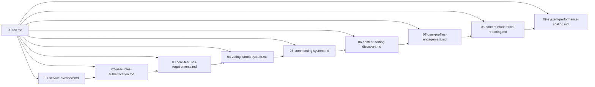
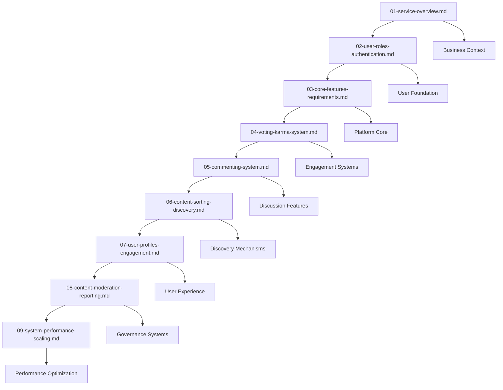

# Reddit-like Community Platform - Master Documentation

## Project Overview

This documentation suite provides comprehensive requirements and specifications for building a modern Reddit-like community platform. The platform enables users to create communities, share content, engage in discussions, and build reputation through a sophisticated voting and karma system.

### Core Platform Vision

Create a vibrant, scalable community platform where users can:
- Discover and join communities based on their interests
- Share diverse content types (text, links, images)
- Engage in meaningful discussions through nested commenting
- Build reputation through a transparent karma system
- Moderate content collaboratively through community reporting

### Target Audience

- **Developers**: Technical implementation teams building the backend and frontend
- **Business Stakeholders**: Product managers, investors, and executive leadership
- **Community Managers**: Future platform moderators and administrators
- **Technical Writers**: Documentation and API specification teams

## Documentation Structure

## Document Index

### 01-service-overview.md
**Purpose**: Defines the overall business vision, market strategy, and value proposition for the community platform.

**Audience**: Business stakeholders, executive leadership, product managers

**Key Content**: 
- Business model and revenue streams analysis
- Competitive landscape and market positioning
- Growth strategy and success metrics
- Platform differentiation and unique value propositions

**Prerequisites**: None - foundational document that establishes business context

**Implementation Guidance**: Developers should reference this document to understand the business objectives driving technical requirements. Product managers can use this to align feature development with market needs.

### 02-user-roles-authentication.md
**Purpose**: Details complete user role hierarchy, authentication flows, and permission management.

**Audience**: Development team, security architects, system administrators

**Key Content**: 
- Four-tier user role definitions (Guest, Member, Moderator, Administrator)
- JWT-based authentication and session management
- Permission matrices for all platform actions
- Security protocols and access control enforcement

**Prerequisites**: 01-service-overview.md (business context)

**Implementation Guidance**: Backend developers should implement role-based access control using the defined permission matrices. Security teams should follow the authentication workflows for secure user management.

### 03-core-features-requirements.md
**Purpose**: Specifies community creation, posting system, content types, and basic user interactions.

**Audience**: Development team, UX designers, product managers

**Key Content**:
- Community creation and management workflows
- Text, link, and image post specifications
- Content validation and submission processing
- User interaction patterns and engagement metrics

**Prerequisites**: 02-user-roles-authentication.md (user permissions)

**Implementation Guidance**: Frontend developers should implement the posting interfaces according to content type specifications. Backend teams should build the content processing pipelines with proper validation rules.

### 04-voting-karma-system.md
**Purpose**: Defines the voting mechanics, karma calculation algorithms, and reputation management.

**Audience**: Development team, data scientists, product managers

**Key Content**:
- Upvote/downvote system specifications
- Karma accumulation and calculation algorithms
- Reputation tiers and achievement systems
- Vote weighting and content scoring mechanisms

**Prerequisites**: 03-core-features-requirements.md (content foundation)

**Implementation Guidance**: Algorithm engineers should implement the karma calculation formulas. Backend developers should build the voting infrastructure with real-time score updates.

### 05-commenting-system.md
**Purpose**: Details the nested commenting infrastructure, threading, and discussion management.

**Audience**: Development team, UX designers, community managers

**Key Content**:
- Unlimited nested comment hierarchies
- Comment voting and sorting algorithms
- Moderation tools and reporting workflows
- Real-time discussion management features

**Prerequisites**: 04-voting-karma-system.md (voting integration)

**Implementation Guidance**: Backend developers should implement the comment threading engine with efficient parent-child relationship management. Frontend teams should build the nested comment display with collapse/expand functionality.

### 06-content-sorting-discovery.md
**Purpose**: Specifies content sorting algorithms, personalized feeds, and discovery mechanisms.

**Audience**: Development team, algorithm engineers, product managers

**Key Content**:
- Hot, New, Top, and Controversial sorting algorithms
- Personalized feed generation based on user behavior
- Community recommendation systems
- Trending content detection and display

**Prerequisites**: 05-commenting-system.md (engagement data)

**Implementation Guidance**: Algorithm developers should implement the sorting algorithms with proper time decay and engagement weighting. Backend teams should build the feed generation pipelines with caching strategies.

### 07-user-profiles-engagement.md
**Purpose**: Defines user profile management, activity tracking, and engagement features.

**Audience**: Development team, UX designers, community managers

**Key Content**:
- User profile information architecture
- Activity history and tracking systems
- Personalization and customization features
- Achievement and badge systems

**Prerequisites**: 06-content-sorting-discovery.md (personalization foundation)

**Implementation Guidance**: Frontend developers should build comprehensive profile interfaces with activity timelines. Backend teams should implement the engagement tracking and analytics systems.

### 08-content-moderation-reporting.md
**Purpose**: Details content moderation, reporting workflows, and community guidelines enforcement.

**Audience**: Development team, community managers, legal team

**Key Content**:
- User reporting system with categorization
- Moderator workflows and decision processes
- Automated content filtering and spam detection
- Appeal and review procedures

**Prerequisites**: 07-user-profiles-engagement.md (user context)

**Implementation Guidance**: Backend developers should build the moderation queue system with priority handling. Community managers should use the defined workflows for consistent content moderation.

### 09-system-performance-scaling.md
**Purpose**: Specifies performance requirements, scalability considerations, and system architecture.

**Audience**: Development team, system architects, DevOps engineers

**Key Content**:
- Performance benchmarks and response time targets
- Horizontal scaling strategies and capacity planning
- Data management and storage requirements
- Monitoring and analytics implementation

**Prerequisites**: 08-content-moderation-reporting.md (complete feature set)

**Implementation Guidance**: System architects should design the infrastructure based on the scaling requirements. DevOps teams should implement monitoring and auto-scaling solutions.

## Quick Start Guide

### For Developers Starting Implementation

1. **Begin with Business Context**: Read 01-service-overview.md to understand the platform vision, market positioning, and business objectives that drive technical requirements.

2. **Set Up Authentication Foundation**: Implement 02-user-roles-authentication.md to establish the four-tier user role system and secure authentication mechanisms before building any features.

3. **Build Core Platform Features**: Develop 03-core-features-requirements.md to create the community and posting systems that form the platform foundation.

4. **Implement Engagement Systems**: Add 04-voting-karma-system.md and 05-commenting-system.md to enable user interactions and discussions.

5. **Create Discovery Mechanisms**: Build 06-content-sorting-discovery.md to provide content organization and personalized discovery features.

6. **Develop User Experience**: Implement 07-user-profiles-engagement.md to create comprehensive user profiles and engagement tracking.

7. **Establish Governance Systems**: Add 08-content-moderation-reporting.md to ensure platform integrity and community management.

8. **Optimize Performance**: Finally, implement 09-system-performance-scaling.md to ensure the platform meets performance and scalability requirements.

### For Business Stakeholders

1. **Strategic Overview**: Review 01-service-overview.md to understand the business model, competitive landscape, and growth strategy.

2. **Feature Understanding**: Study 03-core-features-requirements.md to comprehend the platform capabilities and user experience design.

3. **User Engagement Analysis**: Examine 04-voting-karma-system.md and 07-user-profiles-engagement.md to understand user retention and growth mechanisms.

4. **Platform Governance**: Review 08-content-moderation-reporting.md to understand content policies and community management approaches.

### For Community Managers

1. **User Management Foundation**: Understand 02-user-roles-authentication.md to grasp user permissions and role-based access control.

2. **Content Policies**: Master 08-content-moderation-reporting.md for effective community moderation and guideline enforcement.

3. **Engagement Features**: Learn 05-commenting-system.md and 07-user-profiles-engagement.md to foster community discussions and user participation.

## Document Status and Versioning

### Version Control System

All documents follow semantic versioning (MAJOR.MINOR.PATCH):
- **MAJOR**: Breaking changes to requirements or architecture
- **MINOR**: Additional features or significant enhancements
- **PATCH**: Bug fixes, clarifications, or minor updates

### Current Document Versions

- **00-toc.md**: Version 1.0.0 - Initial comprehensive table of contents
- **01-service-overview.md**: Version 1.0.0 - Business foundation document
- **02-user-roles-authentication.md**: Version 1.0.0 - Authentication specifications
- **03-core-features-requirements.md**: Version 1.0.0 - Core feature definitions
- **04-voting-karma-system.md**: Version 1.0.0 - Voting and karma algorithms
- **05-commenting-system.md**: Version 1.0.0 - Commenting infrastructure
- **06-content-sorting-discovery.md**: Version 1.0.0 - Sorting and discovery systems
- **07-user-profiles-engagement.md**: Version 1.0.0 - User profile management
- **08-content-moderation-reporting.md**: Version 1.0.0 - Moderation workflows
- **09-system-performance-scaling.md**: Version 1.0.0 - Performance specifications

### Change Management Process

Document updates follow a structured change management process:

1. **Change Request**: Stakeholders submit change requests with business justification
2. **Impact Analysis**: Technical team assesses implementation impact and dependencies
3. **Approval Workflow**: Changes require approval from product and technical leads
4. **Implementation**: Developers update requirements and related documentation
5. **Version Update**: Documents receive appropriate version bumps based on change scope

## Related Documents and Dependencies

### Cross-Document Dependencies

Each document builds upon the foundation established in previous documents, creating a logical dependency chain:

### Implementation Priority Matrix

| Document | Business Priority | Technical Complexity | Dependencies | Recommended Implementation Order |
|----------|------------------|----------------------|--------------|----------------------------------|
| 01-service-overview.md | High | Low | None | 1st - Business foundation |
| 02-user-roles-authentication.md | Critical | Medium | 01 | 2nd - Security foundation |
| 03-core-features-requirements.md | Critical | High | 02 | 3rd - Platform core |
| 04-voting-karma-system.md | High | Medium | 03 | 4th - Engagement features |
| 05-commenting-system.md | High | High | 04 | 5th - Discussion systems |
| 06-content-sorting-discovery.md | Medium | High | 05 | 6th - Discovery features |
| 07-user-profiles-engagement.md | Medium | Medium | 06 | 7th - User experience |
| 08-content-moderation-reporting.md | Medium | Medium | 07 | 8th - Governance systems |
| 09-system-performance-scaling.md | High | High | 08 | 9th - Performance optimization |

### Integration Testing Requirements

When implementing multiple documents, ensure proper integration testing:

- **Authentication Integration**: Verify user roles work across all features
- **Content Flow Testing**: Ensure posts, comments, and voting integrate seamlessly
- **Performance Validation**: Test system performance under combined feature loads
- **Security Compliance**: Validate permission enforcement across all user interactions

## Quality Assurance Checklist

### Document Completeness Verification

Before considering implementation complete, verify each document meets these standards:

- [ ] All EARS format requirements are properly specified
- [ ] Business processes are fully described in natural language
- [ ] User workflows include all possible scenarios
- [ ] Error handling covers all edge cases
- [ ] Performance requirements are measurable and testable
- [ ] Integration points with other documents are clearly defined

### Implementation Readiness Assessment

Development teams should confirm readiness before starting implementation:

- [ ] All prerequisite documents are implemented and tested
- [ ] Technical dependencies are understood and accounted for
- [ ] Performance requirements align with system capabilities
- [ ] Security considerations are integrated into design
- [ ] Testing strategies are defined for all requirements

### Ongoing Maintenance Requirements

After implementation, establish maintenance procedures:

- [ ] Regular document review cycles (quarterly)
- [ ] Change request tracking and impact analysis
- [ ] Version control and change history maintenance
- [ ] Cross-document dependency updates
- [ ] Performance monitoring against documented requirements

This comprehensive table of contents provides the complete navigation framework for the Reddit-like community platform documentation suite, ensuring all stakeholders have clear guidance for implementation, reference, and ongoing maintenance.