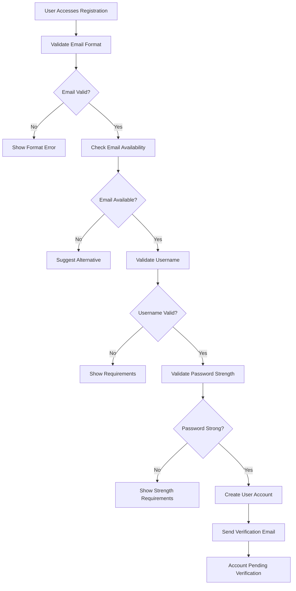
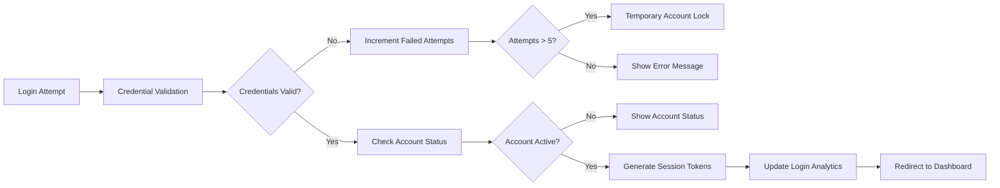
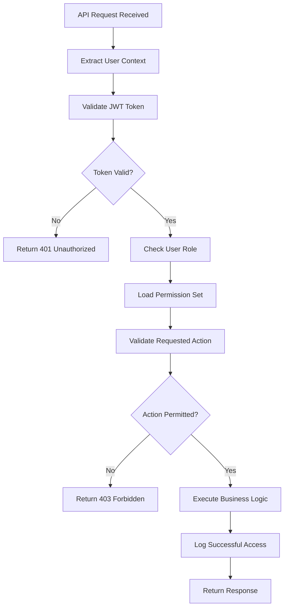
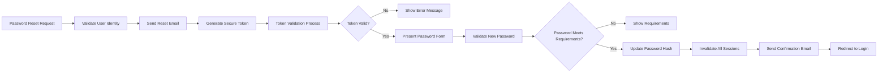

# User Roles and Authentication System Requirements

## Executive Summary

This document defines the complete authentication and authorization system for the Reddit-like community platform. The system implements a role-based access control (RBAC) model with four distinct user roles: Guest, Member, Moderator, and Administrator. The authentication system uses JWT tokens for secure session management and provides comprehensive permission matrices to enforce access control across all platform features.

## User Role Definitions

### Guest Role
Unauthenticated users who access the platform without registration. Guests have limited read-only access to public content.

**Guest Capabilities:**
- **WHEN** a guest browses the platform, **THE** system **SHALL** allow viewing public communities and posts
- **WHERE** guest users view content, **THE** system **SHALL** display voting counts and karma scores
- **WHEN** guests attempt interactive actions, **THE** system **SHALL** prompt for registration

**Guest Limitations:**
- **WHEN** a guest attempts to create content, **THE** system **SHALL** prevent action and display registration requirement
- **WHERE** content requires authentication, **THE** system **SHALL** restrict guest access
- **IF** a guest attempts to vote, **THEN THE** system **SHALL** redirect to login page

### Member Role
Authenticated users who have completed registration and verification. Members form the core user base with full content creation and interaction capabilities.

**Member Capabilities:**
- **WHEN** a member is authenticated, **THE** system **SHALL** allow post creation and management
- **WHERE** members participate in communities, **THE** system **SHALL** enable voting and commenting
- **WHEN** members browse content, **THE** system **SHALL** provide full interaction capabilities

**Member Limitations:**
- **WHEN** a member attempts moderator actions, **THE** system **SHALL** verify community moderation permissions
- **WHERE** administrative functions are accessed, **THE** system **SHALL** restrict member access
- **IF** a member violates community guidelines, **THEN THE** system **SHALL** apply appropriate restrictions

### Moderator Role
Community-specific administrators who manage content within their assigned communities. Moderators have elevated permissions for content management and user enforcement.

**Moderator Capabilities:**
- **WHEN** a moderator accesses their community, **THE** system **SHALL** provide moderation tools
- **WHERE** inappropriate content is identified, **THE** system **SHALL** enable removal capabilities
- **WHEN** user violations occur, **THE** system **SHALL** allow temporary community bans

**Moderator Limitations:**
- **WHEN** moderation actions cross community boundaries, **THE** system **SHALL** restrict authority
- **WHERE** platform-wide settings are modified, **THE** system **SHALL** require administrator approval
- **IF** moderator actions are abusive, **THEN THE** system **SHALL** provide appeal mechanisms

### Administrator Role
System-wide administrators with complete platform access and control over all features and users.

**Administrator Capabilities:**
- **WHEN** platform-wide changes are needed, **THE** system **SHALL** provide administrative controls
- **WHERE** user disputes require resolution, **THE** system **SHALL** enable override capabilities
- **WHEN** system maintenance is required, **THE** system **SHALL** provide configuration access

## Authentication System Requirements

### User Registration Process

**WHEN** a new user initiates registration, **THE** system **SHALL** follow this comprehensive workflow:

**Registration Validation Rules:**
- **WHEN** email validation occurs, **THE** system **SHALL** check for valid domain format and MX record existence
- **WHERE** username conflicts exist, **THE** system **SHALL** provide intelligent alternative suggestions
- **WHEN** password strength is evaluated, **THE** system **SHALL** require minimum 8 characters with mixed character types
- **IF** registration attempts exceed 5 per hour from same IP, **THEN THE** system **SHALL** implement temporary rate limiting

### Email Verification Requirements

**WHEN** verification email is sent, **THE** system **SHALL**:
- Generate unique verification token with 24-hour expiration
- Include clear instructions and security warnings in email content
- Provide one-click verification link with fallback code option
- Track email delivery status and trigger resend if undelivered

**WHEN** user clicks verification link, **THE** system **SHALL**:
- Validate token authenticity and expiration status
- Activate user account immediately upon successful verification
- Redirect to personalized welcome experience
- Send confirmation email with platform introduction

### User Login Authentication

**WHEN** users attempt login, **THE** system **SHALL** implement multi-layered security:

**Login Security Measures:**
- **WHEN** failed login attempts occur, **THE** system **SHALL** implement progressive delay between attempts
- **WHERE** suspicious login patterns are detected, **THE** system **SHALL** require additional verification
- **IF** login originates from unrecognized device/location, **THEN THE** system **SHALL** send security notification

### JWT Token Management

**WHEN** user authentication succeeds, **THE** system **SHALL** generate secure token pair:
- **Access Token**: 30-minute expiration with user ID, roles, and permissions
- **Refresh Token**: 7-day expiration stored in httpOnly cookie
- **Token Security**: RSA-256 signing with key rotation every 90 days

**Token Refresh Workflow:**
- **WHEN** access token expires, **THE** system **SHALL** attempt automatic refresh
- **WHERE** refresh token is valid, **THE** system **SHALL** issue new token pair
- **IF** refresh token is expired, **THEN THE** system **SHALL** require re-authentication

## Comprehensive Permission Matrix

### Content Creation Permissions

| Action | Guest | Member | Moderator | Administrator |
|--------|-------|--------|-----------|---------------|
| View public posts | ✅ "View Public Content" | ✅ "View All Content" | ✅ "Full Content Access" | ✅ "Unrestricted Access" |
| Create text post | ❌ "Registration Required" | ✅ "Community Posting" | ✅ "Moderator Posting" | ✅ "Administrative Posting" |
| Create image post | ❌ "Authentication Needed" | ✅ "Media Upload Enabled" | ✅ "Moderator Media" | ✅ "Admin Media Access" |
| Create link post | ❌ "Member Feature" | ✅ "Link Sharing" | ✅ "Moderator Links" | ✅ "Admin Link Posts" |

### Community Interaction Permissions

| Action | Guest | Member | Moderator | Administrator |
|--------|-------|--------|-----------|---------------|
| Join community | ❌ "Sign Up Required" | ✅ "Community Membership" | ✅ "Moderator Access" | ✅ "Admin Oversight" |
| Leave community | ❌ "Not Applicable" | ✅ "Member Control" | ✅ "Moderator Management" | ✅ "Admin Authority" |
| Subscribe to feed | ❌ "Authentication Needed" | ✅ "Feed Management" | ✅ "Moderator Feeds" | ✅ "Admin Feed Control" |

### Content Moderation Permissions

| Action | Guest | Member | Moderator | Administrator |
|--------|-------|--------|-----------|---------------|
| Report content | ❌ "Registration Required" | ✅ "Community Reporting" | ✅ "Moderator Reporting" | ✅ "Admin Reporting" |
| Remove own content | ❌ "Not Applicable" | ✅ "Content Management" | ✅ "Moderator Control" | ✅ "Admin Removal" |
| Moderate community | ❌ "Elevated Access" | ❌ "Moderator Role" | ✅ "Community Moderation" | ✅ "Platform Moderation" |
| Ban users | ❌ "Administrative Action" | ❌ "Moderator Privilege" | ✅ "Community Bans" | ✅ "Platform Bans" |

### Administrative Permissions

| Action | Guest | Member | Moderator | Administrator |
|--------|-------|--------|-----------|---------------|
| System configuration | ❌ "Admin Only" | ❌ "Restricted Access" | ❌ "Platform Level" | ✅ "System Administration" |
| User management | ❌ "Administrative" | ❌ "Moderator Scope" | ❌ "Community Level" | ✅ "User Administration" |
| Analytics access | ❌ "Protected Data" | ❌ "Business Intelligence" | ❌ "Limited Metrics" | ✅ "Full Analytics" |
| Billing management | ❌ "Financial Systems" | ❌ "Payment Processing" | ❌ "Revenue Operations" | ✅ "Financial Administration" |

## Security and Access Control Implementation

### Password Security Requirements

**WHEN** passwords are created, **THE** system **SHALL** enforce:
- Minimum 12 characters with complexity requirements
- Regular password rotation every 90 days
- Password history prevention (last 24 passwords)
- Real-time breach database checking

**Password Complexity Rules:**
- **WHEN** password meets requirements, **THE** system **SHALL** accept immediately
- **WHERE** weak passwords are detected, **THE** system **SHALL** provide specific improvement suggestions
- **IF** compromised passwords are used, **THEN THE** system **SHALL** prevent account creation

### Account Security Measures

**Multi-Factor Authentication:**
- **WHEN** users enable MFA, **THE** system **SHALL** support TOTP and backup codes
- **WHERE** sensitive actions are performed, **THE** system **SHALL** require re-authentication
- **IF** MFA devices are lost, **THEN THE** system **SHALL** provide recovery workflow

**Session Security:**
- **WHEN** sessions are active, **THE** system **SHALL** monitor for suspicious activity
- **WHERE** simultaneous logins are detected, **THE** system **SHALL** notify user of all active sessions
- **IF** inactive sessions exceed 30 minutes, **THEN THE** system **SHALL** require re-authentication

### Access Control Enforcement

**Role-Based Access Control:**
- **WHEN** API requests are made, **THE** system **SHALL** validate user role and permissions
- **WHERE** resource ownership matters, **THE** system **SHALL** verify user authorization
- **IF** permission checks fail, **THEN THE** system **SHALL** log security event and deny access

**Permission Validation Workflow:**

## Session Management Requirements

### User Session Lifecycle

**WHEN** users log in successfully, **THE** system **SHALL**:
- Create secure session with unique identifier
- Store session metadata including IP address and user agent
- Set appropriate session timeout based on user preference
- Initialize user-specific caches and preferences

**Session Timeout Rules:**
- **WHEN** users are active, **THE** system **SHALL** extend session duration automatically
- **WHERE** users enable "remember me", **THE** system **SHALL** create persistent session
- **IF** administrative sessions are inactive for 15 minutes, **THEN THE** system **SHALL** require re-authentication

### Concurrent Session Management

**WHEN** multiple sessions are active, **THE** system **SHALL**:
- Allow up to 5 concurrent sessions per user
- Provide session management interface showing all active sessions
- Enable users to remotely terminate specific sessions
- Notify users of new login events from unrecognized devices

**Security Monitoring:**
- **WHEN** suspicious session activity is detected, **THE** system **SHALL** trigger security alerts
- **WHERE** session hijacking is suspected, **THE** system **SHALL** invalidate all user sessions
- **IF** geographic anomalies are detected, **THEN THE** system **SHALL** require additional verification

## Password and Account Recovery

### Comprehensive Recovery Workflow

**WHEN** users request password reset, **THE** system **SHALL** implement secure recovery:

**Recovery Security Measures:**
- **WHEN** reset tokens are generated, **THE** system **SHALL** use cryptographically secure random values
- **WHERE** reset links are accessed, **THE** system **SHALL** enforce one-time use and 1-hour expiration
- **IF** multiple reset attempts occur, **THEN THE** system **SHALL** implement rate limiting and security review

### Account Recovery Scenarios

**Email Recovery:**
- **WHEN** users lose access to registered email, **THE** system **SHALL** provide alternative verification methods
- **WHERE** backup email is configured, **THE** system **SHALL** allow recovery through secondary channel
- **IF** account ownership is disputed, **THEN THE** system **SHALL** require manual review by support team

**Compromised Account Recovery:**
- **WHEN** account compromise is detected, **THE** system **SHALL** immediately lock the account
- **WHERE** suspicious activity is confirmed, **THE** system **SHALL** require identity verification
- **IF** malicious activity occurred, **THEN THE** system **SHALL** provide content restoration options

## Role Escalation and Demotion Processes

### Moderator Assignment Workflow

**WHEN** community creators assign moderator roles, **THE** system **SHALL** follow structured process:

**Moderator Assignment Requirements:**
- **WHEN** moderator invitation is sent, **THE** system **SHALL** require recipient acceptance
- **WHERE** users accept moderator role, **THE** system **SHALL** provide comprehensive moderation training
- **IF** moderator responsibilities are declined, **THEN THE** system **SHALL** allow alternative candidate selection

**Moderator Onboarding:**
- **WHEN** new moderators are appointed, **THE** system **SHALL** grant graduated permissions
- **WHERE** moderation tools are accessed, **THE** system **SHALL** provide contextual guidance
- **IF** moderation mistakes occur, **THEN THE** system **SHALL** offer corrective training

### Administrator Role Management

**WHEN** administrator roles are assigned, **THE** system **SHALL** implement strict controls:

**Administrator Appointment:**
- **WHEN** new administrators are nominated, **THE** system **SHALL** require multi-level approval
- **WHERE** administrative access is granted, **THE** system **SHALL** implement activity logging
- **IF** administrator actions are performed, **THEN THE** system **SHALL** maintain comprehensive audit trails

**Role Transition Security:**
- **WHEN** role changes occur, **THE** system **SHALL** invalidate existing sessions immediately
- **WHERE** elevated permissions are granted, **THE** system **SHALL** require re-authentication
- **IF** role demotion occurs, **THEN THE** system **SHALL** perform security review of recent actions

### Role-Based Security Protocols

**Permission Escalation Prevention:**
- **WHEN** users attempt privilege escalation, **THE** system **SHALL** detect and prevent unauthorized access
- **WHERE** role boundaries are tested, **THE** system **SHALL** log security events for review
- **IF** permission bypass attempts occur, **THEN THE** system **SHALL** trigger security alerts

**Graceful Permission Reduction:**
- **WHEN** moderator roles are revoked, **THE** system **SHALL** preserve community content integrity
- **WHERE** administrator access is removed, **THE** system **SHALL** ensure business continuity
- **IF** role changes affect user experience, **THEN THE** system **SHALL** provide clear communication

## Integration Requirements with Platform Features

### Community System Integration

**WHEN** authentication system integrates with communities, **THE** system **SHALL**:
- Synchronize user roles with community membership status
- Validate community-specific permissions during content access
- Update user reputation based on community participation
- Maintain consistency between platform-wide and community-specific roles

**Community Permission Enforcement:**
- **WHEN** users join communities, **THE** system **SHALL** apply community-specific permission sets
- **WHERE** community rules conflict with platform policies, **THE** system **SHALL** enforce stricter standard
- **IF** community moderation actions occur, **THEN THE** system **SHALL** update user standing appropriately

### Content System Integration

**WHEN** content creation occurs, **THE** system **SHALL** validate:
- User authentication status and role permissions
- Community posting privileges and restrictions
- Content-type specific authorization requirements
- User reputation and karma-based limitations

**Content Access Control:**
- **WHEN** content is accessed, **THE** system **SHALL** verify user permissions for viewing
- **WHERE** sensitive content is involved, **THE** system **SHALL** implement additional verification
- **IF** content ownership is disputed, **THEN THE** system **SHALL** provide clear resolution process

### Voting System Integration

**WHEN** voting actions are performed, **THE** system **SHALL** enforce:
- User authentication requirements for all voting interactions
- Role-based vote weighting and impact calculations
- Community-specific voting rules and restrictions
- Real-time permission validation during vote processing

**Voting Authorization:**
- **WHEN** users attempt to vote, **THE** system **SHALL** verify active membership status
- **WHERE** vote manipulation is suspected, **THE** system **SHALL** implement additional scrutiny
- **IF** unauthorized voting occurs, **THEN THE** system **SHALL** log security event and rectify votes

## Error Handling and User Experience

### Authentication Error Scenarios

**WHEN** authentication failures occur, **THE** system **SHALL** provide clear guidance:

**Common Error Handling:**
- **WHEN** invalid credentials are provided, **THE** system **SHALL** show specific error messages
- **WHERE** account locks are active, **THE** system **SHALL** indicate lock duration and recovery options
- **IF** system errors prevent login, **THEN THE** system **SHALL** provide status updates and alternatives

**User Recovery Support:**
- **WHEN** users encounter authentication issues, **THE** system **SHALL** offer step-by-step recovery
- **WHERE** technical problems persist, **THE** system **SHALL** provide support contact information
- **IF** security concerns arise, **THEN THE** system **SHALL** guide users through verification process

### Permission Error Management

**WHEN** permission errors occur, **THE** system **SHALL** implement user-friendly responses:

**Access Denied Handling:**
- **WHEN** unauthorized access is attempted, **THE** system **SHALL** explain permission requirements
- **WHERE** role upgrades are possible, **THE** system **SHALL** suggest appropriate paths
- **IF** temporary restrictions exist, **THEN THE** system **SHALL** indicate duration and conditions

**Error Recovery Assistance:**
- **WHEN** permission conflicts arise, **THE** system **SHALL** provide contextual help
- **WHERE** multiple permission levels exist, **THE** system **SHALL** clarify hierarchy
- **IF** user confusion occurs, **THEN THE** system **SHALL** offer direct support options

## Performance and Scalability Requirements

### Authentication Performance Standards

**WHEN** authentication operations are performed, **THE** system **SHALL** meet these benchmarks:

**Response Time Requirements:**
- **WHEN** user login occurs, **THE** system **SHALL** respond within 200ms for 95% of requests
- **WHERE** token validation is needed, **THE** system **SHALL** process within 50ms
- **IF** session management operations occur, **THEN THE** system **SHALL** maintain sub-100ms performance

**Throughput Capacity:**
- **WHEN** peak traffic occurs, **THE** system **SHALL** handle 1,000 concurrent authentications
- **WHERE** user growth continues, **THE** system **SHALL** scale to support 100,000 daily active users
- **IF** authentication load increases, **THEN THE** system **SHALL** maintain consistent performance

### Scalability Architecture

**WHEN** platform scales, **THE** authentication system **SHALL** support:

**Horizontal Scaling:**
- **WHEN** user base grows, **THE** system **SHALL** distribute authentication load across multiple servers
- **WHERE** geographic expansion occurs, **THE** system **SHALL** implement regional authentication endpoints
- **IF** performance degradation is detected, **THEN THE** system **SHALL** trigger automatic scaling

**Database Performance:**
- **WHEN** user data is accessed, **THE** system **SHALL** maintain sub-10ms query response times
- **WHERE** session storage is involved, **THE** system **SHALL** use optimized caching strategies
- **IF** database load increases, **THEN THE** system **SHALL** implement read replicas and sharding

## Security Compliance and Monitoring

### Regulatory Compliance

**WHEN** privacy regulations apply, **THE** system **SHALL** ensure compliance:

**GDPR Requirements:**
- **WHEN** user data is processed, **THE** system **SHALL** provide data export capabilities
- **WHERE** data deletion requests are received, **THE** system **SHALL** implement secure erasure
- **IF** privacy breaches occur, **THEN THE** system **SHALL** follow notification protocols

**Security Standards:**
- **WHEN** authentication occurs, **THE** system **SHALL** follow OWASP security guidelines
- **WHERE** sensitive information is handled, **THE** system **SHALL** use industry-standard encryption
- **IF** security vulnerabilities are discovered, **THEN THE** system **SHALL** implement immediate patches

### Monitoring and Alerting

**WHEN** authentication system operates, **THE** system **SHALL** implement comprehensive monitoring:

**Security Monitoring:**
- **WHEN** suspicious login patterns are detected, **THE** system **SHALL** trigger security alerts
- **WHERE** brute force attacks occur, **THE** system **SHALL** implement automatic blocking
- **IF** account compromise is suspected, **THEN THE** system **SHALL** notify security team immediately

**Performance Monitoring:**
- **WHEN** authentication latency increases, **THE** system **SHALL** alert operations team
- **WHERE** system errors occur, **THE** system **SHALL** log detailed error information
- **IF** capacity thresholds are approached, **THEN THE** system **SHALL** trigger scaling procedures

## Success Metrics and Validation

### Authentication Success Criteria

**WHEN** authentication system is deployed, **THE** system **SHALL** achieve these metrics:

**User Experience Metrics:**
- **WHEN** users attempt login, **THE** system **SHALL** maintain 99.9% success rate
- **WHERE** password reset is needed, **THE** system **SHALL** achieve 95% successful recovery rate
- **IF** authentication errors occur, **THEN THE** system **SHALL** resolve 90% through self-service

**Security Performance:**
- **WHEN** security measures are tested, **THE** system **SHALL** prevent 99.99% of unauthorized access
- **WHERE** account protection is needed, **THE** system **SHALL** detect suspicious activity within 5 minutes
- **IF** security incidents occur, **THEN THE** system **SHALL** contain impact within 15 minutes

### Continuous Improvement

**WHEN** authentication system operates, **THE** system **SHALL** implement ongoing enhancements:

**User Feedback Integration:**
- **WHEN** users report authentication issues, **THE** system **SHALL** incorporate improvements
- **WHERE** usability problems are identified, **THE** system **SHALL** optimize user experience
- **IF** new security threats emerge, **THEN THE** system **SHALL** implement protective measures

**Performance Optimization:**
- **WHEN** system performance is monitored, **THE** system **SHALL** identify optimization opportunities
- **WHERE** new technologies become available, **THE** system **SHALL** evaluate adoption benefits
- **IF** user needs evolve, **THEN THE** system **SHALL** adapt authentication methods accordingly

This comprehensive authentication and authorization system provides the security foundation for the Reddit-like community platform, ensuring robust user protection while maintaining excellent user experience across all access scenarios.