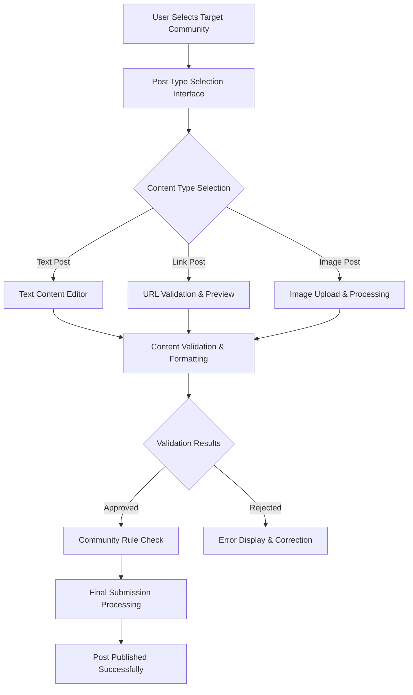

# Core Features Requirements Specification
## Reddit-like Community Platform

## Executive Summary

This document defines the complete business requirements for the core platform features of the Reddit-like community platform. The system enables user-driven community creation, diverse content sharing, interactive engagement mechanisms, and scalable content management workflows that form the foundation of a vibrant online community ecosystem.

### Platform Vision and Business Objectives
Create a democratic content platform where users can establish specialized communities, share knowledge through multiple content formats, and engage in meaningful discussions through transparent interaction systems. The platform prioritizes user autonomy, content quality, and community-led governance while maintaining platform-wide standards for safety and engagement.

## Community Management Requirements

### Community Creation and Configuration

**WHEN** an authenticated member requests to create a new community, **THE** system **SHALL** validate that the user meets the minimum karma threshold of 100 points and has been active for at least 30 days.

**Community Creation Validation Workflow:**
1. **WHEN** a member navigates to the community creation interface, **THE** system **SHALL** display a comprehensive community setup form requesting:
   - Community name (3-21 characters, alphanumeric and underscores only, unique platform-wide)
   - Community display title (3-50 characters, descriptive and brand-appropriate)
   - Community description (optional, 0-500 characters explaining community purpose)
   - Community type selection (public, restricted, or private access levels)
   - Content guidelines template (optional, 0-1000 characters for community rules)

2. **WHEN** the user submits the community creation request, **THE** system **SHALL** perform real-time validation checks:
   - Verify community name availability and format compliance
   - Check for potential trademark or copyright violations
   - Validate that the user hasn't created more than 5 communities in the past 30 days
   - Ensure the community topic doesn't conflict with existing platform guidelines

3. **WHEN** community creation succeeds, **THE** system **SHALL**:
   - Automatically assign the creator as the primary community moderator
   - Create default community settings with appropriate permissions
   - Generate a unique community URL slug following SEO best practices
   - Provide immediate access to basic moderation tools
   - Send welcome notification to the creator with community management guidelines

### Community Access Control and Types

**THE** system **SHALL** support three distinct community access types with specific permission hierarchies:

**Public Community Requirements:**
- **WHEN** a community is designated as public, **THE** system **SHALL** allow all platform users to:
  - View all community content without authentication requirements
  - Join/subscribe to the community with one-click subscription
  - Participate in discussions upon successful authentication
  - Access community search and discovery features

**Restricted Community Requirements:**
- **WHEN** a community is designated as restricted, **THE** system **SHALL** enforce:
  - Public content visibility for all users
  - Moderator approval requirement for posting privileges
  - Automatic subscription approval for joining requests
  - Read-only access for non-approved members

**Private Community Requirements:**
- **WHEN** a community is designated as private, **THE** system **SHALL** implement:
  - Complete content visibility restriction to approved members only
  - Invitation-only membership with moderator approval workflow
  - Hidden community status from public discovery mechanisms
  - Member-only access to community discussions and content

### Community Management Hierarchy

**Community Moderator Capabilities:**
- **WHEN** a moderator accesses community management tools, **THE** system **SHALL** provide:
  - Complete community information editing (title, description, guidelines)
  - Access type configuration with immediate effect
  - Moderator team management with role assignment capabilities
  - Content moderation queue with priority classification
  - User management with granular ban/unban functionality
  - Community analytics dashboard with engagement metrics
  - Automated content filtering configuration

**Community Member Management:**
- **WHEN** a user joins a community, **THE** system **SHALL**:
  - Add the community to the user's subscribed communities list
  - Include community content in the user's personalized feed algorithm
  - Apply community-specific posting permissions based on access type
  - Update community member count in real-time
  - Trigger community-specific welcome notifications

- **WHEN** a user leaves a community, **THE** system **SHALL**:
  - Remove community from user's subscription list
  - Exclude community content from personalized feed calculations
  - Maintain user's existing posts and comments with proper attribution
  - Update community analytics to reflect membership changes

## Post Creation and Management System

### Post Submission Workflow

### Post Content Validation Framework

**Text Post Requirements:**
- **WHEN** creating a text post, **THE** system **SHALL** enforce:
  - Post title requirement (10-300 characters with meaningful content)
  - Post content optionality (0-40,000 characters with formatting support)
  - Real-time character count display with limit warnings
  - Automated content quality assessment for spam detection
  - Community-specific content guideline compliance checking

**Link Post Requirements:**
- **WHEN** creating a link post, **THE** system **SHALL** implement:
  - URL format validation and safety checking
  - Automatic link preview generation with metadata extraction
  - Duplicate content detection within 24-hour window
  - Domain reputation assessment for spam prevention
  - Post title requirement (10-300 characters describing link content)

**Image Post Requirements:**
- **WHEN** creating an image post, **THE** system **SHALL** manage:
  - Supported format validation (JPEG, PNG, GIF, WebP)
  - File size limitation enforcement (maximum 20MB per image)
  - Automatic image optimization and multiple resolution generation
  - Content moderation scanning for inappropriate imagery
  - Caption support with 0-500 character optional field

### Post Visibility and Moderation Integration

**Post Submission Processing:**
- **WHEN** a post is submitted, **THE** system **SHALL** execute:
  - Community-specific content guideline enforcement
  - Automated spam and duplicate content detection
  - Real-time moderation queue assignment based on community settings
  - Unique post identifier generation with timestamp
  - Immediate visibility application according to community type

**Community-Specific Visibility Rules:**
- **WHEN** a post is submitted to a public community, **THE** system **SHALL** grant immediate public visibility to all platform users
- **WHEN** a post is submitted to a restricted community, **THE** system **SHALL** require moderator approval before public visibility activation
- **WHEN** a post is submitted to a private community, **THE** system **SHALL** restrict visibility exclusively to approved community members

### Post Management and Editing Capabilities

**Author Post Management:**
- **WHEN** a post author accesses their content, **THE** system **SHALL** provide:
  - Post title editing capability within 1 hour of submission
  - Post content editing within 24 hours of initial publication
  - Complete post deletion authority at any time
  - Edit history preservation for transparency and moderation

**Editing Constraint Enforcement:**
- **WHEN** a post receives community engagement, **THE** system **SHALL** restrict title modifications to preserve discussion context
- **WHERE** significant editing occurs, **THE** system **SHALL** maintain comprehensive version history for moderator review

**Moderator Post Controls:**
- **WHEN** community moderators review posts, **THE** system **SHALL** enable:
  - Post removal with detailed reason selection and documentation
  - Comment locking to prevent additional engagement on specific posts
  - Post pinning for community highlight and announcement features
  - Content flair assignment for categorization and filtering
  - User-specific posting restrictions within the community

## Content Type Specifications

### Text Post Formatting and Display

**Rich Content Support:**
- **THE** system **SHALL** implement comprehensive Markdown support including:
  - Header formatting (H1-H6 with proper semantic structure)
  - Bold, italic, and strikethrough text styling
  - Ordered and unordered list creation
  - Hyperlink embedding with security validation
  - Code block syntax highlighting for multiple programming languages
  - Blockquote formatting for reference and citation

**Text Post Display Optimization:**
- **WHEN** displaying text posts in feed views, **THE** system **SHALL**:
  - Show intelligent content truncation with "read more" expansion
  - Maintain proper formatting consistency across different devices
  - Support responsive design adaptations for mobile and desktop
  - Implement accessibility-compliant text rendering

### Link Post Processing and Security

**Link Validation Framework:**
- **WHEN** processing link posts, **THE** system **SHALL** execute:
  - Real-time URL safety validation against known threat databases
  - Automatic metadata extraction for preview generation
  - Favicon and domain information display
  - Thumbnail generation when supported by target content
  - Link integrity checking to prevent broken references

**Security Enforcement Mechanisms:**
- **THE** system **SHALL** implement comprehensive security measures including:
  - Phishing website detection and automatic blocking
  - Malicious content scanning before preview generation
  - Domain reputation assessment for spam prevention
  - Link expiration monitoring for content integrity

### Image Post Handling and Optimization

**Image Processing Pipeline:**
- **WHEN** users upload images, **THE** system **SHALL** perform:
  - Automatic format conversion for web optimization
  - Multiple resolution generation (thumbnail, preview, full-size)
  - Progressive loading implementation for large files
  - Compression balancing quality preservation with file size reduction
  - EXIF data stripping for privacy protection

**Image Content Management:**
- **THE** system **SHALL** enforce content policies through:
  - Maximum dimension enforcement to prevent layout disruption
  - Appropriate content filtering using automated detection
  - Copyright validation and attribution requirements
  - Alt text support for accessibility compliance
  - Responsive sizing for different display contexts

## User Interaction Requirements

### Core Engagement Framework

**Post Interaction Interface:**
- **WHEN** users view posts, **THE** system **SHALL** display comprehensive engagement metrics:
  - Post title and complete content with proper formatting
  - Author information with reputation and karma indicators
  - Precise timestamp with relative time display
  - Community context with subscription status
  - Real-time vote count with user voting status indication
  - Comment count with engagement depth indicators
  - Share and save functionality with usage tracking

**User Engagement Tracking:**
- **THE** system **SHALL** maintain detailed interaction metrics including:
  - Total vote differential (upvotes minus downvotes)
  - Comment volume and discussion participation rates
  - View count tracking with unique visitor differentiation
  - Share frequency and external platform dissemination
  - Save rate indicating content value perception

### Voting System Integration

**Voting Mechanism Specifications:**
- **WHEN** authenticated users interact with voting controls, **THE** system **SHALL**:
  - Allow single vote per user per content item with change capability
  - Implement real-time vote weight based on user karma levels
  - Provide immediate visual feedback for vote actions
  - Maintain vote history for user reference and moderation

**Vote Integrity Enforcement:**
- **THE** system **SHALL** prevent voting manipulation through:
  - Single-account voting restriction enforcement
  - Vote weighting algorithms that consider user reputation
  - Time-based vote validation to prevent rapid manipulation
  - Suspicious pattern detection with automated review triggers

### Content Management Features

**Personal Content Organization:**
- **THE** system **SHALL** provide users with comprehensive content management including:
  - Complete post creation history with engagement metrics
  - Comment activity timeline with context preservation
  - Saved content organization with categorization support
  - Voting history with content reference maintenance
  - Hidden post management with filtering preferences

**Content Filtering and Personalization:**
- **WHEN** users customize their content experience, **THE** system **SHALL**:
  - Apply user-specific content hiding across all sessions
  - Maintain filtering preferences with synchronization
  - Provide management interface for hidden content review
  - Support filtering by community, content type, and author

## Content Organization and Discovery

### Community-Based Architecture

**Content Hierarchy Management:**
- **EACH** community **SHALL** maintain independent content ecosystems featuring:
  - Community-specific content guidelines and moderation standards
  - Moderator-curated content highlighting and featuring
  - Member-generated discussion threads with quality enforcement
  - Announcement systems for community updates and events
  - Pinned content management for important information

**Community Discovery Mechanisms:**
- **THE** system **SHALL** facilitate community discovery through multiple channels:
  - Category-based browsing with topical organization
  - Popular community recommendations based on user interests
  - Similar community suggestions using content analysis
  - Advanced search functionality with community-specific filters
  - Geographic and demographic community matching

### Content Classification System

**Post Categorization Framework:**
- **THE** system **SHALL** support comprehensive content classification through:
  - Community-assigned post flairs for topic organization
  - Content type indicators with visual differentiation
  - Discussion status tracking (active, resolved, locked)
  - Quality markers based on engagement and moderation
  - Age-based content categorization for relevance filtering

**Tagging and Metadata Management:**
- **WHEN** applicable, **THE** system **SHALL** enable:
  - Community-specific tagging systems for content organization
  - Automated topic classification using content analysis
  - Content mood and tone indicators for user preference matching
  - Origin tracking for content source verification and attribution

### Content Freshness and Relevance

**Timing and Scheduling Management:**
- **THE** system **SHALL** implement sophisticated content timing through:
  - Accurate timestamping with timezone normalization
  - Content aging algorithms for relevance calculation
  - Scheduled posting capabilities for community moderators
  - Engagement-based content bumping for active discussions
  - Archival processes for historical content preservation

**Relevance Calculation Algorithms:**
- **THE** system **SHALL** determine content relevance using multi-factor analysis:
  - Recent engagement velocity and participation patterns
  - User voting behavior and consistency metrics
  - Comment activity levels and discussion depth
  - External sharing frequency and platform dissemination
  - Author reputation and content quality indicators

## Business Rules and Validation Framework

### Content Quality Standards

**Post Quality Enforcement:**
- **WHEN** users submit content, **THE** system **SHALL** validate:
  - Title relevance and content alignment requirements
  - Context-appropriate content matching community guidelines
  - Original content creation with duplicate detection
  - Language appropriateness and community standard compliance
  - Formatting consistency and readability optimization

**User Contribution Management:**
- **THE** system **SHALL** implement contribution controls to maintain quality:
  - Rate limiting with 10 posts per user per hour maximum
  - Comment frequency restriction of 50 comments per user per hour
  - Community-specific posting frequency adaptations
  - New user contribution limitations with gradual escalation
  - Quality-based posting privilege adjustments

### Community Governance Structure

**Moderation Hierarchy Establishment:**
- **THE** system **SHALL** maintain clear moderation authority through:
  - Automatic primary moderator assignment to community creators
  - Moderator team expansion with role-based permission granting
  - Comprehensive moderation action logging and transparency
  - Administrator oversight for moderator conduct and performance
  - Escalation pathways for complex moderation scenarios

**Content Dispute Resolution:**
- **WHEN** moderation decisions are contested, **THE** system **SHALL** provide:
  - Detailed moderation reason communication to affected users
  - Structured appeal process with evidence submission capabilities
  - Administrator review mechanisms for escalated cases
  - Transparent guideline application and precedent establishment
  - User education resources for guideline understanding

### User Reputation Integration

**Content Visibility Based on Reputation:**
- **THE** system **SHALL** incorporate user reputation factors including:
  - Content placement algorithm adjustments based on user karma
  - Spam filtering threshold adaptations using reputation signals
  - Community posting privilege grants correlated with standing
  - Advanced feature accessibility tied to reputation milestones
  - Quality indicator integration for content recommendation

**Community-Specific Reputation Tracking:**
- **WHEN** users participate across communities, **THE** system **SHALL** maintain:
  - Individual community contribution history and impact metrics
  - Community-specific karma calculations and reputation scores
  - Trust level assessments based on community engagement patterns
  - Moderation history tracking with community context
  - Cross-community reputation portability where appropriate

## Error Handling and User Experience

### User-Facing Error Management

**Post Creation Error Scenarios:**
- **IF** users attempt to post in unauthorized communities, **THEN THE** system **SHALL** display: "Community posting privileges required. Please check community access settings or contact moderators."
- **WHEN** content submissions exceed character limits, **THE** system **SHALL** provide specific field highlighting with character count indicators
- **IF** link posts contain invalid URLs, **THE** system **SHALL** offer URL formatting guidance with examples

**Community Interaction Error Handling:**
- **IF** users attempt to join private communities without invitations, **THE** system **SHALL** explain: "This community requires invitation or moderator approval. Please contact community moderators for access information."
- **WHEN** moderator actions encounter permission issues, **THE** system **SHALL** clarify authority boundaries with specific error messages
- **IF** content loading fails due to technical issues, **THE** system **SHALL** provide retry mechanisms with progress indicators

### Performance and Availability Standards

**User Experience Performance Requirements:**
- **THE** system **SHALL** load community pages within 2 seconds under normal operating conditions
- **Post** submission and voting actions **SHALL** feel instantaneous with sub-500ms response times
- **Content** feeds **SHALL** display initial content within 1 second of page load
- **Image** loading **SHALL** implement progressive display with placeholder previews

**System Availability Commitments:**
- **THE** platform **SHALL** maintain 99.5% uptime for core posting functionality
- **Content** submission **SHALL** include redundant validation to prevent data loss
- **User** interactions **SHALL** implement queuing mechanisms for temporary outage resilience
- **Real-time** features **SHALL** maintain connectivity through fallback mechanisms

### Recovery and Continuity Mechanisms

**Content Submission Recovery:**
- **WHEN** post submission encounters failures, **THE** system **SHALL**:
  - Preserve draft content in local storage with recovery options
  - Provide clear error explanations with retry guidance
  - Offer alternative submission methods when primary pathways fail
  - Maintain submission attempt history for troubleshooting

**User Session Management:**
- **WHEN** authentication expires during content creation, **THE** system **SHALL**:
  - Preserve unsaved content with automatic draft saving
  - Prompt for re-authentication with content recovery options
  - Maintain content context after successful re-login
  - Provide clear session management guidance

## Success Criteria and Validation Metrics

### Core Feature Acceptance Standards

**Community Creation Success Metrics:**
- **THE** system **SHALL** successfully process 99% of valid community creation requests
- **Community** URLs **SHALL** become accessible within 5 seconds of creation completion
- **Community** settings **SHALL** be configurable without technical errors in 95% of attempts
- **Moderator** tools **SHALL** provide immediate functionality upon community establishment

**Posting System Reliability Standards:**
- **THE** system **SHALL** process 95% of post submissions within 3 seconds of user action
- **Content** validation **SHALL** successfully identify 99% of policy violations before publication
- **Post** editing functionality **SHALL** maintain complete data integrity across all update operations
- **Media** processing **SHALL** complete within acceptable timeframes for user experience

### User Experience Validation Framework

**Content Creation Usability Standards:**
- **THE** posting interface **SHALL** enable intuitive use with minimal guidance requirements
- **Content** type selection **SHALL** provide clear differentiation and decision support
- **Post** submission feedback **SHALL** deliver immediate and informative confirmation
- **Error** recovery **SHALL** maintain user confidence through clear guidance

**Community Interaction Quality Measures:**
- **Community** navigation **SHALL** deliver seamless transitions between different communities
- **Content** discovery within communities **SHALL** provide efficient and relevant results
- **User** role transitions **SHALL** occur with transparency and proper documentation
- **Engagement** features **SHALL** maintain responsiveness under varying load conditions

This comprehensive requirements specification provides the complete business foundation for implementing the core features of a Reddit-like community platform. All requirements focus on business processes, user experiences, and platform objectives while leaving technical implementation decisions to development team expertise.