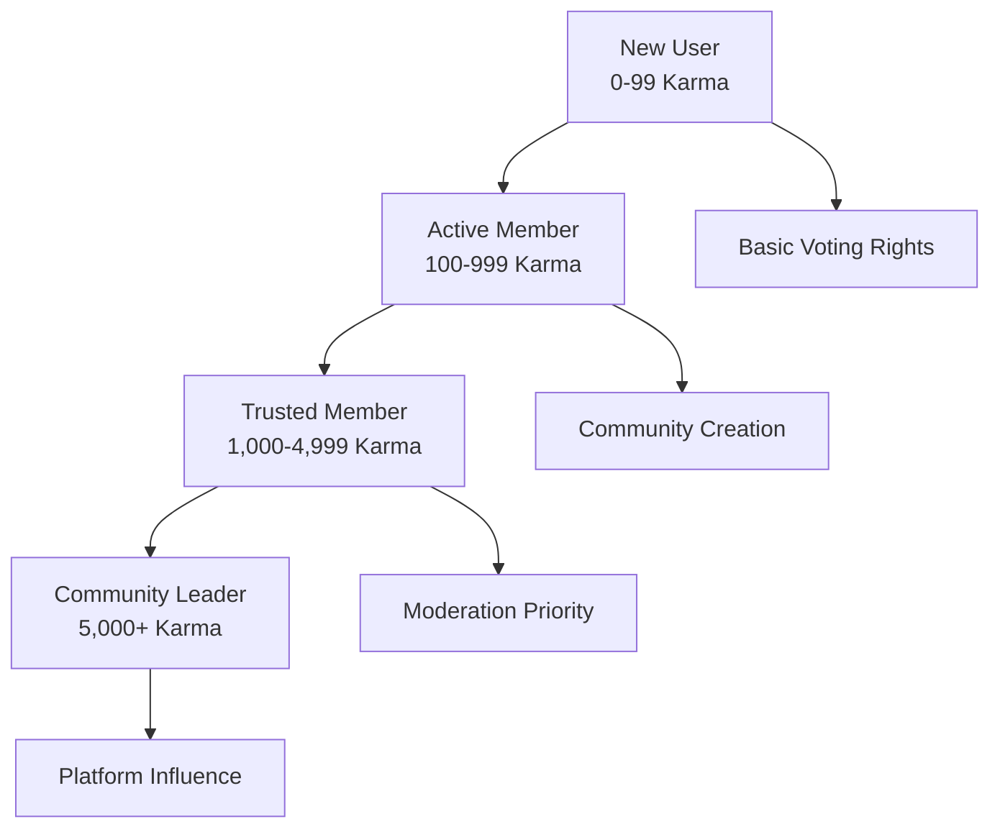

# Reddit-style Community Platform - Voting and Karma System Requirements Specification

## Executive Summary

This document defines the complete voting system and karma-based reputation management for the Reddit-like community platform. The system enables democratic content discovery through user voting, builds user reputation through karma accumulation, and provides gamification elements to drive engagement while maintaining content quality and platform integrity.

### Business Objectives
- Enable user-driven content quality assessment through voting mechanisms
- Build transparent reputation systems that reward quality contributions
- Drive user engagement through gamification and achievement systems
- Maintain platform integrity through anti-gaming protections
- Support scalable voting operations for high-traffic community interactions

## Core Voting System Requirements

### Voting Interface and User Interaction

**WHEN** a member views a post or comment, **THE** system **SHALL** display voting buttons with clear upvote/downvote indicators and current score display.

**WHEN** a member clicks the upvote button on content, **THE** system **SHALL** immediately increment the score by 1 and provide visual feedback confirming the vote.

**WHEN** a member clicks the downvote button on content, **THE** system **SHALL** immediately decrement the score by 1 and provide visual feedback confirming the vote.

**IF** a member attempts to vote on their own content, **THEN THE** system **SHALL** prevent the vote and display the message: "You cannot vote on your own content."

### Vote State Management

**WHILE** a user is viewing content, **THE** system **SHALL** visually indicate the user's current vote state using distinct colors and icons for upvoted, downvoted, and neutral states.

**WHEN** a user changes their vote from upvote to downvote or vice versa, **THE** system **SHALL** update the vote state immediately and recalculate the total score with a net change of 2 points.

**THE** system **SHALL** maintain vote history for each user-content interaction, tracking vote timestamps and changes for moderation and analytics purposes.

### Voting Access Control

**IF** a user attempts to vote on content they cannot access due to community restrictions, **THEN THE** system **SHALL** deny the vote and log the unauthorized access attempt for security monitoring.

**WHERE** content has been deleted or removed by moderators, **THE** system **SHALL** preserve existing vote records but prevent new votes from being cast.

**WHEN** a user's voting privileges are suspended due to community rules violations, **THE** system **SHALL** disable voting functionality and display the suspension duration to the user.

## Karma Calculation and Management

### Karma Accumulation Rules

**WHEN** a user's post receives an upvote from another user, **THE** system **SHALL** add 1 karma point to the post author's total karma score.

**WHEN** a user's post receives a downvote from another user, **THE** system **SHALL** subtract 1 karma point from the post author's total karma score.

**WHEN** a user's comment receives an upvote from another user, **THE** system **SHALL** add 1 karma point to the comment author's total karma score.

**WHEN** a user's comment receives a downvote from another user, **THE** system **SHALL** subtract 1 karma point from the comment author's total karma score.

### Karma Calculation Algorithm

**THE** system **SHALL** calculate total karma using the formula: 
```
Total Karma = (Post Upvotes - Post Downvotes) + (Comment Upvotes - Comment Downvotes) - Penalty Points
```

**THE** system **SHALL** maintain separate karma totals for post karma and comment karma, providing users with detailed breakdowns of their contribution types.

**WHERE** a user receives multiple votes on the same piece of content, **THE** system **SHALL** count each individual vote toward the karma calculation, regardless of when the votes occur.

### Karma Display and Visibility

**WHEN** displaying user profiles to other users, **THE** system **SHALL** show the user's total karma score prominently near the username.

**WHILE** users view their own profile statistics, **THE** system **SHALL** display detailed karma breakdowns showing post karma, comment karma, and award karma separately.

**THE** system **SHALL** update karma scores in real-time as votes are cast, ensuring users see immediate feedback on their reputation changes.

## Reputation and Achievement System

### Reputation Tiers and User Classification



**WHILE** a user's total karma remains below 100 points, **THE** system **SHALL** classify them as "New User" with basic platform access privileges.

**WHILE** a user's total karma is between 100 and 999 points, **THE** system **SHALL** classify them as "Active Member" with community creation capabilities.

**WHILE** a user's total karma is between 1,000 and 4,999 points, **THE** system **SHALL** classify them as "Trusted Member" with priority in content moderation queues.

**WHERE** a user's total karma exceeds 5,000 points, **THE** system **SHALL** grant them "Community Leader" status with platform-wide influence recognition.

### Achievement Badges and Recognition

**WHEN** a user reaches 100 total karma points, **THE** system **SHALL** automatically award the "Contributor" badge and notify the user of this milestone achievement.

**WHEN** a user receives 10 or more upvotes on a single post, **THE** system **SHALL** award the "Popular Post" badge and highlight the achievement in the user's profile.

**WHEN** a user maintains positive karma (above 0) for 30 consecutive days, **THE** system **SHALL** award the "Consistent Contributor" badge recognizing their sustained quality contributions.

**THE** system **SHALL** provide visual badge displays on user profiles, with hover-over tooltips explaining the achievement criteria for each badge earned.

### Reputation-Based Privileges

**WHERE** a user achieves "Trusted Member" status with 1,000+ karma, **THE** system **SHALL** enable advanced community management features including custom community styles and enhanced moderation tools.

**WHERE** a user attains "Community Leader" status with 5,000+ karma, **THE** system **SHALL** grant them priority access to new platform features and inclusion in community feedback programs.

**WHEN** high-karma users participate in content discussions, **THE** system **SHALL** visually distinguish their contributions with special reputation indicators that build trust with other community members.

## User Incentive Mechanisms

### Content Quality Incentives

**THE** system **SHALL** prioritize content from high-karma users in recommendation algorithms, giving quality contributors increased visibility for their posts and comments.

**WHEN** a user's content receives significant positive engagement, **THE** system **SHALL** provide temporary visibility boosts that increase the content's reach within relevant communities.

**WHERE** users consistently contribute valuable content, **THE** system **SHALL** feature their best contributions in community highlight sections and trending topic displays.

### Participation Rewards and Gamification

**WHEN** users maintain active participation through regular voting and commenting, **THE** system **SHALL** increase their voting weight incrementally based on participation consistency.

**THE** system **SHALL** implement karma milestones with special visual recognition, including profile flair changes and exclusive achievement badges for significant karma thresholds (100, 1k, 5k, 10k, etc.).

**WHERE** users demonstrate expertise in specific community topics, **THE** system **SHALL** award topic-specific badges that recognize their specialized knowledge and contributions.

### Anti-Gaming and Manipulation Protections

**IF** the system detects coordinated vote manipulation patterns between users, **THEN THE** system **SHALL** automatically nullify suspicious votes and apply karma penalties to involved accounts.

**WHERE** users engage in reciprocal voting (you upvote me, I upvote you), **THE** system **SHALL** detect these patterns using relationship analysis and reduce the karma impact of such votes.

**WHEN** the system identifies vote bot activity or artificial engagement, **THE** system **SHALL** immediately suspend voting privileges and initiate account review procedures.

## Vote Weighting and Impact Algorithms

### Vote Weight Calculation System

**THE** system **SHALL** calculate vote weight based on a combination of user karma and account maturity factors using the formula:
```
Vote Weight = Base Weight × Karma Multiplier × Account Age Factor
```

**WHILE** a user account is less than 30 days old, **THE** system **SHALL** apply a reduced vote weight of 0.5 to prevent new account manipulation.

**WHILE** a user has moderate karma (100-999 points), **THE** system **SHALL** apply the standard vote weight of 1.0 for balanced community influence.

**WHILE** a user has high karma (1,000+ points), **THE** system **SHALL** apply an increased vote weight of 1.5 to recognize their established community credibility.

### Content Score Calculation

**THE** system **SHALL** calculate post and comment scores using the formula:
```
Content Score = Σ(Upvotes × Voter Weight) - Σ(Downvotes × Voter Weight)
```

**WHERE** content receives rapid engagement shortly after posting, **THE** system **SHALL** apply velocity multipliers that temporarily boost content visibility in sorting algorithms.

**THE** system **SHALL** use weighted voting in content sorting algorithms to ensure that votes from credible users have greater impact on content positioning.

### Hot Algorithm Implementation

**THE** system **SHALL** implement a Reddit-style hot algorithm for content sorting using the formula:
```
Hot Score = (log10(Score) + (Seconds Since Submission / 45000)) × Gravity Factor
```

**WHERE** Gravity Factor decreases over time, **THE** system **SHALL** balance vote score with time decay to promote recent popular content while maintaining quality older content visibility.

**THE** hot algorithm **SHALL** update scores every 15 minutes to ensure real-time accuracy in content positioning across community feeds.

## Performance and Scalability Requirements

### Response Time Targets

**WHEN** a user casts a vote on any content, **THE** system **SHALL** process and display the updated score within 500 milliseconds for 95% of voting actions.

**THE** karma calculation system **SHALL** update user karma scores with a maximum latency of 2 seconds from vote registration to score display.

**WHERE** multiple users vote simultaneously on popular content, **THE** system **SHALL** maintain score consistency and prevent race conditions through proper database locking mechanisms.

### Scalability Capacity

**THE** voting system **SHALL** handle up to 10,000 votes per second during peak traffic events such as major community discussions or viral content sharing.

**THE** karma calculation service **SHALL** scale horizontally to accommodate user growth from 10,000 to 1,000,000+ users without performance degradation.

**WHERE** database performance becomes a bottleneck, **THE** system **SHALL** implement caching strategies that maintain vote counts in memory with periodic database synchronization.

### Data Consistency Requirements

**THE** system **SHALL** maintain vote count consistency across all user sessions, ensuring that vote totals display identically regardless of when users view the content.

**WHERE** concurrent votes occur on the same piece of content, **THE** system **SHALL** prevent race conditions through atomic database operations and transactional integrity.

**THE** system **SHALL** implement conflict resolution mechanisms that handle vote discrepancies during system failures or network partitions.

## Error Handling and Edge Cases

### Vote Processing Failures

**IF** the voting service becomes temporarily unavailable due to technical issues, **THEN THE** system **SHALL** queue votes in a persistent storage system and process them when service is restored.

**WHERE** network connectivity is lost during a voting action, **THE** system **SHALL** provide clear error messages and automatic retry mechanisms when connectivity returns.

**WHEN** vote processing encounters data inconsistencies, **THE** system **SHALL** log the error for technical review while providing users with appropriate fallback behaviors.

### Karma Calculation Errors

**IF** karma calculation encounters data integrity issues, **THEN THE** system **SHALL** use cached karma values while queuing the recalculation for background processing.

**THE** system **SHALL** maintain comprehensive audit trails for all karma adjustments, enabling administrators to reconstruct karma history during recovery scenarios.

**WHERE** manual karma adjustments are necessary, **THE** system **SHALL** require administrative approval and detailed reason documentation for audit purposes.

### Content Moderation Integration

**WHEN** moderators remove content from the platform, **THE** system **SHALL** reverse all karma earned from that content and notify affected users of the adjustment.

**WHERE** users consistently post rule-violating content, **THE** system **SHALL** apply progressive karma penalties that increase with repeated violations.

**IF** karma penalties are applied in error, **THEN THE** system **SHALL** provide appeal mechanisms that allow users to contest unfair karma adjustments.

## Business Rules and Constraints

### Voting Limitations and Restrictions

**THE** system **SHALL** allow users to change their vote on any content within a 24-hour window from the original vote timestamp.

**WHERE** content is more than 6 months old, **THE** system **SHALL** archive votes and prevent new voting to maintain content relevance and system performance.

**THE** system **SHALL** implement rate limiting that restricts users to a maximum of 1,000 votes per hour to prevent voting automation and manipulation.

### Karma Protection Mechanisms

**THE** system **SHALL** prevent user karma from decreasing below -100 points for new users, providing a karma safety net while they learn platform norms.

**WHERE** users demonstrate consistent negative behavior through excessive downvoting or low-quality contributions, **THE** system **SHALL** implement karma-based restrictions that limit their platform capabilities.

**THE** system **SHALL** provide karma recovery pathways for reformed users, allowing them to rebuild reputation through sustained positive contributions.

### Moderation and Community Integration

**WHEN** community moderators identify voting manipulation within their communities, **THE** system **SHALL** provide them with tools to investigate and address suspicious voting patterns.

**WHERE** communities establish custom voting rules, **THE** system **SHALL** support community-specific voting configurations that override platform defaults when appropriate.

**THE** system **SHALL** integrate voting data with community analytics, providing moderators with insights into voting patterns and community engagement trends.

## Success Metrics and Key Performance Indicators

### User Engagement Metrics

**THE** system **SHALL** track daily vote-to-post ratio as a primary measure of community engagement, with a target ratio of 10:1 votes per post.

**THE** platform **SHALL** maintain an average karma-per-user ratio above 50 points, indicating healthy contribution quality across the user base.

**WHERE** voting activity patterns change, **THE** system **SHALL** analyze these trends to identify opportunities for engagement improvement and feature optimization.

### Content Quality Indicators

**THE** system **SHALL** monitor the correlation between user karma scores and content quality assessments, using this data to refine karma calculation algorithms.

**THE** platform **SHALL** achieve a healthy distribution of karma across user tiers, with targets of 60% Active Members, 30% Trusted Members, and 10% Community Leaders.

**WHERE** content receives disproportionate voting patterns, **THE** system **SHALL** identify these anomalies for quality review and potential algorithm adjustments.

### System Performance Benchmarks

**THE** voting system **SHALL** maintain 99.9% uptime during peak usage periods, with redundant systems ensuring continuous voting capability.

**THE** karma calculation service **SHALL** process vote updates with sub-second latency for 95% of transactions, meeting real-time user expectation standards.

**WHERE** system performance metrics deviate from targets, **THE** operations team **SHALL** receive automated alerts enabling proactive performance optimization.

### Platform Integrity Measures

**THE** system **SHALL** maintain vote manipulation detection rates above 95%, effectively identifying and preventing gaming attempts while minimizing false positives.

**WHERE** users appeal karma adjustments, **THE** system **SHALL** resolve these appeals within 48 hours with transparent communication of resolution rationale.

**THE** platform **SHALL** achieve user satisfaction scores above 4.0/5.0 for voting system fairness and transparency in quarterly user surveys.

---

This comprehensive voting and karma system specification provides the complete business foundation for implementing a robust, scalable reputation system that drives user engagement while maintaining platform integrity through transparent algorithms and effective anti-gaming protections.