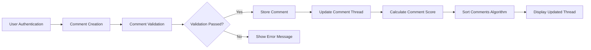

# Reddit-like Community Platform - Commenting System Requirements Specification

## Executive Summary

This document defines the complete business requirements for the commenting system in the Reddit-like community platform. The commenting infrastructure enables users to engage in threaded discussions through nested replies, voting mechanisms, and comprehensive moderation tools. The system supports real-time interactions while maintaining organized conversation hierarchies and enforcing community guidelines.

### Business Objectives
- Enable meaningful user discussions through structured comment threading
- Foster community engagement through interactive commenting features
- Maintain content quality through automated and manual moderation tools
- Provide intuitive user experience for following complex conversation threads
- Support scalable comment processing for high-traffic discussions

## System Architecture Overview

The commenting system operates as a hierarchical tree structure where each comment can have multiple nested replies, creating discussion threads. The system integrates with existing authentication, voting, and karma systems to provide a cohesive user experience.

### Core Components
- **Comment Creation Interface**: User-facing system for submitting comments and replies
- **Threading Engine**: Manages nested comment hierarchies and parent-child relationships
- **Voting Integration**: Processes upvotes/downvotes on comments and updates scores
- **Moderation System**: Handles content filtering, user reports, and moderator actions
- **Sorting Algorithm**: Determines comment display order based on various factors

## Comment Creation and Management Requirements

### Comment Submission Process
**WHEN** a user attempts to submit a comment, **THE** system **SHALL** validate the comment content against platform guidelines before acceptance.

**THE** comment submission interface **SHALL** provide real-time character count display showing the user how many characters remain within the 10,000 character limit.

**WHEN** a comment exceeds 10,000 characters, **THE** system **SHALL** prevent submission and display an error message indicating the character limit has been exceeded.

**THE** system **SHALL** require users to be authenticated before allowing comment submission on any post.

### Comment Editing and Deletion
**WHEN** a user edits their own comment within 15 minutes of submission, **THE** system **SHALL** not mark the comment as edited or show edit history to other users.

**IF** a user edits their comment after 15 minutes, **THEN THE** system **SHALL** display an "edited" indicator and maintain edit history for moderation purposes.

**WHEN** a user deletes their comment, **THE** system **SHALL** remove the comment content but preserve the comment structure in the thread to maintain conversation flow.

**WHERE** a comment has received replies, **THE** system **SHALL** display "[deleted]" in place of the comment content while keeping the replies visible.

### Comment Formatting and Content
**THE** system **SHALL** support basic Markdown formatting in comments including:
- Bold and italic text using asterisks
- Code blocks using backticks
- Links using standard Markdown syntax
- Blockquotes using greater-than symbols

**THE** system **SHALL** automatically convert URLs in comments into clickable links while maintaining security through link validation.

**WHEN** a comment contains multiple URLs, **THE** system **SHALL** count each URL as 23 characters regardless of actual length for character limit enforcement.

## Nested Reply System Specification

### Thread Hierarchy Management
**THE** system **SHALL** support unlimited nesting depth for comment replies, creating a hierarchical tree structure for discussions.

**WHEN** displaying nested comments, **THE** system **SHALL** use visual indentation to clearly indicate the reply hierarchy level.

**THE** system **SHALL** provide collapse/expand functionality for comment threads, allowing users to hide or show entire branches of discussion.

**WHERE** a comment thread exceeds 10 nested levels, **THE** system **SHALL** automatically collapse deeper levels with a "continue this thread" link for expansion.

### Parent-Child Relationship Management
**WHEN** a user replies to a comment, **THE** system **SHALL** establish and maintain the parent-child relationship in the database.

**THE** system **SHALL** track the entire comment ancestry for each comment, enabling efficient thread traversal and moderation.

**WHEN** a parent comment is deleted, **THE** system **SHALL** preserve all child comments in the thread structure unless specifically deleted by moderators.

### Quote and Mention Features
**THE** system **SHALL** support quoting previous comments by automatically formatting quoted text with blockquote styling.

**WHEN** a user types "u/" followed by a username, **THE** system **SHALL** provide auto-completion suggestions and create a user mention link upon submission.

**WHERE** a user is mentioned in a comment, **THE** system **SHALL** send a notification to the mentioned user if they have notifications enabled.

## Comment Voting and Sorting Algorithms

### Voting Mechanism Integration
**WHEN** a user upvotes or downvotes a comment, **THE** system **SHALL** immediately update the comment score display without requiring page refresh.

**THE** voting system **SHALL** integrate with the user karma system, where each vote on a user's comment affects their overall karma score.

**WHILE** a user is viewing comments, **THE** system **SHALL** visually indicate which comments the user has already voted on.

**IF** a user attempts to vote on their own comment, **THEN THE** system **SHALL** prevent the vote and display an appropriate error message.

### Comment Sorting Algorithms
**THE** system **SHALL** provide multiple sorting options for comments including:
- **Best**: Algorithm combining vote score and recency
- **Top**: Highest vote score first
- **New**: Most recent comments first
- **Old**: Oldest comments first
- **Controversial**: Comments with balanced upvotes/downvotes
- **Q&A**: Prioritizes questions and direct answers

**WHEN** sorting by "Best", **THE** system **SHALL** use a weighted algorithm that considers:
- Total vote score (upvotes minus downvotes)
- Comment age (newer comments receive temporary boost)
- Comment author reputation
- Discussion engagement metrics

### Score Calculation and Display
**THE** comment score **SHALL** be calculated as the difference between upvotes and downvotes, displayed as a single number.

**WHEN** a comment receives significant voting activity, **THE** system **SHALL** use vote fuzzing to prevent spam detection and manipulation.

**THE** system **SHALL** display vote scores using abbreviated format (e.g., 1.2k, 5.5m) for scores exceeding 1,000 to improve readability.

## Comment Moderation and Reporting

### Automated Content Filtering
**THE** system **SHALL** automatically flag comments containing banned words or phrases based on a maintained moderation dictionary.

**WHEN** a new user submits their first comment, **THE** system **SHALL** subject it to additional automated scrutiny including spam pattern detection.

**IF** a comment is automatically flagged, **THEN THE** system **SHALL** place it in a moderation queue for human review before public display.

### User Reporting System
**WHEN** a user reports a comment, **THE** system **SHALL** provide reporting categories including:
- Harassment or bullying
- Hate speech
- Spam or misleading content
- Vote manipulation
- Personal information sharing

**THE** system **SHALL** track reporting patterns to identify users who abuse the reporting system with false reports.

**WHERE** multiple users report the same comment, **THE** system **SHALL** prioritize it in the moderation queue based on report volume.

### Moderator Tools and Workflows
**WHEN** a moderator reviews a reported comment, **THE** system **SHALL** provide context including:
- The comment's position in the thread hierarchy
- User's posting history and reputation
- Previous moderation actions on the user
- Other comments in the same discussion

**THE** system **SHALL** enable moderators to take multiple actions on comments:
- Remove comment with notification to author
- Lock comment to prevent further replies
- Distinguish moderator comments with special styling
- Ban user from specific community
- Escalate to platform administrators

**WHEN** a moderator removes a comment, **THE** system **SHALL** preserve the comment content for administrative review while hiding it from public view.

## Discussion Thread Management

### Thread Lifecycle Management
**THE** system **SHALL** automatically archive discussion threads after 6 months of inactivity to optimize database performance.

**WHEN** a thread is archived, **THE** system **SHALL** prevent new comments but maintain read-only access to existing content.

**THE** system **SHALL** provide thread locking functionality for moderators to prevent further comments on specific discussions.

### User Engagement Features
**WHEN** a user participates in a comment thread, **THE** system **SHALL** provide subscription options to receive notifications for new replies.

**THE** system **SHALL** track user engagement metrics including:
- Comment frequency per user
- Average comment length
- Voting patterns within discussions
- Time spent engaging with comment threads

**WHERE** a user receives multiple replies to their comment, **THE** system **SHALL** provide a "view replies" interface showing all responses in context.

### Comment Search and Navigation
**THE** system **SHALL** provide search functionality within comment threads, allowing users to find specific comments by content or author.

**WHEN** searching within a thread, **THE** system **SHALL** highlight matching comments and provide quick navigation to their position in the hierarchy.

**THE** system **SHALL** support permalinks to individual comments, enabling direct sharing of specific comment positions within discussions.

## Performance and Scalability Requirements

### Comment Loading Performance
**THE** system **SHALL** load comment threads incrementally, displaying top-level comments first and loading nested replies on demand.

**WHEN** loading comments for a popular post, **THE** system **SHALL** respond within 2 seconds for the initial comment display.

**THE** system **SHALL** implement comment caching strategies to reduce database load for frequently accessed discussions.

### Scalability Considerations
**THE** comment system **SHALL** support concurrent comment submissions from 10,000+ users during high-traffic events.

**WHEN** processing real-time comment updates, **THE** system **SHALL** maintain sub-second response times for voting and reply actions.

**THE** system **SHALL** implement rate limiting to prevent comment spam, allowing authenticated users to submit a maximum of 60 comments per hour.

### Data Management Requirements
**THE** system **SHALL** maintain comment edit history for compliance and moderation purposes, storing previous versions for 30 days.

**WHEN** deleting user accounts, **THE** system **SHALL** anonymize comments rather than complete removal to preserve discussion integrity.

**THE** database design **SHALL** optimize for hierarchical comment queries, ensuring efficient retrieval of nested comment structures.

## Error Handling and User Experience

### Comment Submission Errors
**IF** a user loses internet connection while submitting a comment, **THEN THE** system **SHALL** automatically save the comment draft and attempt resubmission when connectivity is restored.

**WHEN** comment submission fails due to server error, **THE** system **SHALL** display a user-friendly error message and preserve the comment content for retry.

**THE** system **SHALL** validate comment content for potential security issues including SQL injection attempts and cross-site scripting vulnerabilities.

### User Recovery Scenarios
**WHEN** a user accidentally deletes a comment, **THE** system **SHALL** provide a 5-minute window for comment restoration from the deletion confirmation.

**IF** a comment fails to display properly due to formatting errors, **THEN THE** system **SHALL** fall back to plain text display with error logging for technical review.

**THE** system **SHALL** provide clear error messages for common user mistakes including duplicate comments and formatting syntax errors.

### Accessibility Requirements
**THE** comment interface **SHALL** comply with WCAG 2.1 AA accessibility standards, ensuring keyboard navigation and screen reader compatibility.

**WHEN** displaying nested comments, **THE** system **SHALL** provide ARIA labels to indicate comment hierarchy levels for accessibility tools.

**THE** comment voting buttons **SHALL** include proper labeling for screen readers, clearly indicating the current vote status and available actions.

---

This commenting system specification provides comprehensive business requirements for backend developers to implement a robust, scalable commenting infrastructure that supports the engaging discussion features essential to a Reddit-like community platform. The requirements focus on user experience, moderation capabilities, and performance while maintaining the hierarchical threading that enables meaningful conversations.