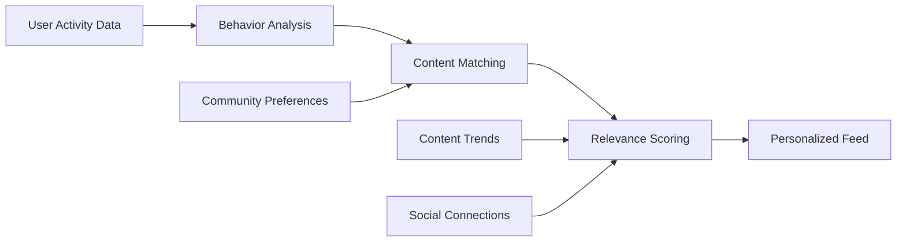
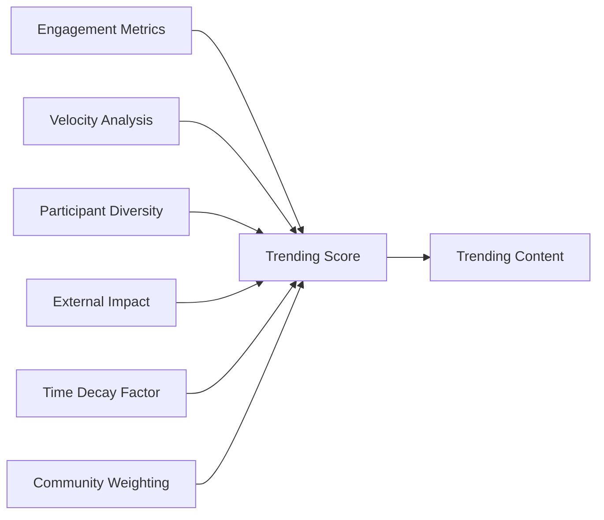

# Content Sorting and Discovery System Requirements Specification

## Executive Summary

This document defines the complete requirements for content sorting, discovery, and personalized feed generation systems in the Reddit-like community platform. The system must provide intelligent content organization that enables users to discover relevant communities, engage with trending content, and maintain personalized content streams based on their interests and behavior patterns.

## Sorting Algorithm Requirements

### Hot Sorting Algorithm

**WHEN** users select the "Hot" sorting option, THE system SHALL prioritize posts based on a combination of recency and engagement metrics.

**THE Hot sorting algorithm SHALL** calculate a hotness score using the following formula:
- Score = (log10(upvotes - downvotes) + (post_age_in_hours / 12)) * gravity_factor
- WHERE gravity_factor decreases over time to prioritize newer content
- THE system SHALL update hot scores every 15 minutes for real-time accuracy

**Post engagement factors SHALL include**:
- Upvote/downvote ratio and velocity
- Comment count and engagement velocity
- Click-through rates and time spent on post
- Share and save activity metrics

### New Sorting Algorithm

**WHEN** users select the "New" sorting option, THE system SHALL display posts in reverse chronological order based on creation timestamp.

**THE New sorting algorithm SHALL**:
- Order posts from most recent to oldest creation time
- Include pinned posts at the top when applicable
- Filter out posts marked as spam or removed by moderators
- Display posts from all communities unless filtered by user preferences

### Top Sorting Algorithm

**WHEN** users select the "Top" sorting option, THE system SHALL display posts with the highest net score (upvotes minus downvotes).

**THE Top sorting algorithm SHALL** provide time-based filtering options:
- Top of the hour (last 60 minutes)
- Today (last 24 hours)
- This week (last 7 days)
- This month (last 30 days)
- This year (last 365 days)
- All time (entire platform history)

**WHILE** calculating top posts, THE system SHALL apply vote weighting based on:
- Post age (older votes may have reduced weight)
- Voter karma and credibility
- Community-specific vote patterns

### Controversial Sorting Algorithm

**WHEN** users select the "Controversial" sorting option, THE system SHALL highlight posts with high engagement but divided opinions.

**THE Controversial sorting algorithm SHALL** calculate controversy score using:
- Controversy_score = (upvotes + downvotes) / |upvotes - downvotes|
- Higher scores indicate more evenly divided votes
- Minimum threshold of 50 total votes required for controversial classification

**THE system SHALL** prioritize posts that:
- Generate significant discussion in comments
- Have high vote volume with near-even split
- Spark debates and multiple viewpoint expression

## Personalized Feed Generation

### User Behavior Tracking

**THE system SHALL** track user behavior patterns to personalize content recommendations:
- Communities user subscribes to and actively participates in
- Post types and topics user frequently engages with (upvotes, comments)
- Time of day when user is most active
- Content formats preferred (text, images, links)

### Personalized Feed Algorithm

**WHEN** generating personalized feeds, THE system SHALL use a weighted scoring system:

**Feed personalization factors SHALL include**:
- **Community affinity**: 40% weight based on subscribed and engaged communities
- **Content preferences**: 30% weight based on post types and topics
- **Social influence**: 20% weight based on users with similar interests
- **Trend relevance**: 10% weight based on emerging platform trends

### Cold Start Handling

**IF** a new user has limited activity history, THEN THE system SHALL provide a default personalized feed based on:
- Popular communities in user's selected interests
- Trending content across the platform
- Geographic and demographic-based recommendations
- Gradually transition to behavior-based personalization as activity increases

## Content Discovery Mechanisms

### Community Recommendation System

**THE system SHALL** recommend communities to users based on:
- Similarities to communities user already subscribes to
- Popular communities among users with similar interests
- New and trending communities with rapid growth
- Communities discussing topics related to user's engaged content

**Community discovery features SHALL include**:
- "Communities you might like" section on homepage
- Category-based community browsing
- Search functionality with community autocomplete
- Community discovery based on posted content topics

### Trending Topics Detection

**THE system SHALL** identify and surface trending topics in real-time:
- Monitor keyword frequency and velocity across posts and comments
- Detect emerging discussions with rapid engagement growth
- Identify cross-community topics that gain traction
- Surface trending topics in dedicated discovery sections

**Trending detection algorithms SHALL consider**:
- Engagement velocity (comments, votes per hour)
- Participant diversity across communities
- Topic novelty and uniqueness
- Sustained interest over time periods

### Advanced Search and Filtering

**THE system SHALL** provide comprehensive search capabilities:
- Keyword search across post titles, content, and comments
- Advanced filters by community, content type, date range, and popularity
- Boolean operators for complex search queries
- Search result sorting by relevance, date, or popularity

**Search functionality SHALL support**:
- Autocomplete suggestions as user types
- Search within specific communities or across all content
- Saved searches and search history
- Related search suggestions based on query patterns

## Subscription Management System

### Subscription Workflows

**WHEN** a user subscribes to a community, THE system SHALL:
- Add the community to user's subscribed list
- Increase the community's subscriber count
- Include posts from that community in user's home feed
- Trigger personalized recommendations based on new subscription

**WHEN** a user unsubscribes from a community, THE system SHALL:
- Remove the community from user's subscribed list
- Decrease the community's subscriber count
- Exclude posts from that community from user's home feed
- Update personalized recommendations accordingly

### Feed Display Options

**THE system SHALL** provide multiple feed viewing options:
- **Home Feed**: Content from subscribed communities only
- **Popular Feed**: Trending content across all communities
- **All Feed**: Chronological view of all platform content
- **Custom Feeds**: User-created collections of specific communities

**Feed customization options SHALL include**:
- Ability to pin favorite communities for quick access
- Community grouping and categorization
- Feed refresh frequency controls
- Content density preferences (card vs. list view)

## Trending and Popular Content

### Real-time Popularity Tracking

**THE system SHALL** maintain real-time popularity metrics:
- Track engagement metrics (votes, comments, views) with minute-level precision
- Calculate trending scores with exponential decay for recency weighting
- Monitor cross-platform sharing and external referral traffic
- Update popularity rankings every 5 minutes for main feeds

**Popular content indicators SHALL include**:
- Rapid vote accumulation velocity
- High comment engagement and discussion depth
- External sharing and social media mentions
- Click-through rates and user retention metrics

### Trending Content Algorithms

**THE trending content system SHALL** use multi-factor analysis:

**Trending calculation factors SHALL include**:
- **Engagement velocity**: 35% weight for rapid interaction growth
- **Participant diversity**: 25% weight for broad user participation
- **Content quality**: 20% weight based on upvote ratios and comment depth
- **External impact**: 15% weight for social sharing and referrals
- **Novelty factor**: 5% weight for unique or innovative content

### Controversial Content Highlighting

**THE system SHALL** identify and appropriately surface controversial content:
- Use controversy detection algorithms to flag divisive discussions
- Provide balanced viewpoint representation in controversial threads
- Implement content warnings for highly polarized topics
- Ensure controversial content doesn't dominate personalized feeds

## Performance and Scalability Requirements

### Response Time Expectations

**THE content sorting system SHALL** meet the following performance standards:
- Feed generation and sorting: under 200ms response time for 95% of requests
- Search functionality: under 300ms response time for complex queries
- Personalized recommendations: under 150ms for returning users
- Trending calculations: real-time updates within 5-minute intervals

### Scalability Considerations

**THE system SHALL** be designed to handle platform growth:
- Support 1 million+ daily active users with consistent performance
- Handle 10,000+ concurrent feed generation requests
- Process 100,000+ new posts and comments daily
- Scale sorting algorithms across distributed computing infrastructure

**Scalability strategies SHALL include**:
- Caching layers for frequently accessed content and user preferences
- Database sharding by user geography and community distribution
- Asynchronous processing for complex sorting calculations
- CDN integration for media content delivery

### Data Management Requirements

**THE system SHALL** implement efficient data management:
- Maintain 30-day rolling window for real-time engagement metrics
- Archive historical data for long-term trend analysis
- Implement data compression for high-volume interaction tracking
- Ensure data consistency across distributed sorting algorithms

## Content Quality and Relevance Assurance

### Relevance Scoring System

**THE system SHALL** implement content relevance scoring:
- Calculate content quality scores based on user engagement patterns
- Identify and demote low-quality or spam content in feeds
- Promote high-quality discussions with depth and substance
- Balance relevance with diversity to prevent filter bubbles

### Diversity and Serendipity

**WHILE** providing personalized content, THE system SHALL ensure:
- 15% of feed content comes from outside user's immediate interests
- Regular introduction of new communities and topics
- Balanced representation of different viewpoints in controversial topics
- Prevention of echo chamber effects through diverse content exposure

### Content Freshness Management

**THE system SHALL** maintain appropriate content freshness:
- Balance recent content with evergreen high-quality discussions
- Implement time-based decay for older content in feeds
- Highlight resurfaced discussions with new engagement
- Manage content lifecycle from creation to archival

> *Developer Note: This document defines **business requirements only**. All technical implementations (architecture, APIs, database design, etc.) are at the discretion of the development team.*