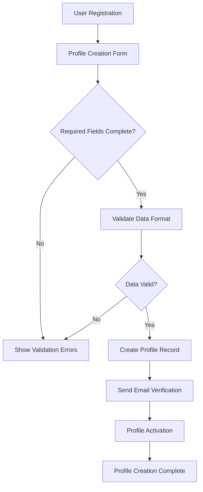

# User Profiles and Engagement System Requirements Specification

## Executive Summary

This document defines the complete user profile management, activity tracking, personalization features, and engagement metrics for the Reddit-like community platform. The user profile system serves as the central hub for user identity, activity history, and personalization preferences, enabling users to track their community impact, manage their online presence, and customize their platform experience.

### Business Objectives
- Enhance user retention through personalized experiences
- Build user identity and community reputation
- Provide transparent activity tracking and engagement metrics
- Support gamification through achievements and recognition
- Enable users to manage their platform interactions effectively

## User Profile Management System

### Profile Information Architecture

**WHEN** a user registers for the platform, **THE** system **SHALL** create a comprehensive user profile with the following core data structure:

**Basic Profile Information Requirements:**
- **WHEN** creating a user profile, **THE** system **SHALL** require:
  - Unique username (3-20 characters, alphanumeric and underscores only)
  - Valid email address for verification and communication
  - Secure password meeting platform security standards
- **THE** system **SHALL** allow users to optionally provide:
  - Display name (different from username, 2-50 characters)
  - Profile picture (JPEG/PNG format, max 5MB)
  - Bio/description (0-500 characters)
  - Social media links (validated URL format)

**Profile Creation Workflow:**

**Account Metadata Management:**
- **WHEN** a user profile is created, **THE** system **SHALL** record:
  - Account creation timestamp with timezone
  - Email verification status (pending/verified)
  - Account status (active/suspended/deleted)
  - Last login timestamp and IP address
  - Profile completion percentage

### Privacy and Settings Management

**Privacy Configuration Requirements:**
- **WHEN** a user accesses privacy settings, **THE** system **SHALL** provide options for:
  - Profile visibility (public/private/friends only)
  - Activity feed visibility controls
  - Search engine indexing preferences
  - Data sharing preferences with third parties

**Privacy Enforcement Rules:**
- **IF** a user sets their profile to private, **THEN THE** system **SHALL** restrict visibility of:
  - Voting history and patterns
  - Saved posts and comments
  - Specific community memberships
  - Detailed activity timestamps
- **WHEN** a user blocks another user, **THE** system **SHALL**:
  - Prevent the blocked user from viewing the blocker's profile
  - Hide the blocker's content from the blocked user's feeds
  - Restrict all communication between the users

### Profile Customization Features

**Visual Customization Options:**
- **THE** system **SHALL** allow users to customize:
  - Profile banner/header image (recommended 1200x300 pixels)
  - Theme preference (light/dark/auto)
  - Accent color selection from predefined palette
  - Layout density preferences (compact/comfortable)

**Content Display Preferences:**
- **WHEN** users browse content, **THE** system **SHALL** remember:
  - Default post sorting preference (hot/new/top/controversial)
  - Preferred content types (text/link/image)
  - Community display order and prioritization
  - Content filtering preferences (NSFW tags, spoiler warnings)

## User Activity Tracking and History

### Comprehensive Activity Monitoring

**Activity Tracking Scope:**
- **THE** system **SHALL** track and record the following user activities:
  - Post creation, editing, and deletion with timestamps
  - Comment submissions, replies, and modifications
  - Voting actions (upvotes/downvotes) on posts and comments
  - Community subscriptions and unsubscriptions
  - Content saving and bookmarking actions
  - Award giving and receiving transactions
  - Profile views and follower interactions

**Activity Recording Requirements:**
- **WHEN** a user performs any platform action, **THE** system **SHALL**:
  - Record the action type with precise timestamp
  - Associate the action with relevant content or community
  - Track the action context (device type, location if permitted)
  - Update user engagement metrics in real-time

### Activity Timeline Management

**Activity Display and Organization:**
- **WHEN** a user views their activity history, **THE** system **SHALL** provide:
  - Chronological timeline of all activities with pagination
  - Filtering options by activity type, community, and date range
  - Grouping of related activities (multiple comments on same post)
  - Search functionality within activity history
  - Export capability for personal data archive

**Activity Privacy Controls:**
- **THE** system **SHALL** allow users to:
  - Delete specific activities from their history
  - Bulk manage activity visibility settings
  - Set retention periods for different activity types
  - Control which activities are visible to other users

### Content Creation and Interaction Analytics

**Post Performance Analytics:**
- **WHEN** a user creates content, **THE** system **SHALL** track:
  - Total views, unique viewers, and engagement rates
  - Vote distribution (upvotes vs downvotes) over time
  - Comment volume and discussion depth metrics
  - Sharing frequency and external referral sources
  - Time-based performance trends (hourly/daily/weekly)

**Interaction Quality Metrics:**
- **THE** system **SHALL** calculate and display:
  - Average votes per post across all user content
  - Comment engagement rates (replies per comment)
  - Content success rate (high-performing vs low-performing)
  - Community-specific performance benchmarks
  - Improvement trends over time periods

## Personalization and User Experience

### Behavior-Based Personalization

**User Preference Learning:**
- **WHEN** users interact with content, **THE** system **SHALL** analyze:
  - Content topics and categories frequently engaged with
  - Community preferences based on subscription and activity patterns
  - Time-of-day engagement patterns for optimal content delivery
  - Content format preferences (text density, media types)
  - Interaction styles (commenter vs voter vs creator)

**Personalization Algorithm Requirements:**
- **THE** system **SHALL** implement machine learning to:
  - Predict user interests based on historical behavior
  - Recommend relevant communities and content
  - Personalize feed ordering and content prioritization
  - Adapt interface elements based on usage patterns
  - Provide contextual help and feature discovery

### Customization and Control Features

**Feed Management Capabilities:**
- **WHEN** users customize their experience, **THE** system **SHALL** provide:
  - Custom feed creation with specific community combinations
  - Feed scheduling for different times of day or contexts
  - Content density controls (number of posts per page)
  - Media auto-play preferences and bandwidth considerations
  - Notification frequency and delivery channel settings

**Accessibility and Interface Options:**
- **THE** system **SHALL** support comprehensive accessibility features:
  - Screen reader compatibility with proper ARIA labels
  - Keyboard navigation support for all interface elements
  - High contrast mode and font size adjustments
  - Reduced motion preferences for animations
  - Language localization and regional formatting

### Notification System Integration

**Smart Notification Management:**
- **WHEN** generating notifications, **THE** system **SHALL** consider:
  - User notification preferences and quiet hours
  - Notification relevance based on user interests
  - Frequency capping to prevent notification fatigue
  - Priority ranking for different notification types
  - Cross-device synchronization and dismissal

**Notification Customization Options:**
- **THE** system **SHALL** allow users to configure:
  - Notification types (replies, votes, mentions, awards)
  - Delivery channels (push, email, in-app)
  - Aggregation preferences (digest vs individual)
  - Community-specific notification settings
  - Emergency notification overrides for critical updates

## Achievement and Badge System

### Achievement Classification Framework

**Achievement Category Structure:**
- **THE** system **SHALL** organize achievements into these categories:
  - **Content Creation**: Posting milestones, popular content creation
  - **Community Engagement**: Active participation, helpful contributions
  - **Platform Mastery**: Feature usage, longevity, verification
  - **Social Influence**: Follower milestones, content reach
  - **Special Events**: Seasonal challenges, community events

**Achievement Progression System:**
- **WHEN** designing achievements, **THE** system **SHALL** implement:
  - Tiered achievement levels (bronze, silver, gold, platinum)
  - Progressive milestone tracking with visual indicators
  - Achievement rarity indicators based on user population
  - Time-based achievement expiration for seasonal events
  - Achievement series with connected accomplishment paths

### Badge Display and Recognition

**Badge Presentation Requirements:**
- **WHEN** a user earns an achievement, **THE** system **SHALL**:
  - Display the badge prominently on user profiles
  - Provide achievement notification with celebration elements
  - Show progress toward next-tier achievements
  - Allow optional sharing of achievements to communities
  - Maintain achievement history with earning dates

**Badge Integration Points:**
- **THE** system **SHALL** display badges in these contexts:
  - User profile header and achievement showcase
  - Comment and post author identification
  - Community leaderboards and recognition systems
  - Search results and user discovery features
  - Moderation interface for trusted user identification

### Reward System Implementation

**Achievement Reward Mechanics:**
- **WHEN** users reach significant milestones, **THE** system **SHALL** provide:
  - Special profile customization options (exclusive themes)
  - Enhanced platform capabilities (early feature access)
  - Virtual currency or award distribution
  - Recognition in community newsletters or features
  - Invitations to beta testing or feedback programs

**Gamification Balance Requirements:**
- **THE** system **SHALL** ensure achievement design promotes:
  - Healthy engagement patterns rather than addictive behavior
  - Quality content creation over quantity metrics
  - Community building rather than individual competition
  - Long-term platform loyalty through meaningful milestones
  - Inclusive achievement criteria accessible to diverse users

## User Statistics and Analytics

### Comprehensive Performance Metrics

**Core User Statistics Calculation:**
- **THE** system **SHALL** calculate and display real-time metrics including:
  - Total karma score with breakdown (post karma vs comment karma)
  - Post and comment creation statistics with success rates
  - Voting patterns (upvotes given vs received ratio)
  - Community engagement distribution across subscribed communities
  - Activity streaks and consistency metrics

**Advanced Analytics Features:**
- **WHEN** providing user insights, **THE** system **SHALL** include:
  - Week-over-week and month-over-month performance comparisons
  - Benchmarking against community averages and top performers
  - Content performance analysis with improvement recommendations
  - Engagement pattern identification and optimization suggestions
  - Growth trajectory projections based on current activity

### Activity Pattern Analysis

**Behavioral Analytics Requirements:**
- **THE** system **SHALL** analyze and present:
  - Most active times of day and engagement patterns
  - Content type preferences and performance correlations
  - Community interaction styles and effectiveness metrics
  - Response time analysis for discussions and replies
  - Content discovery patterns and source effectiveness

**Performance Optimization Insights:**
- **WHEN** identifying improvement opportunities, **THE** system **SHALL** provide:
  - Content timing recommendations based on audience activity
  - Topic suggestion based on successful previous content
  - Format optimization advice for different content types
  - Community selection guidance based on interest alignment
  - Engagement strategy recommendations for different goals

### Community Impact Measurement

**Influence and Contribution Metrics:**
- **THE** system **SHALL** track and display community impact through:
  - Community-specific karma and reputation scores
  - Moderator recognition and trusted user status
  - Content quality indicators and user expertise areas
  - Followership growth and engagement metrics
  - Cross-community influence and content reach

**Leadership and Recognition Systems:**
- **WHEN** recognizing user contributions, **THE** system **SHALL** implement:
  - Automated community leader identification based on impact
  - Peer recognition systems for valuable contributions
  - Moderation effectiveness metrics for community moderators
  - Content quality scoring with community validation
  - Expert user designation in specific topic areas

## Integration with Other Systems

### Authentication System Integration

**Profile-Security Integration Requirements:**
- **WHEN** integrating with authentication, **THE** system **SHALL** ensure:
  - Secure profile data storage with encryption at rest
  - Session management alignment with profile activity tracking
  - Role-based permission enforcement across profile features
  - Multi-factor authentication support for sensitive operations
  - Account recovery procedures with profile verification

### Karma System Integration

**Reputation-Profile Integration:**
- **THE** system **SHALL** integrate karma metrics by:
  - Displaying real-time karma updates on user profiles
  - Using karma scores for achievement unlocking criteria
  - Incorporating karma into content recommendation algorithms
  - Applying karma-based permissions to profile features
  - Tracking karma growth trends for user development insights

### Content System Integration

**Profile-Content Relationship Management:**
- **WHEN** users interact with content, **THE** system **SHALL**:
  - Update profile statistics based on content engagement
  - Maintain accurate content ownership and attribution
  - Sync content moderation actions with user reputation
  - Track content performance across user profile analytics
  - Ensure content deletion properly updates profile metrics

### Community System Integration

**Community-Profile Synchronization:**
- **THE** system **SHALL** maintain community integration through:
  - Accurate community membership tracking on profiles
  - Moderator role synchronization across platform features
  - Community-specific achievement and recognition systems
  - Cross-community activity aggregation for overall metrics
  - Community guideline enforcement through profile permissions

## Error Handling and User Experience

### Profile Management Error Scenarios

**Data Validation and Error Recovery:**
- **IF** profile data validation fails during updates, **THEN THE** system **SHALL**:
  - Provide specific error messages indicating which fields failed validation
  - Preserve entered data to prevent loss during correction
  - Offer suggestions for resolving common validation issues
  - Maintain data integrity with transaction rollback capabilities

**Connection and Synchronization Issues:**
- **WHEN** network connectivity affects profile operations, **THE** system **SHALL**:
  - Implement offline capability for profile viewing
  - Queue profile updates for synchronization when connection resumes
  - Provide clear status indicators for pending operations
  - Maintain data consistency across distributed systems

### User Experience Requirements

**Profile Interface Performance:**
- **THE** system **SHALL** ensure profile pages load within 2 seconds under normal conditions
- **WHEN** displaying complex activity histories, **THE** system **SHALL** implement progressive loading
- **WHERE** large media assets are involved, **THE** system **SHALL** use lazy loading techniques
- **THE** interface **SHALL** remain responsive during data updates and background processing

**Accessibility and Usability Standards:**
- **THE** profile system **SHALL** comply with WCAG 2.1 AA accessibility standards
- **WHEN** implementing new profile features, **THE** system **SHALL** conduct usability testing
- **THE** interface **SHALL** provide keyboard navigation for all profile management functions
- **WHERE** complex data is presented, **THE** system **SHALL** include data visualization options

## Success Metrics and Monitoring

### User Engagement KPIs

**Profile System Performance Indicators:**
- **THE** system **SHALL** track and report on these key metrics:
  - Profile completion rates across user segments
  - Average time spent customizing profiles and settings
  - Achievement collection rates and milestone progression
  - Notification engagement and customization adoption
  - Profile feature usage patterns and discovery rates

**Business Impact Measurements:**
- **THE** platform **SHALL** correlate profile usage with:
  - User retention rates and long-term engagement
  - Content creation quality and frequency
  - Community participation and moderation effectiveness
  - Platform loyalty and user satisfaction scores
  - Revenue conversion rates for premium features

### System Performance Monitoring

**Technical Performance Metrics:**
- **THE** operations team **SHALL** monitor:
  - Profile page load times and response latency
  - Database query performance for activity tracking
  - Cache effectiveness for frequently accessed profile data
  - API response times for profile management operations
  - Error rates and system availability metrics

**Scalability and Growth Planning:**
- **WHEN** planning capacity, **THE** system **SHALL** consider:
  - User base growth projections and profile storage requirements
  - Activity tracking volume and processing capacity needs
  - Analytics computation resources for large user populations
  - Integration point performance under scale conditions

> *Developer Note: This document defines **business requirements only**. All technical implementations (architecture, APIs, database design, etc.) are at the discretion of the development team.*