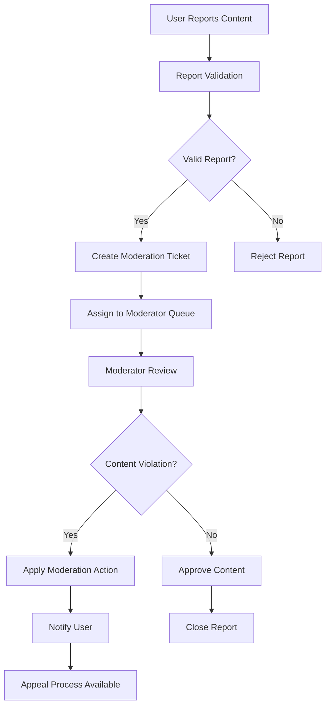

# Content Moderation and Reporting System Requirements

## Executive Summary

The content moderation and reporting system provides comprehensive mechanisms for maintaining platform integrity, enforcing community guidelines, and ensuring a safe environment for all users. This system supports user-driven reporting, automated detection, manual moderation workflows, and transparent appeal processes that balance community autonomy with platform-wide standards.

## System Architecture Overview

## Content Reporting System Requirements

### User Reporting Interface

**WHEN** a user identifies inappropriate content, **THE** system **SHALL** provide reporting options with the following capabilities:

**WHEN** reporting a post or comment, **THE** system **SHALL** present a modal interface with:
- Report reason selection (harassment, spam, rule violation, etc.)
- Additional context text field for user explanation
- Preview of the reported content
- Optional evidence upload (screenshots, links)
- Anonymous reporting option for sensitive cases

**WHERE** the reporting user is the content author, **THE** system **SHALL** provide self-reporting options for content removal requests.

### Reporting Workflow

**WHEN** a report is submitted, **THE** system **SHALL**:
1. Log the report with timestamp, reporter information, and content reference
2. Assign initial priority based on report type and severity
3. Notify appropriate moderators based on community assignment
4. Create moderation ticket in the moderation queue

**IF** multiple users report the same content, **THEN THE** system **SHALL** aggregate reports and increase priority level.

**WHILE** a report is pending review, **THE** system **SHALL** track the following metrics:
- Time since report submission
- Number of similar reports
- Content engagement metrics
- User history of the content author

## Moderation Workflows

### Moderator Dashboard Requirements

**THE** moderation dashboard **SHALL** provide moderators with:
- Prioritized queue of reported content
- Quick action buttons (approve, remove, escalate, ignore)
- Content preview with full context
- User history and previous moderation actions
- Community-specific guidelines reference
- Bulk moderation capabilities for similar content

### Moderation Decision Process

**WHEN** a moderator reviews reported content, **THE** system **SHALL** require:
1. **Content Evaluation**: Review of the actual content and context
2. **Guideline Assessment**: Comparison against community and platform rules
3. **User History Check**: Review of content author's previous violations
4. **Action Selection**: Choose appropriate moderation action
5. **Reason Documentation**: Record detailed reason for the decision

**Moderation Action Options**:
- **Approve**: Content remains visible, report marked as resolved
- **Remove**: Content hidden from public view with removal reason
- **Warning**: Content remains visible with warning to author
- **Temporary Ban**: User restricted from posting for specified duration
- **Permanent Ban**: User account suspended from the community
- **Escalate**: Send to higher-level moderators or administrators

### Escalation Procedures

**IF** a moderator receives content that violates platform-wide rules, **THEN THE** system **SHALL** provide escalation to platform administrators.

**WHERE** content involves legal or safety concerns, **THE** system **SHALL** implement immediate escalation protocols with highest priority.

## Automated Content Filtering

### Rule-Based Filtering System

**THE** system **SHALL** implement automated filtering for:
- **Spam Detection**: Pattern matching for spam content and links
- **Banned Words**: Keyword filtering for prohibited content
- **Duplicate Content**: Detection of repeated or copied content
- **Rate Limiting**: Prevention of content flooding from single users

**WHEN** automated filtering identifies potential violations, **THE** system **SHALL**:
- Flag content for moderator review
- Apply temporary visibility restrictions if high confidence
- Log filtering decisions for transparency
- Provide appeal mechanisms for false positives

### Machine Learning Detection

**WHERE** machine learning models are implemented, **THE** system **SHALL**:
- Continuously train on moderator decisions
- Provide confidence scores for automated actions
- Maintain human oversight for all automated removals
- Regularly audit model performance and bias

**IF** ML models achieve high confidence scores, **THEN THE** system **SHALL** allow automated actions with mandatory post-review.

## Community Guidelines Enforcement

### Guideline Hierarchy

**THE** system **SHALL** maintain a hierarchical guideline structure:
1. **Platform-Wide Rules**: Universal content policies
2. **Community-Specific Guidelines**: Rules defined by community moderators
3. **Content-Type Restrictions**: Limitations based on content format

**WHEN** community guidelines conflict with platform rules, **THEN THE** system **SHALL** enforce the stricter standard.

### Transparency and Documentation

**THE** system **SHALL** provide public documentation of:
- All platform-wide rules and guidelines
- Moderation statistics for each community
- Appeal success rates and common reasons
- Guideline update history and change logs

**WHERE** content is removed, **THE** system **SHALL** display removal reasons to users when appropriate.

## Appeal and Review Process

### User Appeal System

**WHEN** a user receives moderation action, **THE** system **SHALL** provide appeal options:
- **Appeal Form**: Structured form for explaining appeal reasons
- **Evidence Upload**: Capability to provide additional context
- **Status Tracking**: Real-time tracking of appeal progress
- **Communication Channel**: Direct messaging with moderators

### Appeal Review Workflow

**WHEN** an appeal is submitted, **THE** system **SHALL**:
1. Notify original moderators of the appeal
2. Escalate to senior moderators if unresolved
3. Provide full context of original moderation decision
4. Track response time and resolution metrics

**IF** an appeal is successful, **THEN THE** system **SHALL**:
- Restore content with appropriate visibility
- Remove moderation strikes from user record
- Document the appeal resolution for future reference
- Notify all involved parties of the outcome

### Moderator Review System

**THE** system **SHALL** implement moderator performance monitoring:
- Decision consistency metrics
- Appeal success rates by moderator
- Response time tracking
- User satisfaction with moderation

**WHERE** moderator performance falls below standards, **THE** system **SHALL** provide training and review processes.

## Integration Requirements

### User Profile Integration

**THE** moderation system **SHALL** integrate with user profiles to provide:
- Moderation history visible to moderators
- Strike system and violation tracking
- Ban status and duration information
- Appeal history and success rates

### Community Management Integration

**WHEN** moderators take action, **THE** system **SHALL** update community statistics:
- Moderation action counts
- Content removal rates
- User satisfaction metrics
- Guideline enforcement effectiveness

### Notification System Integration

**THE** system **SHALL** provide comprehensive notifications for:
- Report submission confirmations
- Moderation decision notifications
- Appeal status updates
- Guideline change announcements

## Performance and Scalability Requirements

### Response Time Requirements

**THE** moderation system **SHALL** meet the following performance standards:
- High-priority reports reviewed within 1 hour
- Standard reports reviewed within 24 hours
- Appeal responses provided within 48 hours
- Bulk moderation actions processed within 5 minutes

### Scalability Considerations

**THE** system **SHALL** scale to support:
- 10,000+ concurrent moderation actions
- 100,000+ daily reports
- Real-time moderation queue updates
- Historical data retention for 2+ years

## Error Handling and Edge Cases

### Error Scenarios

**IF** the moderation system experiences technical failures, **THEN THE** system **SHALL**:
- Maintain data integrity for all moderation actions
- Provide fallback moderation workflows
- Notify administrators of system issues
- Preserve user ability to report content

### Edge Case Handling

**WHERE** edge cases occur in moderation, **THE** system **SHALL** provide:
- Manual override capabilities for administrators
- Emergency shutdown procedures for harmful content
- Legal compliance reporting mechanisms
- Cross-community moderation coordination

## Success Metrics and Monitoring

### Key Performance Indicators

**THE** system **SHALL** track the following KPIs:
- Average moderation response time
- Report resolution rate
- User satisfaction with moderation
- False positive/negative rates
- Appeal success rates

### Monitoring and Analytics

**THE** system **SHALL** provide real-time monitoring of:
- Moderation queue size and distribution
- Moderator activity and performance
- Trend analysis of reported content types
- Geographic and demographic moderation patterns

## Business Rules and Validation

### Content Validation Rules

**WHEN** content is submitted, **THE** system **SHALL** validate against:
- Character limits and formatting requirements
- Media file size and type restrictions
- Link safety and domain reputation
- User posting frequency limits

### Moderation Decision Validation

**WHEN** moderators take action, **THE** system **SHALL** enforce:
- Reason requirement for all removals
- Escalation thresholds for severe violations
- Cooldown periods between similar actions
- Maximum ban durations based on violation severity

This comprehensive moderation and reporting system ensures platform integrity while maintaining user trust through transparent processes and effective content governance.

> *Developer Note: This document defines **business requirements only**. All technical implementations (architecture, APIs, database design, etc.) are at the discretion of the development team.*