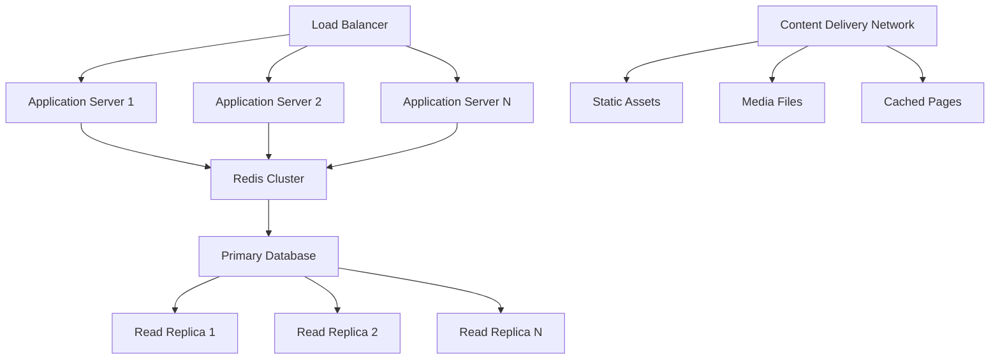
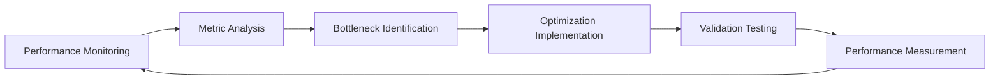

# Reddit-style Community Platform - System Performance and Scaling Requirements

## Executive Summary

This document defines comprehensive performance requirements, scalability strategies, and system architecture constraints for the Reddit-like community platform. The platform must deliver responsive user experiences under varying load conditions while supporting exponential growth through robust scaling mechanisms and performance optimization techniques.

### Performance Objectives
- **User Experience**: Sub-second response times for core interactions
- **Scalability**: Support for 100,000+ registered users with linear performance scaling
- **Reliability**: 99.9% uptime with comprehensive monitoring and alerting
- **Growth Management**: Automatic scaling triggers based on predefined performance metrics

## Performance Requirements

### User Interaction Response Time Targets

**WHEN** users authenticate, **THE** system **SHALL** process login requests within 500 milliseconds for 95% of authentication attempts.

**WHILE** users browse content, **THE** system **SHALL** load community pages within 2 seconds under normal operating conditions, with progressive loading for content-heavy pages.

**WHERE** users vote on content, **THE** system **SHALL** register votes and update scores within 200 milliseconds, providing immediate visual feedback to maintain engagement fluidity.

**IF** users submit comments during peak activity periods, **THEN THE** system **SHALL** maintain comment processing times under 500 milliseconds regardless of concurrent user load.

### Content Processing Throughput Requirements

**THE** platform **SHALL** support the following content processing capacities:
- **Post Creation**: 100 new posts per minute during peak traffic periods
- **Voting Activity**: 1,000 simultaneous votes per minute with real-time score updates
- **Comment Submission**: 500 new comments per minute with nested reply processing
- **Media Uploads**: 50 concurrent image uploads per minute with automatic optimization

**WHEN** system load exceeds these thresholds, **THE** system **SHALL** implement graceful degradation rather than complete service failure.

### API Performance and Rate Limiting

**WHEN** authenticated users make API requests, **THE** system **SHALL** limit them to 1,000 requests per hour with dynamic rate adjustment based on user karma and reputation.

**WHERE** guest users access public content, **THE** system **SHALL** enforce a 100-request-per-hour limit to prevent abuse while maintaining accessibility.

**IF** API rate limits are exceeded, **THEN THE** system **SHALL** return appropriate HTTP status codes (429 Too Many Requests) with clear retry-after headers.

## Scalability Architecture and Strategy

### Horizontal Scaling Implementation

**THE** application architecture **SHALL** support horizontal scaling across multiple application servers with stateless session management.

**WHEN** concurrent users exceed 5,000, **THE** system **SHALL** automatically provision additional application servers with load-balanced distribution.

**WHERE** database query latency exceeds 200 milliseconds, **THE** system **SHALL** activate read replicas to distribute read operations.

### Database Scaling Strategy

**THE** primary database **SHALL** implement sharding by user geographic distribution and community membership patterns.

**WHEN** storage requirements exceed 1 terabyte, **THE** system **SHALL** implement partitioned storage with automated data migration.

**WHERE** complex queries impact performance, **THE** database **SHALL** maintain optimized indexes on:
- Post titles and content for search operations
- User usernames and profile attributes for user lookup
- Community names and metadata for discovery features
- Timestamp fields for chronological sorting

### Multi-Layer Caching Implementation

**THE** caching system **SHALL** implement three distinct caching layers:

**Application-Level Caching:**
- **WHEN** content rankings are calculated, **THE** system **SHALL** cache trending algorithms for 5 minutes with real-time invalidation on significant vote changes.
- **WHERE** user preferences are loaded, **THE** system **SHALL** cache personalized settings for 15 minutes with session-based refresh.

**Distributed Caching (Redis):**
- **THE** Redis cluster **SHALL** store user sessions with 30-minute TTL and automatic renewal on activity.
- **WHEN** frequently accessed content is requested, **THE** system **SHALL** cache full post objects with 2-minute expiration.

**Content Delivery Network (CDN):**
- **ALL** static assets including images, CSS, and JavaScript **SHALL** be served through global CDN distribution.
- **WHERE** media content is uploaded, **THE** system **SHALL** generate multiple resolutions for optimal delivery.

## Data Management and Storage Performance

### Database Performance Optimization

**THE** database system **SHALL** maintain query response times under 100 milliseconds for 95% of operational queries.

**WHEN** complex analytical queries are executed, **THE** system **SHALL** utilize dedicated reporting databases to prevent performance impact on operational systems.

**WHERE** full-text search operations are performed, **THE** system **SHALL** implement specialized search indexes with stemming and synonym support.

### File Storage and Media Processing

**WHEN** users upload images, **THE** system **SHALL** automatically compress files while maintaining visual quality, targeting 70% reduction in file size.

**IF** video content is supported in future versions, **THEN THE** system **SHALL** implement adaptive bitrate streaming with multiple quality levels.

**THE** media storage system **SHALL** implement lifecycle policies that automatically archive infrequently accessed content after 6 months of inactivity.

### Data Retention and Archiving Policies

**ACTIVE** content with recent engagement **SHALL** be maintained in high-performance storage with immediate access.

**WHEN** content receives no interactions for 2 years, **THE** system **SHALL** automatically migrate it to cost-effective archival storage.

**WHERE** users delete their accounts, **THE** system **SHALL** anonymize personal data within 30 days while preserving community content integrity.

## Infrastructure and Architecture Constraints

### Cloud-Native Deployment Requirements

**THE** platform **SHALL** be deployable on major cloud platforms (AWS, Google Cloud, Azure) with infrastructure-as-code implementation.

**WHEN** auto-scaling is required, **THE** system **SHALL** utilize cloud-native scaling solutions with predictive scaling based on usage patterns.

**WHERE** global user distribution exists, **THE** infrastructure **SHALL** support multi-region deployment with content replication and latency optimization.

### Security and Compliance Architecture

**ALL** user data **SHALL** be encrypted both at rest using AES-256 encryption and in transit using TLS 1.3 protocols.

**WHEN** GDPR compliance is required, **THE** system **SHALL** support data export functionality and automated data deletion workflows.

**THE** platform **SHALL** implement comprehensive DDoS protection with rate limiting at network edge and application layers.

### API Design and Versioning Constraints

**ALL** API endpoints **SHALL** follow RESTful design principles with consistent error handling and response formats.

**WHEN** API version updates are released, **THE** system **SHALL** maintain backward compatibility for at least 6 months with clear deprecation timelines.

**WHERE** real-time features are implemented, **THE** system **SHALL** support WebSocket connections with fallback to long-polling for compatibility.

## Comprehensive Monitoring and Analytics

### Real-Time Performance Monitoring

**THE** monitoring system **SHALL** track and alert on the following key performance indicators:

**Application Performance Metrics:**
- Average response time per service endpoint
- 95th percentile response times for user-facing operations
- Error rates and types with contextual debugging information
- Concurrent user counts and session duration patterns

**Infrastructure Health Metrics:**
- CPU utilization across all application and database servers
- Memory usage patterns and garbage collection efficiency
- Disk I/O performance and storage capacity forecasting
- Network latency and bandwidth consumption

### Capacity Planning and Forecasting

**THE** system **SHALL** generate weekly capacity reports that include:
- Resource utilization trends across all system components
- User growth projections based on historical patterns
- Storage capacity forecasts with 30-day, 90-day, and 180-day outlooks
- Performance degradation risk analysis based on current growth rates

**WHEN** resource utilization exceeds 70% capacity, **THE** system **SHALL** trigger automated capacity planning reviews with recommended scaling actions.

### Automated Scaling Triggers and Procedures

**THE** platform **SHALL** implement the following automated scaling triggers:

**Application Layer Scaling:**
- **WHEN** CPU utilization exceeds 75% for 5 consecutive minutes, **THEN** add one application server
- **WHERE** memory usage exceeds 80% capacity, **THEN** scale horizontally and investigate memory leaks
- **IF** response times exceed 2-second threshold, **THEN** trigger immediate performance review

**Database Scaling Triggers:**
- **WHEN** database connection pool reaches 90% capacity, **THEN** add read replicas
- **WHERE** query latency exceeds 200ms consistently, **THEN** optimize indexes and query patterns
- **IF** storage growth exceeds 10% per week, **THEN** implement additional storage partitioning

## Disaster Recovery and Business Continuity

### Comprehensive Backup Strategy

**THE** system **SHALL** implement a multi-tier backup strategy:

**Daily Operations:**
- Full database backups performed nightly during low-traffic periods
- Incremental backups every 4 hours during active operation hours
- Configuration and code repository backups with version tracking

**Disaster Recovery Preparedness:**
- Geographically distributed backups with at least 3 copies in different regions
- Regular recovery testing with documented recovery time objectives (RTO)
- Business impact analysis for various failure scenarios

### Recovery Time Objectives (RTO) and Procedures

**WHEN** partial system failure occurs, **THE** recovery procedures **SHALL** achieve:
- Database restoration within 2 hours for corrupted data scenarios
- Application service restoration within 30 minutes for single-service failures
- Complete system recovery within 4 hours for catastrophic failures

**WHERE** data loss occurs, **THE** system **SHALL** support point-in-time recovery to within 15 minutes of the failure event.

## Performance Validation and Load Testing

### Comprehensive Load Testing Requirements

**THE** development team **SHALL** conduct quarterly load testing simulating:

**User Load Scenarios:**
- 10,000 concurrent authenticated users browsing and interacting with content
- 1,000 simultaneous post creation attempts during peak activity periods
- Voting surges simulating community events with 5,000 votes per minute
- Comment threading stress tests with deep nested reply structures

**Infrastructure Stress Testing:**
- Database connection pool exhaustion scenarios
- Cache eviction and cache miss performance impact analysis
- Network bandwidth saturation and latency simulation
- Storage I/O performance under concurrent read/write operations

### Performance Benchmark Validation

**THE** platform **SHALL** meet the following performance benchmarks:

**Initial Launch Phase (0-6 months):**
- 99.9% system uptime with comprehensive monitoring coverage
- Average response times under 500 milliseconds for all core user interactions
- User-facing error rate below 0.5% across all platform features

**Growth Phase (6-24 months):**
- Linear performance scaling supporting 50,000 registered users
- Sub-1-second response times maintained during 10x content volume growth
- Architecture flexibility supporting feature additions without core redesign

### Scalability Validation Procedures

**THE** operations team **SHALL** conduct regular scalability validation including:

**Quarterly Scaling Assessments:**
- Review of auto-scaling trigger effectiveness and adjustment thresholds
- Analysis of resource utilization patterns and optimization opportunities
- Validation of caching strategy effectiveness and hit ratios
- Assessment of database performance and query optimization needs

**Disaster Recovery Drills:**
- Quarterly simulated disaster scenarios with measured recovery times
- Validation of backup integrity and restoration procedures
- Documentation updates based on drill findings and improvements
- Stakeholder communication testing during simulated outages

## Continuous Performance Optimization

### Performance Monitoring and Optimization Cycle

**THE** platform **SHALL** implement a continuous performance optimization cycle:

**WHEN** performance metrics indicate degradation, **THE** system **SHALL** trigger automated alerts to the operations team.

**WHERE** optimization opportunities are identified, **THE** development team **SHALL** prioritize fixes based on user impact and resource requirements.

### Cost Optimization and Resource Efficiency

**THE** platform **SHALL** maintain cost-efficiency through:
- Right-sizing of cloud resources based on actual usage patterns
- Implementation of spot instances for non-critical background processing
- Automated resource cleanup and orphaned resource detection
- Regular cost-benefit analysis of performance optimization investments

This comprehensive performance and scaling requirements document provides the foundation for building a robust, scalable community platform that can grow with user demand while maintaining exceptional performance standards. The requirements focus on measurable targets, automated scaling mechanisms, and continuous optimization to ensure long-term platform success.