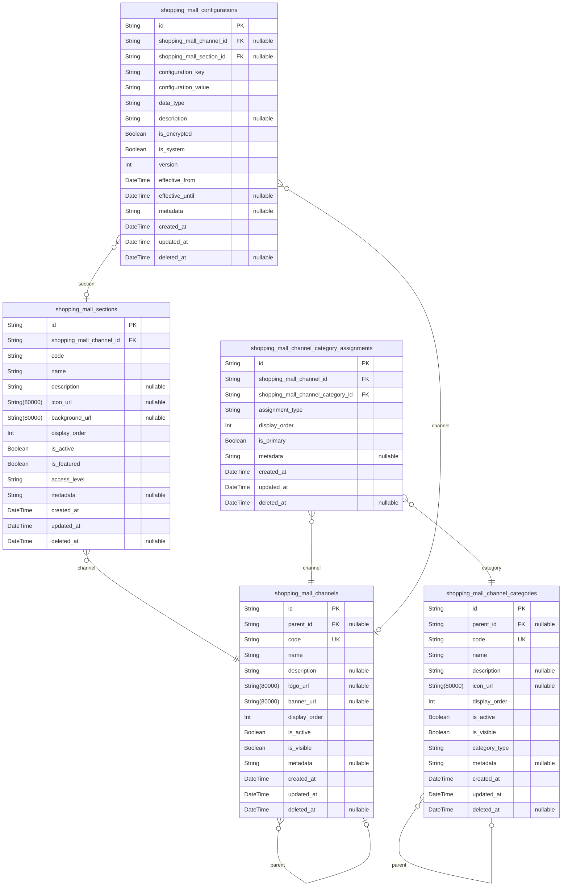
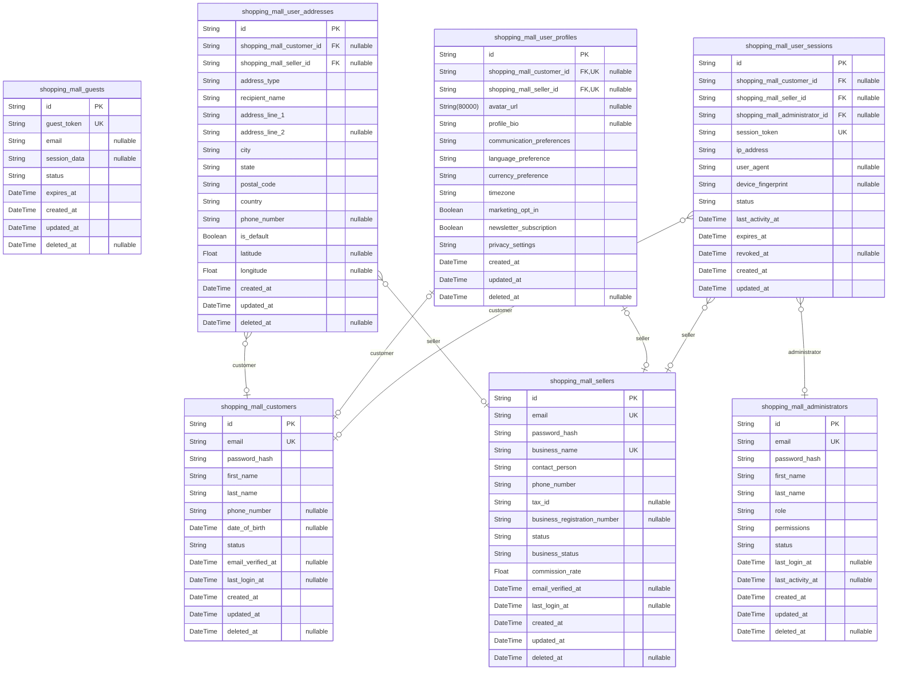
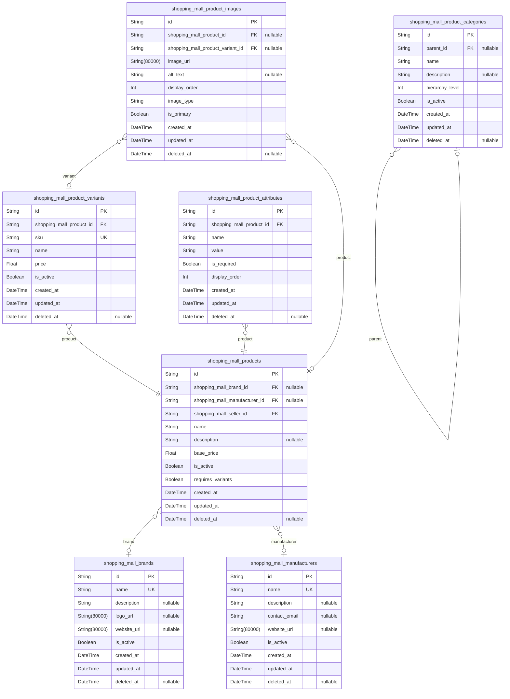
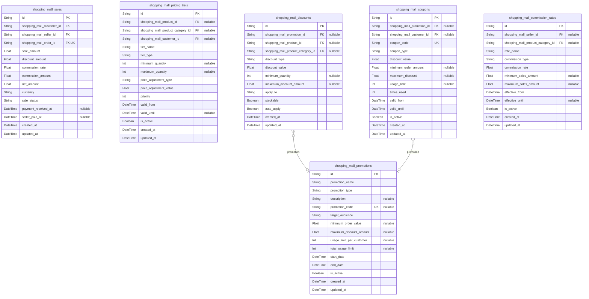
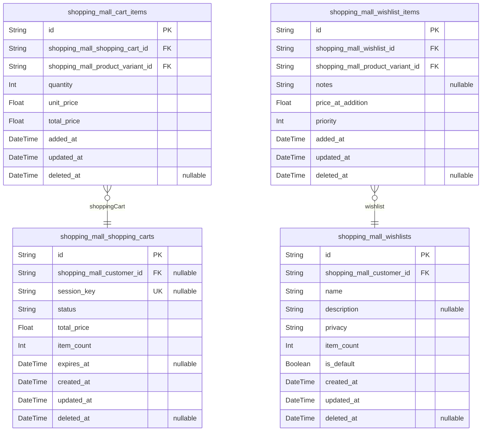
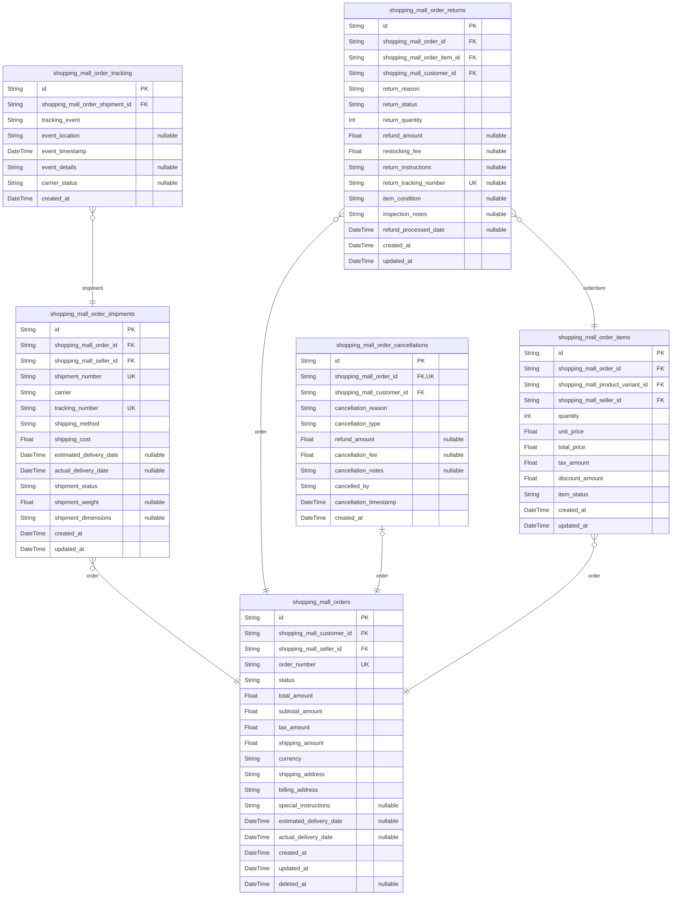
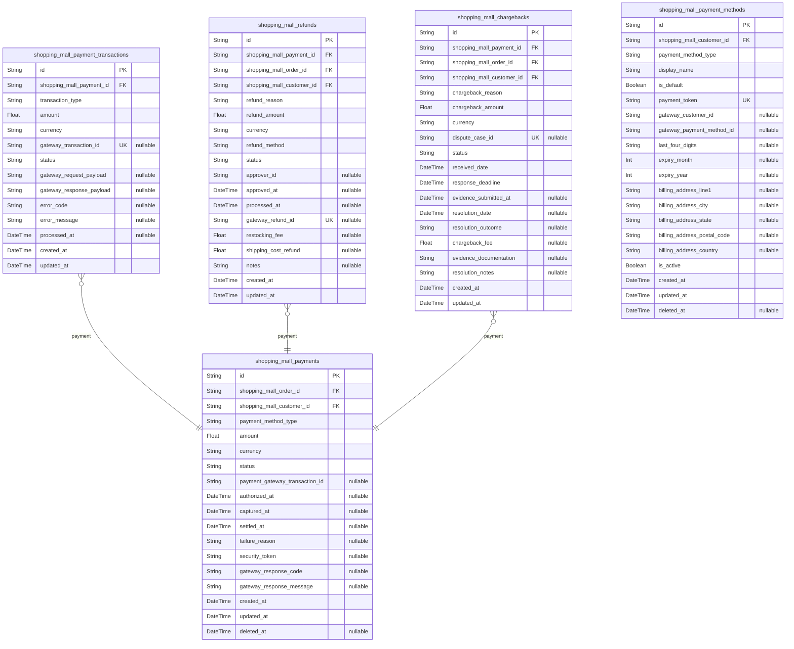
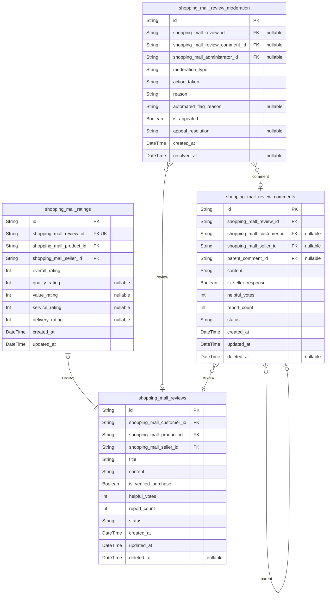
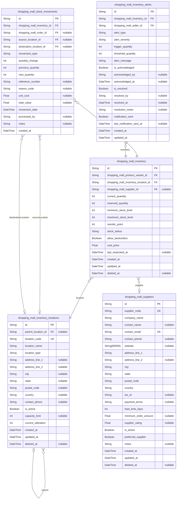
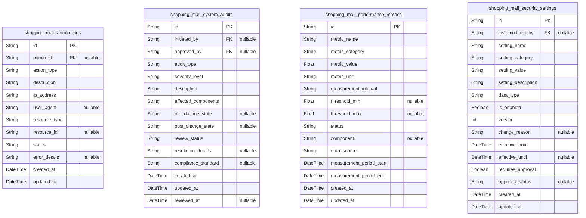

# Prisma Markdown

> Generated by [`prisma-markdown`](https://github.com/samchon/prisma-markdown)

- [Systematic](#systematic)
- [Actors](#actors)
- [ProductCatalog](#productcatalog)
- [Sales](#sales)
- [Carts](#carts)
- [Orders](#orders)
- [Payments](#payments)
- [Reviews](#reviews)
- [Inventory](#inventory)
- [Admin](#admin)

## Systematic

### `shopping_mall_channels`

Defines the organizational channels within the shopping mall platform.
Channels represent major business divisions or market segments that
contain multiple sections. Each channel has hierarchical capabilities for
nesting and manages its own branding, configuration, and operational
parameters. [shopping_mall_sections](#shopping_mall_sections) are organized within channels
to create a structured marketplace environment.

Properties as follows:

- `id`: Primary Key.
- `parent_id`
  > Parent channel for hierarchical organization. Enables nested channel
  > structures. [shopping_mall_channels.id](#shopping_mall_channels)
- `code`
  > Unique business identifier for the channel. Used for API references and
  > system integration.
- `name`: Display name of the channel shown to users and administrators.
- `description`
  > Detailed description explaining the channel's purpose and business
  > context.
- `logo_url`: Channel branding logo image URL for visual identification.
- `banner_url`: Header banner image URL for channel presentation.
- `display_order`: Sort order for channel display in listings and navigation.
- `is_active`: Indicates whether the channel is currently active and visible.
- `is_visible`: Controls visibility of the channel in public interfaces.
- `metadata`: JSON structured data for channel-specific configurations and extensions.
- `created_at`: Timestamp when the channel was created.
- `updated_at`: Timestamp when the channel was last updated.
- `deleted_at`: Timestamp when the channel was soft deleted. Null if active.

### `shopping_mall_sections`

Organizational sections that group related content within channels.
Sections provide logical segmentation within channels for better content
organization and user navigation. Each section belongs to a specific
channel and can contain products, categories, or other platform
components. [shopping_mall_channels](#shopping_mall_channels)

Properties as follows:

- `id`: Primary Key.
- `shopping_mall_channel_id`
  > Parent channel that contains this section. {@link
  > shopping_mall_channels.id}
- `code`: Unique section identifier within the channel context.
- `name`: Display name of the section for user interfaces.
- `description`: Detailed explanation of the section's purpose and content.
- `icon_url`: Icon image URL for section visual representation.
- `background_url`: Background image URL for section presentation.
- `display_order`: Sort order for section display within its channel.
- `is_active`: Indicates whether the section is active and operational.
- `is_featured`: Marks the section as featured for prominent display.
- `access_level`: Access control level for section visibility and permissions.
- `metadata`: JSON structured data for section-specific configurations.
- `created_at`: Timestamp when the section was created.
- `updated_at`: Timestamp when the section was last updated.
- `deleted_at`: Timestamp when the section was soft deleted. Null if active.

### `shopping_mall_channel_categories`

Classification system for organizing channels into meaningful categories.
Enables hierarchical categorization of channels for better discovery,
filtering, and management. Supports multiple categorization schemes and
flexible taxonomy structures. [shopping_mall_channels](#shopping_mall_channels)

Properties as follows:

- `id`: Primary Key.
- `parent_id`
  > Parent category for hierarchical organization. Enables nested category
  > trees. [shopping_mall_channel_categories.id](#shopping_mall_channel_categories)
- `code`: Unique category identifier for system reference and API access.
- `name`: Display name of the category shown to users and administrators.
- `description`: Detailed description of the category's purpose and scope.
- `icon_url`: Category icon image URL for visual representation.
- `display_order`: Sort order for category display in listings and navigation.
- `is_active`: Indicates whether the category is currently active.
- `is_visible`: Controls visibility of the category in public interfaces.
- `category_type`: Type of category (e.g., product-based, regional, thematic).
- `metadata`: JSON structured data for category-specific configurations.
- `created_at`: Timestamp when the category was created.
- `updated_at`: Timestamp when the category was last updated.
- `deleted_at`: Timestamp when the category was soft deleted. Null if active.

### `shopping_mall_channel_category_assignments`

Junction table for assigning channels to multiple categories. Enables
flexible many-to-many relationships between channels and categories,
supporting multiple categorization schemes and dynamic classification.
[shopping_mall_channels](#shopping_mall_channels) [shopping_mall_channel_categories](#shopping_mall_channel_categories)

Properties as follows:

- `id`: Primary Key.
- `shopping_mall_channel_id`: Channel being assigned to a category. [shopping_mall_channels.id](#shopping_mall_channels)
- `shopping_mall_channel_category_id`
  > Category receiving the channel assignment. {@link
  > shopping_mall_channel_categories.id}
- `assignment_type`: Type of category assignment (primary, secondary, thematic).
- `display_order`: Sort order for channel display within the category.
- `is_primary`: Indicates if this is the primary category for the channel.
- `metadata`: JSON structured data for assignment-specific configurations.
- `created_at`: Timestamp when the category assignment was created.
- `updated_at`: Timestamp when the assignment was last updated.
- `deleted_at`: Timestamp when the assignment was soft deleted. Null if active.

### `shopping_mall_configurations`

System-wide and channel-specific configuration settings. Stores platform
configuration parameters, feature flags, and operational settings that
control system behavior across different scopes (global, channel,
section). Supports configuration versioning and audit trails. {@link
shopping_mall_channels} [shopping_mall_sections](#shopping_mall_sections)

Properties as follows:

- `id`: Primary Key.
- `shopping_mall_channel_id`
  > Channel scope for channel-specific configurations. Null for global
  > settings. [shopping_mall_channels.id](#shopping_mall_channels)
- `shopping_mall_section_id`
  > Section scope for section-specific configurations. Null for broader
  > scopes. [shopping_mall_sections.id](#shopping_mall_sections)
- `configuration_key`: Unique key identifying the configuration parameter.
- `configuration_value`: Value of the configuration parameter in JSON format.
- `data_type`: Data type of the configuration value (string, number, boolean, json).
- `description`: Human-readable description of the configuration parameter.
- `is_encrypted`: Indicates if the configuration value should be encrypted.
- `is_system`: Marks system-critical configurations that cannot be modified by users.
- `version`: Configuration version for change tracking and rollback capabilities.
- `effective_from`: Timestamp when the configuration becomes effective.
- `effective_until`: Timestamp when the configuration expires. Null for indefinite.
- `metadata`: JSON structured metadata for configuration management.
- `created_at`: Timestamp when the configuration was created.
- `updated_at`: Timestamp when the configuration was last updated.
- `deleted_at`: Timestamp when the configuration was soft deleted. Null if active.

## Actors

### `shopping_mall_guests`

Temporary guest users created for browsing and anonymous shopping
sessions. Stores minimal guest information for session continuity and
cart preservation. Guest accounts can be converted to registered customer
accounts upon user registration.

Properties as follows:

- `id`: Primary Key.
- `guest_token`: Unique anonymous identifier for guest sessions.
- `email`: Optional email address provided by guest for order notifications.
- `session_data`: JSON-encoded guest session data including cart contents and preferences.
- `status`: Guest account status (active, expired, converted).
- `expires_at`: Automatic expiration timestamp for guest account cleanup.
- `created_at`: Timestamp when guest account was created.
- `updated_at`: Timestamp of last guest account update.
- `deleted_at`: Soft deletion timestamp for GDPR compliance.

### `shopping_mall_customers`

Registered customer accounts with full authentication and shopping
capabilities. Central entity for customer relationship management, order
history, and personalized shopping experiences.

Properties as follows:

- `id`: Primary Key.
- `email`: Verified email address for customer authentication and communication.
- `password_hash`: Securely hashed password for customer authentication.
- `first_name`: Customer's first name for personalized communication.
- `last_name`: Customer's last name for shipping and billing purposes.
- `phone_number`: Customer phone number for order updates and support.
- `date_of_birth`: Customer birth date for age verification and personalization.
- `status`: Customer account status (active, suspended, verified).
- `email_verified_at`: Timestamp when email address was verified.
- `last_login_at`: Timestamp of customer's last successful login.
- `created_at`: Timestamp when customer account was created.
- `updated_at`: Timestamp of last customer account update.
- `deleted_at`: Soft deletion timestamp for GDPR compliance.

### `shopping_mall_sellers`

Business seller accounts with product management, order fulfillment, and
business analytics capabilities. Sellers operate their storefronts within
the shopping mall platform.

Properties as follows:

- `id`: Primary Key.
- `email`: Business email address for seller authentication and communication.
- `password_hash`: Securely hashed password for seller authentication.
- `business_name`: Official registered business name for the seller store.
- `contact_person`: Primary contact person name for business communications.
- `phone_number`: Business phone number for order coordination and support.
- `tax_id`: Business tax identification number for financial compliance.
- `business_registration_number`: Official business registration number for verification.
- `status`: Seller account status (pending, active, suspended, verified).
- `business_status`: Seller business status (individual, partnership, corporation).
- `commission_rate`: Platform commission rate percentage for this seller.
- `email_verified_at`: Timestamp when business email was verified.
- `last_login_at`: Timestamp of seller's last successful login.
- `created_at`: Timestamp when seller account was created.
- `updated_at`: Timestamp of last seller account update.
- `deleted_at`: Soft deletion timestamp for business continuity.

### `shopping_mall_administrators`

Platform administrator accounts with system-wide management and
configuration capabilities. Administrators oversee platform operations,
user management, and system security.

Properties as follows:

- `id`: Primary Key.
- `email`: Administrative email address for platform authentication and alerts.
- `password_hash`: Securely hashed password for administrator authentication.
- `first_name`: Administrator's first name for identification purposes.
- `last_name`: Administrator's last name for audit trail identification.
- `role`: Administrative role level (super_admin, content_admin, support_admin).
- `permissions`: JSON-encoded permission set for role-based access control.
- `status`: Administrator account status (active, suspended, inactive).
- `last_login_at`: Timestamp of administrator's last system login.
- `last_activity_at`: Timestamp of administrator's last platform activity.
- `created_at`: Timestamp when administrator account was created.
- `updated_at`: Timestamp of last administrator account update.
- `deleted_at`: Soft deletion timestamp for audit compliance.

### `shopping_mall_user_addresses`

User address book entries for shipping, billing, and contact purposes.
Supports multiple addresses per user with type classification and
validation.

Properties as follows:

- `id`: Primary Key.
- `shopping_mall_customer_id`: Associated customer's [shopping_mall_customers.id](#shopping_mall_customers).
- `shopping_mall_seller_id`: Associated seller's [shopping_mall_sellers.id](#shopping_mall_sellers).
- `address_type`: Address classification (shipping, billing, business, home).
- `recipient_name`: Full name of the person receiving deliveries at this address.
- `address_line_1`: Primary street address line for delivery.
- `address_line_2`: Secondary address details (apartment, suite, building).
- `city`: City or locality name for the address.
- `state`: State or province name for geographic location.
- `postal_code`: Postal or ZIP code for address validation.
- `country`: Country name for international shipping.
- `phone_number`: Contact phone number for this address location.
- `is_default`: Flag indicating if this is the user's primary/default address.
- `latitude`: Geographic latitude for mapping and delivery optimization.
- `longitude`: Geographic longitude for mapping and delivery optimization.
- `created_at`: Timestamp when address record was created.
- `updated_at`: Timestamp of last address record update.
- `deleted_at`: Soft deletion timestamp for address cleanup.

### `shopping_mall_user_profiles`

Extended user profile information for personalization and customer
service. Stores additional user preferences, communication settings, and
profile metadata.

Properties as follows:

- `id`: Primary Key.
- `shopping_mall_customer_id`: Associated customer's [shopping_mall_customers.id](#shopping_mall_customers).
- `shopping_mall_seller_id`: Associated seller's [shopping_mall_sellers.id](#shopping_mall_sellers).
- `avatar_url`: URL to user's profile picture or avatar image.
- `profile_bio`: User-provided biography or description text.
- `communication_preferences`: JSON-encoded communication preferences and notification settings.
- `language_preference`: User's preferred language for platform interface.
- `currency_preference`: User's preferred currency for price display.
- `timezone`: User's preferred timezone for scheduling and notifications.
- `marketing_opt_in`: Flag indicating user consent for marketing communications.
- `newsletter_subscription`: Flag indicating user subscription to platform newsletters.
- `privacy_settings`: JSON-encoded privacy and data sharing preferences.
- `created_at`: Timestamp when profile was created.
- `updated_at`: Timestamp of last profile update.
- `deleted_at`: Soft deletion timestamp for privacy compliance.

### `shopping_mall_user_sessions`

User authentication sessions for security and access management. Tracks
active user sessions with expiration and security controls.

Properties as follows:

- `id`: Primary Key.
- `shopping_mall_customer_id`: Associated customer's [shopping_mall_customers.id](#shopping_mall_customers).
- `shopping_mall_seller_id`: Associated seller's [shopping_mall_sellers.id](#shopping_mall_sellers).
- `shopping_mall_administrator_id`: Associated administrator's [shopping_mall_administrators.id](#shopping_mall_administrators).
- `session_token`: Unique session identifier for authentication purposes.
- `ip_address`: IP address from which the session was initiated.
- `user_agent`: Browser or client user agent string for device identification.
- `device_fingerprint`: Unique device identifier for security validation.
- `status`: Session status (active, expired, revoked, logged_out).
- `last_activity_at`: Timestamp of last user activity during this session.
- `expires_at`: Automatic expiration timestamp for session security.
- `revoked_at`: Timestamp when session was manually revoked.
- `created_at`: Timestamp when session was created.
- `updated_at`: Timestamp of last session activity update.

## ProductCatalog

### `shopping_mall_products`

Core product entity containing base product information that serves as
the foundation for variant creation. Products represent the main catalog
items that customers can purchase. Each product belongs to a brand and
manufacturer, and can be categorized into multiple product categories for
organization and discovery.

Properties as follows:

- `id`: Primary Key.
- `shopping_mall_brand_id`: Associated brand's [shopping_mall_brands.id](#shopping_mall_brands).
- `shopping_mall_manufacturer_id`: Associated manufacturer's [shopping_mall_manufacturers.id](#shopping_mall_manufacturers).
- `shopping_mall_seller_id`: Seller who owns this product [shopping_mall_sellers.id](#shopping_mall_sellers).
- `name`: Product name displayed to customers.
- `description`: Detailed product description including features and specifications.
- `base_price`: Base price for the product before variant-specific pricing.
- `is_active`: Whether the product is available for sale.
- `requires_variants`: Indicates if product requires variant selection before purchase.
- `created_at`: Timestamp when product was created.
- `updated_at`: Timestamp when product was last updated.
- `deleted_at`: Timestamp when product was soft deleted.

### `shopping_mall_product_variants`

Product variants representing different configurations of the same base
product. Each variant has a unique SKU and specific pricing, enabling
inventory management at the variant level. Variants inherit base product
information but can override pricing and have distinct attributes.

Properties as follows:

- `id`: Primary Key.
- `shopping_mall_product_id`: Parent product's [shopping_mall_products.id](#shopping_mall_products).
- `sku`: Unique Stock Keeping Unit identifier for the variant.
- `name`: Variant-specific name or description.
- `price`: Variant-specific price that overrides base product price.
- `is_active`: Whether this specific variant is available for sale.
- `created_at`: Timestamp when variant was created.
- `updated_at`: Timestamp when variant was last updated.
- `deleted_at`: Timestamp when variant was soft deleted.

### `shopping_mall_product_categories`

Product category hierarchy for organizing products into logical groups.
Categories support multi-level hierarchy with parent-child relationships
enabling flexible product organization. Products can belong to multiple
categories for enhanced discoverability.

Properties as follows:

- `id`: Primary Key.
- `parent_id`: Parent category's [shopping_mall_product_categories.id](#shopping_mall_product_categories).
- `name`: Category name displayed to users.
- `description`: Category description for administrative purposes.
- `hierarchy_level`: Level in category hierarchy (1 for root categories).
- `is_active`: Whether category is active and visible.
- `created_at`: Timestamp when category was created.
- `updated_at`: Timestamp when category was last updated.
- `deleted_at`: Timestamp when category was soft deleted.

### `shopping_mall_product_attributes`

Product attributes defining the characteristics that distinguish product
variants. Attributes represent the variable properties of products (like
color, size, material) that enable variant creation. Each attribute can
be used across multiple products and variants.

Properties as follows:

- `id`: Primary Key.
- `shopping_mall_product_id`: Product that uses this attribute [shopping_mall_products.id](#shopping_mall_products).
- `name`: Attribute name (e.g., 'Color', 'Size', 'Material').
- `value`: Attribute value (e.g., 'Red', 'Large', 'Cotton').
- `is_required`: Whether this attribute is required for variant selection.
- `display_order`: Order in which attributes are displayed to users.
- `created_at`: Timestamp when attribute was created.
- `updated_at`: Timestamp when attribute was last updated.
- `deleted_at`: Timestamp when attribute was soft deleted.

### `shopping_mall_product_images`

Product images and media files associated with products and variants.
Supports multiple images per product/variant with ordering and type
classification. Images can be specific to variants or shared across
products for comprehensive product visualization.

Properties as follows:

- `id`: Primary Key.
- `shopping_mall_product_id`: Product associated with this image [shopping_mall_products.id](#shopping_mall_products).
- `shopping_mall_product_variant_id`: Variant-specific image [shopping_mall_product_variants.id](#shopping_mall_product_variants).
- `image_url`: URL to the product image file.
- `alt_text`: Alternative text for accessibility and SEO.
- `display_order`: Order in which images are displayed (lower numbers first).
- `image_type`: Type of image (thumbnail, main, gallery, etc.).
- `is_primary`: Whether this is the primary image for the product/variant.
- `created_at`: Timestamp when image was created.
- `updated_at`: Timestamp when image was last updated.
- `deleted_at`: Timestamp when image was soft deleted.

### `shopping_mall_brands`

Product brands representing the manufacturers or companies that produce
products. Brands serve as important categorization and filtering criteria
for customers. Each brand can have associated branding information and
quality standards.

Properties as follows:

- `id`: Primary Key.
- `name`: Brand name displayed to customers.
- `description`: Brand description and company information.
- `logo_url`: URL to brand logo image.
- `website_url`: Official brand website URL.
- `is_active`: Whether brand is active and visible.
- `created_at`: Timestamp when brand was created.
- `updated_at`: Timestamp when brand was last updated.
- `deleted_at`: Timestamp when brand was soft deleted.

### `shopping_mall_manufacturers`

Product manufacturers representing the actual producers of goods.
Manufacturers are distinct from brands as they represent the entity
responsible for product creation. This enables detailed supply chain
tracking and quality control.

Properties as follows:

- `id`: Primary Key.
- `name`: Manufacturer name for identification.
- `description`: Manufacturer description and business details.
- `contact_email`: Manufacturer contact email address.
- `website_url`: Manufacturer website URL.
- `is_active`: Whether manufacturer is active in the system.
- `created_at`: Timestamp when manufacturer was created.
- `updated_at`: Timestamp when manufacturer was last updated.
- `deleted_at`: Timestamp when manufacturer was soft deleted.

## Sales

### `shopping_mall_sales`

Core sales transaction records tracking all marketplace purchases. Each
sale represents a completed transaction between a customer and seller,
including pricing, commission calculations, and fulfillment status. Sales
records are essential for revenue tracking, seller payments, and business
analytics.

Properties as follows:

- `id`: Primary Key.
- `shopping_mall_customer_id`: Customer who made the purchase. [shopping_mall_customers.id](#shopping_mall_customers)
- `shopping_mall_seller_id`: Seller who received the payment. [shopping_mall_sellers.id](#shopping_mall_sellers)
- `shopping_mall_order_id`: Reference to the original order. [shopping_mall_orders.id](#shopping_mall_orders)
- `sale_amount`: Total sale amount before any discounts or commissions.
- `discount_amount`: Total discount applied to the sale.
- `commission_rate`: Commission percentage applied to the sale.
- `commission_amount`: Calculated commission amount deducted from sale.
- `net_amount`: Final amount payable to seller after commissions.
- `currency`: Currency code for the transaction (e.g., USD, EUR).
- `sale_status`: Current status of the sale (pending, completed, refunded, cancelled).
- `payment_received_at`: Timestamp when payment was successfully received.
- `seller_paid_at`: Timestamp when seller payment was processed.
- `created_at`: Timestamp when the sale record was created.
- `updated_at`: Timestamp when the sale record was last updated.

### `shopping_mall_pricing_tiers`

Flexible pricing tier structure supporting different customer segments,
volume discounts, and promotional pricing. Pricing tiers can be applied
to products, categories, or customer groups with configurable rules and
conditions.

Properties as follows:

- `id`: Primary Key.
- `shopping_mall_product_id`: Product this pricing tier applies to. [shopping_mall_products.id](#shopping_mall_products)
- `shopping_mall_product_category_id`
  > Product category this pricing tier applies to. {@link
  > shopping_mall_product_categories.id}
- `shopping_mall_customer_id`
  > Specific customer this pricing tier applies to. {@link
  > shopping_mall_customers.id}
- `tier_name`: Descriptive name for this pricing tier.
- `tier_type`: Type of pricing tier (volume, customer_group, promotional, seasonal).
- `minimum_quantity`: Minimum quantity required to qualify for this tier.
- `maximum_quantity`: Maximum quantity allowed for this tier.
- `price_adjustment_type`: Type of price adjustment (percentage, fixed_amount, override).
- `price_adjustment_value`: Value of the price adjustment.
- `priority`: Priority level for tier application (higher numbers take precedence).
- `valid_from`: Start date when this pricing tier becomes active.
- `valid_until`: End date when this pricing tier expires.
- `is_active`: Whether this pricing tier is currently active.
- `created_at`: Timestamp when the pricing tier was created.
- `updated_at`: Timestamp when the pricing tier was last updated.

### `shopping_mall_promotions`

Promotional campaigns and marketing initiatives with configurable rules,
targeting, and performance tracking. Promotions can include discounts,
free shipping, gifts, or other incentives to drive sales.

Properties as follows:

- `id`: Primary Key.
- `promotion_name`: Descriptive name for the promotion campaign.
- `promotion_type`
  > Type of promotion (percentage_discount, fixed_discount, free_shipping,
  > bundle, gift).
- `description`: Detailed description of the promotion terms and conditions.
- `promotion_code`: Optional promotion code for manual entry.
- `target_audience`
  > Target audience for the promotion (all_customers, new_customers, VIP,
  > specific_segment).
- `minimum_order_value`: Minimum order value required to qualify for promotion.
- `maximum_discount_amount`: Maximum discount amount allowed per order.
- `usage_limit_per_customer`: Maximum number of times a customer can use this promotion.
- `total_usage_limit`: Maximum total number of times this promotion can be used.
- `start_date`: Date and time when the promotion becomes active.
- `end_date`: Date and time when the promotion expires.
- `is_active`: Whether the promotion is currently active.
- `created_at`: Timestamp when the promotion was created.
- `updated_at`: Timestamp when the promotion was last updated.

### `shopping_mall_discounts`

Discount rules and calculations applied to products, categories, or
orders. Discounts can be automatic (based on conditions) or manual
(applied by customers or admins) with various calculation methods.

Properties as follows:

- `id`: Primary Key.
- `shopping_mall_promotion_id`
  > Promotion that this discount belongs to. {@link
  > shopping_mall_promotions.id}
- `shopping_mall_product_id`: Product this discount applies to. [shopping_mall_products.id](#shopping_mall_products)
- `shopping_mall_product_category_id`
  > Product category this discount applies to. {@link
  > shopping_mall_product_categories.id}
- `discount_type`: Type of discount (percentage, fixed_amount, free_shipping, buy_x_get_y).
- `discount_value`: Value of the discount (percentage or fixed amount).
- `minimum_quantity`: Minimum quantity required to qualify for discount.
- `maximum_discount_amount`: Maximum discount amount that can be applied.
- `apply_to`: What the discount applies to (product, category, order, shipping).
- `stackable`: Whether this discount can be combined with other discounts.
- `auto_apply`: Whether discount applies automatically when conditions are met.
- `created_at`: Timestamp when the discount was created.
- `updated_at`: Timestamp when the discount was last updated.

### `shopping_mall_coupons`

Coupon code management system with unique codes, usage tracking, and
validation rules. Coupons provide customers with special discounts or
offers that can be applied during checkout.

Properties as follows:

- `id`: Primary Key.
- `shopping_mall_promotion_id`: Promotion associated with this coupon. [shopping_mall_promotions.id](#shopping_mall_promotions)
- `shopping_mall_customer_id`
  > Specific customer this coupon was issued to. {@link
  > shopping_mall_customers.id}
- `coupon_code`: Unique coupon code that customers enter during checkout.
- `coupon_type`: Type of coupon (percentage, fixed_amount, free_shipping, gift).
- `discount_value`: Discount value (percentage or fixed amount).
- `minimum_order_amount`: Minimum order amount required to use this coupon.
- `maximum_discount`: Maximum discount amount that can be applied.
- `usage_limit`: Maximum number of times this coupon can be used.
- `times_used`: Number of times this coupon has been used.
- `valid_from`: Date and time when the coupon becomes valid.
- `valid_until`: Date and time when the coupon expires.
- `is_active`: Whether the coupon is currently active and valid.
- `created_at`: Timestamp when the coupon was created.
- `updated_at`: Timestamp when the coupon was last updated.

### `shopping_mall_commission_rates`

Commission rate structures defining platform fees for different sellers,
product categories, and transaction types. Supports tiered commission
models based on sales volume, product category, and seller performance.

Properties as follows:

- `id`: Primary Key.
- `shopping_mall_seller_id`: Seller this commission rate applies to. [shopping_mall_sellers.id](#shopping_mall_sellers)
- `shopping_mall_product_category_id`
  > Product category this commission rate applies to. {@link
  > shopping_mall_product_categories.id}
- `rate_name`: Descriptive name for this commission rate structure.
- `commission_type`: Type of commission (percentage, fixed_amount, tiered).
- `commission_rate`: Commission rate value (percentage or fixed amount).
- `minimum_sales_amount`: Minimum sales amount required for this rate to apply.
- `maximum_sales_amount`: Maximum sales amount for this rate tier.
- `effective_from`: Date when this commission rate becomes effective.
- `effective_until`: Date when this commission rate expires.
- `is_active`: Whether this commission rate is currently active.
- `created_at`: Timestamp when the commission rate was created.
- `updated_at`: Timestamp when the commission rate was last updated.

## Carts

### `shopping_mall_shopping_carts`

Represents individual shopping carts that customers use to collect
products before purchase. Each cart can belong to either an authenticated
customer or a guest session. Carts maintain their state including active
items, pricing totals, and expiration status for abandoned cart recovery.

Properties as follows:

- `id`: Primary Key.
- `shopping_mall_customer_id`
  > Owner customer's reference. Nullable to support guest carts. {@link
  > shopping_mall_customers.id}
- `session_key`
  > Unique session identifier for guest carts. Used to maintain cart state
  > across browser sessions.
- `status`
  > Current cart status: 'active', 'abandoned', 'converted', 'expired'.
  > Controls cart lifecycle management.
- `total_price`
  > Calculated sum of all cart items prices. Used for quick cart total
  > display.
- `item_count`
  > Total number of items in the cart. Used for cart icon badges and quick
  > summaries.
- `expires_at`
  > Timestamp when cart automatically expires if inactive. Typically 30 days
  > for guest carts.
- `created_at`: Timestamp when cart was initially created.
- `updated_at`: Timestamp when cart was last modified.
- `deleted_at`: Timestamp when cart was soft deleted for recovery purposes.

### `shopping_mall_cart_items`

Individual items added to shopping carts. Each item represents a specific
product variant with quantity, pricing snapshot, and cart association.
Supports real-time inventory validation and pricing updates.

Properties as follows:

- `id`: Primary Key.
- `shopping_mall_shopping_cart_id`: Parent shopping cart reference. [shopping_mall_shopping_carts.id](#shopping_mall_shopping_carts)
- `shopping_mall_product_variant_id`
  > Specific product variant added to cart. {@link
  > shopping_mall_product_variants.id}
- `quantity`
  > Number of units for this product variant in the cart. Must be positive
  > integer.
- `unit_price`
  > Snapshot of product price at time of adding to cart. Preserves pricing
  > integrity.
- `total_price`: Calculated price for this line item (quantity × unit_price).
- `added_at`: Timestamp when item was originally added to cart.
- `updated_at`: Timestamp when item quantity or price was last modified.
- `deleted_at`: Timestamp when item was removed from cart for recovery purposes.

### `shopping_mall_wishlists`

Customer wishlists for saving products of interest. Each wishlist can
have a custom name and privacy settings. Supports multiple wishlists per
customer for different shopping goals.

Properties as follows:

- `id`: Primary Key.
- `shopping_mall_customer_id`
  > Owner customer reference. Wishlists require authenticated customers.
  > [shopping_mall_customers.id](#shopping_mall_customers)
- `name`
  > Display name for the wishlist. Customers can create multiple named
  > wishlists.
- `description`: Optional description explaining the wishlist purpose or theme.
- `privacy`
  > Privacy setting: 'private', 'shared', 'public'. Controls visibility to
  > other users.
- `item_count`: Total number of items currently in the wishlist. Updated automatically.
- `is_default`: Indicates if this is the customer's default wishlist for quick adds.
- `created_at`: Timestamp when wishlist was created.
- `updated_at`: Timestamp when wishlist details were last modified.
- `deleted_at`: Timestamp when wishlist was soft deleted for recovery purposes.

### `shopping_mall_wishlist_items`

Individual products saved to customer wishlists. Each item captures
product details and pricing snapshot at time of addition. Supports moving
items between wishlists or to shopping cart.

Properties as follows:

- `id`: Primary Key.
- `shopping_mall_wishlist_id`: Parent wishlist reference. [shopping_mall_wishlists.id](#shopping_mall_wishlists)
- `shopping_mall_product_variant_id`
  > Specific product variant saved to wishlist. {@link
  > shopping_mall_product_variants.id}
- `notes`: Optional customer notes about why this product was saved or intended use.
- `price_at_addition`
  > Snapshot of product price when added to wishlist. Helps track price
  > changes.
- `priority`
  > Customer-assigned priority level for wishlist sorting (1=highest,
  > 5=lowest).
- `added_at`: Timestamp when product was added to wishlist.
- `updated_at`: Timestamp when item details were last modified.
- `deleted_at`: Timestamp when item was removed from wishlist for recovery purposes.

## Orders

### `shopping_mall_orders`

Main order entity representing complete customer purchases. Contains
order header information, customer details, payment status, and overall
order management. Orders can contain items from multiple sellers with
separate fulfillment workflows. [shopping_mall_customers.id](#shopping_mall_customers),
[shopping_mall_payments.id](#shopping_mall_payments)

Properties as follows:

- `id`: Primary Key.
- `shopping_mall_customer_id`: Customer who placed the order. [shopping_mall_customers.id](#shopping_mall_customers)
- `shopping_mall_seller_id`
  > Primary seller for the order (used for commission calculations). {@link
  > shopping_mall_sellers.id}
- `order_number`: Unique order identifier for customer reference and tracking.
- `status`
  > Current order status (pending, confirmed, processing, shipped, delivered,
  > cancelled).
- `total_amount`: Total order amount including taxes and shipping.
- `subtotal_amount`: Order subtotal before taxes and shipping.
- `tax_amount`: Total tax amount calculated for the order.
- `shipping_amount`: Total shipping cost for the order.
- `currency`: Currency code for the order amounts (ISO 4217 format).
- `shipping_address`: Complete shipping address for order delivery.
- `billing_address`: Complete billing address for payment purposes.
- `special_instructions`: Customer-provided special delivery instructions.
- `estimated_delivery_date`: Estimated delivery date provided to customer.
- `actual_delivery_date`: Actual delivery date when order was delivered.
- `created_at`: Timestamp when the order was created.
- `updated_at`: Timestamp when the order was last updated.
- `deleted_at`: Timestamp when the order was soft deleted (for cancellations).

### `shopping_mall_order_items`

Individual line items within an order. Each item represents a specific
product variant (SKU) with quantity, price, and seller assignment.
Supports multi-seller orders with proper item grouping. {@link
shopping_mall_orders.id}, [shopping_mall_product_variants.id](#shopping_mall_product_variants),
[shopping_mall_sellers.id](#shopping_mall_sellers)

Properties as follows:

- `id`: Primary Key.
- `shopping_mall_order_id`: Parent order containing this item. [shopping_mall_orders.id](#shopping_mall_orders)
- `shopping_mall_product_variant_id`
  > Specific product variant (SKU) being ordered. {@link
  > shopping_mall_product_variants.id}
- `shopping_mall_seller_id`
  > Seller responsible for fulfilling this specific item. {@link
  > shopping_mall_sellers.id}
- `quantity`: Quantity of the product variant ordered.
- `unit_price`: Price per unit at time of order.
- `total_price`: Total price for this line item (quantity × unit_price).
- `tax_amount`: Tax amount calculated for this specific item.
- `discount_amount`: Discount applied to this specific item.
- `item_status`: Status of this specific item (ordered, shipped, delivered, returned).
- `created_at`: Timestamp when the order item was created.
- `updated_at`: Timestamp when the order item was last updated.

### `shopping_mall_order_shipments`

Shipment records for order fulfillment. Tracks individual shipments
within an order, especially important for multi-seller orders where items
ship separately. Includes carrier information and shipping costs. {@link
shopping_mall_orders.id}, [shopping_mall_sellers.id](#shopping_mall_sellers)

Properties as follows:

- `id`: Primary Key.
- `shopping_mall_order_id`: Parent order being shipped. [shopping_mall_orders.id](#shopping_mall_orders)
- `shopping_mall_seller_id`: Seller responsible for this shipment. [shopping_mall_sellers.id](#shopping_mall_sellers)
- `shipment_number`: Unique shipment identifier for tracking purposes.
- `carrier`: Shipping carrier used for this shipment (UPS, FedEx, DHL, etc.).
- `tracking_number`: Carrier-provided tracking number for shipment monitoring.
- `shipping_method`: Shipping service level (Standard, Express, Overnight).
- `shipping_cost`: Cost of shipping for this specific shipment.
- `estimated_delivery_date`: Carrier-estimated delivery date for this shipment.
- `actual_delivery_date`: Actual delivery date when shipment was completed.
- `shipment_status`: Current shipment status (pending, shipped, in_transit, delivered).
- `shipment_weight`: Total weight of the shipment package.
- `shipment_dimensions`: Package dimensions (L×W×H) for shipping calculations.
- `created_at`: Timestamp when the shipment was created.
- `updated_at`: Timestamp when the shipment was last updated.

### `shopping_mall_order_tracking`

Historical tracking events for order shipments. Captures all tracking
updates from carriers for audit trails and customer communication.
Provides complete visibility into shipment progress. {@link
shopping_mall_order_shipments.id}

Properties as follows:

- `id`: Primary Key.
- `shopping_mall_order_shipment_id`: Shipment being tracked. [shopping_mall_order_shipments.id](#shopping_mall_order_shipments)
- `tracking_event`
  > Description of the tracking event (package received, in transit, out for
  > delivery, delivered).
- `event_location`: Location where the tracking event occurred.
- `event_timestamp`: Timestamp when the tracking event occurred according to the carrier.
- `event_details`: Additional details about the tracking event.
- `carrier_status`: Status code provided by the carrier for this event.
- `created_at`: Timestamp when this tracking record was created in the system.

### `shopping_mall_order_returns`

Return management for order items. Handles the complete return process
including return authorization, item receipt, inspection, and refund
processing. Supports partial returns for multi-item orders. {@link
shopping_mall_orders.id}, [shopping_mall_order_items.id](#shopping_mall_order_items), {@link
shopping_mall_customers.id}

Properties as follows:

- `id`: Primary Key.
- `shopping_mall_order_id`: Original order being returned. [shopping_mall_orders.id](#shopping_mall_orders)
- `shopping_mall_order_item_id`
  > Specific order item being returned (for partial returns). {@link
  > shopping_mall_order_items.id}
- `shopping_mall_customer_id`: Customer requesting the return. [shopping_mall_customers.id](#shopping_mall_customers)
- `return_reason`: Reason for the return (defective, wrong item, changed mind, etc.).
- `return_status`
  > Current return status (requested, approved, received, inspected,
  > refunded).
- `return_quantity`: Quantity of items being returned (for partial returns).
- `refund_amount`: Amount to be refunded for this return.
- `restocking_fee`: Restocking fee applied to the return (if applicable).
- `return_instructions`: Specific instructions for returning the item.
- `return_tracking_number`: Tracking number for the return shipment.
- `item_condition`: Condition of the returned item (new, used, damaged).
- `inspection_notes`: Notes from the inspection of returned items.
- `refund_processed_date`: Date when the refund was processed.
- `created_at`: Timestamp when the return was requested.
- `updated_at`: Timestamp when the return was last updated.

### `shopping_mall_order_cancellations`

Historical record of order cancellations. Preserves cancellation details
for audit trails, analytics, and customer service. Captures cancellation
reasons and timestamps for compliance. [shopping_mall_orders.id](#shopping_mall_orders),
[shopping_mall_customers.id](#shopping_mall_customers)

Properties as follows:

- `id`: Primary Key.
- `shopping_mall_order_id`: Order that was cancelled. [shopping_mall_orders.id](#shopping_mall_orders)
- `shopping_mall_customer_id`
  > Customer who requested the cancellation. {@link
  > shopping_mall_customers.id}
- `cancellation_reason`
  > Reason for order cancellation (customer_request, payment_failed,
  > out_of_stock).
- `cancellation_type`: Type of cancellation (full, partial, before_shipment, after_shipment).
- `refund_amount`: Amount refunded due to cancellation.
- `cancellation_fee`: Fee applied for the cancellation (if applicable).
- `cancellation_notes`: Additional notes about the cancellation.
- `cancelled_by`: Who initiated the cancellation (customer, seller, admin).
- `cancellation_timestamp`: Exact timestamp when the cancellation occurred.
- `created_at`: Timestamp when the cancellation record was created.

## Payments

### `shopping_mall_payments`

Primary payment records linking orders to financial transactions. Stores
payment authorization, capture, and settlement details for complete
payment lifecycle tracking. Each payment record represents a financial
commitment against an order, supporting multiple payment methods and
maintaining PCI DSS compliance through secure data handling.

Properties as follows:

- `id`: Primary Key.
- `shopping_mall_order_id`: Associated order for this payment. [shopping_mall_orders.id](#shopping_mall_orders).
- `shopping_mall_customer_id`: Customer who authorized this payment. [shopping_mall_customers.id](#shopping_mall_customers).
- `payment_method_type`
  > Type of payment method used (credit_card, debit_card, paypal,
  > bank_transfer, etc.)
- `amount`: Total payment amount in base currency.
- `currency`: Currency code in ISO 4217 format (USD, EUR, GBP, etc.)
- `status`
  > Current payment status (pending, authorized, captured, settled, failed,
  > refunded, disputed).
- `payment_gateway_transaction_id`: External payment gateway transaction identifier for reconciliation.
- `authorized_at`: Timestamp when payment was authorized by the payment gateway.
- `captured_at`: Timestamp when authorized funds were captured for settlement.
- `settled_at`: Timestamp when payment was fully settled and funds transferred.
- `failure_reason`: Detailed reason for payment failure if applicable.
- `security_token`: Secure token representing payment instrument for PCI DSS compliance.
- `gateway_response_code`: Payment gateway response code for debugging and error handling.
- `gateway_response_message`: Human-readable response message from payment gateway.
- `created_at`: Timestamp when payment record was created.
- `updated_at`: Timestamp when payment record was last updated.
- `deleted_at`: Timestamp when payment record was soft deleted for audit purposes.

### `shopping_mall_payment_transactions`

Individual transaction events within the payment lifecycle. Tracks each
discrete financial operation including authorization attempts, captures,
voids, and settlement adjustments. Provides granular audit trail for
payment processing and dispute resolution.

Properties as follows:

- `id`: Primary Key.
- `shopping_mall_payment_id`
  > Parent payment record this transaction belongs to. {@link
  > shopping_mall_payments.id}.
- `transaction_type`
  > Type of transaction (authorize, capture, void, refund, settlement,
  > adjustment).
- `amount`: Transaction amount in base currency.
- `currency`: Currency code in ISO 4217 format.
- `gateway_transaction_id`: External payment gateway identifier for this specific transaction.
- `status`
  > Transaction processing status (pending, processing, completed, failed,
  > cancelled).
- `gateway_request_payload`: Complete request payload sent to payment gateway for audit purposes.
- `gateway_response_payload`: Complete response payload received from payment gateway for audit.
- `error_code`: Error code returned by payment gateway if transaction failed.
- `error_message`: Detailed error message from payment gateway for debugging.
- `processed_at`: Timestamp when transaction was processed by payment gateway.
- `created_at`: Timestamp when transaction record was created.
- `updated_at`: Timestamp when transaction record was last updated.

### `shopping_mall_refunds`

Refund records for processing customer reimbursements. Tracks refund
requests, approvals, processing, and completion with full audit trail.
Supports partial refunds, restocking fee calculations, and integration
with inventory management.

Properties as follows:

- `id`: Primary Key.
- `shopping_mall_payment_id`: Original payment being refunded. [shopping_mall_payments.id](#shopping_mall_payments).
- `shopping_mall_order_id`: Associated order for this refund. [shopping_mall_orders.id](#shopping_mall_orders).
- `shopping_mall_customer_id`: Customer receiving the refund. [shopping_mall_customers.id](#shopping_mall_customers).
- `refund_reason`
  > Reason for refund request (return, cancellation, defect, price
  > adjustment, etc.)
- `refund_amount`: Total refund amount being processed.
- `currency`: Currency code in ISO 4217 format.
- `refund_method`
  > Method used for refund (original_payment_method, store_credit,
  > bank_transfer, etc.)
- `status`
  > Refund processing status (requested, approved, processing, completed,
  > failed, cancelled).
- `approver_id`: Administrator or seller who approved the refund request.
- `approved_at`: Timestamp when refund was approved for processing.
- `processed_at`: Timestamp when refund was processed by payment gateway.
- `gateway_refund_id`: External payment gateway identifier for this refund transaction.
- `restocking_fee`: Amount deducted as restocking fee if applicable.
- `shipping_cost_refund`: Amount of shipping costs being refunded.
- `notes`: Additional notes or instructions for refund processing.
- `created_at`: Timestamp when refund record was created.
- `updated_at`: Timestamp when refund record was last updated.

### `shopping_mall_chargebacks`

Chargeback dispute records for managing payment disputes initiated by
customers through their financial institutions. Tracks dispute lifecycle,
evidence submission, resolution outcomes, and financial impact analysis.

Properties as follows:

- `id`: Primary Key.
- `shopping_mall_payment_id`
  > Payment being disputed through chargeback. {@link
  > shopping_mall_payments.id}.
- `shopping_mall_order_id`: Associated order for this chargeback. [shopping_mall_orders.id](#shopping_mall_orders).
- `shopping_mall_customer_id`: Customer who initiated the chargeback. [shopping_mall_customers.id](#shopping_mall_customers).
- `chargeback_reason`
  > Reason code for chargeback (fraud, unauthorized, duplicate,
  > product_not_received, etc.)
- `chargeback_amount`: Amount being disputed through chargeback.
- `currency`: Currency code in ISO 4217 format.
- `dispute_case_id`: External dispute case identifier from payment processor or bank.
- `status`
  > Chargeback status (received, under_review, evidence_submitted, won, lost,
  > settled).
- `received_date`: Date when chargeback was received from payment processor.
- `response_deadline`: Deadline for submitting evidence to dispute the chargeback.
- `evidence_submitted_at`: Timestamp when dispute evidence was submitted.
- `resolution_date`: Date when chargeback was resolved by payment processor.
- `resolution_outcome`
  > Final outcome of chargeback dispute (merchant_won, merchant_lost,
  > settled).
- `chargeback_fee`: Fee charged by payment processor for handling the chargeback.
- `evidence_documentation`: Summary of evidence submitted to dispute the chargeback.
- `resolution_notes`: Notes about the resolution process and outcome.
- `created_at`: Timestamp when chargeback record was created.
- `updated_at`: Timestamp when chargeback record was last updated.

### `shopping_mall_payment_methods`

Customer payment method preferences and securely stored payment
instruments. Maintains PCI DSS compliant tokenized payment data with
customer preferences for recurring payments and checkout optimization.

Properties as follows:

- `id`: Primary Key.
- `shopping_mall_customer_id`: Customer who owns this payment method. [shopping_mall_customers.id](#shopping_mall_customers).
- `payment_method_type`
  > Type of payment instrument (credit_card, debit_card, paypal,
  > bank_account, etc.)
- `display_name`: Customer-friendly display name for this payment method.
- `is_default`: Whether this is the customer's default payment method for checkout.
- `payment_token`: Secure token representing the payment instrument for PCI DSS compliance.
- `gateway_customer_id`: External payment gateway identifier for the customer profile.
- `gateway_payment_method_id`: External payment gateway identifier for this specific payment method.
- `last_four_digits`
  > Last four digits of payment instrument for display purposes (e.g., 4242
  > for credit card).
- `expiry_month`: Expiration month for card-based payment methods.
- `expiry_year`: Expiration year for card-based payment methods.
- `billing_address_line1`: First line of billing address associated with this payment method.
- `billing_address_city`: City for billing address.
- `billing_address_state`: State or province for billing address.
- `billing_address_postal_code`: Postal code for billing address.
- `billing_address_country`: Country for billing address in ISO 3166-1 alpha-2 format.
- `is_active`: Whether this payment method is currently active and usable.
- `created_at`: Timestamp when payment method record was created.
- `updated_at`: Timestamp when payment method record was last updated.
- `deleted_at`: Timestamp when payment method was soft deleted for audit purposes.

## Reviews

### `shopping_mall_reviews`

Customer reviews for products and sellers. Stores detailed feedback
including title, content, and verification status. Reviews are linked to
specific purchases to ensure authenticity and prevent fake reviews.
[shopping_mall_products.id](#shopping_mall_products) [shopping_mall_customers.id](#shopping_mall_customers)

Properties as follows:

- `id`: Primary Key.
- `shopping_mall_customer_id`: Customer who wrote the review. [shopping_mall_customers.id](#shopping_mall_customers)
- `shopping_mall_product_id`: Product being reviewed. [shopping_mall_products.id](#shopping_mall_products)
- `shopping_mall_seller_id`: Seller of the product being reviewed. [shopping_mall_sellers.id](#shopping_mall_sellers)
- `title`: Review title summarizing the customer feedback.
- `content`: Detailed review content describing the customer experience.
- `is_verified_purchase`: Whether the review is from a verified purchase. Prevents fake reviews.
- `helpful_votes`: Number of users who found this review helpful.
- `report_count`: Number of times this review has been reported for abuse.
- `status`
  > Review status: pending, approved, rejected, flagged. Enables moderation
  > workflow.
- `created_at`: When the review was created.
- `updated_at`: When the review was last updated.
- `deleted_at`: When the review was soft deleted, if applicable.

### `shopping_mall_ratings`

Numerical ratings (1-5 stars) for products and sellers. Supports detailed
rating breakdown by category when products have specific attributes.
[shopping_mall_reviews.id](#shopping_mall_reviews) [shopping_mall_products.id](#shopping_mall_products) {@link
shopping_mall_sellers.id}

Properties as follows:

- `id`: Primary Key.
- `shopping_mall_review_id`
  > Associated review that contains this rating. {@link
  > shopping_mall_reviews.id}
- `shopping_mall_product_id`: Product being rated. [shopping_mall_products.id](#shopping_mall_products)
- `shopping_mall_seller_id`: Seller being rated. [shopping_mall_sellers.id](#shopping_mall_sellers)
- `overall_rating`: Overall rating from 1 to 5 stars.
- `quality_rating`: Specific rating for product quality, if applicable.
- `value_rating`: Specific rating for value for money, if applicable.
- `service_rating`: Specific rating for seller service, if applicable.
- `delivery_rating`: Specific rating for delivery experience, if applicable.
- `created_at`: When the rating was created.
- `updated_at`: When the rating was last updated.

### `shopping_mall_review_comments`

Comments and responses on reviews, including seller responses and
customer follow-up comments. Enables discussion and clarification around
reviews. [shopping_mall_reviews.id](#shopping_mall_reviews) {@link
shopping_mall_customers.id} [shopping_mall_sellers.id](#shopping_mall_sellers)

Properties as follows:

- `id`: Primary Key.
- `shopping_mall_review_id`: Parent review being commented on. [shopping_mall_reviews.id](#shopping_mall_reviews)
- `shopping_mall_customer_id`
  > Customer who wrote the comment, if applicable. {@link
  > shopping_mall_customers.id}
- `shopping_mall_seller_id`
  > Seller who wrote the response, if applicable. {@link
  > shopping_mall_sellers.id}
- `parent_comment_id`
  > Parent comment for threaded discussions, if applicable. {@link
  > shopping_mall_review_comments.id}
- `content`: Comment content text.
- `is_seller_response`: Whether this comment is an official seller response.
- `helpful_votes`: Number of users who found this comment helpful.
- `report_count`: Number of times this comment has been reported for abuse.
- `status`: Comment status: pending, approved, rejected, flagged.
- `created_at`: When the comment was created.
- `updated_at`: When the comment was last updated.
- `deleted_at`: When the comment was soft deleted, if applicable.

### `shopping_mall_review_moderation`

Review and comment moderation workflow tracking. Records moderation
actions, automated flags, and manual review decisions. {@link
shopping_mall_reviews.id} [shopping_mall_review_comments.id](#shopping_mall_review_comments) {@link
shopping_mall_administrators.id}

Properties as follows:

- `id`: Primary Key.
- `shopping_mall_review_id`: Review being moderated, if applicable. [shopping_mall_reviews.id](#shopping_mall_reviews)
- `shopping_mall_review_comment_id`
  > Comment being moderated, if applicable. {@link
  > shopping_mall_review_comments.id}
- `shopping_mall_administrator_id`
  > Administrator who performed the moderation, if manual. {@link
  > shopping_mall_administrators.id}
- `moderation_type`: Type of moderation: automated, manual, appeal, escalation.
- `action_taken`: Action taken: approve, reject, flag, edit, delete.
- `reason`: Reason for the moderation action.
- `automated_flag_reason`: Specific automated flag reason if applicable (profanity, spam, etc.).
- `is_appealed`: Whether this moderation decision has been appealed.
- `appeal_resolution`: Resolution of any appeal: overturned, upheld, modified.
- `created_at`: When the moderation action was recorded.
- `resolved_at`: When the moderation was resolved, if applicable.

## Inventory

### `shopping_mall_inventory`

Core inventory management system tracking SKU-level stock quantities,
locations, and supplier relationships. This table maintains real-time
inventory visibility across all product variants and supports
multi-location inventory management with automatic low-stock alerts and
reorder point tracking.

Properties as follows:

- `id`: Primary Key.
- `shopping_mall_product_variant_id`
  > Associated product variant for inventory tracking. {@link
  > shopping_mall_product_variants.id}
- `shopping_mall_inventory_location_id`
  > Physical storage location for this inventory item. {@link
  > shopping_mall_inventory_locations.id}
- `shopping_mall_supplier_id`
  > Primary supplier for this inventory item. {@link
  > shopping_mall_suppliers.id}
- `current_quantity`: Real-time available stock quantity for this SKU.
- `reserved_quantity`: Quantity reserved for pending orders but not yet shipped.
- `minimum_stock_level`: Minimum threshold that triggers low-stock alerts.
- `maximum_stock_level`: Maximum capacity for this inventory item.
- `reorder_point`: Stock level at which automatic reordering should occur.
- `stock_status`: Current inventory status (in_stock, low_stock, out_of_stock, backordered).
- `allow_backorders`: Whether backorders are allowed when stock is depleted.
- `cost_price`: Per-unit cost price for inventory valuation.
- `last_restocked_at`: Timestamp of last inventory replenishment.
- `created_at`: Record creation timestamp.
- `updated_at`: Last update timestamp.
- `deleted_at`: Soft delete timestamp for audit purposes.

### `shopping_mall_inventory_locations`

Physical storage locations for inventory management, supporting
multi-location warehouse operations. This includes warehouse zones,
shelves, bins, and other storage organizational structures with capacity
tracking.

Properties as follows:

- `id`: Primary Key.
- `parent_location_id`
  > Parent location for hierarchical organization (zones within warehouses).
  > [shopping_mall_inventory_locations.id](#shopping_mall_inventory_locations)
- `location_code`: Unique identifier code for this location (e.g., WH-A-ZONE1-BIN5).
- `location_name`: Descriptive name for the location (e.g., Main Warehouse - Zone A).
- `location_type`: Type of location (warehouse, store, distribution_center, returns).
- `address_line_1`: Primary address line for physical location.
- `address_line_2`: Secondary address line for physical location.
- `city`: City where location is situated.
- `state`: State or province for location address.
- `postal_code`: Postal or ZIP code for location.
- `country`: Country code for location address.
- `contact_phone`: Contact phone number for location management.
- `is_active`: Whether this location is currently active for inventory operations.
- `capacity_limit`: Maximum inventory capacity for this location.
- `current_utilization`: Current inventory quantity in this location.
- `created_at`: Record creation timestamp.
- `updated_at`: Last update timestamp.
- `deleted_at`: Soft delete timestamp for location deactivation.

### `shopping_mall_stock_movements`

Complete audit trail of all inventory transactions and stock movements.
This snapshot table records every inventory change for auditing,
reporting, and historical analysis purposes, including purchases, sales,
adjustments, and transfers.

Properties as follows:

- `id`: Primary Key.
- `shopping_mall_inventory_id`
  > Inventory item affected by this movement. {@link
  > shopping_mall_inventory.id}
- `shopping_mall_order_id`
  > Associated order if movement is related to sales. {@link
  > shopping_mall_orders.id}
- `source_location_id`
  > Source location for transfers. {@link
  > shopping_mall_inventory_locations.id}
- `destination_location_id`
  > Destination location for transfers. {@link
  > shopping_mall_inventory_locations.id}
- `movement_type`: Type of stock movement (purchase, sale, adjustment, transfer, return).
- `quantity_change`: Net quantity change (positive for additions, negative for deductions).
- `previous_quantity`: Stock quantity before this movement occurred.
- `new_quantity`: Stock quantity after this movement was applied.
- `reference_number`: External reference number (PO number, adjustment code, etc.).
- `reason_code`: Reason code for the movement (damage, count_error, etc.).
- `unit_cost`: Cost per unit at time of movement for valuation.
- `total_value`: Total monetary value of this movement.
- `movement_date`: Effective date of the stock movement.
- `processed_by`: Identifier of person/system that processed this movement.
- `notes`: Additional notes or comments about this movement.
- `created_at`: Record creation timestamp.

### `shopping_mall_inventory_alerts`

Automated alert system for inventory management, tracking low stock
levels, expiration dates, and other inventory-related notifications. This
system ensures timely replenishment and prevents stockouts through
configurable alert thresholds.

Properties as follows:

- `id`: Primary Key.
- `shopping_mall_inventory_id`
  > Inventory item that triggered this alert. {@link
  > shopping_mall_inventory.id}
- `shopping_mall_seller_id`: Seller who owns the inventory item. [shopping_mall_sellers.id](#shopping_mall_sellers)
- `alert_type`: Type of alert (low_stock, out_of_stock, overstock, expiration).
- `alert_severity`: Severity level (info, warning, critical, emergency).
- `trigger_quantity`: Stock quantity that triggered this alert.
- `threshold_quantity`: Configured threshold quantity for this alert type.
- `alert_message`: Detailed alert message with context and recommendations.
- `is_acknowledged`: Whether this alert has been acknowledged by responsible party.
- `acknowledged_by`: User who acknowledged this alert.
- `acknowledged_at`: Timestamp when alert was acknowledged.
- `is_resolved`: Whether the underlying issue has been resolved.
- `resolved_by`: User who resolved this alert.
- `resolved_at`: Timestamp when alert was resolved.
- `resolution_notes`: Notes about how the alert was resolved.
- `notification_sent`: Whether notification has been sent to relevant parties.
- `last_notification_sent_at`: Timestamp of last notification attempt.
- `created_at`: Alert creation timestamp.
- `updated_at`: Last update timestamp.

### `shopping_mall_suppliers`

Supplier management system for inventory procurement, tracking vendor
relationships, contact information, performance metrics, and procurement
terms. This enables efficient supplier management and ensures reliable
inventory supply chain operations.

Properties as follows:

- `id`: Primary Key.
- `supplier_code`: Unique supplier identifier code for internal reference.
- `company_name`: Legal company name of the supplier.
- `contact_name`: Primary contact person at the supplier.
- `contact_email`: Primary contact email address.
- `contact_phone`: Primary contact phone number.
- `website`: Supplier company website URL.
- `address_line_1`: Primary business address line.
- `address_line_2`: Secondary business address line.
- `city`: City of business location.
- `state`: State or province of business location.
- `postal_code`: Postal or ZIP code of business location.
- `country`: Country of business location.
- `tax_id`: Business tax identification number.
- `payment_terms`: Standard payment terms (Net 30, Net 60, etc.).
- `lead_time_days`: Average lead time for order fulfillment in days.
- `minimum_order_amount`: Minimum order amount required by supplier.
- `supplier_rating`: Performance rating based on delivery and quality metrics.
- `is_active`: Whether this supplier is currently active for procurement.
- `preferred_supplier`: Whether this supplier is preferred for automatic ordering.
- `notes`: Additional notes or comments about the supplier.
- `created_at`: Record creation timestamp.
- `updated_at`: Last update timestamp.
- `deleted_at`: Soft delete timestamp for supplier deactivation.

## Admin

### `shopping_mall_admin_logs`

Comprehensive logging of all administrative actions and system events.
Maintains audit trail for compliance, security monitoring, and
troubleshooting. Each log entry captures user actions, system events, and
contextual data for complete oversight. {@link
shopping_mall_administrators.id}

Properties as follows:

- `id`: Primary Key.
- `admin_id`
  > Administrator who performed the action. {@link
  > shopping_mall_administrators.id}
- `action_type`
  > Type of administrative action performed (e.g., user_management,
  > system_config, security_change).
- `description`: Detailed description of the action performed and context.
- `ip_address`: IP address from which the action was performed for security tracking.
- `user_agent`: User agent string of the client browser/device for forensic analysis.
- `resource_type`
  > Type of resource affected by the action (e.g., user, product, order,
  > system).
- `resource_id`
  > Identifier of the affected resource (flexible format for different entity
  > types).
- `status`: Status of the action (success, failed, pending, error).
- `error_details`: Error message or stack trace if the action failed.
- `created_at`: Timestamp when the log entry was created.
- `updated_at`: Timestamp when the log entry was last updated.

### `shopping_mall_system_audits`

System-wide audit records for compliance, security, and operational
oversight. Captures significant system events, configuration changes, and
security incidents. Provides comprehensive audit trail for regulatory
requirements. [shopping_mall_administrators.id](#shopping_mall_administrators)

Properties as follows:

- `id`: Primary Key.
- `initiated_by`
  > Administrator who initiated the audit or system change. {@link
  > shopping_mall_administrators.id}
- `approved_by`
  > Administrator who approved the audit or change if required. {@link
  > shopping_mall_administrators.id}
- `audit_type`
  > Type of audit or system event (security_breach, config_change,
  > compliance_check).
- `severity_level`: Severity level of the audit event (critical, high, medium, low, info).
- `description`: Detailed description of the audit event and its impact.
- `affected_components`: Comma-separated list of system components affected by the event.
- `pre_change_state`: JSON representation of the system state before the change.
- `post_change_state`: JSON representation of the system state after the change.
- `review_status`
  > Current status of the audit review (pending, in_review, completed,
  > escalated).
- `resolution_details`: Details of how the audit event was resolved or mitigated.
- `compliance_standard`: Relevant compliance standard (GDPR, PCI_DSS, HIPAA, etc.).
- `created_at`: Timestamp when the audit record was created.
- `updated_at`: Timestamp when the audit record was last updated.
- `reviewed_at`: Timestamp when the audit was reviewed by appropriate personnel.

### `shopping_mall_performance_metrics`

Comprehensive performance monitoring and analytics data. Tracks platform
performance, user engagement, and business metrics for operational
insights and capacity planning.

Properties as follows:

- `id`: Primary Key.
- `metric_name`
  > Name of the performance metric being tracked (e.g., response_time,
  > conversion_rate).
- `metric_category`
  > Category of the metric (system_performance, business_kpi,
  > user_engagement).
- `metric_value`: Numerical value of the metric measurement.
- `metric_unit`: Unit of measurement for the metric value (ms, percent, count, etc.).
- `measurement_interval`: Time interval for the measurement (minute, hour, day, week, month).
- `threshold_min`: Minimum acceptable threshold for this metric.
- `threshold_max`: Maximum acceptable threshold for this metric.
- `status`: Status based on thresholds (normal, warning, critical).
- `component`
  > System component being measured (api_gateway, database,
  > payment_processor).
- `data_source`: Source of the metric data (system_monitoring, analytics, manual_entry).
- `measurement_period_start`: Start timestamp of the measurement period.
- `measurement_period_end`: End timestamp of the measurement period.
- `created_at`: Timestamp when the metric record was created.
- `updated_at`: Timestamp when the metric record was last updated.

### `shopping_mall_security_settings`

Centralized security configuration and policy management. Controls
platform-wide security settings, authentication requirements, and access
policies. Maintains version history for audit compliance.

Properties as follows:

- `id`: Primary Key.
- `last_modified_by`
  > Administrator who last modified the security settings. {@link
  > shopping_mall_administrators.id}
- `setting_name`: Unique identifier for the security setting configuration.
- `setting_category`
  > Category of security setting (authentication, authorization, encryption,
  > monitoring).
- `setting_value`
  > Current value of the security setting (JSON format for complex
  > configurations).
- `setting_description`: Human-readable description of the security setting and its purpose.
- `data_type`: Data type of the setting value (boolean, integer, string, json, array).
- `is_enabled`: Whether this security setting is currently active and enforced.
- `version`: Version number of the security setting configuration.
- `change_reason`: Reason for the most recent change to this security setting.
- `effective_from`: Timestamp when these settings become effective.
- `effective_until`: Timestamp when these settings expire (null for indefinite).
- `requires_approval`: Whether changes to this setting require additional approval.
- `approval_status`: Current approval status for pending changes (pending, approved, rejected).
- `created_at`: Timestamp when the security setting was created.
- `updated_at`: Timestamp when the security setting was last updated.
