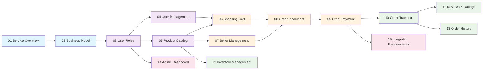

# Comprehensive Table of Contents - E-commerce Shopping Mall Platform

## Project Overview

This documentation suite provides complete requirements and specifications for developing a comprehensive e-commerce shopping mall platform. The platform enables multi-vendor marketplace operations with complete order management, payment processing, and customer engagement capabilities.

### Business Context
The shopping mall platform serves as a digital marketplace connecting sellers with customers through a secure, scalable e-commerce solution. The system supports product catalog management, transaction processing, order fulfillment, and customer relationship management.

### Documentation Scope
This documentation covers all business requirements, user scenarios, and functional specifications necessary for backend development teams to build the complete e-commerce platform. All technical implementation decisions are left to the discretion of the development team.

### Target Audience
- **Backend Developers**: Primary audience for implementation guidance
- **Product Managers**: Business requirements and feature specifications
- **System Architects**: Integration requirements and technical constraints
- **Business Stakeholders**: Business model and operational requirements

## Documentation Structure

The documentation is organized into logical groups that follow the natural flow of e-commerce operations:

### Foundation Documents (Business Context)
- [Service Overview Document](./01-service-overview.md) - Business vision, market analysis, and strategic direction
- [Business Model Document](./02-business-model.md) - Revenue strategy, pricing models, and financial projections

### Core Platform Documents (User & Product Management)
- [User Roles and Authentication Document](./03-user-roles.md) - Complete authentication system and role-based permissions
- [User Management Document](./04-user-management.md) - User account lifecycle and profile management
- [Product Catalog Document](./05-product-catalog.md) - Product organization, variants, and search functionality

### Transaction Processing Documents (Order & Payment)
- [Shopping Cart Document](./06-shopping-cart.md) - Cart management, wishlist, and pre-purchase workflows
- [Seller Management Document](./07-seller-management.md) - Seller onboarding and marketplace operations
- [Order Placement Document](./08-order-placement.md) - Order creation and validation processes
- [Order Payment Document](./09-order-payment.md) - Payment processing and financial security
- [Order Tracking Document](./10-order-tracking.md) - Order fulfillment and shipping management

### Customer Engagement Documents (Reviews & Analytics)
- [Reviews and Ratings Document](./11-reviews-ratings.md) - Customer feedback system and moderation
- [Inventory Management Document](./12-inventory-management.md) - Stock tracking and low-stock alerts
- [Order History Document](./13-order-history.md) - Order tracking and cancellation workflows

### Administrative Documents (Platform Management)
- [Admin Dashboard Document](./14-admin-dashboard.md) - Comprehensive platform administration controls
- [Integration Requirements Document](./15-integration-requirements.md) - External system integrations and API specifications

## Navigation Guide

### Recommended Reading Order

**For New Development Teams:**
1. Start with [Service Overview](./01-service-overview.md) for business context
2. Review [User Roles](./03-user-roles.md) for authentication requirements
3. Study [Product Catalog](./05-product-catalog.md) for core product management
4. Understand [Order Payment](./09-order-payment.md) for transaction processing
5. Review [Integration Requirements](./15-integration-requirements.md) for technical constraints

**For Business Stakeholders:**
1. [Service Overview](./01-service-overview.md) - Business strategy and vision
2. [Business Model](./02-business-model.md) - Revenue and financial projections
3. [Seller Management](./07-seller-management.md) - Marketplace operations
4. [Admin Dashboard](./14-admin-dashboard.md) - Platform management capabilities

**For Technical Implementation:**
1. [User Roles](./03-user-roles.md) - Authentication and authorization foundation
2. [Product Catalog](./05-product-catalog.md) - Core data structure design
3. [Order Payment](./09-order-payment.md) - Transaction processing requirements
4. [Integration Requirements](./15-integration-requirements.md) - External system interfaces

### Quick Access Points

**Customer Journey Documentation:**
- User registration: [User Management](./04-user-management.md)
- Product discovery: [Product Catalog](./05-product-catalog.md)
- Shopping experience: [Shopping Cart](./06-shopping-cart.md)
- Order placement: [Order Placement](./08-order-placement.md)
- Payment processing: [Order Payment](./09-order-payment.md)
- Order tracking: [Order Tracking](./10-order-tracking.md)
- Review creation: [Reviews and Ratings](./11-reviews-ratings.md)

**Seller Journey Documentation:**
- Seller onboarding: [Seller Management](./07-seller-management.md)
- Product listing: [Product Catalog](./05-product-catalog.md)
- Inventory management: [Inventory Management](./12-inventory-management.md)
- Order fulfillment: [Order Tracking](./10-order-tracking.md)
- Performance analytics: [Admin Dashboard](./14-admin-dashboard.md)

**Administrative Functions:**
- User management: [User Roles](./03-user-roles.md)
- Product oversight: [Product Catalog](./05-product-catalog.md)
- Order supervision: [Order History](./13-order-history.md)
- System configuration: [Admin Dashboard](./14-admin-dashboard.md)
- Integration management: [Integration Requirements](./15-integration-requirements.md)

## Document Relationships

### Core Dependencies

### Information Flow

The documentation follows a logical progression from business strategy to technical implementation:

1. **Business Foundation** (Documents 01-02): Establishes why the platform exists and how it generates revenue
2. **Platform Core** (Documents 03-05): Defines who uses the platform and what they manage
3. **Transaction Engine** (Documents 06-10): Specifies how buying and selling operations work
4. **Customer Experience** (Documents 11-13): Details post-purchase engagement and support
5. **Administration & Integration** (Documents 14-15): Covers platform management and external connections

### Cross-Referencing Conventions

All documents follow consistent linking patterns:
- **Business requirements** reference foundational documents
- **Technical specifications** reference integration requirements
- **User scenarios** reference both user management and functional documents
- **Administrative functions** reference all relevant operational documents

## Quick Reference Guide

### For Development Teams

**Start Here for Implementation:**
- Authentication: [User Roles Document](./03-user-roles.md)
- Product Data: [Product Catalog Document](./05-product-catalog.md)
- Transactions: [Order Payment Document](./09-order-payment.md)

**Critical Business Rules:**
- User permissions defined in [User Roles](./03-user-roles.md)
- Product variant rules in [Product Catalog](./05-product-catalog.md)
- Order validation in [Order Placement](./08-order-placement.md)
- Payment security in [Order Payment](./09-order-payment.md)

### For Business Teams

**Key Business Documents:**
- Strategy: [Service Overview](./01-service-overview.md)
- Revenue: [Business Model](./02-business-model.md)
- Operations: [Seller Management](./07-seller-management.md)
- Analytics: [Admin Dashboard](./14-admin-dashboard.md)

### For New Team Members

**Onboarding Path:**
1. Read [Service Overview](./01-service-overview.md) for context
2. Understand [User Roles](./03-user-roles.md) for platform structure
3. Review [Product Catalog](./05-product-catalog.md) for core functionality
4. Study [Order Payment](./09-order-payment.md) for transaction flow

### Emergency Reference

**Common Scenarios Quick Links:**
- User authentication issues: [User Roles](./03-user-roles.md)
- Product display problems: [Product Catalog](./05-product-catalog.md)
- Order processing errors: [Order Placement](./08-order-placement.md)
- Payment failures: [Order Payment](./09-order-payment.md)
- Shipping tracking: [Order Tracking](./10-order-tracking.md)
- Inventory discrepancies: [Inventory Management](./12-inventory-management.md)

## Document Maintenance

This table of contents is maintained to reflect the current state of all documentation. Each document contains complete business requirements that provide backend developers with the necessary context to implement the e-commerce platform according to established business needs.

### Version Control and Updates

**Document Version Tracking:**
- Each document maintains a version history with change logs
- Major updates trigger notification to relevant stakeholders
- Cross-document references are updated when related documents change

**Quality Assurance Process:**
- All documents undergo peer review before publication
- Technical accuracy verification by development team leads
- Business requirement validation by product management
- Regular content audits to ensure information remains current

### Contribution Guidelines

**Document Authoring Standards:**
- Consistent formatting and structure across all documents
- Clear, actionable requirements using EARS format
- Proper linking between related documents
- Comprehensive examples and edge case coverage

**Review and Approval Workflow:**
1. Document draft creation by subject matter experts
2. Technical review by development team
3. Business validation by product managers
4. Final approval by project stakeholders
5. Publication and distribution to all team members

## Performance and Scalability Considerations

### Documentation Performance Requirements

The documentation system shall support:
- **Concurrent Access**: 100+ simultaneous users accessing documentation
- **Search Performance**: Sub-second response times for document searches
- **Cross-Reference Loading**: Immediate loading of linked documents
- **Mobile Accessibility**: Responsive design for mobile device access

### Scalability for Future Expansion

**Modular Documentation Architecture:**
- Documents are structured to allow easy addition of new features
- Clear separation between business requirements and technical specifications
- Scalable referencing system for growing document collections

**Internationalization Readiness:**
- Documentation structure supports multiple language versions
- Clear separation of content from presentation for translation
- Cultural considerations in examples and scenarios

## Integration with Development Processes

### Development Lifecycle Integration

**Requirements Traceability:**
- Each business requirement links to corresponding implementation documentation
- Clear mapping between user stories and technical specifications
- Version control integration for documentation changes

**Agile Development Support:**
- Documentation organized by feature epics and user stories
- Sprint planning integration with document updates
- Continuous documentation updates aligned with development sprints

### Testing and Quality Assurance

**Documentation Testing Requirements:**
- All references and links are validated regularly
- Code examples are tested for accuracy and functionality
- Cross-document consistency is verified automatically
- Requirements completeness is validated against implementation

## Security and Access Control

### Documentation Security

**Access Control Requirements:**
- Role-based access to sensitive technical documentation
- Audit trails for documentation access and modifications
- Secure storage for confidential business information

**Information Classification:**
- Public documentation for general platform information
- Internal documentation for development team use
- Confidential documentation for business strategy and financials

### Compliance and Regulations

**Regulatory Documentation Requirements:**
- Data protection compliance documentation (GDPR, CCPA)
- Payment industry compliance (PCI DSS) documentation
- Industry-specific regulatory requirements
- Legal and contractual obligation documentation

## Success Metrics and Monitoring

### Documentation Effectiveness Metrics

**Usage Analytics:**
- Document access frequency and patterns
- Search query analysis for content gaps
- User feedback and satisfaction ratings
- Time spent per document and section

**Quality Metrics:**
- Documentation completeness scores
- Link accuracy and reference validation
- User-reported issues and resolution time
- Peer review feedback and improvement rates

### Continuous Improvement Process

**Feedback Collection Mechanisms:**
- In-document feedback forms and rating systems
- Regular user surveys and interviews
- Analytics-driven content optimization
- Stakeholder review cycles

**Improvement Implementation:**
- Quarterly documentation review and update cycles
- Content gap analysis based on user behavior
- Technology stack updates and migration planning
- User experience optimization based on feedback

> *Developer Note: This document provides the foundational structure for the entire e-commerce platform documentation suite. All technical implementations (architecture, APIs, database design, etc.) are at the discretion of the development team based on the business requirements outlined in the referenced documents.*