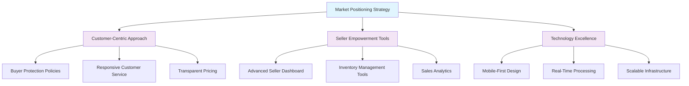

# E-commerce Shopping Mall Platform - Service Overview

## Executive Summary

This document defines the comprehensive business requirements for a feature-rich e-commerce shopping mall platform designed to serve both individual consumers and business sellers. The platform aims to create a seamless online marketplace where customers can discover, purchase, and track products while sellers can efficiently manage their inventory, pricing, and fulfillment operations.

**Platform Vision**: To become the leading multi-vendor e-commerce marketplace that combines robust marketplace functionality with exceptional user experience for both buyers and sellers.

**Core Value**: WHEN customers use the platform, THE system SHALL provide a comprehensive e-commerce solution that enables seamless transactions between buyers and sellers while maintaining transparency, security, and reliability throughout the entire shopping journey.

## Business Vision & Mission

### Mission Statement
WHEN building the platform, THE system SHALL create an inclusive digital marketplace that empowers sellers to reach wider audiences while providing customers with convenient access to diverse products through a secure, intuitive, and reliable shopping experience.

### Vision Statement
WHEN fully operational, THE platform SHALL become the preferred e-commerce destination by offering unparalleled product variety, competitive pricing, and exceptional customer service that builds long-term loyalty among both buyers and sellers.

### Strategic Goals
1. **Marketplace Growth**: WHEN launching the platform, THE business SHALL achieve 10,000 active sellers and 100,000 registered customers within the first year of operation.
2. **Transaction Volume**: WHILE operating, THE platform SHALL process a minimum of 1,000 daily transactions by the end of year one.
3. **Customer Satisfaction**: WHERE customer feedback is collected, THE platform SHALL maintain a customer satisfaction rating above 4.5/5.0.
4. **Seller Success**: WHEN onboarding sellers, THE platform SHALL ensure that 80% of active sellers achieve profitable operations within six months.

## Target Market Analysis

### Primary Customer Segments

#### Individual Consumers
- **Demographics**: Age 18-65, urban and suburban residents
- **Shopping Behavior**: Value convenience, product variety, and competitive pricing
- **Technology Adoption**: Comfortable with mobile and web shopping platforms
- **Key Needs**: Safe transactions, reliable delivery, easy returns, and responsive customer service

**EARS Requirements for Customer Experience**:
- WHEN customers browse products, THE system SHALL provide advanced search and filtering capabilities
- WHERE customers add items to cart, THE system SHALL maintain cart contents across sessions
- IF customers encounter issues, THE system SHALL provide 24/7 customer support

#### Small to Medium Business Sellers
- **Profile**: Entrepreneurs, small manufacturers, local retailers, artisans
- **Business Needs**: Cost-effective sales channels, inventory management tools, payment processing
- **Technical Requirements**: User-friendly seller dashboard, integration capabilities, reporting tools

**EARS Requirements for Seller Experience**:
- WHEN sellers list products, THE system SHALL provide comprehensive product management tools
- WHERE sellers need analytics, THE system SHALL offer real-time sales performance dashboards
- IF sellers require support, THE system SHALL provide dedicated seller assistance

### Market Positioning

## Competitive Landscape

### Direct Competitors Analysis
WHEN analyzing competitors, THE platform SHALL differentiate itself through:

**Product Discovery**: WHILE competitors focus on algorithmic recommendations, THE platform SHALL emphasize curated collections and seller-branded storefronts.

**Seller Support**: WHERE traditional marketplaces offer limited seller tools, THE platform SHALL provide comprehensive inventory management, analytics, and marketing support.

**Customer Experience**: IF competitors prioritize transaction volume, THEN THE platform SHALL focus on relationship-building and personalized shopping experiences.

### Unique Value Propositions

1. **Multi-Vendor Marketplace**: A centralized platform connecting diverse sellers with targeted customers
2. **Comprehensive Seller Tools**: Advanced inventory management, pricing optimization, and sales analytics
3. **Customer Protection**: Rigorous seller verification, secure payment processing, and transparent policies
4. **Mobile-First Design**: Optimized shopping experience across all device types

## Core Value Proposition

### For Customers
WHEN customers use the platform, THE system SHALL provide:
- **Product Discovery**: Advanced search, filtering, and personalized recommendations
- **Secure Transactions**: Multiple payment options with fraud protection
- **Convenient Shopping**: Guest checkout, saved carts, and wishlist functionality
- **Transparent Tracking**: Real-time order status and delivery updates
- **Community Engagement**: Product reviews, ratings, and seller interactions

**Specific Customer Requirements**:
- WHEN customers search for products, THE system SHALL return results within 2 seconds
- WHERE customers add items to cart, THE system SHALL maintain cart accuracy across devices
- IF payment processing fails, THE system SHALL provide clear error messages and alternative options

### For Sellers
WHEN sellers join the platform, THE system SHALL offer:
- **Market Access**: Immediate exposure to a growing customer base
- **Business Tools**: Inventory management, pricing analytics, and sales reporting
- **Payment Security**: Reliable payment processing and timely settlements
- **Brand Building**: Customizable storefronts and customer relationship management
- **Operational Support**: Shipping integration, customer service coordination

**Specific Seller Requirements**:
- WHEN sellers list products, THE system SHALL support SKU-based variant management
- WHERE sellers need analytics, THE system SHALL provide real-time sales dashboards
- IF inventory levels drop below threshold, THE system SHALL send automated alerts

### For Administrators
WHILE managing the platform, THE system SHALL enable:
- **Comprehensive Oversight**: Holistic view of platform operations and performance
- **User Management**: Seller verification, customer support, and dispute resolution
- **System Configuration**: Flexible platform settings and feature management
- **Analytics Dashboard**: Business intelligence and performance monitoring

## Business Model & Revenue Strategy

### Primary Revenue Streams

#### Seller Commission Model
WHEN a transaction is completed, THE platform SHALL collect a commission based on:
- **Transaction Value**: Percentage-based commission on sale price
- **Seller Tier**: Different commission rates for standard and premium seller accounts
- **Product Category**: Variable rates based on product type and margin structure

**Commission Structure Details**:
| Product Category | Standard Commission | Premium Seller Discount |
|------------------|-------------------|------------------------|
| Electronics | 8% | 15% discount |
| Fashion | 10% | 20% discount |
| Home Goods | 7% | 15% discount |
| Other Categories | 9% | 18% discount |

#### Premium Seller Services
WHERE sellers require advanced features, THE platform SHALL offer:
- **Enhanced Storefronts**: Customizable branding and marketing tools
- **Advanced Analytics**: Detailed sales performance and customer insights
- **Priority Support**: Dedicated account management and expedited issue resolution
- **Marketing Services**: Featured listings and promotional opportunities

#### Value-Added Services
THE platform SHALL generate additional revenue through:
- **Payment Processing Fees**: Transaction fees for certain payment methods
- **Shipping Services**: Shipping label sales and logistics coordination
- **Advertising Revenue**: Sponsored product placements and banner advertising
- **Data Analytics**: Anonymous shopping data for market research

### Pricing Strategy

#### Customer-Facing Pricing
THE platform SHALL ensure:
- **Transparent Pricing**: No hidden fees or unexpected charges
- **Competitive Positioning**: Market-aligned pricing across product categories
- **Value Communication**: Clear justification of pricing through quality and service guarantees

#### Seller-Facing Pricing
THE platform SHALL implement:
- **Tiered Commission Structure**: Lower fees for higher-volume sellers
- **Service-Based Pricing**: Clear pricing for premium features and services
- **Performance Incentives**: Reduced fees for sellers maintaining high customer satisfaction

## Success Metrics & KPIs

### Financial Performance Metrics
THE platform SHALL track:
- **Monthly Recurring Revenue (MRR)**: Growth in subscription and commission revenue
- **Average Order Value (AOV)**: Trends in transaction size and customer spending
- **Customer Lifetime Value (CLV)**: Long-term revenue potential per customer
- **Seller Retention Rate**: Percentage of sellers maintaining active operations

**Specific KPI Targets**:
- **Year 1 MRR Target**: $50,000 monthly recurring revenue
- **AOV Goal**: Increase from $75 to $100 within first year
- **CLV Target**: Achieve $500+ customer lifetime value
- **Seller Retention**: Maintain 85% seller retention rate

### Operational Performance Metrics
THE platform SHALL monitor:
- **Platform Uptime**: System availability and reliability (target: 99.9%)
- **Transaction Success Rate**: Percentage of completed vs attempted transactions
- **Customer Support Response Time**: Average time to resolve customer inquiries
- **Order Fulfillment Accuracy**: Percentage of orders delivered correctly and on time

### User Engagement Metrics
THE platform SHALL measure:
- **Monthly Active Users (MAU)**: Growth in platform engagement
- **Customer Conversion Rate**: Percentage of visitors completing purchases
- **Customer Satisfaction Score (CSAT)**: Direct feedback on shopping experience
- **Net Promoter Score (NPS)**: Customer loyalty and referral likelihood

## Growth Strategy & Timeline

### Phase 1: Foundation Building (Months 1-3)
THE platform SHALL focus on:
- **Core Platform Development**: Essential e-commerce functionality
- **Seller Onboarding**: Initial seller recruitment and store setup
- **Market Testing**: Limited geographic launch and user feedback collection
- **Payment Integration**: Secure payment gateway implementation

**Phase 1 Milestones**:
- Complete platform development by end of month 2
- Onboard 100+ sellers during month 3
- Achieve 1,000+ registered customers
- Process 100+ daily transactions

### Phase 2: Market Expansion (Months 4-6)
THE platform SHALL execute:
- **Feature Enhancement**: Advanced search, recommendations, and mobile optimization
- **Seller Growth**: Expanded seller recruitment and category diversification
- **Marketing Campaigns**: Targeted customer acquisition and brand awareness
- **Performance Optimization**: Platform scaling and performance improvements

**Phase 2 Milestones**:
- Expand to 500+ active sellers
- Achieve 10,000+ registered customers
- Process 500+ daily transactions
- Launch mobile applications

### Phase 3: Scalability & Innovation (Months 7-12)
THE platform SHALL implement:
- **Advanced Features**: AI-powered recommendations, predictive analytics
- **International Expansion**: Multi-currency and multi-language support
- **Partner Integration**: Logistics, CRM, and analytics partnerships
- **Mobile App Launch**: Dedicated mobile applications for iOS and Android

**Phase 3 Milestones**:
- Reach 1,000+ active sellers
- Achieve 50,000+ registered customers
- Process 1,000+ daily transactions
- Expand to 2+ international markets

### Long-Term Vision (Year 2+)
THE platform SHALL pursue:
- **Market Leadership**: Becoming the dominant player in target segments
- **Technology Innovation**: Continuous platform enhancement and feature development
- **Global Expansion**: Entering new international markets
- **Ecosystem Development**: Building comprehensive seller and customer support services

## Technology Infrastructure Requirements

### Platform Architecture
THE platform SHALL be built on:
- **Scalable Cloud Infrastructure**: Elastic computing resources for traffic fluctuations
- **Microservices Architecture**: Modular design for independent feature development
- **API-First Approach**: Clean integration interfaces for third-party services
- **Mobile-Responsive Design**: Optimal experience across all device types

**Specific Technical Requirements**:
- **Database Performance**: Support 10,000+ concurrent users with sub-second response times
- **API Response Time**: All API endpoints shall respond within 200ms
- **Mobile Optimization**: Progressive Web App capabilities for native-like experience
- **Security Framework**: End-to-end encryption and comprehensive access controls

### Security & Compliance
THE platform SHALL ensure:
- **Payment Card Industry (PCI) Compliance**: Secure handling of payment information
- **Data Privacy Protection**: GDPR and regional data protection compliance
- **Seller Verification**: Rigorous authentication and fraud prevention measures
- **Transaction Security**: End-to-end encryption and secure communication protocols

**Security Implementation Details**:
- Implement multi-factor authentication for all administrative access
- Conduct regular security audits and penetration testing
- Maintain comprehensive audit trails for all financial transactions
- Establish incident response procedures for security breaches

## Risk Assessment & Mitigation

### Technical Risks
IF platform performance degrades during peak traffic, THEN THE system SHALL:
- Implement auto-scaling infrastructure to handle traffic spikes
- Deploy content delivery network (CDN) for global performance
- Establish performance monitoring and alerting systems
- Conduct regular load testing to identify capacity limits

### Business Risks
WHEN seller quality varies significantly, THE platform SHALL:
- Implement seller rating and verification systems
- Provide seller education and support resources
- Establish clear performance standards and consequences
- Monitor seller performance metrics continuously

### Market Risks
WHILE competition intensifies, THE platform SHALL:
- Continuously innovate and enhance user experience
- Build strong seller and customer relationships
- Maintain competitive pricing and commission structures
- Differentiate through superior service and reliability

**Risk Mitigation Matrix**:
| Risk Category | Risk Level | Mitigation Strategy | Responsibility |
|--------------|------------|-------------------|---------------|
| Technical Failure | High | Redundant systems, automated backups | CTO |
| Security Breach | High | Multi-layer security, regular audits | Security Team |
| Seller Fraud | Medium | Verification processes, monitoring | Operations |
| Market Competition | Medium | Continuous innovation, customer focus | Product Team |
| Regulatory Changes | Medium | Compliance monitoring, legal counsel | Legal Team |

## Integration Requirements

### Third-Party Service Integration
THE platform SHALL integrate with essential third-party services including:

**Payment Processing**:
- Stripe for credit card payments
- PayPal for alternative payment methods
- Bank transfer processing systems
- Digital wallet integrations

**Shipping and Logistics**:
- UPS, FedEx, DHL carrier integrations
- Real-time shipping rate calculations
- Package tracking and delivery notifications
- International shipping compliance

**Customer Communication**:
- Email service providers for transactional emails
- SMS gateways for order notifications
- Push notification services for mobile alerts
- Customer support ticketing systems

**Implementation Timeline**:
- Phase 1: Core payment and email integration (Month 1)
- Phase 2: Shipping carrier integration (Month 2-3)
- Phase 3: Advanced analytics and marketing tools (Month 4-6)
- Phase 4: International expansion integrations (Month 7-12)

## Conclusion

This enhanced service overview document provides comprehensive business requirements for developing a modern e-commerce marketplace platform. The requirements focus on creating value for all stakeholders while ensuring technical feasibility and business sustainability.

**Key Success Factors**:
- Customer-centric design with intuitive user experience
- Robust seller tools for efficient business management
- Scalable technology infrastructure for growth
- Comprehensive security and compliance framework
- Data-driven decision making through analytics

**Implementation Priority**:
1. Core platform functionality and user authentication
2. Seller onboarding and product management tools
3. Payment processing and order management
4. Advanced features and international expansion

THE platform's success SHALL be measured by its ability to create sustainable value for customers, sellers, and platform operators while maintaining competitive advantage through continuous innovation and superior service delivery.

> *Developer Note: This document defines **business requirements only**. All technical implementations (architecture, APIs, database design, etc.) are at the discretion of the development team.*