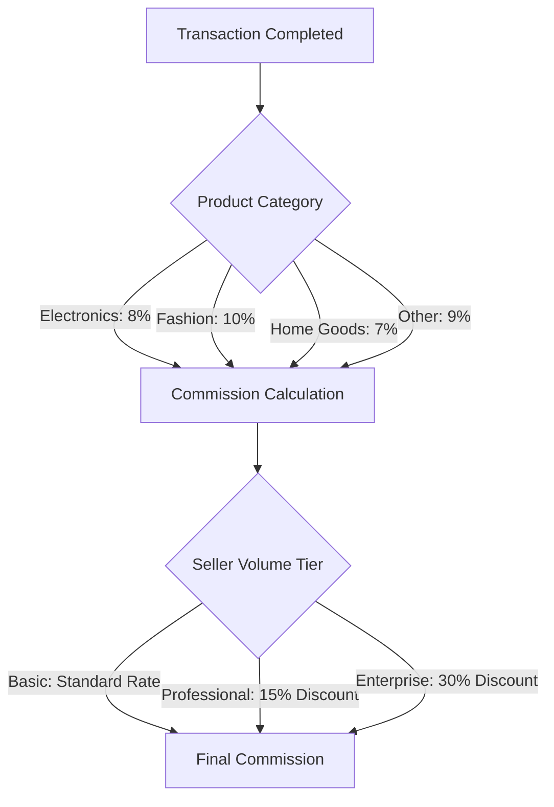
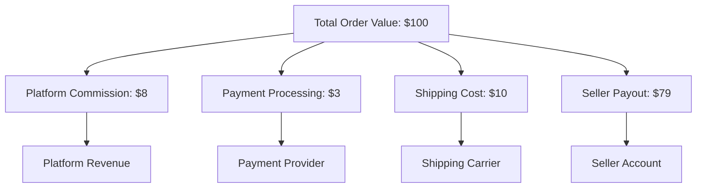

# E-commerce Shopping Mall Platform - Business Model Requirements

## Executive Summary

This document defines the comprehensive business model for the shoppingMall e-commerce platform, establishing a sustainable marketplace that connects sellers with customers through a robust, secure, and scalable digital commerce environment. The platform operates on a multi-sided marketplace model, generating revenue through seller commissions, payment processing fees, and premium services while providing value to all stakeholders through efficient operations and customer-centric features.

## Business Vision & Strategic Objectives

**THE platform SHALL** create a sustainable digital marketplace ecosystem where sellers can efficiently reach customers and customers can discover quality products through a trusted shopping experience.

**WHEN fully operational, THE platform SHALL** achieve market leadership through superior user experience, competitive pricing, and comprehensive seller support tools.

## Revenue Generation Strategy

### Primary Revenue Streams

**1. Seller Commission Structure**
- **WHEN a transaction is completed, THE platform SHALL** collect a commission based on transaction value and seller category
- **THE commission rates SHALL** be tiered based on seller performance and transaction volume
- **WHERE sellers achieve premium status, THE platform SHALL** offer reduced commission rates in exchange for subscription fees

**Detailed Commission Structure:**

**Volume-Based Discount Schedule:**
- **WHEN sellers achieve monthly sales exceeding $10,000, THE platform SHALL** apply 15% commission discount
- **WHERE monthly sales exceed $50,000, THE system SHALL** apply 30% commission discount
- **IF sellers maintain premium performance for 6 consecutive months, THEN THE platform SHALL** offer permanent discounted rates

**2. Payment Processing Revenue**
- **WHEN transactions are processed through platform payment gateways, THE system SHALL** earn processing fees
- **THE payment processing fees SHALL** be structured as 2.9% of transaction value plus $0.30 per transaction
- **WHERE alternative payment methods are used, THE platform SHALL** apply differential fee structures based on cost and convenience

**3. Premium Seller Services**
- **WHERE sellers require enhanced features, THE platform SHALL** offer premium subscription tiers
- **THE premium features SHALL** include advanced analytics, marketing tools, and priority support
- **Subscription pricing SHALL** be based on seller size and feature requirements

**Premium Service Tiers:**
| Feature | Basic Tier | Professional Tier | Enterprise Tier |
|---------|------------|------------------|----------------|
| Monthly Fee | Free | $49/month | $199/month |
| Commission Rate | Standard | 15% discount | 30% discount |
| Product Listings | 100 | Unlimited | Unlimited |
| Advanced Analytics | ❌ | ✅ | ✅ |
| Dedicated Support | ❌ | ❌ | ✅ |
| API Access | Limited | Full | Full |

**4. Advertising and Promotional Revenue**
- **THE platform SHALL** generate revenue through featured product placements and sponsored listings
- **WHEN sellers request promotional exposure, THE system SHALL** offer tiered advertising packages
- **Advertising pricing SHALL** be based on impression counts, click-through rates, and conversion performance

**Advertising Package Structure:**
- **Basic Package**: $99/month - Featured product placement in category listings
- **Professional Package**: $299/month - Homepage banner placement plus category features
- **Enterprise Package**: $799/month - Comprehensive marketing campaign with performance analytics

### Revenue Optimization Features

**Dynamic Pricing Strategy**
- **WHEN market conditions change, THE platform SHALL** adjust commission rates and fees accordingly
- **Seasonal promotions and volume-based discounts SHALL** be available to high-performing sellers
- **Competitive pricing analysis SHALL** inform platform fee structures and strategic adjustments

## Cost Structure Analysis

### Fixed Operational Costs

**Platform Infrastructure Costs**
- **THE platform SHALL** maintain scalable cloud hosting infrastructure with estimated monthly costs of $15,000-$25,000
- **Security and compliance requirements SHALL** drive infrastructure investment decisions
- **Monthly infrastructure costs SHALL** be optimized based on transaction volume and user growth

**Personnel and Operations Costs**
- **Customer support team SHALL** handle user inquiries and dispute resolution with estimated annual cost of $500,000
- **Technical operations team SHALL** maintain platform stability and performance with estimated cost of $750,000 annually
- **Administrative staff SHALL** manage seller onboarding and compliance monitoring with estimated cost of $300,000 annually

### Variable Transaction Costs

**Payment Processing Expenses**
- **Payment gateway fees SHALL** average 2.9% of transaction value plus $0.30 per transaction
- **WHEN using third-party payment processors, THE platform SHALL** incur processing costs ranging from 1.5% to 3.5%
- **Fraud detection and prevention services SHALL** represent ongoing operational expenses of approximately $100,000 annually

**Customer Acquisition Costs**
- **Marketing and advertising expenses SHALL** be allocated for user acquisition with target CAC of $25 per customer
- **Customer retention programs SHALL** have dedicated budget allocation of $200,000 annually
- **Referral programs and incentives SHALL** be budgeted for organic growth with estimated cost of $150,000 annually

## Pricing Models & Strategies

### Commission-Based Pricing

**Standard Commission Structure**
- **Electronics Category**: 8% commission on sale value
- **Fashion Category**: 10% commission on sale value
- **Home Goods Category**: 7% commission on sale value
- **Other Categories**: 9% commission on sale value

**Volume-Based Discounts**
- **WHEN sellers achieve monthly sales thresholds, THE platform SHALL** apply commission discounts
- **Tiered discount structure SHALL** reward high-volume sellers with reduced rates
- **Discount thresholds SHALL** be reviewed quarterly based on platform performance

### Subscription Tiers for Sellers

| Feature | Basic Tier | Professional Tier | Enterprise Tier |
|---------|------------|------------------|----------------|
| Monthly Fee | Free | $49/month | $199/month |
| Commission Rate | Standard | 15% discount | 30% discount |
| Product Listings | 100 | Unlimited | Unlimited |
| Advanced Analytics | ❌ | ✅ | ✅ |
| Dedicated Support | ❌ | ❌ | ✅ |
| API Access | Limited | Full | Full |

## Payment Processing Framework

### Financial Transaction Requirements

**Payment Method Integration**
- **THE platform SHALL** support multiple payment methods including credit cards, digital wallets, and bank transfers
- **Payment gateway integrations SHALL** be selected based on reliability, cost, and geographic coverage
- **Fraud detection systems SHALL** be integrated with all payment processing workflows

**Transaction Security Requirements**
- **ALL payment transactions SHALL** be encrypted using industry-standard security protocols
- **Payment data SHALL** never be stored on platform servers in plain text
- **PCI DSS compliance SHALL** be maintained for all payment processing operations

### Settlement and Payout Processes

**Seller Payout Schedule**
- **WHEN orders are successfully delivered, THE platform SHALL** release funds to sellers
- **Payout cycles SHALL** occur on a bi-weekly basis with minimum payout threshold of $100
- **Seller payment preferences SHALL** be configurable for different payout methods

**Dispute and Chargeback Handling**
- **IF payment disputes occur, THE platform SHALL** have clear resolution procedures
- **Chargeback fees SHALL** be allocated based on dispute resolution outcomes
- **Seller protection policies SHALL** define liability for fraudulent transactions

## Commission & Fee Structure

### Detailed Fee Components

**Transaction Commission Breakdown**
| Fee Component | Calculation Method | Responsibility |
|---------------|-------------------|----------------|
| Platform Commission | Percentage of sale value | Seller |
| Payment Processing | Percentage + fixed fee | Shared |
| Shipping Fees | Based on carrier rates | Customer |
| Tax Collection | Based on jurisdiction | Platform |

**Additional Service Fees**
- **Premium listing features SHALL** have additional placement fees
- **Cross-promotion services SHALL** be available for featured product placement
- **Analytics and reporting tools SHALL** have tiered pricing based on feature depth

### Revenue Sharing Model

**Platform-Seller Revenue Distribution**

## Financial Projections

### Revenue Growth Targets

**Year 1 Financial Objectives**
- Achieve 1,000 active sellers on the platform
- Process $5 million in gross merchandise volume (GMV)
- Generate $400,000 in platform revenue
- Maintain customer acquisition cost below $25 per user

**Year 2 Growth Projections**
- Expand to 5,000 active sellers
- Increase GMV to $25 million
- Achieve platform revenue of $2 million
- Reduce customer acquisition cost to $15 per user

**Year 3 Expansion Targets**
- Reach 15,000 active sellers
- Process $75 million in GMV
- Generate $6 million in platform revenue
- Achieve profitability with 15% net margin

### Key Performance Indicators (KPIs)

**Financial KPIs**
- Gross Merchandise Volume (GMV) growth rate: Target 150% year-over-year
- Average Order Value (AOV) trends: Target $85-$95 range
- Customer Lifetime Value (CLV) calculations: Target $500+
- Seller retention and churn rates: Target <10% annual churn
- Platform commission yield percentage: Target 8-10%

**Operational KPIs**
- Transaction success rate: Target >98%
- Payment processing time: Target <5 seconds
- Seller payout accuracy: Target 99.9%
- Customer dispute resolution time: Target <24 hours
- Platform uptime and reliability: Target 99.9%

## Risk Assessment & Mitigation

### Financial Risks

**Revenue Concentration Risk**
- **IF platform becomes dependent on a small number of high-volume sellers, THE business SHALL** implement diversification strategies
- **Seller tiering and incentive programs SHALL** encourage broad seller participation
- **Risk mitigation plans SHALL** include seller relationship management protocols

**Payment Fraud Risk**
- **WHEN fraudulent transactions occur, THE platform SHALL** have detection and prevention systems
- **Fraud monitoring SHALL** be continuous with real-time transaction analysis
- **Seller education programs SHALL** reduce vulnerability to fraud attempts

### Operational Risks

**Platform Stability Requirements**
- **THE platform SHALL** maintain 99.9% uptime for core shopping functionality
- **Backup systems SHALL** be in place for payment processing failures
- **Disaster recovery plans SHALL** ensure business continuity during system outages

**Regulatory Compliance Risks**
- **Tax collection requirements SHALL** vary by jurisdiction and product category
- **Data privacy regulations SHALL** be strictly followed for all user information
- **International expansion SHALL** consider local e-commerce regulations

### Market Risks

**Competitive Pressure Risk**
- **WHILE competition intensifies, THE platform SHALL** continuously innovate and enhance user experience
- **Strong seller and customer relationships SHALL** be built to maintain competitive advantage
- **Competitive pricing and commission structures SHALL** be maintained

## Scalability Considerations

### Growth Strategy Implementation

**Infrastructure Scalability**
- **WHEN transaction volume increases, THE platform SHALL** scale infrastructure automatically
- **Cloud-based architecture SHALL** support elastic resource allocation
- **Database performance SHALL** be optimized for high-volume transaction processing

**International Expansion Planning**
- **WHERE market opportunities exist, THE platform SHALL** support multiple currencies and languages
- **Cross-border shipping and tax calculations SHALL** be integrated for global operations
- **Local payment methods SHALL** be supported in target expansion markets

### Long-term Financial Planning

**Investment Requirements**
- **Initial platform development SHALL** require seed funding for 12-18 months of operations
- **Growth capital SHALL** be allocated for marketing and user acquisition
- **Technology infrastructure investments SHALL** be planned for scalability

**Profitability Timeline**
- **THE platform SHALL** achieve breakeven within 24 months of operation
- **Operating margins SHALL** improve through scale efficiencies and automation
- **Investor return expectations SHALL** be aligned with platform growth milestones

## Success Metrics and Monitoring

### Financial Performance Tracking

**Revenue Quality Metrics**
- Revenue diversity across seller categories and product types
- Customer repeat purchase rates and loyalty program effectiveness
- Average commission rates and fee structure optimization

**Cost Efficiency Measures**
- Customer acquisition cost relative to customer lifetime value
- Platform infrastructure costs as percentage of revenue
- Operational efficiency improvements through automation

### Business Health Indicators

**Marketplace Balance Metrics**
- Seller-to-customer ratio and transaction volume distribution
- Product category diversity and seasonal sales patterns
- Customer satisfaction scores and net promoter scores

**Growth Sustainability Indicators**
- Month-over-month growth rates for sellers and customers
- Geographic expansion progress and market penetration
- Technology adoption rates for new platform features

## Compliance and Regulatory Framework

### Financial Compliance Requirements

**Tax Collection and Reporting**
- **THE platform SHALL** comply with sales tax collection requirements in all operational jurisdictions
- **Automated tax calculation systems SHALL** be integrated for accurate tax reporting
- **Tax compliance audits SHALL** be conducted quarterly to ensure regulatory adherence

### Data Protection Compliance

**Privacy Regulation Adherence**
- **THE platform SHALL** implement GDPR compliance for European customers
- **CCPA requirements SHALL** be followed for California-based users
- **Data encryption and access controls SHALL** protect user information

### Marketplace Regulation Compliance

**Seller Verification and Monitoring**
- **Comprehensive seller verification processes SHALL** prevent fraudulent activities
- **Regular seller performance reviews SHALL** ensure marketplace quality standards
- **Dispute resolution mechanisms SHALL** protect both buyers and sellers

> *Developer Note: This document defines **business requirements only**. All technical implementations (architecture, APIs, database design, etc.) are at the discretion of the development team.*