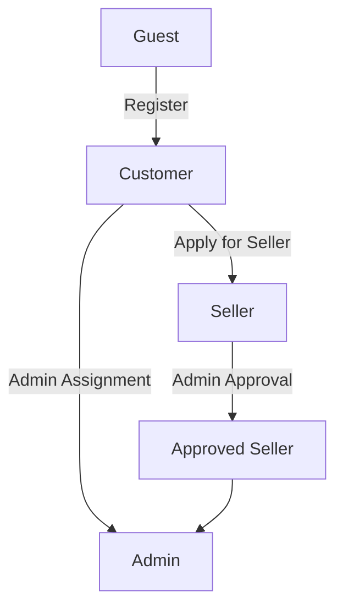

# User Roles and Authentication System

## 1. Introduction

This document defines the comprehensive user authentication and role management system for the e-commerce shopping mall platform. The system provides secure, role-based access to platform features while maintaining user privacy and data protection.

## 2. User Authentication System

### 2.1 Core Authentication Functions

**User Registration Process**

**EARS Requirements for Authentication:**
- WHEN a user attempts to register, THE system SHALL validate email format and uniqueness
- THE system SHALL require email verification before account activation
- WHEN a user logs in, THE system SHALL authenticate credentials within 2 seconds
- THE system SHALL maintain user sessions with secure token management

### 2.2 Login and Session Management

**Login Flow Requirements:**
- Users must be able to log in with email and password
- System must support "Remember Me" functionality
- Sessions must expire after 30 minutes of inactivity
- Users must be able to log out from all devices

**Password Security:**
- Passwords must be hashed using bcrypt with salt
- Minimum password length: 8 characters
- Password complexity requirements: at least 1 uppercase, 1 lowercase, 1 number
- Password reset must require email verification

## 3. Role Definitions and Hierarchy

### 3.1 Role Structure

| Role | Description | Base Permissions |
|------|-------------|-----------------|
| Guest | Unauthenticated visitors | Browse products, search catalog, view product details |
| Customer | Registered buyers | Purchase products, manage orders, write reviews |
| Seller | Product vendors | Manage products, inventory, view sales analytics |
| Admin | System administrators | Manage users, products, orders, platform configuration |

### 3.2 Role Transitions

### 3.3 Role-Specific Requirements

**Customer Role:**
- Can create and manage shopping cart
- Can add products to wishlist
- Can place orders and track shipments
- Can write product reviews and ratings
- Can manage personal addresses and payment methods

**Seller Role:**
- Can create and manage product listings
- Can set pricing and inventory levels
- Can view sales analytics and performance metrics
- Can manage order fulfillment
- Can respond to customer reviews

**Admin Role:**
- Can manage all user accounts
- Can approve or reject seller applications
- Can monitor platform performance
- Can configure system settings
- Can handle disputes and refunds

## 4. Permission Matrix

### 4.1 Comprehensive Access Control

| Feature | Guest | Customer | Seller | Admin |
|---------|-------|----------|---------|--------|
| Browse Products | ✅ | ✅ | ✅ | ✅ |
| View Product Details | ✅ | ✅ | ✅ | ✅ |
| Search Catalog | ✅ | ✅ | ✅ | ✅ |
| Add to Cart | ❌ | ✅ | ❌ | ❌ |
| Create Wishlist | ❌ | ✅ | ❌ | ❌ |
| Place Order | ❌ | ✅ | ❌ | ❌ |
| Write Reviews | ❌ | ✅ | ❌ | ❌ |
| Manage Products | ❌ | ❌ | ✅ | ✅ |
| View Sales Analytics | ❌ | ❌ | ✅ | ✅ |
| Manage Users | ❌ | ❌ | ❌ | ✅ |
| System Configuration | ❌ | ❌ | ❌ | ✅ |

### 4.2 Detailed Permission Specifications

**Product Management Permissions:**
- WHEN a seller creates a product, THE system SHALL validate product information completeness
- THE seller SHALL be able to set product variants with different SKUs
- WHERE a product has multiple variants, THE system SHALL track inventory per SKU
- IF a seller attempts to list prohibited items, THEN THE system SHALL reject the listing

**Order Management Permissions:**
- WHILE an order is being processed, THE customer SHALL be able to track shipping status
- THE seller SHALL be able to update order fulfillment status
- WHEN an admin reviews an order, THE system SHALL display complete transaction details

## 5. Authentication Requirements

### 5.1 JWT Token Management

**Token Structure Requirements:**
- Access token expiration: 15 minutes
- Refresh token expiration: 30 days
- Token payload must include: userId, role, permissions array
- Token storage: httpOnly cookies for enhanced security

**EARS Requirements for Token Management:**
- WHEN a token expires, THE system SHALL automatically refresh using refresh token
- IF an invalid token is presented, THEN THE system SHALL return HTTP 401 Unauthorized
- THE system SHALL validate token signature and expiration on every authenticated request

### 5.2 Session Security

**Security Requirements:**
- All authentication endpoints must use HTTPS
- Session tokens must be regenerated after login
- Failed login attempts must be logged and limited
- Account lockout after 5 consecutive failed attempts
- Session data must be encrypted in storage

## 6. Profile Management

### 6.1 User Profile Requirements

**Required Profile Information:**
- Full name (first and last)
- Email address (verified)
- Phone number (optional)
- Date of birth (for age verification)
- Communication preferences

**Address Management:**
- Users must be able to add multiple shipping addresses
- Address validation must verify postal code and country
- Default address selection for faster checkout
- Address history tracking for order fulfillment

### 6.2 EARS Requirements for Profile Management

- WHEN a user updates profile information, THE system SHALL validate data format and integrity
- THE user SHALL be able to manage up to 5 shipping addresses
- WHERE a user selects a default address, THE system SHALL use it for future orders
- IF profile data violates platform policies, THEN THE system SHALL reject the update

## 7. Security Framework

### 7.1 Privacy and Data Protection

**Data Protection Requirements:**
- Personal data must be encrypted at rest and in transit
- Users must be able to request data deletion
- GDPR compliance for European users
- Data retention policies for inactive accounts

**Security Best Practices:**
- Regular security audits and penetration testing
- Input validation and sanitization on all endpoints
- Rate limiting on authentication endpoints
- Secure password reset mechanisms

### 7.2 Compliance Requirements

**Regulatory Compliance:**
- Payment Card Industry Data Security Standard (PCI DSS) compliance
- General Data Protection Regulation (GDPR) compliance
- California Consumer Privacy Act (CCPA) compliance
- Children's Online Privacy Protection Act (COPPA) compliance

## 8. Integration Requirements

### 8.1 System Integration Points

**Authentication Integration:**
- Integration with email service for verification emails
- Integration with SMS service for two-factor authentication
- Integration with payment gateway for secure transactions
- Integration with analytics for user behavior tracking

### 8.2 Error Handling and Recovery

**Authentication Error Scenarios:**
- WHEN network connectivity is lost during authentication, THE system SHALL provide clear error messages
- IF user credentials are incorrect, THEN THE system SHALL not reveal whether email or password was wrong
- THE system SHALL provide password recovery options for locked accounts

## 9. Performance Requirements

### 9.1 Authentication Performance

**Response Time Requirements:**
- User registration: complete within 5 seconds
- User login: authenticate within 2 seconds
- Token validation: process within 100 milliseconds
- Password reset: initiate within 3 seconds

### 9.2 Scalability Requirements

**System Scalability:**
- Support for 10,000 concurrent users
- Horizontal scaling capability for authentication services
- Distributed session management for high availability
- Load balancing across authentication endpoints

## 10. Future Considerations

### 10.1 Planned Enhancements

**Authentication Features:**
- Social media login integration (Facebook, Google, Apple)
- Two-factor authentication (2FA) implementation
- Biometric authentication support
- Single sign-on (SSO) capabilities

**Role Management Enhancements:**
- Role hierarchy with inheritance
- Custom role creation for enterprise customers
- Time-based role permissions
- Granular permission controls

> *Developer Note: This document defines **business requirements only**. All technical implementations (architecture, APIs, database design, etc.) are at the discretion of the development team.*