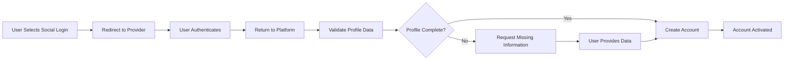
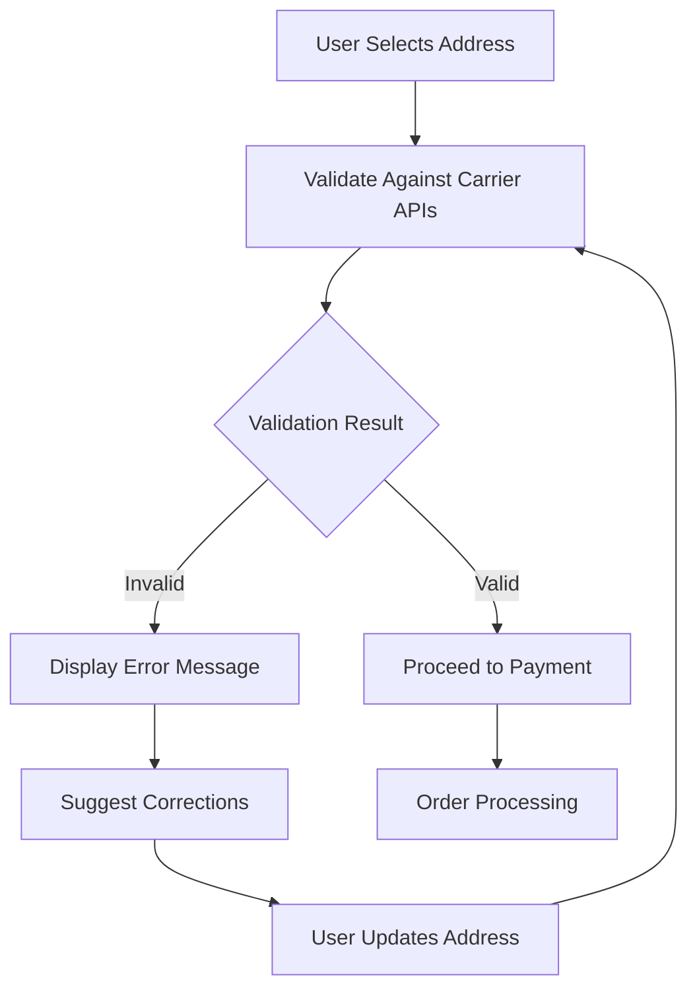

# E-commerce Shopping Mall Platform - User Management System Requirements

## 1. Executive Summary and Business Context

This document defines the complete user management system for the e-commerce shopping mall platform. The system supports comprehensive user lifecycle management from registration through account management, personalization, and eventual account closure. The platform serves four distinct user roles: Guests, Customers, Sellers, and Administrators, each with tailored account management capabilities.

### Business Justification
A robust user management system is essential for building customer trust, enabling personalized shopping experiences, and ensuring secure transactions. The system must handle complex scenarios including address management, communication preferences, and security features while maintaining regulatory compliance and data privacy standards.

## 2. User Registration and Onboarding Journey

### 2.1 User Registration Process

**WHEN a guest user initiates registration, THE system SHALL provide a secure registration form that collects:**
- Email address (required, validated format)
- Password (required, minimum 8 characters with complexity requirements)
- First name (required)
- Last name (required)
- Phone number (optional, validated format)
- Marketing communication consent (optional checkboxes)

**WHEN a user submits the registration form, THE system SHALL:**
- Validate all input fields for format and completeness
- Check for existing email address in the system
- Send email verification to the provided email address
- Create a temporary user account in a pending state

**WHEN email verification is required, THE system SHALL:**
- Send a verification email with a time-limited verification link
- Allow verification link to be valid for 24 hours
- Provide option to resend verification email
- Track verification attempts and prevent abuse

**EARS Requirements for Registration:**
- WHEN a user attempts registration with invalid email format, THEN THE system SHALL display specific format error message within 2 seconds
- THE system SHALL prevent duplicate email registration by checking existing accounts within the database
- WHERE password complexity requirements are not met, THE system SHALL provide real-time validation feedback during password entry

### 2.2 Email Verification Process

**WHEN a user clicks the verification link, THE system SHALL:**
- Validate the verification token and timestamp
- Activate the user account if verification is successful
- Redirect the user to the platform with a welcome message
- Automatically log the user into their new account

**WHEN verification fails (expired link or invalid token), THE system SHALL:**
- Display an appropriate error message
- Provide option to request a new verification email
- Maintain security by not revealing specific failure reasons

**Verification Performance Requirements:**
- THE email verification process SHALL complete within 5 seconds of link click
- Verification email delivery SHALL occur within 30 seconds of registration completion
- Account activation SHALL be immediate upon successful verification

### 2.3 Social Registration Integration

**WHERE social registration is enabled, THE system SHALL support integration with:**
- Google OAuth 2.0 authentication
- Facebook Login integration
- Apple Sign In for iOS users

**WHEN using social registration, THE system SHALL:**
- Request minimal required permissions from the social provider
- Extract and validate user profile information
- Create a platform account linked to the social identity
- Handle account linking for existing users

**Social Registration Business Rules:**
- IF social provider authentication fails, THEN THE system SHALL provide alternative registration options
- THE system SHALL validate social profile completeness and require missing mandatory information
- WHERE social profile information conflicts with platform requirements, THE system SHALL prompt for clarification

### 2.4 Initial Onboarding Experience

**WHEN a new user first logs in, THE system SHALL provide guided onboarding including:**
- Welcome tour of platform features
- Profile completion suggestions
- Address book setup prompt
- Communication preferences configuration
- Security settings recommendations

**Onboarding Completion Requirements:**
- THE onboarding process SHALL be completable within 5 minutes for average users
- Users SHALL be able to skip or defer onboarding steps
- Completion progress SHALL be saved and resumable across sessions
- WHERE users complete onboarding, THE system SHALL track completion metrics

## 3. Profile Management and Personal Information

### 3.1 Profile Information Structure

**THE user profile SHALL contain the following editable information:**
- Personal Information Section:
  - Profile picture (optional, with size and format restrictions)
  - Display name (optional, for public-facing interactions)
  - Date of birth (optional, for age verification and personalization)
  - Gender (optional, for personalization)

- Contact Information:
  - Primary email address (verified status)
  - Secondary email address (optional, verification required)
  - Mobile phone number (optional, verification available)
  - Alternative phone number (optional)

- Professional Information (for sellers):
  - Business name (required for sellers)
  - Business registration number (optional)
  - Tax identification number (optional)
  - Business address (required for sellers)

**Profile Validation Rules:**
- WHEN users update profile information, THEN THE system SHALL validate data integrity before saving
- THE system SHALL prevent profile updates that would create data inconsistencies
- WHERE profile changes affect other system components, THEN THE system SHALL trigger appropriate updates

### 3.2 Profile Update and Validation

**WHEN a user updates their profile information, THE system SHALL:**
- Validate all changes for format and consistency
- Require re-verification for email address changes
- Log all profile changes for audit purposes
- Send notification email for significant changes

**WHEN profile validation fails, THE system SHALL:**
- Provide clear error messages indicating specific validation issues
- Preserve user input to avoid data loss
- Highlight fields requiring correction

**Profile Update Performance:**
- Profile updates SHALL process within 3 seconds
- Validation errors SHALL be displayed within 1 second of form submission
- Email verification for address changes SHALL complete within 2 minutes

### 3.3 Profile Privacy Controls

**THE system SHALL provide privacy controls for:**
- Profile visibility settings (public, registered users only, private)
- Communication preferences for marketing emails
- Data sharing preferences with third parties
- Activity tracking and personalization settings

**Privacy Control Requirements:**
- WHEN users modify privacy settings, THEN THE system SHALL apply changes immediately
- THE system SHALL provide clear explanations of privacy implications for each setting
- WHERE legal requirements dictate data handling, THEN THE system SHALL enforce compliance

## 4. Address Book Management System

### 4.1 Address Types and Structure

**THE address management system SHALL support multiple address types:**
- Shipping Address (primary for order delivery)
- Billing Address (for payment processing)
- Home Address (permanent residence)
- Work Address (business location)
- Gift Address (for sending gifts to others)

**EACH address entry SHALL contain the following mandatory fields:**
- Address nickname (e.g., "Home", "Office", "Mom's House")
- Recipient name (first and last name)
- Address line 1 (street address)
- City
- State/Province
- ZIP/Postal code
- Country
- Phone number (for delivery coordination)

**OPTIONAL address fields SHALL include:**
- Address line 2 (apartment, suite, etc.)
- Company name
- Delivery instructions
- Security codes for gated communities

### 4.2 Address Validation and Management

**WHEN a user adds a new address, THE system SHALL:**
- Validate address format using postal service APIs
- Verify address existence and deliverability
- Standardize address format according to local postal standards
- Provide suggestions for address corrections

**THE system SHALL allow users to:**
- Set default shipping address
- Set default billing address
- Edit existing addresses
- Delete unused addresses (with confirmation)
- Mark addresses as inactive instead of deleting

**Address Validation Performance:**
- Address validation SHALL complete within 5 seconds using external APIs
- Address suggestions SHALL be provided in real-time during typing
- Validation failures SHALL provide specific correction guidance

### 4.3 Address Usage Scenarios

**WHEN placing an order, THE system SHALL:**
- Display saved addresses for quick selection
- Allow creation of new addresses during checkout
- Remember address preferences for future orders
- Validate address against shipping carrier coverage

**WHEN address validation fails during checkout, THE system SHALL:**
- Provide clear error messages with correction suggestions
- Allow address editing without losing order progress
- Suggest alternative addresses if available

## 5. Communication Preferences and Notifications

### 5.1 Notification Channels

**THE system SHALL support multiple communication channels:**
- Email notifications (primary channel)
- SMS/text messages (for urgent notifications)
- Push notifications (for mobile app users)
- In-app messaging
- Browser notifications

### 5.2 Notification Categories

**THE system SHALL provide configurable preferences for:**

**Order-related notifications:**
- Order confirmation and receipt
- Shipping status updates
- Delivery notifications
- Backorder and delay notifications

**Account-related notifications:**
- Password change confirmations
- Profile update notifications
- Security alerts (suspicious login attempts)
- Address change confirmations

**Marketing communications:**
- Promotional offers and discounts
- New product announcements
- Abandoned cart reminders
- Personalized recommendations

**Seller-specific notifications:**
- New order alerts
- Inventory level warnings
- Customer review notifications
- Payment processing updates

**Notification Delivery Requirements:**
- Order confirmations SHALL be delivered within 2 minutes of purchase
- Shipping updates SHALL be delivered within 1 hour of status change
- Security alerts SHALL be delivered immediately upon detection
- Marketing communications SHALL respect frequency preferences

### 5.3 Communication Frequency Controls

**USERS SHALL be able to control:**
- Notification frequency (immediate, daily digest, weekly summary)
- Preferred communication times (do-not-disturb hours)
- Channel preferences for different notification types
- Complete opt-out for marketing communications

**Communication Business Rules:**
- WHEN users modify communication preferences, THEN THE system SHALL apply changes to future communications immediately
- THE system SHALL respect legal requirements for commercial communications
- WHERE users opt out of marketing, THEN THE system SHALL maintain operational communication channels

## 6. Account Security and Authentication Features

### 6.1 Password Management

**WHEN a user creates or changes their password, THE system SHALL enforce:**
- Minimum length of 8 characters
- Complexity requirements (uppercase, lowercase, numbers, special characters)
- Password history prevention (cannot reuse last 5 passwords)
- Rate limiting on password change attempts

**WHEN a user forgets their password, THE system SHALL provide:**
- Secure password reset flow via email
- Time-limited reset tokens (valid for 1 hour)
- Clear instructions for creating a new password
- Automatic logout from all devices after password change

**Password Security Requirements:**
- Password reset emails SHALL be delivered within 1 minute of request
- Reset tokens SHALL be invalidated after use or expiration
- Multiple failed password attempts SHALL trigger account lockout
- Password strength SHALL be evaluated in real-time during creation

### 6.2 Multi-Factor Authentication (MFA)

**WHERE enhanced security is required, THE system SHALL support:**
- Time-based one-time passwords (TOTP) via authenticator apps
- SMS-based verification codes
- Backup codes for recovery
- Biometric authentication for mobile devices

**MFA SHALL be required for:**
- Administrative account access
- Sensitive account changes (email, password)
- High-value transactions
- Login from unrecognized devices

**MFA Implementation Requirements:**
- MFA setup SHALL be completable within 5 minutes
- Verification codes SHALL be delivered within 30 seconds
- Backup code generation SHALL provide secure storage options
- MFA bypass SHALL require alternative verification methods

### 6.3 Session Management

**THE system SHALL manage user sessions with the following security measures:**
- Session timeout after 30 minutes of inactivity
- Automatic logout after 24 hours of continuous activity
- Concurrent session management (limit to 5 active sessions)
- Device recognition and trust establishment

**WHEN security anomalies are detected, THE system SHALL:**
- Require re-authentication for suspicious activities
- Send security alerts for unrecognized login attempts
- Allow users to review and revoke active sessions
- Provide session activity logs for user review

**Session Security Performance:**
- Session validation SHALL occur within 100 milliseconds per request
- Security anomaly detection SHALL trigger within 10 seconds of suspicious activity
- Session revocation SHALL be immediate upon user request

### 6.4 Security Monitoring and Alerts

**THE system SHALL monitor for and alert on:**
- Multiple failed login attempts
- Login from new geographic locations
- Changes to security settings
- Unusual account activity patterns
- Potential account compromise indicators

**Security Monitoring Requirements:**
- Security alerts SHALL be delivered to users via preferred channels
- Suspicious activity SHALL trigger additional verification steps
- Security event logs SHALL be maintained for 90 days
- Incident response procedures SHALL be documented and testable

## 7. Personalization and Recommendation Engine

### 7.1 User Preference Collection

**THE system SHALL collect and utilize user preferences for personalization:**
- Explicit preferences (user-provided interests and categories)
- Implicit preferences (browsing behavior and purchase history)
- Seasonal preferences (holiday shopping patterns)
- Geographic preferences (local trends and availability)

**Preference Collection Rules:**
- WHEN users provide explicit preferences, THEN THE system SHALL prioritize these over implicit data
- Preference collection SHALL respect user privacy settings and data sharing preferences
- WHERE legal requirements restrict data collection, THEN THE system SHALL comply with limitations

### 7.2 Personalized Experience Features

**BASED ON user preferences and behavior, THE system SHALL provide:**
- Personalized product recommendations
- Tailored category browsing experience
- Customized promotional offers
- Relevant content and educational materials
- Seasonal and occasion-based suggestions

**Personalization Performance Requirements:**
- Recommendation generation SHALL complete within 2 seconds
- Personalization algorithms SHALL update based on recent user activity
- A/B testing capabilities SHALL be available for personalization optimization

### 7.3 Recommendation Algorithms

**THE recommendation engine SHALL utilize:**
- Collaborative filtering (users who bought X also bought Y)
- Content-based filtering (similar products to those viewed)
- Demographic targeting (age, location, preferences)
- Behavioral analysis (browsing patterns and purchase history)

**Algorithm Requirements:**
- Recommendation accuracy SHALL be measured and optimized regularly
- Algorithm performance SHALL scale to support 1,000,000+ users
- Real-time recommendation updates SHALL reflect current user activity

### 7.4 Personalization Controls

**USERS SHALL have control over:**
- Opt-in/opt-out for personalization features
- Reset of collected preference data
- Manual adjustment of interest categories
- Privacy settings for data collection

**Personalization Control Requirements:**
- WHEN users opt out of personalization, THEN THE system SHALL immediately stop data collection
- Preference resets SHALL be permanent and irreversible
- Category adjustments SHALL be reflected in recommendations within 1 hour
- Privacy settings SHALL override personalization features when conflicts exist

## 8. Customer Support Integration

### 8.1 Support Ticket System

**WHEN users need assistance, THE system SHALL provide:**
- Integrated help center with searchable knowledge base
- Contextual help based on user activity
- Direct contact options for urgent issues
- Ticket tracking and status updates

**Support System Requirements:**
- Ticket creation SHALL be completable within 3 minutes
- Initial response time SHALL be within 4 hours for standard issues
- Ticket resolution SHALL occur within 48 hours for non-critical issues
- Escalation procedures SHALL be available for complex problems

### 8.2 Self-Service Features

**THE system SHALL enable users to:**
- View order history and status
- Initiate returns and exchanges
- Update account information
- Manage communication preferences
- Access downloadable documents (invoices, receipts)

**Self-Service Performance:**
- Order history access SHALL load within 2 seconds
- Document downloads SHALL be available within 5 seconds
- Preference updates SHALL be applied immediately
- Return initiation SHALL follow predefined business rules

### 8.3 Escalation Procedures

**WHEN standard support cannot resolve an issue, THE system SHALL:**
- Provide clear escalation paths
- Set expectations for resolution timelines
- Maintain communication throughout the process
- Offer alternative solutions when available

**Escalation Requirements:**
- Escalation requests SHALL be processed within 2 hours
- Critical issue escalation SHALL occur within 30 minutes
- Resolution timelines SHALL be communicated clearly to users
- Multiple escalation levels SHALL be available based on issue severity

## 9. Account Lifecycle Management

### 9.1 Account Status Management

**THE system SHALL support multiple account statuses:**
- Active (fully functional account)
- Pending (awaiting email verification)
- Suspended (temporary restriction)
- Inactive (no activity for extended period)
- Closed (user-initiated deletion)

**Account Status Rules:**
- Account suspension SHALL require administrative approval
- Inactive status SHALL be applied after 180 days of inactivity
- Account closure SHALL follow data retention policies
- Status transitions SHALL trigger appropriate notifications

### 9.2 Account Reactivation

**WHEN an account becomes inactive, THE system SHALL:**
- Send reactivation reminders after 30 days of inactivity
- Provide simplified reactivation process
- Preserve user data during inactive period
- Require re-verification if necessary

**Reactivation Performance:**
- Reactivation requests SHALL be processed within 10 minutes
- Data restoration SHALL be complete within 1 hour
- Reactivation success rate SHALL be measured and optimized

### 9.3 Account Closure Process

**WHEN a user requests account deletion, THE system SHALL:**
- Require confirmation through secure channels
- Explain data retention policies clearly
- Offer data export option before deletion
- Process deletion within regulatory requirements
- Provide confirmation of completion

**Account Closure Requirements:**
- Deletion requests SHALL be processed within 72 hours
- Data export SHALL be available in standard formats
- Confirmation messages SHALL be delivered to verified contacts
- Partial data retention SHALL comply with legal requirements

## 10. Data Retention and Privacy Compliance

### 10.1 Data Retention Policies

**THE system SHALL adhere to data retention schedules:**
- Active user data: Retained while account is active
- Inactive user data: Archived after 2 years of inactivity
- Transaction records: Retained for 7 years for tax purposes
- Communication logs: Retained for 3 years

**Data Retention Implementation:**
- Archiving processes SHALL be automated and scheduled
- Data retrieval from archives SHALL be available within 24 hours
- Retention compliance SHALL be audited quarterly
- Data destruction SHALL follow secure deletion protocols

### 10.2 Privacy Compliance

**THE system SHALL comply with relevant privacy regulations including:**
- General Data Protection Regulation (GDPR)
- California Consumer Privacy Act (CCPA)
- Children's Online Privacy Protection Act (COPPA)
- Local data protection laws

**Compliance Requirements:**
- Privacy impact assessments SHALL be conducted annually
- Data processing agreements SHALL be maintained with third parties
- Privacy policy updates SHALL be communicated to users
- Compliance audits SHALL be conducted by external reviewers

### 10.3 User Data Rights

**USERS SHALL have the right to:**
- Access their personal data
- Request correction of inaccurate data
- Request deletion of personal data
- Data portability (export data in standard format)
- Object to data processing

**Data Rights Implementation:**
- Data access requests SHALL be fulfilled within 30 days
- Data correction SHALL be applied within 48 hours
- Deletion requests SHALL follow established retention policies
- Data export SHALL be available in JSON and CSV formats

### 10.4 Data Security Measures

**THE system SHALL implement security measures including:**
- Encryption of sensitive data at rest and in transit
- Regular security audits and vulnerability assessments
- Access controls and authentication requirements
- Incident response procedures for data breaches

**Security Implementation:**
- Encryption protocols SHALL meet industry standards
- Security audits SHALL be conducted quarterly
- Access controls SHALL follow principle of least privilege
- Incident response SHALL be tested semi-annually

## Success Metrics and KPIs

**THE user management system SHALL be measured by:**
- User registration completion rate (>85%)
- Email verification success rate (>90%)
- Profile completion rate (>70%)
- Address book utilization rate (>60%)
- Security incident frequency (<0.1% of users)
- Customer satisfaction scores (>4.0/5.0)
- Account reactivation rate (>30%)

## Integration Requirements

This user management system integrates with:
- Authentication system defined in [User Roles Documentation](./03-user-roles.md)
- Shopping cart functionality in [Shopping Cart Requirements](./06-shopping-cart.md)
- Order management system for address validation
- Communication systems for notifications and alerts
- Security systems for authentication and monitoring

**Integration Performance:**
- Cross-system data synchronization SHALL complete within 5 seconds
- API response times SHALL be under 2 seconds
- Integration failure recovery SHALL occur within 10 minutes
- Data consistency SHALL be maintained across all integrated systems

> *Developer Note: This document defines **business requirements only**. All technical implementations (architecture, APIs, database design, etc.) are at the discretion of the development team.*