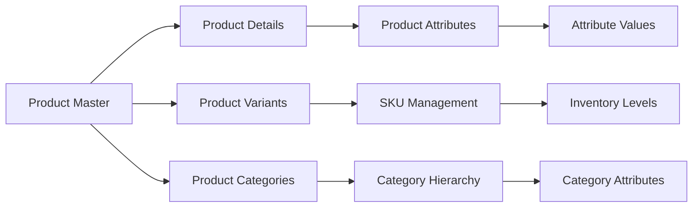
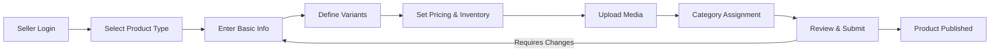
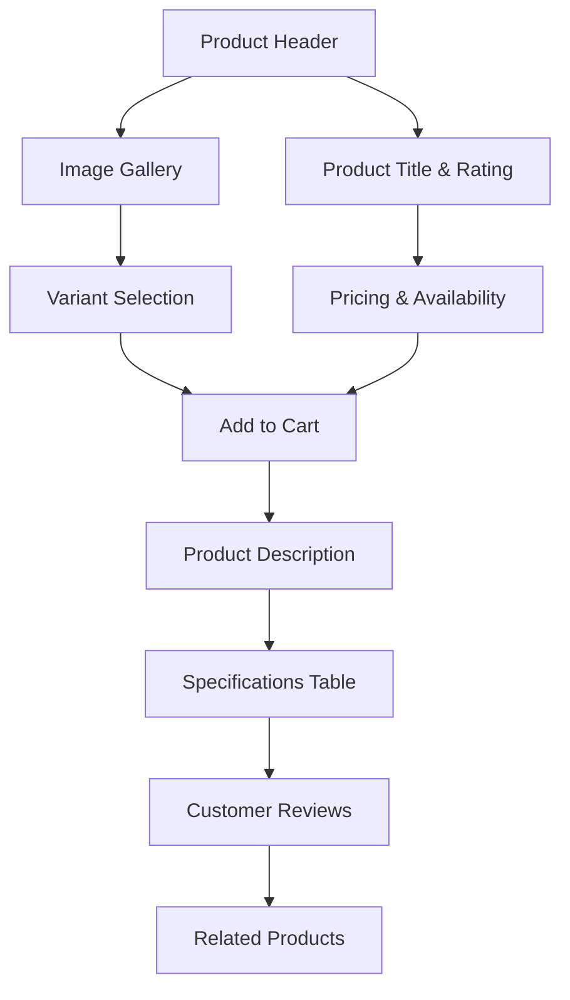

# Product Catalog Requirements Analysis

## Introduction & Executive Summary

This document defines the comprehensive product catalog requirements for the e-commerce shopping mall platform. The product catalog serves as the central repository for all product information, enabling customers to discover, browse, and purchase items while providing sellers with robust tools for product management.

### Business Objectives
The product catalog system shall:
- Enable efficient product discovery through advanced search and filtering
- Support flexible product variations with comprehensive SKU management
- Provide seamless integration with inventory and order systems
- Facilitate seller-driven product management and listing
- Ensure high performance and scalability for large product catalogs

### Core Value Proposition
THE product catalog SHALL enable customers to quickly find desired products while providing sellers with intuitive tools for product presentation and management.

## Product Catalog Architecture

### Core Product Data Model

#### Product Entity Structure

#### Product Master Requirements
WHEN creating a new product, THE system SHALL require:
- Product title (50-200 characters)
- Product description (200-2000 characters)
- Primary category assignment
- Brand/manufacturer information
- Base pricing information
- Product status (active/draft/inactive)

#### Product Variant System
THE product catalog SHALL support configurable product variants with the following requirements:

**Variant Attributes**
- Color selection with swatch display
- Size options with size chart integration
- Material composition details
- Style variations
- Any other seller-defined attributes

**SKU Management Requirements**
WHEN creating product variants, THE system SHALL:
- Generate unique SKU codes for each variant combination
- Track inventory levels per SKU
- Maintain separate pricing per variant if applicable
- Support variant-specific images and descriptions

### Category Management System

#### Category Hierarchy Structure
THE category system SHALL support:
- Multi-level hierarchy (up to 5 levels deep)
- Category breadcrumb navigation
- Category-specific attributes and filters
- Category images and descriptions
- Category status management (active/inactive)

#### Category Requirements
| Category Level | Depth | Example Path | Required Attributes |
|----------------|-------|--------------|---------------------|
| Level 1        | 1     | Electronics  | Name, Description, Image |
| Level 2        | 2     | Electronics > Mobile Phones | Name, Description, Parent |
| Level 3        | 3     | Electronics > Mobile Phones > Smartphones | Name, Description, Parent |
| Level 4        | 4     | Electronics > Mobile Phones > Smartphones > iOS | Name, Description, Parent |
| Level 5        | 5     | Electronics > Mobile Phones > Smartphones > iOS > iPhone | Name, Description, Parent |

WHEN assigning products to categories, THE system SHALL:
- Allow products to belong to multiple categories
- Inherit category attributes for product organization
- Validate category assignments during product creation
- Support category-specific search optimization

## Search and Discovery Capabilities

### Search Functionality Requirements

#### Basic Search
WHEN a user enters search terms, THE system SHALL:
- Search across product titles, descriptions, and attributes
- Return results ranked by relevance
- Highlight search terms in results
- Support typo tolerance and synonyms
- Provide search suggestions as users type

#### Advanced Search Filters
THE search system SHALL support filtering by:
- Price range (minimum and maximum)
- Category and subcategory
- Brand/manufacturer
- Product ratings and reviews
- Availability status
- Shipping options
- Seller information

#### Search Performance Requirements
THE search functionality SHALL:
- Return results within 2 seconds for typical queries
- Handle up to 100 concurrent search requests
- Support search across 1 million+ product catalog
- Maintain search index freshness (updates within 5 minutes)

### Product Discovery Features

#### Category Navigation
WHEN browsing categories, THE system SHALL:
- Display category hierarchy with expandable subcategories
- Show product count per category
- Provide category-specific attribute filters
- Support sorting by popularity, price, ratings, and recency

#### Product Recommendations
THE system SHALL provide recommendation engines for:
- "Customers who bought this also bought"
- "Similar products based on attributes"
- "Recently viewed products"
- "Popular products in category"
- "Personalized recommendations based on user history"

## Product Management Requirements

### Product Creation Workflow

#### Product Creation Process

#### Product Creation Requirements
WHEN sellers create products, THE system SHALL:
- Provide step-by-step product creation wizard
- Validate required fields before submission
- Support product templates for common product types
- Allow saving as draft for incomplete products
- Provide preview functionality before publishing

### SKU and Variant Management

#### Variant Creation Requirements
WHEN defining product variants, THE system SHALL:
- Support configurable attribute combinations
- Generate SKU codes automatically or allow manual entry
- Track inventory levels per variant
- Support variant-specific pricing and images
- Provide bulk variant management tools

#### Inventory Integration
THE product catalog SHALL integrate with inventory management to:
- Display real-time stock levels per SKU
- Show low stock warnings when inventory falls below threshold
- Update availability status automatically
- Support backorder status for out-of-stock items

### Pricing and Promotion Rules

#### Pricing Management
THE system SHALL support:
- Base price per product/variant
- Sale pricing with start/end dates
- Tiered pricing for quantity discounts
- Customer group-specific pricing
- Currency conversion for international sales

#### Promotion Integration
THE product catalog SHALL integrate with promotion system to:
- Display promotional pricing prominently
- Show discount percentages and savings
- Support coupon code application
- Validate promotion eligibility per product

## Display and Presentation Requirements

### Product Page Layout

#### Product Page Structure

#### Product Display Requirements
WHEN displaying product pages, THE system SHALL:
- Show high-quality product images with zoom capability
- Display variant selection interface with visual options
- Present clear pricing information with any discounts
- Show real-time stock availability
- Display customer ratings and review count
- Provide detailed product specifications
- Include seller information and rating

### Media Management

#### Image Requirements
THE product catalog SHALL support:
- Multiple product images per product/variant
- Image zoom and gallery navigation
- Thumbnail generation for efficient loading
- Image optimization for web and mobile
- Support for product videos and 360-degree views

#### Media Upload Requirements
WHEN sellers upload media, THE system SHALL:
- Validate file types and sizes
- Auto-generate multiple image sizes
- Support drag-and-drop upload interface
- Provide image editing tools (crop, rotate, enhance)
- Store media with CDN integration for fast delivery

### Customer Reviews Integration

#### Review Display Requirements
THE product catalog SHALL:
- Display average rating prominently
- Show review count and distribution
- Present verified purchase badges
- Allow sorting reviews by helpfulness, recency, and rating
- Support photo reviews from customers

## Technical Implementation Guidelines

### Performance Requirements

#### Search Performance
THE search system SHALL:
- Handle 1000+ search queries per minute
- Return results within 2 seconds for 95% of queries
- Support search across 10+ million products
- Maintain search index with near real-time updates

#### Page Load Performance
THE product catalog pages SHALL:
- Load within 3 seconds on desktop connections
- Load within 5 seconds on mobile connections
- Support lazy loading for images and content
- Implement efficient caching strategies

### Scalability Considerations

#### Database Architecture
THE product catalog database SHALL:
- Support horizontal scaling for large catalogs
- Implement efficient indexing for search and filtering
- Provide replication for high availability
- Support geo-distribution for international catalogs

#### Content Delivery
THE system SHALL implement:
- CDN integration for media delivery
- Caching layers for frequently accessed data
- Load balancing for high traffic periods
- Monitoring and auto-scaling capabilities

### Integration Requirements

#### Inventory System Integration
THE product catalog SHALL integrate with inventory management to:
- Sync stock levels in real-time
- Update availability status automatically
- Support reservation during checkout process
- Provide low-stock alerts and notifications

#### Order System Integration
THE catalog SHALL provide order system with:
- Product information for order processing
- Pricing validation during checkout
- Inventory verification before order confirmation
- Product availability updates based on orders

#### Seller Management Integration
THE catalog SHALL integrate with seller management to:
- Validate seller permissions for product management
- Track seller performance metrics
- Support seller-specific catalog views
- Provide seller analytics and reporting

### Security and Compliance

#### Data Security Requirements
THE product catalog SHALL:
- Encrypt sensitive product information
- Implement access controls for product data
- Protect against injection attacks in search
- Secure media storage and delivery

#### Compliance Requirements
THE system SHALL comply with:
- Data privacy regulations for customer information
- Accessibility standards for product display
- Industry standards for e-commerce security
- Regional requirements for product information

## Business Rules and Validation

### Product Validation Rules
WHEN creating or updating products, THE system SHALL validate:
- Required fields are populated
- Pricing information is valid and logical
- Category assignments are valid
- SKU codes are unique across the platform
- Media files meet size and format requirements

### Category Management Rules
THE category system SHALL enforce:
- Unique category names within same parent level
- Valid category hierarchy relationships
- Category activation/deactivation consistency
- Product count validation during category changes

### Search Optimization Rules
THE search system SHALL implement:
- Search term analysis and normalization
- Relevance scoring based on multiple factors
- Filter validation to prevent invalid combinations
- Search result pagination with consistent ordering

## Error Handling and Edge Cases

### Search Error Scenarios
IF search queries return no results, THEN THE system SHALL:
- Provide helpful "no results" messaging
- Suggest alternative search terms
- Show popular products in relevant categories
- Offer to expand search criteria

### Product Display Errors
IF product information is unavailable, THEN THE system SHALL:
- Show appropriate error messages
- Redirect to category page if product is not found
- Provide contact information for support
- Log errors for system monitoring

### Inventory Display Edge Cases
WHILE displaying product availability, THE system SHALL handle:
- Backorder situations with clear messaging
- Limited stock warnings with quantity display
- Pre-order status for upcoming products
- Discontinued product status

## Success Metrics and Monitoring

### Key Performance Indicators
THE product catalog performance SHALL be measured by:
- Search success rate (percentage of searches with results)
- Product page conversion rate
- Average time to find products
- Catalog completeness and accuracy
- System uptime and response times

### Monitoring Requirements
THE system SHALL implement monitoring for:
- Search performance and query patterns
- Product page load times
- Inventory accuracy and sync status
- User interaction patterns and drop-off points
- System resource utilization and scaling needs

This comprehensive product catalog requirements document provides backend developers with all necessary specifications to implement a robust, scalable, and user-friendly product management system that supports the complex needs of a modern e-commerce platform.