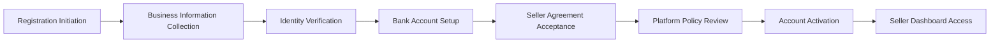
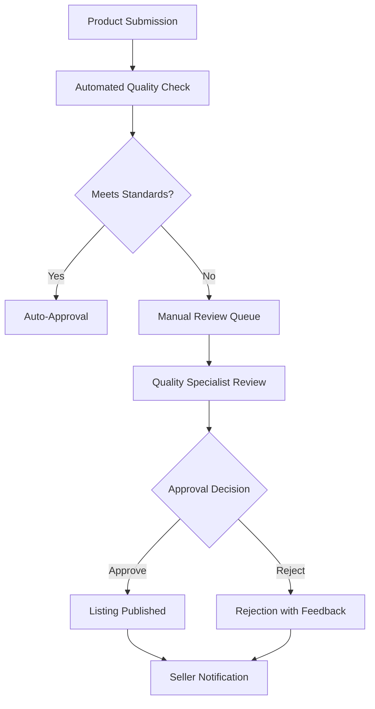

# Seller Management System Requirements

## 1. Introduction and Business Context

This document defines the comprehensive seller management system for the shopping mall e-commerce platform. The system enables businesses to register, manage their product catalog, process customer orders, and grow their operations within the marketplace ecosystem while maintaining platform quality standards and customer satisfaction.

### Business Vision and Objectives
THE shopping mall platform SHALL create a thriving marketplace ecosystem where sellers can efficiently manage their business operations while providing customers with diverse product offerings and exceptional service quality.

**Key Business Objectives:**
- Achieve 10,000 active sellers within the first 18 months of platform operation
- Maintain seller satisfaction rating above 4.0/5.0 through comprehensive support tools
- Process $50 million in gross merchandise volume (GMV) through seller transactions annually
- Ensure 95% of sellers achieve profitable operations within 6 months of onboarding

## 2. Seller Onboarding and Registration Process

### 2.1 Seller Registration Requirements

**WHEN a potential seller initiates registration, THE system SHALL present a multi-step verification process** to ensure business legitimacy and platform compliance.

**Registration Workflow:**

**Required Registration Information:**
- **Business Legal Information:**
  - Company name and registration number
  - Tax identification number (TIN/EIN)
  - Business registration documents
  - Years in operation and business history

- **Contact Information:**
  - Primary business address
  - Contact phone numbers
  - Operational email addresses
  - Customer service hours and response commitments

- **Financial Information:**
  - Bank account details for payment disbursements
  - Business credit verification
  - Payment processing preferences
  - Tax compliance documentation

### 2.2 Identity Verification and Compliance

**WHILE processing seller applications, THE system SHALL implement automated verification checks** including:
- Business registration validation with government databases
- Tax identification number verification
- Bank account ownership confirmation
- Anti-money laundering (AML) compliance screening
- Sanctions list and politically exposed persons (PEP) screening

**THE system SHALL require manual review for applications** that:
- Fail automated verification checks
- Operate in high-risk business categories
- Request exceptions to standard platform policies
- Have complex ownership structures

### 2.3 Seller Agreement and Policy Acceptance

**WHEN completing registration, sellers SHALL accept the comprehensive seller agreement** covering:
- Platform commission structure and fee schedule
- Product listing guidelines and quality standards
- Customer service level agreements (SLAs)
- Shipping and fulfillment requirements
- Return and refund policies
- Data protection and privacy commitments
- Intellectual property rights and compliance
- Dispute resolution procedures

## 3. Seller Profile and Store Management

### 3.1 Storefront Configuration

**THE system SHALL provide sellers with comprehensive store customization options** including:

**Branding Elements:**
- Store logo and banner image upload
- Color scheme and theme selection
- Custom domain name configuration (premium feature)
- Social media integration

**Store Information:**
- Store description and mission statement
- Business hours and customer service availability
- Shipping policies and delivery timeframes
- Return and exchange policies
- About us page customization

**Store Performance Display:**
- Customer review ratings and testimonials
- Sales volume and transaction history
- Response time metrics
- Customer satisfaction scores

### 3.2 Seller Tier System

**THE platform SHALL implement a multi-tier seller system** with progressive benefits:

| Tier | Requirements | Benefits | Commission Rate |
|------|--------------|----------|-----------------|
| **Starter** | New sellers, <10 products | Basic tools, standard support | 15% |
| **Professional** | 3+ months, >50 products | Advanced analytics, marketing tools | 12% |
| **Enterprise** | 6+ months, >200 products | Premium support, API access, custom features | 8% |

**WHEN sellers meet tier promotion criteria, THE system SHALL automatically upgrade their account** and notify them of new benefits and requirements.

## 4. Product Management System

### 4.1 Product Creation Workflow

**WHEN sellers create new product listings, THE system SHALL guide them through a comprehensive creation process** ensuring compliance with platform standards.

**Product Creation Steps:**
1. **Category Selection:** Choose appropriate product category and subcategories
2. **Basic Information:** Product title, description, brand, and manufacturer details
3. **Variant Configuration:** Define product variations (color, size, material, etc.)
4. **Pricing Strategy:** Set base price, sale pricing, and quantity discounts
5. **Inventory Setup:** Configure stock levels and backorder options
6. **Media Upload:** Product images, videos, and documentation
7. **SEO Optimization:** Keywords, meta descriptions, and search optimization
8. **Shipping Configuration:** Weight, dimensions, and shipping class

### 4.2 Product Quality Standards

**THE system SHALL enforce product listing quality standards** through automated validation:

**Content Requirements:**
- Product titles: 50-200 characters with relevant keywords
- Product descriptions: 200-2000 characters with proper formatting
- High-quality images: Minimum 3 images per product, 1000x1000 pixels minimum
- Complete product specifications and feature lists
- Accurate pricing and availability information

**Quality Control Process:**

### 4.3 SKU-Based Inventory Management

**THE system SHALL maintain separate inventory tracking** for each product variant with unique SKU management.

**Inventory Management Features:**
- Real-time stock level synchronization across all sales channels
- Low-stock alerts with customizable threshold settings
- Bulk inventory update capabilities via CSV import/export
- Inventory reservation during customer checkout process
- Backorder management with customer communication
- Multi-location inventory tracking for distributed warehouses

**WHEN inventory levels change, THE system SHALL update product availability** immediately across the platform to prevent overselling.

## 5. Order Management and Fulfillment

### 5.1 Order Processing Workflow

**WHEN customers place orders, THE system SHALL notify sellers** through multiple channels and provide comprehensive order details.

**Order Notification System:**
- **Real-time Dashboard Updates:** Immediate order appearance in seller dashboard
- **Email Notifications:** Detailed order information with customer details
- **Mobile Alerts:** Push notifications for urgent or high-value orders
- **SMS Notifications:** Critical order updates for time-sensitive shipments

**Order Processing Timeline:**
- **Order Received:** Within 2 minutes of customer payment confirmation
- **Order Processing:** Seller has 24 hours to confirm order acceptance
- **Order Fulfillment:** Standard shipping within 48 hours of order confirmation
- **Order Shipping:** Tracking information provided within 4 hours of shipment

### 5.2 Shipping Integration and Management

**THE system SHALL integrate with major shipping carriers** to streamline fulfillment operations.

**Supported Shipping Services:**
- **Domestic Carriers:** FedEx, UPS, USPS, DHL Express
- **International Shipping:** Global carrier integration with customs documentation
- **Regional Carriers:** Local delivery services with API connectivity
- **Same-Day Delivery:** Integration with local courier services

**Shipping Management Features:**
- Automated shipping rate calculations based on package dimensions
- Bulk shipping label generation for multiple orders
- Real-time package tracking integration
- Shipping exception alerts and resolution tools
- Returns management with automated return label generation

### 5.3 Returns and Refund Processing

**THE system SHALL provide comprehensive returns management** tools for efficient customer service.

**Returns Workflow:**
1. **Customer Initiation:** Customer submits return request through platform
2. **Seller Approval:** Seller reviews return reason and approves/denies request
3. **Return Authorization:** System generates return shipping label and instructions
4. **Product Receipt:** Seller receives returned item and inspects condition
5. **Refund Processing:** System processes refund based on return policy
6. **Inventory Update:** Returned item restocked or marked for disposal

**Return Policy Configuration:**
- Customizable return windows (14-30 days standard)
- Restocking fee settings based on return reason
- Return shipping responsibility configuration
- Automated refund calculation rules

## 6. Pricing and Promotion Management

### 6.1 Pricing Strategy Tools

**THE system SHALL provide advanced pricing management** capabilities for competitive positioning.

**Pricing Features:**
- **Dynamic Pricing:** Automated price adjustments based on market conditions
- **Competitor Monitoring:** Price comparison tools with competing sellers
- **Tiered Pricing:** Quantity-based discount structures
- **Seasonal Pricing:** Automated pricing rules for seasonal demand
- **Promotional Pricing:** Time-limited sale pricing with scheduling

**Price Optimization Algorithms:**
- Demand forecasting based on historical sales data
- Competitor price monitoring and adjustment recommendations
- Profit margin optimization with sales volume considerations
- Price elasticity analysis for different product categories

### 6.2 Promotion and Marketing Tools

**THE system SHALL offer integrated marketing capabilities** to help sellers increase visibility.

**Promotional Features:**
- **Coupon Management:** Create and distribute discount codes
- **Bundle Creation:** Product bundle configurations with combined pricing
- **Flash Sales:** Time-limited promotional events
- **Cross-selling:** Automated product recommendation engine
- **Email Marketing:** Customer communication tools for promotions

**Marketing Analytics:**
- Campaign performance tracking with ROI calculations
- Customer segmentation for targeted promotions
- Conversion rate optimization tools
- Marketing channel effectiveness analysis

## 7. Sales Analytics and Reporting

### 7.1 Performance Dashboard

**THE system SHALL provide sellers with a comprehensive analytics dashboard** displaying key business metrics.

**Dashboard Metrics:**
- **Sales Performance:** Daily, weekly, monthly revenue trends
- **Product Analytics:** Top-performing products and categories
- **Customer Insights:** Buyer demographics and purchase patterns
- **Inventory Metrics:** Stock turnover rates and days of inventory
- **Financial Analytics:** Profit margins and commission calculations

**Real-time Analytics Features:**
- Live sales tracking with minute-by-minute updates
- Customer behavior analysis with heatmaps and click tracking
- Conversion funnel analysis from product view to purchase
- Competitor performance benchmarking

### 7.2 Advanced Reporting Capabilities

**THE system SHALL offer comprehensive reporting tools** for business intelligence.

**Report Types:**
- **Sales Reports:** Detailed transaction analysis by product, category, time period
- **Customer Reports:** Customer lifetime value, acquisition cost, retention rates
- **Inventory Reports:** Stock levels, turnover rates, demand forecasting
- **Financial Reports:** Revenue, expenses, profit calculations, tax reporting
- **Performance Reports:** Seller rating, response times, customer satisfaction

**Custom Reporting Features:**
- Drag-and-drop report builder with customizable metrics
- Scheduled report generation and automated email delivery
- Data export capabilities in multiple formats (CSV, Excel, PDF)
- API access for integration with external business intelligence tools

## 8. Seller Communication and Support

### 8.1 Customer Communication Tools

**THE system SHALL provide integrated communication channels** for seller-customer interaction.

**Communication Features:**
- **Messaging System:** Secure platform messaging for order-related communication
- **Automated Notifications:** Order status updates and shipping notifications
- **Review Management:** Tools for responding to customer reviews
- **Customer Service:** Ticket system for customer inquiries and support

**Response Time Requirements:**
- **Initial Response:** Customer inquiries answered within 4 hours during business hours
- **Issue Resolution:** Standard issues resolved within 24 hours
- **Escalation Process:** Complex issues escalated to platform support within 48 hours
- **Customer Satisfaction:** Maintain 90%+ customer satisfaction rating for communications

### 8.2 Platform Support Integration

**THE system SHALL provide direct access to platform support** resources.

**Support Channels:**
- **Help Center:** Comprehensive knowledge base with search functionality
- **Live Chat:** Real-time support during business hours
- **Phone Support:** Dedicated support line for enterprise sellers
- **Email Support:** Ticket-based support for non-urgent inquiries
- **Community Forums:** Peer-to-peer support and knowledge sharing

## 9. Performance Metrics and Quality Standards

### 9.1 Seller Performance Scorecard

**THE system SHALL calculate seller performance scores** based on multiple metrics.

**Performance Metrics:**
- **Order Fulfillment Rate:** Percentage of orders shipped on time
- **Customer Satisfaction:** Average review rating and feedback scores
- **Response Time:** Average time to respond to customer inquiries
- **Return Rate:** Percentage of orders returned by customers
- **Policy Compliance:** Adherence to platform policies and guidelines

**Performance Thresholds:**
- **Excellent Performance:** Overall score ≥ 4.5/5.0 with premium benefits
- **Good Performance:** Overall score ≥ 4.0/5.0 with standard benefits
- **Needs Improvement:** Overall score 3.0-3.9/5.0 with performance plans
- **At Risk:** Overall score < 3.0/5.0 with potential suspension

### 9.2 Quality Assurance Program

**THE system SHALL implement a comprehensive quality assurance program** to maintain platform standards.

**Quality Monitoring:**
- **Product Quality:** Regular sampling of product listings for accuracy
- **Service Quality:** Mystery shopping and customer experience testing
- **Communication Quality:** Monitoring of seller-customer communications
- **Policy Compliance:** Regular audits of seller adherence to platform policies

**Quality Improvement Programs:**
- **Seller Education:** Training resources and best practice guides
- **Performance Coaching:** One-on-one support for sellers needing improvement
- **Recognition Programs:** Awards and incentives for top-performing sellers
- **Continuous Feedback:** Regular performance reviews and improvement plans

## 10. Integration and API Requirements

### 10.1 External System Integration

**THE system SHALL provide API access** for integration with external business systems.

**API Integration Points:**
- **Inventory Management:** Synchronization with external inventory systems
- **Accounting Software:** Integration with QuickBooks, Xero, and other accounting platforms
- **CRM Systems:** Customer data synchronization with Salesforce, HubSpot, etc.
- **Shipping Systems:** API connectivity with warehouse management systems
- **Marketing Tools:** Integration with email marketing and analytics platforms

**API Security Requirements:**
- OAuth 2.0 authentication for secure API access
- Rate limiting to prevent system abuse
- Data encryption for all API communications
- Comprehensive API documentation with code examples

### 10.2 Data Synchronization

**THE system SHALL maintain real-time data synchronization** across all integrated systems.

**Synchronization Features:**
- **Bidirectional Sync:** Data updates flow both to and from external systems
- **Conflict Resolution:** Automated handling of data conflicts with manual override
- **Error Handling:** Comprehensive error logging and notification system
- **Performance Monitoring:** Real-time monitoring of synchronization performance

## 11. Security and Compliance Requirements

### 11.1 Data Protection and Privacy

**THE system SHALL implement comprehensive security measures** to protect seller and customer data.

**Security Features:**
- **Data Encryption:** End-to-end encryption for all sensitive data
- **Access Controls:** Role-based permissions for different user types
- **Audit Logging:** Comprehensive logging of all system activities
- **Security Monitoring:** Real-time monitoring for suspicious activities

**Compliance Requirements:**
- **GDPR Compliance:** Data protection standards for European sellers and customers
- **PCI DSS Compliance:** Payment card industry security standards
- **Tax Compliance:** Automated tax calculation and reporting
- **Industry Regulations:** Compliance with specific industry requirements

### 11.2 Business Continuity and Disaster Recovery

**THE system SHALL implement business continuity measures** to ensure uninterrupted operations.

**Continuity Features:**
- **Data Backup:** Regular automated backups with off-site storage
- **Disaster Recovery:** Comprehensive recovery procedures for system failures
- **Redundancy:** Multiple server locations with automatic failover
- **Service Level Agreements:** Guaranteed uptime of 99.9% for critical functions

## 12. Success Metrics and Performance Monitoring

### 12.1 Key Performance Indicators (KPIs)

**THE system SHALL track and report on key performance indicators** to measure success.

**Platform KPIs:**
- **Seller Growth:** Number of new sellers joining monthly
- **Seller Retention:** Percentage of sellers remaining active after 6 months
- **Transaction Volume:** Gross merchandise value processed through platform
- **Customer Satisfaction:** Average seller rating from customer reviews
- **Revenue Generation:** Platform commission revenue and growth

**Seller KPIs:**
- **Sales Performance:** Revenue growth and transaction volume
- **Operational Efficiency:** Order processing time and fulfillment rates
- **Customer Service:** Response times and satisfaction ratings
- **Profitability:** Net profit after platform commissions and costs

### 12.2 Continuous Improvement Programs

**THE system SHALL implement continuous improvement initiatives** based on performance data.

**Improvement Programs:**
- **Feature Enhancements:** Regular updates based on seller feedback
- **Performance Optimization:** Continuous monitoring and optimization of system performance
- **User Experience:** Regular usability testing and interface improvements
- **Training and Education:** Ongoing seller education and support resources

## Conclusion

This enhanced seller management system provides comprehensive requirements for creating a robust marketplace platform that supports sellers at every stage of their business journey. The system balances automation with human oversight, ensuring platform quality while providing sellers with the tools they need to succeed.

**THE development team SHALL use these requirements** to build a seller management system that enables business growth, maintains platform quality, and delivers exceptional customer experiences.

> *Developer Note: This document defines **business requirements only**. All technical implementations (architecture, APIs, database design, etc.) are at the discretion of the development team.*