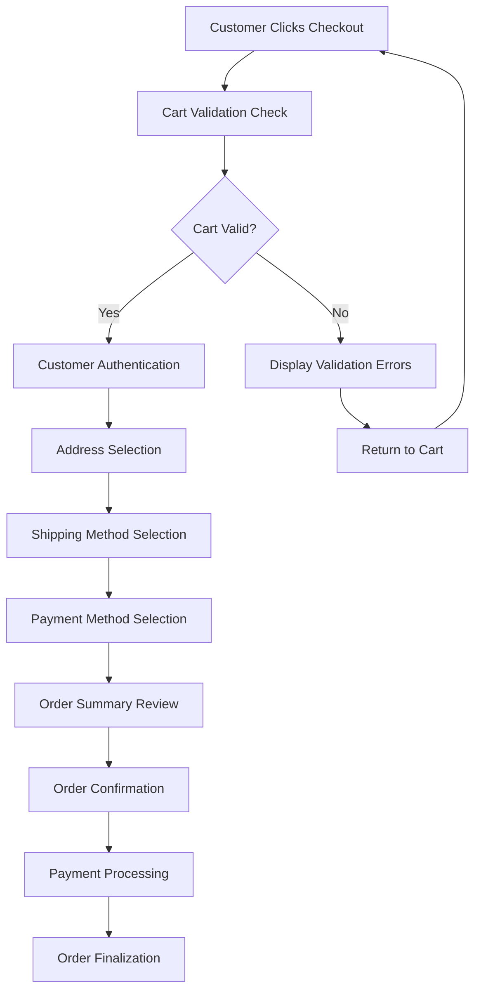
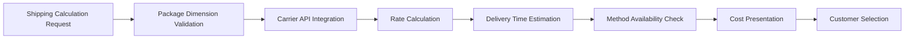
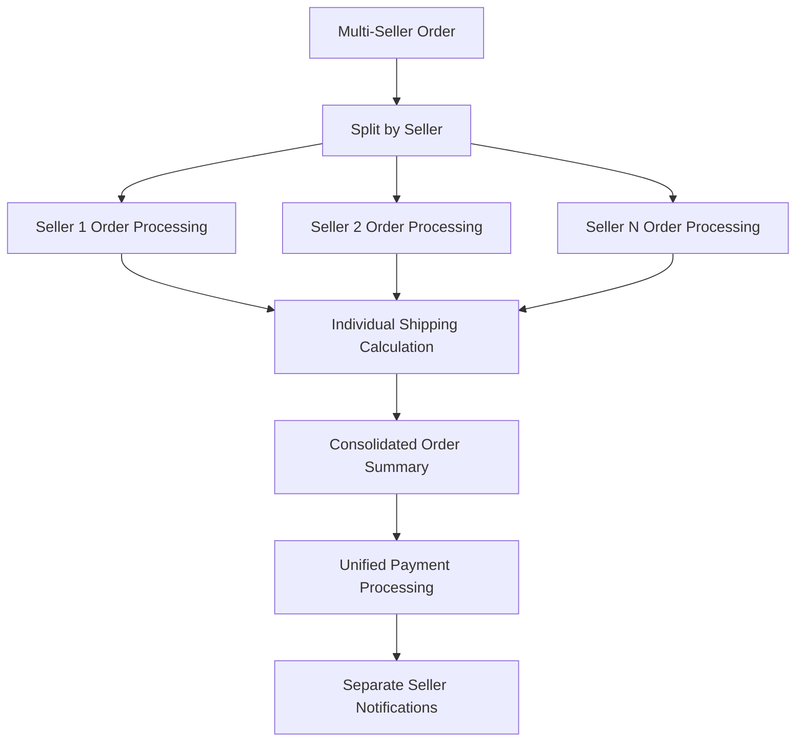

# Order Placement System Requirements

## Executive Summary

This document defines the comprehensive business requirements for the order placement system within the e-commerce shopping mall platform. The order placement process represents the critical transition from shopping intent to binding transaction, requiring robust validation, real-time inventory management, and seamless user experience across all customer scenarios.

### Business Context
Order placement serves as the central transaction engine connecting customers, sellers, and platform operations. The system must handle complex scenarios including multi-seller orders, inventory validation, payment processing, and customer communication while maintaining data integrity and security.

## Core Order Placement Workflow

### Order Initiation Process

**WHEN a customer initiates checkout from their shopping cart, THE system SHALL validate cart contents and customer readiness for purchase.**

### Cart Validation Requirements

**WHEN validating cart contents, THE system SHALL perform comprehensive checks including:**
- Product availability verification for each SKU in real-time
- Price consistency validation against current catalog prices
- Seller availability and operational status confirmation
- Shipping feasibility based on product characteristics and destination

**IF any validation fails, THE system SHALL provide specific error messages indicating the exact issue and recommended resolution steps.**

## Customer Authentication & Session Management

### Authentication Flow

**WHEN an unauthenticated customer attempts checkout, THE system SHALL provide seamless authentication options:**
- Existing customer login with email/password
- Guest checkout with minimal information collection
- Social authentication integration (Google, Facebook, Apple)
- Session preservation across authentication methods

**THE system SHALL maintain cart contents during authentication transitions and preserve user input to prevent data loss.**

### Session Security Requirements

**WHILE processing orders, THE system SHALL implement robust session management:**
- Secure session tokens with 30-minute timeout
- Automatic session extension during active checkout
- Session integrity validation on each step transition
- Protection against session hijacking and replay attacks

## Address Management System

### Address Selection & Validation

**WHEN customers select shipping addresses, THE system SHALL provide:**
- Saved address book with comprehensive address history
- Real-time address validation using postal service APIs
- Address suggestion and auto-completion features
- Multiple address support for different shipment types

**THE address validation process SHALL verify:**
- Postal code and city/state consistency
- Delivery feasibility with selected carriers
- Address formatting according to regional standards
- Special delivery requirements (apartment buildings, rural areas)

### Address Management Business Rules

**WHERE customers manage addresses during checkout, THE system SHALL enforce:**
- Maximum of 10 saved addresses per customer account
- Address format standardization across all regions
- Validation of address completeness before order submission
- Clear indication of default shipping and billing addresses

## Shipping Method Selection

### Real-time Shipping Calculations

**WHEN calculating shipping options, THE system SHALL integrate with carrier APIs to provide:**
- Real-time shipping rates based on package dimensions and weight
- Delivery time estimates with carrier-specific accuracy
- Shipping method availability based on destination restrictions
- Cost breakdown showing base rate and any applicable surcharges

**THE shipping calculation SHALL consider:**
- Package dimensions and total weight
- Origin warehouse or seller location
- Destination address and delivery speed requirements
- Carrier-specific restrictions and special handling needs

### Shipping Method Business Rules

**WHEN presenting shipping options, THE system SHALL:**
- Display options in price order (lowest to highest)
- Highlight recommended shipping methods based on delivery speed
- Show delivery date estimates clearly for each option
- Indicate any shipping restrictions or special requirements

## Payment Method Integration

### Payment Gateway Requirements

**THE system SHALL support multiple payment methods with seamless integration:**
- Credit/debit card processing with major providers
- Digital wallet integration (PayPal, Apple Pay, Google Pay)
- Bank transfer and direct debit options
- Alternative payment methods specific to regional markets

**WHEN processing payments, THE system SHALL implement:**
- PCI DSS compliance for all payment data handling
- Tokenization for secure payment information storage
- 3D Secure authentication for enhanced security
- Fraud detection and prevention mechanisms

### Payment Flow Requirements

**WHEN customers select payment methods, THE system SHALL:**
- Validate payment method compatibility with order amount
- Provide clear payment instructions and security assurances
- Handle payment processing errors with user-friendly messages
- Support payment retry mechanisms with preserved order data

## Order Validation & Business Rules

### Comprehensive Validation Framework

**BEFORE order submission, THE system SHALL perform comprehensive validation checks:**

#### Product Availability Validation
**WHEN validating product availability, THE system SHALL:**
- Check real-time inventory levels for each product variant
- Validate product status (active, discontinued, seasonal)
- Confirm seller availability and operational capacity
- Reserve inventory during checkout to prevent overselling

#### Pricing Validation
**THE pricing validation SHALL ensure:**
- Price consistency with current catalog pricing
- Correct application of promotions and discounts
- Accurate tax calculations based on delivery location
- Proper handling of currency conversions for international orders

#### Customer Validation
**WHEN validating customer information, THE system SHALL verify:**
- Customer account status and order history
- Address validity and delivery feasibility
- Payment method authorization and limits
- Compliance with purchase restrictions or quantity limits

### Multi-Seller Order Processing

**WHERE orders contain products from multiple sellers, THE system SHALL:**
- Split orders logically by seller for independent fulfillment
- Calculate shipping costs separately for each seller group
- Process payments as distinct transactions per seller
- Provide consolidated order tracking while maintaining seller separation

## Inventory Management During Order Placement

### Real-time Inventory Reservation

**WHEN customers add items to cart, THE system SHALL implement inventory reservation:**
- Reserve inventory for 15 minutes during active shopping sessions
- Extend reservation during checkout process
- Release reserved inventory automatically upon session timeout
- Prevent inventory conflicts through transaction locking

### Inventory Synchronization

**THE system SHALL maintain real-time inventory synchronization across:**
- Shopping cart sessions for all active users
- Order processing queues
- Inventory management systems
- Seller fulfillment dashboards

### Backorder Management

**WHEN products are available for backorder, THE system SHALL:**
- Clearly indicate backorder status and estimated restock dates
- Provide option to proceed with backorder or remove items
- Calculate separate shipping timelines for backordered items
- Manage customer expectations through clear communication

## Order Confirmation Process

### Comprehensive Order Summary

**BEFORE final order submission, THE system SHALL display detailed order summary including:**
- Complete product list with variants, quantities, and individual prices
- Itemized cost breakdown (subtotal, shipping, taxes, discounts)
- Selected shipping address and delivery method
- Payment method and billing information
- Estimated delivery date range
- Order terms and conditions acceptance

### Order Confirmation Requirements

**WHEN customers confirm their orders, THE system SHALL:**
- Process payment through secure payment gateway
- Generate unique order number and confirmation reference
- Create order records in the database with complete transaction details
- Trigger order fulfillment workflow for sellers
- Send confirmation communications to all stakeholders

### Confirmation Communication

**AFTER successful order placement, THE system SHALL send:**
- Order confirmation email to customer with complete order details
- Order notification to relevant sellers with fulfillment requirements
- Payment confirmation to finance systems
- Inventory update notifications to stock management systems

## Error Handling & Recovery Mechanisms

### Common Error Scenarios

#### Inventory Conflict Resolution
**IF inventory becomes unavailable during checkout, THE system SHALL:**
- Identify specific unavailable items with clear messaging
- Provide option to remove unavailable items and continue with remaining items
- Suggest similar available products as alternatives
- Maintain cart integrity for items that remain available

#### Payment Processing Failures
**WHEN payment processing encounters errors, THE system SHALL:**
- Preserve complete order details for retry attempts
- Provide specific error messages explaining failure reasons
- Suggest alternative payment methods when available
- Maintain inventory reservation during payment retry period

#### Address Validation Errors
**IF shipping address validation fails, THE system SHALL:**
- Highlight specific address validation issues with correction guidance
- Provide address suggestion tools for common errors
- Allow address editing without losing other order information
- Maintain calculated shipping costs for valid address alternatives

### System Recovery Procedures

**THE system SHALL implement robust recovery mechanisms for:**
- Network connectivity issues during order submission
- Browser navigation away from checkout page
- Session timeout during lengthy checkout processes
- System maintenance windows affecting order placement

## Performance & Scalability Requirements

### Response Time Standards

**THE order placement system SHALL meet performance benchmarks:**
- Cart validation: < 2 seconds response time
- Shipping calculation: < 3 seconds for carrier API responses
- Address validation: < 1 second for standard address checks
- Payment processing: < 5 seconds for gateway transactions
- Order confirmation: < 2 seconds for database operations

### Scalability Requirements

**THE system architecture SHALL support:**
- 10,000 concurrent checkout sessions during peak periods
- 1,000+ orders per minute processing capacity
- Horizontal scaling for increased transaction volumes
- Efficient database operations for high-volume order creation

### Availability Requirements

**THE order placement system SHALL maintain:**
- 99.9% availability for core checkout functionality
- Graceful degradation during partial system failures
- Automated failover mechanisms for critical components
- Comprehensive monitoring and alerting for performance issues

## Security & Compliance Requirements

### Data Protection

**THE system SHALL implement comprehensive security measures:**
- Encryption of all sensitive customer data in transit and at rest
- Secure session management with protection against session hijacking
- Payment data protection compliant with PCI DSS standards
- Regular security audits and vulnerability assessments

### Compliance Requirements

**THE order placement process SHALL comply with:**
- Data privacy regulations (GDPR, CCPA, etc.)
- Consumer protection laws for e-commerce transactions
- Tax calculation and reporting requirements
- Regional e-commerce regulations and consumer rights

## Integration Requirements

### System Integration Points

**THE order placement system SHALL integrate seamlessly with:**

#### Payment Gateway Integration
- Real-time payment processing with multiple gateway providers
- Transaction status synchronization between systems
- Refund and chargeback handling integration
- Fraud detection and prevention system integration

#### Inventory Management Integration
- Real-time inventory level synchronization
- Inventory reservation and release mechanisms
- Backorder management system integration
- Stock level alerting and notification systems

#### Shipping Carrier Integration
- Real-time shipping rate calculations
- Carrier-specific package tracking integration
- Delivery exception handling and notification
- Shipping label generation and tracking

#### Customer Communication Integration
- Automated email and SMS notification systems
- Order status update communications
- Customer service ticketing system integration
- Marketing communication platform integration

### API Requirements

**ALL external integrations SHALL use standardized API protocols:**
- RESTful API design with JSON payloads
- OAuth 2.0 authentication for secure API access
- Webhook notifications for real-time status updates
- Comprehensive error handling and retry mechanisms

## Business Rules & Validation Logic

### Order Validation Rules

**THE system SHALL enforce comprehensive business rules:**

#### Minimum Order Requirements
- **WHEN** order value falls below minimum threshold, **THE system SHALL** display minimum order requirement message
- **WHERE** specific products have minimum quantity requirements, **THE system SHALL** enforce these during order validation

#### Geographic Restrictions
- **IF** shipping address is in restricted delivery area, **THEN THE system SHALL** prevent order completion
- **WHERE** products have geographic sales restrictions, **THE system SHALL** validate customer location compliance

#### Customer Purchase Limits
- **WHEN** customers exceed purchase quantity limits, **THE system SHALL** enforce restrictions with clear explanations
- **WHERE** promotional items have purchase limits, **THE system SHALL** track and enforce these limits accurately

### Pricing Rules

**THE pricing validation SHALL implement:**
- Consistent pricing calculations across all system components
- Accurate tax application based on delivery jurisdiction
- Proper discount stacking and priority rules
- Currency conversion accuracy for international orders

## Customer Experience Requirements

### User Interface Standards

**THE checkout interface SHALL provide:**
- Clear progress indicators showing current step and remaining steps
- Persistent cart summary displaying key order information
- Easy navigation between checkout steps without data loss
- Mobile-optimized design for seamless mobile checkout experience

### Accessibility Requirements

**THE order placement system SHALL comply with:**
- WCAG 2.1 AA accessibility standards
- Screen reader compatibility for visually impaired users
- Keyboard navigation support for all checkout functions
- Color contrast and font size requirements for readability

### Internationalization Support

**WHERE supporting international customers, THE system SHALL provide:**
- Multi-language support for checkout interface
- Localized currency formatting and display
- Region-specific address formatting and validation
- Cultural appropriateness in communication and design

## Success Metrics & Monitoring

### Key Performance Indicators

**THE system SHALL track and report on critical metrics:**
- Order conversion rate from cart to completed purchase
- Checkout abandonment rate and reasons analysis
- Average order value across different customer segments
- Order processing time and efficiency metrics
- Customer satisfaction scores for checkout experience

### Monitoring Requirements

**THE system SHALL implement comprehensive monitoring:**
- Real-time performance monitoring for all checkout components
- Error rate tracking and alerting for system issues
- User behavior analytics for checkout optimization
- Security event monitoring and threat detection

### Continuous Improvement

**BASED ON performance data, THE system SHALL support:**
- A/B testing capabilities for checkout optimization
- User feedback collection and analysis
- Performance trend analysis and capacity planning
- Regular system updates and feature enhancements

> *Developer Note: This document defines **business requirements only**. All technical implementations (architecture, APIs, database design, etc.) are at the discretion of the development team.*