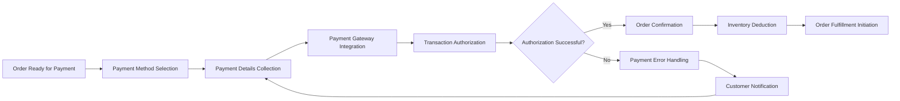

# Order Payment Processing Requirements

## Executive Summary

This document defines the comprehensive payment processing requirements for the e-commerce shopping mall platform. The payment system must provide secure, reliable, and flexible transaction handling across multiple payment methods while maintaining PCI DSS compliance and implementing robust fraud detection mechanisms. The system supports the complete payment lifecycle from authorization through settlement, ensuring financial accuracy and customer trust.

**Business Vision:** THE payment system SHALL enable seamless, secure transactions that build customer confidence while providing sellers with reliable payment processing and timely settlements.

## Payment Method Integration

### Supported Payment Methods

**WHEN customers select payment methods, THE system SHALL support the following options:**
- **Credit/Debit Card Payments**: Visa, MasterCard, American Express, UnionPay with 3D Secure authentication
- **Digital Wallet Integration**: Apple Pay, Google Pay, Samsung Pay, PayPal
- **Bank Transfer Options**: Real-time account transfers, virtual account generation
- **Alternative Methods**: Gift cards, loyalty points, installment plans, buy-now-pay-later services

**Payment Method Configuration Requirements:**
- **WHILE managing payment methods, THE system SHALL allow administrators to:**
  - Enable/disable specific payment methods globally
  - Configure availability by geographic region
  - Set minimum/maximum transaction amounts per method
  - Define currency support for international payments

### Payment Gateway Selection

**THE system SHALL support integration with major payment gateways including:**
- **Primary Gateway**: Stripe for comprehensive card processing
- **Secondary Gateway**: PayPal for digital wallet and alternative payments
- **Regional Gateways**: Local payment processors for specific markets
- **Enterprise Options**: Authorize.Net for high-volume merchants

## Transaction Processing Flow

### Order to Payment Transition

**WHEN an order moves from placement to payment stage, THE system SHALL execute the following workflow:**

### Payment Authorization Process

**WHEN processing payment authorization, THE system SHALL implement the following steps:**

1. **Payment Data Validation**
   - **WHEN collecting payment information, THE system SHALL validate:**
     - Payment method compatibility with order amount
     - Customer payment information format and completeness
     - Duplicate payment attempt detection

2. **Gateway Communication**
   - **WHILE communicating with payment gateways, THE system SHALL:**
     - Establish secure TLS 1.2+ encrypted connections
     - Transmit encrypted payment data using tokenization
     - Handle gateway response timeouts with 30-second maximum
     - Implement retry logic for transient failures

3. **Authorization Response Handling**
   - **WHEN receiving authorization responses, THE system SHALL:**
     - Process successful authorizations within 2 seconds
     - Handle declined transactions with specific error codes
     - Manage pending authorization states with status tracking

### Transaction Status Management

**WHILE a transaction is processing, THE system SHALL maintain comprehensive status tracking including:**
- Transaction ID and reference numbers
- Payment gateway interaction logs with timestamps
- Customer communication history
- Security audit trail for compliance requirements
- Real-time status updates for customer visibility

## Payment Security Requirements

### PCI DSS Compliance Implementation

**THE system SHALL maintain Payment Card Industry Data Security Standard (PCI DSS) Level 1 compliance through:**

#### Data Protection Measures
**WHEN handling payment card information, THE system SHALL:**
- Never store complete card numbers in plain text
- Implement tokenization for recurring payments and customer profiles
- Use AES-256 encryption for all payment data transmission
- Maintain secure key management practices with regular rotation

#### Access Control Requirements
**WHERE payment data is accessed, THE system SHALL enforce:**
- Role-based access control with principle of least privilege
- Multi-factor authentication for administrative payment access
- Comprehensive audit logging for all payment-related activities
- Regular security assessments and penetration testing

### Secure Communication Protocols

**THE payment system SHALL implement the following security measures:**
- TLS 1.2+ encryption for all payment communications
- Certificate pinning for payment gateway connections
- Secure API authentication using OAuth 2.0
- Regular security patch management and vulnerability scanning

## Fraud Detection & Prevention

### Real-time Fraud Detection

**WHEN processing payments, THE system SHALL implement comprehensive fraud detection through:**

#### Behavioral Analysis
**THE system SHALL analyze customer behavior patterns including:**
- Purchase history and spending patterns across 90-day periods
- Device fingerprinting and location verification
- Transaction velocity monitoring with alerts for unusual activity
- IP address reputation checking against known fraud databases

#### Risk Scoring System
**WHERE transaction risk assessment is needed, THE system SHALL:**
- Calculate risk scores based on 25+ factors including transaction amount, customer history, and device characteristics
- Apply automated rules for high-risk transactions requiring additional verification
- Flag suspicious transactions for manual review with priority assignment
- Implement velocity limits for new accounts and high-value transactions

### Fraud Prevention Measures

**THE system SHALL implement the following preventive measures:**
- Address Verification Service (AVS) for all card-not-present transactions
- Card Verification Value (CVV) requirement for card payments
- 3D Secure authentication enforcement for transactions above $100
- Transaction amount limits based on customer purchase history and verification level
- Geographic fraud pattern detection with regional blocking capabilities

### Manual Review Process

**IF a transaction exceeds risk thresholds, THEN THE system SHALL:**
- Flag the transaction for manual review within the fraud prevention dashboard
- Notify the dedicated fraud prevention team via multiple channels
- Temporarily hold order processing pending review completion
- Provide comprehensive review tools with decision workflow integration
- Escalate high-risk transactions to senior fraud analysts when necessary

## Refund & Chargeback Handling

### Refund Processing System

**WHEN processing refunds, THE system SHALL support comprehensive refund management including:**

#### Automated Refund Workflow
**THE system SHALL automate refund processing for the following scenarios:**
- Full refunds for orders cancelled within the 30-minute grace period
- Partial refunds for returned items based on product condition
- Refund to original payment method within 3-5 business days
- Refund processing time tracking with customer notifications

#### Refund Authorization Requirements
**WHERE refunds require approval, THE system SHALL:**
- Implement multi-level refund approval workflows based on amount and reason
- Set refund limits based on user roles and authorization levels
- Maintain refund reason codes and documentation requirements
- Track refund processing timelines with SLA compliance monitoring

### Chargeback Management System

**WHEN chargebacks are received, THE system SHALL execute the following procedures:**

#### Chargeback Notification Process
**THE system SHALL automatically process chargeback notifications by:**
- Receiving and parsing chargeback notifications from payment processors
- Updating order status to reflect chargeback initiation
- Notifying relevant teams including customer service and finance departments
- Implementing chargeback response workflow with deadline tracking

#### Chargeback Prevention Strategies
**THE system SHALL implement chargeback prevention through:**
- Clear transaction descriptors on customer statements with merchant identification
- Proactive customer communication for potentially disputed transactions
- Delivery confirmation and tracking information integration
- Customer service escalation paths for dispute resolution before chargeback
- Comprehensive documentation of customer interactions and product delivery

## Payment Gateway Integration

### Gateway Selection & Configuration

**THE system SHALL support integration with multiple payment gateways with the following capabilities:**
- Primary gateway for core payment processing with failover support
- Secondary gateways for redundancy and regional coverage requirements
- Specialized gateways for alternative payment methods and local preferences
- Gateway performance monitoring with health checks every 5 minutes

### API Integration Requirements

**WHEN integrating with payment gateways, THE system SHALL implement the following specifications:**

#### Authentication & Security
**THE API integration SHALL include:**
- API key management with automatic rotation every 90 days
- IP whitelisting for gateway communications with dynamic updates
- Request signing and validation using HMAC signatures
- Comprehensive error handling with exponential backoff retry mechanisms

#### Transaction Management
**THE system SHALL provide standardized API handling for:**
- Consistent API response parsing with error code mapping
- Webhook integration for real-time status updates and notifications
- Settlement and reconciliation data exchange with daily batch processing
- Gateway performance monitoring with alerting for response time degradation

### Multi-gateway Support Architecture

**WHERE multiple payment gateways are used, THE system SHALL:**
- Route transactions based on payment method, geographic region, and cost optimization
- Implement intelligent failover mechanisms for gateway outages with automatic switching
- Provide gateway performance analytics with comparative reporting
- Support gateway-specific configuration parameters through modular architecture

## Receipt Generation

### Digital Receipt Creation

**WHEN a payment is successfully processed, THE system SHALL generate comprehensive digital receipts containing:**

#### Receipt Content Requirements
**EACH digital receipt SHALL include:**
- Unique order number and transaction reference identifiers
- Itemized product list with prices, quantities, and variant details
- Payment method information and transaction authorization codes
- Tax calculations with jurisdictional breakdown and compliance details
- Shipping information including costs and delivery expectations
- Customer service contact information with dedicated support channels

#### Receipt Delivery Methods
**THE system SHALL deliver receipts through multiple channels:**
- Email delivery with PDF attachment and mobile-optimized HTML version
- Customer account download access with archival for 7 years
- Mobile app notification with receipt link and offline access
- API access for third-party integration and accounting system synchronization

### Receipt Customization Capabilities

**WHERE receipt customization is required, THE system SHALL allow:**
- Company branding and logo inclusion with size and format specifications
- Legal requirements and compliance statements based on jurisdiction
- Multi-language support for international customers with automatic translation
- Tax calculation display customization based on regional requirements

## Financial Reconciliation

### Transaction Tracking System

**THE system SHALL maintain comprehensive transaction tracking with the following capabilities:**

#### Daily Reconciliation Process
**EACH business day, THE system SHALL execute reconciliation procedures including:**
- Automated matching of gateway transactions with internal order records
- Discrepancy identification with investigation workflows for mismatches
- Daily reconciliation reports for finance team review and approval
- Settlement amount verification with automatic adjustment processing

#### Reporting Requirements
**WHERE financial reporting is needed, THE system SHALL provide:**
- Daily, weekly, and monthly transaction reports with comparative analysis
- Revenue analysis by payment method, product category, and geographic region
- Chargeback and refund trend analysis with root cause identification
- Tax compliance reporting for different jurisdictions with filing preparation

### Audit Trail Maintenance

**THE system SHALL maintain complete audit trails for compliance and investigation purposes:**
- Payment authorization and capture events with timestamp and user identification
- Refund processing and approval workflows with reason documentation
- Chargeback handling and response tracking with outcome recording
- Payment gateway communication logs with request/response payloads
- Security events and access attempts with comprehensive logging

## Error Handling & Recovery

### Payment Failure Scenarios

**WHEN payment processing fails, THE system SHALL handle the following scenarios:**

#### Technical Failures
**THE system SHALL implement robust error handling for:**
- Gateway connection timeouts with automatic retry mechanisms
- Network connectivity issues with fallback to secondary payment methods
- Gateway maintenance windows with scheduled downtime handling
- System resource constraints with graceful degradation and capacity planning

#### Business Rule Failures
**THE system SHALL manage business-related failures including:**
- Insufficient funds or credit limit exceeded scenarios
- Expired payment methods with automatic update prompts
- Geographic restrictions with alternative payment suggestions
- Transaction amount limits exceeded with verification escalation

### Error Recovery Process

**IF payment processing encounters errors, THEN THE system SHALL execute recovery procedures:**

#### Customer Communication
**DURING error recovery, THE system SHALL provide clear customer communication:**
- Specific error messages with resolution guidance and next steps
- Alternative payment method suggestions with one-click switching
- Customer support contact information with case reference numbers
- Shopping cart preservation during recovery attempts

#### System Recovery Mechanisms
**THE system SHALL implement comprehensive recovery capabilities:**
- Automatic retry mechanisms with exponential backoff for transient failures
- Transaction state maintenance during recovery with rollback capabilities
- Administrative tools for manual intervention and exception handling
- Comprehensive error scenario logging for analysis and improvement

### Payment Status Management

**THE system SHALL maintain clear payment status definitions with specific handling:**
- **Pending**: Payment initiated but not yet processed - hold for 15 minutes maximum
- **Authorized**: Payment approved but not captured - automatic capture within 24 hours
- **Captured**: Payment successfully processed and funds transferred - order fulfillment initiated
- **Failed**: Payment processing unsuccessful - customer notification within 2 minutes
- **Refunded**: Payment returned to customer - completion within 3-5 business days
- **Chargeback**: Payment disputed by customer - response required within 7-14 days

## Performance Requirements

### Transaction Processing Time

**WHEN processing payments, THE system SHALL achieve the following performance standards:**
- Payment authorization response within 5 seconds for 95% of transactions
- Complete transaction processing within 30 seconds including all validations
- Batch processing capability for up to 1,000 transactions per minute during peak periods
- 99.9% uptime for payment processing functionality with 24/7 monitoring

### Scalability Requirements

**THE payment system SHALL support scalability through the following architecture:**
- Horizontal scaling for peak transaction volumes with auto-scaling capabilities
- Database optimization for transaction query performance with indexing strategies
- Caching strategies for frequently accessed payment data with 5-minute TTL
- Load balancing across multiple payment gateway instances with health monitoring

## Compliance & Legal Requirements

### Regulatory Compliance

**THE system SHALL comply with international financial regulations including:**
- Payment Card Industry Data Security Standard (PCI DSS) Level 1 certification
- General Data Protection Regulation (GDPR) for European customer data protection
- Local financial regulations in all operating regions with jurisdiction mapping
- Tax calculation and reporting requirements with automated compliance checking

### Data Retention Policies

**WHEN storing payment-related data, THE system SHALL implement comprehensive policies:**
- Payment transaction data retention for 7 years for financial compliance
- Audit log retention for compliance requirements with secure archival
- Secure data deletion procedures for customer data protection requests
- Data export capabilities for legal requests with proper authentication

## Success Metrics and Monitoring

### Key Performance Indicators

**THE payment system SHALL be measured against the following KPIs:**
- Transaction success rate: minimum 98.5% for approved payments
- Payment processing time: 95% of transactions under 5 seconds
- Fraud detection accuracy: 99% detection rate with less than 1% false positives
- Customer satisfaction: minimum 4.5/5 rating for payment experience
- System availability: 99.9% uptime with comprehensive monitoring

### Monitoring and Alerting

**THE system SHALL implement real-time monitoring for:**
- Payment gateway response times and error rates
- Transaction volume patterns with anomaly detection
- Fraud attempt patterns and security event monitoring
- System resource utilization with capacity planning alerts
- Compliance violation detection with immediate notification

> *Developer Note: This document defines **business requirements only**. All technical implementations (architecture, APIs, database design, etc.) are at the discretion of the development team.*