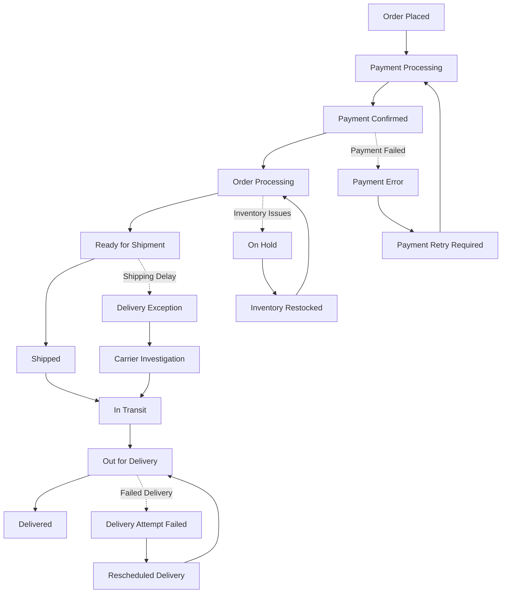
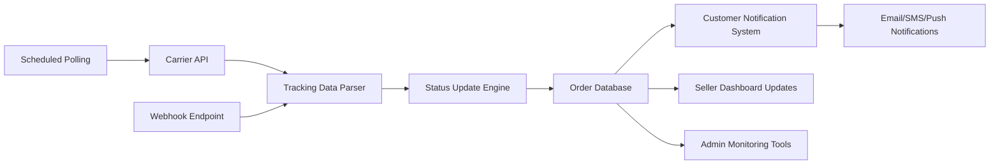
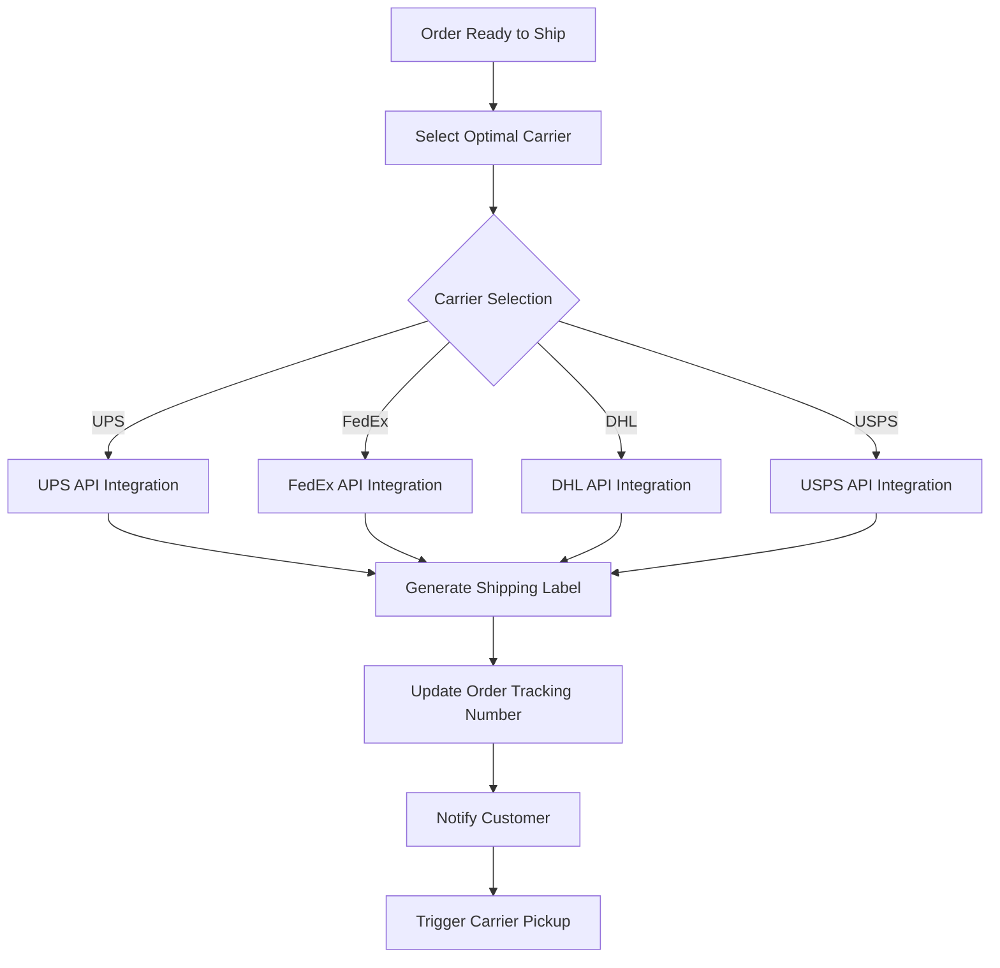
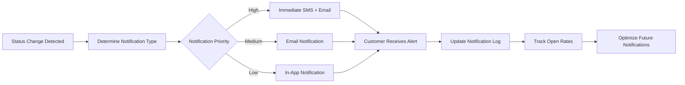
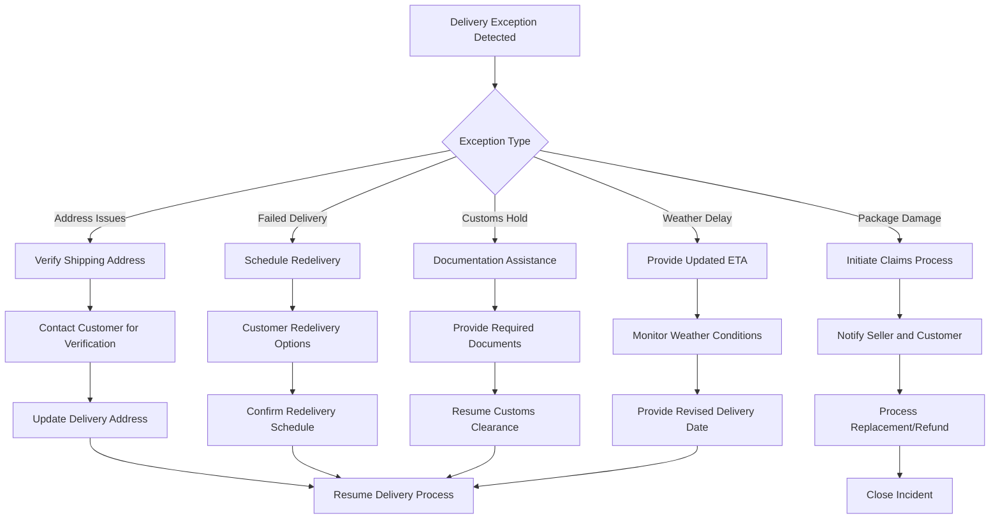
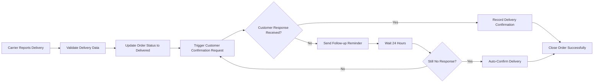
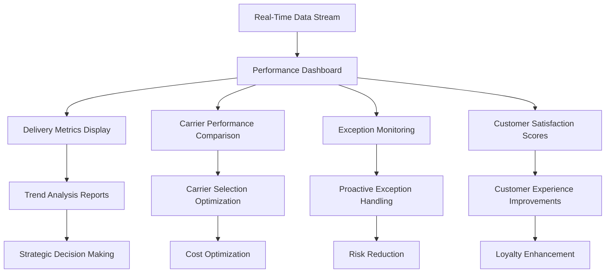

# Order Tracking and Fulfillment System Requirements

## Executive Summary

This document defines the comprehensive order tracking system for the e-commerce shopping mall platform. The system provides real-time visibility into order status from placement through final delivery, ensuring customers receive accurate tracking information while enabling sellers to efficiently manage order fulfillment. The tracking system integrates with shipping carriers, payment processors, and customer communication channels to deliver a seamless post-purchase experience.

### Business Value Proposition
WHEN customers place orders, THE system SHALL provide transparent tracking that builds trust and reduces customer service inquiries. THE platform SHALL deliver real-time status updates that keep customers informed throughout their purchasing journey.

## Order Status Lifecycle Management

### Comprehensive Status Definitions

THE order tracking system SHALL maintain the following order status progression with clear business rules:

### Status Transition Rules

**WHEN an order transitions between statuses, THE system SHALL enforce the following business rules:**

- **FROM "Order Placed" TO "Payment Processing"**: Automatically triggered upon order submission
- **FROM "Payment Processing" TO "Payment Confirmed"**: Requires successful payment authorization
- **FROM "Payment Confirmed" TO "Order Processing"**: Inventory reservation and seller notification
- **FROM "Order Processing" TO "Ready for Shipment"**: Seller marks order as prepared for shipping
- **FROM "Ready for Shipment" TO "Shipped"**: Tracking number generated and carrier pickup confirmed
- **FROM "Shipped" TO "In Transit"**: Carrier confirms package movement in their system
- **FROM "In Transit" TO "Out for Delivery"**: Package on final delivery vehicle
- **FROM "Out for Delivery" TO "Delivered"**: Carrier confirms successful delivery

**IF status transitions violate business rules, THEN THE system SHALL prevent the transition and log the violation attempt.**

## Real-Time Tracking Integration

### Tracking Data Architecture

THE tracking system SHALL maintain real-time synchronization with carrier systems through API integration:

### Tracking Update Frequency

**WHILE an order is in active shipping status, THE system SHALL update tracking information at the following intervals:**

| Order Status | Update Frequency | Data Sources |
|-------------|------------------|-------------|
| **Shipped** | Every 4 hours | Carrier API + Webhooks |
| **In Transit** | Every 2 hours | Real-time carrier updates |
| **Out for Delivery** | Every 30 minutes | GPS tracking + carrier APIs |
| **Delivery Exception** | Immediate | Carrier alerts + manual input |

**WHEN tracking updates are received, THE system SHALL validate data consistency before applying changes to order status.**

## Shipping Carrier Integration

### Supported Carrier Integration

**THE system SHALL integrate with major shipping carriers through standardized APIs:**

#### Carrier API Specifications

### Carrier Performance Requirements

**WHEN selecting shipping carriers, THE system SHALL consider the following performance metrics:**

- **Delivery Reliability**: Minimum 98% on-time delivery rate
- **API Availability**: 99.9% carrier API uptime requirement
- **Tracking Accuracy**: Real-time tracking updates within 15 minutes of carrier scan
- **Customer Support**: 24/7 carrier support accessibility

**IF a carrier fails to meet performance standards, THEN THE system SHALL automatically route orders to alternative carriers.**

## Customer Notification System

### Automated Notification Workflow

**THE system SHALL send automated notifications based on order status changes:**

### Notification Content Requirements

**WHEN sending order tracking notifications, THE system SHALL include the following information:**

#### Order Confirmation Notification
- Order number and purchase date
- Itemized product list with quantities
- Total order amount including taxes and shipping
- Expected processing timeline
- Customer service contact information

#### Shipping Notification
- Tracking number and carrier information
- Estimated delivery date range
- Package dimensions and weight
- Shipping method and service level
- Carrier customer service contact

#### Delivery Updates
- Current package location
- Next expected tracking event
- Any delivery exceptions or delays
- Instructions for delivery coordination
- Proof of delivery requirements

### Customer Preference Management

**THE system SHALL allow customers to customize notification preferences:**

- **Channel Selection**: Email, SMS, push notifications, or combination
- **Frequency Control**: Real-time updates or daily digests
- **Content Preferences**: Detailed tracking or summary updates
- **Do-Not-Disturb Hours**: Time-based notification restrictions

## Exception Handling & Problem Resolution

### Common Delivery Exception Scenarios

**THE system SHALL handle the following delivery exceptions with automated resolution workflows:**

### Exception Resolution SLAs

**WHEN delivery exceptions occur, THE system SHALL enforce the following resolution timelines:**

- **Address Verification**: Customer contact within 2 hours, resolution within 24 hours
- **Failed Delivery**: Redelivery scheduling within 4 hours of failed attempt
- **Package Damage**: Claims initiation within 1 business day, resolution within 7 days
- **Customs Delays**: Documentation assistance within 4 hours, resolution tracking daily

**IF exceptions exceed resolution timelines, THEN THE system SHALL escalate to customer service management.**

## Delivery Confirmation & Proof of Delivery

### Delivery Verification Methods

**THE system SHALL support multiple delivery confirmation methods:**

#### Electronic Proof of Delivery (ePOD)
- Digital signature capture upon delivery
- GPS coordinates of delivery location
- Timestamp of delivery completion
- Photographic evidence of delivery

#### Customer Self-Confirmation
- Mobile app push notification with one-tap confirmation
- Email confirmation link for desktop users
- SMS reply system for simple confirmation
- In-app delivery confirmation workflow

### Delivery Confirmation Workflow

**WHEN a delivery is completed, THE system SHALL execute the following confirmation process:**

### Delivery Dispute Resolution

**IF a customer disputes delivery confirmation, THEN THE system SHALL initiate an investigation process:**

1. **Gather Evidence**: Collect carrier proof of delivery, GPS data, and delivery photos
2. **Customer Interview**: Contact customer for specific concerns and additional details
3. **Carrier Verification**: Confirm delivery details with shipping carrier
4. **Resolution Determination**: Based on evidence, determine appropriate resolution
5. **Compensation Processing**: If warranted, process refund or replacement

## Analytics & Reporting Requirements

### Tracking Performance Metrics

**THE system SHALL track and report on the following key performance indicators:**

#### Delivery Performance Metrics
   - **On-Time Delivery Rate**: Percentage of orders delivered by promised date
   - **Average Transit Time**: Mean time from shipment to delivery
   - **First-Attempt Delivery Success**: Percentage of successful first delivery attempts
   - **Exception Rate**: Frequency of delivery exceptions per 100 shipments

#### Carrier Performance Metrics
   - **Carrier Reliability Score**: Composite score based on delivery performance
   - **API Response Time**: Average carrier API response time
   - **Tracking Update Accuracy**: Percentage of accurate tracking updates
   - **Customer Satisfaction**: Customer ratings for carrier performance

#### Customer Experience Metrics
   - **Notification Open Rates**: Percentage of customers opening tracking notifications
   - **Self-Service Usage**: Frequency of customers checking tracking without support
   - **Support Contact Rate**: Percentage of orders requiring customer service contact
   - **Delivery Experience Score**: Customer ratings of delivery experience

### Real-Time Analytics Dashboard

**THE admin dashboard SHALL provide real-time analytics including:**

## Integration Requirements

### System Integration Architecture

**THE order tracking system SHALL integrate with the following platform components:**

#### Payment System Integration
- **WHEN payment is confirmed, THE system SHALL receive order details for tracking initiation**
- **THE integration SHALL validate payment status before order processing**
- **Real-time payment status synchronization SHALL prevent tracking of unpaid orders**

#### Inventory Management Integration
- **THE system SHALL receive inventory allocation confirmation before shipping**
- **Real-time inventory updates SHALL prevent tracking of out-of-stock items**
- **Inventory reconciliation SHALL occur upon delivery confirmation**

#### User Management Integration
- **Customer profile information SHALL pre-populate shipping addresses**
- **User communication preferences SHALL dictate notification methods**
- **Role-based access SHALL control tracking information visibility**

### API Integration Specifications

**THE tracking system SHALL provide RESTful API endpoints for external integration:**

#### Tracking API Endpoints
- `GET /api/orders/{orderId}/tracking` - Retrieve current tracking status
- `POST /api/orders/{orderId}/tracking/updates` - Submit tracking updates
- `GET /api/carriers/{carrierId}/performance` - Retrieve carrier performance data
- `POST /api/notifications/preferences` - Update customer notification preferences

#### API Security Requirements
- **Authentication**: JWT tokens with role-based permissions
- **Rate Limiting**: 1000 requests per hour per API key
- **Data Encryption**: TLS 1.2+ for all API communications
- **Audit Logging**: Complete API request/response logging

## Security & Performance Requirements

### Data Security Requirements

**THE tracking system SHALL implement comprehensive security measures:**

#### Data Protection
- **Encryption**: All tracking data encrypted at rest and in transit
- **Access Control**: Role-based permissions for tracking information access
- **Audit Trail**: Complete logging of all tracking data accesses and modifications
- **Data Retention**: Tracking data retained for 7 years for compliance purposes

#### Privacy Compliance
- **GDPR Compliance**: Customer data processing according to GDPR requirements
- **Data Minimization**: Only collect necessary tracking information
- **Customer Consent**: Obtain consent for tracking communications
- **Right to Erasure**: Support customer data deletion requests

### Performance Requirements

**THE tracking system SHALL meet the following performance standards:**

#### Response Time Standards
- **Tracking Page Load**: Less than 2 seconds under normal load
- **API Response Time**: Less than 500 milliseconds for tracking queries
- **Notification Delivery**: Less than 5 seconds from status change detection
- **Data Synchronization**: Real-time updates within 30 seconds of carrier scan

#### Scalability Requirements
- **Concurrent Users**: Support 10,000+ simultaneous tracking sessions
- **Order Volume**: Handle 100,000+ daily order tracking updates
- **Carrier API Calls**: Process 1,000+ API requests per minute
- **Notification Volume**: Deliver 50,000+ notifications per hour

### System Availability

**THE tracking system SHALL maintain high availability standards:**

- **Uptime Requirement**: 99.9% availability for core tracking functionality
- **Disaster Recovery**: Maximum 4-hour recovery time objective (RTO)
- **Data Backup**: Daily backups with 15-minute incremental updates
- **Monitoring**: 24/7 system monitoring with automated alerting

## Success Criteria & Acceptance Testing

### Key Success Metrics

**THE order tracking system SHALL be considered successful when achieving:**

- **Customer Satisfaction**: 95%+ customer satisfaction with tracking experience
- **Delivery Accuracy**: 98%+ on-time delivery rate across all carriers
- **Notification Effectiveness**: 90%+ open rate for tracking notifications
- **System Reliability**: 99.9% uptime for tracking functionality
- **Resolution Efficiency**: 95%+ exception resolution within SLA timelines

### Acceptance Testing Criteria

**BEFORE system deployment, THE following acceptance criteria MUST be verified:**

- **Integration Testing**: All carrier API integrations functioning correctly
- **Performance Validation**: Response times meet or exceed defined standards
- **Security Compliance**: All security measures implemented and validated
- **User Experience**: Customer tracking interface intuitive and responsive
- **Administrative Controls**: Admin dashboard provides comprehensive oversight

**THE system SHALL undergo rigorous testing including unit tests, integration tests, performance tests, and user acceptance testing before production deployment.**

> *Developer Note: This document defines **business requirements only**. All technical implementations (architecture, APIs, database design, etc.) are at the discretion of the development team.*