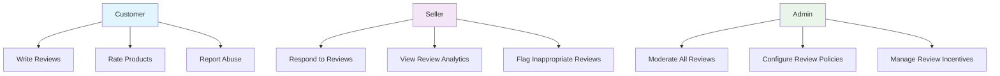
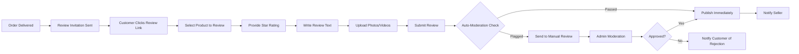
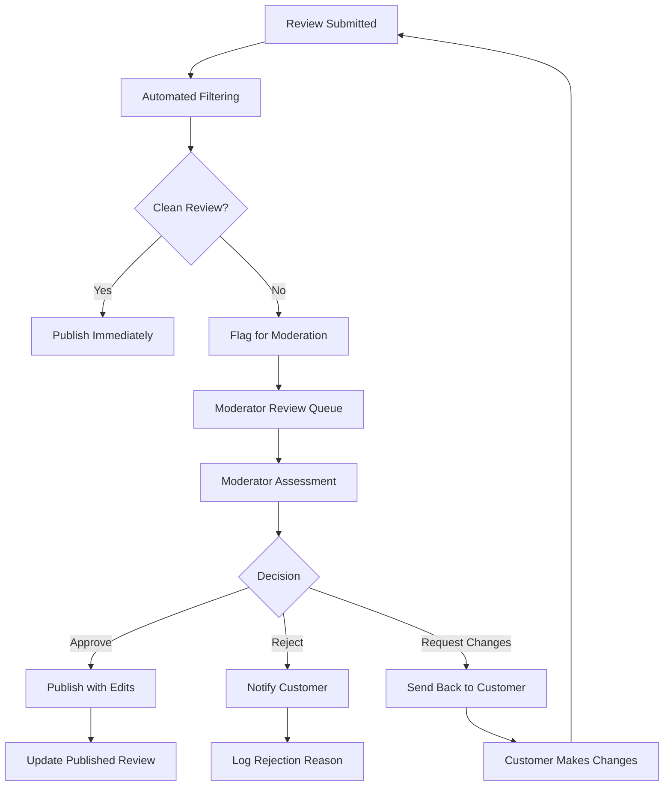

# Product Reviews and Ratings System Requirements

## Executive Summary

This document defines the comprehensive requirements for the product reviews and ratings system within the e-commerce shopping mall platform. The system enables customers to share authentic feedback about their purchases, helps sellers improve product quality and customer service, and assists future buyers in making informed purchasing decisions.

## Business Context & Objectives

### Business Justification
WHEN customers share product experiences, THE platform SHALL build trust and authenticity in the marketplace. Verified reviews and ratings provide valuable social proof that influences purchasing decisions and drives customer confidence.

### Key Business Objectives
- **THE system SHALL** capture authentic customer feedback to build marketplace credibility
- **WHEN reviews are published, THE system SHALL** provide sellers with actionable insights for improvement
- **WHILE maintaining review integrity, THE system SHALL** prevent abuse and manipulation
- **IF review quality standards are met, THE system SHALL** enhance product discoverability through ratings

## User Roles & Permissions

### Role-Based Access Control

### Permission Matrix
| Action | Customer | Seller | Admin |
|--------|----------|---------|--------|
| Write Review | ✅ (Purchased only) | ❌ | ❌ |
| Edit Own Review | ✅ | ❌ | ✅ |
| Delete Own Review | ✅ | ❌ | ✅ |
| Respond to Review | ❌ | ✅ (Own products) | ✅ |
| Moderate Reviews | ❌ | ❌ | ✅ |
| View Review Analytics | ❌ | ✅ (Own products) | ✅ |

## Review Creation Process

### Review Eligibility Requirements
**WHEN a customer receives an order, THE system SHALL** enable review creation for delivered items.

**THE customer SHALL be able to write reviews only for products they have purchased and received.**

**WHILE creating a review, THE system SHALL validate purchase history and delivery confirmation.**

### Review Creation Workflow

### Review Content Requirements
**WHEN writing a review, THE system SHALL require:**
- Star rating (1-5 stars)
- Review title (optional, max 100 characters)
- Review text (min 10 characters, max 1000 characters)
- Product rating categories (if configured)

**THE system SHALL support optional content including:**
- Photo uploads (max 5 images, 5MB each)
- Video uploads (max 1 video, 50MB, 30 seconds)
- Product variant specification
- Usage duration (e.g., "Used for 3 months")

## Rating System & Validation

### Star Rating Requirements
**THE rating system SHALL use a 5-star scale with the following definitions:**
- ⭐⭐⭐⭐⭐ Excellent: Exceeded expectations
- ⭐⭐⭐⭐ Good: Met expectations with minor issues
- ⭐⭐⭐ Average: Met basic expectations
- ⭐⭐ Poor: Below expectations with significant issues
- ⭐ Terrible: Completely unsatisfactory

### Rating Validation Rules
**WHEN a customer submits a rating, THE system SHALL validate:**
- The customer has purchased and received the product
- The rating is within the valid range (1-5 stars)
- The customer hasn't already rated the same product purchase
- The purchase occurred within the allowed review window (typically 90 days)

### Average Rating Calculation
**THE system SHALL calculate product average ratings using the formula:**
`(Sum of all ratings) / (Number of ratings)`

**WHILE calculating averages, THE system SHALL:**
- Round to nearest 0.1 star
- Display rating distribution (number of reviews per star)
- Update averages in real-time when new reviews are added
- Cache ratings for performance optimization

## Review Moderation Rules

### Automated Moderation System
**WHEN a review is submitted, THE system SHALL perform automated checks for:**
- Profanity and inappropriate language
- Personal information (email, phone numbers, addresses)
- Spam patterns and duplicate content
- Review authenticity indicators

### Manual Moderation Requirements
**WHERE automated systems flag content, THE system SHALL route reviews to human moderators.**

**THE moderation team SHALL review flagged content within 24 hours of submission.**

### Moderation Criteria
| Criteria | Action | Reason |
|----------|--------|---------|
| Profanity | Reject | Violates community guidelines |
| Personal Information | Reject/Edit | Privacy violation |
| Fake Reviews | Reject | Authenticity concerns |
| Competitor Promotion | Reject | Spam/Manipulation |
| Helpful but Inappropriate | Edit | Content quality |

### Moderation Workflow

## Seller Response Mechanism

### Seller Response Requirements
**WHEN a review is published, THE system SHALL notify the seller** within 2 hours of publication.

**THE seller SHALL be able to respond to reviews** for their products within 30 days of review publication.

### Response Guidelines
**WHILE crafting responses, sellers SHALL follow these guidelines:**
- Professional and respectful tone
- Address specific customer concerns
- Offer solutions or explanations
- Avoid defensive or argumentative language
- Respond within 7 days for optimal customer satisfaction

### Response Moderation
**THE system SHALL moderate seller responses** using the same criteria as customer reviews.

**WHERE a seller response violates guidelines, THE system SHALL** remove the response and notify the seller.

## Review Display & Sorting

### Review Display Requirements
**WHEN displaying reviews on product pages, THE system SHALL show:**
- Average star rating prominently
- Total number of reviews
- Rating distribution breakdown
- Most relevant reviews first
- "Verified Purchase" badges for authenticated reviews

### Sorting Options
**THE system SHALL provide multiple sorting options:**
- Most Recent (default)
- Highest Rated
- Lowest Rated
- Most Helpful
- With Photos/Video

### Review Filtering
**CUSTOMERS SHALL be able to filter reviews by:**
- Star rating (1-5 stars)
- Verified purchases only
- Reviews with media
- Specific product variants
- Date ranges

### Review Pagination
**THE system SHALL display reviews in pages of 10 reviews each** with infinite scroll or traditional pagination.

**WHILE loading additional reviews, THE system SHALL maintain performance** with lazy loading techniques.

## Abuse & Spam Prevention

### Fraud Detection System
**THE system SHALL implement multiple layers of fraud detection** to prevent review manipulation.

**WHEN detecting suspicious activity, THE system SHALL flag reviews** for manual investigation.

### Anti-Manipulation Measures
**THE system SHALL prevent:**
- Multiple reviews from same customer for same product
- Review trading or incentivized reviews
- Competitor review bombing
- Fake review campaigns

### Detection Algorithms
**THE abuse prevention system SHALL analyze:**
- IP address patterns
- Review timing and frequency
- Review content similarity
- Customer purchase patterns
- Device fingerprinting

### Abuse Reporting System
**WHEN users encounter abusive content, THE system SHALL provide** easy reporting mechanisms.

**REPORTED CONTENT SHALL be reviewed** within 24 hours by moderation team.

## Review Analytics & Impact

### Seller Analytics Dashboard
**THE system SHALL provide sellers with comprehensive review analytics** including:
- Average rating trends over time
- Rating distribution analysis
- Common themes in positive/negative reviews
- Response rate metrics
- Impact on sales conversion

### Customer Behavior Analytics
**THE platform SHALL track how reviews influence** customer behavior including:
- Click-through rates on reviewed products
- Conversion rates based on review scores
- Time spent reading reviews
- Review helpfulness voting patterns

### Performance Metrics
| Metric | Calculation | Target |
|--------|-------------|---------|
| Review Response Rate | (Reviews Responded / Total Reviews) | > 60% |
| Average Review Score | Average of all product ratings | > 4.0 |
| Review Helpfulness | % of reviews marked helpful | > 30% |
| Review Coverage | % of products with reviews | > 80% |

## Review Incentive System

### Ethical Incentive Guidelines
**THE system SHALL allow ethical review incentives** that don't compromise review authenticity.

**WHEN offering incentives, THE system SHALL require** disclosure of incentive programs.

### Incentive Types
**THE platform SHALL support incentive programs including:**
- Loyalty points for writing reviews
- Entry into prize drawings
- Small discounts on future purchases
- Early access to new products

### Incentive Eligibility
**CUSTOMERS SHALL only receive incentives for** authentic, helpful reviews that meet quality standards.

**THE system SHALL monitor incentive programs** to prevent abuse and maintain review integrity.

## Integration Requirements

### Order System Integration
**THE reviews system SHALL integrate with the order management system** to validate purchase history.

**WHEN an order is delivered, THE system SHALL trigger** review invitation workflows.

### Notification System Integration
**THE reviews system SHALL integrate with the notification system** for:
- Review invitation emails
- Seller response notifications
- Moderation status updates
- Abuse report alerts

### Search Integration
**THE system SHALL integrate review data** into product search rankings.

**WHEN calculating search relevance, THE system SHALL consider** review scores and volume.

## Performance Requirements

### Response Time Standards
**THE reviews system SHALL meet performance benchmarks:**
- Review submission: < 2 seconds
- Review display: < 1 second
- Rating calculations: < 500 milliseconds
- Search and filtering: < 2 seconds

### Scalability Requirements
**THE system SHALL support:**
- 10,000+ concurrent review submissions
- Real-time rating updates
- Advanced search and filtering
- High-volume moderation workflows

## Security & Privacy Requirements

### Data Protection
**THE system SHALL protect reviewer privacy** by:
- Anonymizing reviewer identities in public displays
- Encrypting review data in storage and transit
- Implementing access controls for sensitive data
- Complying with data protection regulations

### Content Security
**THE system SHALL prevent** malicious content including:
- Cross-site scripting (XSS) attacks
- SQL injection attempts
- Malicious file uploads
- Phishing attempts

## Error Handling & Recovery

### Common Error Scenarios
**IF review submission fails, THE system SHALL** preserve draft content for recovery.

**WHEN moderation systems fail, THE system SHALL** default to manual review processes.

**WHERE rating calculations encounter errors, THE system SHALL** use cached values with error logging.

### Recovery Procedures
**THE system SHALL implement** comprehensive backup and recovery for review data.

**WHILE recovering from failures, THE system SHALL maintain** data consistency and integrity.

## Success Metrics & KPIs

### Key Performance Indicators
- **Review Coverage**: Percentage of products with at least one review (Target: 85%)
- **Average Review Score**: Overall platform rating average (Target: 4.2+)
- **Review Response Rate**: Percentage of reviews with seller responses (Target: 70%)
- **Review Helpfulness**: Percentage of reviews marked helpful (Target: 35%)
- **Moderation Response Time**: Average time to review flagged content (Target: < 24 hours)

### Customer Satisfaction Metrics
- **Review Trust Score**: Customer perception of review authenticity (Target: 4.5/5)
- **Review Utility Score**: Helpfulness of reviews in purchase decisions (Target: 4.3/5)
- **Seller Response Satisfaction**: Customer satisfaction with seller responses (Target: 4.2/5)

## Compliance Requirements

### Legal Compliance
**THE reviews system SHALL comply with** relevant consumer protection laws and regulations.

**WHEN handling review content, THE system SHALL respect** intellectual property rights and copyright laws.

### Platform Policies
**THE system SHALL enforce** platform-specific content guidelines and community standards.

**WHILE moderating content, THE system SHALL maintain** consistency with platform values and brand guidelines.

## Future Enhancements

### Planned Features
- **AI-Powered Review Summarization**: Automatically generate product summaries from reviews
- **Sentiment Analysis**: Advanced analysis of review emotions and themes
- **Video Review Enhancements**: Support for longer video reviews with editing tools
- **Reviewer Reputation System**: Build reviewer credibility scores over time
- **Cross-Platform Review Import**: Import reviews from other platforms with verification

### Integration Roadmap
- **Social Media Integration**: Share reviews on social platforms
- **Email Marketing Integration**: Include reviews in product recommendation emails
- **Mobile App Enhancements**: Optimized review experience for mobile users
- **Voice Review Support**: Allow voice-recorded reviews

This comprehensive reviews and ratings system provides the foundation for building customer trust, improving product quality, and enhancing the overall shopping experience on the e-commerce platform.