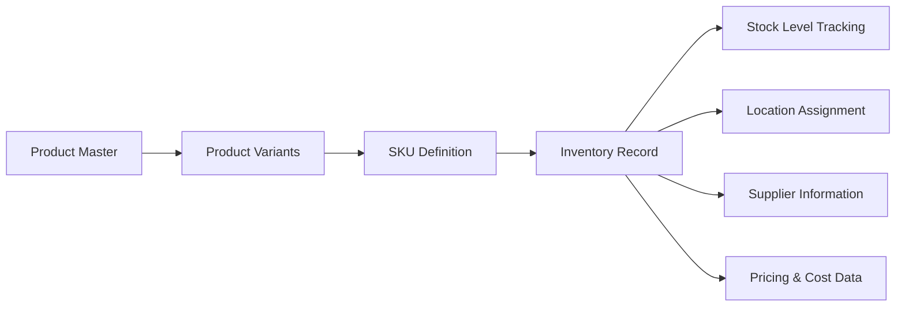
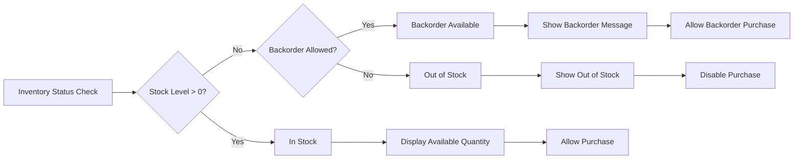
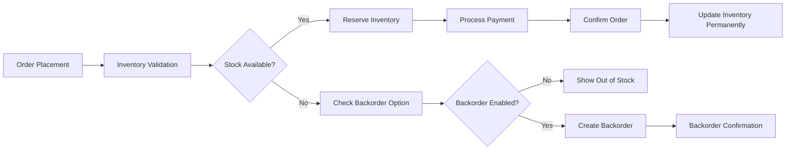
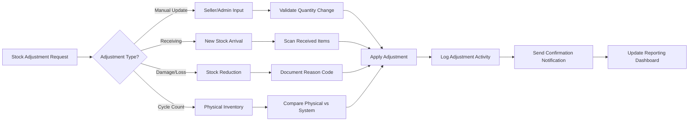
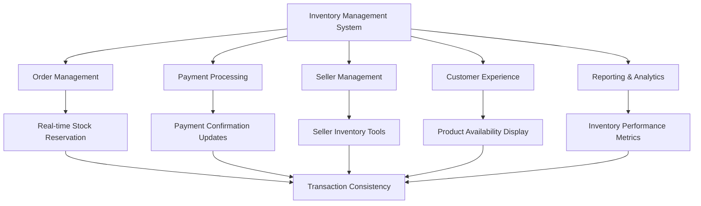
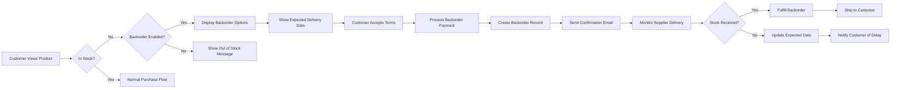
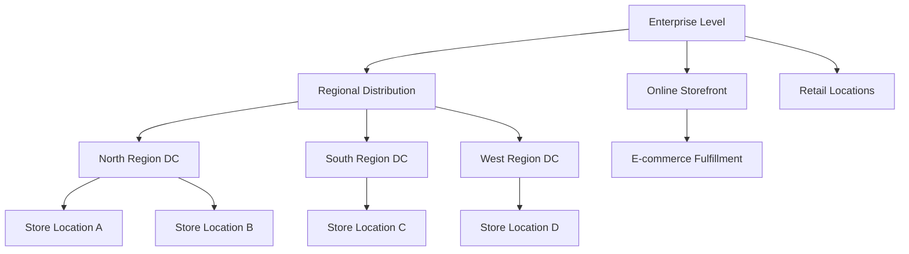
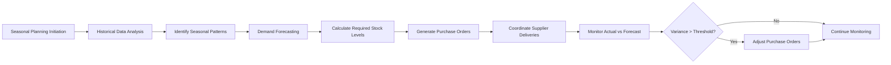

# Inventory Management System Requirements

## Executive Summary

This document defines the comprehensive inventory management system for the e-commerce shopping mall platform. The system provides real-time SKU-level inventory tracking, automated stock alerts, multi-location inventory management, and robust reporting capabilities to ensure optimal stock levels and prevent overselling while maintaining complete integration with order processing, seller management, and customer experience systems.

### Business Context
Inventory management serves as the critical bridge between customer demand and product availability. The system must maintain perfect synchronization between physical stock levels and digital product availability while supporting complex business operations including supplier management, seasonal demand fluctuations, and multi-channel sales integration.

## Core Inventory System

### SKU-Based Inventory Tracking

**INVENTORY ENTITY STRUCTURE**

**WHEN creating inventory records, THE system SHALL maintain comprehensive SKU-level tracking** including:
- Unique SKU identifier generation for each product variant combination
- Real-time stock quantity updates with transaction-level accuracy
- Minimum and maximum stock threshold configuration per SKU
- Backorder availability settings with customer communication templates
- Multi-location inventory tracking with location-specific stock levels
- Supplier information and lead time calculations

**INVENTORY STATUS DEFINITIONS**

### Inventory Record Requirements

**EACH inventory record SHALL contain the following mandatory fields:**
- **SKU IDENTIFIER**: Unique alphanumeric code following platform naming conventions
- **CURRENT STOCK QUANTITY**: Real-time available quantity with decimal support for bulk items
- **MINIMUM STOCK THRESHOLD**: Configurable low-stock alert level based on sales velocity
- **MAXIMUM STOCK CAPACITY**: Physical storage limitations and optimal stock levels
- **BACKORDER SETTING**: Boolean flag enabling/disabling backorder purchases
- **SUPPLIER INFORMATION**: Primary and secondary supplier details with contact information
- **LEAD TIME CALCULATION**: Average delivery time from order placement to stock receipt
- **COST INFORMATION**: Landed cost, wholesale price, and margin calculations
- **LOCATION ASSIGNMENT**: Physical storage location with bin/shelf tracking
- **LAST UPDATED TIMESTAMP**: Audit trail for all inventory modifications

## Stock Management System

### Real-Time Inventory Updates

**WHEN a customer places an order, THE system SHALL immediately reserve the ordered quantity** from available inventory with the following business rules:
- Inventory reservation duration: 15 minutes for payment processing
- Automatic release of reserved stock upon payment timeout
- Prevention of negative inventory through transaction validation
- Synchronization across all sales channels to prevent overselling

**ORDER PROCESSING WORKFLOW**

### Stock Adjustment Management

**THE system SHALL support comprehensive stock adjustment capabilities** through multiple workflow types:

**MANUAL ADJUSTMENT WORKFLOW**

**STOCK ADJUSTMENT VALIDATION RULES**
- **WHEN processing manual adjustments, THE system SHALL validate quantity changes** against current stock levels to prevent negative inventory
- **WHERE adjustment reasons require approval, THE system SHALL implement multi-level approval workflows** based on adjustment amount and impact
- **IF stock adjustments exceed configured thresholds, THE system SHALL escalate for managerial review** before processing

## Alert & Notification System

### Comprehensive Alert Framework

**WHEN inventory levels require attention, THE system SHALL generate automated alerts** with configurable thresholds and escalation paths:

**LOW-STOCK ALERT MATRIX**
| Stock Level | Alert Severity | Notification Channels | Response Time | Escalation Path |
|-------------|----------------|----------------------|---------------|-----------------|
| Below 10% of capacity | Critical | Email, SMS, Dashboard, Mobile Push | Immediate | Seller → Admin → Supplier |
| Below 25% of capacity | High | Email, Dashboard | 4 hours | Seller → Inventory Manager |
| Below 50% of capacity | Medium | Dashboard Only | 24 hours | Seller Notification |
| Out of stock | Urgent | Email, SMS, Dashboard, Mobile Push | Immediate | Seller → Admin → Customer Service |

### Alert Configuration Management

**EACH seller SHALL have comprehensive alert configuration capabilities** including:
- **MINIMUM STOCK THRESHOLDS**: Percentage-based or quantity-based triggers per SKU
- **ALERT FREQUENCY SETTINGS**: Real-time, daily digest, or weekly summary options
- **NOTIFICATION CHANNELS**: Email, SMS, mobile push, or dashboard notifications
- **ESCALATION RULES**: Automatic escalation for unacknowledged critical alerts
- **SUPPRESSION SETTINGS**: Temporary alert suppression for planned stock outages

### Supplier Communication Integration

**WHEN low-stock alerts reach critical levels, THE system SHALL automate supplier communication** including:
- Automated purchase order generation based on historical demand patterns
- Supplier notification with required delivery dates and quantities
- Tracking of supplier response times and fulfillment performance
- Integration with supplier portals for real-time stock status updates

## Inventory Synchronization System

### Multi-System Integration Architecture

**THE inventory management system SHALL maintain perfect synchronization** with all connected platform components:

**SYNCHRONIZATION ARCHITECTURE**

### Data Consistency Requirements

**WHILE synchronizing inventory data across systems, THE system SHALL implement** transaction-based consistency guarantees:
- **ACID COMPLIANCE**: Atomic, consistent, isolated, and durable transaction processing
- **CONFLICT RESOLUTION**: Timestamp-based conflict resolution for concurrent updates
- **AUDIT TRAIL MAINTENANCE**: Complete transaction logging for compliance and debugging
- **AUTOMATIC RECONCILIATION**: Scheduled reconciliation processes to identify and resolve discrepancies

### Error Handling and Recovery

**IF synchronization failures occur, THE system SHALL implement comprehensive recovery procedures**:
- **AUTOMATIC RETRY MECHANISMS**: Exponential backoff retry logic with configurable limits
- **MANUAL OVERRIDE CAPABILITIES**: Administrative tools for manual synchronization forcing
- **ERROR NOTIFICATION SYSTEM**: Immediate alerting for persistent synchronization issues
- **DATA INTEGRITY CHECKS**: Regular validation of consistency across all integrated systems

## Backorder Management System

### Backorder Configuration Framework

**SELLERS SHALL have granular control over backorder settings** with comprehensive configuration options:

**BACKORDER SETTING REQUIREMENTS**
- **BACKORDER AVAILABILITY**: Enable/disable backorder purchases per SKU
- **MAXIMUM BACKORDER QUANTITY**: Limit simultaneous backorder commitments
- **EXPECTED RESTOCK DATE**: Dynamic date calculation based on supplier lead times
- **CUSTOMER COMMUNICATION**: Automated notification templates for backorder status updates
- **PRICING STRATEGY**: Backorder-specific pricing rules and discount configurations

### Backorder Purchase Workflow

**COMPLETE BACKORDER PROCESSING PIPELINE**

### Backorder Fulfillment Automation

**WHEN new stock arrives for products with pending backorders, THE system SHALL automate** the fulfillment process:
- **AUTOMATIC ALLOCATION**: Chronological allocation of new stock to backorder customers
- **STATUS UPDATES**: Automatic notification of backorder fulfillment progress
- **PAYMENT PROCESSING**: Secure payment processing upon stock availability confirmation
- **SHIPPING COORDINATION**: Integration with shipping systems for timely fulfillment

## Reporting & Analytics System

### Comprehensive Performance Metrics

**THE system SHALL provide detailed inventory performance analytics** with real-time dashboard capabilities:

**KEY PERFORMANCE INDICATORS**
| Metric Category | Specific Metrics | Calculation Method | Target Values |
|-----------------|-----------------|-------------------|---------------|
| **Stock Accuracy** | Inventory Variance Rate | (Physical Count - System Count) / System Count | < 1% variance |
| **Turnover Performance** | Inventory Turnover Ratio | Cost of Goods Sold / Average Inventory | > 8 turns annually |
| **Service Level** | Stockout Frequency | Number of stockout events / Total time period | < 2% of SKUs monthly |
| **Cost Efficiency** | Carrying Cost Percentage | (Holding Costs / Average Inventory Value) × 100 | < 25% of inventory value |
| **Supplier Performance** | On-Time Delivery Rate | On-time deliveries / Total deliveries | > 95% on-time |

### Real-Time Dashboard Requirements

**SELLERS SHALL have access to comprehensive inventory dashboards** with the following capabilities:
- **REAL-TIME STOCK LEVELS**: Current inventory status across all SKUs with color-coded alerts
- **SALES VELOCITY ANALYSIS**: Historical sales patterns and demand forecasting
- **RESTOCK RECOMMENDATIONS**: Automated purchase suggestions based on lead times and demand
- **PERFORMANCE BENCHMARKING**: Comparison against category averages and historical performance
- **MOBILE ACCESS**: Responsive design for inventory management on mobile devices

### Automated Reporting System

**THE system SHALL generate scheduled inventory reports** with comprehensive data analysis:
- **DAILY STOCK SUMMARY**: Morning inventory status report with critical alerts
- **WEEKLY PERFORMANCE**: Sales trends, stock movements, and variance analysis
- **MONTHLY ANALYTICS**: Comprehensive performance review with recommendations
- **QUARTERLY STRATEGIC**: Seasonal planning and inventory strategy adjustments
- **ANNUAL REVIEW**: Year-over-year performance comparison and goal setting

## Multi-Location Inventory Management

### Location Hierarchy Architecture

**THE system SHALL support complex multi-location inventory structures** with hierarchical organization:

**LOCATION MANAGEMENT STRUCTURE**

### Location-Based Business Rules

**WHERE inventory is distributed across multiple locations, THE system SHALL implement** intelligent distribution rules:
- **AUTOMATIC STOCK ALLOCATION**: Demand-based allocation to optimize fulfillment times
- **CROSS-LOCATION TRANSFERS**: Automated transfer recommendations between locations
- **LOCATION-SPECIFIC PRICING**: Regional pricing strategies based on local market conditions
- **SHIPPING OPTIMIZATION**: Cost-effective shipping from nearest available stock location

### Inventory Transfer Management

**WHEN inventory transfers between locations are required, THE system SHALL manage** the complete transfer lifecycle:
- **TRANSFER REQUEST GENERATION**: Automated suggestions based on demand patterns
- **APPROVAL WORKFLOWS**: Multi-level approval processes for significant transfers
- **TRACKING AND MONITORING**: Real-time transfer status with estimated arrival times
- **DOCUMENTATION GENERATION**: Shipping labels, transfer manifests, and receiving documentation
- **AUTOMATIC INVENTORY UPDATES**: Synchronized stock level adjustments upon transfer completion

## Seasonal Inventory Planning

### Demand Forecasting System

**THE system SHALL provide advanced demand forecasting capabilities** for seasonal inventory planning:

**FORECASTING METHODOLOGY**
- **HISTORICAL ANALYSIS**: Multi-year sales data analysis for seasonal pattern identification
- **EXTERNAL FACTORS INTEGRATION**: Weather data, economic indicators, and market trends
- **PREDICTIVE ANALYTICS**: Machine learning algorithms for demand pattern recognition
- **SCENARIO PLANNING**: What-if analysis for different seasonal conditions

### Seasonal Planning Workflow

**COMPREHENSIVE SEASONAL INVENTORY MANAGEMENT**

### Seasonal Business Rules

**SELLERS SHALL be able to configure seasonal inventory parameters** with comprehensive control:
- **SEASONAL DEMAND MULTIPLIERS**: Percentage-based adjustments for peak seasons
- **PRE-SEASON STOCK BUILDUP**: Timed inventory accumulation before seasonal peaks
- **POST-SEASON CLEARANCE**: Automated pricing strategies for excess seasonal inventory
- **CROSS-SEASONAL TRANSITIONS**: Smooth inventory transitions between seasonal product lines

## Performance Requirements

### System Responsiveness Standards

**THE inventory management system SHALL meet strict performance benchmarks** for optimal user experience:

**PERFORMANCE REQUIREMENTS MATRIX**
| Operation Type | Maximum Response Time | Concurrent User Support | Data Volume Handling |
|----------------|----------------------|------------------------|---------------------|
| Inventory Updates | 2 seconds | 1,000 simultaneous updates | 1,000,000+ SKUs |
| Stock Level Queries | 1 second | 10,000 concurrent queries | Real-time availability |
| Report Generation | 30 seconds | 100 simultaneous reports | Multi-year historical data |
| Alert Processing | 500 milliseconds | Unlimited alert generation | Real-time monitoring |
| Synchronization | 5 seconds | 500 concurrent sync operations | Cross-system data consistency |

### Scalability Architecture

**THE system SHALL be designed for horizontal scalability** to accommodate business growth:
- **DATABASE SHARDING**: Geographic and category-based data distribution
- **LOAD BALANCING**: Intelligent request routing across multiple server instances
- **CACHING STRATEGIES**: Multi-layer caching for frequently accessed inventory data
- **ASYNC PROCESSING**: Background processing for non-critical inventory operations

### Data Integrity Guarantees

**THE system SHALL maintain 99.9% inventory accuracy** through comprehensive integrity measures:
- **REGULAR AUDITS**: Scheduled physical inventory counts with variance analysis
- **AUTOMATED RECONCILIATION**: Daily system-to-physical inventory reconciliation
- **TRANSACTION VALIDATION**: Pre-commit validation for all inventory modifications
- **BACKUP AND RECOVERY**: Automated backup procedures with point-in-time recovery

## Error Handling & Recovery System

### Comprehensive Error Scenarios

**THE system SHALL implement robust error handling** for common inventory management scenarios:

**INVENTORY SYNCHRONIZATION FAILURES**
- **IF external system connectivity is lost, THE system SHALL queue synchronization attempts** with exponential backoff retry logic
- **WHEN synchronization conflicts occur, THE system SHALL implement timestamp-based resolution** with administrative override capabilities
- **WHERE data corruption is detected, THE system SHALL automatically restore** from the most recent consistent backup

### Disaster Recovery Procedures

**THE system SHALL maintain comprehensive disaster recovery capabilities** including:
- **AUTOMATED BACKUP SCHEDULING**: Daily full backups with hourly transaction log backups
- **GEOGRAPHIC REDUNDANCY**: Multi-region data replication for business continuity
- **FAILOVER PROCEDURES**: Automatic failover to secondary systems during primary outages
- **RECOVERY TIME OBJECTIVES**: Maximum 4-hour recovery time for critical inventory functions

### Overselling Prevention Mechanisms

**THE system SHALL implement multiple layers of overselling protection**:
- **REAL-TIME INVENTORY RESERVATION**: Immediate stock reservation upon order placement
- **ORDER VALIDATION CHECKS**: Pre-payment inventory validation for all orders
- **INVENTORY LOCKING MECHANISMS**: Transaction-level locking during high-concurrency periods
- **EMERGENCY STOCK ADJUSTMENT PROTOCOLS**: Administrative tools for critical stock corrections

## Integration Requirements

### System Integration Architecture

**THE inventory management system SHALL integrate seamlessly** with all platform components:

**COMPREHENSIVE INTEGRATION MATRIX**
| Integrated System | Integration Method | Data Synchronization | Error Handling |
|-------------------|-------------------|---------------------|----------------|
| Order Management | Real-time API calls | Immediate stock reservation | Automatic rollback on failure |
| Payment Processing | Transaction hooks | Payment confirmation updates | Payment failure inventory restoration |
| Seller Management | Seller portal integration | Real-time inventory visibility | Seller permission validation |
| Customer Experience | Product availability API | Real-time stock status display | Graceful degradation during outages |
| Reporting & Analytics | Data export APIs | Scheduled data synchronization | Data validation and reconciliation |

### API Endpoint Specifications

**THE system SHALL provide comprehensive RESTful API endpoints** for external integration:

**INVENTORY MANAGEMENT APIS**
- **STOCK LEVEL QUERIES**: Real-time inventory availability checks
- **INVENTORY UPDATES**: Secure stock adjustment operations
- **REPORTING DATA**: Historical inventory performance data
- **SYNCHRONIZATION STATUS**: Integration health monitoring
- **ALERT MANAGEMENT**: Alert configuration and status tracking

### Security and Compliance Integration

**ALL inventory integrations SHALL maintain security compliance** through:
- **API AUTHENTICATION**: OAuth 2.0 with role-based access control
- **DATA ENCRYPTION**: End-to-end encryption for all sensitive inventory data
- **AUDIT TRAIL MAINTENANCE**: Comprehensive logging of all inventory transactions
- **COMPLIANCE REPORTING**: Automated reporting for regulatory requirements

> *Developer Note: This document defines **business requirements only**. All technical implementations (architecture, APIs, database design, etc.) are at the discretion of the development team.*