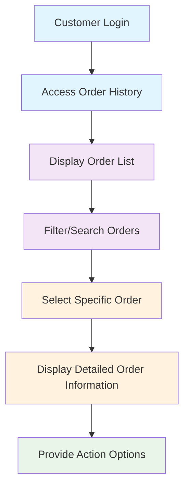
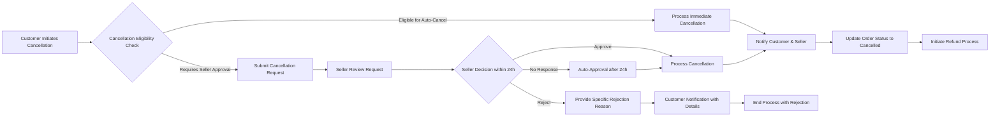
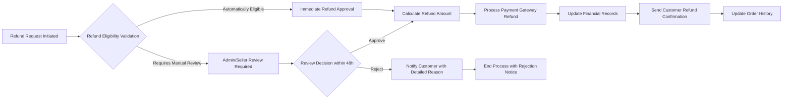
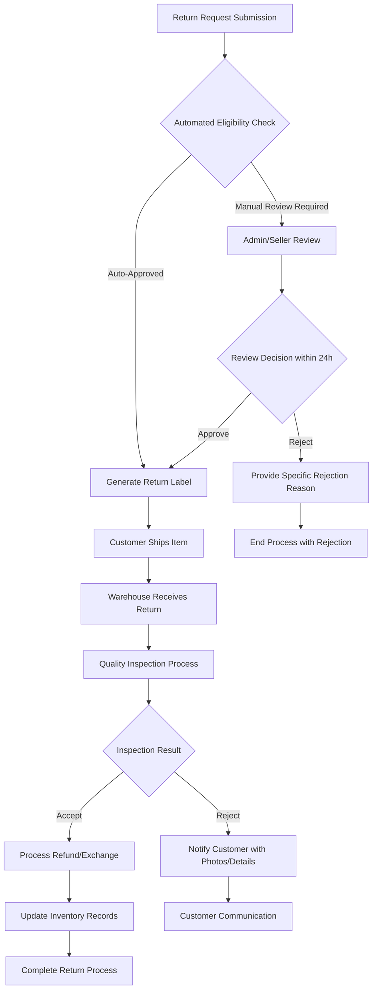
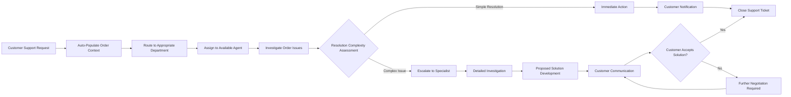

# Order History, Cancellation, and Refund Management System

## Executive Summary

This document defines the comprehensive requirements for the order history, cancellation, and refund management system within the e-commerce shopping mall platform. The system provides customers with complete visibility into their purchase history while enabling efficient processing of cancellations, refunds, and returns. The solution balances customer self-service capabilities with administrative oversight to ensure financial accuracy and compliance with business policies.

### Business Objectives
**WHEN customers access their order history, THE system SHALL display comprehensive order information with real-time status updates.**
**WHERE orders require cancellation, THE system SHALL provide automated workflows with clear eligibility criteria.**
**WHILE processing refunds, THE system SHALL ensure accurate financial calculations and timely payment processing.**

## Core Business Requirements

### Success Metrics Definition
**THE system SHALL achieve the following performance targets:**
- Order cancellation processing time: <= 24 hours for eligible orders
- Refund processing time: <= 3-5 business days
- Customer satisfaction score: >= 4.5/5 for order management experience
- Dispute resolution time: <= 72 hours
- System availability: >= 99.9% for order history access

## Order History Display & Management

### Order History Interface Requirements

**WHEN a customer accesses their order history, THE system SHALL display the following information for each order:**
- Order number and purchase date (format: YYYY-MM-DD HH:MM)
- Current order status with color-coded visual indicators
- Total amount paid with currency formatting
- Shipping address with recipient name and contact information
- Payment method used for the transaction
- Product details including images, variants, and quantities
- Tracking information with carrier details when available
- Estimated delivery date range

**THE system SHALL provide comprehensive filtering capabilities allowing customers to:**
- Filter by time period (last 30 days, 3 months, 6 months, 1 year, custom date range)
- Filter by order status (pending, confirmed, shipped, delivered, cancelled, returned)
- Filter by product category or specific product name
- Filter by seller/store name
- Search by order number or product keywords

## Order Cancellation Workflow

### Cancellation Eligibility Rules

**THE system SHALL implement the following cancellation eligibility criteria:**

**WHEN an order is placed within 30 minutes of the current time, THEN THE system SHALL allow immediate cancellation without seller approval.**

**WHILE an order status remains "pending" or "confirmed" and has not been shipped, THE system SHALL enable customer-initiated cancellation requests.**

**WHERE the seller has processed the order for shipping (status: "shipped" or later), THE system SHALL require seller approval for cancellation requests.**

### Cancellation Request Process

**WHEN a customer requests order cancellation, THE system SHALL:**
- Validate order eligibility based on timing and current status
- Capture cancellation reason from predefined dropdown options
- Display estimated refund amount calculation in real-time
- Present cancellation policy terms and potential fees
- Require customer confirmation before proceeding

**AFTER cancellation processing, THE system SHALL send confirmation notifications containing:**
- Cancellation reference number for tracking
- Effective cancellation date and time
- Detailed refund calculation breakdown
- Contact information for further inquiries
- Expected refund processing timeline

## Refund Request Processing

### Refund Eligibility Criteria

**THE system SHALL apply the following refund eligibility rules:**

**WHERE an order is cancelled before shipping processing, THE system SHALL process full refund excluding any non-refundable processing fees.**

**IF an order is returned due to product defects or incorrect items, THEN THE system SHALL process refund including original shipping costs.**

**WHILE processing refunds, THE system SHALL maintain complete audit trails of all refund transactions for financial compliance.**

### Refund Calculation and Processing

**WHEN calculating refund amounts, THE system SHALL consider:**
- Original payment amount and currency
- Applicable cancellation or restocking fees
- Shipping costs based on refund policy rules
- Partial refund calculations for multi-item orders
- Promotional discounts and coupon pro-rating
- Tax calculations based on jurisdiction requirements

**THE system SHALL support multiple refund methods with the following priorities:**
1. **Original payment method refund** (primary option)
2. **Store credit issuance** (customer preference)
3. **Wallet balance top-up** (platform wallet users)
4. **Gift card issuance** (alternative option)

### Refund Processing Timeline and SLA

**THE system SHALL enforce the following service level agreements:**
- Refund initiation: within 24 hours of approval
- Payment gateway processing: 3-5 business days
- Customer notification: immediate upon processing initiation
- Status updates: real-time throughout the process

## Return Management System

### Return Request Initiation

**THE system SHALL allow customers to initiate returns within 30 calendar days from delivery date for eligible products.**

**WHEN a customer requests a return, THE system SHALL:**
- Validate return eligibility based on product category, condition, and timeframe
- Generate prepaid return shipping labels when applicable
- Provide detailed return instructions and packaging requirements
- Set return submission deadline (typically 14 days from approval)
- Capture return reason and condition details

### Return Logistics and Tracking

**WHEN returned items are received, THE system SHALL perform:**
- Item condition verification against return reason
- Inventory record updates for restocked items
- Refund or exchange processing initiation
- Customer notification of receipt and next steps
- Quality assessment documentation

## Order Archive & Data Retention

### Data Retention Policy Implementation

**THE system SHALL retain complete order records for a minimum of 7 years to comply with financial regulations.**

**WHERE order data reaches archive threshold (2 years), THE system SHALL automatically move records to cold storage while maintaining search functionality.**

**WHEN accessing archived orders, THE system SHALL display clear indicators that data is retrieved from archives with potentially slower response times.**

### Archive Management Capabilities

**THE system SHALL provide administrators with comprehensive archive management tools:**
- Bulk archive retrieval for legal or customer service requirements
- Archive search functionality with date range filtering
- Data export capabilities for compliance reporting
- Archive integrity verification procedures
- Secure data deletion processes for expired records

## Customer Support Integration

### Support Ticket Creation and Management

**WHEN customers encounter issues with order history, cancellation, or refund processes, THE system SHALL provide seamless support integration.**

**THE system SHALL maintain comprehensive communication history including:**
- All customer-agent interactions
- Order status change notifications
- Resolution attempts and outcomes
- Internal notes and escalation paths
- Customer satisfaction feedback

## Dispute Resolution Process

### Dispute Initiation and Escalation

**WHEN customers are dissatisfied with cancellation or refund outcomes, THE system SHALL provide formal dispute resolution procedures.**

**THE system SHALL implement a multi-tier dispute resolution framework:**

#### Level 1: Automated Resolution
- **WHEN**: Simple policy-based disputes
- **PROCESS**: Automated resolution using predefined business rules
- **TIMELINE**: Resolution within 24 hours
- **OUTCOME**: Immediate resolution or escalation to Level 2

#### Level 2: Seller Mediation
- **WHEN**: Disputes requiring seller involvement
- **PROCESS**: Direct seller-customer communication facilitation
- **TIMELINE**: Resolution within 72 hours
- **OUTCOME**: Mutual agreement or escalation to Level 3

#### Level 3: Administrative Review
- **WHEN**: Complex disputes requiring platform intervention
- **PROCESS**: Formal review by platform administrators
- **TIMELINE**: Resolution within 7 days
- **OUTCOME**: Binding decision with option for Level 4 escalation

#### Level 4: External Mediation
- **WHEN**: Unresolved disputes requiring external intervention
- **PROCESS**: Third-party mediation service engagement
- **TIMELINE**: Variable based on service provider
- **OUTCOME**: Legally binding resolution

## Performance & Security Requirements

### System Performance Standards

**THE system SHALL meet the following performance benchmarks:**
- Order history page loading: <= 2 seconds under normal load
- Search and filter operations: <= 3 seconds for 2-year data range
- Cancellation request processing: <= 15 seconds for auto-approval
- Refund calculation: <= 5 seconds for complex orders
- Real-time status updates: <= 30 seconds synchronization

### Security and Access Control

**THE system SHALL implement comprehensive security measures:**
- Role-based access control ensuring customers only access their own data
- Data encryption at rest and in transit for all sensitive information
- Comprehensive audit logging of all order-related activities
- Regular security assessments and vulnerability testing
- Multi-factor authentication for administrative access

## Integration Requirements

### Payment System Integration

**THE system SHALL integrate with payment gateways to ensure:**
- Direct refund processing to original payment methods
- Real-time synchronization between order and payment status
- Secure transaction data handling complying with PCI DSS
- Automated reconciliation of payment records

### Inventory Management Integration

**THE system SHALL maintain synchronization with inventory management to:**
- Update stock levels upon order cancellations
- Restore inventory for returned items
- Trigger low-stock alerts based on return patterns
- Maintain accurate inventory counts across all channels

### Notification System Integration

**THE system SHALL integrate with communication platforms to provide:**
- Automated email and SMS notifications for status changes
- Customizable notification templates for different order events
- Preference-based communication channel selection
- Delivery confirmation and read receipts tracking

## Business Rules and Validation Logic

### Order Cancellation Rules

**THE system SHALL enforce the following cancellation policies:**
- **Immediate Cancellation**: Orders within 30 minutes of placement (no penalty)
- **Standard Cancellation**: Orders before shipping (possible restocking fees)
- **Post-Shipping**: Orders cannot be cancelled (return process required)
- **Digital Products**: Subject to specific cancellation policies
- **Custom Orders**: Non-cancellable once production begins

### Refund Calculation Rules

**THE system SHALL apply consistent refund calculation logic:**
- **Full Refund**: Cancellations before shipping processing
- **Partial Refund**: Based on product condition and return reason
- **Shipping Costs**: Refunded only for seller errors or defects
- **Promotional Discounts**: Pro-rated based on usage
- **Tax Calculations**: Adjusted based on jurisdiction requirements

### Return Authorization Rules

**THE system SHALL validate return requests against:**
- **Timeframe**: Within 30 days of delivery for standard products
- **Product Condition**: Must be in original, resalable condition
- **Packaging**: Original packaging requirements for different product types
- **Final Sale Items**: Clearly marked as non-returnable
- **Custom Products**: Specific return restrictions apply

## Error Handling and Edge Cases

### Common Error Scenarios and Resolution

**THE system SHALL handle the following error conditions:**

**Payment Gateway Unavailability**
- **WHEN**: Payment gateway is unreachable during refund processing
- **ACTION**: Queue refund requests for automatic retry
- **NOTIFICATION**: Alert administrators of persistent failures
- **RECOVERY**: Manual processing tools for emergency situations

**Return Shipment Lost in Transit**
- **WHEN**: Return tracking shows no movement for 7+ days
- **ACTION**: Initiate carrier investigation procedures
- **COMMUNICATION**: Provide customer with investigation timeline
- **RESOLUTION**: Insurance claim processing if applicable

**Order Data Corruption**
- **WHEN**: Order records become inconsistent or corrupted
- **ACTION**: Trigger automated data integrity checks
- **RECOVERY**: Restore from backups with transaction log replay
- **NOTIFICATION**: Alert technical team for manual verification

### Customer Communication During Errors

**THE system SHALL provide clear, actionable error messages:**
- Specific error codes with resolution instructions
- Estimated resolution timelines when available
- Alternative procedures when primary methods fail
- Direct support contact information for complex issues

## Success Criteria and Acceptance Testing

### Key Performance Indicators

**THE system SHALL be measured against the following KPIs:**
- **Order Cancellation Rate**: Target < 5% of total orders
- **Refund Processing Accuracy**: Target 99.9% accuracy rate
- **Customer Satisfaction**: Target >= 4.5/5 for order management
- **Dispute Resolution Efficiency**: Target 95% resolution within SLA
- **System Availability**: Target 99.9% uptime for critical functions

### Acceptance Testing Requirements

**BEFORE deployment, THE system SHALL pass comprehensive testing:**
- Integration testing with all payment gateways
- Load testing for 10,000+ concurrent users
- Security penetration testing and vulnerability assessment
- User acceptance testing with real customer scenarios
- Performance testing under peak traffic conditions

> *Developer Note: This document defines **business requirements only**. All technical implementations (architecture, APIs, database design, etc.) are at the discretion of the development team.*