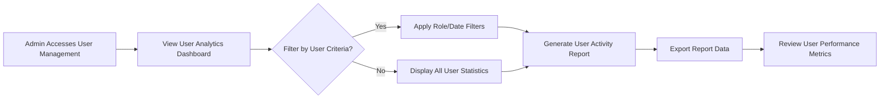
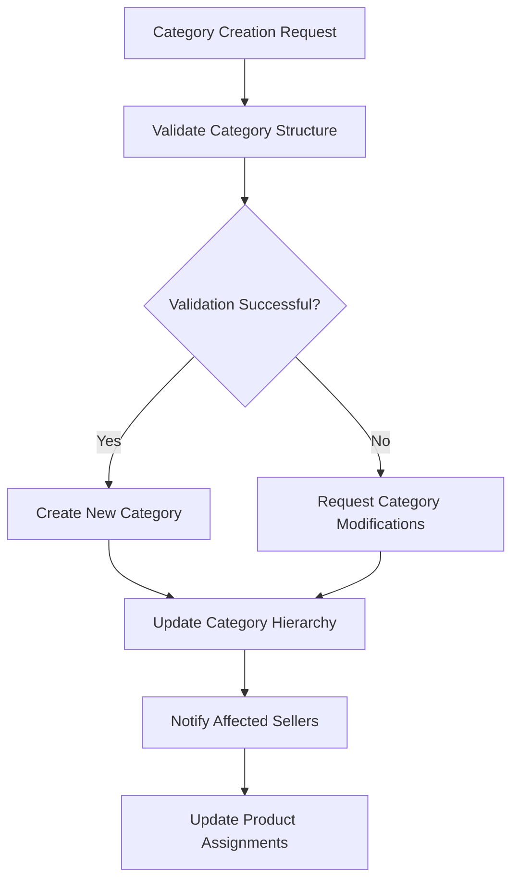

# Admin Dashboard Requirements Specification

## Executive Summary

THE admin dashboard SHALL serve as the central management interface for the shopping mall e-commerce platform, providing comprehensive oversight and control capabilities for system administrators. This document defines the business requirements for administrative functions that enable platform owners to monitor performance, manage users, control products, oversee orders, and maintain system security.

### Business Context
THE admin dashboard SHALL serve as the primary interface for platform administrators to manage all aspects of the e-commerce marketplace. THE system SHALL provide real-time insights and management tools for efficient platform operation while maintaining security and compliance standards.

## 1. Admin User Management System

### 1.1 User Administration Functions

THE admin dashboard SHALL provide comprehensive user management capabilities for all user roles (Guest, Customer, Seller, Admin).

WHEN managing user accounts, THE admin dashboard SHALL allow administrators to:
- View complete user lists with filtering by registration date, activity status, and user role
- Access detailed user profiles including registration date, last login, and activity history
- Suspend or reactivate user accounts based on platform policy violations within 15 minutes of violation detection
- Reset user passwords and enforce password security requirements (minimum 8 characters with complexity)
- Review user authentication logs and login history for security monitoring
- Export user data in CSV format for compliance and reporting purposes within 2 business days

### 1.2 User Role Management

THE admin dashboard SHALL display the complete role hierarchy showing user types and their specific permissions.

WHEN assigning roles, THE system SHALL validate role compatibility and prevent permission conflicts through automated validation checks.
THE admin SHALL be able to escalate user privileges or downgrade permissions as needed based on business requirements.
WHILE managing roles, THE system SHALL maintain comprehensive audit trails of all privilege changes with timestamp and administrator identification.

### 1.3 User Analytics and Reporting

### 1.4 User Communication Tools

THE admin dashboard SHALL provide mass communication tools for user notifications.
WHEN sending notifications, THE system SHALL track delivery status and user responses with 99% accuracy.
THE admin SHALL be able to create and manage communication templates for common scenarios including:
- Platform policy updates
- Security alert notifications
- Maintenance announcements
- Promotional communications

## 2. Product & Category Administration

### 2.1 Product Management Controls

THE admin dashboard SHALL provide complete oversight of the product catalog and inventory management.

WHEN managing products, THE admin dashboard SHALL enable:
- Bulk product approval or rejection for seller submissions within 24 hours of submission
- Product categorization and re-categorization controls with automated validation
- Price monitoring and adjustment capabilities for platform compliance
- Product quality control and content moderation tools with automated flagging
- Inventory level monitoring across all seller products with real-time updates

### 2.2 Product Moderation Workflow

WHEN a seller submits a new product, THE system SHALL notify administrators for review within 5 minutes.
THE admin SHALL be able to approve, reject, or request modifications to product listings with specific feedback.
IF a product violates platform policies, THE admin SHALL have immediate removal capabilities with automated seller notification.
THEN the system SHALL notify the seller with specific violation details and appeal procedures.

### 2.3 Category Management System

THE admin dashboard SHALL provide comprehensive category management tools.

WHEN managing product categories, THE system SHALL allow:
- Creation and modification of category hierarchies with unlimited nesting levels
- Category assignment and reorganization for existing products with bulk operation support
- Category-specific commission rate configuration with validation rules
- Category performance analytics and reporting with trend analysis
- Seasonal category planning and promotion management with automated scheduling

### 2.4 Category Performance Monitoring

| Category | Active Products | Monthly Sales | Conversion Rate | Revenue | Commission Rate |
|----------|-----------------|---------------|------------------|---------|-----------------|
| Electronics | 1,250 | $450,000 | 3.2% | $45,000 | 10% |
| Clothing | 3,400 | $280,000 | 2.1% | $28,000 | 12% |
| Home Goods | 2,100 | $190,000 | 1.8% | $19,000 | 8% |
| Sports | 850 | $120,000 | 2.8% | $12,000 | 9% |

## 3. Order Management & Oversight

### 3.1 Order Monitoring Dashboard

THE admin dashboard SHALL provide real-time order tracking and management capabilities.

WHEN monitoring orders, THE system SHALL display:
- Current order status across all stages (pending, confirmed, shipped, delivered) with color-coded indicators
- Order value analytics and revenue tracking with comparative period analysis
- Shipping carrier performance metrics including delivery times and success rates
- Order fulfillment timeline monitoring with automated exception detection
- Exception handling for delayed or problematic orders with escalation procedures

### 3.2 Order Intervention Capabilities

WHERE order disputes occur, THE admin SHALL have mediation tools with access to complete transaction history.
WHEN customers request cancellations, THE admin SHALL approve or deny based on policy with documented reasoning.
THE system SHALL provide order modification capabilities for administrative corrections with audit trail creation.
WHILE processing refunds, THE admin SHALL track refund status and completion with automated customer notification.

### 3.3 Shipping and Delivery Oversight

THE admin dashboard SHALL monitor shipping carrier performance and delivery efficiency.

WHEN overseeing shipping operations, THE system SHALL provide:
- Carrier performance analytics including delivery times and success rates
- Shipping cost monitoring and optimization recommendations
- Delivery exception tracking and resolution tools
- Regional shipping performance comparisons
- Shipping policy compliance monitoring

## 4. Payment & Financial Controls

### 4.1 Transaction Monitoring System

THE admin dashboard SHALL provide comprehensive financial transaction oversight.

WHEN monitoring payments, THE system SHALL display:
- Real-time transaction dashboard with success/failure rates updated every 5 minutes
- Payment gateway performance metrics with response time analysis
- Fraud detection alerts and suspicious activity monitoring with automated flagging
- Revenue analytics by time period, category, and seller with comparative reporting
- Refund and chargeback management tools with automated workflow processing

### 4.2 Financial Reporting Requirements

THE admin dashboard SHALL generate daily, weekly, and monthly financial reports with automated distribution.
WHEN reviewing financial performance, THE system SHALL provide comparative analytics with year-over-year growth analysis.
THE admin SHALL be able to export financial data for accounting purposes in standard formats (PDF, Excel, CSV).
WHILE monitoring revenue, THE system SHALL highlight anomalies and trends with automated alert generation.

### 4.3 Commission and Fee Management

THE admin dashboard SHALL manage platform commission structures and fee calculations.

WHEN configuring commission rates, THE system SHALL allow:
- Category-specific commission rate configuration with validation rules
- Seller tier-based commission structures with performance-based incentives
- Promotional fee adjustments and special rate approvals with expiration dates
- Commission calculation verification and audit tools with discrepancy detection
- Payout schedule management and payment processing with automated reconciliation

## 5. Seller Management Tools

### 5.1 Seller Performance Monitoring

THE admin dashboard SHALL provide comprehensive seller account management.

WHEN managing sellers, THE system SHALL enable:
- Seller performance score calculation and monitoring based on multiple metrics
- Seller compliance with platform policies and service level agreements with automated tracking
- Sales performance analytics and growth tracking with trend analysis
- Customer feedback and review monitoring for seller quality with sentiment analysis
- Seller communication and support tools with response time tracking

### 5.2 Seller Account Administration

WHEN onboarding new sellers, THE admin SHALL verify business credentials through automated and manual processes.
THE system SHALL provide seller performance dashboard with key metrics updated in real-time.
WHILE monitoring seller activity, THE system SHALL flag suspicious behavior with automated alerts.
THE admin SHALL have tools to suspend seller accounts for policy violations with documented evidence.

### 5.3 Seller Communication and Support

THE admin dashboard SHALL facilitate communication between platform and sellers.

WHEN communicating with sellers, THE system SHALL provide:
- Mass notification tools for platform updates and policy changes with delivery confirmation
- Individual seller messaging for specific issues or opportunities with response tracking
- Seller support ticket management and resolution tracking with SLA monitoring
- Seller education and training material distribution with access analytics
- Performance feedback and improvement recommendations with actionable insights

## 6. Analytics & Reporting Dashboard

### 6.1 Business Intelligence Platform

THE admin dashboard SHALL provide comprehensive analytics and reporting capabilities.

WHEN analyzing platform performance, THE system SHALL include:
- Key Performance Indicators (KPIs) dashboard with real-time metrics updated every 15 minutes
- Customer acquisition and retention analytics with cohort analysis
- Sales performance by category, region, and time period with comparative reporting
- Inventory turnover and product performance metrics with trend identification
- Customer behavior and shopping pattern analysis with predictive modeling

### 6.2 Reporting Tools

THE admin SHALL be able to create custom reports with drag-and-drop interface and save report templates.
WHEN generating reports, THE system SHALL allow data filtering and segmentation with multi-dimensional analysis.
THE dashboard SHALL provide export capabilities in multiple formats (PDF, Excel, CSV) with automated scheduling.
WHILE analyzing data, THE system SHALL offer visualization options (charts, graphs, tables) with interactive features.

### 6.3 Performance Metrics Definition

| Metric Category | Specific Metrics | Target Values | Frequency |
|-----------------|------------------|---------------|-----------|
| Sales Performance | Monthly Gross Merchandise Value (GMV) | $2M+ | Daily/Weekly/Monthly |
| Customer Metrics | Customer Acquisition Cost (CAC) | < $50 | Monthly |
| | Customer Lifetime Value (LTV) | > $500 | Quarterly |
| Platform Health | System Uptime | 99.9% | Real-time |
| | Average Response Time | < 2 seconds | Continuous |
| Seller Performance | Average Seller Rating | 4.0+ stars | Weekly |
| | Order Fulfillment Rate | > 98% | Daily |

## 7. System Configuration Management

### 7.1 Platform Settings Administration

THE admin dashboard SHALL provide comprehensive system configuration controls.

WHEN managing platform settings, THE system SHALL allow:
- Global platform configuration (currency, timezone, language settings) with validation
- Commission rate structures and fee configurations with historical tracking
- Payment gateway integration and configuration with test mode support
- Shipping carrier settings and rate calculations with real-time validation
- Tax calculation rules and jurisdiction configurations with compliance checking

### 7.2 Configuration Change Management

WHEN modifying system settings, THE admin SHALL receive confirmation prompts with impact analysis.
THE system SHALL maintain configuration change history with audit trails and rollback capabilities.
WHILE applying changes, THE system SHALL validate configuration consistency across all affected modules.
THEN the system SHALL notify relevant stakeholders of significant changes through automated alerts.

### 7.3 Integration Management

THE admin dashboard SHALL manage third-party integrations and API configurations.

WHEN managing integrations, THE system SHALL provide:
- Payment gateway status monitoring and configuration with health checks
- Shipping carrier API key management and testing tools with performance metrics
- Email service provider configuration and template management with preview capabilities
- Analytics and tracking tool integration controls with data validation
- Third-party service status monitoring and alerting with escalation procedures

## 8. Security & Compliance Controls

### 8.1 Security Monitoring Dashboard

THE admin dashboard SHALL provide comprehensive security oversight capabilities.

WHEN monitoring security, THE system SHALL include:
- Real-time security event monitoring and alerting with severity classification
- User authentication and access pattern analysis with anomaly detection
- Suspicious activity detection and investigation tools with forensic capabilities
- Data access audit logs and compliance reporting with automated generation
- Security policy configuration and enforcement with automated updates

### 8.2 Security Incident Management

WHEN security incidents occur, THE system SHALL provide incident response tools with automated workflow initiation.
THE admin SHALL be able to lock down specific system functions during emergencies with role-based permissions.
WHILE investigating incidents, THE system SHALL preserve evidence and logs with chain-of-custody tracking.
THEN the admin SHALL have tools to remediate and prevent recurrence with automated patch deployment.

### 8.3 Compliance and Audit Requirements

THE admin dashboard SHALL support regulatory compliance and audit preparation.

WHEN managing compliance, THE system SHALL provide:
- Data retention policy configuration and management with automated enforcement
- Privacy regulation compliance monitoring (GDPR, CCPA, etc.) with automated reporting
- Financial transaction audit trails for accounting compliance with export capabilities
- User data export and deletion tools for privacy requests with automated processing
- Compliance reporting and certification management with renewal tracking

## 9. Performance and Scalability Requirements

### 9.1 System Performance Expectations

THE admin dashboard SHALL meet specific performance requirements for efficient administration.

WHEN accessing administrative functions, THE system SHALL respond within performance thresholds:
- Dashboard loading time: less than 3 seconds for initial view under normal load
- Search and filter operations: less than 2 seconds response time for standard queries
- Report generation: less than 30 seconds for standard reports with up to 10,000 records
- Bulk operations: progress indication with estimated completion time and email notification

### 9.2 Scalability Considerations

WHILE the platform grows, THE admin dashboard SHALL maintain performance levels through:
- Concurrent admin users support for up to 50 simultaneous administrators without degradation
- Large dataset processing for analytics and reporting with pagination and caching
- Real-time data updates across all dashboard components with WebSocket integration
- Flexible scaling to accommodate increased administrative workload with cloud infrastructure

## 10. Error Handling and Recovery

### 10.1 Administrative Error Management

THE admin dashboard SHALL provide comprehensive error handling for administrative actions.

WHEN errors occur during administrative operations, THE system SHALL:
- Provide clear error messages with specific resolution guidance and reference codes
- Maintain operation state to allow recovery or rollback with preservation of work
- Log all error conditions for technical analysis with severity classification
- Offer alternative procedures when primary methods fail with automated suggestions
- Provide contact information for technical support escalation with ticket creation

### 10.2 Data Integrity and Backup

THE admin dashboard SHALL ensure data integrity during all administrative operations.

WHEN performing data modifications, THE system SHALL:
- Validate data consistency before applying changes with cross-reference checking
- Create backup points before significant data modifications with automated snapshots
- Provide undo capabilities for recent administrative actions with 30-day retention
- Maintain transaction consistency across related data elements with atomic operations
- Implement data validation rules to prevent corruption with automated cleanup

> *Developer Note: This document defines **business requirements only**. All technical implementations (architecture, APIs, database design, etc.) are at the discretion of the development team.*