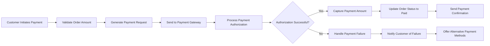
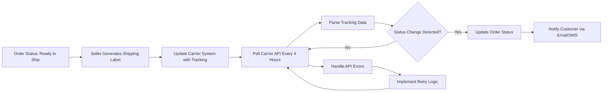
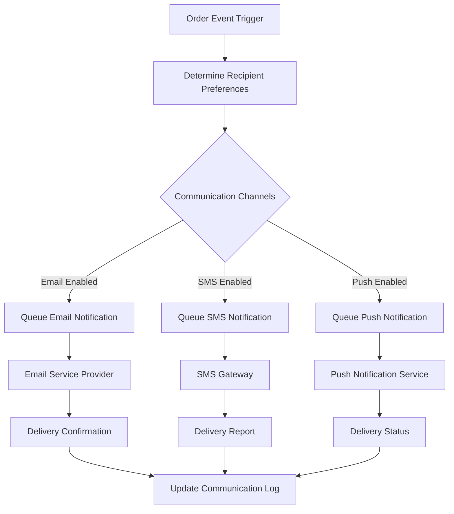
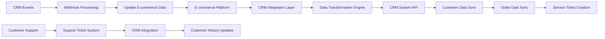
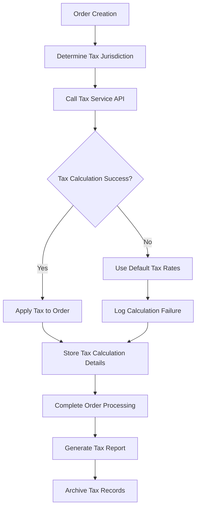
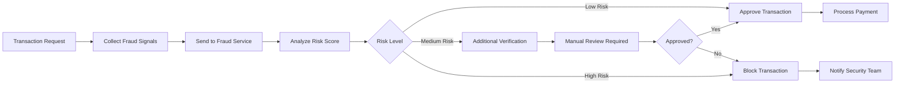
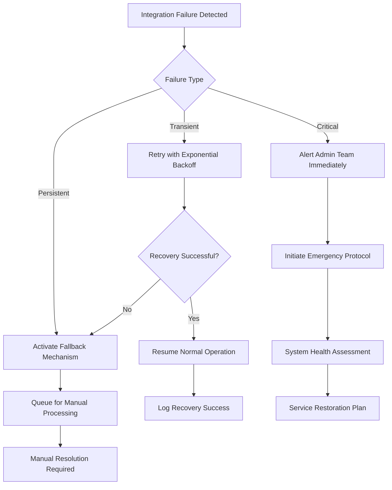

# E-commerce Shopping Mall Platform - Integration Requirements Specification

## Executive Summary

This document defines the comprehensive integration requirements for external systems and third-party services required for the e-commerce shopping mall platform. The platform requires seamless integration with multiple external services to provide a complete end-to-end shopping experience while maintaining security, reliability, and performance standards.

### Integration Strategy Overview
THE e-commerce platform SHALL implement a service-oriented architecture with well-defined integration points for third-party services. Each integration SHALL follow RESTful API patterns with standardized authentication, error handling, and data synchronization protocols.

### Key Integration Points
- **Payment Processing**: Secure transaction handling with multiple payment gateways
- **Shipping Services**: Real-time shipping rates and tracking with major carriers
- **Customer Communication**: Automated email and SMS notifications
- **Business Intelligence**: Analytics and performance tracking
- **Security Services**: Fraud detection and prevention
- **Tax Compliance**: Automated tax calculation and reporting

WHEN designing integration architecture, THE system SHALL prioritize modular design to allow independent service upgrades and replacements.

## Payment Gateway Integration

### Supported Payment Methods
WHEN processing customer payments, THE system SHALL support integration with multiple payment gateways including:
- Credit/Debit card processing (Visa, MasterCard, American Express)
- Digital wallets (PayPal, Apple Pay, Google Pay)
- Bank transfer and direct debit options
- Mobile payment systems
- Cryptocurrency payments (future expansion)

### Payment Gateway Requirements

#### Security Requirements
THE payment gateway integration SHALL implement PCI DSS Level 1 compliance standards.
WHEN transmitting payment data, THE system SHALL use end-to-end encryption with TLS 1.2+ protocols.
THE payment gateway SHALL support tokenization for secure card storage and recurring payments.

#### Transaction Processing Flow

#### API Requirements
WHEN integrating with payment gateways, THE system SHALL support:
- RESTful API endpoints with JSON payloads
- OAuth 2.0 authentication with client credentials flow
- Webhook notifications for real-time transaction status updates
- Idempotent requests to prevent duplicate transactions
- Request timeout configuration with maximum 30 seconds

#### Supported Payment Gateways
| Gateway | Supported Payment Methods | Transaction Fees | Settlement Time | API Rate Limits |
|---------|--------------------------|------------------|-----------------|----------------|
| Stripe | Cards, Digital Wallets | 2.9% + $0.30 | 2 business days | 100 req/sec |
| PayPal | PayPal, Cards | 2.9% + $0.30 | Instant to 1 day | 500 req/min |
| Authorize.Net | Cards, ACH | 2.9% + $0.30 | 1-2 business days | 50 req/sec |

#### Payment Error Handling
WHEN payment processing encounters errors, THE system SHALL:
- Provide clear error messages to customers without revealing sensitive information
- Retry failed transactions with exponential backoff strategy
- Log all payment attempts for auditing and analysis
- Escalate persistent payment failures to customer support

## Shipping Carrier Integration

### Supported Carriers
THE shipping integration SHALL support real-time integration with major shipping carriers:
- UPS (United Parcel Service)
- FedEx (Federal Express)
- DHL Express
- USPS (United States Postal Service)
- Regional and local carriers

### Shipping Rate Calculation
WHEN calculating shipping costs, THE system SHALL:
- Fetch real-time shipping rates based on package dimensions and weight
- Consider delivery speed options (Standard, Express, Overnight)
- Account for shipping origin and destination addresses
- Apply carrier-specific surcharges and fees
- Cache shipping rates for 5 minutes to improve performance

### Tracking Integration

### Shipping API Requirements
WHEN integrating with shipping carriers, THE system SHALL:
- Support SOAP and REST API protocols with proper authentication
- Handle carrier authentication with API keys and certificates
- Manage rate limit constraints (typically 10-100 requests per minute)
- Cache shipping rates for 5 minutes to reduce API calls
- Implement fallback carriers when primary carrier APIs are unavailable

#### Carrier-Specific Requirements
**UPS Integration**
WHEN integrating with UPS, THE system SHALL:
- Use UPS Developer Kit for API integration
- Support both domestic and international shipping
- Handle address validation through UPS address verification service
- Track packages using UPS Tracking API

**FedEx Integration**
WHEN integrating with FedEx, THE system SHALL:
- Implement FedEx Web Services for rate calculations
- Support package tracking through FedEx Track Service
- Handle shipping label generation via FedEx Ship Service
- Manage address validation using FedEx Address Validation

## Communication Service Integration

### Email Service Integration
THE email service integration SHALL support automated email notifications for:
- Order confirmation and receipts
- Shipping updates and tracking information
- Account verification and password reset
- Marketing communications (opt-in required)
- Customer service responses

#### Email Service Providers
THE system SHALL support integration with major email service providers:
- SendGrid for transactional emails with template support
- Mailchimp for marketing communications and campaign management
- AWS SES for cost-effective bulk email delivery
- SMTP servers for custom email delivery configurations

#### Email Delivery Requirements
WHEN sending transactional emails, THE system SHALL:
- Achieve 99.9% email delivery rate for critical notifications
- Process email sends within 5 seconds of trigger events
- Support email template customization with dynamic content
- Track email open rates and click-through rates
- Handle email bouncebacks and unsubscribes

### SMS Service Integration
WHEN sending SMS notifications, THE system SHALL support:
- Order status updates via SMS
- Shipping delivery notifications
- Two-factor authentication codes
- Promotional messages (opt-in required)
- Customer service alerting

#### SMS Service Requirements
THE SMS integration SHALL:
- Support Twilio, MessageBird, or similar SMS gateways
- Handle international phone number formatting
- Comply with TCPA regulations for commercial messaging
- Support message templates for consistent branding
- Achieve 99.5% SMS delivery success rate

### Communication Flow

## Analytics & Tracking Integration

### Web Analytics Integration
THE platform SHALL integrate with web analytics services to track:
- User behavior and navigation patterns
- Conversion funnel analysis
- Product performance metrics
- Customer acquisition sources
- Shopping cart abandonment rates

#### Supported Analytics Platforms
- Google Analytics 4 for web traffic analysis and event tracking
- Mixpanel for user behavior tracking and segmentation
- Hotjar for heatmaps and session recordings
- Custom analytics database for business intelligence
- A/B testing platforms for conversion optimization

### E-commerce Tracking Requirements
WHEN tracking e-commerce events, THE system SHALL implement:
- Enhanced E-commerce tracking for Google Analytics
- Product impression and click tracking
- Shopping cart abandonment analysis
- Purchase conversion tracking
- Customer lifetime value calculation

#### Event Tracking Specifications
THE system SHALL track the following events with detailed parameters:
- Product views with product ID, category, and price
- Add to cart actions with quantity and variant information
- Remove from cart events with removal reasons
- Checkout process steps with completion rates
- Purchase completions with transaction details

### Performance Monitoring
THE platform SHALL integrate with performance monitoring tools:
- New Relic or DataDog for application performance monitoring
- Google PageSpeed Insights for web performance optimization
- Uptime monitoring for service availability tracking
- Error tracking with Sentry or similar service
- Database performance monitoring tools

## CRM System Integration

### Customer Data Synchronization
THE CRM integration SHALL enable bidirectional data synchronization between:
- Customer profiles and order history
- Customer service interactions
- Marketing campaign participation
- Customer feedback and reviews
- Support ticket management

#### CRM System Requirements
THE platform SHALL support integration with:
- Salesforce for enterprise CRM with custom object mapping
- HubSpot for marketing automation and lead management
- Zendesk for customer service management and ticketing
- Custom CRM systems via REST API with webhook support

### Integration Architecture

#### Data Synchronization Rules
WHEN synchronizing data with CRM systems, THE system SHALL:
- Update customer profiles within 5 minutes of changes
- Sync order information in real-time for new purchases
- Maintain data consistency across all integrated systems
- Handle synchronization conflicts with predefined resolution rules
- Log all synchronization activities for audit purposes

## Tax Calculation Services

### Tax Compliance Requirements
THE tax calculation integration SHALL ensure compliance with:
- Sales tax regulations by jurisdiction (state, county, city)
- VAT/GST requirements for international sales
- Digital product taxation rules
- Tax exemption handling for business customers
- Tax reporting and filing requirements

### Supported Tax Services
THE platform SHALL integrate with tax calculation services:
- Avalara for automated tax compliance with real-time calculations
- TaxJar for sales tax calculation and reporting
- Vertex for enterprise tax solutions with global coverage
- Custom tax calculation for specific regions and business rules

### Tax Calculation Process
WHEN calculating taxes for an order, THE system SHALL:
- Determine applicable tax jurisdictions based on shipping address
- Calculate tax rates for each taxable product category
- Apply tax exemptions for valid tax-exempt customers
- Generate tax invoices and compliance reports
- Maintain tax calculation audit trails for 7 years

#### Tax Integration Flow

#### Tax Service API Requirements
WHEN integrating with tax calculation services, THE system SHALL:
- Support real-time tax calculation APIs with address validation
- Handle tax exemption certificates and validation
- Manage tax rate changes and updates automatically
- Support multiple tax calculation scenarios (origin-based, destination-based)
- Provide tax calculation accuracy of 99.9% for compliance

## Fraud Detection Services

### Fraud Detection Requirements
THE fraud detection integration SHALL protect against:
- Payment fraud and stolen credit card usage
- Account takeover attempts and identity theft
- Fake product reviews and ratings manipulation
- Seller fraud and marketplace abuse
- Promotional abuse and coupon fraud

### Supported Fraud Detection Services
THE platform SHALL integrate with:
- Sift for real-time fraud detection with machine learning
- Signifyd for chargeback protection and guarantee
- Custom machine learning models for fraud pattern recognition
- Manual review workflows for suspicious activities
- Third-party identity verification services

### Fraud Detection Workflow

### Fraud Prevention Measures
WHEN detecting potential fraud, THE system SHALL implement:
- IP address analysis and geolocation verification
- Device fingerprinting and behavioral analysis
- Velocity checks for rapid transaction attempts
- Address verification service (AVS) for card payments
- 3D Secure authentication for high-risk transactions
- Machine learning pattern recognition for fraud detection

#### Fraud Detection API Integration
WHEN integrating with fraud detection services, THE system SHALL:
- Send comprehensive transaction data for risk assessment
- Receive risk scores with confidence levels
- Implement automated decision rules based on risk thresholds
- Support manual review workflows for borderline cases
- Maintain fraud pattern databases for continuous learning

## API Security Framework

### Authentication Requirements
ALL external API integrations SHALL implement secure authentication:
- API key authentication with rotating keys every 90 days
- OAuth 2.0 for user-based API access with scope restrictions
- JWT tokens for stateless authentication with 15-minute expiration
- Two-factor authentication for admin API access
- Certificate-based authentication for high-security integrations

### Authorization Requirements
WHEN accessing integrated services, THE system SHALL enforce:
- Role-based access control (RBAC) with principle of least privilege
- API scope restrictions for different integration types
- Time-limited access tokens with refresh capabilities
- IP address whitelisting for sensitive API endpoints
- Rate limiting based on user roles and API criticality

### Rate Limiting and Throttling
THE API integration framework SHALL implement:
- Rate limiting per API key (1000 requests per hour standard)
- Burst allowance for sudden traffic spikes (up to 200 requests)
- Throttling mechanisms to prevent service abuse
- Graceful degradation during high-load periods
- API usage analytics for capacity planning

### Security Monitoring
THE platform SHALL monitor integration security through:
- API usage analytics and anomaly detection
- Security event logging and alerting
- Regular security audits of integration points
- Penetration testing of external API endpoints
- Compliance monitoring for regulatory requirements

#### Security Incident Response
WHEN security incidents occur, THE system SHALL:
- Automatically revoke compromised API keys
- Notify security team within 5 minutes of detection
- Implement emergency shutdown procedures for affected services
- Conduct post-incident analysis and remediation
- Update security policies based on incident lessons

## Error Handling & Recovery

### Integration Failure Scenarios
THE system SHALL handle common integration failures:
- Third-party service unavailability with circuit breaker patterns
- API rate limit exceeded with exponential backoff retry logic
- Authentication failures with automatic token refresh
- Network connectivity issues with retry mechanisms
- Data format mismatches with validation and transformation

### Error Recovery Strategies
WHEN integration failures occur, THE system SHALL implement:
- Exponential backoff retry logic for transient failures
- Circuit breaker patterns to prevent cascading failures
- Fallback mechanisms for critical functionality
- Manual intervention workflows for persistent failures
- Graceful degradation to maintain core functionality

### Error Notification System
THE platform SHALL notify relevant stakeholders about:
- Critical integration failures requiring immediate attention
- Performance degradation in external services
- Security incidents affecting integration points
- Compliance violations in data processing
- Service level agreement (SLA) breaches

### Recovery Procedures

#### Error Handling Specifications
WHEN handling integration errors, THE system SHALL:
- Provide clear error messages to users without technical details
- Maintain transaction consistency across all integrated systems
- Preserve data integrity during recovery operations
- Support manual override for emergency situations
- Document all error scenarios and resolution procedures

## Performance Requirements

### Response Time Standards
ALL external API integrations SHALL meet performance benchmarks:
- Payment gateway responses: < 3 seconds for 95% of transactions
- Shipping rate calculations: < 2 seconds for rate queries
- Tax calculation services: < 1 second for tax determinations
- Email/SMS delivery: < 5 seconds for notification processing
- Analytics event tracking: < 500 milliseconds for data collection

### Scalability Considerations
THE integration architecture SHALL support:
- Horizontal scaling for increased API traffic up to 10,000 requests/minute
- Caching strategies to reduce external API calls by 60%
- Asynchronous processing for non-critical integrations
- Load balancing across multiple service instances
- Auto-scaling based on real-time traffic patterns

### Availability Requirements
WHEN designing integration points, THE system SHALL ensure:
- 99.9% availability for critical payment and order processing
- 99.5% availability for shipping and tax calculations
- 99% availability for communication and analytics services
- Graceful degradation during partial service outages
- Disaster recovery capabilities for critical integrations

#### Performance Monitoring
THE platform SHALL implement comprehensive performance monitoring:
- Real-time API performance dashboards
- Automated alerting for performance degradation
- Capacity planning based on usage trends
- Performance benchmarking against industry standards
- Continuous optimization of integration performance

## Compliance and Regulatory Requirements

### Data Privacy Compliance
ALL external integrations SHALL comply with:
- GDPR for European customer data protection and privacy rights
- CCPA for California consumer privacy and data access rights
- PCI DSS for payment card data security and handling
- Local data protection regulations in all operating regions
- Industry-specific compliance requirements

### Industry Standards
THE integration framework SHALL adhere to:
- RESTful API design best practices and conventions
- OWASP security guidelines for web applications
- ISO 27001 for information security management
- Industry-specific compliance standards
- International data transfer regulations

### Audit and Reporting
THE platform SHALL maintain comprehensive audit trails for:
- API request and response logging with timestamps
- Data synchronization activities and outcomes
- Security events and access attempts
- Compliance verification reports
- Regulatory filing and documentation

#### Compliance Monitoring
WHEN monitoring compliance, THE system SHALL:
- Automatically detect compliance violations
- Generate compliance reports for regulatory authorities
- Maintain audit trails for 7 years as required by law
- Support compliance certification processes
- Provide transparency for data processing activities

## Integration Testing Requirements

### Test Environment Setup
THE integration testing framework SHALL include:
- Sandbox environments for all third-party services
- Mock APIs for testing integration logic without live dependencies
- Automated testing suites for regression testing
- Load testing for performance validation under stress
- Security testing for vulnerability assessment

### Test Coverage Requirements
WHEN testing integrations, THE system SHALL verify:
- Successful API authentication and authorization mechanisms
- Correct data transformation and mapping between systems
- Proper error handling and recovery mechanisms
- Performance under expected load conditions
- Security vulnerability testing and penetration resistance

#### Testing Automation
THE platform SHALL implement automated testing for:
- API endpoint functionality and response validation
- Data synchronization accuracy and consistency
- Error scenario simulation and recovery testing
- Performance benchmarking and load testing
- Security vulnerability scanning and penetration testing

### Testing Documentation
THE integration testing process SHALL include:
- Comprehensive test plans for each integration point
- Test case documentation with expected outcomes
- Performance testing reports with benchmarks
- Security testing results and remediation tracking
- User acceptance testing procedures and criteria

## Success Metrics and KPIs

### Integration Performance Metrics
THE system SHALL track the following key performance indicators:
- API response time averages and percentiles
- Integration success rates by service type
- Error rates and failure frequency analysis
- System availability and uptime percentages
- Customer satisfaction with integrated services

### Business Impact Metrics
WHEN measuring integration success, THE platform SHALL monitor:
- Conversion rates improvement through seamless integrations
- Customer retention rates affected by integration quality
- Operational efficiency gains from automation
- Cost savings from optimized integration performance
- Revenue impact of integrated service capabilities

### Continuous Improvement
THE integration framework SHALL support continuous improvement through:
- Regular performance reviews and optimization
- Customer feedback collection and implementation
- Technology updates and service enhancements
- Security vulnerability remediation
- Compliance requirement updates

> *Developer Note: This document defines **business requirements only**. All technical implementations (architecture, APIs, database design, etc.) are at the discretion of the development team.*