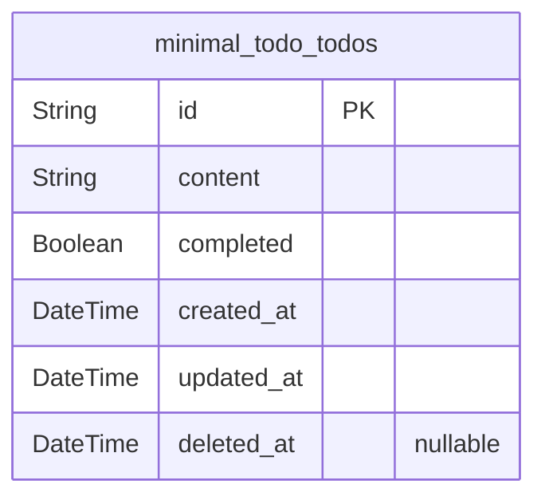

# Prisma Markdown

> Generated by [`prisma-markdown`](https://github.com/samchon/prisma-markdown)

- [Todo](#todo)

## Todo

### `minimal_todo_todos`

Core Todo entity representing individual todo items in the minimal todo
application. Stores basic todo information including text content,
completion status, and timestamps for tracking creation and updates. As
the primary business entity, this table supports all basic CRUD
operations for todo management. Enhanced with soft delete support and
improved indexing for better performance.

Properties as follows:

- `id`: Primary Key.
- `content`
  > Text content of the todo item. Contains the actual task description that
  > users manage. Should be validated for length (1-500 characters) at the
  > application level.
- `completed`
  > Completion status indicating whether the todo item has been marked as
  > done. False means incomplete/pending, true means completed.
- `created_at`
  > Timestamp when the todo item was originally created. Automatically set
  > when the todo is first saved. Used for chronological ordering of todos.
- `updated_at`
  > Timestamp when the todo item was last modified. Updated automatically
  > whenever any field changes. Used for tracking recent activity.
- `deleted_at`
  > Timestamp when the todo item was soft deleted. Null indicates the todo is
  > active, non-null indicates deletion. Supports the confirmation-based
  > deletion workflow required by business rules.
