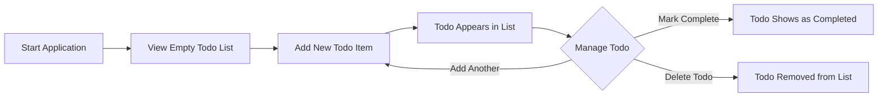

# Minimal Todo Application - Requirements Analysis Report

## Project Overview

### Business Purpose
The Minimal Todo Application is designed to provide users with a straightforward, no-frills task management solution. The primary business goal is to offer a clean, simple interface for personal task tracking without the complexity of advanced features found in many modern productivity applications.

### Target Audience
This application specifically targets:
- **First-time programmers** learning basic application development
- **Users seeking simplicity** who are overwhelmed by feature-rich todo applications
- **Personal task management** where only basic functionality is required

### Success Criteria
The application will be considered successful when:
- Users can easily create and manage todos without confusion
- Implementation requires minimal technical complexity
- All core todo functionality works reliably
- The application serves as a learning tool for beginners

## Documentation Structure

### Complete Project Documentation
The following documents comprise the full requirements specification for the Minimal Todo Application:

1. **[Service Overview](./01-service-overview.md)** - Business model and value proposition
2. **[User Roles and Authentication](./02-user-roles.md)** - User permissions and access control
3. **[Functional Requirements](./03-functional-requirements.md)** - Detailed feature specifications
4. **[User Scenarios](./04-user-scenarios.md)** - Step-by-step user interactions
5. **[Business Rules](./05-business-rules.md)** - Data validation and logic constraints
6. **[System Context](./06-system-context.md)** - Technical environment and performance requirements

### Document Navigation
For developers new to the project, it's recommended to read the documents in the order listed above. Each document builds upon the previous one, providing a comprehensive understanding of the application requirements from business concept through technical implementation.

## System Requirements

### Core Functionality Scope
**INCLUDED Features (Absolute Minimum):**
- Create new todo items with text descriptions
- Mark todo items as complete/incomplete
- Delete todo items from the list
- View all todo items in a single list

**EXCLUDED Features (Advanced/Complex):**
- ❌ Categories, tags, or labels for todos
- ❌ Due dates, deadlines, or reminders
- ❌ Priority levels or importance ranking
- ❌ User accounts or multiple todo lists
- ❌ Search, filter, or sorting functionality
- ❌ Collaboration or sharing features
- ❌ Data import/export capabilities
- ❌ Archive or history functionality
- ❌ Drag-and-drop reordering
- ❌ Sub-tasks or nested todos

### Technical Specifications
- **Single-user application** - No authentication required
- **Local data storage** - Todos persist within the browser session
- **Responsive web interface** - Works on desktop and mobile browsers
- **No backend server** - Pure client-side application

### Performance Expectations
WHEN a user performs any todo operation, THE system SHALL respond within 100 milliseconds.
WHEN the application loads, THE system SHALL display existing todos within 2 seconds.
WHILE managing large numbers of todos (1000+), THE system SHALL maintain responsive performance.

## Quick Start Guide

### Basic Application Flow

### Getting Started Steps
1. **Launch the application** - Open the web page in any modern browser
2. **Create your first todo** - Enter text in the input field and press Enter/click Add
3. **Manage your todos** - Use checkboxes to mark complete, use delete buttons to remove
4. **That's it!** - No additional setup or configuration required

### User Interaction Pattern
The application follows a simple create-read-update-delete (CRUD) pattern:
1. **Create** - Add new todo items
2. **Read** - View all todos in a list
3. **Update** - Toggle completion status
4. **Delete** - Remove todos when done

## Development Philosophy

### Minimalism First
Every feature and implementation decision should prioritize simplicity. When considering any addition, ask:
- Is this absolutely necessary for basic todo functionality?
- Can the user accomplish their goal without this feature?
- Does this add complexity that might confuse beginners?

### Beginner-Friendly Implementation
The application should serve as an excellent learning tool for new developers:
- Clear, well-documented code structure
- Minimal dependencies and external libraries
- Straightforward data flow and state management
- Easy-to-understand user interface patterns

### Technical Constraints
- **No framework requirements** - Should work with vanilla JavaScript
- **Progressive enhancement** - Basic functionality must work without JavaScript
- **Accessibility** - Should support keyboard navigation and screen readers

## Business Requirements Justification

### Why Minimal Todo?
The market contains numerous complex todo applications that overwhelm users with features they don't need. This application fills the gap by providing:

1. **Simplicity** - No learning curve or feature discovery needed
2. **Focus** - Eliminates distractions from advanced functionality
3. **Beginner-Friendly** - Accessible to users unfamiliar with productivity software
4. **Learning Tool** - Demonstrates clean, straightforward application design

### Value Proposition
"The simplest possible todo application that does exactly what you need - nothing more, nothing less."

### Success Metrics
- **User Satisfaction**: 90%+ satisfaction rate with simplicity and ease of use
- **Learning Effectiveness**: Beginners can understand the codebase within 1 hour
- **Feature Adequacy**: Users report having "just enough" functionality
- **Retention Rate**: 80%+ of users continue using the application after initial try

## Future Considerations

### Potential Enhancement Paths
While the current scope is deliberately minimal, potential future enhancements (if absolutely necessary) might include:
- Basic data persistence across browser sessions
- Simple text-based export of todo list
- Dark/light theme toggle

### Enhancement Boundaries
Any future additions MUST maintain the core principles:
- Never compromise the simplicity of the basic experience
- Ensure new features are optional and don't complicate the core interface
- Maintain backward compatibility for existing users

### Technical Evolution
The application architecture should be structured to allow:
- Easy extension through modular design
- Community contributions without breaking core functionality
- Simple integration with educational platforms

## Implementation Requirements

### Ubiquitous Requirements
- THE system SHALL provide a clean, distraction-free interface
- THE system SHALL maintain todo items persistently between sessions
- THE system SHALL require zero configuration for basic usage

### Event-driven Requirements
- WHEN a user creates a new todo item, THE system SHALL save it immediately
- WHEN a user marks a todo as complete, THE system SHALL update its status
- WHEN a user deletes a todo item, THE system SHALL remove it permanently
- WHEN a user views the application, THE system SHALL display all todo items

### State-driven Requirements
- WHILE a todo item is marked as incomplete, THE system SHALL display it in the active list
- WHILE a todo item is marked as complete, THE system SHALL display it with visual distinction

### Error Handling Requirements
- IF a user attempts to create an empty todo, THEN THE system SHALL display an appropriate error message
- IF the system cannot save data, THEN THE system SHALL notify the user and preserve current session data

> *Developer Note: This document defines **business requirements only**. All technical implementations (architecture, APIs, database design, etc.) are at the discretion of the development team.*