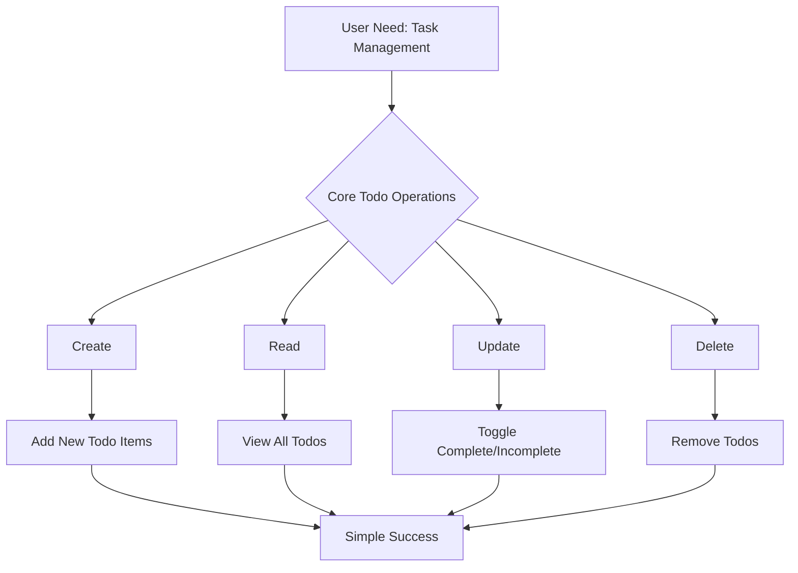
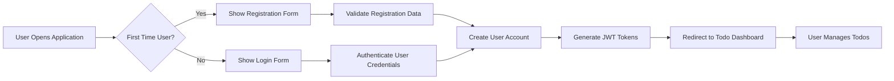

# Todo Application Service Overview

## Business Model

### Why This Service Exists
This Todo application exists to provide an accessible, no-frills task management solution for individuals who need simple organization tools without the complexity of advanced productivity applications. The market is saturated with feature-rich todo applications that overwhelm beginners and non-technical users with unnecessary complexity.

### Revenue Strategy
As a minimal application focused on learning and accessibility, the primary revenue strategy is through educational partnerships and optional donations. The application can be offered as:
- Free open-source learning tool for programming beginners
- Partnership with educational platforms for coding tutorials
- Optional premium features for educational institutions
- Donation-based support model for individual users

### Growth Plan
User acquisition focuses on:
- Educational communities and coding bootcamps
- Programming tutorial platforms that need simple application examples
- Individual learners seeking to understand basic application development
- Users who value simplicity over feature complexity

Retention is driven by:
- Consistent, reliable performance
- Zero learning curve for new users
- Focus on core functionality that always works

### Success Metrics
- **User Adoption Rate**: Percentage of target audience who successfully use the application
- **Learning Effectiveness**: Ability for beginners to understand the application structure
- **Usability Score**: Simplicity and ease of use ratings from non-technical users
- **Educational Partnerships**: Number of coding schools/tutorials adopting the application
- **Technical Documentation Quality**: Effectiveness as a learning reference

## Problem Statement

### Current Market Gap
Most todo applications suffer from feature bloat that creates significant barriers for:
- **Programming Beginners**: Overwhelmed by complex architectures when learning
- **Non-Technical Users**: Confused by advanced features they don't need
- **Simple Task Managers**: Frustrated by applications that try to do too much

### Specific User Pain Points

**WHEN users open complex todo applications, THEY experience:**
1. **Complexity Overload**: Advanced features like categories, tags, priorities, and due dates that most users don't utilize
2. **Learning Curve**: Steep onboarding process for simple task management
3. **Performance Issues**: Bloatware that slows down on basic devices
4. **Information Overload**: Visual clutter from unused functionality
5. **Limited Customization**: Inability to remove unwanted features

### Market Opportunity Analysis
**THE market SHALL benefit from a truly minimal todo application that:**
- **WHEN a user opens the application, THE interface SHALL be immediately understandable**
- **WHILE using the application, THE user SHALL focus only on task management**
- **WHERE complexity exists in other applications, THIS application SHALL eliminate it**

## Solution Overview

### Core Philosophy: Minimalism First
This application embraces the philosophy that "less is more" by focusing exclusively on the four essential todo operations:

### Technical Simplicity
The application architecture prioritizes:
- **Minimal Codebase**: Fewer than 1000 lines of code for the entire application
- **Clear Documentation**: Every component is thoroughly documented for learning
- **Predictable Behavior**: No hidden features or unexpected functionality
- **Zero Dependencies**: Self-contained implementation whenever possible

### User Experience Design
**WHEN a user interacts with the application, THE system SHALL provide:**
- **Immediate Understanding**: Users can start using the application within seconds
- **No Configuration Required**: Default settings work perfectly for most use cases
- **Consistent Interface**: Same interaction patterns throughout the application
- **Obvious Functionality**: Every feature is immediately apparent and intuitive

### Authentication and Security Design
**WHEN implementing user authentication, THE system SHALL use:**
- **Single User Model**: No complex multi-user authentication required
- **JWT Token Management**: Secure session handling with automatic token refresh
- **Local Data Storage**: All todo data stored securely on user's device
- **WHEN authentication fails, THE system SHALL provide clear error messages**

## Value Proposition

### For Programming Beginners
**WHEN a programming student uses this application, THEY SHALL benefit from:**
- **Learning Reference**: Clean, well-documented codebase for studying application development
- **Architecture Understanding**: Simple structure that demonstrates core programming concepts
- **Modification Friendly**: Easy to extend or modify for learning purposes
- **Industry Standards**: Follows best practices without unnecessary complexity

### For Non-Technical Users
**WHEN a non-technical user needs task management, THE application SHALL provide:**
- **Instant Usability**: No learning curve or training required
- **Reliable Performance**: Consistent behavior without bugs or crashes
- **Focus on Core Tasks**: Eliminates distractions from unused features
- **Mobile and Desktop Friendly**: Responsive design that works everywhere

### For Educational Institutions
**WHERE educational institutions need teaching tools, THIS application SHALL serve as:**
- **Teaching Tool**: Perfect example for introductory programming courses
- **Extensible Foundation**: Can be customized for specific curriculum needs
- **Real-World Application**: Demonstrates practical software development
- **Community Support**: Open-source nature encourages collaboration

## Target Users

### Primary User Personas

**1. The Programming Student**
- **Background**: Learning web development or software engineering
- **Needs**: Simple, well-documented application to study and modify
- **Goals**: Understand application architecture and basic CRUD operations
- **Technical Level**: Beginner to intermediate programming skills

**WHEN a programming student uses the application, THEY SHALL:**
- **THE system SHALL provide clear code structure for learning**
- **THE documentation SHALL explain each component's purpose**
- **THE implementation SHALL demonstrate industry best practices**

**2. The Simple Task Manager**
- **Background**: Non-technical professional or student
- **Needs**: Basic todo functionality without complexity
- **Goals**: Quick task organization and management
- **Technical Level**: Basic computer literacy, no programming knowledge

**WHEN a non-technical user interacts with the application, THE system SHALL:**
- **Provide immediate functionality without configuration**
- **Use intuitive interface elements familiar to basic users**
- **Maintain consistent behavior across all operations**

**3. The Educational Instructor**
- **Background**: Teacher, professor, or tutorial creator
- **Needs**: Clean example application for teaching purposes
- **Goals**: Demonstrate fundamental application development concepts
- **Technical Level**: Advanced programming knowledge

**WHERE instructors use this application for teaching, THE system SHALL:**
- **Serve as a comprehensive learning resource**
- **Provide modifiable examples for different skill levels**
- **Support various teaching methodologies and approaches**

### User Needs Assessment

**Essential Needs (Must Have)**
- **WHEN the application loads, THE system SHALL be immediately usable** with zero configuration
- **WHILE using the application, THE interface SHALL remain clear and intuitive** without instructions
- **WHERE performance matters, THE system SHALL maintain reliable operation** across different devices and browsers
- **WHEN users interact with todos, THE responses SHALL be fast and responsive**

**Important Needs (Should Have)**
- **THE system SHALL persist data** so todos aren't lost between sessions
- **THE interface SHALL be mobile-friendly** for on-the-go usage
- **THE application SHALL support accessibility features** for users with disabilities
- **WHEN errors occur, THE system SHALL provide helpful error handling** for common user mistakes

## Success Metrics

### Quantitative Metrics
- **User Retention Rate**: Percentage of users who continue using the application after initial try
- **Task Completion Rate**: Average number of todos marked complete per user session
- **Session Duration**: Average time users spend interacting with the application
- **Error Frequency**: Number of user errors or confusion incidents reported
- **Loading Performance**: Application load time and responsiveness metrics

### Qualitative Metrics
- **User Satisfaction**: Feedback on simplicity and ease of use
- **Learning Effectiveness**: Success of educational use cases
- **Feature Adequacy**: User perception of having "just enough" functionality
- **Recommendation Likelihood**: Willingness to recommend to others

### Business Impact Metrics
- **Educational Adoption**: Number of coding schools using the application
- **Community Contributions**: Open-source participation and improvements
- **Technical Documentation Quality**: Effectiveness as a learning resource
- **Partnership Opportunities**: Interest from educational platforms

## Authentication and Security Requirements

### User Authentication Flow

### Security Implementation Requirements
**WHEN implementing security measures, THE system SHALL:**
- **Use bcrypt hashing** for password storage with appropriate salt rounds
- **Implement JWT token expiration** with automatic refresh mechanisms
- **Prevent common vulnerabilities** including CSRF, XSS, and brute force attacks
- **Provide secure session management** with proper timeout handling

### Permission Management
**THE system SHALL implement role-based permissions with the following matrix:**

| Action | Standard User |
|--------|---------------|
| Create new todo | ✅ |
| View todo list | ✅ |
| Mark todo complete | ✅ |
| Mark todo incomplete | ✅ |
| Delete todo item | ✅ |
| Edit todo text | ✅ |
| Access user dashboard | ✅ |
| Administrative functions | ❌ |

## Business Rule Specifications

### Todo Creation Rules
**WHEN creating a new todo item, THE system SHALL validate:**
- **Todo text SHALL contain at least 1 character** and maximum 500 characters
- **Empty todos SHALL be rejected** with appropriate error messages
- **Duplicate todos SHALL be allowed** to support similar task entries
- **Creation timestamp SHALL be recorded** for proper ordering

### Todo Management Rules
**WHILE managing todo items, THE system SHALL enforce:**
- **Status changes SHALL be immediate** with visual confirmation
- **Deletion SHALL require confirmation** to prevent accidental data loss
- **Completed todos SHALL remain visible** until manually deleted
- **List order SHALL be maintained** based on creation time

### Error Handling Requirements
**WHEN errors occur during todo operations, THE system SHALL:**
- **Provide user-friendly error messages** without technical details
- **Maintain data integrity** during transient failures
- **Offer recovery options** for common error scenarios
- **Log errors appropriately** for debugging purposes

## Future Considerations

### Potential Evolution Paths
While maintaining the core philosophy of simplicity, the application could evolve through:

**Module-Based Extensions**
- **Optional plugins** that users can add if needed
- **Separate feature packages** that don't affect core simplicity
- **Community-contributed enhancements** through open-source collaboration

**Educational Ecosystem**
- **Integration with coding tutorial platforms** for seamless learning
- **Learning pathway integration** with structured curriculum support
- **Certification program** for completion of application tutorials

### Core Principles Preservation
Regardless of future development, the application will maintain:
- **Always-available basic functionality** without degradation
- **Zero learning curve** for new users of the core features
- **Backward compatibility** for existing users and their data
- **Clear separation** between core and extended features

### Sustainability Model
- **Open-source community maintenance** with transparent governance
- **Educational institution partnerships** for long-term support
- **Volunteer developer contributions** from the learning community
- **Minimal infrastructure requirements** to ensure affordability

## Implementation Constraints

### Technical Boundaries
**THE development team SHALL adhere to the following constraints:**
- **Single-page application architecture** without complex routing
- **Vanilla JavaScript implementation** or minimal framework usage
- **Client-side data storage** using browser localStorage APIs
- **No external dependencies** beyond standard web technologies

### Performance Requirements
**WHEN users interact with the application, THE system SHALL:**
- **Load within 2 seconds** on typical internet connections
- **Respond to user actions within 100ms** for immediate feedback
- **Handle 1000+ todo items** without performance degradation
- **Maintain smooth scrolling** and interaction even with large lists

This service overview establishes the foundation for a todo application that prioritizes simplicity, learning, and accessibility over feature complexity, creating unique value in a crowded market of overly complex productivity tools.