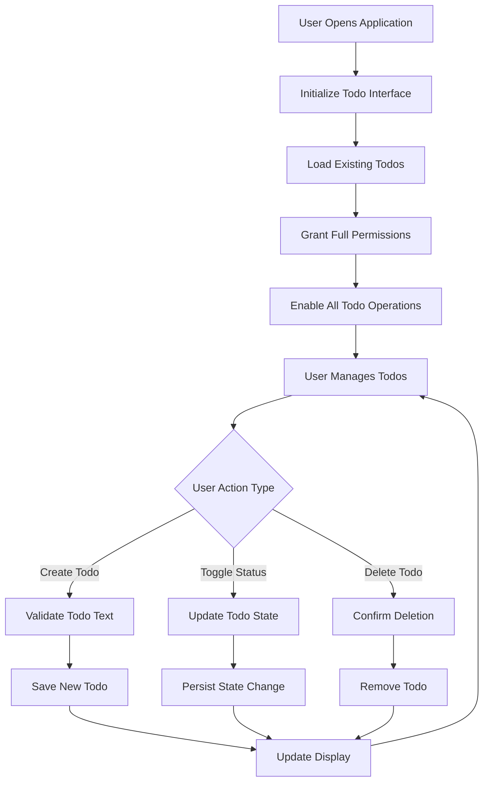

# Todo Application - Simplified Access Control and Permissions

## Introduction

This document defines the access control and permission requirements for a minimal Todo list application that operates without user authentication or complex security systems. The application follows a single-user model where all operations are permitted to the current browser user.

### System Design Philosophy
- **Simplicity First**: No authentication required for personal todo management
- **Local Operations Only**: All todo operations occur within the current browser session
- **Minimal Security**: Basic data protection through browser security features
- **Beginner-Friendly**: Implementation suitable for developers new to application development

## User Role Definitions

### Anonymous User Role

**Role Name**: anonymous_user
**Description**: The current user of the browser application with full access to personal todo management operations. This role represents the single-user model where no authentication or user identification is required.

**Core Responsibilities**:
- Create new todo items with text descriptions
- View all existing todo items in the current session
- Mark todo items as complete or incomplete
- Delete todo items from the personal list
- Access todo management interface
- Manage local data storage for todo persistence

**Role Characteristics**:
- Single-user focus (no multi-user support required)
- Self-contained todo management without authentication
- Full permissions for all todo operations
- No administrative privileges needed
- Limited to current browser session scope

## Permission Matrix

| Operation | Anonymous User |
|-----------|----------------|
| Create new todo item | ✅ |
| View todo list | ✅ |
| Mark todo as complete | ✅ |
| Mark todo as incomplete | ✅ |
| Delete todo item | ✅ |
| Edit todo text | ✅ |
| Access todo interface | ✅ |
| Manage local storage | ✅ |
| Export todo data | ✅ |
| Import todo data | ✅ |

**Permission Justification**: Since this is a single-user application running in the user's browser, all operations are permitted to ensure seamless todo management without authentication barriers.

## Simplified Access Control Flow

## Business Rules for Access Control

### Todo Creation Permissions

**WHEN a user accesses the todo application, THE system SHALL grant full permissions for todo creation without any authentication requirements.**

**RULE AC-001: Universal Create Access**
- **WHEN** the application loads, **THEN** THE system SHALL enable todo creation functionality immediately
- **THE** user SHALL not be required to log in or provide credentials
- **ALL** todo creation operations SHALL be permitted unconditionally

### Todo Viewing Permissions

**WHILE the application is running, THE system SHALL allow complete access to view all todo items.**

**RULE AC-002: Complete View Access**
- **THE** user SHALL be able to view all todo items in their list
- **NO** filtering or access restrictions SHALL apply to todo viewing
- **THE** complete todo list SHALL be visible at all times

### Todo Modification Permissions

**WHEN a user interacts with a todo item, THE system SHALL permit full modification capabilities.**

**RULE AC-003: Full Modification Rights**
- **THE** user SHALL be able to mark any todo as complete or incomplete
- **THE** user SHALL be able to delete any todo item from the list
- **THE** user SHALL be able to edit todo text content
- **NO** permission checks SHALL be required for modification operations

### Data Persistence Permissions

**WHEN the application needs to save or load todo data, THE system SHALL have full access to local storage.**

**RULE AC-004: Storage Access Rights**
- **THE** application SHALL be able to read todo data from local storage
- **THE** application SHALL be able to write todo data to local storage
- **THE** user SHALL not be prompted for storage permissions
- **AUTOMATIC** data persistence SHALL occur without user intervention

## Error Handling Scenarios

### Permission Error Scenarios

**WHEN permission-related errors occur, THE system SHALL handle them gracefully without complex security messaging.**

**Scenario PE-001: Local Storage Access Denied**
- **IF** the browser denies access to local storage, **THEN** THE system SHALL continue operating with in-memory data only
- **THE** system SHALL display a simple message: "Data will not be saved between sessions"
- **THE** application SHALL remain fully functional for the current session

**Scenario PE-002: Browser Security Restrictions**
- **IF** browser security policies prevent certain operations, **THEN** THE system SHALL provide alternative functionality
- **THE** system SHALL not require complex error recovery procedures
- **THE** user experience SHALL remain simple and straightforward

### Data Access Error Scenarios

**WHEN data access issues occur, THE system SHALL maintain basic functionality with appropriate user feedback.**

**Scenario DA-001: Corrupted Todo Data**
- **IF** saved todo data becomes corrupted, **THEN** THE system SHALL start with an empty todo list
- **THE** system SHALL display: "Previous todos could not be loaded. Starting fresh."
- **THE** application SHALL continue operating normally with the new empty list

**Scenario DA-002: Storage Quota Exceeded**
- **IF** local storage quota is exceeded, **THEN** THE system SHALL prompt to delete old todos
- **THE** system SHALL provide a simple cleanup interface
- **THE** application SHALL maintain core functionality during cleanup

## Performance Requirements for Access Control

### Permission Check Performance

**WHEN the application performs permission checks, THE operations SHALL be instantaneous and not impact user experience.**

**PERFORMANCE REQUIREMENT PR-001: Immediate Permission Grants**
- **THE** system SHALL grant all permissions immediately upon application load
- **PERMISSION** checks SHALL not introduce any noticeable delay
- **ALL** todo operations SHALL feel instant to the user

### Data Access Performance

**WHEN accessing local storage for permission-related data, THE operations SHALL be efficient and responsive.**

**PERFORMANCE REQUIREMENT PR-002: Fast Storage Operations**
- **THE** system SHALL load todo data within 1 second of application startup
- **STORAGE** operations SHALL not block the user interface
- **AUTOMATIC** saves SHALL occur in the background without user awareness

## Security Considerations

### Simplified Security Model

**WHILE operating without traditional authentication, THE system SHALL still provide basic data protection.**

**SECURITY RULE SR-001: Browser-Based Security**
- **THE** application SHALL rely on browser security features for data protection
- **THE** system SHALL not implement custom security mechanisms
- **USER** data SHALL remain within the browser environment

### Data Privacy Assurance

**WHEN handling todo data, THE system SHALL ensure privacy through simple implementation.**

**SECURITY RULE SR-002: Local Data Privacy**
- **ALL** todo data SHALL be stored locally on the user's device
- **NO** data SHALL be transmitted to external servers
- **THE** user SHALL have complete control over their todo information

## Implementation Guidelines

### Code Simplicity Requirements

**WHEN implementing access control, THE development team SHALL prioritize simplicity over security complexity.**

**IMPLEMENTATION GUIDELINE IG-001: Minimal Permission Code**
- **THE** permission system SHALL be implemented with minimal code
- **NO** complex authentication libraries SHALL be used
- **THE** implementation SHALL be easily understandable by beginners

### User Experience Focus

**WHEN designing the permission system, THE team SHALL ensure it enhances rather than complicates the user experience.**

**IMPLEMENTATION GUIDELINE IG-002: Seamless Access**
- **THE** user SHALL not be aware of any permission system
- **ALL** operations SHALL feel natural and unrestricted
- **THE** interface SHALL not contain any security-related elements

## Testing Requirements

### Permission Testing Scenarios

**WHEN testing the access control system, THE team SHALL verify that all operations work without restrictions.**

**TEST SCENARIO TS-001: Full Functional Access**
- **VERIFY** that users can create todos without any barriers
- **CONFIRM** that todo status changes work immediately
- **ENSURE** that deletion operations proceed without confirmation delays

**TEST SCENARIO TS-002: Data Persistence Access**
- **VALIDATE** that the application can read and write to local storage
- **CONFIRM** that data persists correctly between sessions
- **VERIFY** that storage errors are handled gracefully

### Error Handling Testing

**WHEN testing error scenarios, THE team SHALL ensure the application remains usable.**

**TEST SCENARIO TS-003: Storage Access Errors**
- **SIMULATE** local storage access denied scenarios
- **VERIFY** the application continues functioning with in-memory data
- **CONFIRM** appropriate user feedback is provided

## Success Criteria

### Functional Success Metrics

**THE access control system SHALL be considered successful WHEN:**
- Users can perform all todo operations without encountering permission barriers
- The application loads and becomes immediately usable
- Data persistence works seamlessly without user intervention
- Error scenarios are handled gracefully without complex security messages

### Technical Success Metrics

**THE implementation SHALL be considered successful WHEN:**
- Permission code remains minimal and straightforward
- No authentication-related complexity is introduced
- The system performs efficiently with instant operation response
- The codebase remains easy to understand and modify

### User Experience Success Metrics

**THE permission system SHALL deliver excellent user experience WHEN:**
- Users are completely unaware of any access control mechanisms
- All todo operations feel natural and unrestricted
- The application provides immediate feedback for all actions
- Error recovery is simple and non-intrusive

## Future Considerations

### Potential Enhancements

**WHILE maintaining the minimalist approach, future enhancements COULD include:**

**ENHANCEMENT EC-001: Basic Data Export**
- **ADD** simple todo list export functionality
- **MAINTAIN** the permission-free approach
- **ENSURE** export operations remain straightforward

**ENHANCEMENT EC-002: Theme Customization**
- **INCLUDE** basic appearance customization options
- **PRESERVE** the simple access model
- **AVOID** complex preference systems

### Enhancement Boundaries

**ANY future enhancements SHALL respect the core minimalist philosophy:**
- **NO** authentication systems shall be added
- **NO** complex permission models shall be introduced
- **THE** single-user approach shall be maintained
- **THE** simplicity of access shall be preserved

---

> *Developer Note: This document defines **business requirements only**. All technical implementations (architecture, APIs, database design, etc.) are at the discretion of the development team.*