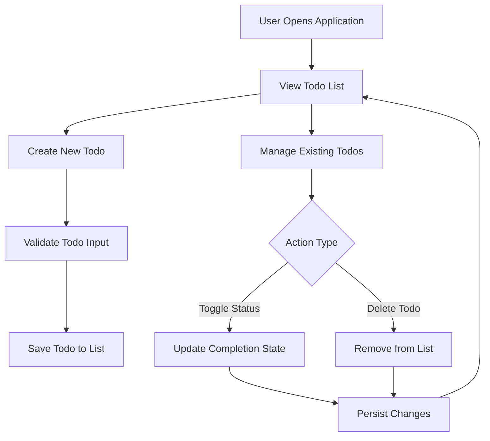
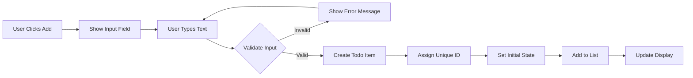
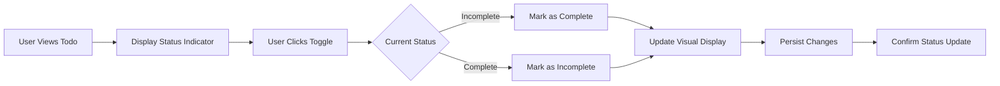
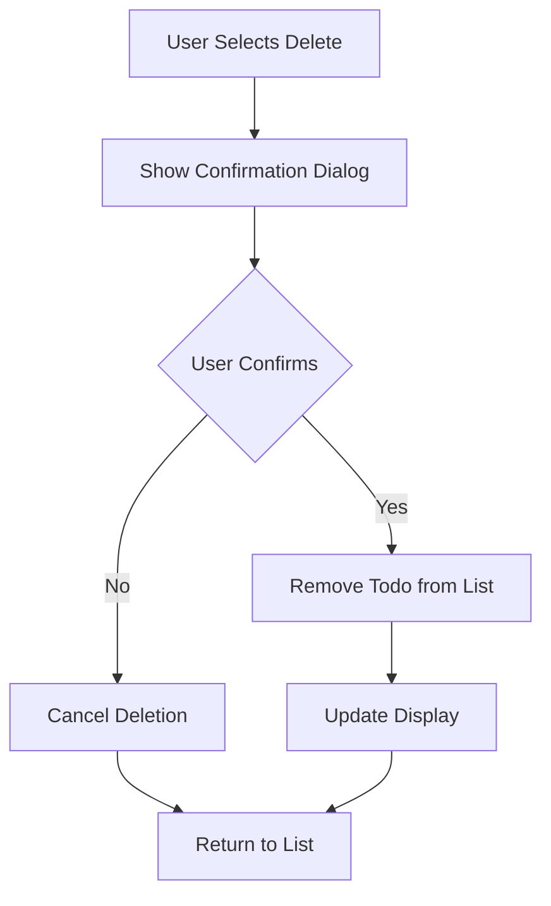
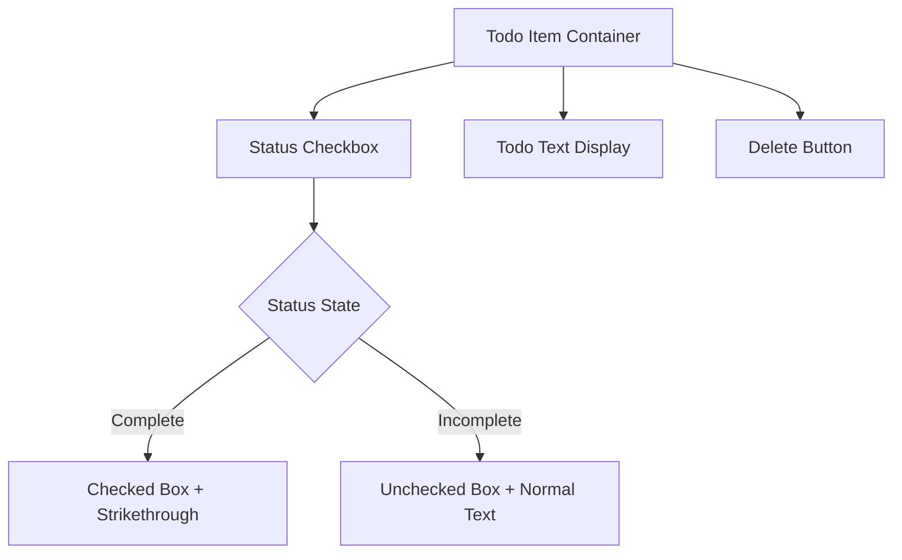

# Todo List Application - Functional Requirements

## 1. Introduction

This document defines the complete functional requirements for a minimal Todo list application designed specifically for beginners. The application focuses exclusively on core task management functionality, providing a straightforward experience for users new to productivity tools while maintaining the philosophy of simplicity over complexity.

### 1.1 Document Purpose and Scope
This specification provides comprehensive business requirements for developing a todo application that prioritizes user experience and implementation simplicity. The requirements are structured to ensure the application delivers essential functionality without overwhelming users with unnecessary features.

### 1.2 Business Context
The application serves as an educational tool for programming beginners and a practical solution for users seeking basic task management. It demonstrates fundamental application development concepts while providing immediate utility for personal task organization.

### 1.3 Target Audience
- **Primary Users**: Individuals needing simple todo management
- **Secondary Users**: Programming students learning application development
- **Tertiary Users**: Users who abandon complex applications due to feature overload

## 2. Core Features Overview

### 2.1 Complete Feature Set
The application SHALL provide the following minimum functionality required for basic todo management:

### 2.2 Feature Justification
WHEN considering feature inclusion, THE system SHALL prioritize simplicity by including only features that are essential for basic todo functionality, excluding any advanced functionality that would create complexity for beginners.

## 3. Todo Creation Requirements

### 3.1 Basic Todo Creation Process
WHEN a user wants to add a new todo item, THE system SHALL provide an intuitive interface for creating todos with text descriptions.

**Creation Workflow:**

### 3.2 Todo Text Validation Rules
THE system SHALL implement comprehensive validation to ensure todo text quality and consistency.

**RULE TRV-001: Todo Text Minimum Length**
WHEN a user attempts to create a todo, IF the text contains fewer than 1 character, THEN THE system SHALL display an error message: "Todo text must contain at least 1 character."

**RULE TRV-002: Todo Text Maximum Length**
WHEN a user enters todo text exceeding 500 characters, THEN THE system SHALL automatically truncate the text to 500 characters and display a notification: "Todo text was truncated to 500 characters."

**RULE TRV-003: Whitespace Validation**
IF a user attempts to create a todo containing only whitespace characters, THEN THE system SHALL reject the input and display: "Todo text cannot be empty or contain only spaces."

### 3.3 Automatic Todo Assignment
WHEN a todo is successfully created, THE system SHALL automatically assign it the following properties:
- Status: "incomplete"
- Creation timestamp: Current date and time
- Unique identifier: System-generated unique ID
- Display order: Based on creation sequence

## 4. Todo Management Requirements

### 4.1 Status Management System
WHEN a user interacts with a todo item, THE system SHALL provide clear mechanisms for managing todo status.

**Status Transition Workflow:**

### 4.2 Visual Status Indication
WHILE displaying todo items, THE system SHALL provide clear visual differentiation between status states:
- **Incomplete todos**: Normal text display with unchecked checkbox
- **Complete todos**: Strikethrough text with checked checkbox
- **Visual consistency**: Same styling applied to all items in the same state

### 4.3 Todo Deletion Process
WHEN a user wants to remove a todo, THE system SHALL implement a confirmation-based deletion workflow.

**Deletion Workflow:**

**RULE TDL-001: Delete Confirmation**
WHEN a user initiates todo deletion, THE system SHALL display a confirmation dialog with the message: "Are you sure you want to delete this todo? This action cannot be undone."

**RULE TDL-002: Deletion Irreversibility**
WHEN a todo is confirmed for deletion, THE system SHALL permanently remove it from the list without providing undo functionality.

## 5. User Interface Requirements

### 5.1 Interface Layout Specifications
THE system SHALL implement a clean, minimal interface with the following components:

**Primary Interface Elements:**
- Header section with application title
- Input field for new todo creation with placeholder text
- List area displaying all todo items
- Clear visual separation between interface sections

**Todo Item Display:**

### 5.2 Responsive Design Requirements
WHEN the application is viewed on different devices, THE system SHALL maintain functionality and usability across:
- Desktop browsers (minimum width: 1024px)
- Tablet devices (width: 768px - 1023px)
- Mobile phones (width: 320px - 767px)

### 5.3 Accessibility Standards
THE system SHALL implement basic accessibility features including:
- Keyboard navigation support for all functions
- Screen reader compatibility for todo items
- Sufficient color contrast for text readability
- Clear focus indicators for interactive elements

## 6. Business Rules and Validation

### 6.1 Data Integrity Rules
**RULE DIR-001: Unique Todo Identification**
WHEN creating a new todo, THE system SHALL generate a unique identifier that ensures no duplicate todos can exist within the same user session.

**RULE DIR-002: Creation Timestamp Accuracy**
WHEN recording todo creation time, THE system SHALL use the device's local timezone and maintain accuracy within 1 second of the actual creation time.

**RULE DIR-003: State Transition Integrity**
WHILE a todo exists, THE system SHALL allow only valid state transitions between "incomplete" and "complete" states, preventing any invalid state changes.

### 6.2 User Experience Rules
**RULE UXR-001: Immediate Feedback**
WHEN a user performs any action, THE system SHALL provide visual feedback within 100 milliseconds to confirm the action was received.

**RULE UXR-002: Consistent Behavior**
WHILE the application is running, THE system SHALL maintain consistent interaction patterns across all todo management functions.

**RULE UXR-003: Error Recovery**
WHEN an error occurs, THE system SHALL provide clear recovery instructions and maintain the user's current work state.

## 7. Error Handling Requirements

### 7.1 Input Validation Errors
**WHEN input validation fails, THE system SHALL provide specific error messages:**
- Empty todo: "Please enter some text for your todo."
- Maximum length exceeded: "Todo text cannot exceed 500 characters."
- Invalid characters: "Todo text contains invalid characters."

### 7.2 System Operation Errors
**WHEN system operations encounter errors, THE system SHALL handle them gracefully:**
- Storage failure: "Unable to save changes. Please try again."
- Data corruption: "Todo data appears corrupted. Starting with empty list."
- Memory issues: "Application memory limit reached. Please delete some todos."

### 7.3 User Action Errors
**WHEN users perform invalid actions, THE system SHALL provide guidance:**
- Invalid state transitions: "Cannot perform this action in the current state."
- Concurrent modifications: "Another operation is in progress. Please wait."
- Navigation errors: "Unable to complete navigation. Returning to main list."

## 8. Performance Requirements

### 8.1 Response Time Specifications
**THE system SHALL meet the following performance criteria:**
- Application startup time: < 2 seconds on average connection
- Todo creation response: < 100 milliseconds from user action to visual feedback
- Status toggle response: < 50 milliseconds for immediate feedback
- List rendering: < 200 milliseconds for 100+ todo items
- Data persistence: Background saving without blocking user interaction

### 8.2 Scalability Considerations
**WHILE maintaining performance, THE system SHALL support:**
- Up to 1000 todo items without degradation
- Simultaneous user interactions without conflict
- Memory usage optimization for large todo lists
- Efficient data storage and retrieval operations

### 8.3 User Experience Metrics
**THE system SHALL achieve the following usability standards:**
- First-time user proficiency within 30 seconds of application use
- Error rate below 2% for common todo operations
- User satisfaction rating above 4.5/5 for simplicity and ease of use
- Task completion rate of 98% for basic todo management

## 9. Success Criteria and Validation

### 9.1 Functional Validation
**THE system SHALL be considered functionally complete WHEN:**
- Users can create, view, toggle, and delete todos without confusion
- All todo data persists correctly between application sessions
- Error handling provides clear, actionable feedback
- Performance meets specified response time requirements

### 9.2 Usability Validation
**THE system SHALL pass usability testing WHEN:**
- First-time users complete basic todo operations without instructions
- No users report missing essential functionality
- Interface remains intuitive across different device sizes
- Accessibility features work correctly for users with disabilities

### 9.3 Technical Validation
**THE implementation SHALL meet technical standards WHEN:**
- Codebase remains under 1000 lines for core functionality
- No external dependencies beyond standard browser APIs
- Cross-browser compatibility achieved for modern browsers
- Progressive enhancement principles followed for basic functionality

## 10. Excluded Functionality

To maintain the minimal philosophy, the following features are explicitly excluded from version 1.0:

### 10.1 Advanced Organization Features
- Categories, tags, or labeling systems
- Priority levels or importance ranking
- Due dates, deadlines, or time-based features
- Search, filter, or sorting capabilities

### 10.2 User Management Features
- User accounts or authentication systems
- Multiple todo lists or workspace separation
- Collaboration or sharing functionality
- User preferences or customization options

### 10.3 Advanced Technical Features
- Server-side synchronization or cloud storage
- Advanced data analysis or reporting
- Integration with external services or APIs
- Complex notification or reminder systems

---

*This document provides comprehensive business requirements for building a minimal Todo list application that prioritizes simplicity, user experience, and implementation clarity while delivering essential functionality for basic task management.*