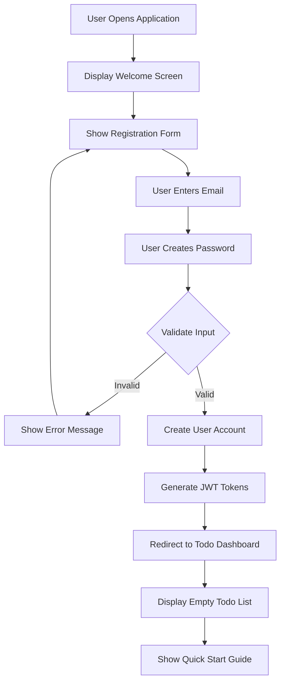
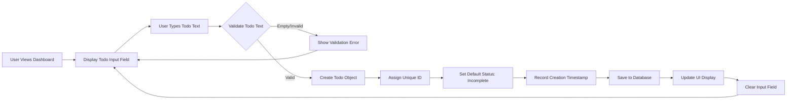
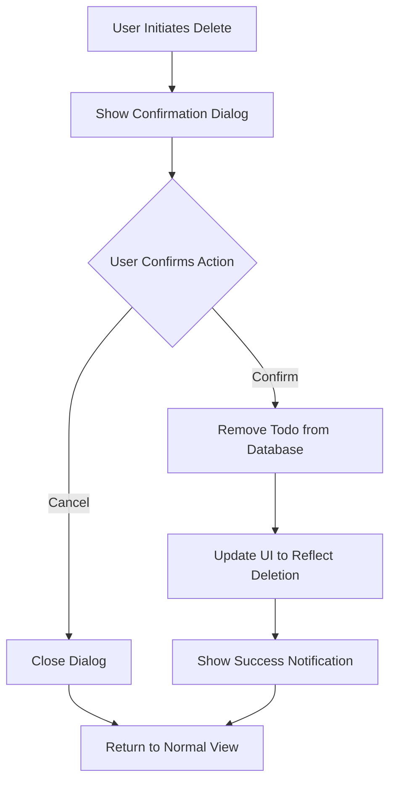
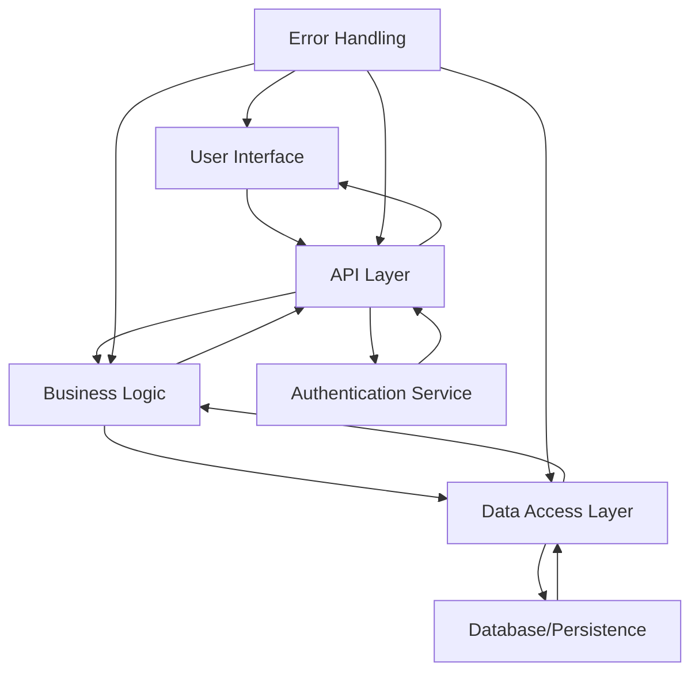

# Todo Application - Comprehensive User Scenarios

## Executive Summary

This document provides detailed user scenarios and interaction flows for the Minimal Todo Application. Each scenario follows the EARS format (Event-Driven, State-Driven, and Ubiquitous requirements) to ensure clear, testable specifications for backend developers.

## User Personas

### 1. Primary User - "Task Manager"
- **Background**: Individual seeking simple task organization
- **Technical Level**: Basic computer literacy, no programming knowledge
- **Goals**: Quick task capture and management without complexity
- **Usage Pattern**: Daily task tracking with 5-20 todos

### 2. Learning User - "Programming Student"
- **Background**: Beginner developer studying application architecture
- **Technical Level**: Basic programming knowledge
- **Goals**: Understand clean code structure and simple CRUD operations
- **Usage Pattern**: Intermittent use for learning purposes

## Primary User Scenarios

### Scenario 1: First-Time User Registration and Onboarding

**EARS Requirements for Registration:**
- WHEN a new user visits the application for the first time, THE system SHALL present a simple registration interface with email and password fields
- WHILE the user is completing the registration form, THE system SHALL provide real-time validation feedback
- IF the user attempts to submit invalid registration data, THEN THE system SHALL highlight specific errors and prevent account creation
- AFTER successful registration, THE system SHALL automatically log in the user and redirect to the todo dashboard

### Scenario 2: User Login and Authentication

**Ubiquitous Authentication Requirements:**
- THE system SHALL maintain secure user sessions using JWT tokens with appropriate expiration policies
- THE system SHALL protect against common security vulnerabilities including CSRF and XSS attacks

**Event-Driven Requirements:**
- WHEN a registered user attempts to log in, THE system SHALL validate credentials against stored user data
- IF authentication succeeds, THEN THE system SHALL generate access and refresh tokens and establish a secure session
- IF authentication fails due to invalid credentials, THEN THE system SHALL return a generic error message without revealing whether the email exists
- WHEN a user's access token expires but refresh token is valid, THE system SHALL automatically obtain new tokens without user intervention

### Scenario 3: Todo Creation Workflow

**State-Driven Requirements:**
- WHILE creating a new todo, THE system SHALL maintain the current todo list state and display it alongside the input interface
- AFTER a todo is successfully created, THE system SHALL immediately update the display to include the new item

**Business Rules for Todo Creation:**
- WHEN creating a todo, THE system SHALL enforce a minimum text length of 1 character and maximum of 500 characters
- IF a user attempts to create a todo with only whitespace characters, THEN THE system SHALL treat it as empty text and reject the creation
- THE system SHALL automatically assign "incomplete" status to all newly created todos

### Scenario 4: Todo Status Management

**Complete/Incomplete Toggle Requirements:**
- WHEN a user clicks on a todo's status toggle, THE system SHALL immediately update the todo's completion status
- AFTER status change, THE system SHALL persist the updated state to the database
- THE system SHALL provide clear visual feedback indicating the current status (e.g., strikethrough for completed items)

**State-Driven Requirements:**
- WHILE a todo is marked as complete, THE system SHALL display it with visual distinction from incomplete items
- WHILE a todo is marked as incomplete, THE system SHALL display it as an active, pending task

### Scenario 5: Todo Deletion Process

**Event-Driven Requirements:**
- WHEN a user attempts to delete a todo, THE system SHALL require explicit confirmation to prevent accidental deletion
- IF user confirms deletion, THEN THE system SHALL permanently remove the todo from the database
- IF user cancels deletion, THEN THE system SHALL retain the todo unchanged and return to normal operation

**Ubiquitous Requirements:**
- THE system SHALL not provide an "undo" functionality for deleted todos to maintain simplicity
- THE system SHALL ensure deletion operations are irreversible once confirmed

### Scenario 6: Session Management and Security

**Authentication Flow Requirements:**
- WHEN a user remains inactive for more than 30 minutes, THE system SHALL maintain the session but may require re-authentication for sensitive operations
- IF both access and refresh tokens expire, THEN THE system SHALL redirect the user to the login page
- WHEN a user explicitly logs out, THE system SHALL invalidate all tokens and clear session data

**Security Requirements:**
- THE system SHALL implement rate limiting to prevent brute force attacks on authentication endpoints
- THE system SHALL validate all input data to prevent injection attacks
- THE system SHALL enforce proper CORS policies for cross-origin requests

## Error Handling Scenarios

### Scenario 7: Authentication Failures

**WHEN authentication services experience technical issues,** THE system SHALL:
- Return HTTP 503 Service Unavailable with appropriate retry-after headers
- Log detailed error information for debugging purposes
- Provide user-friendly error messages without exposing technical details

**IF a user attempts to access protected resources without valid authentication,** THEN THE system SHALL:
- Return HTTP 401 Unauthorized
- Redirect to login page with return URL parameter
- Clear any invalid or expired tokens from client storage

### Scenario 8: Data Persistence Failures

**WHEN the system cannot save todo data to persistent storage,** THE system SHALL:
- Maintain todo data in memory for the current session
- Attempt automatic retry with exponential backoff
- Notify the user of the temporary issue with appropriate messaging
- Provide manual save option if automatic saving fails repeatedly

**IF data loading fails during application startup,** THEN THE system SHALL:
- Start with an empty todo list
- Log the error for debugging
- Provide user notification about data loading failure
- Offer data recovery options if available

### Scenario 9: Input Validation Errors

**WHEN a user submits invalid todo data,** THE system SHALL:
- Provide specific, actionable error messages
- Highlight the problematic input fields
- Maintain entered data to prevent re-entry
- Suggest corrections when possible

**Business Rule Validation Examples:**
- IF todo text exceeds 500 characters, THEN THE system SHALL truncate to 500 characters with user notification
- IF todo text is empty, THEN THE system SHALL prevent submission and highlight the required field
- IF duplicate todo detection is implemented, THEN THE system SHALL warn the user but allow creation

## Performance Scenarios

### Scenario 10: Application Load Performance

**WHEN a user opens the application,** THE system SHALL:
- Load initial interface within 2 seconds on average network conditions
- Display existing todos within 3 seconds of page load
- Provide loading indicators during data retrieval
- Cache frequently accessed data for improved performance

**Performance Benchmarks:**
- Todo creation operations SHALL complete within 100ms
- Status toggle operations SHALL complete within 50ms
- Todo deletion operations SHALL complete within 100ms
- List rendering with 100+ items SHALL complete within 500ms

### Scenario 11: Concurrent Operations

**WHILE multiple todo operations are performed rapidly,** THE system SHALL:
- Maintain UI responsiveness during background operations
- Queue operations appropriately to prevent race conditions
- Provide visual feedback for pending operations
- Handle operation conflicts with appropriate resolution strategies

## Edge Cases and Boundary Conditions

### Scenario 12: Large Todo Lists

**WHEN the todo list contains 1000+ items,** THE system SHALL:
- Implement efficient data loading with pagination or virtual scrolling
- Maintain responsive user interface during filtering and sorting
- Provide search functionality for quick item location
- Optimize memory usage to prevent browser performance issues

### Scenario 13: Network Connectivity Issues

**WHILE the application operates in offline mode,** THE system SHALL:
- Continue functioning with local data storage
- Queue operations for synchronization when connectivity returns
- Provide clear indication of offline status
- Handle sync conflicts with appropriate resolution

### Scenario 14: Browser Compatibility Issues

**WHEN the application runs on unsupported browsers,** THE system SHALL:
- Provide graceful degradation of functionality
- Display compatibility warnings with suggested alternatives
- Maintain core functionality where possible
- Offer basic HTML fallback for critical operations

## Integration Scenarios

### Scenario 15: Data Flow Between Components

**Integration Requirements:**
- WHEN data flows between application layers, THE system SHALL maintain data integrity and validation at each boundary
- IF integration points fail, THEN THE system SHALL provide appropriate error handling and recovery mechanisms
- THE system SHALL implement proper separation of concerns between different application components

## Success Validation Scenarios

### Scenario 16: User Acceptance Testing

**WHEN validating the application against user requirements,** THE system SHALL demonstrate:
- Successful completion of all primary user scenarios without errors
- Appropriate handling of all error conditions with user-friendly messaging
- Consistent performance meeting defined benchmarks
- Security requirements implementation protecting user data

### Scenario 17: Performance Testing

**WHILE conducting performance testing,** THE system SHALL maintain:
- Responsive user interface under normal load conditions
- Graceful degradation under stress conditions
- Data consistency during concurrent operations
- Session integrity across multiple user interactions

## Conclusion

This comprehensive user scenarios document provides backend developers with clear, testable requirements for implementing the Minimal Todo Application. Each scenario follows EARS format to ensure unambiguous specification of system behavior under various conditions.

**Key Success Criteria:**
- All primary user workflows function without errors
- Error handling provides clear recovery paths
- Performance meets defined benchmarks
- Security requirements are properly implemented
- The application maintains its minimalist philosophy while delivering reliable functionality

> *Developer Note: This document defines **business requirements only**. All technical implementations (architecture, APIs, database design, etc.) are at the discretion of the development team.*