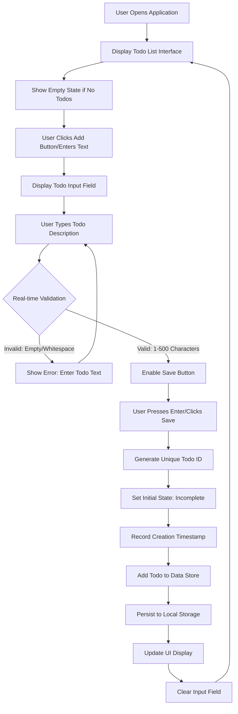
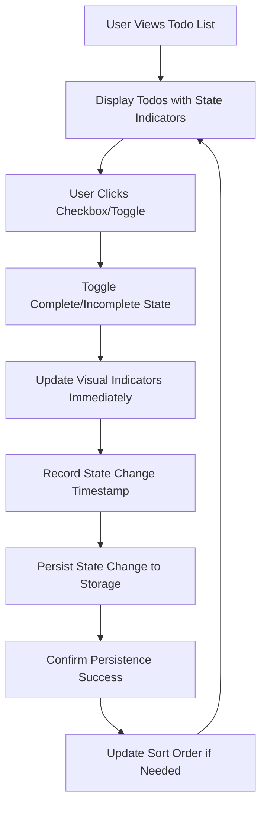
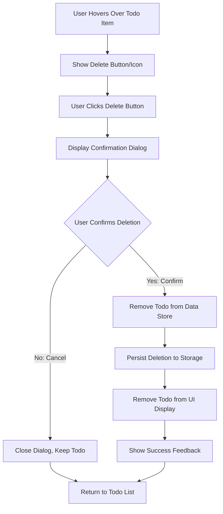

# Business Rules Documentation - Minimal Todo Application

## 1. Introduction

This document defines the comprehensive business rules and logic constraints that govern the minimal Todo application. The application focuses exclusively on core Todo functionality with no advanced features, providing a simple, straightforward user experience for Todo management.

### Purpose
- Define the complete business logic that controls all todo operations
- Specify comprehensive validation rules and constraints for todo data
- Document complete state management and workflow definitions
- Provide clear, testable criteria for implementation
- Serve as single source of truth for all business rule requirements

### Scope
This document covers the minimum functionality required for a basic Todo application:
- Todo item creation and validation with complete error handling
- Todo state management (complete/incomplete) with persistence rules
- Todo deletion with confirmation workflows and edge cases
- List display and basic operations with performance requirements
- Comprehensive error handling and recovery scenarios

**Excluded from scope**: Categories, due dates, priorities, user accounts, search/filtering, and any advanced functionality.

## 2. Data Validation Rules

### 2.1 Todo Text Content Validation

**WHEN creating a new todo item**, THE system SHALL validate the todo text content according to the following rules:

**RULE TRV-001: Todo Text Minimum Length**
- **IF** todo text is less than 1 character, **THEN** THE system SHALL reject the input and display error message: "Todo must contain at least 1 character"
- **WHILE** validating todo text, THE system SHALL trim leading and trailing whitespace before checking length
- **THE** system SHALL prevent submission until minimum length requirement is met

**RULE TRV-002: Todo Text Maximum Length**
- **WHEN** todo text exceeds 500 characters, **THEN** THE system SHALL automatically truncate to 500 characters
- **THE** system SHALL display warning message: "Todo text truncated to 500 characters"
- **WHILE** user is typing, THE system SHALL show character count (e.g., "245/500")

**RULE TRV-003: Empty Text Prevention**
- **IF** user attempts to create a todo with only whitespace characters, **THEN** THE system SHALL treat it as empty text and apply RULE TRV-001
- **THE** system SHALL provide clear feedback: "Please enter meaningful todo text"

**RULE TRV-004: Special Character Handling**
- **WHILE** accepting todo text, THE system SHALL allow all standard keyboard characters including punctuation
- **THE** system SHALL not impose restrictions on character types for maximum flexibility

### 2.2 Todo State Validation

**RULE TSV-001: Initial State Assignment**
- **WHEN** a new todo is created, **THE** system SHALL automatically assign it an "incomplete" state
- **THE** system SHALL provide clear visual indicators for the current state (e.g., unchecked checkbox for incomplete)

**RULE TSV-002: State Transition Integrity**
- **WHILE** a todo exists, **THE** system SHALL allow only two state transitions: incomplete → complete and complete → incomplete
- **THE** system SHALL prevent any other state modifications or invalid transitions
- **WHEN** state changes occur, THE system SHALL update the modification timestamp

**RULE TSV-003: State Persistence**
- **WHEN** a todo state is changed, **THE** system SHALL immediately persist the new state
- **THE** system SHALL ensure state changes survive application restarts

## 3. Business Logic Constraints

### 3.1 Todo Creation Constraints

**RULE TCC-001: Unique Todo Identification**
- **WHEN** creating a new todo, **THE** system SHALL generate a unique identifier for each todo item
- **THE** system SHALL ensure no duplicate identifiers exist within the same user session
- **IDENTIFIER FORMAT**: UUID v4 or timestamp-based unique ID

**RULE TCC-002: Creation Timestamp**
- **WHEN** a todo is successfully created, **THE** system SHALL record the creation timestamp in ISO 8601 format
- **THE** system SHALL display todos in chronological order (newest first by default)

**RULE TCC-003: Todo Order Preservation**
- **WHILE** displaying todos, **THE** system SHALL maintain the creation order
- **WHEN** new todos are added, **THE** system SHALL insert them according to sort preference
- **THE** system SHALL support basic sorting options: newest first, oldest first

### 3.2 Todo Management Constraints

**RULE TMC-001: State Change Persistence**
- **WHEN** a user marks a todo as complete or incomplete, **THE** system SHALL immediately persist the state change
- **THE** system SHALL provide visual feedback confirming the state change
- **VISUAL INDICATORS**: Strikethrough text for completed items, different color schemes

**RULE TMC-002: Todo Deletion Confirmation**
- **WHEN** a user attempts to delete a todo, **THE** system SHALL require explicit confirmation
- **CONFIRMATION DIALOG**: "Are you sure you want to delete this todo?" with Yes/No options
- **IF** user confirms deletion, **THEN** THE system SHALL permanently remove the todo
- **IF** user cancels deletion, **THEN** THE system SHALL retain the todo unchanged

**RULE TMC-003: Deletion Irreversibility**
- **WHEN** a todo is deleted, **THE** system SHALL make the action irreversible
- **THE** system SHALL not provide an "undo" functionality for simplicity
- **THE** system SHALL remove all references to the deleted todo

**RULE TMC-004: Bulk Operations Prevention**
- **THE** system SHALL not support bulk operations (select multiple, delete all completed, etc.)
- **EACH** todo operation SHALL be performed individually to maintain simplicity

### 3.3 List Management Constraints

**RULE LMC-001: Empty List Behavior**
- **WHILE** no todos exist, **THE** system SHALL display a friendly message: "Your todo list is empty. Add your first todo above!"
- **THE** system SHALL provide clear instructions for creating the first todo
- **THE** empty state SHALL include visual cues to guide new users

**RULE LMC-002: List Length Limits**
- **THE** system SHALL not impose artificial limits on the number of todos
- **WHEN** the list grows large, **THE** system SHALL maintain performance and usability
- **PERFORMANCE THRESHOLD**: The system SHALL handle up to 1000 todos without degradation

**RULE LMC-003: List Display Optimization**
- **WHEN** displaying large lists, **THE** system SHALL implement basic virtualization if needed
- **THE** user experience SHALL remain smooth regardless of list size

## 4. Workflow Definitions

### 4.1 Todo Creation Workflow

### 4.2 Todo State Management Workflow

### 4.3 Todo Deletion Workflow

## 5. Process Flows

### 5.1 Application Startup Process

**WHEN the application starts**, THE system SHALL:
1. Initialize application state and UI components
2. Attempt to load existing todos from persistent storage
3. IF storage loading fails, THEN start with empty list and show recovery message
4. Display the todo list interface with appropriate empty state if needed
5. Provide clear access to todo creation functionality
6. Ensure all UI elements are responsive and accessible

**WHILE loading data**, THE system SHALL:
- Show loading indicator during data retrieval
- Handle storage errors gracefully with user-friendly messages
- Provide fallback behavior when data cannot be loaded

### 5.2 Todo Persistence Process

**WHILE the application is running**, THE system SHALL:
- Automatically save todos after any modification (create, update, delete)
- Implement debounced saving to prevent excessive storage operations
- Ensure data consistency between memory and storage
- Handle persistence errors gracefully without data loss
- Provide recovery mechanisms for corrupted data

**PERSISTENCE STRATEGY**:
- Save after each user action with 500ms debounce
- Maintain in-memory cache for immediate UI updates
- Validate data integrity before and after storage operations
- Implement basic versioning for data recovery

### 5.3 User Interaction Process

**WHEN a user interacts with the application**, THE system SHALL:
- Provide immediate visual feedback for all actions
- Maintain consistent behavior across all operations
- Ensure the interface remains responsive during operations
- Handle concurrent operations appropriately
- Prevent race conditions in data modifications

## 6. Error Handling Rules

### 6.1 Input Validation Errors

**RULE EHE-001: Invalid Todo Text**
- **IF** user attempts to create a todo with invalid text, **THEN** THE system SHALL display: "Please enter todo text (1-500 characters)"
- **THE** error message SHALL be clear, actionable, and positioned near the input field
- **THE** system SHALL prevent submission until valid text is provided

**RULE EHE-002: Empty Todo Creation**
- **IF** user attempts to create an empty todo, **THEN** THE system SHALL prevent the action and show guidance: "Todo cannot be empty"
- **THE** system SHALL highlight the input field to draw attention

### 6.2 System Operation Errors

**RULE EHE-003: Persistence Failure**
- **IF** the system cannot save todos to storage, **THEN** THE system SHALL display: "Unable to save changes. Please try again."
- **THE** system SHALL retain unsaved data in memory for recovery
- **THE** system SHALL automatically retry saving after a short delay
- **IF** persistent failures occur, THE system SHALL offer export functionality

**RULE EHE-004: Data Loading Failure**
- **IF** the system cannot load existing todos, **THEN** THE system SHALL start with an empty list
- **THE** system SHALL notify the user: "Could not load previous todos. Starting with empty list."
- **THE** system SHALL provide option to attempt reload
- **THE** system SHALL log the error for debugging purposes

### 6.3 User Action Errors

**RULE EHE-005: Invalid State Transitions**
- **IF** an invalid state transition is attempted, **THEN** THE system SHALL ignore the request
- **THE** system SHALL maintain the current valid state
- **THE** system SHALL log the attempted invalid transition

**RULE EHE-006: Concurrent Modification**
- **IF** multiple modification attempts occur simultaneously, **THEN** THE system SHALL process them sequentially
- **THE** system SHALL prevent data corruption through proper locking mechanisms
- **THE** system SHALL ensure data consistency after concurrent operations

## 7. Success Criteria

### 7.1 Functional Success Criteria

**CRITERION SC-001: Todo Creation**
- **THE** system SHALL allow users to create new todo items with 1-500 characters of text
- **WHEN** a todo is created, THE system SHALL display it in the list with "incomplete" status
- **CREATION TIME**: Todo creation SHALL complete within 100ms of user action
- **VISUAL FEEDBACK**: Immediate confirmation of successful creation

**CRITERION SC-002: State Management**
- **THE** system SHALL allow users to toggle between complete and incomplete states
- **State changes** SHALL be immediately visible and persistent
- **TOGGLE RESPONSE**: State changes SHALL reflect within 50ms
- **PERSISTENCE**: Changes SHALL survive application restart

**CRITERION SC-003: Todo Deletion**
- **THE** system SHALL require confirmation before deleting todos
- **AFTER** confirmation, THE system SHALL permanently remove the todo
- **DELETION TIME**: Removal SHALL complete within 100ms
- **CONFIRMATION UI**: Clear, unobtrusive confirmation dialog

**CRITERION SC-004: List Display**
- **THE** system SHALL display all todos in a clear, readable list
- **THE** list SHALL update immediately after any operation
- **RENDERING PERFORMANCE**: List updates SHALL complete within 16ms for smooth 60fps
- **SCROLLING**: List SHALL remain smooth with up to 1000 items

### 7.2 Performance Success Criteria

**CRITERION SC-005: Responsiveness**
- **THE** system SHALL respond to user actions within 100 milliseconds
- **Todo operations** SHALL feel instantaneous to the user
- **INPUT RESPONSE**: Keystrokes SHALL be processed without lag
- **ANIMATIONS**: Any UI animations SHALL complete within 300ms

**CRITERION SC-006: Data Persistence**
- **THE** system SHALL automatically save changes without user intervention
- **Data loss** SHALL not occur during normal application use
- **SAVE FREQUENCY**: Changes SHALL be saved within 500ms of modification
- **RECOVERY**: Application SHALL recover gracefully from unexpected closures

### 7.3 Usability Success Criteria

**CRITERION SC-007: Interface Clarity**
- **THE** interface SHALL be intuitive for first-time users
- **All functionality** SHALL be discoverable without instructions
- **LEARNING CURVE**: Users SHALL be able to perform basic operations within 30 seconds
- **ACCESSIBILITY**: Interface SHALL meet basic accessibility standards

**CRITERION SC-008: Error Recovery**
- **WHEN** errors occur, THE system SHALL provide clear recovery paths
- **Users** SHALL never feel lost or confused about what to do next
- **ERROR MESSAGES**: All error messages SHALL be actionable and user-friendly
- **RECOVERY TIME**: Error recovery SHALL complete within 2 seconds

## 8. Implementation Constraints

### 8.1 Minimum Functionality Constraint

**CONSTRAINT MC-001: Feature Scope**
- **THE** implementation SHALL include ONLY the functionality specified in this document
- **Advanced features** like categories, due dates, or user accounts SHALL be excluded
- **ANY** additional features SHALL require separate business justification

**CONSTRAINT MC-002: Simplicity Priority**
- **THE** user interface SHALL prioritize simplicity over advanced functionality
- **Complex UI patterns** SHALL be avoided in favor of straightforward interactions
- **THE** codebase SHALL remain clean and maintainable for beginners

### 8.2 Technical Constraints

**CONSTRAINT TC-001: Data Storage**
- **THE** system SHALL use simple, local storage mechanisms
- **No server infrastructure** or complex databases SHALL be required
- **STORAGE LIMIT**: Implementation SHALL work within browser storage limits (typically 5-10MB)

**CONSTRAINT TC-002: Cross-Platform Compatibility**
- **THE** application SHALL work consistently across modern web browsers
- **No platform-specific features** SHALL be used that limit accessibility
- **BROWSER SUPPORT**: Chrome, Firefox, Safari, Edge (latest versions)

**CONSTRAINT TC-003: Code Complexity**
- **THE** total codebase SHALL not exceed 1000 lines of code for core functionality
- **EXTERNAL DEPENDENCIES**: Minimal external libraries required
- **MAINTAINABILITY**: Code SHALL be easily understandable by beginner developers

### 8.3 Performance Constraints

**CONSTRAINT PC-001: Load Time**
- **THE** application SHALL load completely within 2 seconds on average connections
- **INITIAL RENDER**: First meaningful paint within 1 second
- **INTERACTIVE TIME**: Application becomes interactive within 1.5 seconds

**CONSTRAINT PC-002: Memory Usage**
- **THE** application SHALL use less than 50MB of memory during normal operation
- **MEMORY LEAKS**: No memory leaks over extended usage periods
- **GARBAGE COLLECTION**: Proper memory management practices SHALL be followed

---

*This document defines the comprehensive business rules and logic constraints for the minimal Todo application. All technical implementation decisions, including architecture, APIs, and database design, are at the discretion of the development team, provided they adhere to the constraints and success criteria outlined above.*