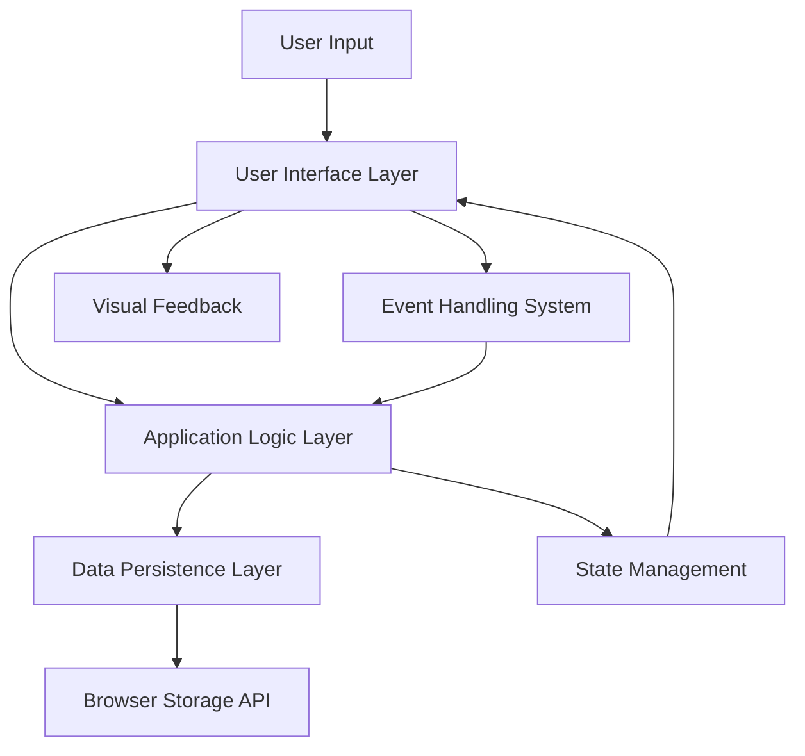
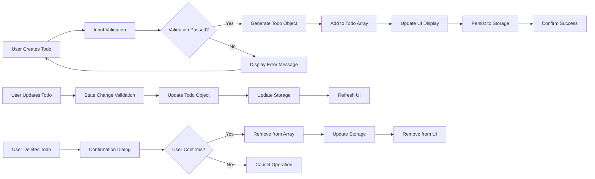

# Minimal Todo Application - System Context Document

## 1. Comprehensive System Overview

### 1.1 Technical Architecture

The Minimal Todo Application operates as a client-side web application designed for simplicity and immediate usability. The system follows a single-page application (SPA) architecture that runs entirely within the user's web browser.

**WHEN the application loads, THE system SHALL initialize completely within the browser environment** without requiring server-side processing or external dependencies.

### 1.2 System Components

**System Component Specifications:**
- **User Interface Layer**: Handles todo display, input controls, and visual feedback
- **Application Logic Layer**: Manages todo operations, validation, and business rules
- **Data Persistence Layer**: Handles storage operations using browser APIs
- **Event Handling System**: Processes user interactions and system events
- **State Management**: Maintains application state and synchronization

### 1.3 Technology Stack

**THE system SHALL utilize the following technology stack:**
- **Frontend**: HTML5, CSS3, Vanilla JavaScript
- **Storage**: Browser localStorage API for data persistence
- **Styling**: Minimal CSS framework or custom styles
- **No External Dependencies**: Pure client-side implementation

## 2. Technical Environment Specifications

### 2.1 Browser Compatibility Requirements

**WHEN deployed, THE system SHALL support the following browser versions:**

| Browser | Minimum Version | Key Features Required |
|---------|----------------|---------------------|
| Chrome | 60+ | localStorage, ES6 support, CSS Grid |
| Firefox | 55+ | localStorage, ES6 support, CSS Grid |
| Safari | 11+ | localStorage, ES6 support, CSS Grid |
| Edge | 79+ | localStorage, ES6 support, CSS Grid |

**THE system SHALL provide graceful degradation** for unsupported browsers with basic functionality maintained.

### 2.2 Storage Requirements and Limitations

**WHEN storing todo data, THE system SHALL adhere to browser storage limitations:**
- **Maximum Storage**: 5MB per domain (typical browser localStorage limit)
- **Data Structure**: JSON-serialized todo objects
- **Storage Key**: "minimal-todo-app-data" for data persistence
- **Backup Strategy**: Optional export functionality for data backup

### 2.3 Performance Benchmarks

**THE system SHALL meet the following performance thresholds:**

**WHEN loading the application, THE system SHALL:**
- Complete initial load within 2 seconds on standard broadband connections
- Display existing todos within 1 second of application start
- Initialize all interface components within 500 milliseconds

**WHEN performing todo operations, THE system SHALL:**
- Respond to user actions within 100 milliseconds
- Update the user interface immediately after data changes
- Persist data changes within 50 milliseconds of user action

## 3. Performance Requirements (EARS Format)

### 3.1 Application Loading Performance

**WHEN a user accesses the application URL, THE system SHALL display the main interface within 2 seconds** under normal network conditions.

**WHILE the application is loading, THE system SHALL provide visual feedback** indicating the loading progress.

**IF the application fails to load within 5 seconds, THEN THE system SHALL display an appropriate error message** with recovery options.

### 3.2 Todo Operation Performance

**WHEN a user creates a new todo item, THE system SHALL complete the operation within 100 milliseconds** including validation, storage, and UI updates.

**WHEN a user toggles a todo status, THE system SHALL update the state immediately** with visual confirmation within 50 milliseconds.

**WHEN a user deletes a todo item, THE system SHALL remove it from the display** after confirmation within 150 milliseconds.

### 3.3 Data Persistence Performance

**WHILE the application is running, THE system SHALL automatically save changes** to local storage without blocking user interactions.

**THE data persistence operations SHALL complete in the background** without affecting application responsiveness.

**IF data persistence fails, THEN THE system SHALL retain changes in memory** and attempt to save again later.

## 4. Security and Privacy Implementation

### 4.1 Data Protection Mechanisms

**THE system SHALL implement the following security measures:**

**WHEN storing user data, THE system SHALL utilize browser security features** to prevent unauthorized access.

**THE system SHALL NOT transmit any user data** to external servers or third-party services.

**WHEN handling todo data, THE system SHALL enforce content security policies** to prevent script injection attacks.

### 4.2 Privacy Compliance Requirements

**THE system SHALL comply with basic privacy principles:**
- No collection of personal identifiable information
- No tracking or analytics implementation
- No data sharing with external parties
- Clear data ownership by the user

**WHEN a user clears browser data, THE system SHALL respect the user's decision** and remove all application data permanently.

### 4.3 Security Testing Procedures

**BEFORE deployment, THE system SHALL undergo security testing** for common web vulnerabilities including:
- Cross-Site Scripting (XSS) prevention
- Data injection protection
- Local storage security
- Content Security Policy compliance

## 5. Data Lifecycle Management

### 5.1 Comprehensive Data Flow

### 5.2 State Management Specifications

**THE system SHALL maintain the following application states:**

**Initialization State:**
- **WHEN the application starts, THE system SHALL load existing todos** from localStorage
- **IF no todos exist, THEN THE system SHALL initialize with an empty array**
- **THE system SHALL display the appropriate interface** based on todo count

**Working State:**
- **WHILE users interact with todos, THE system SHALL maintain real-time synchronization** between memory and storage
- **THE system SHALL handle concurrent operations** with proper state locking
- **ALL state changes SHALL be atomic** to prevent data corruption

### 5.3 Data Persistence Procedures

**WHEN changes occur, THE system SHALL follow this persistence procedure:**
1. **Validate changes** against business rules
2. **Update in-memory data structure**
3. **Serialize data** to JSON format
4. **Store in localStorage** with error handling
5. **Update UI** to reflect changes
6. **Provide user feedback** on operation success

**THE system SHALL implement automatic save retry logic** for storage failures.

## 6. Error Handling and Recovery

### 6.1 Data Storage Errors

**IF localStorage is unavailable, THEN THE system SHALL:**
- Continue operating with in-memory data only
- Display a warning message to the user
- Provide export functionality for data backup
- Attempt to restore storage when available

**WHEN data corruption is detected, THE system SHALL:**
- Attempt data recovery from backup if available
- Provide user with data export options
- Reset to empty state if recovery fails
- Log the error for debugging purposes

### 6.2 Application Error Scenarios

**WHEN JavaScript errors occur, THE system SHALL:**
- Capture and log errors for debugging
- Maintain basic functionality when possible
- Provide user-friendly error messages
- Offer recovery options when applicable

## 7. Operational Considerations

### 7.1 Deployment Procedures

**THE system SHALL support simple deployment through:**
- Single HTML file distribution
- Static web hosting services
- Local file system execution
- Progressive Web App installation

**WHEN deploying updates, THE system SHALL maintain data compatibility** with previous versions.

### 7.2 Maintenance Requirements

**THE system SHALL require minimal maintenance** with the following considerations:
- Browser compatibility testing with new browser versions
- Security updates for underlying web standards
- Performance monitoring for degradation
- User feedback integration for improvements

### 7.3 Monitoring and Logging

**THE system SHALL implement basic error logging** for:
- Application initialization failures
- Data persistence errors
- User operation errors
- Performance threshold violations

## 8. Integration Requirements

### 8.1 Authentication System Integration

**WHEN implementing user authentication (from 02-user-roles.md), THE system SHALL:**
- Maintain data separation between users
- Implement proper session management
- Ensure secure token handling
- Provide seamless authentication flow

### 8.2 Cross-Document Consistency

**THE system context SHALL align with requirements from all related documents:**
- Functional requirements from 03-functional-requirements.md
- User scenarios from 04-user-scenarios.md
- Business rules from 05-business-rules.md
- Authentication specifications from 02-user-roles.md

### 8.3 API and Interface Specifications

**WHEN extending functionality, THE system SHALL maintain clear interfaces** for:
- Data storage abstraction
- UI component interactions
- Event handling mechanisms
- State management patterns

## 9. Success Validation Criteria

### 9.1 Technical Success Metrics

**THE system SHALL be considered technically successful WHEN:**
- All performance requirements are consistently met
- Zero data loss incidents occur during normal operation
- Security requirements are fully implemented and tested
- Cross-browser compatibility is achieved
- Error recovery mechanisms function correctly

### 9.2 Operational Success Metrics

**THE deployment process SHALL be considered successful WHEN:**
- Application can be deployed to any static web host
- Zero configuration required for end-users
- Data persistence works reliably across sessions
- User experience remains consistent across environments

### 9.3 Maintenance Success Metrics

**THE maintenance approach SHALL be considered successful WHEN:**
- Regular browser compatibility testing identifies issues early
- Security updates can be applied without breaking functionality
- Performance monitoring provides actionable insights
- User feedback is effectively incorporated into improvements

> *Developer Note: This enhanced system context document provides comprehensive technical specifications while maintaining the minimalist philosophy. All implementation details should prioritize simplicity and ease of maintenance.*