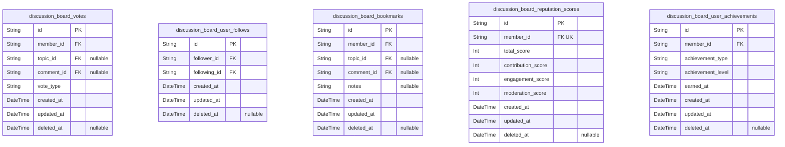
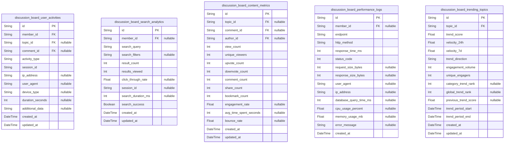

# Prisma Markdown

> Generated by [`prisma-markdown`](https://github.com/samchon/prisma-markdown)

- [Systematic](#systematic)
- [Actors](#actors)
- [Categories](#categories)
- [Content](#content)
- [Engagement](#engagement)
- [Moderation](#moderation)
- [Notifications](#notifications)
- [Analytics](#analytics)

## Systematic

### `discussion_board_system_configs`

System configuration settings for the discussion board platform. Stores
platform-wide configuration parameters that control system behavior,
features, and operational settings. These configurations are managed by
administrators and referenced by various system components. {@link
discussion_board_admins.id}

Properties as follows:

- `id`: Primary Key.
- `config_key`
  > Unique configuration key identifier. Used to reference specific system
  > settings programmatically.
- `config_value`
  > Configuration value stored as string. Can represent various data types
  > that are serialized to string format.
- `data_type`
  > Data type of the configuration value. Examples: 'boolean', 'string',
  > 'integer', 'double', 'json'.
- `description`
  > Human-readable description explaining the purpose and usage of this
  > configuration setting.
- `category`
  > Configuration category for organizational grouping. Examples:
  > 'authentication', 'moderation', 'performance', 'ui'.
- `status`
  > Configuration status indicating whether it's active, inactive, or
  > deprecated.
- `created_at`: Timestamp when this configuration was created.
- `updated_at`: Timestamp when this configuration was last updated.
- `deleted_at`
  > Timestamp when this configuration was soft deleted. Allows for
  > configuration history and recovery.

### `discussion_board_audit_logs`

Comprehensive audit trail of system actions and user activities. Records
all important operations performed on the platform for security,
compliance, and debugging purposes. Provides immutable historical record
of system changes. [discussion_board_admins.id](#discussion_board_admins), {@link
discussion_board_members.id}, [discussion_board_moderators.id](#discussion_board_moderators)

Properties as follows:

- `id`: Primary Key.
- `user_id`
  > User who performed the action. References the user who initiated this
  > audit event. [discussion_board_admins.id](#discussion_board_admins) or {@link
  > discussion_board_members.id} or [discussion_board_moderators.id](#discussion_board_moderators)
- `admin_id`
  > Administrator who performed administrative action. References the admin
  > user for administrative audit events. [discussion_board_admins.id](#discussion_board_admins)
- `action_type`
  > Type of action performed. Examples: 'user_login', 'content_create',
  > 'content_delete', 'user_ban', 'config_change'.
- `resource_type`
  > Type of resource affected by the action. Examples: 'user', 'topic',
  > 'comment', 'category', 'system_config'.
- `resource_id`: Identifier of the specific resource affected by this action.
- `ip_address`
  > IP address from which the action was performed. Used for security and
  > geographic tracking.
- `user_agent`
  > User agent string from the client that performed the action. Helps
  > identify client software and devices.
- `details`
  > Detailed information about the action performed, often stored as JSON for
  > flexibility.
- `success`
  > Whether the action was successful or failed. Helps track failed attempts
  > and errors.
- `error_message`
  > Error message if the action failed. Provides context for troubleshooting
  > failed operations.
- `created_at`: Timestamp when this audit event was recorded.
- `updated_at`: Timestamp when this audit event was last updated (rarely changed).
- `deleted_at`
  > Timestamp when this audit event was soft deleted. Typically null as audit
  > logs are preserved.

### `discussion_board_performance_metrics`

System performance monitoring and metrics collection. Tracks platform
performance indicators, response times, resource utilization, and
operational metrics for system health monitoring and optimization. {@link
discussion_board_system_configs.id}

Properties as follows:

- `id`: Primary Key.
- `metric_name`
  > Name of the performance metric being tracked. Examples:
  > 'api_response_time', 'database_query_time', 'memory_usage',
  > 'cpu_utilization'.
- `metric_value`: Numeric value of the performance metric measurement.
- `metric_unit`
  > Unit of measurement for the metric value. Examples: 'milliseconds',
  > 'percentage', 'bytes', 'requests_per_second'.
- `component`
  > System component being measured. Examples: 'authentication', 'database',
  > 'api', 'cache', 'search'.
- `threshold_warning`: Warning threshold value for this metric. Triggers alerts when exceeded.
- `threshold_critical`
  > Critical threshold value for this metric. Triggers urgent alerts when
  > exceeded.
- `status`
  > Current status of this metric reading. Examples: 'normal', 'warning',
  > 'critical', 'unknown'.
- `sampled_at`: Timestamp when this performance metric was sampled or collected.
- `created_at`: Timestamp when this performance metric record was created.
- `updated_at`: Timestamp when this performance metric record was last updated.
- `deleted_at`: Timestamp when this performance metric record was soft deleted.

## Actors

### `discussion_board_guests`

Guest users who can view public content but cannot create discussions or
comments. Guest access provides read-only functionality for users who
haven't registered or logged in.

Properties as follows:

- `id`: Primary Key.
- `session_id`
  > Unique session identifier for guest users to track their activity and
  > preferences during their visit.
- `ip_address`: IP address of the guest user for analytics and security purposes.
- `user_agent`: Browser user agent string for device and browser identification.
- `last_active_at`: Timestamp of the guest user's last activity on the platform.
- `created_at`: Timestamp when the guest session was created.
- `updated_at`: Timestamp when the guest session was last updated.
- `deleted_at`: Timestamp when the guest session was soft deleted.

### `discussion_board_members`

Registered member users who can create discussion topics, post comments,
and participate in discussions. Members form the core user base of the
discussion platform.

Properties as follows:

- `id`: Primary Key.
- `username`
  > Unique username for the member account. Used for display and
  > identification.
- `email`
  > Email address for the member account. Used for communication and account
  > recovery.
- `display_name`
  > Optional display name that can be different from username for privacy
  > preferences.
- `reputation_score`
  > Numerical reputation score based on community engagement and content
  > quality.
- `password_hash`
  > Securely hashed password for user authentication. Never store plain text
  > passwords.
- `is_verified`
  > Whether the member's email address has been verified through the
  > registration process.
- `is_suspended`
  > Whether the member account is temporarily suspended due to policy
  > violations.
- `business_status`
  > Business workflow status (active, pending, banned) for workflow
  > management.
- `last_login_at`: Timestamp of the member's most recent login to the platform.
- `joined_at`: Timestamp when the member registered and joined the platform.
- `created_at`: Timestamp when the member account was created.
- `updated_at`: Timestamp when the member account was last updated.
- `deleted_at`
  > Timestamp when the member account was soft deleted, allowing for account
  > recovery.

### `discussion_board_moderators`

Moderator users with content moderation permissions. Moderators can
review, approve, or remove content, manage user reports, and maintain
discussion quality.

Properties as follows:

- `id`: Primary Key.
- `discussion_board_member_id`
  > Reference to the member account that was promoted to moderator. {@link
  > discussion_board_members.id}
- `moderation_level`
  > Level of moderation permissions (basic, advanced, senior) determining the
  > scope of moderation capabilities.
- `assigned_categories`
  > Comma-separated list of category IDs that this moderator is specifically
  > assigned to manage.
- `moderation_stats`
  > JSON string containing moderation statistics and performance metrics for
  > this moderator.
- `is_active`
  > Whether the moderator account is currently active and able to perform
  > moderation duties.
- `promoted_at`: Timestamp when the member was promoted to moderator role.
- `last_moderation_at`: Timestamp of the moderator's most recent moderation action.
- `created_at`: Timestamp when the moderator account was created.
- `updated_at`: Timestamp when the moderator account was last updated.
- `deleted_at`: Timestamp when the moderator account was soft deleted or demoted.

### `discussion_board_admins`

System administrator users with full access to manage users, categories,
system settings, and perform administrative functions. Admins have the
highest level of permissions.

Properties as follows:

- `id`: Primary Key.
- `discussion_board_member_id`
  > Reference to the member account that was promoted to administrator.
  > [discussion_board_members.id](#discussion_board_members)
- `admin_level`
  > Level of administrative permissions (system, content, user) determining
  > the scope of administrative capabilities.
- `permissions`
  > JSON string containing specific permission flags and access controls for
  > this administrator.
- `is_super_admin`
  > Whether this administrator has super admin privileges with unrestricted
  > system access.
- `last_admin_action_at`: Timestamp of the administrator's most recent administrative action.
- `promoted_at`: Timestamp when the member was promoted to administrator role.
- `created_at`: Timestamp when the administrator account was created.
- `updated_at`: Timestamp when the administrator account was last updated.
- `deleted_at`: Timestamp when the administrator account was soft deleted or demoted.

### `discussion_board_user_profiles`

User profile information that extends the basic user account data.
Contains personalization settings, preferences, and additional user
metadata for all user types.

Properties as follows:

- `id`: Primary Key.
- `discussion_board_member_id`
  > Reference to member account if this profile belongs to a member. {@link
  > discussion_board_members.id}
- `discussion_board_moderator_id`
  > Reference to moderator account if this profile belongs to a moderator.
  > [discussion_board_moderators.id](#discussion_board_moderators)
- `discussion_board_admin_id`
  > Reference to administrator account if this profile belongs to an admin.
  > [discussion_board_admins.id](#discussion_board_admins)
- `bio`: User biography or description that appears on their public profile.
- `location`: Geographical location or timezone preference for the user.
- `website`: Personal website or blog URL associated with the user's profile.
- `avatar_url`: URL to the user's profile picture or avatar image.
- `profile_privacy`
  > Privacy setting controlling who can view the user's profile information
  > (public, private, friends-only).
- `notification_preferences`
  > JSON string containing user's notification preferences and subscription
  > settings.
- `theme_preference`
  > User interface theme preference (light, dark, system) for personalized
  > experience.
- `language_preference`: Language preference for the user interface and content display.
- `email_notifications`: Whether the user has enabled email notifications for platform activities.
- `push_notifications`: Whether the user has enabled push notifications for real-time updates.
- `created_at`: Timestamp when the user profile was created.
- `updated_at`: Timestamp when the user profile was last updated.

### `discussion_board_user_authentications`

Authentication credentials and security information for user accounts.
Stores password hashes, security tokens, and authentication-related data
for secure user access.

Properties as follows:

- `id`: Primary Key.
- `discussion_board_member_id`
  > Reference to member account if this authentication belongs to a member.
  > [discussion_board_members.id](#discussion_board_members)
- `discussion_board_moderator_id`
  > Reference to moderator account if this authentication belongs to a
  > moderator. [discussion_board_moderators.id](#discussion_board_moderators)
- `discussion_board_admin_id`
  > Reference to administrator account if this authentication belongs to an
  > admin. [discussion_board_admins.id](#discussion_board_admins)
- `password_hash`
  > Securely hashed password for user authentication. Never store plain text
  > passwords.
- `password_updated_at`: Timestamp when the password was last changed for security tracking.
- `last_login_at`: Timestamp of the user's most recent successful login.
- `failed_login_attempts`
  > Count of consecutive failed login attempts for security lockout
  > protection.
- `account_locked_until`
  > Timestamp until which the account is locked due to excessive failed login
  > attempts.
- `two_factor_enabled`
  > Whether two-factor authentication is enabled for additional account
  > security.
- `two_factor_secret`
  > Encrypted two-factor authentication secret for generating verification
  > codes.
- `recovery_codes`
  > Encrypted backup recovery codes for account recovery when two-factor is
  > enabled.
- `session_token`
  > Current session token for maintaining user authentication state across
  > requests.
- `session_expires_at`: Expiration timestamp for the current session token.
- `created_at`: Timestamp when the authentication record was created.
- `updated_at`: Timestamp when the authentication record was last updated.

## Categories

### `discussion_board_categories`

Main categories for organizing discussion topics. Categories represent
broad economic and political discussion areas like Economics, Politics,
International Relations, etc. Each category can have multiple
subcategories and is managed by assigned moderators. Categories serve as
the primary organizational structure for the discussion board. {@link
discussion_board_subcategories} {@link
discussion_board_category_moderators}

Properties as follows:

- `id`: Primary Key.
- `name`
  > Display name of the category. Should be descriptive and unique across all
  > categories.
- `description`
  > Detailed description explaining the category's purpose and scope. Helps
  > users understand what discussions belong in this category.
- `slug`
  > URL-friendly identifier for the category. Used in routing and
  > SEO-friendly URLs. Must be unique.
- `display_order`
  > Numerical order for displaying categories in lists. Lower numbers appear
  > first.
- `status`
  > Current status of the category. Controls visibility and functionality.
  > Values: active, inactive, archived.
- `created_at`: Timestamp when the category was created.
- `updated_at`: Timestamp when the category was last updated.
- `deleted_at`: Timestamp when the category was soft deleted. Null if not deleted.

### `discussion_board_subcategories`

Subcategories that belong to parent categories, providing finer-grained
organization. Subcategories allow for more specific topic classification
within broader categories. For example, Economics category might have
Macroeconomics, Microeconomics, etc. as subcategories. {@link
discussion_board_categories}

Properties as follows:

- `id`: Primary Key.
- `discussion_board_category_id`
  > Parent category that this subcategory belongs to. {@link
  > discussion_board_categories.id}
- `name`
  > Display name of the subcategory. Should be unique within its parent
  > category context.
- `slug`
  > URL-friendly identifier for the subcategory. Used in routing and must be
  > unique within parent category context.
- `display_order`
  > Numerical order for displaying subcategories within their parent
  > category. Lower numbers appear first.
- `status`: Current status of the subcategory. Values: active, inactive, archived.
- `created_at`: Timestamp when the subcategory was created.
- `updated_at`: Timestamp when the subcategory was last updated.
- `deleted_at`: Timestamp when the subcategory was soft deleted. Null if not deleted.

### `discussion_board_category_moderators`

Junction table linking categories to their assigned moderators. Each
category can have multiple moderators, and moderators can manage multiple
categories. This relationship enables proper content moderation and
management at the category level. [discussion_board_categories](#discussion_board_categories)
[discussion_board_moderators](#discussion_board_moderators)

Properties as follows:

- `id`: Primary Key.
- `discussion_board_category_id`
  > Category that the moderator is assigned to. {@link
  > discussion_board_categories.id}
- `discussion_board_moderator_id`
  > User with moderator privileges assigned to this category. {@link
  > discussion_board_moderators.id}
- `role`
  > Specific moderation role within the category. Defines the level of
  > permissions and responsibilities. Values: lead_moderator, moderator,
  > assistant_moderator.
- `assigned_at`: Timestamp when the moderator was assigned to this category.
- `permissions`
  > JSON string containing specific permission settings for this
  > moderator-category relationship.
- `status`
  > Current status of the moderator assignment. Values: active, inactive,
  > suspended.
- `created_at`: Timestamp when the moderator assignment was created.
- `updated_at`: Timestamp when the moderator assignment was last updated.
- `deleted_at`: Timestamp when the moderator assignment was soft deleted.

## Content

### `discussion_board_topics`

Main discussion topics created by users. Represents the starting point
for economic and political discussions. Topics can be created, edited,
and managed independently by users.

Properties as follows:

- `id`: Primary Key.
- `discussion_board_category_id`: Category this topic belongs to. [discussion_board_categories.id](#discussion_board_categories).
- `discussion_board_member_id`: Member who created this topic. [discussion_board_members.id](#discussion_board_members).
- `title`: Topic title that summarizes the discussion point.
- `content`: Detailed content of the discussion topic.
- `status`
  > Current status of the topic (draft, published, archived,
  > pending_moderation).
- `business_status`: Business workflow status (active, locked, closed, deleted).
- `view_count`: Number of times this topic has been viewed.
- `comment_count`: Number of comments on this topic.
- `last_activity_at`: Timestamp of the last activity (comment, edit) on this topic.
- `created_at`: Timestamp when this topic was created.
- `updated_at`: Timestamp when this topic was last updated.
- `deleted_at`: Timestamp when this topic was soft deleted, null if not deleted.

### `discussion_board_topic_snapshots`

Historical snapshots of discussion topics capturing point-in-time states
for audit trails and version control. Used to track changes to topics
over time.

Properties as follows:

- `id`: Primary Key.
- `discussion_board_topic_id`: Topic this snapshot belongs to. [discussion_board_topics.id](#discussion_board_topics).
- `title`: Topic title at the time of snapshot.
- `content`: Topic content at the time of snapshot.
- `status`: Topic status at the time of snapshot.
- `business_status`: Business workflow status at the time of snapshot.
- `reason`: Reason for creating this snapshot (edit, moderation, etc.).
- `created_at`: Timestamp when this snapshot was created.

### `discussion_board_comments`

Comments posted by users on discussion topics. Users can independently
create, search, and manage comments across different topics.

Properties as follows:

- `id`: Primary Key.
- `discussion_board_topic_id`: Topic this comment belongs to. [discussion_board_topics.id](#discussion_board_topics).
- `discussion_board_member_id`: Member who created this comment. [discussion_board_members.id](#discussion_board_members).
- `content`: The comment content text.
- `status`: Current status of the comment (published, pending_moderation, deleted).
- `business_status`: Business workflow status (active, hidden, removed).
- `upvote_count`: Number of upvotes this comment has received.
- `downvote_count`: Number of downvotes this comment has received.
- `reply_count`: Number of replies to this comment.
- `created_at`: Timestamp when this comment was created.
- `updated_at`: Timestamp when this comment was last updated.
- `deleted_at`: Timestamp when this comment was soft deleted, null if not deleted.

### `discussion_board_comment_replies`

Replies to comments forming threaded discussions. These are supporting
entities managed through parent comments and do not require independent
API operations.

Properties as follows:

- `id`: Primary Key.
- `discussion_board_comment_id`
  > Parent comment this reply belongs to. {@link
  > discussion_board_comments.id}.
- `discussion_board_member_id`: Member who created this reply. [discussion_board_members.id](#discussion_board_members).
- `parent_reply_id`
  > Parent reply for nested replies, null if direct reply to comment. {@link
  > discussion_board_comment_replies.id}.
- `content`: The reply content text.
- `status`: Current status of the reply (published, pending_moderation, deleted).
- `business_status`: Business workflow status (active, hidden, removed).
- `upvote_count`: Number of upvotes this reply has received.
- `downvote_count`: Number of downvotes this reply has received.
- `reply_depth`
  > Depth level of this reply in the thread (1 for direct replies, 2 for
  > replies to replies, etc.).
- `created_at`: Timestamp when this reply was created.
- `updated_at`: Timestamp when this reply was last updated.
- `deleted_at`: Timestamp when this reply was soft deleted, null if not deleted.

### `discussion_board_content_versions`

Version history for content edits across topics and comments. Captures
historical states for audit trails and content change tracking.

Properties as follows:

- `id`: Primary Key.
- `discussion_board_topic_id`
  > Topic this version belongs to, null if version is for a comment. {@link
  > discussion_board_topics.id}.
- `discussion_board_comment_id`
  > Comment this version belongs to, null if version is for a topic. {@link
  > discussion_board_comments.id}.
- `discussion_board_member_id`: Member who created this version. [discussion_board_members.id](#discussion_board_members).
- `content_type`: Type of content this version represents (topic, comment, reply).
- `previous_content`: Previous content before the edit.
- `new_content`: New content after the edit.
- `edit_reason`: Reason for the content edit (user_edit, moderation, etc.).
- `version_number`: Sequential version number for this content item.
- `created_at`: Timestamp when this version was created.

## Engagement

### `discussion_board_votes`

Tracks user votes on discussion content (topics and comments). Supports
upvotes and downvotes to measure content quality and user engagement.
Each vote represents a user's opinion on specific content items. {@link
discussion_board_members.id} [discussion_board_topics.id](#discussion_board_topics) {@link
discussion_board_comments.id}

Properties as follows:

- `id`: Primary Key.
- `member_id`: Member who cast the vote. [discussion_board_members.id](#discussion_board_members)
- `topic_id`: Topic being voted on, if applicable. [discussion_board_topics.id](#discussion_board_topics)
- `comment_id`
  > Comment being voted on, if applicable. {@link
  > discussion_board_comments.id}
- `vote_type`
  > Type of vote cast by the user. 'upvote' increases content score,
  > 'downvote' decreases content score.
- `created_at`: Timestamp when the vote was cast.
- `updated_at`: Timestamp when the vote was last updated.
- `deleted_at`: Timestamp when the vote was soft deleted, if applicable.

### `discussion_board_user_follows`

Tracks user following relationships. Users can follow other users to see
their content in personalized feeds and receive notifications about their
activity. [discussion_board_members.id](#discussion_board_members)

Properties as follows:

- `id`: Primary Key.
- `follower_id`: Member who is following another user. [discussion_board_members.id](#discussion_board_members)
- `following_id`: Member who is being followed. [discussion_board_members.id](#discussion_board_members)
- `created_at`: Timestamp when the follow relationship was established.
- `updated_at`: Timestamp when the follow relationship was last updated.
- `deleted_at`: Timestamp when the follow relationship was soft deleted, if applicable.

### `discussion_board_bookmarks`

Tracks user bookmarks for saving interesting content. Users can bookmark
topics and comments for later reference, creating a personalized
collection of saved content. [discussion_board_members.id](#discussion_board_members) {@link
discussion_board_topics.id} [discussion_board_comments.id](#discussion_board_comments)

Properties as follows:

- `id`: Primary Key.
- `member_id`: Member who created the bookmark. [discussion_board_members.id](#discussion_board_members)
- `topic_id`: Bookmarked topic, if applicable. [discussion_board_topics.id](#discussion_board_topics)
- `comment_id`: Bookmarked comment, if applicable. [discussion_board_comments.id](#discussion_board_comments)
- `notes`: Optional user notes about the bookmark for personal reference.
- `created_at`: Timestamp when the bookmark was created.
- `updated_at`: Timestamp when the bookmark was last updated.
- `deleted_at`: Timestamp when the bookmark was soft deleted, if applicable.

### `discussion_board_reputation_scores`

Tracks user reputation scores with detailed breakdown. Reputation is
earned through quality contributions, upvotes, and community engagement.
Scores influence user privileges and content visibility. {@link
discussion_board_members.id}

Properties as follows:

- `id`: Primary Key.
- `member_id`
  > Member whose reputation score is being tracked. {@link
  > discussion_board_members.id}
- `total_score`: Total reputation score accumulated by the user from all sources.
- `contribution_score`
  > Reputation earned from creating high-quality content (topics and
  > comments).
- `engagement_score`: Reputation earned from community engagement (voting, following, etc.).
- `moderation_score`: Reputation earned from positive moderation actions and helpful reports.
- `created_at`: Timestamp when the reputation record was created.
- `updated_at`: Timestamp when the reputation score was last updated.
- `deleted_at`: Timestamp when the reputation record was soft deleted, if applicable.

### `discussion_board_user_achievements`

Tracks user achievements and badges earned through platform
participation. Achievements recognize user milestones, quality
contributions, and community engagement. {@link
discussion_board_members.id}

Properties as follows:

- `id`: Primary Key.
- `member_id`: Member who earned the achievement. [discussion_board_members.id](#discussion_board_members)
- `achievement_type`
  > Type of achievement earned by the user (e.g., 'first_post',
  > 'helpful_contributor', 'community_leader').
- `achievement_level`: Level or tier of the achievement (e.g., 'bronze', 'silver', 'gold').
- `earned_at`: Timestamp when the achievement was earned by the user.
- `created_at`: Timestamp when the achievement record was created.
- `updated_at`: Timestamp when the achievement record was last updated.
- `deleted_at`: Timestamp when the achievement record was soft deleted, if applicable.

## Moderation

### `discussion_board_content_reports`

User-submitted reports for inappropriate content requiring moderation.
Users can report topics, comments, or other content that violates
community guidelines. Each report triggers a moderation workflow and is
tracked for accountability and compliance requirements. {@link
discussion_board_members.id} [discussion_board_topics.id](#discussion_board_topics) {@link
discussion_board_comments.id}

Properties as follows:

- `id`: Primary Key.
- `reporter_id`: User who submitted the report. [discussion_board_members.id](#discussion_board_members)
- `reported_topic_id`: Reported topic if applicable. [discussion_board_topics.id](#discussion_board_topics)
- `reported_comment_id`: Reported comment if applicable. [discussion_board_comments.id](#discussion_board_comments)
- `report_type`: Type of violation being reported (spam, harassment, inappropriate, etc.).
- `description`: Detailed description of the reported violation provided by the user.
- `priority`: Priority level of the report (low, medium, high, critical).
- `evidence_urls`: JSON array of URLs to supporting evidence or screenshots.
- `status`: Current status of the report (pending, under_review, resolved, dismissed).
- `created_at`: Timestamp when the report was submitted.
- `updated_at`: Timestamp when the report was last updated.
- `deleted_at`: Timestamp when the report was soft deleted.

### `discussion_board_moderation_actions`

Actions taken by moderators in response to content reports. Each action
represents a decision made by a moderator regarding reported content,
including removal, warnings, or approvals.

Properties as follows:

- `id`: Primary Key.
- `moderator_id`: Moderator who performed the action. [discussion_board_moderators.id](#discussion_board_moderators)
- `content_report_id`
  > Content report that triggered this action. {@link
  > discussion_board_content_reports.id}
- `target_topic_id`
  > Target topic if action applies to a topic. {@link
  > discussion_board_topics.id}
- `target_comment_id`
  > Target comment if action applies to a comment. {@link
  > discussion_board_comments.id}
- `action_type`
  > Type of moderation action taken (remove_content, warn_user,
  > approve_content, etc.).
- `action_details`: Detailed explanation of the action taken and reasoning.
- `severity`: Severity level of the action (minor, moderate, severe).
- `duration_days`: Duration in days for temporary actions like suspensions.
- `is_appealable`: Whether this action can be appealed by the affected user.
- `created_at`: Timestamp when the moderation action was performed.
- `updated_at`: Timestamp when the moderation action was last updated.
- `deleted_at`: Timestamp when the moderation action was soft deleted.

### `discussion_board_violation_records`

Historical records of user violations and moderation actions. This table
serves as an audit trail for user behavior and moderation decisions,
helping identify repeat offenders and track moderation patterns.

Properties as follows:

- `id`: Primary Key.
- `user_id`: User who committed the violation. [discussion_board_members.id](#discussion_board_members)
- `moderation_action_id`
  > Moderation action that created this violation record. {@link
  > discussion_board_moderation_actions.id}
- `violation_type`: Type of violation committed (spam, harassment, hate_speech, etc.).
- `violation_description`: Detailed description of the violation and context.
- `points_assigned`: Violation points assigned to the user's account.
- `is_active`
  > Whether this violation record is currently active and affecting user
  > status.
- `expires_at`
  > Timestamp when the violation record expires and no longer affects user
  > status.
- `created_at`: Timestamp when the violation record was created.
- `updated_at`: Timestamp when the violation record was last updated.
- `deleted_at`: Timestamp when the violation record was soft deleted.

### `discussion_board_appeals`

User appeals against moderation actions. Users can appeal moderation
decisions they believe are unfair or incorrect, providing an opportunity
for review and potential reversal.

Properties as follows:

- `id`: Primary Key.
- `user_id`: User who submitted the appeal. [discussion_board_members.id](#discussion_board_members)
- `moderation_action_id`
  > Moderation action being appealed. {@link
  > discussion_board_moderation_actions.id}
- `reviewer_id`: Moderator who reviewed the appeal. [discussion_board_moderators.id](#discussion_board_moderators)
- `appeal_reason`: Detailed reason provided by the user for the appeal.
- `status`: Current status of the appeal (pending, under_review, approved, denied).
- `review_notes`: Notes from the moderator who reviewed the appeal.
- `reviewed_at`: Timestamp when the appeal was reviewed by a moderator.
- `created_at`: Timestamp when the appeal was submitted.
- `updated_at`: Timestamp when the appeal was last updated.
- `deleted_at`: Timestamp when the appeal was soft deleted.

### `discussion_board_moderation_logs`

Comprehensive audit trail of all moderation activities. This log captures
every moderation action taken on the platform, providing complete
transparency and accountability for moderation decisions.

Properties as follows:

- `id`: Primary Key.
- `moderator_id`: Moderator who performed the action. [discussion_board_moderators.id](#discussion_board_moderators)
- `content_report_id`
  > Content report that triggered the action if applicable. {@link
  > discussion_board_content_reports.id}
- `moderation_action_id`
  > Moderation action performed if applicable. {@link
  > discussion_board_moderation_actions.id}
- `log_type`
  > Type of moderation activity logged (action_taken, report_reviewed,
  > appeal_processed, etc.).
- `description`: Detailed description of the moderation activity.
- `target_entity_type`: Type of entity targeted by the moderation (topic, comment, user, etc.).
- `target_entity_id`: ID of the targeted entity (topic ID, comment ID, user ID, etc.).
- `ip_address`: IP address from which the moderation action was performed.
- `user_agent`: User agent string of the moderator's browser/device.
- `created_at`: Timestamp when the moderation log entry was created.

## Notifications

### `discussion_board_notifications`

User notifications for various platform events including replies,
moderation actions, system updates, and content interactions. Users
receive notifications when someone replies to their comments, when their
content is moderated, or when system-wide announcements are made. {@link
discussion_board_members.id} [discussion_board_topics.id](#discussion_board_topics) {@link
discussion_board_comments.id}

Properties as follows:

- `id`: Primary Key.
- `discussion_board_member_id`: User who receives the notification. [discussion_board_members.id](#discussion_board_members)
- `discussion_board_topic_id`
  > Related topic for topic-specific notifications. {@link
  > discussion_board_topics.id}
- `discussion_board_comment_id`
  > Related comment for reply notifications. {@link
  > discussion_board_comments.id}
- `discussion_board_moderator_id`
  > Moderator who performed the action for moderation notifications. {@link
  > discussion_board_moderators.id}
- `notification_type`: Type of notification (reply, moderation, system, mention, etc.).
- `title`: Notification title or subject line.
- `message`: Notification message content.
- `is_read`: Whether the notification has been read by the user.
- `is_delivered`: Whether the notification has been successfully delivered.
- `action_url`: URL for the user to take action on the notification.
- `created_at`: When the notification was created.
- `updated_at`: When the notification was last updated.
- `deleted_at`: When the notification was soft deleted.

### `discussion_board_notification_preferences`

User preferences for notification types and delivery methods. Users can
configure which types of notifications they want to receive and how they
want to receive them (email, push, in-app). {@link
discussion_board_members.id}

Properties as follows:

- `id`: Primary Key.
- `discussion_board_member_id`
  > User who owns these notification preferences. {@link
  > discussion_board_members.id}
- `email_notifications_enabled`: Whether email notifications are enabled for this user.
- `push_notifications_enabled`: Whether push notifications are enabled for this user.
- `in_app_notifications_enabled`: Whether in-app notifications are enabled for this user.
- `receive_reply_notifications`: Whether to receive notifications for replies to comments.
- `receive_mention_notifications`: Whether to receive notifications when mentioned by other users.
- `receive_moderation_notifications`: Whether to receive notifications for moderation actions.
- `receive_system_notifications`: Whether to receive system-wide announcements and updates.
- `receive_follow_notifications`: Whether to receive notifications when followed by other users.
- `created_at`: When the notification preferences were created.
- `updated_at`: When the notification preferences were last updated.

### `discussion_board_messages`

Direct messages between users for private communication. Users can send
private messages to each other, creating conversation threads for ongoing
discussions. [discussion_board_members.id](#discussion_board_members) {@link
discussion_board_message_threads.id}

Properties as follows:

- `id`: Primary Key.
- `discussion_board_message_thread_id`
  > Thread that this message belongs to. {@link
  > discussion_board_message_threads.id}
- `discussion_board_sender_id`: User who sent the message. [discussion_board_members.id](#discussion_board_members)
- `discussion_board_recipient_id`: User who received the message. [discussion_board_members.id](#discussion_board_members)
- `content`: Message content text.
- `is_read`: Whether the message has been read by the recipient.
- `is_delivered`: Whether the message has been successfully delivered.
- `read_at`: When the message was read by the recipient.
- `created_at`: When the message was created.
- `updated_at`: When the message was last updated.
- `deleted_at`: When the message was soft deleted.

### `discussion_board_message_threads`

Threads organizing private message conversations between users. Each
thread represents a conversation between two users and contains multiple
messages exchanged over time. [discussion_board_members.id](#discussion_board_members)

Properties as follows:

- `id`: Primary Key.
- `discussion_board_participant_a_id`
  > First participant in the message thread. {@link
  > discussion_board_members.id}
- `discussion_board_participant_b_id`
  > Second participant in the message thread. {@link
  > discussion_board_members.id}
- `subject`: Thread subject or topic.
- `last_message_at`: When the last message in this thread was sent.
- `message_count`: Total number of messages in this thread.
- `is_archived`: Whether the thread has been archived by participants.
- `created_at`: When the thread was created.
- `updated_at`: When the thread was last updated.

### `discussion_board_email_logs`

Historical record of email deliveries for audit and tracking purposes.
This table logs all email notifications sent to users, including delivery
status, failures, and timestamps for debugging and compliance. {@link
discussion_board_members.id} [discussion_board_notifications.id](#discussion_board_notifications)

Properties as follows:

- `id`: Primary Key.
- `discussion_board_member_id`
  > User who was the intended recipient of the email. {@link
  > discussion_board_members.id}
- `discussion_board_notification_id`
  > Notification that triggered this email. {@link
  > discussion_board_notifications.id}
- `email_address`: Email address the message was sent to.
- `subject`: Email subject line.
- `template_name`: Email template used for this delivery.
- `delivery_status`: Delivery status (sent, delivered, failed, bounced).
- `failure_reason`: Reason for delivery failure if applicable.
- `sent_at`: When the email was sent.
- `delivered_at`: When the email was successfully delivered.
- `opened_at`: When the email was opened by the recipient.
- `clicked_at`: When links in the email were clicked.
- `created_at`: When the email log entry was created.

## Analytics

### `discussion_board_user_activities`

Tracks user engagement patterns, session data, and interaction metrics
for platform analytics. Records user actions including login/logout,
content creation, voting, and navigation patterns to understand user
behavior and platform usage trends. [discussion_board_members.id](#discussion_board_members)
[discussion_board_topics.id](#discussion_board_topics) [discussion_board_comments.id](#discussion_board_comments)

Properties as follows:

- `id`: Primary Key.
- `member_id`
  > Reference to the user whose activity is being tracked. {@link
  > discussion_board_members.id}
- `topic_id`
  > Reference to the topic involved in the activity, if applicable. {@link
  > discussion_board_topics.id}
- `comment_id`
  > Reference to the comment involved in the activity, if applicable. {@link
  > discussion_board_comments.id}
- `activity_type`
  > Type of user activity (login, logout, view_topic, create_topic,
  > create_comment, vote, search, etc.).
- `session_id`: Unique identifier for the user session during which the activity occurred.
- `ip_address`: IP address from which the activity originated for geographic analysis.
- `user_agent`: Browser/user agent information for client-side analytics.
- `device_type`: Type of device used (desktop, mobile, tablet) for platform optimization.
- `duration_seconds`
  > Duration of the activity in seconds, if applicable (e.g., session
  > duration).
- `additional_data`: JSON-formatted additional context data for the activity.
- `created_at`: Timestamp when the activity was recorded.
- `updated_at`: Timestamp when the activity record was last updated.

### `discussion_board_search_analytics`

Tracks search operations, query patterns, and result effectiveness for
platform optimization. Records user search behavior including search
terms, filters applied, result counts, and user interactions with search
results. [discussion_board_members.id](#discussion_board_members)

Properties as follows:

- `id`: Primary Key.
- `member_id`
  > Reference to the user who performed the search, if authenticated. {@link
  > discussion_board_members.id}
- `search_query`: The original search query entered by the user.
- `search_filters`: JSON-formatted filters applied to the search (category, date range, etc.).
- `result_count`: Number of results returned for the search query.
- `results_viewed`: Number of search results the user actually viewed.
- `click_through_rate`: Percentage of viewed results that the user clicked on.
- `session_id`: Session identifier to track search patterns across multiple queries.
- `search_duration_ms`: Time taken to execute the search query in milliseconds.
- `search_success`: Whether the search was considered successful based on user behavior.
- `created_at`: Timestamp when the search was performed.
- `updated_at`: Timestamp when the search analytics record was last updated.

### `discussion_board_content_metrics`

Measures content performance, engagement rates, and quality indicators
for topics and comments. Tracks views, votes, comments, and other
engagement metrics to identify popular content and measure content
quality. [discussion_board_topics.id](#discussion_board_topics) {@link
discussion_board_comments.id} [discussion_board_members.id](#discussion_board_members)

Properties as follows:

- `id`: Primary Key.
- `topic_id`: Reference to the topic being measured. [discussion_board_topics.id](#discussion_board_topics)
- `comment_id`
  > Reference to the comment being measured. {@link
  > discussion_board_comments.id}
- `author_id`
  > Reference to the content author for user-level analytics. {@link
  > discussion_board_members.id}
- `view_count`: Total number of views for the content piece.
- `unique_viewers`: Number of distinct users who viewed the content.
- `upvote_count`: Total number of upvotes received.
- `downvote_count`: Total number of downvotes received.
- `comment_count`: Number of comments generated (for topics only).
- `share_count`: Number of times content was shared externally.
- `bookmark_count`: Number of users who bookmarked the content.
- `engagement_rate`: Calculated engagement rate based on interactions per view.
- `avg_time_spent_seconds`: Average time users spend engaging with the content.
- `bounce_rate`: Percentage of users who view but don't interact with content.
- `created_at`: Timestamp when the metrics snapshot was created.
- `updated_at`: Timestamp when metrics were last updated.

### `discussion_board_performance_logs`

Records system performance metrics, response times, and operational
health indicators. Tracks API response times, database query performance,
page load times, and system resource usage for performance monitoring and
optimization. [discussion_board_members.id](#discussion_board_members)

Properties as follows:

- `id`: Primary Key.
- `member_id`
  > Reference to the user who triggered the performance event, if applicable.
  > [discussion_board_members.id](#discussion_board_members)
- `endpoint`: API endpoint or page that was accessed.
- `http_method`: HTTP method used for the request (GET, POST, PUT, DELETE).
- `response_time_ms`: Response time in milliseconds for the operation.
- `status_code`: HTTP status code returned by the operation.
- `request_size_bytes`: Size of the request payload in bytes.
- `response_size_bytes`: Size of the response payload in bytes.
- `user_agent`: Browser/user agent making the request.
- `ip_address`: IP address where the request originated.
- `database_query_time_ms`: Time spent on database queries for this request.
- `cpu_usage_percent`: CPU usage percentage during the operation.
- `memory_usage_mb`: Memory usage in megabytes during the operation.
- `error_message`: Error message if the operation failed.
- `created_at`: Timestamp when the performance log was recorded.

### `discussion_board_trending_topics`

Identifies and tracks trending topics based on engagement metrics and
temporal patterns. Aggregates data from content metrics and user
activities to surface popular discussions and detect emerging trends in
real-time. [discussion_board_topics.id](#discussion_board_topics)

Properties as follows:

- `id`: Primary Key.
- `topic_id`
  > Reference to the topic that is trending. {@link
  > discussion_board_topics.id}
- `trend_score`: Calculated trend score based on engagement velocity and volume.
- `velocity_24h`: Engagement velocity over the last 24 hours.
- `velocity_7d`: Engagement velocity over the last 7 days.
- `trend_direction`: Direction of trend (rising, falling, stable, emerging).
- `engagement_volume`: Total engagement count (views, votes, comments) for trending period.
- `unique_engagers`: Number of unique users who engaged with the topic.
- `category_trend_rank`: Ranking position within the topic's category.
- `global_trend_rank`: Global ranking position across all categories.
- `previous_trend_score`: Trend score from the previous calculation period.
- `trend_period_start`: Start timestamp of the trend calculation period.
- `trend_period_end`: End timestamp of the trend calculation period.
- `created_at`: Timestamp when the trend record was created.
- `updated_at`: Timestamp when the trend record was last updated.
